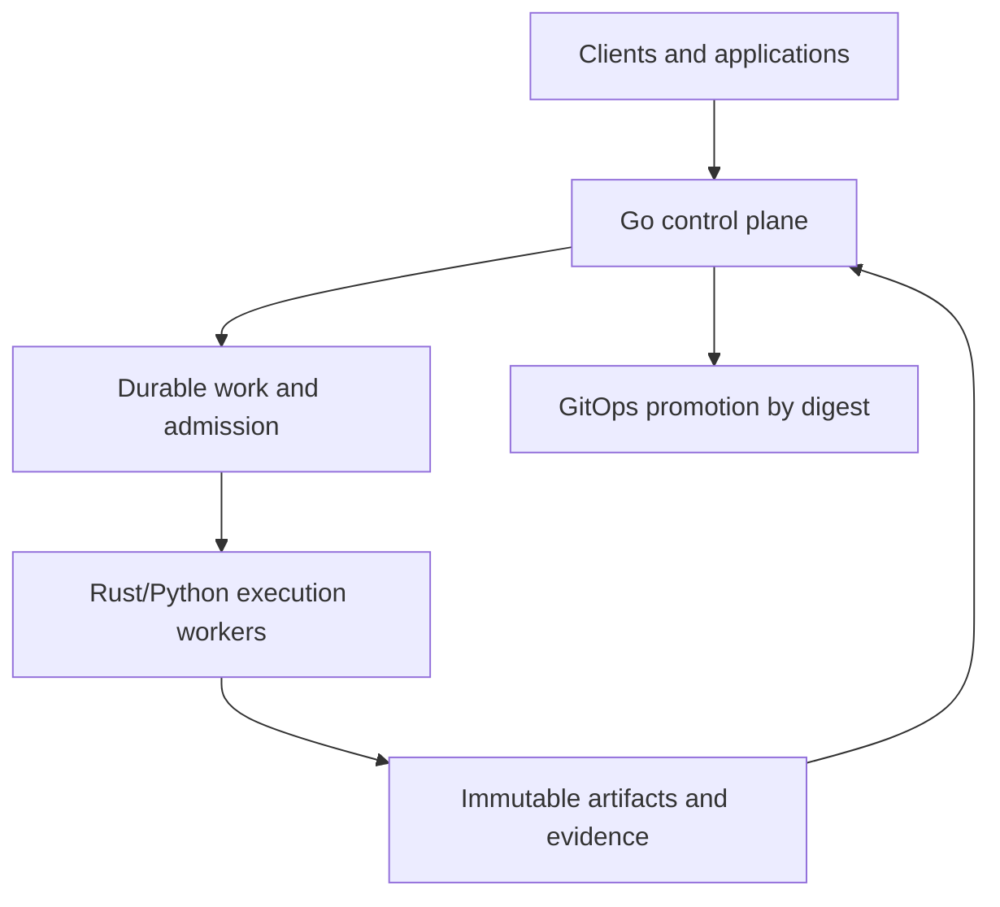
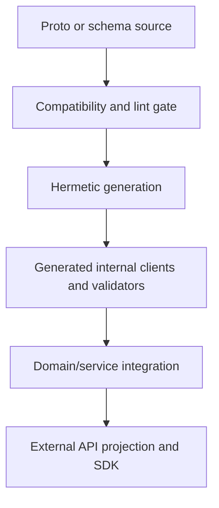
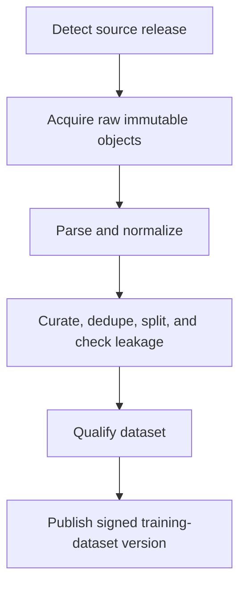
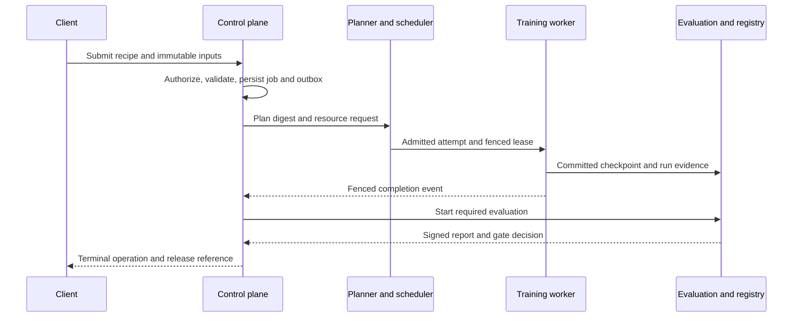
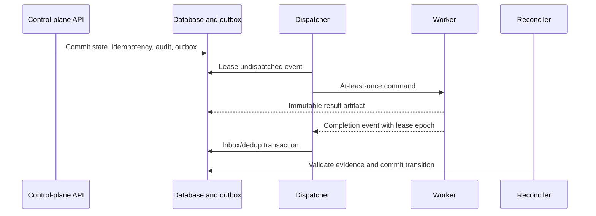
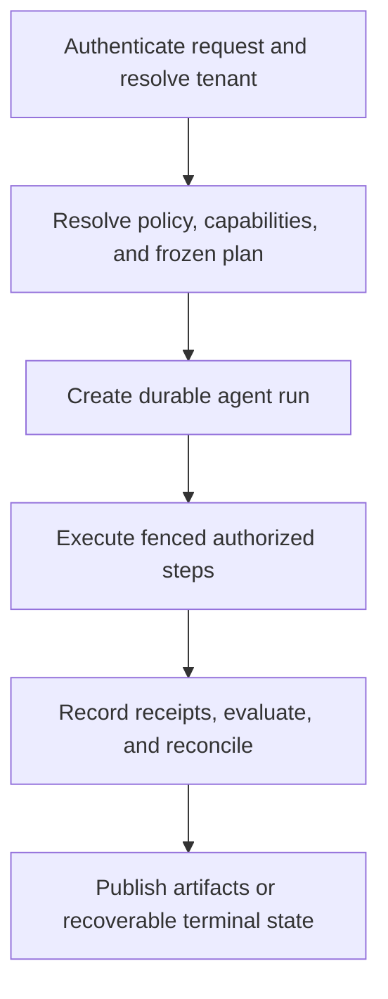
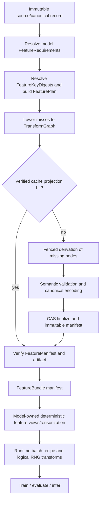
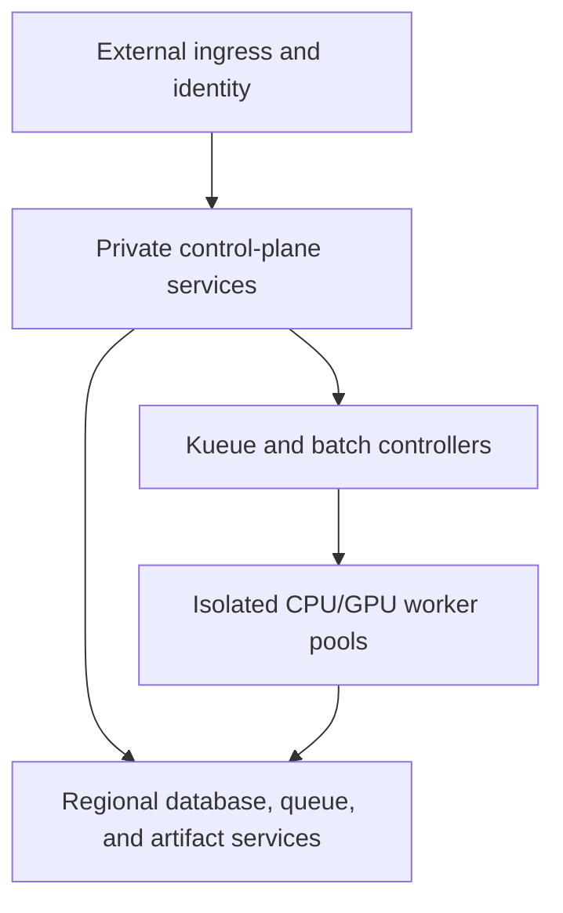

# Mindclade Monorepo Authoritative Architecture and Implementation Blueprint

| Document control | Value |
|---|---|
| Document ID | `MC-ARCH-001` |
| Version | `3.4.3` |
| Status | Authoritative approved architecture; bounded founder-bootstrap and native-source incubation active in source only, connected qualification pending |
| Scope | Mindclade public product-source monorepo plus platform, biological-agent, data, model, training, evaluation, inference, development-kit, and developer-tooling contracts |
| Audience | Founding engineers, ML researchers, computational biologists, platform engineers, security, safety, operations, product engineering, and technical leadership |
| Effective date | 2026-08-30 |
| Supersedes | MC-ARCH-001 version 3.4.2 |
| Review cadence | Quarterly and on any constitutional trigger in Appendices A34.16, A34.17, or A35.20 |
| Repository evidence reviewed | Greenfield canonical repository and five operational source repositories inspected on 2026-08-30; public GitHub Free repository-level founder bootstrap and the bounded kernels/native source-incubation exception are authorized in source only, while connected-state, operator activation, and implementation qualification remain pending |

> **Authority note:** Version 3.4.3 is the single design authority. Sections 1–18 contain the reconciled implementation contract. Appendices A1–A40 provide normative domain detail. ADR-0008 and FBE-0001 authorize a bounded, expiring, single-use founder bootstrap and Wave 1 source work without granting production authority or connected qualification. ADR-0009 narrowly permits an expiring kernels/native TARGET source-incubation surface without satisfying Wave 5, JIT-06, operator activation, dispatch, publication, or qualification gates. The editable architecture sources are the ordered files declared by docs/architecture/blueprint/manifest.yaml; the combined blueprint is their deterministic full render. docs/architecture/repository-path-manifest.yaml is the sole machine-readable repository-path authority, and Appendix A6 is its generated, human-reviewable explicit tree. Any source/render/manifest mismatch fails architecture validation. When wording conflicts, the architecture constitution, Sections 1–18, and an explicitly superseding ADR take precedence in that order. A target tree or planned wave is future state until direct repository and qualification evidence proves implementation.

## Contents

1. [Executive summary](#1-executive-summary)
2. [Goals, non-goals, principles, and system invariants](#2-goals-non-goals-principles-and-system-invariants)
3. [Architecture overview](#3-architecture-overview)
4. [Authoritative repository tree](#4-authoritative-repository-tree)
5. [Ownership and dependency matrix](#5-ownership-and-dependency-matrix)
6. [Contract and compatibility model](#6-contract-and-compatibility-model)
7. [Detailed system designs](#7-detailed-system-designs)
8. [End-to-end execution flows](#8-end-to-end-execution-flows)
9. [Security and trust model](#9-security-and-trust-model)
10. [Reliability and operational model](#10-reliability-and-operational-model)
11. [Build, test, CI/CD, and release architecture](#11-build-test-cicd-and-release-architecture)
12. [Deployment architecture](#12-deployment-architecture)
13. [Developer workflows](#13-developer-workflows)
14. [ADR index and decision log](#14-adr-index-and-decision-log)
15. [Phased implementation plan](#15-phased-implementation-plan)
16. [Verification and acceptance matrix](#16-verification-and-acceptance-matrix)
17. [Risks, technical debt, deferred work, and blockers](#17-risks-technical-debt-deferred-work-and-blockers)
18. [Glossary](#18-glossary)
19. [Normative domain appendices](#appendix-a1--executive-decision)

---

## 1. Executive summary

Mindclade SHALL use a domain-first polyglot monorepo to develop and operate generative models and bounded agents for programmable biology. The architecture joins scientific semantics, contract sources, implementation, qualification, and release metadata in one atomic change boundary while keeping live environment state and foundational cloud trust in separately controlled repositories.

The default production shape is a Go modular control-plane monolith plus specialized Rust and Python workers. It is not a microservice fleet. Python/PyTorch owns models, training, evaluation, inference semantics, and scientific workflows; Rust owns biological parsing, feature construction, bulk transfer, and CPU-sensitive data paths; Go owns durable workflow state, reconciliation, authorization, policy enforcement, and Kubernetes control; TypeScript owns supported applications and browser/server client experience. Protobuf owns internal RPC, durable commands, events, and lifecycle contracts. JSON Schema owns manifests, evidence, and human-authored configuration. If later activated, qualified TileLang/CUDA implementations sit behind operation contracts with PyTorch reference implementations and mandatory fallback.

Reusable feature computation follows the same authority model. `bio/` owns canonical biological and reusable semantic feature meaning; `data/featurization/` owns derivation planning, materialization, cache projection, coverage, and publication; `workers/feature_worker/` executes fenced derivations; model families own only model-specific feature requirements, deterministic views, tensorization, and packing. Feature cache state is reconstructible acceleration over immutable artifacts and manifests, never a fifth system of record or a model-named mutable directory.

Feature derivation is a specialization of the repository-wide transform dataflow contract rather than a second DAG engine. `data/transforms/` owns the generic typed `TransformGraph`, semantic/execution identity separation, planning, fitting-state contract, lineage-map compaction, execution adapters, and receipts. `data/featurization/` resolves `FeatureRequirement`s, computes feature-specific identity/cache policy, and lowers `FeaturePlan` into the generic transform graph. Model views and runtime stochastic transforms remain outside shared feature semantics.

The monorepo defines four separate authorities that MUST never be conflated:

| Authority | Canonical source | Operational realization |
|---|---|---|
| Intended code and contracts | protected Git revision in this monorepo | hermetic build closure |
| Durable business and workflow state | control-plane relational database | transactions, audit, idempotency, outbox |
| Immutable scientific and execution evidence | content-addressed object storage plus catalog metadata | signed manifests and digests |
| Live environment desired state | separately protected GitOps/environment repositories | reconciled GKE and cloud resources |

This document is an approved target architecture, not evidence that the target exists. Version 3.4.3 reconciles 2,488 canonical paths against the greenfield repository, its Wave 0 governance sources, and the five operational source repositories. The 386 Wave 1 paths remain target-only and absent. ADR-0008, `FounderBootstrapException/v1`, and FBE-0001 establish the `FOUNDER_BOOTSTRAPPED` source-only state for the public GitHub Free repository-level profile; `production_authority` remains `false`. That source authority does not prove connected GitHub controls, independent review, signed CI evidence, later-wave capabilities, deployment, or production readiness. Those claims remain `INCONCLUSIVE` until their named executable gates pass.

### 1.1 Finalization outcomes

This revision makes the following material reconciliations:

| Issue | Authoritative resolution |
|---|---|
| Fragmented chapter milestones | Section 15 is the sole cross-repository implementation sequence. Appendix milestones are capability-local qualification guidance only. |
| Optional paths versus no empty scaffolds | Section 4 lists required namespaces and an activation-gated path register. A conditional path MUST NOT exist before its first real target and owner. |
| Reserved Go/Rust SDK directories | Removed from the active tree. Public Go/Rust SDKs are deferred and create their directories only after an approved consumer and compatibility commitment. |
| Competing training frameworks | Native PyTorch is the only production execution substrate. Other frameworks are qualified capability providers or intake sources behind Mindclade contracts. |
| Training lifecycle terminology | `Operation`, `Job`, `Run`, `Attempt`, `Workload`, `Phase`, `ExecutablePlan`, `Checkpoint`, and `Release` have one definition in Section 6. |
| Generated code ambiguity | Protobuf generated sources are committed under `protocols/generated/` and drift-checked; build-derived validators, OpenAPI bundles, and published SDK transports are generated reproducibly and handled as stated in Section 6. |
| Deployment ownership ambiguity | `deploy/` owns service-shipped Kubernetes packages, local integration, and CRDs. It MUST NOT contain production overlays, cluster foundations, secrets, or live desired state. |
| Agent architecture gap | `agents/`, MADK, control-plane entities, worker boundaries, tool receipts, sandboxing, policy, evaluation, and release evidence are first-class parts of the lifecycle. |
| Development-kit duplication risk | MCDK–MADK are governed façades over canonical domains; they own authoring experience and assemblies, never scientific or operational truth. |
| Blueprint status ambiguity | All design statements are classified as approved target, wave scope, deferred, prohibited, or evidence-backed implemented. No item is `IMPLEMENTED` without repository and test evidence. |
| Wave 0 governance load | Wave 0 ratifies only seven expensive-to-reverse foundational ADRs. All other decisions are recorded now but receive standalone ADR ratification immediately before the first wave that depends on them. |
| Oversized initial vertical | Wave 2 contains two independently qualifying slices: a local scientific slice and a CPU/local platform slice. Neither waits for the other, Kubernetes, the console, agents, or development kits. |
| Ambiguous first workload | `SQP-001` freezes one protein-only PDB dataset, one reduced Pairformer model, one supervised structure head, one small coordinate-diffusion head, and exact CPU/H100 qualification gates. |
| Premature technology breadth | The critical-path allowlist is native PyTorch, DeviceMesh/DTensor, FSDP2, DCP, NCCL, Kueue/JobSet, and reference PyTorch kernels. All named provider/optimization systems remain intake candidates until a measured gap exists. |
| Premature contract stabilization | Wave 1 freezes only the cross-system contract kernel. Dataset, model, checkpoint, evaluation, inference, agent, kit, kernel, and deployment schemas stabilize with their owning waves. |
| Migration before evidence | The first Wave 0 artifact is a repository drift report covering the actual tree, dependency graph, ownership, contracts, releases, duplicate authorities, and compatibility-aware moves. |
| Repository-estate ambiguity | The monorepo tree now includes an exhaustive activation-stub contract. Repo-local `mindclade/.github/` is distinct from the organization `.github` repository, and `.github`, `github-config`, `bootstrap`, `infrastructure-live`, and `gitops` each have a canonical file tree, sole owner, apply identity, state boundary, test gates, and recovery behavior. |
| Cross-model feature-cache ambiguity | Reusable biological feature meaning is owned by `bio/`; derivation/materialization and cache projection are owned by `data/featurization/`; models own only model-specific feature views/tensorization. `FeatureKeyDigest` captures complete derivation semantics, immutable feature artifacts are CAS-addressed, cache indexes are reconstructible and tenant/policy partitioned, and stochastic runtime transforms never masquerade as ordinary durable feature cache entries. |
| Feature/data transform ambiguity | Transform composition is now explicit and layered: `data/transforms/` owns transform graph/spec/execution contracts, existing `data/{normalization,curation,deduplication,splits,sampling,...}` packages own their domain semantics, `bio/featurization/` owns reusable semantic feature transforms, models own model-view transforms, and training/inference own runtime batch transforms. `TransformSpec`, `TransformGraph`, and `TransformReceipt` make cardinality, ordering, state, determinism, RNG, schema, snapshots, lineage, and side effects explicit without introducing a universal workflow or feature-store authority. |
| Repository-tree completeness | Appendix A6 now enumerates every approved target file path explicitly. Brace-expansion shorthand is prohibited in authoritative trees; previously namespace-only leaf stubs now list their concrete first-file surfaces or are represented as generated-output paths. The five operational repository trees are likewise fully expanded. Future private files are not silently implied: adding one updates the machine-readable path manifest in the same change. |
| Repository-tree authority duplication | `docs/architecture/repository-path-manifest.yaml` is now the machine-readable path authority. Appendix A6 remains fully explicit but is generated deterministically from that manifest; CI compares manifest, rendered tree, actual populated paths, owners, waves, Bazel targets, and activation status. |
| Duplicate feature/transform planners | `TransformGraph` is the sole generic dataflow graph/planner substrate. `FeaturePlan` is a feature-domain request/evidence artifact that lowers into a constrained `TransformGraph`; `data/featurization/` no longer owns a parallel cycle/partition/execution planner. |
| Fitted-transform state gap | `TransformStateArtifact`, `FitSemanticKey`, and `FitReceipt` make fit/apply transforms explicit for normalization statistics, vocabularies, calibration state, learned projections, clustering state, and other fitted data transformations. Evaluation can prove fitting scope and prevent leakage. |
| Transform identity ambiguity | Transform semantic identity is separated from `TransformExecutionPlanDigest`. Backend, worker count, partitioning, fusion, spill, and materialization placement are execution choices unless a contract explicitly makes them semantic. |
| Transform-spec ceremony | A small common `TransformSpec` base now has typed profiles for map, filter, explode, join, aggregate, fitted, semantic-feature, and runtime-stochastic transforms. Class-specific fields are mandatory only where relevant. |
| Registry terminology ambiguity | `FeatureCatalog` and `TransformCatalog` own semantic declarations; `ImplementationRegistry` owns qualified executable implementations; `ArtifactCatalog` owns published immutable artifact metadata. Generic runtime plugin discovery is not an authority. |
| Model/training feature boundary | Model bundles now distinguish `FeatureRequirementSetRef`, `ModelFeatureViewRef`, input contract, and output contract. Training receives model-view outputs before task-owned runtime batch transforms; `TrainingTask` cannot rediscover semantic features or model tensorization. |
| Corpus-scale lineage overhead | Persisted transforms may reference a compact `LineageMapArtifact`/membership index that deterministically reconstructs per-sample lineage instead of emitting billions of expanded edges. |
| Remote feature/transform protocol breadth | Remote commands carry immutable plan/graph artifact references plus `AttemptId`, `LeaseEpoch`, and deadline; queue messages do not embed large transform graphs or feature payloads. |
| Materialization inefficiency | Transform planning may use non-semantic cost hints for compute, read I/O, output size, reuse, fan-out, and recovery value. Cost estimates may alter execution/materialization choices but never semantic identity. |
| Blueprint maintenance load | The combined blueprint remains the full review artifact but is generated from ordered, smaller source files plus machine-readable manifests. Humans edit the smaller sources; CI renders and verifies the combined document. |

### 1.2 Normative language and precedence

`MUST` and `MUST NOT` are mandatory. `SHOULD` is the default and requires a recorded, owner-approved exception to deviate. `MAY` is optional within all surrounding controls.

When provisions conflict, precedence is:

```text
law, contracts, privacy, security, and biological-safety obligations
→ architecture constitution in Appendix A34
→ Sections 1–18 of this document
→ approved superseding ADR with migration and expiry
→ normative domain appendices
→ examples and informative implementation notes
```

An ADR cannot waive law or safety. Exact dependency versions belong in lockfiles and release evidence, not prose. The architecture owner SHALL update this document when an ADR changes a constitutional or cross-domain decision.

### 1.3 Readiness vocabulary

| Label | Meaning | Required evidence |
|---|---|---|
| `IMPLEMENTED` | Present and conforming in the identified repository revision | source target, tests, owner, build evidence, and relevant qualification |
| `TARGET` | Approved architecture; implementation may be absent | this specification and accepted ADR |
| `WAVE-n` | Target committed to implementation wave n | prerequisites and exit gate in Section 15 |
| `DEFERRED` | Deliberately outside the critical path | activation criteria, owner, and no placeholder code |
| `PROHIBITED` | Violates an invariant | policy rule or constitutional provision |
| `INCONCLUSIVE` | Evidence needed to decide is unavailable or insufficient | named missing evidence and verification owner |

### 1.4 Production-readiness conclusion

The architecture is source-ready under the bounded founder-bootstrap exception. The system is not connected- or production-ready. Wave 0 MUST bind these target decisions to the actual repository, produce the authoritative repository drift baseline, create machine-readable ownership and dependency metadata, establish contract/build baselines, and independently ratify the eight foundational ADRs in Section 14 before `CONNECTED_QUALIFIED`. Production use remains prohibited until the applicable wave gates and Section 16 acceptance evidence pass.

---

## 2. Goals, non-goals, principles, and system invariants

### 2.1 Goals

The monorepo SHALL:

1. permit atomic changes from biological semantics through models, execution, contracts, clients, and release evidence;
2. make every production capability discoverable, owned, buildable, testable, and releasable from a clean checkout;
3. preserve correctness and lineage across duplicate delivery, retry, preemption, process failure, and topology-changing restart;
4. support proteins, RNA, DNA, small molecules, and complexes without creating separate platform stacks;
5. keep scientific and numerical semantics independent of control-plane, scheduler, cloud, and provider implementations;
6. deliver secure multi-tenant training, evaluation, inference, data, and agent workflows with attributable cost and auditable decisions;
7. qualify optimized implementations against transparent reference paths before use;
8. promote immutable, signed artifacts rather than rebuilding per environment; and
9. keep the simplest deployable topology that satisfies isolation, scale, and reliability evidence; and
10. reuse deterministic biological feature derivations safely across model families through explicit semantic contracts, complete derivation identities, immutable artifacts, and model-owned tensor views.

### 2.2 Non-goals

This architecture does not attempt to:

- create one programming language, package manager, database, or release version for the repository;
- make Bazel replace `uv`, Cargo, the root Go module, `pnpm`, Buf, or Nix in their authority domains;
- expose internal Protobuf APIs directly as a permanent public product API;
- allow notebooks, dashboards, Kubernetes status, caches, vector indexes, or provider metadata to become sources of truth;
- create a universal workflow engine, universal plugin framework, universal tensor IR, or cloud-portability abstraction ahead of two real implementations;
- execute arbitrary user code or unqualified customer tools inside trusted data, training, inference, or model workers;
- guarantee bitwise identity across all hardware; required tolerances are operation- and release-specific;
- pre-create public Go/Rust SDKs, live elasticity, RL/post-training, NVMe offload, Monarch orchestration, or specialized schedulers without activation evidence; or
- treat research output as production code without graduation and qualification;
- create a separate feature-store, model-named cache hierarchy, or mutable tensor directory that competes with `bio/`, `data/`, the artifact catalog, or model feature contracts; or
- persist ordinary training-time crops, masks, diffusion noise, augmentations, device casts, or other runtime stochastic views as if they were reusable semantic features.
- make the monorepo, internal SDKs, models, datasets, or generated artifacts open-source or publicly distributable by default.

### 2.3 Principles

- **One semantic owner.** A concept may have adapters and representations, but only one package owns its meaning.
- **One durable truth.** Each mutable lifecycle has one transactional authority; everything else is a projection, cache, lease, or evidence record.
- **Contract before coupling.** Cross-process and cross-language communication uses versioned contracts, not shared database tables or source structs.
- **Reference before optimization.** Scientific and numerical paths obtain correctness evidence before accelerated implementations are eligible.
- **Observed state is not desired state.** Workers and Kubernetes report observations; the Go control plane commits business transitions.
- **Artifacts cross trust boundaries.** Large or durable payloads move by immutable digest with integrity and provenance, not through queue bodies.
- **Build once, qualify once, promote by digest.** Environment promotion never rebuilds a release.
- **Subtraction before abstraction.** A new shared package, plugin seam, provider interface, or service requires two real consumers or a security/process boundary.
- **Fail closed at policy boundaries.** Missing identity, tenant, policy, qualification, or evidence denies the action.
- **Reconstruct from evidence.** A terminal scientific result must be explainable from immutable inputs, plans, versions, observations, and approvals.
- **Derive by semantic identity.** A feature cache hit is valid only when the complete declared derivation identity matches; path, sample name, model alias, and “latest” are never sufficient identities.
- **Views are not meaning.** Shared semantic feature values are independent of model tensor layout; model-specific tensorization and packing remain with the model/runtime consumer.
- **Proprietary by default.** Mindclade-authored source and internal distributions use the repository's proprietary internal-use license; any public distribution is a separate reviewed release decision with all third-party, data, safety, privacy, and export obligations satisfied.

### 2.4 System invariants

1. Every request carries an authenticated principal, `TenantId`, `ProjectId`, request ID, and trace context before domain processing.
2. Every state-changing API accepts an idempotency key scoped to tenant, principal, method, and canonical request hash.
3. A worker cannot transition a durable `Job`, `Run`, `AgentRun`, dataset release, or model release directly; it emits a fenced completion event that reconciliation validates.
4. A queue message is a delivery hint, never the record of work. The relational database and immutable plan/artifact references are authoritative.
5. A mutable alias never identifies a production input. Production inputs are immutable IDs and digests.
6. A committed checkpoint refers only to complete, integrity-verified objects and a committed progress frontier. Uncommitted objects are garbage-collectable.
7. Training commits input progress only with the corresponding optimizer update or with a replay-safe receipt protocol.
8. An optimized kernel or provider is selectable only for a qualified hardware/software envelope and MUST fall back safely or reject explicitly.
9. Agent model output and tool output are untrusted data. They cannot grant permissions, change budgets, select an unapproved capability, or bypass schema validation.
10. Tenant isolation is enforced in authorization, database row policy/query guards, queues, object prefixes or buckets, encryption context, cache keys, logs, and cost labels.
11. Raw restricted biological payloads and secrets MUST NOT appear in logs, traces, queue metadata, prompts, or audit diffs.
12. Generated code is never hand-edited. Generation is hermetic and drift-checked.
13. Production packages MUST NOT import `research/`; `libs/python` MUST remain torch-free.
14. Source packages MUST NOT import deploy or live-environment state. Deployment consumes release metadata, never the reverse.
15. A directory exists only with a named owner, a real target, tests appropriate to maturity, and machine-readable component metadata.
16. Cancellation is cooperative and deadline-bound; it never discards a committed artifact or fabricates success.
17. Deletes of durable scientific evidence are retention state transitions with audit and tombstones, not immediate opaque erasure.
18. No release is promoted without the exact evidence policy named by the release manifest.
19. Every durable reusable feature value is described by a versioned `FeatureContract`, complete provenance, and an immutable artifact/manifest digest; physical cache location is not semantic identity.
20. A deterministic derivation requested with the same `FeatureKeyDigest` MUST produce the same canonical output digest. Divergent output is a determinism violation and is quarantined rather than accepted as an ordinary race.
21. Cache lookup isolation is at least tenant/policy/security-domain aware even when identical authorized content may deduplicate in CAS; cache existence MUST NOT disclose a cross-tenant artifact.
22. Runtime-stochastic feature views are derived from explicit logical RNG identities and are not durable shared cache entries unless a contract explicitly classifies them as seeded, cacheable artifacts.
23. `FeaturePlan` is the feature-domain requirement/cache-resolution artifact, but every executable feature miss MUST lower to the single generic `TransformGraph` substrate; a second feature-specific graph planner, partition engine, or executor is prohibited.
24. Any learned or fitted preprocessing state is an immutable `TransformStateArtifact` produced by an explicit `FitSemanticKey`/`FitReceipt`; ambient mutable estimator state and fit-on-evaluation behavior are prohibited.
25. `TransformSemanticKey` identifies transform meaning and immutable semantic inputs, while `TransformExecutionPlanDigest` identifies backend, partitioning, fusion, spill, and materialization choices. Execution-plan changes MUST NOT alter semantics unless the affected choice is promoted into the semantic contract and creates a new semantic identity.
26. `docs/architecture/repository-path-manifest.yaml` and `docs/architecture/blueprint/manifest.yaml` are machine-readable authorities for repository paths and architecture composition respectively; Appendix A6 and the combined blueprint are deterministic generated views and drift is a presubmit failure.

---

## 3. Architecture overview

### 3.1 Planes and process boundaries



| Plane | Owns | Does not own | Primary processes |
|---|---|---|---|
| Experience | user interaction, SDK ergonomics, documentation | authorization decisions, durable truth | TypeScript apps; Python/TypeScript SDKs |
| Control | identity resolution, policy, durable lifecycles, quotas, reconciliation, outbox | scientific algorithms, GPU math | Go control-plane and runtime-gateway processes |
| Execution | parsing, feature work, training, evaluation, inference, agent step execution | business success transitions | Rust/Python workers and GPU processes |
| Evidence | immutable objects, manifests, catalog, signatures, retention state | workflow orchestration | object store, relational metadata, release tooling |
| Environment | cluster/cloud desired state and promotion | building or reinterpreting artifacts | separate foundation and GitOps repositories |

The control plane is synchronous at request validation and transaction boundaries, then asynchronous for durable work. A synchronous API may create and return an `Operation`; it MUST NOT hold an HTTP/RPC connection open for training, batch inference, data publication, or agent workflows. Online inference is the exception: it may use a synchronous or streaming data path through the runtime gateway, while any durable output artifact is published asynchronously and referenced in the response.

### 3.2 Language and trust boundaries

| Boundary | Permitted mechanism | Prohibited mechanism |
|---|---|---|
| Go service ↔ Rust/Python worker | Protobuf command/event plus immutable artifact reference | shared service database writes; language FFI for business workflow |
| Python ↔ Rust in-process hot path | narrow PyO3/ABI binding owned under `bio/bindings/` or `runtime/extensions/`, with parity and memory-safety tests | arbitrary cross-domain native extension |
| Service ↔ client | versioned external HTTP/OpenAPI façade and SDK | database schema, internal event, or internal Protobuf leakage |
| Worker ↔ object store | workload identity, scoped signed reference, digest verification | ambient user credential or mutable public URL |
| Agent ↔ tool | registered tool contract, delegated capability token, sandbox, receipt | shell/network access inherited from agent process |
| Monorepo ↔ environment repo | signed image/chart/schema digest and promotion evidence | copying source, rebuilding, or carrying long-lived cloud credentials |

### 3.3 Canonical authorities

| Question | Source of truth |
|---|---|
| Biological entity and reusable semantic feature meaning | `bio/` schemas, `bio/featurization/` contracts/catalog, and conformance corpus |
| Source acquisition, curation, split, feature materialization/cache projection, and dataset release | `data/` manifests, derivation plans, and catalog transactions |
| Model mathematics, model-specific feature requirements/views, and logical parameter state | `models/` package and model manifest |
| Training objective, phase, update, and checkpoint semantics | `training/` contracts and checkpoint manifest |
| Evaluation metric and promotion gate meaning | `evaluation/` suite and signed report |
| Inference preprocessing, decoding, ranking, and output meaning | `inference/` pipeline contract |
| Agent workflow, tools, policies, and step meaning | `agents/` definition, workflow, tool, and policy contracts |
| Durable operation and resource lifecycle | Go control-plane relational state |
| Kernel operation semantics | reference operation in `kernels/` |
| Deployed version | live GitOps commit referencing signed digests |

### 3.4 Deployment units

Source packages do not imply processes. The initial production deployment contains:

- one replicated Go `control-plane` composition root;
- one replicated Go `runtime-gateway` for authenticated online and streaming execution admission;
- one Rust `artifact-proxy`/transfer process where high-throughput transfer justifies it;
- Rust ingestion and feature-worker images;
- Python training, evaluation, inference, and agent-worker images;
- managed relational database, object storage, queue/event transport, cache only where reconstructible, and observability collectors; and
- Kubernetes batch resources admitted through Kueue and materialized with JobSet or plain Jobs according to workload topology.

A package becomes a separate service only when it needs an independent failure domain, trust boundary, scaling curve, data authority, or release cadence and the split has an approved ADR and migration. Code organization alone is not evidence for a service.

### 3.5 Initial critical-path technology allowlist

The production critical path is deliberately narrow. A technology being discussed in an appendix or capability catalog does not make it an active dependency.

| Status | Technology/capability | Permitted use before activation |
|---|---|---|
| `ACTIVE` | native PyTorch | model, autograd, optimizer, single-process and distributed execution substrate |
| `ACTIVE` | DeviceMesh/DTensor and FSDP2 | native topology, placements, sharding, and data-parallel execution after their owning wave |
| `ACTIVE` | PyTorch Distributed Checkpoint | checkpoint storage/planning behind Mindclade checkpoint semantics |
| `ACTIVE` | NCCL | qualified CUDA collective transport; not a lifecycle owner |
| `ACTIVE` | Kueue and JobSet | batch quota/admission and coordinated Kubernetes workload materialization beginning in Wave 5 |
| `ACTIVE` | PyTorch reference kernels | required correctness path for every initial model operation |
| `INTAKE` | TorchTitan | implementation patterns and selectively adopted upstream components; no independent control plane |
| `DEFERRED` | Megatron Core, DeepSpeed, Transformer Engine, TorchAO, Lightning/Fabric, TorchForge, Monarch, TileLang, custom CUDA optimization | research/intake evaluation only; no production dependency, package, configuration surface, or compatibility commitment |

An intake capability activates only after profiling or a concrete workload proves a named gap; the owning wave defines a Mindclade contract, reference comparison, state/checkpoint/recovery mapping, security/license review, measurable benefit threshold, rollback, and removal path. Wave 6 is the earliest default activation point for optimized providers and kernels. Kueue/JobSet are the only listed technologies that activate earlier for a process boundary rather than measured numerical performance.

---

## 4. Authoritative repository tree

`docs/architecture/repository-path-manifest.yaml` is the machine-readable authority for file-level path completeness. Appendix A6 is its deterministic complete explicit render, while the compact tree in this section is authoritative only as an ownership/dependency summary. All describe target paths, not observed current paths. A path is created only in its activation wave with at least one real build target; generated and release-output files remain generator-owned and are never hand-authored.

```text
mindclade/
├── .buildkite/                # authoritative heavy CI planning and execution
├── .github/                   # repo-local GitHub metadata and thin workflow bridges only
├── .devcontainer/             # generated/tested local container profile
├── .vscode/                   # non-authoritative editor recommendations
├── MODULE.bazel               # repository integration graph
├── BUILD.bazel                # root policy/validation targets
├── flake.nix                  # pinned system-tool environment
├── justfile                   # discoverable developer command façade
├── protocols/                 # Protobuf, events, JSON Schema, compatibility baselines
│   ├── proto/mindclade/{common,artifact,job,dataset,feature,transform,experiment,model,training,inference,evaluation,agent,workflow,policy,admin}/v1/
│   ├── events/mindclade/{artifact,job,feature,transform,model,training,agent,workflow,audit}/v1/
│   ├── schemas/{artifact_manifest,evidence_manifest,release_manifest,configuration}/
│   ├── schemas/{dataset_manifest,feature_contract,feature_requirement_set,feature_manifest,feature_bundle,model_feature_view,checkpoint_manifest,model_manifest,evaluation_snapshot}/
│   ├── schemas/{transform_spec,transform_graph,transform_receipt,transform_execution_plan,transform_state_artifact,fit_receipt,lineage_map,training_recipe,training_phase_graph,executable_plan,kernel_qualification}/
│   ├── schemas/{agent_definition,tool_contract,agent_policy,workflow_definition,agent_run_manifest}/
│   ├── generated/{go,python,rust,typescript}/       # committed, generated
│   └── compatibility/{baselines,tests}/
├── libs/{python,rust,go,typescript}/                   # narrow cross-domain foundations
├── bio/{schemas,entities,formats,chemistry,sequences,structures,alignments,featurization,bindings}/
├── data/{contracts,connectors,ingestion,normalization,curation,validation,deduplication,leakage,splits,sampling,transforms,featurization,catalog}/
├── runtime/{distributed,dispatch,memory,precision,compilation,rng,extensions,diagnostics,testing}/
├── kernels/{api,dispatch,attention,pairformer,diffusion,normalization,qualification,benchmarks}/
├── models/{api,components,families,packaging,conversion,qualification}/
├── training/
│   ├── api/                         # task, phase, program, state, precision, parallelism contracts
│   ├── core/{trainer,state,optimization,data,callbacks}/
│   ├── execution/{ir,planning,passes,schedules,native,single_process}/
│   ├── providers/pytorch/
│   ├── checkpointing/               # domain-specific checkpoint contract and coordinator names
│   ├── tasks/{pretraining,supervised,contrastive,diffusion,flow,multitask,distillation}/
│   ├── {precision,evaluation,telemetry,resilience,qualification,recipes,cli}/
│   └── tests/
├── evaluation/{contracts,harness,metrics,suites,datasets,regression,reports,fixtures}/
├── inference/{contracts,pipeline,batching,sampling,compilation,postprocessing,confidence,ranking,artifacts,diagnostics}/
├── agents/
│   ├── contracts/                   # definitions, capabilities, decisions, state
│   ├── tools/{definitions,adapters,schemas,permissions,receipts,qualification}/
│   ├── policies/{authorization,biological_safety,budgets,approvals}/
│   ├── workflows/{definitions,planning,execution,compensation}/
│   ├── state/{events,snapshots,memory_references,lineage}/
│   ├── biological/{discovery,design,analysis,qualification}/
│   ├── runtime/{coordination,step_execution,approval_gates,budget_enforcement,replay}/
│   └── evaluation/{simulation,adversarial,regression}/
├── services/
│   ├── control_plane/{cmd/control-plane,internal,migrations,tests}/
│   ├── runtime_gateway/{cmd/runtime-gateway,internal,tests}/
│   └── artifact_proxy/{src,tests}/
├── workers/{ingestion_worker,feature_worker,training_worker,evaluation_worker,inference_worker,agent_worker}/
├── sdk/{python,typescript,conformance,examples}/
├── kits/{mcdk,mddk,mmdk,mtdk,medk,madk,assembly,conformance,cli}/
├── apps/{console,admin,docs}/
├── deploy/{components,local,integration,policies,tests}/
├── research/{notebooks,prototypes,ablations,studies,papers,fixtures}/
├── tests/{conformance,integration,end_to_end,distributed,failure_injection,performance,security}/
├── tools/{bazel,ci,codegen,dev,repo,release,qualification,migration,generators,licenses}/
├── docs/{architecture,adr,domains,standards,developer,security,runbooks,operations,model_cards,dataset_cards}/
├── examples/{sdk,data_connector,model_extension,training_smoke,inference,agent_workflow}/
└── third_party/{patches,licenses,notices,source_mirrors}/
```

`docs/architecture/repository-path-manifest.yaml` is the machine-readable authority for approved repository paths, owners, activation waves, maturity, generated/source status, and expected build/test targets. Appendix A6 is the deterministic full explicit rendering of that manifest and MUST show every approved target file; it is not a separately hand-maintained path authority. CI regenerates the A6 tree and fails on any source/render/actual-path mismatch. “Complete” means every approved namespace, composition root, contract source, repository-control file, generated target path, and required first-PR stub is named. It does not freeze unapproved future private implementation files. Adding a domain-specific private file inside an approved component requires updating the path manifest in the same change but does not require an ADR when ownership, dependency, contract, and release boundaries do not change.

Every deployable has exactly one composition root: `services/*/cmd/`, `workers/*/<language>/main.*`, or a Bazel-declared binary with equivalent domain-specific naming. Domain libraries MUST NOT start servers, create global clients, read ambient configuration, or own process shutdown.

### 4.1 Top-level ownership and maturity

| Path | Semantic owner | Initial maturity | Release behavior |
|---|---|---|---|
| `.buildkite/` | developer platform | internal trusted pipeline source | no product release; pipeline revisions are audited evidence |
| `.github/` | developer platform with security review | repo-local control metadata | no product release; only thin GitHub-native checks and Buildkite bridge |
| root workspace/toolchain files | developer platform | stable build contract | lock/toolchain changes qualify with affected release units |
| `protocols/` | contract governance | minimal kernel stable after Wave 1; domain packages stabilize with owning waves | schema packages and generated internal clients; no repo-wide version |
| `libs/` | developer platform | internal stable | language packages released only when externally consumed |
| `bio/` | computational biology | qualified core | source packages and versioned biological schemas |
| `data/` | data platform | qualified core | dataset manifests and worker libraries; datasets release independently |
| `runtime/`, `kernels/` | ML systems/performance | experimental → qualified | runtime package and per-envelope kernel bundles |
| `models/` | model architecture | experimental → released family | model package, bundle, and model release |
| `training/` | training systems | qualified internal | recipe/plan/checkpoint schemas and worker image |
| `evaluation/` | evaluation science | stable gates | suite packages and immutable evidence reports |
| `inference/` | inference systems | qualified | inference worker/gateway image and output schemas |
| `agents/` | agent platform with safety co-ownership | experimental → qualified | agent/tool/workflow/policy releases and MADK assembly |
| `services/` | platform control plane | production service | independently versioned images and migrations |
| `workers/` | owning execution team | production deployable | independently versioned images |
| `sdk/` | developer experience | supported public | SemVer Python and TypeScript packages |
| `kits/` | developer experience plus mapped domain | supported authoring façade | independently versioned assemblies; no domain truth |
| `apps/` | product engineering | production application | application bundles/images |
| `deploy/` | platform operations | release input | service-shipped charts/bases only |
| `research/` | research | non-production | no production release or inbound production dependency |
| `tests/`, `tools/`, `docs/`, `third_party/` | developer platform / relevant reviewers | internal | evidence, tooling, documentation, controlled vendoring |

### 4.2 Activation-gated paths

The following paths are `DEFERRED` and MUST NOT be pre-created. Their first PR requires a concrete consumer, owner, contract, tests, deletion condition, and ADR where the dependency graph changes.

| Conditional path | Activation criterion |
|---|---|
| `sdk/go/`, `sdk/rust/` | approved external consumer plus a funded compatibility and release commitment |
| `training/tasks/reinforcement/`, `training/rl/` | approved post-training workload with reward, rollout, policy-version, safety, and evaluation contracts |
| `training/orchestration/monarch/` | measured need for independently scaling distributed roles that native JobSet topology cannot meet |
| `training/resilience/live_elasticity/` | topology-changing restart evidence is insufficient and live membership change has a proven workload benefit |
| `training/offload/nvme/` | memory/cost study shows host offload is insufficient and data-loss/recovery behavior is qualified |
| non-PyTorch provider packages | a capability gap, adapter design, reference parity suite, and removal/rollback plan are approved |
| `training/autotune/` | a real systems-tuning consumer and bounded search-space contract exist |
| `protocols/schemas/autotune_record/`, `protocols/schemas/rollout_manifest/` | their corresponding systems-tuning or post-training capability is activated |
| `services/webhook_dispatcher/` | an external webhook product surface exists with delivery SLO and abuse controls |
| `services/event_dispatcher/` | outbox throughput or isolation evidence justifies extraction from the modular monolith |
| cloud-provider adapters beyond GCP | a funded deployment with two-provider conformance tests exists |

### 4.3 Development-kit mapping

| Kit | Canonical owners | Languages | Public output and release unit | Location and boundary |
|---|---|---|---|---|
| MCDK | `deploy/`, infrastructure contract owners | Go CLI, JSON Schema | `EnvironmentPlan` and deployment assembly | `kits/mcdk/`; may have a separately released binary, but live state remains outside this repo |
| MDDK | `bio/`, `data/` | Python, Rust-backed CLI | source, curation, dataset, and evidence assembly | `kits/mddk/`; invokes canonical validators and workers |
| MMDK | `models/`, `bio/`, `kernels/` | Python | model definition/package templates and model assembly | `kits/mmdk/`; no alternate model registry |
| MTDK | `training/`, `runtime/` | Python | recipe/plan/checkpoint developer workflow | `kits/mtdk/`; no alternate trainer lifecycle |
| MEDK | `evaluation/` | Python | suite, metric, snapshot, and evidence assembly | `kits/medk/`; no separate promotion policy |
| MADK | `agents/` with policy/safety owners | Python and TypeScript façade | agent/tool/workflow/policy assembly and simulator | `kits/madk/`; no alternate durable agent store |
| Mindclade SDKs | service/API owners and developer experience | Python, TypeScript | supported runtime client packages | `sdk/`; wraps external API, operations, artifacts, and agent sessions |

All kit assemblies conform to `protocols/schemas/development_kit_assembly/`. A kit MAY be published from a separate distribution repository only when that repository consumes a signed monorepo-built assembly by digest, contains no copied domain implementation, and passes the same conformance suite. Examples and templates are versioned with the kit but MUST pin contract ranges and immutable artifacts. Kit qualification includes clean-project generation, schema validation, supported-version compatibility, no hidden network access, and end-to-end execution against a local or integration profile.

### 4.4 Operational repository estate

One repo-local control directory and five separately protected repositories complete the source-to-production chain. They are not product packages and MUST NOT be imported by product code. Their complete trees, implementation contracts, transaction law, and qualification gates are in Appendix A3.8–A3.17 and Appendix A6.

| Canonical name | Form | Sole authority | Forbidden authority |
|---|---|---|---|
| `mindclade/.github/` | directory in this monorepo | repo-local issue/PR metadata, least-privilege GitHub workflow entrypoints, required-check bridge | shared organization workflows, organization settings, heavy builds, releases, deployment |
| `.github` | organization repository | shared community-health files, pinned reusable workflows/actions, organization profile | repository rulesets, cloud resources, product source, release promotion |
| `github-config` | separate governance repository | GitHub organization/repository/team/ruleset/environment/Actions/OIDC desired state | workflow implementation, application manifests, cloud or Kubernetes desired state |
| `bootstrap` | separate root-trust repository | minimum cloud state backend, identity federation roots, KMS/signing anchors, audit roots, break-glass and recovery | normal networks, clusters, databases, application deployment, routine promotion |
| `infrastructure-live` | separate infrastructure repository | normal cloud projects, networking, GKE, managed data services, registries, observability backends, CI/GitOps controller infrastructure | application source, Kubernetes workload release selection, artifact rebuild |
| `gitops` | separate deployment repository | cluster/environment Kubernetes desired state and digest-only application promotion | source compilation, cloud foundations, mutable image tags, business state |

The only permitted forward handoffs are signed source/build evidence from `mindclade` to deployment verification, bootstrap outputs referenced by `github-config` or `infrastructure-live`, infrastructure capability exports consumed by `gitops`, and signed release manifests consumed by `gitops`. No downstream repository writes back into source, rebuilds a subject, or copies domain configuration.

---

## 5. Ownership and dependency matrix

### 5.1 Acyclic dependency law

Compile-time dependencies flow downward in this order; runtime calls may flow in either direction only through a versioned protocol and an authorized endpoint:

```text
apps and examples
→ SDKs and development-kit facades
→ worker/service composition roots
→ agents, evaluation, inference, and training
→ models, data, kernels, and runtime
→ bio domain
→ narrow language foundations and generated contracts
→ protocol/schema source definitions
```

This diagram is a partial order, not permission for every higher layer to import every lower layer. `services/` uses generated contracts and Go foundations; it MUST NOT import Python/Rust scientific implementations. `workers/` are composition roots and may import their owning domain libraries. `agents/` calls model, inference, data, and evaluation capabilities through registered ports or services; it MUST NOT import their private implementations. `evaluation/` may depend on public model/inference contracts, but production inference and model code MUST NOT depend on evaluation suites. `deploy/` consumes release metadata; production source never imports `deploy/`.

### 5.2 Ownership and dependency matrix

| Capability | Sole semantic owner | May depend on | Forbidden dependencies |
|---|---|---|---|
| Contract definitions | `protocols/` | schema/protobuf runtimes only | domain or service implementation |
| Cross-domain foundations | language lane in `libs/` | generated contracts, stdlib, approved foundational dependencies | business/scientific domains; PyTorch in `libs/python` |
| Biological truth and reusable feature semantics | `bio/` | `libs/`, schemas | data workflows, model-specific tensor layouts, services |
| Data lifecycle, generic transform dataflow, and feature materialization/cache projection | `data/` | `bio/`, `libs/`, contracts, artifact APIs | model/training internals, model-specific tensorization, service database |
| Runtime primitives | `runtime/` | `libs/`, hardware/runtime APIs | model objective, service policy |
| Kernel semantics | `kernels/` | `runtime/`, `libs/`, operation schemas | training lifecycle, service state |
| Model semantics and model-specific feature views | `models/` | `bio/`, `kernels/`, `runtime/`, `libs/` | data-pipeline implementation, training engine, service implementation |
| Training semantics | `training/` | models, data public contracts, kernels, runtime, bio | Go control-plane internals, apps, research |
| Evaluation meaning | `evaluation/` | public model/inference/bio contracts, data snapshots | trainer callbacks as authority, mutable production aliases |
| Inference meaning | `inference/` | models, kernels, runtime, bio | network authorization, service database |
| Agent meaning | `agents/` | generated contracts, bio types, capability ports, policy foundations | private model/data/service implementations, unrestricted tools |
| Durable operations | `services/control_plane/` | generated Go contracts, Go foundations, DB/queue adapters | scientific implementation, worker-local state as truth |
| Online admission | `services/runtime_gateway/` | auth/policy, generated contracts, routing/admission adapters | inference mathematics |
| Execution composition | `workers/*` | matching domain packages, generated clients, telemetry | direct business-state mutation |
| Client experience | `sdk/` | external generated transport, public schemas | internal events, database models |
| Authoring experience | `kits/` | public domain contracts/validators/CLIs | copied domain logic or durable state |
| Product UI | `apps/` | supported SDKs and design system | direct service database/generated internal client |
| Deployment package | `deploy/` | release descriptors and config schemas | live environment secrets/state, source-code authority |

### 5.3 Enforcement

Every package has `component.yaml` declaring owner, maturity, public targets, allowed dependency classes, data classification, build/test/release targets, SLO/runbook links when deployable, and active exceptions. Bazel visibility enforces the graph; language-native linting catches imports not visible to Bazel; a repository aspect compares actual edges with metadata. CI rejects cycles, undeclared cross-language FFI, production-to-research imports, public imports from `internal/`, direct database access outside the owning service, and new top-level paths without architecture approval.

Tests may depend on fixtures and test-support targets, never on another domain's private production code. A temporary cycle exception requires a time-bounded ADR, named owner, edge list, migration sequence, and CI-visible expiry. New shared packages require two production consumers and a stable responsibility; otherwise code remains with its owner.

---

## 6. Contract and compatibility model

### 6.1 Contract authority

| Concern | Authority | Representation | Consumer rule |
|---|---|---|---|
| Internal RPC, commands, lifecycle resources, events | `protocols/proto/` and `protocols/events/` | Protobuf packages with major version in package name | use generated client; never copy message structs |
| Artifact, dataset, feature requirement/manifest/bundle, transform spec/graph/execution-plan/state/receipt/lineage, checkpoint, model, evaluation, plan, tool, workflow, agent, configuration | `protocols/schemas/` | JSON Schema 2020-12 with stable `$id` and `schema_version` | validate on every trust boundary; store schema ID with document |
| External product API | service-owned projection | OpenAPI generated from an explicitly curated façade | SDK wraps transport; internal messages do not leak |
| Service persistence | owning service migrations | relational DDL and constraints | private implementation; no shared database client across services |
| In-process scientific API | owning domain package | typed Python/Rust/Go interfaces | semantic owner controls compatibility |
| GPU operation | `kernels/api/` plus reference implementation | typed operation/signature/capability contract | optimized implementations register only after qualification |

JSON Schema is used for inspectable, durable, human-authored, or artifact-carried documents. Protobuf is used for bounded messages and service interaction. Large arrays, model weights, features, datasets, and reports are never embedded in either; they are immutable artifacts referenced by digest and media type.

### 6.2 Canonical identifiers and terminology

Identifiers are opaque, globally unique, lowercase string values with a type prefix in text form. Database keys may use UUIDv7 or equivalent sortable binary representation, but clients never infer time, tenant, or type from bytes. Artifact identity is a cryptographic digest, not a mutable database ID.

| Term | Definition and lifetime |
|---|---|
| `Operation` | client-visible long-running command record; created atomically with the requested resource or rejection; reaches one terminal result |
| `Job` | durable desired work and policy envelope owned by the control plane; may have multiple runs after explicit retry/resume |
| `Run` | one logical execution with frozen inputs, configuration, and plan; training and agent runs have specialized manifests |
| `Attempt` | one fenced lease/admission epoch for a run; duplicate or stale attempts cannot commit |
| `Workload` | scheduler-specific execution materialization such as a Kubernetes Job/JobSet; reconstructible from plan and attempt |
| `Phase` | named node in a versioned training or workflow phase graph; not a scheduler status |
| `ExecutablePlan` | immutable, validated mapping from semantic work to topology, providers, resources, and qualified capability digests |
| `Snapshot` | immutable view of an external source, dataset input set, evaluation input set, or logical state at a defined frontier |
| `Checkpoint` | atomically committed model/training logical state plus progress frontier and integrity manifest |
| `Artifact` | immutable bytes plus manifest addressed by digest; catalog metadata may add discovery without changing bytes |
| `Release` | immutable subject digest plus policy version, qualification evidence, approval, signature, and revocation state |

Required IDs include `TenantId`, `ProjectId`, `PrincipalId`, `RequestId`, `TraceId`, `OperationId`, `JobId`, `RunId`, `AttemptId`, `WorkloadId`, `PlanId`, `PhaseId`, `ArtifactDigest`, `FeatureRequirementSetDigest`, `FeatureKeyDigest`, `FeatureBundleDigest`, `ModelFeatureViewDigest`, `TransformSemanticKey`, `TransformExecutionPlanDigest`, `FitSemanticKey`, `TransformStateArtifactDigest`, `FitReceiptDigest`, `LineageMapArtifactDigest`, `DatasetVersionId`, `ModelReleaseId`, `CheckpointId`, `AgentDefinitionId`, `AgentVersion`, `AgentRunId`, `AgentStepId`, and `LeaseEpoch`. The same names and types MUST be used in Protobuf, schemas, SDKs, database mappings, events, logs, and examples.

### 6.3 Lifecycle contracts

Generic long-running resources use these states:

```text
Operation: PENDING -> RUNNING -> {SUCCEEDED | FAILED | CANCELLED}
Job:       ACCEPTED -> VALIDATING -> PLANNED -> QUEUED -> RUNNING
           -> {SUCCEEDED | FAILED | CANCELLED}
           with RUNNING -> RECOVERING -> QUEUED for a policy-approved resume
Run:       CREATED -> READY -> ADMITTED -> EXECUTING -> FINALIZING
           -> {COMPLETED | FAILED | CANCELLED}
Attempt:   LEASED -> STARTING -> ACTIVE -> DRAINING
           -> {COMPLETED | FAILED | PREEMPTED | FENCED | CANCELLED}
Release:   DRAFT -> QUALIFYING -> CANDIDATE -> APPROVED -> PUBLISHED
           -> {SUPERSEDED | REVOKED}
```

Transitions are allow-listed database operations with expected version and actor. Terminal states are immutable except release revocation/supersession, which creates a new audited transition without rewriting prior evidence. Retry creates a new attempt or run according to policy; it never rewinds a terminal record in place.

### 6.4 Representative common contract

```proto
message ResourceIdentity {
  string tenant_id = 1;
  string project_id = 2;
  string resource_id = 3;
  int64 resource_version = 4;
}

message CommandContext {
  string request_id = 1;
  string idempotency_key = 2;
  string principal_id = 3;
  string traceparent = 4;
  google.protobuf.Timestamp deadline = 5;
}

message EventEnvelope {
  string event_id = 1;
  string event_type = 2;
  uint32 event_version = 3;
  ResourceIdentity subject = 4;
  google.protobuf.Timestamp occurred_at = 5;
  string producer = 6;
  uint64 lease_epoch = 7;
  bytes payload = 8;
  string payload_digest = 9;
}
```

Events are immutable facts in past tense. Consumers deduplicate by `event_id`, verify subject tenant and schema, and update projections transactionally. Unknown event versions are quarantined, not partially interpreted. Queue delivery is at least once; handlers therefore MUST be idempotent.

### 6.5 Code generation flow



Protobuf outputs for Go, Python, Rust, and TypeScript are committed under `protocols/generated/` with generator headers because they are consumed across native workspaces and must be reviewable without running toolchains. CI regenerates them in a clean environment and fails on drift. Their public API is still the source `.proto`, never the generated layout.

JSON Schema validators, database bindings, OpenAPI bundles, documentation, and SDK transport layers are produced by Bazel into declared outputs. A released SDK may include generated transport source in its package, but hand-authored façade code lives under `sdk/<language>/src/` and is tested against the service compatibility matrix. Build outputs are not committed unless an ecosystem requires source distribution and the exception is documented. Generated files are never edited manually.

### 6.6 Compatibility policy

- Protobuf package majors use `mindclade.<domain>.vN`. Within a major, additions MUST be backward compatible; field numbers and enum values are never reused; deletion follows reserve-and-deprecate. A breaking change creates `vN+1` and a dual-read/dual-write migration.
- Internal rolling deployments MUST support the currently deployed schema and the immediately preceding compatible schema. An event consumer supports all non-retired event versions present in the retention window.
- JSON Schema has immutable `$id`, explicit semantic `schema_version`, canonical serialization rules, and migration functions. Readers MUST accept the current and immediately preceding minor version; long-lived artifacts retain readers or an offline migration for every supported release.
- External APIs and Python/TypeScript SDKs use SemVer. A released SDK minor supports the current service API and the previous service minor. Breaking removals require deprecation for at least two SDK minor releases and 90 days unless an active security issue requires faster revocation.
- Model, dataset, checkpoint, kernel, agent, tool, workflow, policy, and kit releases are independently versioned and identified by digest. Compatibility is declared as machine-readable constraints, not inferred from names.
- Database migrations are expand/migrate/contract. A deployable remains compatible with the previous database schema during rollout and rollback.

### 6.7 Idempotency, consistency, and deadlines

A command transaction inserts or reads the idempotency record, validates canonical request hash, mutates the resource, writes audit, and inserts outbox rows atomically. Reuse of a key with a different hash returns a conflict. Idempotency records live at least as long as the maximum client retry and event-redelivery window and longer for irreversible publication commands.

All mutating resources use optimistic versioning. Worker commits additionally require matching `AttemptId` and `LeaseEpoch`. Deadlines are absolute UTC timestamps propagated across RPC, queue command, and worker context. Cancellation is a desired-state transition; dispatchers and workers acknowledge it, stop at safe points, commit valid partial evidence where allowed, and terminate within the workload-specific grace period.

### 6.8 Contract stabilization schedule

Wave 1 stabilizes only the cross-system contract kernel:

```text
identifiers and ResourceRef
CommandContext and EventEnvelope
Operation, Job, Run, and Attempt
ArtifactRef and EvidenceRef
idempotency, resource version, and LeaseEpoch
configuration resolution and redacted configuration digest
ReleaseManifest
```

The kernel defines extension-safe envelopes and references, not placeholder fields for future domains. Domain contracts stabilize just in time with their first real vertical: biological identity and dataset contracts in Wave 2S; inference request/result in Wave 2P; feature/transform/model/training/checkpoint/evaluation contracts at Wave 2S qualification and Wave 3 graduation; fitted-transform state contracts only with their first exercised fit/apply workload; bounded remote feature/transform command/event protocols in Wave 4; distributed topology/plan contracts in Wave 5; kernel/provider contracts in Wave 6; agent/tool/workflow contracts in Wave 7; kit and deployment contracts immediately before their first supported release.

Before stabilization, a domain schema remains experimental, cannot be consumed by a supported external SDK, and carries no long-term compatibility promise. After stabilization, Section 6.6 applies. No future schema directory or generated client is created merely to reserve a name.

Appendices A9, A10, A18, A19, A23, and A28 contain the detailed build, protocol, service, SDK, artifact, and database contracts.

---

## 7. Detailed system designs

The rules in Sections 2, 5, 6, 9, and 10 apply to every system and are not repeated in each contract card. The appendix references are normative elaborations. “Owner” means semantic owner; a service or worker that hosts the code does not acquire its meaning.

### 7.1 Repository architecture and dependency law

**Owner and location.** Developer Platform owns root build files, `tools/repo/`, `tools/bazel/`, the component catalog, and dependency-policy enforcement. Domain teams own their packages and metadata. Architecture Council owns top-level namespace and exceptions. Detailed contract: Appendices A3–A9, A29, A33, and A34.

**Responsibilities.** The repository integration graph MUST make ownership, public surfaces, test closure, release closure, data classification, and dependency direction queryable. Native workspaces retain dependency-resolution authority; Bazel integrates them without inventing a second version graph. A clean checkout with pinned Nix/toolchain inputs MUST reproduce declared source artifacts without undeclared network reads.

**Non-responsibilities.** Repository automation does not contain product behavior, live environment state, or scientific semantics. `libs/` does not absorb domain code. A source directory is not a deployable unless it has a composition root.

**Lifecycle and failure.** A component progresses `PROPOSED -> EXPERIMENTAL -> INTERNAL -> SUPPORTED -> DEPRECATED -> RETIRED`. Creation and promotion are PR-reviewed metadata transitions. Missing owner, cycle, undeclared generator, visibility escape, stale exception, or irreproducible output fails presubmit. Tooling failure may fall back to native local commands for development, but never for release evidence.

**Security, operations, extension, qualification.** Protected branches, signed CI identity, least-privilege registries, dependency review, secret scanning, license policy, and artifact provenance protect the build boundary. Graph size, cache hit rate, build latency, flaky targets, exception age, and orphaned components are operational signals. New language lanes or top-level domains require an ADR, toolchain owner, hermetic build/test/release support, and an acyclic placement. Qualification requires clean-checkout builds on Linux CPU and the relevant GPU profile, native/Bazel lock agreement, zero graph cycles, and exact generated-code drift checks.

### 7.2 Protocols, schemas, generated code, SDKs, and compatibility

**Owner and location.** Contract Governance owns `protocols/` and the compatibility baseline. A domain owner owns semantic fields in its package. Developer Experience owns `sdk/python/` and `sdk/typescript/`; service owners own the curated external API projection. Detailed contract: Appendix A10 and A19.

**Responsibilities and boundaries.** Contract source defines identifiers, commands, resources, events, manifests, errors, pagination, deadlines, and cancellation. SDKs expose stable resource-oriented APIs, typed long-running operations, artifact helpers, and agent sessions. They MUST hide transport retries and generated transport layout without hiding terminal error detail or idempotency semantics. SDKs do not own policy, lifecycle, or scientific meaning.

**Flows and persistence.** Compatibility is checked before generation. Generated internal clients are linked by domain libraries and services. External OpenAPI is projected from an explicit API surface, then SDK transports are generated and wrapped. Compatibility baselines and schema fixtures are versioned in Git; released descriptors, SDK packages, and attestations are immutable artifacts. Breakage produces a new major or migration, never an in-place reinterpretation.

**Failure, security, observability, extension, qualification.** Unknown fields are preserved where the implementation permits; unknown enum values are handled as `UNRECOGNIZED` and cannot authorize action. Invalid or over-limit payloads fail before business processing. Contract metrics include decode failures, unsupported versions, client-version distribution, and deprecated-field use without recording sensitive bodies. A new schema type needs an owner, canonical examples, size limits, data classification, compatibility rules, fuzz/cross-language conformance, and one real consumer. Release gates are Buf lint/breaking checks, JSON Schema meta-validation, golden round trips across all generated languages, OpenAPI diff, SDK integration tests, and clean generation.

### 7.3 Identity, authentication, authorization, tenancy, and audit

**Owner and location.** Security Platform owns identity and authorization foundations in `libs/go/auth/`, `services/control_plane/internal/policies/`, common policy contracts, and audit primitives. Each domain owns its action/resource vocabulary. The control-plane database owns durable grants, memberships, service principals, policy versions, and audit index; Google Identity Platform owns initial human authentication for development, staging, and production. Detailed contract: Appendices A18, A26, A28, A37, and A38.

**Authentication.** Human users authenticate through Google Identity Platform OIDC with phishing-resistant MFA for privileged actions. Local and hermetic tests use a Mindclade-controlled fake issuer with the same validation contract. Workloads use short-lived workload identity; CI uses federated OIDC. Static cloud keys are prohibited. The ingress verifies issuer, audience, signature, expiry, nonce where applicable, and token binding/context before producing an internal `PrincipalContext`. Tenant and project are resolved server-side from authorized membership, never trusted from a client claim alone.

**Authorization.** Services evaluate `Authorize(principal, action, resource, context, policy_version)` before reading sensitive metadata, issuing artifact access, or creating work. Deny overrides allow. High-risk dataset publication, model promotion, agent tool activation, policy change, secret access, and destructive retention transitions require step-up or dual approval according to policy. Workers receive narrow delegated capability tokens bound to tenant, job/run/step, artifact prefixes, actions, deadline, and lease epoch. They cannot mint or broaden capabilities.

```go
type AuthorizationRequest struct {
    Principal PrincipalContext
    TenantID  TenantID
    Action    Action
    Resource  ResourceRef
    Context   DecisionContext
    Policy    PolicyVersion
}

type AuthorizationDecision struct {
    Allowed       bool
    ReasonCode    string
    Obligations   []Obligation
    DecisionID    string
    PolicyDigest  string
}
```

**Tenancy and audit.** Every row and artifact reference is tenant-scoped; globally shared scientific assets use an explicit platform tenant and grant model. Tenant context is mandatory in transaction helpers and cache keys. Cross-tenant aggregation requires a separately authorized, privacy-reviewed path. Audit records are append-only, tamper-evident, time-synchronized, and include actor, tenant, action, resource, request, decision ID, policy digest, result, and safe diff metadata—not secrets or biological payload. Authentication failure, deny rate, cross-tenant guard rejection, privileged action, grant change, and audit-delivery lag are monitored.

**Failure and qualification.** Identity-provider outage fails new privileged operations closed; safe validation of already-admitted bounded workloads may continue until delegated tokens expire. Policy-engine timeout denies. Revocation propagates within the configured maximum of five minutes for interactive access and at the next safe boundary for long workloads, with immediate cancellation for critical revocation. Qualification includes confused-deputy, horizontal/vertical privilege escalation, tenant-crossing property tests, token replay, key rotation, policy rollback, audit completeness, and red-team tool abuse.

### 7.4 Control plane, durable state machines, reconciliation, and outbox

**Owner and location.** Control Plane owns `services/control_plane/`, resource tables, migrations, transaction helpers, reconcilers, outbox, idempotency, leases, quotas, and Kubernetes adapters. Scientific domains own work semantics; workers own execution observations. Detailed contract: Appendices A18, A24, and A28.

**Transaction model.** PostgreSQL-compatible relational storage is the sole durable business-state authority. Each mutating command runs one transaction that: locks or version-checks the resource; inserts/validates the idempotency record; authorizes; writes the desired-state transition; appends audit metadata; and writes one or more outbox rows. Publishing occurs after commit. The dispatcher uses `FOR UPDATE SKIP LOCKED` or an equivalent lease, publishes at least once, and marks delivery with compare-and-swap. Consumers deduplicate.

```go
type UnitOfWork interface {
    WithTx(ctx context.Context, fn func(Tx) error) error
}

func AcceptJob(ctx context.Context, tx Tx, cmd AcceptJobCommand) (Job, error) {
    key, err := tx.Idempotency().Claim(ctx, cmd.Scope(), cmd.RequestHash())
    if err != nil { return Job{}, err }
    job, err := tx.Jobs().InsertAccepted(ctx, cmd.Job())
    if err != nil { return Job{}, err }
    if err = tx.Audit().Append(ctx, JobAcceptedAudit(job, cmd)); err != nil { return Job{}, err }
    if err = tx.Outbox().Append(ctx, ValidateJobEvent(job)); err != nil { return Job{}, err }
    return job, tx.Idempotency().Complete(ctx, key, job.Ref())
}
```

**Reconciliation and fencing.** A reconciler compares desired durable state, latest fenced worker observation, scheduler observation, and deadlines. It issues idempotent actions and records a condition/reason rather than overwriting facts. Each dispatch obtains monotonically increasing `LeaseEpoch`; completion with a stale epoch is retained as evidence but cannot advance state. Kubernetes objects include resource/attempt IDs and plan digest; deletion/recreation is safe because workload state is reconstructible.

**Failures and recovery.** Transaction rollback emits nothing. Commit-before-publish is recovered by outbox scan. Publish-before-ack causes duplicate delivery and is handled by consumer idempotency. Lost heartbeat expires the lease and enters reconciliation; retry policy chooses new attempt, checkpoint resume, failure, or manual intervention. Poison events enter a tenant-scoped dead-letter/quarantine store with alert and replay tool. Cancellation updates desired state first, then signals the scheduler/worker. Control-plane SLOs cover API availability/latency, transaction conflict rate, outbox age, queue age, reconciliation convergence, lease expiry, and stuck state.

**Scaling and qualification.** Stateless API replicas scale horizontally; transaction isolation and advisory/row locks serialize a resource, not the whole service. Reconcilers shard by stable resource hash and use leader election only where external APIs require it. Qualification injects duplicate/reordered events, dispatcher crashes, database failover, scheduler loss, stale leases, partial artifact publication, cancellation races, and rolling-version skew.

### 7.5 Data ingestion, biological parsing, curation, lineage, and publication

**Owner and location.** Data Platform owns `data/` lifecycle and dataset catalog. Computational Biology owns `bio/` meanings, Rust parsers, normalized entity/feature schemas, and conformance. Ingestion/feature workers host execution. Object storage holds immutable objects; the catalog transaction owns release state. Detailed contract: Appendices A11 and A12.

**Responsibilities and non-responsibilities.** Connectors detect source releases and record license/usage metadata; ingestion retrieves bytes resumably; Rust parsers preserve source fidelity; normalization maps to canonical biological entities; curation, deduplication, leakage controls, split assignment, validation, and feature construction produce versioned derived artifacts. Data does not define model architecture or silently correct biological semantics. `bio/` does not schedule acquisition or publish datasets.

```rust
pub trait SourceConnector {
    fn discover(&self, cursor: SourceCursor) -> Result<Vec<SourceRelease>, ConnectorError>;
    fn fetch(&self, object: &SourceObject, sink: &mut dyn ResumableSink)
        -> Result<FetchReceipt, ConnectorError>;
}

pub trait BiologicalParser<I, O> {
    fn parse(&self, input: I, policy: ParsePolicy) -> Result<Parsed<O>, ParseError>;
}
```

**Lifecycle and consistency.** A source snapshot moves `DISCOVERED -> ACQUIRING -> ACQUIRED -> PARSED -> NORMALIZED -> CURATED -> QUALIFIED -> PUBLISHED`, with `REJECTED`, `QUARANTINED`, and `REVOKED` terminal/exception states. Each stage writes immutable outputs and a manifest that references input digests, code revision, schema, policy, and receipts. Publication atomically inserts the released dataset version and its manifest digest after verifying all referenced objects, qualification evidence, licenses, leakage policy, and approvals. Split membership is deterministic from stable biological identity plus split-policy version.

**Failure and recovery.** Fetches resume by byte range/chunk receipt; checksum mismatch quarantines bytes. Parser errors are typed and preserve source location without logging restricted payload. A failed stage retries from immutable inputs; successful outputs may be reused only when the complete cache key, policy, code, and schema match. Source correction creates a new snapshot/version; published artifacts are not mutated. Revocation blocks new use, identifies dependent releases through lineage, and triggers policy-defined quarantine/requalification rather than deleting evidence.

**Security, signals, extension, qualification, scaling.** Connectors use egress allowlists and scoped credentials. Data classification/license/use policy propagates through every manifest. Metrics cover source lag, bytes, checksum failure, parse error taxonomy, quarantine rate, duplicate/leakage rate, stage age, cost, and publication latency without payload labels. A connector extension implements discovery/fetch contracts, rate limits, provenance, fixtures, license review, and sandboxed parsing. Qualification uses golden biological corpora, fuzz/property tests, cross-language entity parity, reproducibility, leakage adversarial tests, lineage closure, and publication rollback. Rust stages scale by object/shard; global dedupe/split stages use deterministic partitioning and explicit merge manifests.

### 7.6 Model architecture, packaging, registry, and release lifecycle

**Owner and location.** Model Architecture owns `models/api/`, components, families, logical state mapping, packaging, and conversion. Artifact/Release owns registry metadata; Evaluation owns promotion evidence. Detailed contract: Appendix A13.

**Responsibilities.** A model family defines configuration, architecture, input/feature contract, outputs, capabilities, logical state schema, initialization, loss-relevant outputs, and conversion. It MUST be executable under the reference single-process path and packageable as a self-describing bundle. Models do not own training loops, data acquisition, scheduling, service APIs, or release approval.

A model bundle separates **semantic requirements** from **model representation**. `FeatureRequirementSetRef` names the reusable semantic information the released model accepts; `ModelFeatureViewRef` names the model-owned deterministic mapping from those semantic features into logical model inputs. The `input_contract` describes the resulting model input surface. This separation permits model tensor views to evolve without mutating biological feature meaning or forcing `data/` to import model implementation.

```python
@dataclass(frozen=True)
class ModelBundleSpec:
    family: str
    model_config: ArtifactRef
    logical_state_schema: ArtifactRef
    weights: tuple[ArtifactRef, ...]
    feature_requirements: FeatureRequirementSetRef
    model_feature_view: ModelFeatureViewRef
    input_contract: SchemaRef
    output_contract: SchemaRef
    code_digest: str
    compatibility: CompatibilityRange

class MindcladeModel(Protocol):
    def capabilities(self) -> frozenset[str]: ...
    def forward(self, batch: ModelBatch) -> ModelOutputs: ...
    def logical_state(self) -> LogicalStateView: ...
```

**Lifecycle and consistency.** A definition progresses `EXPERIMENTAL -> QUALIFIED -> RELEASE_CANDIDATE -> RELEASED -> DEPRECATED -> REVOKED`. Bundle publication is an atomic catalog transaction over an immutable manifest, weight shards, schema references, code/environment closure, evaluation evidence, model card, safety statement, and signature. Aliases such as `stable` are database pointers with audited compare-and-swap and are never persisted as run inputs.

**Failure, security, operations, extension, qualification.** Unknown state key, shape/dtype mismatch, missing artifact, incompatible `FeatureRequirementSetRef`, `ModelFeatureViewRef`, model input contract, or unqualified custom code fails loading before device allocation. Safe tensor formats are required; arbitrary pickle/code execution is prohibited for external artifacts. Metrics include load failures, conversion parity, memory, numerical health, capability use, and deprecation. A new component stays in its family until two real families share an identical stable contract. Qualification covers reference forward/backward, serialization round trip, conversion parity, determinism envelope, checkpoint compatibility, inference/evaluation regression, safety, resource envelope, and rollback to the previous digest.

### 7.7 Training tasks, phase graphs, execution, checkpointing, and recovery

**Owner and location.** Training Systems owns `training/`; Model teams own model/task implementations under the published training contracts; Control Plane owns durable jobs/admission; Runtime/Kernel owners supply qualified capabilities. Detailed contract: Appendix A14.

**Semantic contracts.** `TrainingTask` owns objective-specific runtime batch interpretation, model invocation, objective terms, normalization units, and metrics. Semantic feature resolution and the released model's `ModelFeatureView` run before the task-owned runtime `BatchRecipe`; a task may crop/mask/augment/pack a `ModelInputSample`, but it MUST NOT rediscover shared features, reinterpret `FeatureContract`s, or implement model tensorization. `CompiledStepProgram` is the frozen executable mapping selected from a recipe, task, model bundle, dataset, topology, precision, providers, schedules, and qualification database. The engine owns lifecycle and execution but cannot change task meaning.

```python
class TrainingTask(Protocol):
    def prepare_batch(self, sample: ModelInputSample, context: TaskContext) -> ModelBatch: ...
    def compute(self, model: MindcladeModel, batch: ModelBatch,
                context: StepContext) -> TaskResult: ...
    def normalization(self, result: TaskResult) -> NormalizationUnits: ...

@dataclass(frozen=True)
class CompiledStepProgram:
    plan_id: str
    phase_id: str
    topology: HardwareTopology
    placements: tuple[Placement, ...]
    precision: PrecisionPolicy
    providers: tuple[QualifiedCapability, ...]
    schedule: ScheduleSpec
    checkpoint_contract: CheckpointContract
```

**Planning and execution.** Submission freezes immutable recipe, dataset, model, environment, and policy references. Validation proves contract compatibility and resource bounds. Planning emits an executable plan and resource request; admission binds it to available qualified hardware without mutating semantics. Native PyTorch materializes DeviceMesh/DTensor/FSDP/tensor/pipeline/expert strategies, executes the phase graph, and records actual capabilities. All ranks agree on plan digest, run/attempt/lease, state registry, precision, and checkpoint generation before stepping.

**Progress and checkpoint consistency.** The committed progress frontier advances only when the corresponding optimizer update is accepted. A checkpoint uses prepare/write/verify/commit: each rank writes immutable shards; a coordinator verifies expected membership, sizes, digests, logical-state keys, optimizer/scaler/RNG/data progress, topology metadata, and parent; then atomically publishes the manifest and checkpoint record. Resume reads only committed checkpoints, migrates schema explicitly, replans allowed topology changes, restores logical state, and proves the first resumed update against the recovery contract.

**Failures, security, observability, extension, qualification, scaling.** Non-finite loss/gradient, collective timeout, rank loss, preemption, storage error, corrupt shard, plan mismatch, or data-receipt conflict triggers the declared fault policy: retry safe operation, checkpoint-and-drain, recover from last committed checkpoint, or fail. A stale lease cannot commit. Training workers have no service DB credentials and receive read/write capability only for declared artifacts. Signals include samples/tokens/effective units, update step, loss/gradient health, utilization, memory, collective time, pipeline bubbles, checkpoint duration/backpressure, retries, recovery gap, and cost. Provider extensions map only declared capabilities and require reference/update/checkpoint/recovery parity. Qualification ascends CPU smoke, single GPU, multi-GPU, multi-node, preemption, topology-changing restart, numerical/statistical equivalence, performance, and long-horizon soak. Live elasticity, RL, NVMe offload, Monarch, and non-native trainer control planes are activation-gated.

### 7.8 Evaluation suites, evidence, regression gates, and promotion

**Owner and location.** Evaluation Science owns `evaluation/`; safety/domain reviewers co-own protected suites and thresholds. Release services store decisions but do not define metric meaning. Detailed contract: Appendix A16.

**Responsibilities and flow.** A suite pins dataset snapshot, cohort/split, metric implementations, uncertainty method, resource profile, safety policy, and acceptance rules. An evaluation request resolves immutable model/dataset/suite digests, creates a snapshot and run, executes isolated shards, reduces deterministically where defined, publishes report/evidence, and supplies a promotion decision input. Evaluation does not mutate a model, select training hyperparameters mid-run, or accept self-reported trainer metrics as release evidence.

```python
class EvaluationSuite(Protocol):
    def snapshot(self) -> EvaluationSnapshot: ...
    def evaluate(self, subject: ModelBundle, batch: EvaluationBatch) -> MetricBatch: ...
    def reduce(self, parts: Sequence[MetricBatch]) -> EvaluationReport: ...
    def decide(self, report: EvaluationReport, baseline: ReleaseRef) -> GateDecision: ...
```

**Lifecycle, failure, security, scaling.** Runs move `CREATED -> SNAPSHOTTED -> RUNNING -> REDUCING -> PUBLISHED` or fail/cancel. Partial shard outputs are immutable but not publishable until completeness and reduction checks pass. Retrying a shard is idempotent by suite/model/dataset/shard digest. Hidden or safety sets use restricted service identities; model workers cannot read labels beyond the required shard. Signals include queue/run age, metric distributions and uncertainty, baseline deltas, missingness, invalid output, cohort coverage, cost, and policy failures. Suites scale by deterministic shard and associative reduction when mathematically valid. Qualification includes metric unit/property tests, goldens, leakage checks, repeated-run stability, cross-version baseline replay, adversarial/safety cases, and gate fail-closed tests.

### 7.9 Online and batch inference

**Owner and location.** Inference Systems owns `inference/` semantics and inference worker composition. Runtime Gateway owns authorization, admission, streaming, quotas, and routing. Detailed contract: Appendix A17.

**Responsibilities and boundaries.** Inference defines input validation, request-to-feature resolution orchestration, model feature-view application, batching compatibility, model execution, candidate generation, confidence, ranking, postprocessing, and scientific artifact schema. Shared semantic `FeatureKeyDigest` construction and materialization obey `bio/`/`data/` authority; inference owns only request/model-view and runtime cache policy above that boundary. The gateway does not implement model math. Inference code does not authenticate users or mutate durable job state. Online calls use a bounded request/stream; batch inference uses the generic `Job/Run/Attempt` lifecycle.

**Flow and state.** Authorization resolves tenant and released model policy. Preprocessing validates schemas and data policy, then resolves shared semantic features through an authorized tenant/policy/security-partitioned `FeatureKeyDigest` projection and applies model-release/view identity only to model-specific derived views. All caches contain only reconstructible state. Admission chooses a qualified deployment and bounded batch class. Execution records model/kernel/environment digests. Candidate artifacts are written before a durable result manifest is committed. Streaming frames include monotonically increasing sequence, request ID, terminal status, and resumable artifact reference where supported.

**Failure, recovery, isolation, signals, extension, qualification.** Overload rejects with retry-after; it does not create unbounded queues. Deadline/cancel propagates to batch scheduler and GPU safe points. Worker failure retries only if no externally committed terminal frame or with an explicit resume token. Cache corruption evicts and recomputes. Tenant fairness uses weighted quotas and per-tenant concurrency; cache and batching never cross incompatible policy/tenant classes. Signals include admission latency, queue time, batch fill, pre/postprocess time, first/last token or candidate latency, GPU utilization, cache hit/corruption, invalid output, fallback, cost, and error class. New samplers/rankers are versioned capabilities. Qualification covers reference parity, request/stream conformance, load/shedding, cancellation, cache isolation, deterministic modes, batch/online agreement, safety, and rollback.

### 7.10 Agents, tools, policy, state, workflows, and sandboxing

**Owner and location.** Agent Platform owns `agents/` contracts/runtime and `workers/agent_worker/`; Security/Safety own policy floors; scientific domains own tool results. Go Control Plane owns durable sessions/runs/steps/approvals/budgets. MADK owns authoring façade only. Detailed contract: Appendix A36.

**Responsibilities and boundaries.** An `AgentDefinition` pins a model capability, workflow, allowed tool-set constraints, memory policy, budgets, approval gates, evaluation policy, and release compatibility. A `ToolContract` declares typed input/output schemas, permissions, data classification, egress, idempotency, side effects, timeout, compensation, sandbox profile, and qualification. Agents orchestrate capabilities; they do not own biological truth, service authorization, inference state, or artifact lineage. Tool adapters never bypass service APIs or artifact controls.

```proto
message AgentRun {
  string agent_run_id = 1;
  string tenant_id = 2;
  string agent_definition_digest = 3;
  string workflow_digest = 4;
  repeated string tool_contract_digests = 5;
  string policy_digest = 6;
  string budget_id = 7;
  AgentRunState state = 8;
  int64 resource_version = 9;
}

message AgentStepCommand {
  string agent_run_id = 1;
  string agent_step_id = 2;
  uint64 lease_epoch = 3;
  string capability_token = 4;
  string input_artifact_digest = 5;
  google.protobuf.Timestamp deadline = 6;
}
```

**Lifecycle and consistency.** An agent release independently versions definition, workflow, tool set, and policy constraints. Run creation freezes their exact digests. `AgentRun` moves `CREATED -> RESOLVING -> READY -> RUNNING -> EVALUATING -> FINALIZING -> COMPLETED`, with `WAITING_APPROVAL`, `PAUSED`, `RECOVERING`, `FAILED`, and `CANCELLED`. Each step is created and budget-reserved transactionally with its outbox command. A fenced worker publishes immutable input/output observation and invocation receipt; reconciliation validates schema, capability, policy, budget, and epoch before committing the step transition and next edge. Memory stores references to governed artifacts/events with provenance, ACL, purpose, retention, and tenant; a vector index is reconstructible and never authoritative.

**Sandbox and safety.** Tools run outside trusted model/data/training processes in a sandbox profile with non-root identity, read-only base image, ephemeral filesystem, seccomp/AppArmor or equivalent, CPU/memory/time limits, explicit egress allowlist, no ambient cloud credential, and delegated artifact/API capabilities. Customer code and arbitrary binaries require a higher-isolation runtime and are deferred until a threat model and qualification exist. Model/tool output cannot select permissions or policy. Biological safety policy evaluates request, plan, each high-risk tool action, output publication, and release. Irreversible or high-risk action pauses for human approval with exact planned effect and expiry.

**Failure, replay, observability, extension, qualification, scaling.** Duplicate step execution is handled by step idempotency and tool side-effect keys. Timeout, policy denial, budget exhaustion, invalid output, tool crash, approval expiry, or sandbox violation follows a typed transition and compensation/recovery policy. Replay reuses frozen inputs/observations without reissuing side effects unless explicitly authorized. Signals include run/step latency, policy decisions, approval wait, tool error/timeout, budget and token/cost use, sandbox denial, replay divergence, artifact lineage, and safety alerts. New tools require schemas, permissions, threat model, receipts, mocks/simulator, idempotency classification, compensation, adversarial tests, and release owner. Agent workers scale by sandbox and model/tool class; one tenant cannot consume another tenant's quota.

### 7.11 GPU kernels, reference implementations, qualification, and fallback

**Owner and location.** Kernel Engineering owns `kernels/`; the model/domain owner approves operation semantics; Runtime owns dispatch infrastructure. Detailed contract: Appendix A15.

**Contract.** Every operation has a readable PyTorch reference, signature including layouts/dtypes/shapes/semantics, forward/backward/autograd contract, numerical tolerance policy, deterministic policy, memory/aliasing rules, capability predicate, and benchmark definition. TileLang/CUDA/C++ implementations register an artifact digest and qualification envelope; model code invokes the operation, never a vendor kernel directly.

```python
class KernelImplementation(Protocol):
    def supports(self, sig: OperationSignature, hw: HardwareProfile) -> SupportResult: ...
    def execute(self, inputs: tuple[Tensor, ...], *, workspace: Workspace) -> KernelResult: ...
    def qualification(self) -> KernelQualificationRef: ...
```

**Dispatch and failure.** Dispatch uses operation version, exact signature, hardware/software profile, determinism/precision policy, and current non-revoked qualification. It selects a qualified implementation or the reference fallback. If no permitted implementation meets resource bounds, it fails explicitly. Runtime autotuning may choose only among prequalified candidates and stores an immutable record keyed by full envelope; it cannot alter math. Illegal memory access, NaN/Inf deviation, timeout, compilation failure, or revocation quarantines the candidate and falls back where safe.

**Security, observability, extension, qualification, scaling.** Kernel sources and binaries are signed; runtime compilation is disabled in restricted production profiles unless sandboxed and attested. Signals include selection/fallback, compile/cache time, latency/throughput, workspace, numerical anomalies, and qualification age. Qualification covers property/golden tests, gradient/second-order behavior where supported, boundary shapes, dtypes, layouts, determinism, sanitizers, fuzzing, multi-GPU interaction, target hardware matrix, performance guardrails, and long-run stability. Performance alone never overrides parity.

### 7.12 Artifact storage, metadata, integrity, provenance, retention, and recovery

**Owner and location.** Artifact Platform owns shared artifact contracts/client libraries and catalog integration; domain owners own manifest semantics. Cloud Operations owns bucket lifecycle/replication. Detailed contract: Appendix A23 and A38.

**Storage and consistency.** Bytes are written to a staging key while a streaming digest and size are computed. Finalization verifies integrity, writes or deduplicates the content-addressed object, then atomically creates catalog metadata and references. A manifest is itself an immutable artifact. The database stores digest, media type, size, tenant/classification, encryption context, state, provenance edges, retention/legal-hold state, and object locations; it does not store large payloads.

```json
{
  "schema_version": "1.0.0",
  "artifact": {"digest": "sha256:<hex>", "size_bytes": 0, "media_type": "application/vnd.mindclade+json"},
  "producer": {"source_revision": "<git-digest>", "build_provenance": "sha256:<hex>"},
  "inputs": [{"digest": "sha256:<hex>", "role": "source"}],
  "policy": {"tenant_id": "ten_...", "classification": "restricted", "retention_class": "scientific-evidence"},
  "integrity": {"algorithm": "sha256", "signature": "<sig-ref>"}
}
```

**Failure and recovery.** Interrupted uploads resume by verified chunks or expire. Catalog rows never point to unverified final objects. Orphan staging objects are swept after a safety window. Missing/corrupt objects trigger quarantine and lineage impact analysis; replicas restore only after digest verification. Deletion marks eligibility, checks references/holds/revocation policy, records a tombstone, and asynchronously removes replicas. Security uses per-environment service identity, tenant/classification authorization, KMS encryption, malware/content validation for untrusted inputs, and short-lived signed access. Signals include integrity failure, finalize latency, orphan bytes, replication age, restore tests, access denies, egress, retention backlog, and cost. Qualification includes concurrent finalize, partial upload, corruption, catalog/object split-brain simulation, cross-region restore, key rotation, legal hold, and provenance closure.

### 7.13 Observability, SLOs, profiling, cost, and incident response

**Owner and location.** Observability Platform owns `libs/*/observability/`, collectors, semantic conventions, and telemetry backend; each component owner owns its instrumentation, SLO, dashboards, alerts, and runbook. Detailed contract: Appendix A25 and A38.

Telemetry uses OpenTelemetry-compatible traces, metrics, and structured logs with stable resource attributes: service/component version, environment, region/cluster, tenant hash or approved tenant label, project, job/run/attempt/step, model/dataset/release digest prefixes where cardinality policy permits, hardware profile, and cost attribution. Trace context propagates through RPC and events. Metrics—not log parsing—drive SLOs. Raw sequences, structures, prompts, tool outputs, credentials, access tokens, signed URLs, and unrestricted manifest bodies are prohibited telemetry fields.

Each service defines availability/latency, each queue defines age/convergence, and each scientific workload defines correctness/throughput/freshness signals. Profiling is opt-in, bounded, redacted, and attributable. Cost is allocated by tenant/project/workload/release/hardware and compared with useful scientific work units. Incident severity, command ownership, communication, evidence preservation, rollback, and post-incident action tracking are in runbooks. New components cannot reach supported maturity without alerts for exhausted error budget, durable backlog, failed reconciliation, integrity/security violations, and resource saturation.

### 7.14 Infrastructure, GCP/GKE, multicloud, and on-premises

**Owner and location.** Security and Cloud Platform own minimum root trust in `bootstrap`; Cloud Platform owns normal cloud desired state in `infrastructure-live`; Platform Operations owns Kubernetes desired state in `gitops`; Developer Platform owns GitHub governance in `github-config`; the monorepo owns service deployment packages in `deploy/` and MCDK contract/tooling in `kits/mcdk/`. Detailed repository contracts and trees: Appendix A3.8–A3.17. GCP runtime profile: Appendix A37.

The primary target is GCP/GKE. The governed environments are development, staging, and production; `us-central1` is the primary region and `us-east4` is the recovery region. Production uses separate projects/accounts and workload identities by environment and trust class, private GKE control/data paths, regional control-plane database, GCS artifact buckets, Artifact Registry, Secret Manager/KMS, a managed queue/event service, and centralized observability export. CPU services, general workers, GPU inference, GPU training, and untrusted/sandboxed agent tools use distinct node pools and service accounts. Kueue owns quota/admission; JobSet/Jobs own batch topology; the Go control plane owns business state. Accelerator quota/capacity and live environment qualification remain evidence gates rather than consequences of this placement decision.

MCDK is a Go implementation that validates an environment assembly and emits a signed, immutable `EnvironmentPlan` with target-neutral logical requirements and a provider binding. It can plan local/integration resources from this monorepo. Production apply occurs only in `infrastructure-live` using reviewed OpenTofu modules, bootstrap-provided state/identity roots, and federated apply identity. Kubernetes desired-state promotion occurs only in `gitops` using monorepo-built chart/image/config digests. The monorepo has no production apply credential.

Multicloud and on-premises extensions implement bounded ports for workload identity, object store, queue, relational database, scheduler/admission, secret/KMS, image registry, and telemetry export. They MUST pass the same artifact, tenant, cancellation, fencing, checkpoint/recovery, security, and evidence conformance suite. On-prem is not “GCP emulation”: it supplies a signed `EnvironmentCapability` manifest, approved storage durability profile, identity federation, offline artifact import/export, accelerator qualification, observability buffering, and recovery procedure. Provider-neutral abstractions are added only at these boundaries, not around every cloud API.

### 7.15 CI/CD, supply-chain security, and release qualification

**Owner and location.** Developer Platform owns CI/build orchestration; Security owns supply-chain policy and signing roots; component owners own qualification; Release Engineering owns promotion tooling. Monorepo locations: `.buildkite/`, `mindclade/.github/`, `tools/ci/`, `tools/release/`, `tools/qualification/`, and `deploy/`. Shared workflows and governance live in the organization `.github` and `github-config` repositories. Detailed contract: Appendices A3, A21–A24, A26, and A38.

Presubmit computes affected targets plus reverse dependency/risk expansion, then runs formatting, lint, type checks, schema compatibility, unit/property/fuzz tests, architecture policy, license/security scanning, and appropriate CPU/GPU/integration suites. Trusted post-merge builds run hermetically with pinned dependencies and isolated workers, emit SBOMs in SPDX or CycloneDX, provenance linking source and builder, vulnerability/license results, test evidence, and signed artifacts. Pull-request code never receives release signing or production credentials.

Release candidates are immutable subject digests. Qualification policy resolves required evidence from artifact class, data classification, hardware, and maturity. Promotion verifies subject digest, evidence digests, signatures, approval, revocation status, and environment policy, then updates `gitops` by digest. Rollback re-points desired state to a previously qualified digest; revocation blocks future admission and may trigger active rollback. No environment rebuild occurs.

### 7.16 Developer experience, local environments, testing, and contribution

**Owner and location.** Developer Platform owns Nix/devcontainer/toolchain setup, `just` workflows, generators, and repository documentation. Domain teams own focused guides, fixtures, and examples. Detailed contract: Appendices A8, A9, A22, and A30.

A new contributor runs one bootstrap command, one repository doctor, and domain-specific `just` commands that delegate to Bazel/native tools without hiding exact commands or evidence. Profiles are `cpu`, `gpu-dev`, and `cluster-client`; CPU work MUST not download CUDA/PyTorch GPU stacks. Local integration uses ephemeral database/object/queue emulators or containers through `deploy/local/`, synthetic biological fixtures, and fake identity. Production secrets and data are prohibited locally.

Generators create a real package/component from an approved type and require owner, dependency class, public surface, tests, and metadata; they do not create empty trees. Code generation is explicit and reproducible. Contribution flow is branch/PR, affected checks, CODEOWNER/security/scientific review by risk, merge queue, trusted build, and optional release qualification. Documentation examples are compiled/tested. Flake ownership, quarantine expiry, build latency, bootstrap success, editor diagnostics, and developer feedback are tracked as product signals.

---

### 7.17 Feature contracts, plan lowering, cache projection, and model views

**Owner and location.** Computational Biology owns reusable feature meaning in `bio/featurization/`; Data Platform owns feature requirement resolution, feature-specific identity/cache projection, materialization, coverage, and publication in `data/featurization/`; generic graph validation/planning/execution is owned once in `data/transforms/`. A `FeaturePlan` lowers to a constrained `TransformGraph` rather than creating a parallel DAG engine. Model families own their feature requirements, deterministic model views, tensorization, and packing in `models/families/*/*/features/`; `workers/feature_worker/` is the execution composition root. Artifact Platform owns generic CAS/finalization primitives. No separate feature-store service or top-level feature domain is introduced. Detailed contract: Appendix A39, with supporting rules in Appendices A7, A11–A14, A17, A18, A23, and A40.

**Semantic layers.** Feature processing is split into canonical records, reusable semantic features, optional deterministic model-specific derived features, model tensor views, and runtime stochastic transforms. Shared feature identity describes scientific meaning rather than tensor layout. A model declares `FeatureRequirement`s against versioned biological feature contracts; it does not name cache paths or import data-pipeline internals. Model-specific layout, embedding indices, bucketization, PyTorch tensorization, packing, and device conversion remain model/runtime concerns.

**Derivation and cache identity.** `FeatureKeyDigest` is the canonical digest of the output feature contract, immutable input artifacts/canonical records, upstream feature manifests, derivation semantic operator/version, exact implementation digest or approved equivalence-class qualification, semantic parameters, relevant database/tool snapshots, cutoff/leakage policy, and any declared seeded randomness. A cache lookup additionally carries tenant/policy/security partition. Path, PDB/UniProt ID alone, row number, mutable model alias, worker identity, wall clock, and unordered serialization are prohibited key material.

**Storage and consistency.** A resolved cache hit returns a verified immutable `FeatureManifest`/artifact reference, never a trusted filesystem path. The feature resolver expands requirements, prunes verified hits, emits a `FeaturePlan`, and lowers remaining work to the generic typed `TransformGraph`; only missing feature-producing nodes execute. Publication uses stage → validate → canonical encode → hash → CAS finalize → immutable manifest → compare-and-swap index publication. The derivation index is a reconstructible projection and may be rebuilt from manifests/catalog state. If two valid attempts for one deterministic `FeatureKeyDigest` produce different output digests, the system records `DETERMINISM_VIOLATION`, quarantines the results, and fails closed.

**Training, evaluation, and inference.** Training `BatchReceipt`s identify feature bundle/manifests plus packing and logical RNG derivations; stochastic crops, masks, augmentation, diffusion noise, and device casts are generated after durable feature resolution. Evaluation verifies external database snapshots, source cutoffs, and leakage-sensitive feature provenance before accepting a feature bundle. Inference uses the same shared resolution contract and then applies model-owned tensor views; online caches remain tenant/policy partitioned and reconstructible. Qualification covers cross-model reuse, key stability, implementation parity, race/fencing, corruption, snapshot/cutoff changes, leakage denial, and model-view separation.

### 7.18 Feature and data transform architecture

**Owner and location.** Data Platform owns the transform composition contract, the single generic `TransformGraph`, graph validation, execution planning, receipts, fitted-state plumbing, compact lineage mapping, and local execution adapters in `data/transforms/`. Domain packages such as `data/normalization/`, `data/curation/`, `data/deduplication/`, `data/splits/`, and `data/sampling/` continue to own the scientific/data meaning of their operations. Computational Biology owns reusable semantic feature transforms under `bio/featurization/`. Model families own deterministic model-view transforms under `models/families/*/*/features/`. Training and inference own runtime batch/request transforms after durable feature resolution. No generic transform package may become a shadow owner for biological meaning, curation policy, model mathematics, training randomness, feature-cache truth, or workflow lifecycle. Detailed contract: Appendix A40; feature derivation/cache rules remain Appendix A39.

**Transform planes.** Mindclade distinguishes five transform classes: source/canonical data transforms, dataset transforms, reusable semantic feature transforms, model-view transforms, and runtime stochastic transforms. A `TransformSpec` declares input/output contracts, semantic operator/version, cardinality, ordering semantics, determinism class, state scope, required snapshots/resources, schema change, materialization policy, side-effect policy, and implementation/equivalence identity. A transform graph is dataflow intent; it is not a scheduler, queue, or business-state machine.

**Identity and receipts.** `TransformSemanticKey` identifies semantic behavior from the transform specification, exact immutable inputs, semantic parameters, snapshots, qualified implementation/equivalence identity, fitted-state reference when applicable, and logical RNG only when randomness is semantic. `TransformExecutionPlanDigest` separately records backend, partition count, worker parallelism, fusion, spill, physical materialization, and other replaceable execution choices. A `TransformReceipt` binds both identities to actual inputs/outputs, counts, exclusions, partitioning, validation, resource/runtime identity, and lineage. One-to-one transforms preserve a sample identity only when semantic sample identity is unchanged; one-to-many, many-to-one, joins, aggregation, splitting, and repartitioning follow explicit identity rules rather than row numbers or storage paths.

**Execution and optimization.** Production transform functions are pure with respect to declared inputs: network access, credential resolution, mutable catalog writes, and publication occur in composition roots/adapters, not hidden inside semantic operators. Rust is preferred for streaming, bounded-memory, parsing-adjacent, and CPU-intensive transforms; Python is preferred for scientific reference logic and model-adjacent transforms. Arrow-compatible batches/artifact references are the default cross-language boundary. An external execution engine such as Spark may later execute qualified `TransformGraph` fragments when corpus scale proves the need, but it cannot own transform semantics, identity, lineage, or publication and MUST preserve the same receipts and deterministic partition contract.

**Fitted state.** Transform classes that learn state use an explicit `fit → TransformStateArtifact → apply` contract. `FitSemanticKey` and `FitReceipt` identify the fitting dataset/snapshot, fitting scope, parameters, implementation/equivalence qualification, and output state artifact. Evaluation rejects state fit on disallowed cohorts or future snapshots. Normalization statistics, vocabularies, calibration parameters, learned projections, centroids, and fitted thresholds therefore cannot hide training/evaluation leakage inside an ordinary stateless transform.

**Caching, training, and evaluation.** Appendix A39 cacheability is a property of a transform result, not of the transform framework. Deterministic durable transforms may materialize content-addressed artifacts; cheap or runtime-only transforms may remain ephemeral. Transform fusion, projection pushdown, batching, vectorization, and partition coalescing are legal only when they preserve declared semantics, order/cardinality, RNG, validation, and receipt equivalence. Training batch transforms derive randomness from logical run/sample/step identity; evaluation verifies snapshot/cutoff and leakage policy before transform execution; inference keeps request-specific transforms isolated from shared semantic feature artifacts.

---

## 8. End-to-end execution flows

Each flow below identifies the boundary identifiers, durable truth, atomicity, retry owner, evidence, and recovery. Artifact references mean digest, media type, schema ID/version, size, tenant/classification, and authorization context.

### 8.1 Source data to released training dataset



| Boundary | IDs carried | Atomic/durable action | Retry owner and recovery | Evidence |
|---|---|---|---|---|
| discovery → acquisition | tenant/project, source, source release, snapshot, object | snapshot intent and outbox are one transaction | control plane retries discovery; connector cursor is durable | source metadata, license/use policy, discovery receipt |
| acquisition → parsing | snapshot, source object, raw digest | verified CAS finalize before completion event | Rust worker resumes chunks; mismatch quarantines | checksum, headers, byte receipt, worker/build identity |
| parsing → normalization | raw digest, parser/schema version | immutable parsed artifact | stage retry from raw; typed rejects retained | parser receipt, warnings, malformed corpus result |
| normalization → curation | entity IDs, normalized digest, policy | immutable normalized shards and lineage | deterministic partition retry | transform/code/schema digests |
| curation → qualification | curation/split/leakage policy, dataset candidate | candidate catalog row references complete objects | failed shards recompute; policy failure blocks | dedupe/leakage/split/quality reports |
| qualification → publication | dataset version, manifest digest, approval | release row, audit, and outbox commit atomically | publisher replays idempotently; no mutable overwrite | signed manifest, dataset card, policy and approver |

Raw, derived, and report objects are durable; worker scratch, caches, and scheduler objects are reconstructible. Trust rises from untrusted external bytes to parsed/quarantined to policy-qualified release. Revocation creates a new catalog state, finds dependent models/runs, and blocks new admission.

### 8.2 Model definition through promoted model

The model definition pins feature/output/logical-state contracts. A reference kernel path makes the model runnable before optimized dispatch. A training task binds objective semantics; a recipe and topology compile to an executable plan. The committed checkpoint becomes input to an immutable model bundle. Evaluation produces release evidence; promotion publishes the exact bundle digest.

| IDs crossing | Transaction boundaries | Retry and recovery | Trust/evidence |
|---|---|---|---|
| model family/version, feature requirement set/model feature-view/input-contract digests, operation versions, training task/recipe, plan, run/attempt, checkpoint, evaluation snapshot, model release | plan publication; checkpoint commit; evaluation report commit; release decision are separate atomic transactions joined by digests | compile may rerun deterministically; training resumes only from committed checkpoint; evaluation shards retry by digest; promotion is idempotent | reference parity, plan attestation, batch receipts, checkpoint integrity, evaluation report, safety/model card, SBOM/signature/provenance |

A new optimized kernel or provider cannot change an already frozen plan. A failed gate leaves a candidate immutable but unpublished. Rollback selects the prior qualified model digest and never converts weights during incident response.

### 8.3 Training submission to release evidence



The request carries tenant/project, idempotency key, model/dataset/recipe digests, requested policy, and deadline. The control-plane transaction creates `Operation`, `Job`, audit, and outbox. Validation freezes a `TrainingRunManifest`; planning freezes `ExecutablePlan`. Kueue admission and JobSet materialization are reconstructible observations keyed by `RunId`, `AttemptId`, `PlanId`, and `LeaseEpoch`.

The worker owns safe retries inside an attempt; the control plane owns new attempts and recovery. A rank failure invalidates its attempt's uncommitted progress. A committed checkpoint contains logical state, optimizer/scaler/RNG, sampler/input progress, phase/update counters, topology, plan, provider and kernel evidence. Cancellation drains at a safe point or kills after grace. Evaluation begins only after the control plane validates terminal training evidence. Promotion remains a separate authorized decision.

### 8.4 Inference request to ranked scientific artifacts

| Stage | Boundary/trust | State and atomicity | Failure/retry | Evidence |
|---|---|---|---|---|
| authorize | user → gateway | policy decision and quota reservation | deny/timeout fail closed | decision ID, policy digest |
| preprocess | gateway → inference worker | validated input artifact or bounded body; cache key includes tenant/policy/model/schema | invalid input terminal; cache corrupt evicts | validation and feature receipt |
| admit/batch | worker → GPU scheduler | request/stream state; batch is reconstructible | overload retry-after; deadline cancels | queue/batch/model deployment IDs |
| execute | batch → model/kernels | immutable model/plan/kernel digests | safe worker retry only before committed terminal output | hardware, implementation, numerical diagnostics |
| generate/rank | raw outputs → scientific results | candidate artifacts finalize before result manifest | partial artifacts orphan-swept; deterministic re-run when declared | confidence/ranker versions, candidate lineage |
| deliver | result → client/catalog | online terminal frame and/or batch result transaction | stream resume only with explicit token/artifact | durable result manifest, audit, cost |

Tenant-incompatible requests never share a batch or cache entry. Streaming frames are reconstructible from durable artifacts only if the API advertises resumability; otherwise disconnect cancels according to request policy. Ranked output is a scientific result with provenance, not a safety or experimental guarantee.

### 8.5 Control-plane transaction through worker reconciliation



The request transaction is the only atomic boundary spanning business state, idempotency, audit, and outbox. Queue publication is not atomic with it and need not be. Dispatcher and worker crashes cause redelivery. The worker never writes domain tables. The completion consumer atomically records inbox/dedup and observation; reconciliation commits business status only if expected state, resource version, `AttemptId`, `LeaseEpoch`, plan digest, and artifact integrity match. A stale event is retained and ignored for transition. Poisoned delivery is quarantined and operator-replayable.

### 8.6 Contract definition to application

Contract source changes first. Compatibility and data-classification review precede generation. Committed internal generated clients integrate into domain libraries and service handlers. The service maps private database/domain values into the curated external API; OpenAPI generation and diff gates produce transport clients; SDKs add stable operations, pagination, retries, artifact helpers, and agent sessions; applications import only supported SDK packages.

IDs remain identical through the chain, but internal event IDs/lease epochs are exposed externally only when part of the supported resource contract. Service/database transactions remain private. A generation failure blocks integration; SDK tests run against current and previous supported service versions; removal follows deprecation. Evidence is schema diff, generation attestation, cross-language golden tests, API conformance, SDK package provenance, and application E2E result.

### 8.7 Agent request to resumable completion



The request carries `AgentDefinitionId`/version or digest, requested goal artifact, tenant/project, idempotency key, deadline, and budget ceiling. Resolution freezes agent, workflow, tools, model capability, policy, evaluation, and sandbox digests. The create transaction writes operation, run, budget reservation, audit, and first outbox event. Every step carries run/step/attempt/lease, capability token, input digest, deadline, and remaining budget.

Tool/model execution produces immutable observation and invocation receipts before emitting completion. The control plane validates receipt, policy, schema, side-effect key, budget, approval, and epoch, then commits the step and next workflow edge. Memory contains governed references and derived indexes; it is not authoritative. A crash redelivers the step; side-effecting tools deduplicate or require compensation/manual resolution. Policy change may block new steps; critical revocation cancels. Replay uses frozen receipts and cannot silently reissue a side effect. Completion publishes an agent-run manifest, policy/evaluation report, artifact lineage, and terminal operation.

### 8.8 Git revision to deployment, rollback, or revocation

| Stage | Immutable subject | Gate |
|---|---|---|
| source | protected Git revision and lockfiles | review, affected tests, contract compatibility |
| build | image/package/schema/model/kernel/deploy digest | hermetic builder, reproducibility policy, SBOM, provenance |
| qualify | subject digest plus evidence bundle | risk-specific CPU/GPU/distributed/recovery/security/scientific gates |
| sign/publish | registry/object-store artifact | trusted CI identity, vulnerability/license policy, approvals |
| promote | GitOps commit referencing subject digest | environment policy, signatures, non-revocation, change approval |
| reconcile | live resource and observed digest | health/SLO/canary checks; no rebuild |
| rollback/revoke | prior digest or revocation record | authorized transaction, audit, dependency impact analysis |

Rollback is a desired-state change to a previously qualified digest. Revocation blocks new scheduling/download and may trigger rollback/quarantine of active deployments and dependent releases. Evidence and prior artifacts remain retained according to policy.

---

### 8.9 Canonical input to reusable feature bundle and model batch



| Boundary | Authoritative identity | Retry/reuse law | Evidence |
|---|---|---|---|
| canonical record → semantic feature | canonical record/artifact digest + `FeatureContract` + `FeatureKeyDigest` | exact semantic identity only; changed source, parameter, snapshot, implementation class, or contract creates a miss | feature derivation manifest and validators |
| derivation → publication | `FeatureKeyDigest`, `AttemptId`, `LeaseEpoch`, output `ArtifactDigest` | duplicate attempts may converge on the same digest; different digests for one deterministic key are quarantined | attempt/fencing receipt, output digest, determinism result |
| semantic features → `FeatureBundle` | sorted role → feature manifest/artifact references | bundles reference individual artifacts rather than copying them | bundle manifest and provenance closure |
| bundle → model input | model release/feature-view contract digest | model-specific deterministic views may be cached only under model-owned versioned contracts | model-input derivation receipt |
| model input → runtime batch | `BatchRecipe`, stable sample IDs, logical RNG derivations | stochastic transforms are replayed from receipts rather than treated as shared feature cache | `BatchReceipt`/evaluation or inference evidence |

The artifact catalog and feature manifests remain durable scientific evidence. A cache index, local SSD copy, memory cache, compiled tensor view, or object-store prefix is reconstructible and cannot become a source of truth. Cross-tenant CAS deduplication is permitted only behind authorization that does not disclose artifact existence or grant access across security domains.

---

## 9. Security and trust model

### 9.1 Trust zones

| Zone | Examples | Default posture |
|---|---|---|
| Untrusted ingress | users, source data, uploaded artifacts, prompts, tool output | authenticate, authorize, size/schema/content validate, quarantine |
| Product control | Go APIs, policy, relational state, outbox | private network, least privilege, no raw payload logs |
| Trusted scientific execution | approved data/training/eval/inference workers | immutable images, declared inputs, no arbitrary code, scoped identity |
| Restricted sandbox execution | agent tools, external converters, customer-supplied inputs | isolated nodes/runtime, explicit egress, ephemeral storage, capability tokens |
| Evidence and registry | object storage, catalog, signatures, audit | immutable/versioned, encrypted, integrity verified, retention controlled |
| Build and release | presubmit, trusted builders, signing | PR builds untrusted; release identity isolated and attestable |
| Live environment | foundation/GitOps repositories and reconcilers | separate approvals, no source build, digest-only promotion |

Data crossing inward gains trust only through evidence; the originating identity never confers content trust. Model-generated content is always untrusted. Data crossing outward passes tenant, classification, license, biological-safety, export, and release policy.

### 9.2 Security controls by layer

- **Identity:** Google Identity Platform OIDC for initial human authentication; federated workload/CI identity; short-lived credentials; phishing-resistant MFA for privileged users; automated key rotation; break-glass use is time-bound, dual-approved, and audited.
- **Network:** default deny between namespaces; private service endpoints; egress proxies/allowlists for connectors and tools; no worker receives broad Internet access.
- **Compute:** signed/verified images, non-root containers, read-only root filesystems, dropped capabilities, resource limits, node-pool isolation, GPU device access only for admitted workloads.
- **Data:** classification and tenant labels on every artifact; encryption in transit/at rest; KMS separation by environment/class where required; scoped signed URLs; DLP/malware checks for untrusted uploads.
- **Application:** centralized authentication middleware, domain action authorization, request limits, canonicalization before idempotency hash, safe deserialization, parameterized database access, and CSRF/CORS protections for browser flows.
- **Supply chain:** pinned dependencies and toolchains, dependency review, SBOM, signed provenance, vulnerability/license policy, secret scanning, protected builders, and deploy-time signature verification.
- **Biological governance:** source/use restrictions, sequence/structure screening where policy requires, controlled tool capabilities, approval gates, output handling rules, release review, and revocation propagation.

### 9.3 Threats and mandatory mitigations

| Threat | Mandatory design response |
|---|---|
| cross-tenant object or cache access | tenant-scoped authorization and keys, negative tests, no client-selected storage paths |
| confused deputy in worker/tool | delegated token bound to subject, action, artifacts, deadline, and lease |
| duplicate command/side effect | scoped idempotency, canonical request hash, inbox/outbox, tool side-effect key |
| stale worker commits | monotonically increasing lease epoch and expected-version transition |
| prompt/tool injection | treat outputs as data, capability allowlist, schema validation, policy recheck, sandbox |
| malicious model/checkpoint | safe tensor/manifest formats, digest/signature, no arbitrary deserialization code |
| poisoned source data | quarantined raw zone, parser sandbox/fuzzing, provenance, policy/quality gates |
| compromised CI or dependency | isolated trusted builds, pinned source, provenance, signing separation, revocation |
| sensitive telemetry leak | prohibited-field policy, redaction, sampling review, access/retention controls |
| unsafe biological action | risk classification, tool restriction, human approval, audit, output publication gate |

### 9.4 Privacy, retention, and audit

Purpose and retention class are attached at ingestion/request time and propagate to derived artifacts. Access is logged at the metadata/control layer without logging payload. Data-subject or contract-driven deletion uses lineage analysis, legal-hold check, revocation/tombstone, deletion of eligible replicas, and proof of completion; immutable audit retains only the minimum lawful metadata. Backups inherit classification and deletion/retention controls.

Security evidence includes threat models for every supported deployable and tool class, access reviews, restore/key-rotation drills, dependency/SBOM scans, penetration and tenant-isolation tests, biological-governance cases, and incident exercises. A critical security/safety finding blocks release regardless of performance or schedule.

---

## 10. Reliability and operational model

### 10.1 Reliability principles

The system assumes process crashes, duplicate/reordered delivery, temporary network partitions, scheduler restarts, preemption, and object-store delay. It does not assume corruption is normal: integrity failure, cross-tenant access, policy bypass, and inconsistent committed state are safety incidents that fail closed and page an owner.

All durable workflows must be replayable from relational state, outbox/inbox facts, immutable plans/artifacts, and scheduler observations. Reconciliation is level-based and idempotent. Caches, Kubernetes objects, local worker state, and derived indexes are reconstructible. A manual operator action uses an authenticated command that produces audit/outbox records; direct database edits are prohibited except a documented break-glass recovery that is immediately reconciled and reviewed.

### 10.2 Initial target SLOs

These are approved launch targets, not observed performance. Owners MUST refine latency thresholds from measured workloads without weakening durability or security.

| Service/operation | SLI and target | Error-budget action |
|---|---|---|
| Control-plane read/write API | 99.9% monthly good requests; p99 server latency under 1 s excluding declared long work | freeze risky releases at 50% budget; reliability review at 100% |
| Durable command acceptance | 99.9% of valid commands atomically persisted and operation returned within 2 s | page on sustained breach or any acknowledged-but-lost command |
| Outbox dispatch | 99% under 30 s; 99.9% under 5 min | page on oldest age over 5 min or growth without convergence |
| Reconciliation | 99% eligible resources converge within 2 min after an observation | page on stuck resource class or stale leases beyond policy |
| Online inference gateway | 99.9% availability per supported profile; latency SLO defined per model/profile | shed load before violating isolation or correctness |
| Artifact finalization | 99.9% valid finalize operations under 60 s excluding upload; zero accepted digest mismatch | any mismatch is a security/reliability incident |
| Audit pipeline | 99.99% accepted privileged mutations have durable audit in the same transaction; export lag under 5 min | fail privileged mutation if local audit cannot commit |
| Batch workload durability | zero loss of accepted job intent; recovery point equals last committed checkpoint/progress frontier | correctness incident on silent loss or double commit |

Scientific quality, numerical parity, and biological-safety gates are release invariants, not availability SLIs and cannot be traded through error budgets.

### 10.3 Retry, timeout, cancellation, and backpressure policy

| Layer | Owns retry | Rule |
|---|---|---|
| SDK | transport/transient request retry | only idempotent reads or writes with idempotency key; bounded exponential jitter; deadline aware |
| Control plane | workflow attempt/recovery | creates a new fenced attempt according to durable policy |
| Dispatcher/consumer | delivery retry | at least once, deduplicated; poison threshold to quarantine |
| Worker | local transient operation | only when repeated action is safe; capped by job deadline/budget |
| Artifact client | chunk transfer | checksum-verified resume; finalization idempotent by digest |
| Tool adapter | declared tool retry | contract declares side effects, key, compensation, and ambiguity behavior |

Backpressure is explicit at ingress, queue admission, worker concurrency, artifact staging, checkpoint writes, telemetry buffers, and sandbox pools. Services reject or delay before exhausting memory. Cancellation has a resource-specific safe-point and grace period; after grace, the scheduler terminates the attempt and reconciliation chooses the valid terminal/recovery state.

### 10.4 Continuity and disaster recovery

The control-plane database uses point-in-time recovery and regional high availability. Object storage uses versioning/retention and a second failure-domain copy for irreplaceable release/evidence classes. Queue state is reconstructible from outbox and durable resource state. Container/package registries are mirrored or reproducible from signed build evidence. Git and environment repositories have protected mirrors.

Initial targets are control-plane metadata `RPO <= 5 minutes`, `RTO <= 60 minutes`; published artifacts/checkpoints `RPO = 0` after successful finalize within the declared replicated storage profile and `RTO <= 4 hours`; online inference deployment `RTO <= 60 minutes`; batch execution resumes from last committed checkpoint within `RTO <= 4 hours` after platform restoration. Actual regions, residency partitions, and replication classes require the owner decisions in Section 17.

Quarterly drills restore the database to an isolated environment, verify catalog-to-object integrity, rebuild reconstructible projections, resume a representative distributed checkpoint, revoke a release, and replay an outbox backlog. Annual drills exercise regional failover and signing-key compromise. Drill evidence records elapsed time, data frontier, missing/corrupt objects, manual actions, and corrective owners.

### 10.5 Incident response and operational ownership

Each deployable has an on-call owner, service tier, SLO, dashboard, alert, runbook, rollback command, data-classification statement, and dependency map before supported maturity. Severity is based on safety/security, data integrity, tenant scope, scientific correctness, and availability. Incident command preserves logs, events, plans, manifests, and deployed digests; it does not copy restricted payload into tickets. Post-incident actions that reveal a design weakness become an ADR, policy/test, or structural constraint, not only documentation.

Appendix A38 defines the extended continuity and first-production acceptance contract.

---

## 11. Build, test, CI/CD, and release architecture

### 11.1 Authority and clean-checkout reproducibility

Bazel is the cross-repository target, visibility, affected-test, and release-closure graph. It does not replace ecosystem authorities:

| Ecosystem | Dependency/tool authority | Required repository integration |
|---|---|---|
| Python | `pyproject.toml`, `uv.lock`, `.python-version` | pinned wheels/sdists, explicit CPU/GPU environments, Bazel targets from the same lock |
| Rust | root `Cargo.toml`, `Cargo.lock`, `rust-toolchain.toml` | one workspace, crate/Bazel dependency agreement, reproducible native builds |
| Go | one root `go.mod` and `go.sum` | internal packages in one module; generated clients and images in Bazel graph |
| TypeScript | root workspace and `pnpm-lock.yaml` | package boundaries, browser/server conditions, reproducible builds |
| Protobuf | `buf.yaml`, module/dependency lock, `buf.gen.yaml` | lint, breaking, generation, cross-language conformance |
| System tools | `flake.nix`, `flake.lock`, pinned Bazel version/module | bootstrap, toolchains, system libraries, CI image inputs |

A clean-checkout release build MUST run with network disabled after declared dependency fetch/mirroring, a sanitized environment, fixed locale/timezone, controlled timestamps, no home-directory inputs, and declared hardware/toolchain. Build provenance records source revision, dirty-state prohibition, lock/toolchain digests, Bazel target, builder identity, parameters, dependencies, and outputs. Reproducible byte identity is required where ecosystem formats permit it; otherwise semantic reproducibility and explained nondeterminism are recorded.

Remote cache is acceleration only. Bazel HTTP cache can expose action-cache records, CAS outputs, and captured stdout/stderr; therefore public-readable and private-internal cache data MUST use separate GCP buckets or equivalently IAM- and cryptographically isolated namespaces. Public publication is denied unless the target is on the explicit public-output allowlist, and cache writes are denied until the builder identity, target class, and platform envelope are qualified. Cache keys bind cache-schema version, trust class, platform, architecture, toolchain closure, and build mode. A classification change revokes access to the prior namespace and rotates the namespace; it never relabels existing objects in place. Noncurrent versions receive a short lifecycle, and access logs are exported to a separate destination that cache writers cannot alter.

Trusted qualification runs a periodic cacheless canary. Suspected poisoning revokes or write-denies the affected namespace, performs a clean cacheless rebuild, and compares output digests before reads resume. Release provenance records cache consultation and the compatible cache namespace, but a cache hit is never evidence and cannot replace subject verification, SBOM, qualification, signature, or reproducibility proof.

The monorepo owns cache policy, schemas, allowlists, key contracts, canary behavior, and poison-recovery tests. `bootstrap` owns foundational GCP identities and trust. `infrastructure-live` owns GCP buckets, IAM, access-log destinations, and lifecycle desired state. No policy source in this repository proves that connected resources or controls exist.

### 11.2 Test and qualification ladder

| Gate | Trigger | Minimum evidence |
|---|---|---|
| Fast presubmit | every change | formatting, lint, typing, unit tests, ownership/dependency policy, secret/license checks |
| Contract | protocol/schema/API change | breaking diff, generation drift, round trip/goldens, supported-version tests |
| Scientific | bio/data/feature/model/eval change | golden/property/fuzz tests, feature-key determinism and parity, lineage/leakage, and numerical/scientific assertions |
| GPU correctness | kernel/model/training/inference GPU change | reference parity, gradients, determinism envelope, sanitizer/error cases |
| Distributed | execution/checkpoint/scheduler change | multi-rank/node correctness, failure injection, preemption, restart/reshard |
| Integration | service/worker/storage/queue change | real transaction/outbox, duplicate delivery, auth/tenant, artifact finalize |
| End to end | release candidate and critical vertical | source-to-dataset; train-to-model; inference; agent; promotion/rollback |
| Performance | optimized capability or SLO-sensitive change | statistically valid benchmark against pinned baseline; no correctness waiver |
| Security/safety | trust boundary or protected release | threat tests, tenant isolation, dependency/image scan, biological policy cases |
| Soak/recovery | supported distributed/production release | long horizon, leak detection, kill/restart, restore, error-budget signal validation |

Flaky tests cannot be silently rerun to green. Quarantine requires an owner, issue, impact, expiry, and exclusion from a release gate only with explicit risk approval. Test fixtures use synthetic or approved de-identified/minimized data. GPU tests declare hardware/software envelopes; a pass on one accelerator does not qualify another.

### 11.3 CI trust tiers

1. **Untrusted PR:** no production secrets, no signing, restricted network, read-only source, ephemeral credentials, and attacker-controlled code assumptions.
2. **Trusted merge:** protected revision, dependency fetch through approved mirrors, normal integration tests, no production apply.
3. **Qualified build:** isolated builder, pinned inputs, SBOM/provenance/signature, protected artifact write, risk-specific qualification.
4. **Promotion:** separate identity verifies evidence and changes only environment desired-state references.
5. **Emergency rollback/revocation:** restricted command path with dual authorization where policy requires and complete audit.

Buildkite is the primary scalable pipeline; GitHub workflows handle repository-native metadata and lightweight gates. If both exist, there is one required-check aggregator and one evidence schema. Neither platform becomes the contract authority. A pipeline definition is generated/validated as code, pins images/plugins, and emits step-level provenance.

### 11.4 Release evidence and promotion

A `ReleaseManifest` contains subject type/digest, semantic version where applicable, source/build provenance, SBOM and scan results, contract compatibility, qualification policy/digest, evidence digests, environment/hardware constraints, owner/approver, signature, creation/expiry where relevant, and rollback/revocation references.

Release units are independent:

- service and worker images use image digest and component version;
- Python/TypeScript SDKs use SemVer package versions;
- Protobuf/JSON Schema use package/schema versions and immutable descriptors;
- dataset/model/agent/tool/workflow/policy/kit releases use domain versions plus artifact digest;
- checkpoints use run/generation identity plus digest and are not product releases by default;
- kernels use operation version plus hardware/software qualification envelope;
- deployment packages use chart/bundle version and digest.

There is no repository-wide version. Coordinated releases use a manifest that pins multiple independent digests without assigning them a synthetic shared version.

### 11.5 Supply-chain controls

Third-party sources are pinned by digest and license metadata. Builds produce SPDX or CycloneDX SBOMs and in-toto/SLSA-compatible provenance. Release artifacts are signed using short-lived federated builder identity and KMS-backed keys or keyless identity with transparency evidence as policy permits. Deployment verifies signature, provenance builder, source repository, qualification policy, vulnerability/license status, and revocation. Exceptions are scoped to a subject digest and expiry; wildcard or mutable-tag exceptions are prohibited.

Production release signing never imports private key material into the source checkout or CI workspace. The protected release lane accepts only a detached signature from an allowlisted KMS/HSM key URI, verifies it against an explicitly supplied public trust root, and binds exact immutable K4 and K5 approval-record digests into the signed payload. K4 and K5 reviewers are distinct identities, and neither reviewer may be the signer. Every signature, revocation, and rollback selection is appended to a canonical hash-chained transparency record; verification rejects missing, malformed, truncated, unchained, mismatched, or revoked history. Rollback selects a different previously signed and qualified digest and does not rebuild or mutate historical evidence. Repository pipeline policy and source drills do not prove that protected CI, KMS/HSM custody, independent approvals, or a connected append-only service exist.

Critical vulnerability response identifies affected release closures from SBOMs, blocks new promotion, publishes revocation, rebuilds from patched locks, requalifies, and rolls forward or back. Re-signing unchanged vulnerable bytes is prohibited.

---

## 12. Deployment architecture

### 12.1 Repository estate and ownership

| Repository | Owns | Receives from this monorepo | MUST NOT own |
|---|---|---|---|
| Mindclade monorepo | source, contracts, service deployment packages, build/qualification/release evidence | external source/dependency inputs | live environment state or foundation credentials |
| organization `.github` | shared workflow/template implementation and community defaults | caller identity and CI evidence schema | repository settings, application source, release promotion |
| `github-config` | organization policy, teams, repository/ruleset/environment settings, Actions/OIDC policy | component/release/repository identities | workflow implementation, cloud or workload state |
| `bootstrap` | minimum durable state/trust/recovery roots and break-glass | identity and recovery requirements | normal application infrastructure or deployment |
| `infrastructure-live` | networks, projects/accounts, clusters, databases, delegated KMS, registries, workload identity | signed `EnvironmentPlan`/requirements and released modules | application rebuild, release selection, live Kubernetes overlays |
| `gitops` | desired image/package/config digests, environment approvals and rollout | signed release manifest, deployment bundle, infrastructure exports | source compilation, mutable tags, secrets in Git |

These are canonical logical repository names in the `mindclade` organization. The monorepo remote and Go module are `github.com/mindclade/mindclade`; operational remotes retain their corresponding lowercase repository names. Appendix A3 provides their exact target trees and operational contracts. Cross-repository handoff is always by immutable digest and verified schema. A live repository may reject an artifact for policy, but cannot reinterpret or patch it.

### 12.2 GCP/GKE reference topology



The governed environments are development, staging, and production. The initial production profile uses regional GKE in primary region `us-central1`, with isolated recovery in `us-east4`, private nodes, Workload Identity Federation, Gateway/ingress with managed TLS and WAF controls, and separate namespaces/service accounts/network policies for control, trusted scientific execution, and agent sandboxes. Control-plane services use regional anti-affinity and disruption budgets. Training and batch inference use Kueue resource flavors and quotas; JobSet describes multi-role/multi-node topology; cluster autoscaling provisions approved node pools. GPU inference uses dedicated latency pools; training uses batch pools with checkpoint-aware preemption policy. Region selection does not imply quota, capacity, protected apply, or recovery qualification.

Managed dependencies are Cloud SQL for PostgreSQL-compatible durable state, GCS for CAS artifacts, Artifact Registry for images/packages, Secret Manager and Cloud KMS, and Pub/Sub or an explicitly selected managed transport for event delivery. The outbox preserves correctness if transport is unavailable. Redis/Memorystore is permitted only for reconstructible caching/rate assistance, never locks or durable workflow truth. Telemetry exports through in-cluster OpenTelemetry collectors to approved backends.

### 12.3 Workload placement and scaling

| Workload | Placement | Scaling and isolation |
|---|---|---|
| Go API/reconcilers | general CPU pool | HPA on saturation/latency; stable shard ownership; DB connection budget |
| Rust ingestion/feature | CPU/memory/throughput pools | queue depth and bytes; egress and source-specific concurrency limits |
| Online inference | dedicated qualified GPU pools | model/profile-aware autoscaling, bounded batching, tenant fairness |
| Training/evaluation/batch inference | Kueue-admitted GPU pools | quota/fair sharing, gang admission, JobSet topology, checkpoint-aware drain |
| Agent coordination | trusted CPU pool | run/step queue and budget; no arbitrary tools in process |
| Agent tools | restricted sandbox pool | per-tool resource/egress profile, stronger runtime for untrusted code when activated |

Schedulers select only hardware profiles named in executable plans and qualification records. A substitution across accelerator, driver, compiler, kernel, or precision envelope requires re-planning and possibly requalification. Node termination signals are translated to checkpoint/drain deadlines; the control plane decides recovery.

### 12.4 Configuration and secrets

Configuration layers are: immutable code defaults, versioned schema, environment-class configuration artifact, tenant/project policy, and request/run configuration. Resolution is deterministic and emits a redacted config digest. Environment variables are process bootstrap only; they do not become a distributed configuration system. Dynamic safety/policy changes are versioned control-plane resources. Secrets are references resolved at the last responsible moment by workload identity and never embedded in plans, manifests, images, Git, logs, or caches.

### 12.5 On-premises and multicloud extension

An on-prem deployment must provide the standard ports and publish an `EnvironmentCapability` containing identity issuer/trust roots, scheduler classes, storage durability/consistency, database/queue semantics, accelerator/driver/kernel matrix, registry/import path, network/egress policy, secrets/KMS behavior, telemetry buffer/export, backup/restore objectives, and disconnected-operation limits. MCDK validates a plan against these capabilities before admission.

The minimum supported on-prem profile has Kubernetes, a PostgreSQL-compatible HA database, S3-compatible strongly read-after-write object storage or an approved consistency adapter, OCI registry, durable at-least-once queue, OIDC/workload identity bridge, secrets/KMS integration, and OpenTelemetry collection. A profile that cannot meet a required invariant is explicitly unsupported; the platform does not silently weaken fencing, tenant isolation, artifact integrity, or recovery.

### 12.6 Deployment qualification

Before an environment class is supported, it passes install-from-clean-foundation, workload identity and tenant isolation, contract migration, image/signature policy, artifact integrity, queue outage/outbox recovery, database failover/restore, Kueue fairness, GPU scheduling/preemption, checkpoint resume, inference load shedding, agent sandbox escape/egress tests, observability, cost attribution, rolling deploy/rollback, region/failure-domain recovery, and break-glass audit. Environment capability and results are immutable evidence referenced by releases.

---

## 13. Developer workflows

### 13.1 Bootstrap and daily commands

The documented workflow SHALL work on a clean supported Linux environment and devcontainer:

```text
just bootstrap          # install/verify pinned tools; no production credentials
just doctor             # validate toolchains, locks, generated drift, local services
just test-affected      # Bazel/native affected unit and contract tests
just test-domain <name> # focused domain suite
just integration-up     # ephemeral local DB/object/queue/fake identity
just integration-test   # cross-process vertical tests with synthetic fixtures
just generate           # all declared code generation followed by drift check
just qualify <target>   # target-specific evidence policy
just package <target>   # local unsigned artifact for inspection
```

These command outcomes are bound by the greenfield repository's `AGENTS.md` and `justfile`; a rename is an architecture-tooling change with compatibility documentation. There MUST be one documented, non-interactive path for each outcome. `just` is an ergonomic façade; CI invokes the underlying Bazel/native targets and records them.

### 13.2 Change workflows

**Contract change:** edit source; run lint/breaking; update canonical fixtures; generate; integrate current and previous version; update external projection/SDK if applicable; document migration/deprecation; merge atomically.

**Domain package change:** identify semantic owner and public surface; update component metadata; implement reference behavior/tests; add optimized or deployment integration only after the contract is stable; run affected and domain qualification.

**New deployable:** demonstrate independent process/trust/scaling boundary; create composition root, component metadata, threat model, SLO/runbook, deployment package, integration/E2E, build/release targets, and ADR. A library-to-service split includes data/API migration and rollback.

**Research graduation:** freeze hypothesis and reference; remove notebook-global state; move semantic code into the owning domain; add typed contract, fixtures, deterministic tests, dependency/ownership metadata, documentation, performance/safety evidence; keep the research artifact as provenance. Production never imports the research path.

**Kernel/provider graduation:** define the Mindclade-owned capability first; qualify parity/recovery/performance/hardware; record provenance/license; add dispatch only for the qualified envelope; preserve fallback and revocation.

**Agent/tool graduation:** author with MADK; declare schemas, permission, data, egress, side-effect, budget, timeout, sandbox, receipts, safety and approval; simulate/adversarially test; publish exact digests; enable by tenant/policy only after release approval.

### 13.3 Reviews and contribution policy

Every PR identifies affected component(s), change class, risk, user-visible compatibility, evidence, migration/rollback, and deferred follow-up. CODEOWNERS supplies domain review; protocol, security, biological-safety, database, and architecture reviewers are added by metadata-based policy. Self-approval is prohibited for production release policy, authorization, signing, tenant isolation, protected datasets, biological-safety controls, and destructive migrations.

Review verifies ownership and invariants before style. An accepted exception includes expiry and an executable guard. Large generated diffs are reviewed by source change, generator version, compatibility report, and drift proof. Concurrent/unrelated changes are preserved; mechanical rewrites are isolated when practical.

### 13.4 Documentation and examples

Each supported package has domain-specific README content: purpose/non-purpose, owner, public contracts, dependency/side-effect rules, tests, release unit, maturity, security/data classification, and migration. Deployables add SLO, dashboard, runbook, configuration, capacity, failure/recovery, and rollback. Architecture authors edit the smaller ordered files under `docs/architecture/blueprint/` and the machine-readable path/control manifests; `tools/docs/render_architecture_blueprint.py` generates the combined full blueprint and CI rejects source/render drift. Appendix A6 is generated from `repository-path-manifest.yaml`, never edited independently. Documentation references immutable versions/digests where operationally important. Examples compile/run in CI and use supported public APIs; no example imports internal or research packages.

---

## 14. ADR index and decision log

The blueprint accepts the eight foundational decisions recorded in Section 14.1 and the bounded ADR-0009 native-source incubation exception. ADR-0009 is neither an optimized-kernel activation nor JIT-06 ratification. Later just-in-time records can exist as proposals, but they are not effective and do not satisfy a phase prerequisite until the required owners ratify their immutable decision digest through protected review. Version 3.4.3 binds the canonical filenames below. Repository validation proves file presence and metadata; independent review and protected-branch evidence determine connected acceptance and are never inferred from this index.

### 14.1 Wave 0 foundational ADRs

| ADR | Frozen decision | Rejected alternatives and consequence | Target file |
|---|---|---|---|
| ADR-0001 | Canonical repository identity, estate boundary, domain ownership, and distinct source/durable-state/artifact/live-state authorities | ambiguous remotes/modules; language-first or service-per-repo decomposition; a universal system of record | `docs/adr/0001-repository-identity-and-ownership.md` |
| ADR-0002 | Domain-first acyclic dependency direction, public/internal visibility, native dependency authorities, Bazel integration graph, torch-free `libs/python`, and activation-gated paths | dependency cycles, Bazel-only package resolution, broad shared packages, empty scaffolds | `docs/adr/0002-dependency-and-build-law.md` |
| ADR-0003 | Immutable content-addressed artifact identity, catalog/reference model, evidence linkage, and promote-by-digest semantics | mutable paths/tags, large payloads in database/events, rebuild per environment | `docs/adr/0003-artifact-identity-and-cas.md` |
| ADR-0004 | Protobuf for internal RPC/events, JSON Schema for durable/human documents, curated OpenAPI externally, and committed drift-checked Protobuf generation | database structs as APIs, independently authoritative OpenAPI, ad hoc generation | `docs/adr/0004-contract-and-codegen-authority.md` |
| ADR-0005 | Canonical biological entity/sample identity, source-faithful parsing versus normalization, schema evolution, and lineage-preserving migration | parser-specific identity, mutable biological meaning, file paths as durable identity | `docs/adr/0005-biological-identity-and-schema-evolution.md` |
| ADR-0006 | `Operation`/`Job`/`Run`/`Attempt` semantics, transactional idempotency/audit/outbox, at-least-once delivery, inbox deduplication, lease fencing, and reconciliation | queue/Kubernetes as business truth, exactly-once claims, worker database mutation | `docs/adr/0006-durable-work-and-fencing.md` |
| ADR-0007 | Mindclade-owned training logical state, committed update/data progress, snapshot epochs, prepare/write/verify/commit checkpointing, and recovery guarantees | provider-native state/checkpoint authority, best-effort rank saves, ambiguous progress replay | `docs/adr/0007-training-state-progress-and-checkpoint.md` |
| ADR-0008 | Public GitHub Free repository-level founder bootstrap, `github-config` repo-local protected-apply exception, and `BLOCKED` -> `FOUNDER_BOOTSTRAPPED` -> `CONNECTED_QUALIFIED` lifecycle | self-ratifying founder approval, broad administration, a second monorepo bootstrap workflow, private/enterprise-only bootstrap dependency, connected or production claims without evidence | `docs/adr/0008-founder-bootstrap-public-estate-transition.md` |
| ADR-0009 | Expiring `kernels/native/` TARGET source incubation with an empty operator inventory, strict `torch.ops.mindclade.*` namespace, generator ownership, and no production authority | speculative operator activation, aliases or alternate namespaces, runtime discovery/compilation, hand-authored projections, or treating source tests as JIT-06 qualification | `docs/adr/0009-native-kernel-source-incubation.md` |

These nine files MAY consolidate several related design consequences, but each MUST remain reviewable as one invariant cluster. Wave 0 does not create empty ADR shells for later systems.

Version 3.4.3 declares `docs/adr/connected-ratification.v1.schema.json` as the active Wave 0 machine contract for all nine ADR connected-ratification states. It also declares `docs/governance/founder-bootstrap-exception.v1.schema.json` and `docs/governance/exceptions/FBE-0001.yaml` as the closed, expiring source authority for the founder transition. FBE-0001 contains a separate, one-time initial-publication contract for the exact `github-config` workflow artifact: it is bound to `main`, its canonical SHA-256 content digest, actor, immutable pull-request receipt containing the observed merge SHA, and `UNPUBLISHED`/`PUBLISHED` state, prohibits a direct default-branch push or a protection waiver, and cannot claim independent review. These sources establish `FOUNDER_BOOTSTRAPPED`; they do not create a connected ratification receipt or satisfy independent review. ADR-0009 separately authorizes only a populated TARGET source surface through its stated expiry; it creates no connected or production qualification.

### 14.2 Just-in-time decision register

The following decisions remain normative in this blueprint. Their standalone ADR is ratified immediately before the first merge or release that depends on it, using measured context from the preceding waves.

| Gate | Decision to ratify | Due before | Required evidence at ratification |
|---|---|---|---|
| JIT-01 / proposed ADR-0010 | Go modular control-plane monolith, relational ownership, tenant/auth/audit enforcement | Wave 2P implementation | minimal contract kernel, threat model, transaction/outbox prototype |
| JIT-02 / proposed ADR-0011 | `SQP-001` dataset, biological filters, reduced Pairformer, objective, and hardware qualification profile | Wave 2S implementation | scientific, data-rights, and ML-systems owner approval |
| JIT-03 / proposed ADR-0012 | External API projection and Python SDK support contract | Wave 2P supported surface | one resource/LRO shape, versioning test, consumer journey |
| JIT-04 | Evaluation evidence and dataset/model promotion policy | Wave 3 release graduation | SQP metrics, baseline, uncertainty and rollback evidence |
| JIT-05 | GCP/GKE topology, Kueue/JobSet authority, `deploy/` versus foundation/GitOps boundary, and workload identity | Wave 5 infrastructure merge | environment capability, security review, capacity and failure tests |
| JIT-06 | Each optimized kernel or numerical provider activation | each Wave 6 activation | measured bottleneck, reference parity, recovery mapping, performance threshold, rollback |
| JIT-07 | Agent definition/tool/workflow state, delegated capabilities, sandbox, approval, budget, receipts, and replay | Wave 7 implementation | threat model, biological-safety policy, stable capability APIs, adversarial plan |
| JIT-08 | MCDK–MADK façade boundary and any separate distribution repository | first supported kit release | real kit consumer, canonical domain closure, conformance and compatibility plan |
| JIT-09 | Build signing, qualification policy, GitOps promotion, rollback, and revocation implementation | first promoted release in Wave 3; production profile in Wave 8 | builder trust, subject/evidence schema, signing and rollback drill |
| JIT-10 | Additional cloud or on-premises support profile | first non-GCP environment implementation | funded consumer, provider conformance environment, identity/storage/recovery evidence |
| JIT-11 | Service extraction from the modular monolith | first extraction | measured trust/failure/scaling/release boundary and state/API migration |

ADR-0009 does not satisfy JIT-06. It permits only the reviewable, empty-inventory native integration boundary to exist before Wave 6; every non-empty operator addition and activation still requires its own measured JIT-06 decision and the ordinary Wave 5 evidence.

An implementer cannot use missing ADR ratification to invent a local alternative. The blueprint decision remains controlling; the just-in-time ADR records concrete context, alternatives, migration, and evidence when that decision becomes operationally relevant.

ADR-0010, ADR-0011, and ADR-0012 are proposed source records only. Their `connectedRatification` state remains `pending`, they grant no production authority, and their presence does not satisfy the Wave 2P or Wave 2S prerequisites. The v1 PDB source-use and SQP-001 H100 approval contracts accept only pending templates and reject self-asserted approved or revoked records. Wave 2S remains blocked until accountable independent owners bind approvals to immutable source, terms, software, hardware, cost, and receipt digests through a protected cryptographic verifier; that verifier and its verifier-controlled activation schema must land together.

Wave 2S may design and exercise internal typed scientific contracts needed to prove the local slice. The public dataset, feature, transform, model, training, checkpoint, evaluation, and scientific inference schemas that graduate in Wave 3 remain absent and manifest status `target` until both Wave 2 slices exit independently and Wave 3 activates them. A proposal, local type, or test fixture cannot create an early compatibility promise.

### 14.3 Decision-change protocol

An ADR states context, decision, alternatives, consequences, affected invariants/paths/contracts, security/safety impact, migration, compatibility window, rollback, evidence, owner, reviewers, effective date, and supersession. An exception has an expiry. The architecture index is generated from ADR metadata and fails CI on duplicate ID, missing owner, broken supersession, or expired exception.

### 14.4 Assumptions carried by this revision

- The canonical implementation is a public product-source monorepo under the GitHub Free repository-level founder-bootstrap profile; protected CI and artifact infrastructure still require connected qualification.
- GCP/GKE is the first production environment, while on-premises is a required extension profile after the first verticals are stable.
- PostgreSQL-compatible transactional semantics and a strongly consistent CAS-finalization path are available.
- Python and TypeScript are the only public SDK commitments in the initial program.
- Biological governance policy and protected-data residency/replication choices within the fixed `us-central1` primary and `us-east4` recovery profile will be supplied by accountable owners before protected data or production launch.

---

## 15. Phased implementation plan

Section 15 is the sole authoritative dependency order. Appendix “milestones” describe local qualification progression and MUST NOT be read as permission to implement a later capability early. The critical path is Waves 0–5; Waves 6–8 raise scale, agent coverage, and production maturity. A later wave may begin discovery but cannot merge production dependencies on an unmet earlier contract.

**Per-wave cost approval.** Before any wave activates paid cloud, accelerator, external-service, or reserved-capacity resources—or merges a commitment that creates material incremental spend—the accountable wave owner and Finance/Operations MUST approve a versioned cost envelope for that wave's exact scope. Approval does not carry forward between waves. A scope change or forecast overrun requires renewed approval before further paid activation. Local source work that creates no incremental external spend may proceed, but it does not prove this connected gate.

### 15.1 Wave 0 — Repository evidence and governance baseline

**Objective and scope.** Establish the evidence baseline before moving code. Bind the target design to the canonical repository, freeze the eight foundational decisions in Section 14.1, and make ownership/dependency/build policy executable.

**Prerequisites.** The greenfield canonical repository and module identity are fixed as `github.com/mindclade/mindclade`; repository instructions and the five operational source repositories are present. Wave 0 records their exact immutable revisions before deriving evidence. No product implementation prerequisite exists.

**First concrete deliverable — repository drift baseline.** `tools/repo/build_repository_drift_report.py` (or an equivalent real target discovered in the repository) MUST produce a machine-readable `repository_drift.v1.json` CI artifact and reviewed `docs/architecture/repository-drift-baseline.md` containing:

```text
actual versus target tree
actual compile-time and runtime dependency graph
ownerless and multiply-owned components
current Protobuf, schema, database, and public API authorities
current deployables, packages, artifacts, and release units
duplicate or conflicting systems of record
generated/vendored/research/production boundary violations
proposed moves in dependency order with affected imports, persisted identities,
compatibility shims, migrations, rollback, and owning wave
```

The report records facts before proposing moves. It MUST NOT create missing target directories, rename imports, or classify planned capabilities as current implementation. Architecture owners approve the baseline; its migration backlog, not the target tree alone, determines subsequent changes.

**Packages/files.** Root native workspace files and locks; `MODULE.bazel`, `BUILD.bazel`, `.bazelrc`, Nix/devcontainer files; `AGENTS.md`; `ARCHITECTURE.md`; `mindclade/.github/`; `CODEOWNERS`; `tools/repo/`, `tools/bazel/`, `tools/ci/`, `tools/generators/stub_catalog.yaml`; `tools/docs/`; `docs/architecture/repository-path-manifest.yaml`; `docs/architecture/blueprint/manifest.yaml` plus its section/appendix source files and generated full render; the eight `docs/adr/0001`–`0008` files in Section 14.1; `FounderBootstrapException/v1` and FBE-0001; package `component.yaml` schema; `CONTRIBUTING.md`; `SECURITY.md`. The estate inventory also resolves the organization `.github`, `github-config`, `bootstrap`, `infrastructure-live`, and `gitops` repositories against Appendix A3 without applying live changes.

**Contracts stabilized.** Canonical repository/module identity; owner/component identity; dependency classes and visibility; artifact-digest vocabulary sufficient to identify evidence; readiness labels; approved top-level namespace. Domain protocols are not stabilized in Wave 0.

**Execution proof.** From a clean checkout, the repository inspector discovers existing targets, owners, dependencies, tests, contract sources, release units, and systems of record. CI compares the resulting graph with the approved baseline and fails only on newly introduced unapproved drift; migrations are handled through explicit backlog items. The repository-path manifest deterministically regenerates the complete A6 tree, and the blueprint source manifest deterministically regenerates the combined architecture document; any drift among editable sources, generated render, or populated repository paths fails validation.

**Tests and evidence.** Deterministic drift report; native/Bazel graph agreement; cycle/visibility/import rules; generated-file inventory; clean CPU bootstrap/build; secret/license/dependency scan; Markdown/ADR validation; report golden/schema tests. Trusted CI signs the baseline after merge.

**Security/operations/migration.** Quarantine committed secrets and revoke credentials immediately; preserve unrelated work; record existing ownership before correcting it; use compatibility shims only when the drift report shows a real caller. CI reports report-diff, graph exceptions, owner gaps, build duration, flake, and cache behavior.

**Exit gate.** The canonical commit and repository/module identity are fixed; the drift baseline is approved and reproducible; every populated component has a known owner or a time-bounded owner-assignment action; the actual graph has no unknown cycle; clean CPU CI passes; ADR-0001 through ADR-0008 exist or are explicitly superseded; every observed capability is evidence-labeled; repo-local and organization `.github` authority is disjoint; and every operational repository has a named owner, protected default branch, recovery tier, and observed-versus-target inventory. Wave 0 does **not** require the target tree migration, later ADRs, Kubernetes, SDKs, domain schemas, or cloud/GitOps apply. **Rollback:** revert enforcement independently while retaining the signed baseline and backlog. **Deferred:** all product/domain implementation and live estate mutation.

The ordinary Wave 0 exit state is `CONNECTED_QUALIFIED`. ADR-0008 and an unexpired, unused FBE-0001 authorize the intermediate `FOUNDER_BOOTSTRAPPED` state solely to establish the public GitHub Free repository-level foundation and proceed with Wave 1 source work. This does not waive independent review or connected evidence, and `production_authority` remains `false`.

### 15.2 Wave 1 — Minimal contract and durability kernel

**Objective.** Implement only the cross-system primitives required by both initial slices: identifiers/references, command/event envelopes, durable work identity, artifact/evidence references, idempotency/fencing, configuration resolution, and release manifest.

**Prerequisites.** Wave 0 `CONNECTED_QUALIFIED`, or `FOUNDER_BOOTSTRAPPED` under the exact unexpired and unconsumed FBE-0001 source exception; module/remote identity and initial identity-provider choice resolved. The exception permits source implementation only and cannot satisfy a connected or production gate.

**Packages/files.** Only the needed packages under `protocols/proto/mindclade/{common,artifact,job}/v1/`, `protocols/events/mindclade/{artifact,job,audit}/v1/`, `protocols/schemas/{artifact_manifest,evidence_manifest,release_manifest,configuration}/`, generated clients and compatibility baselines for those sources; foundational `libs/*/{identifiers,config,artifacts,observability,retry,testing}`; Go transaction/idempotency/audit/outbox/lease primitives; `tools/{codegen,release,qualification}`; initial migrations; local integration profile.

**Contracts stabilized.** Exactly the Section 6.8 kernel: identifiers and `ResourceRef`; `CommandContext`; `EventEnvelope`; `Operation`, `Job`, `Run`, `Attempt`; `ArtifactRef`; `EvidenceRef`; idempotency, resource version and `LeaseEpoch`; deterministic configuration resolution/redacted digest; `ReleaseManifest`. Error, deadline/cancel, pagination, and compatibility conventions necessary to use those types are included. No dataset, model, checkpoint, evaluation, inference, agent, kit, kernel-provider, or environment schema receives a stable compatibility promise yet.

**Kernel proof.** An authenticated test client creates an idempotent operation; one database transaction writes resource, idempotency, audit, and outbox; dispatcher redelivery reaches a test worker; the worker finalizes an artifact and emits a fenced completion; reconciliation commits terminal state; release tooling signs and verifies the fixture subject. This proves the kernel without creating a fake production domain.

**Tests/gates.** Cross-language round trips; Buf/schema compatibility; DB rollback/outbox crash/duplicate/reorder/stale-lease tests; tenant isolation; artifact concurrent finalize/corruption/orphan recovery; config/secret redaction; SBOM/provenance/signature verification; clean checkout. CPU only.

**Exit gate.** Every field in the minimal kernel has one authority and cross-language conformance; the proof survives injected process/queue/database/object failures without double transition or lost acknowledged command; artifact/evidence lineage reaches source/build; access/audit tests pass; no future-domain placeholder is generated. **Rollback:** expand-only schema and feature-disabled dispatcher. **Deferred:** all domain schemas and public API breadth.

The v3.4.3 Wave 1 manifest closure contains 386 target-only paths. It reclassifies 36 existing control-plane durability and integration paths from Wave 2P, adds eight missing operation, audit, inbox, configuration-resolution, release-signing, and conformance paths, and adds five native package authorities required to compile reviewed-generated Go/Python/Rust/TypeScript bindings under native and Bazel authorities. Every Wave 1 entry remains absent and `target`; an incremental subset may be reviewed only as a coherent manifest-governed source patch and MUST NOT claim Wave 1 exit until all Wave 1 exit evidence passes. `FOUNDER_BOOTSTRAPPED` authorizes this source work but no release, promotion, deployment, connected mutation outside FBE-0001, or production authority. Wave 2P consumes this kernel rather than redefining it.

### 15.3 Wave 2 — Two independent initial vertical slices

**Objective.** Run a scientific slice and a platform slice in parallel after the minimal kernel. Each MUST build, test, and qualify independently. Their shared dependency is Wave 1—not each other.

#### 15.3.1 Wave 2S — Local scientific slice

**Flow.** `PDB snapshot -> immutable raw objects -> protein features -> reduced Pairformer -> local training -> committed checkpoint -> evaluation report -> inference artifact`.

**Prerequisites.** Wave 1; JIT-02 ratified by Scientific Leadership, Data Governance, and ML Systems; PDB use/license policy approved. The slice requires neither the Go control plane, Kubernetes, Kueue/JobSet, console, SDK, agents, nor development kits.

**Packages/files.** The minimum real targets in `bio/{schemas,entities,formats,featurization}`, `data/{contracts,connectors,ingestion,normalization,curation,validation,leakage,splits,featurization,catalog}`, `models/`, `kernels/` reference implementations, `runtime/{precision,rng,testing}`, `training/{api,core,execution/single_process,providers/pytorch,checkpointing,tasks,recipes,qualification}`, `evaluation/`, `inference/`, and local CLIs. Development-kit façades and network worker composition are excluded.

**Feature/transform proof.** Wave 2S implements only the reusable semantic contracts and local derivations needed by SQP-001: sequence token identity, residue mask/index, relative positional pair features, and supervised coordinate/atom-mask inputs. Feature requirement resolution produces `FeaturePlan` and lowers cache misses into the common `TransformGraph`; there is no second feature DAG executor. These features use `FeatureKeyDigest`, immutable manifests, local CAS/index adapters, semantic validation, and model-owned CladeFold tensor views. Wave 2S also freezes the minimal `TransformSemanticKey`/`TransformExecutionPlanDigest`/typed-profile/receipt contracts required by its normalization, split, sampling, and feature operations. MSA, template, ligand, external-embedding, fitted transforms not required by SQP-001, and speculative feature families remain absent. The local feature index may use filesystem/SQLite mechanics but must obey the same canonical key and artifact contracts as later distributed execution.

##### SQP-001 — CladeFold-Q0 frozen qualification profile

| Dimension | Frozen value |
|---|---|
| Source cutoff | PDB entries released on or before `2025-12-31T23:59:59Z`; the acquired source snapshot is additionally pinned by manifest digest |
| Biological scope | one protein polypeptide chain; 20 canonical amino acids; length 64–512 residues; experimental resolution at most 3.5 Å; at least 90% complete backbone atoms; exclude nucleic acids, covalently bound non-polymer components, and ambiguous polymer identity |
| Identity and leakage | stable sample identity from normalized chain content/provenance; pinned clustering implementation; no cluster crosses splits at greater than 30% sequence identity |
| Release size | exactly 20,000 training, 2,000 validation, and 2,000 test examples, selected deterministically by cluster then stable sample hash; insufficient eligible examples fails rather than relaxing filters |
| Features | sequence tokens, residue mask/index, relative positional pair features, atom/backbone masks; coordinates/frames are supervised targets only; no MSA, template, ligand, or external embedding dependency |
| Model trunk | `CladeFold-Q0`; at most 75 million trainable parameters; `c_s=256`, `c_z=128`, four Pairformer blocks, eight attention heads; sequence/pair embeddings only |
| Supervised head | four invariant rigid-frame update blocks producing per-residue backbone frame and N/CA/C/O coordinates; masked FAPE plus backbone-coordinate and 64-bin distogram losses |
| Diffusion head | four coordinate-denoiser blocks conditioned on trunk outputs; centered backbone coordinates; cosine noise schedule; velocity prediction; 20 deterministic DDIM sampling steps for qualification |
| Objective weights | supervised FAPE `1.0`, masked backbone coordinate loss `1.0`, distogram cross-entropy `0.3`, diffusion velocity loss `1.0`; normalization is by valid residues/atoms rather than batch count |
| Optimization | AdamW (`beta1=0.9`, `beta2=0.95`, `eps=1e-8`, weight decay `0.1`); peak learning rate `3e-4`; 500-update linear warmup then cosine decay to `3e-5`; global batch 64 chains through accumulation; gradient norm clip `1.0`; qualification seed `20260829`; 10,000-update bounded training run |
| Execution | native PyTorch and PyTorch reference operations only; FP32 reference and BF16 qualified path; AdamW; no compile, provider, TileLang, custom CUDA, or distributed framework dependency |
| Hardware | CPU contract/unit tests; one NVIDIA H100 80 GB functional qualification; maximum eight H100 80 GB GPUs in one node for any pre-Wave-5 run; no multi-node or Kubernetes dependency |
| Required gates | overfit-128, deterministic input receipts, forward/backward/update health, committed checkpoint crash/resume, same-seed evaluation/inference parity, lineage closure, safe model load, artifact integrity |
| Overfit criterion | at least 90% reduction in normalized total training loss from the median of the first ten updates within 2,000 optimizer updates on the fixed 128-example subset |
| Resume criterion | identical logical state/input frontier after restore; FP32 next-update values within `rtol=1e-5, atol=1e-6`; BF16 loss and parameter deltas within `rtol=5e-3, atol=5e-4` under the same hardware/software envelope |
| Product status | internal qualification model only; it makes no frontier-quality, therapeutic, or experimental-validity claim |

Any change to a frozen field after JIT-02 approval creates `SQP-002` or a new profile version and records migration/comparability; implementers cannot silently resize or simplify the workload.

**Scientific slice exit.** From a clean checkout and local CLI, the exact 24,000-example release is reproducible and lineage-complete; `CladeFold-Q0` passes every SQP-001 gate; checkpoint recovery and same-seed inference parity pass; the final inference artifact is immutable and inspectable. **Rollback:** retain raw/evidence, revoke the candidate dataset/model, and revert only local aliases. **Deferred:** control plane, SDK, console, GKE, kits, agents, extra modalities/sources, MSA/templates/ligands, and optimized kernels/providers.

#### 15.3.2 Wave 2P — Local platform slice

**Flow.** `Python SDK -> API -> authorization -> transaction/idempotency/audit/outbox -> dispatcher -> CPU inference worker -> immutable result artifact -> fenced completion -> operation result`.

**Prerequisites.** Wave 1; JIT-01 and JIT-03 ratified. This slice uses a signed, CPU-only `CladeFold-Q0-fixture` bundle and 16 synthetic protein sequences checked into test fixtures or published as immutable test artifacts. It does not train a model or depend on Wave 2S.

**Packages/files.** Minimal `services/control_plane/` API/transaction/outbox/reconciler composition; one Python `workers/inference_worker/` CPU composition root; local PostgreSQL-compatible database, queue transport/emulator, and CAS integration; `sdk/python/`; only the inference request/result fields required by the fixture journey. TypeScript SDK, console, Kubernetes, GKE, runtime gateway extraction, kits, and agents are excluded.

**Platform slice proof.** Python SDK submits one idempotent inference job and returns an `Operation`. The create transaction persists job/run, audit, idempotency, and outbox atomically. At-least-once dispatch reaches the CPU worker; it verifies the fixture input/model digests, publishes the result artifact, and emits a completion with `AttemptId`/`LeaseEpoch`. Reconciliation commits the terminal operation; the SDK downloads and verifies the artifact.

**Tests/gates.** Request/response and Python SDK conformance; authorization/tenant checks; transaction rollback; idempotency hash conflict; duplicate/reordered/poison events; dispatcher/worker crash; stale lease; cancellation/deadline; artifact corruption/orphan handling; current/previous kernel-contract compatibility where applicable; clean CPU integration. The fixture result is deterministic and small enough for presubmit.

**Platform slice exit.** The CPU-only journey passes without scientific training or GPU allocation; no worker can mutate business tables; accepted intent is not lost; duplicates and stale completions do not double-commit; the SDK verifies the returned digest; all state and evidence are reconstructible from the database/outbox/artifacts. **Rollback:** disable the fixture inference route and revert expand-only migrations. **Deferred:** Kubernetes, console, TypeScript SDK, production SLO/capacity, data/training job kinds, and agents.

### 15.4 Wave 3 — Slice integration and domain-contract graduation

**Objective.** Join the independently qualified slices once, then stabilize only the domain contracts proven by the integrated path.

**Prerequisites.** Both Wave 2S and Wave 2P exit independently. A delay or failure in one slice MUST NOT invalidate evidence from the other.

**Packages/files.** Scientific worker composition roots; control-plane inference resource/handler; `sdk/python/`; `protocols/` sources for dataset, feature, model, training, checkpoint, evaluation, and inference documents/messages actually used; compatibility baselines; release tooling. No console, GKE, agent, or development-kit dependency.

**Contracts graduated.** Source/dataset contracts; `FeatureContract`, `FeatureManifest`, `FeatureBundle`, `FeatureKeyDigest` canonicalization and lineage; the exercised `TransformSpec` profiles, `TransformGraph`, `TransformSemanticKey`, `TransformExecutionPlanDigest`, `TransformReceipt`, and `LineageMapArtifact`; model bundle/logical state plus `FeatureRequirementSetRef` and model feature-view contract; `TrainingTask`; progress/`BatchReceipt`; checkpoint manifest/commit; evaluation snapshot/report/gate; inference request/result. Fitted-state contracts graduate only when a real fitted transform is exercised. Fields not exercised by the integrated slice remain experimental or absent.

**Integrated proof.** Publish the Wave 2S dataset/model/checkpoint/evaluation subjects; configure the Wave 2P service to accept the exact `CladeFold-Q0` model release digest; submit one real SQP-001 test example through the Python SDK; execute CPU or one-H100 inference outside the control-plane process; publish/verify the scientific result; revoke or roll back the model release and prove new requests cannot resolve it.

**Tests/gates.** Domain schema compatibility and migrations; SDK current/previous tests; scientific result parity with local inference; authorization/tenant/artifact lineage; promotion fail-closed; release signature/provenance; cancellation and retry across the real worker; no platform package imports scientific private code.

**Exit gate.** Local scientific and platform behavior agree on identifiers, artifacts, errors, cancellation, and results; domain contracts reflect only demonstrated fields; a digest can trace request to dataset/model/checkpoint/evaluation/build; rollback/revocation is timed and successful. **Rollback:** return the platform route to fixture bundle and keep the scientific CLI usable. **Deferred:** production scheduling, multi-node, console, kits, agents, optimized providers.

### 15.5 Wave 4 — Production control plane and worker reconciliation

**Objective.** Harden the minimal platform slice into the supported Go modular control plane and add real data, training, evaluation, and batch-inference worker lifecycles without Kubernetes coupling.

**Prerequisites.** Wave 3 integration; JIT security/tenant and release decisions ratified; domain contracts proven by a real caller.

**Packages/files.** `services/control_plane/`, `services/runtime_gateway/`, `services/artifact_proxy/` as justified; production migrations; worker composition roots including `workers/feature_worker/` when remote materialization is first required; `mindclade.feature.v1` and `mindclade.transform.v1` bounded command/event Protobuf plus generated clients; service-image and local-integration packages; Python SDK operation APIs. TypeScript SDK work is optional after the external API stabilizes.

Feature/data-transform materialization uses the ordinary `Job`/`Run`/`Attempt`/fencing and artifact publication contracts. `ExecuteTransformCommand` and `MaterializeFeaturesCommand` reference immutable plan artifacts and bounded capability/deadline metadata; graph/payload/lineage values remain artifact-plane data. Wave 4 does not create a separate feature-cache service, generic transform service, or business-state database; the data/artifact catalogs store durable metadata/lineage while cache lookup tables remain reconstructible projections.

**Contracts.** Job/run/attempt/workload/operation resources; validation/planning/admission/completion events; bounded feature/transform remote command/event envelopes; quotas, leases, cancellation; external operations/artifact API; reconciliation conditions/reasons.

**Vertical slice.** Python SDK submits data, training, evaluation, and batch-inference jobs; the control plane validates, plans, queues, dispatches, fences, observes, cancels/retries, reconciles, and returns durable results across rolling deployments. TypeScript and console integration may begin after the external API stabilizes but cannot block this gate.

**Tests/gates.** DB failover, outbox backlog, duplicate/reordered/poison events, worker crash, stale completion, lost worker observation/lease, rolling schema/version skew, auth/tenant/quotas, API/SDK compatibility, SLO/load and chaos. CPU plus bounded single-GPU integration; no Kubernetes dependency.

**Exit gate.** No worker has business-table credentials; accepted intent survives all injected failures; reconciliation converges within target; cancellation/retry never double-commits; current/previous service and SDK versions interoperate. **Rollback:** feature-gated resources, expand/migrate schema, previous signed image. **Deferred:** multi-node scale and agent system.

### 15.6 Wave 5 — Native distributed correctness on GKE

**Objective.** Qualify native PyTorch multi-GPU/multi-node execution, Kueue/JobSet admission, committed checkpoint recovery, and topology replanning.

**Prerequisites.** Wave 4 control plane, development/staging GCP environment capability in the fixed regional profile, independently approved accelerator quota/capacity, and the reference vertical.

**Packages/files.** `runtime/distributed/`; `training/execution/{ir,planning,passes,schedules,native}`; distributed checkpointing/resilience/telemetry/qualification; monorepo `deploy/` GKE package defaults and runbooks; activated `bootstrap`, `infrastructure-live`, and `gitops` trees from Appendix A3; plan-only `github-config` updates required for protected apply/promotion environments; distributed tests. JIT-05 ratification binds implementation details to the owner-selected development/staging/production topology, `us-central1` primary, `us-east4` recovery, Google Identity Platform user authentication, exact workload-identity claims, state-root partitioning, and recovery targets before any live apply.

**Contracts.** Hardware topology, placements, collectives, resource request, executable plan, progress frontier/batch receipts, distributed checkpoint membership, recovery guarantee, hardware qualification.

**Vertical slice.** Submit a representative job; Kueue gang-admits JobSet; native engine executes; planned preemption commits/drains; unplanned rank/node failure recovers from last committed checkpoint, optionally under a supported new topology; evaluation verifies equivalence.

**Tests/gates.** multi-rank/node math and normalization; collective timeout; rank kill, node drain, preemption, network/storage fault; checkpoint reshard; RNG/data progress; mixed precision; long-horizon soak; cost/utilization and SLO alerts.

**Exit gate.** Declared recovery point is demonstrated under each supported failure; no silent sample/update duplication; plan/hardware evidence matches execution; performance meets the initial capacity target without correctness exceptions. Bootstrap recovery, infrastructure plan/apply/drift, GitOps render/promotion/rollback, cross-repository identity, and digest-only handoff tests pass for the non-production qualification environment before production authority is enabled. **Rollback:** single-node/reference profile, prior distributed plan digest, last-known-good infrastructure plan, and previous qualified GitOps digest. **Deferred:** live elasticity, Monarch, RL, NVMe offload, and production environment enablement.

### 15.7 Wave 6 — Optimized providers and qualified kernels

**Objective.** Improve cost/performance only behind stable, proven contracts.

**Prerequisites.** Wave 5 correctness and representative profiling identify bottlenecks.

**Packages/files.** Only the implementation selected by the Wave 6 bottleneck study and JIT-06 ADR; operation-specific dispatch/qualification records; activated provider package if the selected gap cannot be solved natively; conversion/qualification tooling. No candidate receives an activatable provider package in advance. ADR-0009 is the sole bounded exception: through 2026-11-30 it permits `kernels/native/` to exist as a TARGET/proposed, empty-operator source-incubation boundary for schema registration, deterministic build-time projections, offline TileLang intake, fail-closed loading policy, build definitions, tests, and documentation. It grants no dispatch, publication, production, connected-qualification, or operator-activation authority and does not satisfy Wave 5 or JIT-06.

**Contracts.** Operation signature/capability, kernel artifact/qualification, provider capability/compatibility, dispatch/autotune record, fallback/revocation.

**Vertical slice.** Qualify one measured bottleneck implementation on a specific hardware/software envelope; deploy in shadow/canary; compare numerical/scientific/operational evidence; promote with automatic reference fallback.

**Tests/gates.** forward/backward/gradient/boundary parity; sanitizer/fuzz; deterministic modes; checkpoint/provider replacement and recovery; hardware matrix; statistically sound benchmark and soak; binary SBOM/signature.

**Exit gate.** Measured cost/throughput improvement clears the predeclared threshold, parity remains within tolerance, fallback/revocation works, and model/task APIs do not change. **Rollback:** revoke implementation digest and dispatch to reference. **Deferred:** providers without measured need and global plugin registry.

### 15.8 Wave 7 — Agent and MADK vertical

**Objective.** Deliver one bounded, scientifically useful, recoverable biological agent workflow.

**Prerequisites.** Waves 1, 2, 4, and relevant inference/evaluation capabilities; approved agent threat model and biological-safety policy.

**Packages/files.** agent protocols/schemas; `agents/{contracts,tools,policies,workflows,state,biological,runtime,evaluation}`; `workers/agent_worker/`; control-plane agent/session/run/step/approval/budget entities; MADK; Python/TS SDK agent sessions; console audit/approval/replay views; sandbox deployment profile.

**Contracts.** Agent definition/release, tool contract/receipt, workflow graph, policy, memory reference, budget, approval, run/step/events, sandbox profile, evaluation/replay report.

**Vertical slice.** Authenticated request resolves and freezes a released agent plan; creates run; executes one read-only biological data tool and one released inference capability; pauses for a high-risk simulated approval; records receipts/memory references; resumes after worker failure; evaluates and publishes a final artifact.

**Tests/gates.** schema/workflow state properties; duplicate side effect and compensation; token/lease replay; budget/deadline/cancel; approval expiry; sandbox filesystem/network/credential escape; prompt/tool injection; cross-tenant memory/cache; biological safety/adversarial simulations; deterministic receipt replay; SDK/app E2E.

**Exit gate.** Every step is authorized, fenced, budgeted, evidenced, replayable, and tenant-isolated; model output cannot broaden authority; crash resumes without repeating a side effect; unsafe/unknown actions fail closed; MADK creates no alternate truth. **Rollback:** disable agent/tool release by policy digest and cancel at safe boundaries. **Deferred:** customer code, open-ended tool marketplace, autonomous irreversible actions.

### 15.9 Wave 8 — SDK, console, release, and production-scale qualification

**Objective.** Complete supported product surfaces and demonstrate production acceptance at representative scale.

**Prerequisites.** All capabilities selected for launch have passed their earlier wave exits; owner decisions in Section 17 are resolved.

**Packages/files.** supported Python/TS SDKs; console/admin/docs; final deployment packages; GitOps handoff; on-call/runbooks/dashboards; DR/security/load/soak suites; release/revocation automation.

**Contracts.** External API/SDK compatibility, usage/cost, support/maturity, operational SLO, environment capability, incident and release evidence.

**Vertical slice.** A supported user performs data publication, training, evaluation/promotion, online/batch inference, and bounded agent workflow through SDK/console; release is built once, promoted by digest, canaried, rolled back, and revoked; region/failure-domain drill restores durable state and resumes work.

**Tests/gates.** current/previous SDK/service compatibility; accessibility and browser security; representative concurrency/capacity; tenant fairness; GPU soak; DR restore/failover; signing-key compromise; incident game day; cost attribution; documentation fresh-install; compliance/safety sign-off.

**Exit gate.** Section 16 production rows have passing immutable evidence, launch SLOs and capacity are met through soak, on-call accepts runbooks, restore meets RPO/RTO, no critical security/safety issue remains, and rollback/revocation are timed successfully. **Rollback:** prior GitOps digests and controlled feature disable. **Deferred:** public Go/Rust SDKs, extra clouds, activated research optimizations not required for launch.

---

## 16. Verification and acceptance matrix

### 16.1 Requirements-to-design traceability

| Requirement | Authoritative design | Detailed appendix | Required evidence / wave | Status now |
|---|---|---|---|---|
| repository taxonomy, naming, ownership, and migration | Sections 4–5, 15.1 | A5–A8, A29, A31 | drift baseline, catalog, CODEOWNERS, compatibility-aware move plan / W0 | `INCONCLUSIVE`; canonical identity and source inventory fixed, verified signed baseline pending |
| exhaustive monorepo stubs and operational repository trees | Sections 4.4, 12.1, 15.1, 15.6 | A3.8–A3.17, A6 | path/stub-manifest drift, repository plan/policy/failure/recovery suites / W0 and W5 | `PASS` at pinned-source inventory boundary; connected qualification pending |
| acyclic allowed/forbidden dependencies | Section 5 | A7, A33–A34 | Bazel/native edge policy / W0 | `TARGET` |
| trust/process/language boundaries | Sections 3, 9 | A3–A4, A18, A26 | threat and boundary conformance / W1+ | `TARGET` |
| source-of-truth contracts/codegen | Sections 6.1, 6.5, 6.8 | A9–A10, A19 | minimal-kernel breaking/drift/round-trip tests / W1; domain tests just in time | `TARGET` |
| public versus internal API | Sections 5–6 | A8, A10, A19 | visibility and Python SDK/API diff / W2P/W3; broader surface W4/W8 | `TARGET` |
| build/test/package/release compatibility | Section 11 | A9, A21–A23 | clean build, evidence/signature / W0–W1 | `TARGET` |
| extension points preserve invariants | Sections 4, 5, 7 | A7, A20, A32–A34 | activation ADR and provider/tool qualification | `TARGET` |
| clean-checkout/hermetic developer flow | Sections 11, 13 | A9, A30 | fresh CPU/GPU bootstrap / W0 | `INCONCLUSIVE`; Nix-pinned source checks pass, complete cold-cache external archive closure pending |
| identity/authn/authz/tenancy/audit | Sections 7.3, 9 | A18, A26, A28 | escalation, tenant, audit tests / W1/W4 | `TARGET` |
| state machines, reconciliation, idempotency, outbox | Sections 6.3, 7.4, 8.5 | A18, A24, A28 | chaos/duplicate/stale-fence / W1/W4 | `TARGET` |
| data ingestion/lineage/publication | Sections 7.5, 8.1, 15.3.1 | A11–A12 | exact PDB source-to-release E2E / W2S | `TARGET` |
| cross-model feature derivation/cache safety | Sections 2.4, 7.17, 8.9, 15.3–15.4 | A11–A14, A17–A18, A23, A39 | key-stability, cross-model reuse, determinism race, cache isolation/corruption, snapshot leakage, model-view separation / W2S–W4 | `TARGET` |
| feature/data transform correctness and replaceable execution | Sections 2.4, 7.18, 8.9, 15.3–15.5 | A12, A16–A18, A40 | `FeaturePlan`→`TransformGraph` lowering, typed-profile/schema tests, semantic-vs-execution identity goldens, fitted-state scope/leakage, compact lineage reconstruction, remote plan-reference protocol, cost-policy non-semantic tests, Python/Rust/backend parity / W2S–W5 | `TARGET` |
| model package/registry/release | Sections 7.6, 8.2, 15.3.1 | A13, A23 | SQP-001 bundle and local inference / W2S; release rollback W3 | `TARGET` |
| training tasks/planning/distribution/checkpoint/recovery | Sections 7.7, 8.3, 15.3.1 | A14, A24 | SQP-001 CPU/one-H100/checkpoint recovery / W2S; distributed W5 | `TARGET` |
| evaluation/evidence/promotion | Sections 7.8, 8.2, 15.3–15.4 | A16, A22–A23 | SQP-001 local report / W2S; promotion gate W3 | `TARGET` |
| online/batch inference | Sections 7.9, 8.4, 15.3–15.4 | A17–A18 | independent CPU platform slice / W2P; scientific parity W2S/W3; production W4 | `TARGET` |
| agent/MADK/tool/policy/sandbox | Sections 4.3, 7.10, 8.7 | A36 | adversarial/sandbox/replay E2E / W7 | `TARGET` |
| kernel reference/dispatch/fallback | Section 7.11 | A15 | numerical/hardware/performance matrix / W3/W6 | `TARGET` |
| artifact integrity/provenance/retention/DR | Sections 7.12, 10.4 | A23, A38 | corruption/restore/retention / W1/W8 | `TARGET` |
| observability/SLO/cost/incident | Sections 7.13, 10 | A25, A38 | SLO dashboards, alerts, game day / W4/W8 | `TARGET` |
| per-wave cost approval | Section 15 | A29 | versioned wave scope/cost envelope bound to accountable owner and Finance/Operations approval before paid activation; renewed on scope change or overrun / W0–W8 | `TARGET`; required independently for each wave |
| GCP/GKE, multicloud/on-prem boundary | Sections 7.14, 12 | A24, A37 | environment qualification / W5/W8 | `TARGET`; primary/recovery regions and three environments selected, quota/live qualification pending |
| CI/CD/SBOM/signing/provenance | Sections 7.15, 11 | A21–A23, A26 | trusted release verification / W1 | `TARGET` |
| developer kits MCDK–MADK | Sections 4.3, 14 | A36 | assembly/conformance per wave | `TARGET` |
| development workflow/documentation | Section 13 | A30 | fresh contributor and compiled docs / W0/W8 | `TARGET` |
| repository-path and architecture-source generation | Sections 4, 13, 15.1 | A6, A21, A30 | path-manifest→A6 exact render, blueprint-manifest→combined-document exact render, populated-path/source inclusion and drift-negative fixtures / W0 | `FOUNDER_BOOTSTRAPPED`; v3.4.3 manifests and governance schemas are source-complete, while connected qualification remains pending |
| one implementation sequence | Section 15 | appendix local milestones | wave exit evidence | `TARGET` |
| eight foundational ADRs and just-in-time decisions | Section 14 | A31.13 | eight reviewed files / W0; decision-specific evidence before dependent wave | `FOUNDER_BOOTSTRAPPED`; eight source-complete ADRs exist, independent connected ratification pending |
| independent initial scientific/platform slices | Sections 15.3–15.4 | A31.3–A31.5, A31.9, A31.12 | independent slice evidence plus one integration / W2S/W2P/W3 | `TARGET` |
| exact first scientific workload | Section 15.3.1 | A31.3, A31.11 | SQP-001 owner approval and frozen qualification report / W2S | `TARGET`; owner approval pending |
| narrow technology allowlist and measured intake | Sections 3.5, 15.6–15.7 | A14, A35.12 | active-dependency graph / W2–W5; bottleneck and JIT-06 / W6 | `TARGET` |
| current versus target claims | Sections 1.3, 16.3 | A38 | repository evidence ledger / W0 | `INCONCLUSIVE`; source evidence present, cryptographically verified baseline pending |

### 16.2 Production acceptance gates

| Gate | Pass condition | Evidence owner |
|---|---|---|
| Semantic ownership | each capability and contract has exactly one owner; no shadow registry/lifecycle | Architecture Council and domain owners |
| Dependency integrity | graph is acyclic; visibility/import/runtime boundary tests pass; exceptions unexpired | Developer Platform |
| Architecture source/render integrity | repository-path manifest, A6 render, blueprint source manifest, combined blueprint render, populated paths, and generated-file inventory agree byte-for-byte or by declared canonical render | Developer Platform/Architecture Council |
| Contract compatibility | current/previous supported versions interoperate; generated drift zero | Contract Governance |
| Durable correctness | duplicate/reordered delivery, crash, stale lease, and cancellation cannot double/lost-commit | Control Plane |
| Scientific/data correctness | parser/feature/model/metric goldens, lineage, leakage, uncertainty policies pass | Computational Biology/Data/Model/Evaluation |
| Transform/dataflow correctness | one generic `TransformGraph` substrate; typed transform profiles, semantic/execution identity separation, fitted-state scope, record/cardinality/order evidence, lineage reconstruction, backend equivalence, and remote plan-reference tests pass | Data Platform/Computational Biology/ML Systems |
| Numerical/distributed correctness | reference/update/gradient/checkpoint/recovery tests pass on every advertised envelope | Training/Runtime/Kernel |
| Security and tenancy | threat model, authorization, isolation, secret, image, sandbox, and audit tests have no critical issue | Security |
| Biological governance | approved use/safety policy and protected cases pass; escalation/revocation works | Safety and Scientific Governance |
| Artifact/supply chain | digest/provenance/SBOM/signature/retention/restore are verifiable | Artifact/Release/Security |
| Reliability/operations | launch SLO/capacity soak, alerts, runbooks, restore/failover, rollback/revocation game day pass | SRE/Operations |
| Product compatibility | SDK/app supported-version, accessibility, error and long-operation flows pass | Developer Experience/Product |
| Deployment | desired state references qualified immutable digests and conforms without rebuild/drift | Platform Operations |
| Operational repository estate | `.github`, `github-config`, `bootstrap`, `infrastructure-live`, and `gitops` satisfy disjoint authority, plan/apply identity, drift, rollback, and isolated recovery gates | Developer Platform/Security/Cloud Platform/Platform Operations |

Failure of any applicable gate blocks promotion. Waivers are not permitted for cross-tenant exposure, artifact integrity, uncommitted checkpoint resume, audit omission on privileged mutation, unsafe biological action, or critical supply-chain compromise. Other temporary waivers require subject digest, owner, compensating control, expiry, and visible release annotation.

### 16.3 Verification performed for this revision

| Verification | Result |
|---|---|
| Supplied blueprint v3.4.0 and `MONOREPO_TREE.md` preserved | `PASS` — byte-preserved provenance is bound to SHA-256 in the source manifest |
| Greenfield implementation repository, repository instructions, Git status, ADR targets, and build/source tree inspected | `INCONCLUSIVE` at worktree source boundary — all 199 populated files are governed, but the active `docs/adr/connected-ratification.v1.schema.json` source is intentionally missing; clean committed evidence remains a Wave 0 gate |
| Five operational repositories inspected | `PASS` at explicitly pinned immutable-source boundary — all five Git trees exactly match their Appendix A3 inventories; volatile sibling checkout state is excluded and live qualification is not inferred |
| Connected required-check and protected-definition handoff | `INCONCLUSIVE` — the desired ruleset references a non-canonical workflow path, exposes no policy-permitted definition roll-forward, and no immutable Buildkite launcher binding has been evidenced |
| Operational evidence authenticity | `INCONCLUSIVE` — caller-asserted source checks cannot qualify; the future receipt schema is subject/revision/trust-record bound, but no approved ECDSA verifier or independently anchored trust roots are implemented |
| Cold-cache dependency closure | `INCONCLUSIVE` — direct Nix Bazel and locked tools pass with the resolved cache, but the flake does not yet package every Bzlmod/PyPI external archive in an offline registry or distdir |
| Required 18-section structure and 40 appendices | `PASS` — main sections are exactly 1–18; appendices are exactly A1–A40 |
| Required system designs and vertical flows | `PASS` — 18 system contract cards and nine vertical flows are present, including cross-model feature derivation/cache and feature/data transform architecture |
| Contradiction/deferred-path/generated-code reconciliation | `PASS` at specification level — one wave sequence, activation-gated paths, committed Protobuf policy, and canonical terms are explicit |
| Markdown structure, source inclusion, and fence balance | `PASS` — the locked source validator checks the manifest schema, ordered inclusion, headings, line endings, whitespace, placeholders, relative links, and balanced fences |
| Heading and numbering integrity | `PASS` — section/appendix numbering is exact and the combined render has no duplicate generated or explicit anchors |
| Table of contents and internal anchors | `PASS` — the table of contents is generated from the ordered manifest and every internal anchor target resolves |
| Monorepo and operational repository trees | `FOUNDER_BOOTSTRAPPED` at source level — Appendix A6 is generated from the sole corrected path manifest: 2,488 explicit files with canonical path-set SHA-256 `18ecbf2fb4c9bfecdabbf66b061fc077af7c31ae6d01464bedb0e30d66e200a2`. The preserved v3.4.0 tree is provenance, not a second path authority. Populated-path evidence is recomputed by source validation; this row does not infer live protection or connected qualification |
| Stale planning markers and unsupported readiness claims | `PASS` — no actionable placeholders; readiness statements are conditional gates, not current-state claims |
| Referenced top-level path vocabulary | `PASS` at document level — paths resolve to Section 4/A6, activation-gated paths, local relative paths, or named external repositories; populated target status is checked separately by the path-manifest validator |
| Implementation or production readiness | `NOT CLAIMED` |

---

## 17. Risks, technical debt, deferred work, and blockers

### 17.1 Principal risks and mitigations

| Risk | Exposure | Mitigation and trigger |
|---|---|---|
| Blueprint diverges from actual repository | implementation starts from incorrect paths/contracts | Wave 0 evidence inventory and drift report before domain changes |
| Polyglot build complexity | slow/fragile CI and duplicate dependencies | one native authority each, Bazel integration, affected graph, CPU/GPU profiles |
| Control/execution state divergence | duplicate work, false success, unrecoverable jobs | DB authority, transactional outbox, fenced observations, level reconciliation, chaos tests |
| Scientific semantics leak into providers | lock-in and inconsistent checkpoints/results | Mindclade contracts, reference path, adapter parity, provider revocation |
| Data/license/lineage error | unusable or unsafe releases | immutable raw zone, propagated policy, lineage closure, release approval/revocation |
| GPU optimization regression | silent numerical/scientific error | reference-first qualification, envelope dispatch, anomaly monitoring, fallback |
| Agent tool/prompt abuse | unauthorized or unsafe action | capability tokens, policy recheck, sandbox, approval, receipts, adversarial tests |
| Tenant leakage through caches/telemetry/artifacts | severe security/privacy incident | tenant-scoped keys/authorization, prohibited telemetry, cross-tenant tests |
| Feature semantic collision, stale reuse, or evaluation leakage | silent scientific corruption across models/runs | complete `FeatureKeyDigest`, immutable manifests, snapshot/cutoff identity, determinism violation quarantine, model-view separation, leakage guard and adversarial cache tests |
| Duplicate transform/feature planning stacks | graph behavior diverges and feature execution acquires separate partition/retry semantics | feature resolution lowers into the single `TransformGraph`; dependency/presubmit rules reject a second feature graph planner or executor |
| Fitted-transform leakage or mutable fitted state | train/evaluation contamination and irreproducible preprocessing | immutable `TransformStateArtifact`, `FitSemanticKey`, `FitReceipt`, fitting-scope policy, evaluation denial tests, no apply-time refit |
| Execution plan accidentally becomes semantic input | worker count/backend/fusion changes scientific output or cache identity | `TransformSemanticKey`/`TransformExecutionPlanDigest` separation, equivalence gates, execution-plan perturbation tests, fail closed on semantic divergence |
| Generated architecture/path drift | full tree or combined specification no longer reflects editable authorities | manifest-first editing, deterministic render, source inclusion checks, generated-diff presubmit and clean-checkout regeneration |
| Toolchain appears hermetic only with a warm cache | a clean worker reaches undeclared external archives or fails offline | package the complete Bzlmod/PyPI archive closure in the Nix/store registry or distdir and qualify with empty caches plus denied egress |
| Asserted operational evidence is mistaken for verified evidence | stale or fabricated PASS claims activate a protected phase | subject/revision-bound signed receipts, independently anchored trust roots, cryptographic verification, and fail-closed consumers; asserted observations remain non-qualifying |
| Founder bootstrap exception expands or is replayed | a temporary source authorization becomes unreviewed administration or a false connected claim | closed FBE-0001 scope bound only to `github-config/.github/workflows/protected-apply.yml`; a separate one-time publication record binds the `github-config:main` branch, exact workflow SHA-256 content digest, actor, PR receipt with observed merge SHA, and `UNPUBLISHED`/`PUBLISHED` state; hard 2026-09-30 expiry, no direct-main push or protection waiver, and production authority fixed false |
| Over-engineering deferred capabilities | critical path delay and unused abstractions | activation-gated paths, no empty scaffolds, two-consumer rule |
| GCP coupling blocks on-prem | expensive rewrite | bounded environment ports and capability manifest, not pervasive abstraction |
| Qualification cost grows without bounds | developer bypass or release delay | risk-tiered/affected tests, reusable evidence, scheduled full matrix, cost signals |

### 17.2 Explicitly deferred work

| Capability | Why deferred | Activation evidence |
|---|---|---|
| public Go and Rust SDKs | no supported external consumer/compatibility budget | named consumer, API surface, release/support owner |
| reinforcement/post-training system | reward/rollout/safety lifecycle is not needed for first vertical | approved workload, policy/evaluation design, data and checkpoint contract |
| live elasticity | topology-changing restart is simpler and auditable | measured need and qualified membership/state semantics |
| Monarch orchestration | native Kubernetes/PyTorch roles cover initial topology | independent role-scaling failure/cost evidence |
| DeepSpeed/Megatron/TE/TorchAO/Lightning capability packages | no assumed gap before native reference/profile | measured capability gap and parity/recovery qualification plan |
| NVMe checkpoint/offload tier | operational complexity and failure modes | memory/I/O study plus integrity/recovery design |
| general autotuning and open-ended runtime plugin systems | speculative abstraction/dynamic-authority risk; closed-world `ImplementationRegistry` is already part of the transform execution design | first real bounded search/extension consumer, threat/compatibility model, and second implementation requiring runtime extensibility |
| extra cloud providers | GCP first; no lowest-common-denominator layer | funded provider deployment and conformance environment |
| arbitrary customer code/tools | materially stronger isolation and governance needed | threat model, isolated runtime, abuse/safety/compliance approval |
| service decomposition | modular monolith is simpler initially | measured scaling/trust/failure/release boundary and migration ADR |

Deferred means absent from production source and dependency graphs, not hidden behind empty interfaces. Design notes may live in ADR proposals or research without imports from production.

### 17.3 Genuine blockers requiring owner decisions

1. **Connected Wave 0 governance and independent review.** Canonical identity is fixed as `github.com/mindclade/mindclade`, and source governance now selects the public GitHub Free repository-level profile. ADR-0008 and FBE-0001 establish `FOUNDER_BOOTSTRAPPED`, permit Wave 1 source work with `production_authority: false`, and authorize exactly one fail-closed execution of the existing `github-config/.github/workflows/protected-apply.yml` entry point under A3.10 before expiry on 2026-09-30; no monorepo bootstrap workflow is authorized. That execution may only create, adopt, protect, set a non-secret variable, and activate the foundation identity; it may not delete, replace, bypass, promote to production, export a secret, force-push, or extend itself. The desired `application-source` ruleset now names canonical `.github/workflows/required-check.yml`, but source reconciliation is not live-control evidence. `CONNECTED_QUALIFIED` remains blocked until repository protection and exact required checks are observed, a cryptographically verified signed baseline is bound to the protected revision, and an independent reviewer approves. The no-bypass/two-approval policy remains normal authority. Developer Platform and Security MUST still establish a reviewed candidate-definition lane, evidence that Buildkite executes the pinned definition revision rather than an untrusted source checkout, and verify subject/revision-bound ECDSA receipts against independently approved trust roots. Developer Platform MUST also package and deny-egress qualify the complete cold-cache Bzlmod/PyPI archive closure before clean CPU CI can satisfy the connected gate. Founder authorization is source authority only and cannot stand in for any of this evidence.
2. **Data rights and biological-governance policy.** Legal, Data Governance, and Biological Safety owners MUST approve the source-use/license matrix, restricted-data classes, screening/escalation rules, retention/export controls, and release authority before Wave 2S acquires/publishes SQP-001 data or Wave 7 activates biological agents.
3. **Production residency and continuity policy.** The initial environments are development, staging, and production, with `us-central1` primary and `us-east4` recovery. Security/Privacy and Platform owners MUST still approve residency partitions, cross-region replication classes, and whether each protected dataset may enter the recovery region before production data infrastructure is approved.
4. **Scientific and launch hardware profile.** ML Systems and Finance/Operations MUST approve the SQP-001 one-H100/eight-H100 ceiling and exact driver/software envelope before Wave 2S, then name the reservation/capacity budget and representative distributed scale before Wave 5 qualification and SLO/cost gates.

These decisions do not block Wave 0 discovery. Items 2–4 must be resolved before their cited wave; item 3 does not reopen the fixed environment or region selection. No other architectural choice is intentionally delegated to implementers.

### 17.4 Technical debt policy

Technical debt is a versioned record with owner, affected invariant, present evidence, risk, user/operational impact, remediation, trigger, target wave/date, and expiry. It cannot be a permanent disabled test or broad dependency exception. Debt affecting correctness, tenant isolation, biological safety, artifact integrity, recovery, or release provenance blocks maturity promotion. Debt metrics include exception count/age, use of deprecated interfaces, flaky/quarantined tests, unqualified fallback frequency, unsupported artifact readers, manual runbook steps, and restore findings.

---

## 18. Glossary

| Term | Canonical meaning |
|---|---|
| Admission | Policy/quota/resource decision permitting a validated plan to become a workload; not business success. |
| Agent definition | Immutable declaration of model capability, workflow, tools, memory, budget, approval, evaluation, and policy constraints. |
| Agent run / step | Durable execution of a frozen agent definition; a step is one fenced workflow node execution. |
| Artifact | Immutable bytes and manifest identified by cryptographic digest. |
| Attempt | One leased execution epoch for a run, fenced by `LeaseEpoch`. |
| Batch receipt | Compact evidence of stable input identities/progress used for training/data replay without payload logging. |
| Biological truth | Canonical entity/feature semantics owned by `bio/`, distinct from source bytes and dataset workflow. |
| Capability | Versioned, constrained behavior offered behind a stable contract and qualification envelope. |
| CAS | Content-addressed storage: immutable objects whose identity is their digest. |
| Checkpoint | Committed logical training/model state plus progress, topology, integrity, and lineage manifest. |
| Component | Owned repository unit with metadata, dependencies, public surface, tests, and maturity. |
| Control plane | Go-owned durable APIs, policy, state machines, planning/admission coordination, outbox, and reconciliation. |
| Data plane / execution plane | Rust/Python/GPU work that reports observations and artifacts but does not own business state. |
| Dataset snapshot/version | Immutable selected inputs and policy; a released version adds qualification, approval, and publication state. |
| Desired state | Durable requested condition owned by control-plane DB or live GitOps repository according to scope. |
| Development kit | Governed authoring/package façade (MCDK–MADK) over canonical domain contracts; not a system of record. |
| Evidence | Immutable, attributable result used to prove a qualification, policy, release, or operational claim. |
| Feature contract | Versioned biological/scientific definition of one reusable feature's meaning, logical dimensions, validation, determinism/cacheability, and leakage sensitivity; owned by `bio/`, not a model tensor layout. |
| Feature key digest | Canonical digest of the complete declared derivation request for one feature value: feature contract, immutable inputs/dependencies, derivation semantics/implementation class, parameters, snapshots/cutoffs, and declared seeded randomness. |
| Feature bundle | Immutable manifest that maps named model-facing roles to verified feature artifact/manifest references without duplicating their payloads. |
| Model feature view | Model-owned deterministic mapping from reusable semantic features to architecture-specific representation/tensorization; distinct from shared biological feature meaning. |
| Executable plan | Frozen mapping from semantic work to topology, resources, providers, schedules, and qualified implementations. |
| Fencing | Rejecting stale executors through monotonically increasing lease epochs and expected versions. |
| GitOps | Reconciliation of live environment desired state from a protected repository referencing immutable digests. |
| Idempotency key | Client/producer key bound to scope and canonical request hash that makes repeated commands return one result. |
| Job | Durable desired unit of work owned by the control plane. |
| Lease epoch | Monotonic number proving an attempt/step is the current authorized executor. |
| Logical state | Provider-independent named model/training state that can be checkpointed and migrated. |
| MCDK/MDDK/MMDK/MTDK/MEDK/MADK | Infrastructure, data, model, training, evaluation, and agent development kits. |
| Model bundle | Immutable model configuration, logical state/weights, code and feature/output compatibility manifest. |
| Observation | Worker/scheduler-reported fact awaiting control-plane validation/reconciliation. |
| Operation | Client-visible long-running command and terminal result. |
| Outbox / inbox | Transactional event-to-publish rows / consumer dedup records supporting at-least-once delivery. |
| Phase | Named semantic stage in a versioned training or agent workflow graph. |
| Plan digest | Digest of the canonical executable-plan representation; ranks/workers agree on it before execution. |
| Principal | Authenticated human/workload identity resolved to memberships and attributes; not a client-supplied user ID. |
| Promotion | Authorized update that makes a qualified immutable release eligible/deployed; no rebuild. |
| Qualification envelope | Exact contract, hardware, software, dtype/shape/policy, and tests for which a capability is approved. |
| Reconciliation | Idempotent comparison of desired state, observations, deadlines, and evidence to converge durable state. |
| Release | Immutable subject digest joined to policy, evidence, approval, signature, and revocation state. |
| Run | One logical execution with frozen inputs/configuration/plan; may contain multiple attempts. |
| Sandbox profile | Versioned compute/network/filesystem/identity limits under which a tool or untrusted transform executes. |
| Snapshot | Immutable view at a named source, data, evaluation, or state frontier. |
| Source of truth | The sole authority allowed to commit a category of fact. |
| Tool contract / receipt | Typed permissions/behavior for an agent tool / immutable evidence of one invocation and side effect. |
| Transform semantic key | Digest of a transform's semantic contract, immutable inputs/state/snapshots, semantic parameters, qualified implementation/equivalence identity, and semantic RNG where applicable; independent of ordinary backend/parallelism choices. |
| Transform execution plan | Immutable physical execution mapping for a transform graph: implementation/backend, partitioning, parallelism, fusion, spill, materialization, and resource envelope. |
| Transform state artifact | Immutable fitted state derived from an explicitly identified fit cohort/snapshot and consumed by later transform applications. |
| Lineage map artifact | Compact immutable mapping that permits deterministic reconstruction of sample/record transformation lineage without materializing one standalone edge per record. |
| Transform | Versioned mapping from declared input contracts to output contracts with explicit semantics, cardinality, ordering, determinism/state, parameters, and lineage; not a scheduler or hidden workflow. |
| Transform graph | Acyclic dataflow of transform invocations whose nodes preserve domain ownership and whose execution backend is replaceable. |
| Transform receipt | Immutable evidence of one transform invocation: exact inputs, operator/implementation, parameters/snapshots/RNG, output identities, counts, validation, and lineage. |
| Workload | Reconstructible scheduler object(s) materializing an attempt, such as Kubernetes JobSet/Job. |

---

## Appendix A1 — Executive decision

Mindclade should use a **domain-first polyglot monorepo** with strong language lanes:

- **Python** owns model architecture, training, evaluation, inference semantics, scientific feature logic, and experimentation that has graduated into production.
- **Rust** owns high-throughput biological parsing, data-plane I/O, preprocessing hot paths, artifact transfer, CPU runtime components, and carefully bounded Python extensions.
- **Go** owns the control plane, durable job APIs, Kubernetes controllers, service infrastructure, authorization middleware, and operational automation.
- **TypeScript** owns the web console, administrative surfaces, documentation application, and browser/server SDKs.
- **Agent packages** own provider-neutral tool, policy, state, workflow, memory-reference, and biological-agent semantics; durable job truth remains in the Go control plane and numerical/scientific work remains in its owning domain.
- **Protobuf and JSON Schema** own stable cross-process and cross-language contracts.
- **TileLang, CUDA, and limited C++** form a specialized accelerator lane for qualified kernels and native extensions.
- **Bazel/Starlark, Nix, and shell** are build and developer-environment tools, not places for product logic.

The monorepo is the authoritative source for application code and service-owned deployment packages. It does **not** own organization governance, foundational cloud trust, live cloud desired state, or live Kubernetes environment promotion. Those authorities are `github-config`, `bootstrap`, `infrastructure-live`, and `gitops`, respectively.

The default application architecture is a **Go modular control-plane monolith plus specialized Rust and Python workers**, not a fleet of premature microservices.

The default training architecture is a **single Mindclade-owned semantic control plane, one canonical trainer lifecycle, and one compiled step-program contract**. Native PyTorch is the production execution substrate. TorchTitan, Megatron Core, DeepSpeed, PyTorch Lightning, Lightning Fabric, TorchForge, Monarch (TorchMonarch), Transformer Engine, TorchAO, and TileLang contribute qualified capabilities behind Mindclade contracts; none becomes a competing source of truth for training semantics, state, checkpointing, recipes, or job lifecycle.

Bazel is the repository-wide integration graph. Native ecosystem managers remain the source of truth for ecosystem dependency resolution and local developer ergonomics:

- `uv` for Python
- Cargo for Rust
- one root Go module for internal Go code
- `pnpm` for TypeScript
- Buf for Protobuf
- Nix for pinned developer tools and system libraries

There is no repository-wide release version. Services, SDKs, schemas, models, datasets, kernels, and deployment packages are versioned according to their own artifact semantics.

The MCDK, MDDK, MMDK, MTDK, MEDK, MADK, and Mindclade SDK family is represented as a set of governed authoring and runtime facades over these canonical domains. A development kit may compose public contracts, validation, generators, CLI workflows, and packaging, but it must not duplicate the underlying source of truth. Independently distributed kit repositories, if later required, are generated or released from monorepo-owned source closures and do not become shadow implementations.

### A1.1 Architecture thesis

The monorepo is not merely a storage choice. It is the transaction boundary for coordinated changes across scientific semantics, executable code, contracts, qualification evidence, and release artifacts. Mindclade should optimize for **atomic scientific-to-production change**, while keeping operational trust and environment state outside the source repository.

The architecture therefore separates six kinds of authority:

| Authority | Canonical owner | Examples |
|---|---|---|
| Scientific meaning | `bio/`, `data/`, `models/`, `training/tasks/`, `evaluation/` | residue semantics, feature meaning, objectives, metrics |
| Agent intent and bounded autonomy | `agents/` plus policy contracts | tool eligibility, workflow meaning, approval gates, memory references |
| Product and workflow meaning | Go control plane and Protobuf contracts | jobs, projects, runs, policies, quotas, audit |
| Numerical execution | `runtime/`, `kernels/`, `training/execution/`, `inference/` | placements, collectives, compiled regions, kernel dispatch |
| Durable artifact truth | artifact manifests, catalog metadata, immutable object storage | datasets, checkpoints, model bundles, reports, run evidence |
| Environment desired state | `infrastructure-live` and `gitops` | clusters, IAM bindings, production overlays, promotion |

No implementation may become authoritative merely because it is convenient or widely used upstream. Authority is assigned explicitly by this blueprint and enforced through contracts, ownership, dependency policy, and release evidence.

### A1.2 Decision hierarchy

When two implementation choices conflict, use this order:

1. **Safety and legal obligations** override performance and convenience.
2. **Scientific and numerical correctness** override throughput.
3. **Durable recovery and lineage** override local ergonomics.
4. **Clear ownership and replaceable contracts** override framework convenience.
5. **Operational simplicity** overrides speculative scale flexibility.
6. **Measured performance** overrides aesthetic abstraction.
7. **Developer velocity** is optimized inside the preceding constraints.

An exception that reverses this order requires an ADR that names the affected guarantee, duration, compensating controls, owner, and removal condition.

### A1.3 Canonical systems of record

Mindclade must be able to answer “where is the truth?” without consulting tribal knowledge.

| Question | Source of truth |
|---|---|
| What code was intended? | Protected Git revision |
| What cross-process contract is valid? | Versioned Protobuf/JSON Schema plus compatibility baseline |
| What dependencies and tools were used? | Native lockfiles, Nix lock, Bazel module graph, release manifest |
| What durable job exists and who owns it? | Control-plane relational state and audit log |
| What data/model/checkpoint/report was used? | Immutable artifact manifest and digest |
| What ran on which hardware? | Run manifest plus hardware topology and executable-plan manifests |
| What is deployed in an environment? | GitOps desired state referencing immutable digests |
| What actually happened at runtime? | Durable events, attempts, checkpoints, reports, and reconciled status |
| What release is approved? | Promotion decision and signed release evidence |

Dashboards, mutable aliases, process-local configuration, Kubernetes status, notebook state, and provider-native metadata are views or caches, never canonical truth.

### A1.4 Architectural planes

The whole platform follows the same separation used in Appendix A14:

```text
Scientific and product semantics
        ↓ immutable requests and contracts
Control and planning
        ↓ frozen plans and admitted work
Execution
        ↓ immutable artifacts and events
Durable state and evidence
        ↓ promotion references
Environment reconciliation
```

The boundaries are intentionally asymmetric:

- semantics may request execution, but execution cannot redefine semantics;
- planners may select qualified capabilities, but capabilities cannot mutate policy;
- workers may report observed state, but they cannot directly declare durable business success;
- GitOps may deploy artifacts, but it cannot rebuild or reinterpret them;
- observability may explain behavior, but dashboards cannot become a correctness dependency.

### A1.5 Consequences of the executive decision

The selected architecture implies:

- fewer deployables than source packages;
- explicit worker composition roots around specialist Python and Rust code;
- generated contracts at network boundaries rather than shared database structs;
- one artifact-reference abstraction across all languages;
- one dependency graph visible to Bazel, while native lockfiles remain authoritative;
- model and training APIs that remain stable across provider replacement;
- release units with independent identities instead of a repository-wide version;
- qualification as a first-class product capability rather than a final test phase;
- intentionally duplicated reference and optimized numerical paths where parity evidence is required;
- gradual service extraction only after a durable operational boundary exists.

### A1.6 Decision and exception lifecycle

A top-level architectural exception follows:

```text
problem observed
→ owner writes evidence and proposed exception
→ architecture/security/scientific review as applicable
→ ADR approved with expiry and migration plan
→ policy exception encoded in machine-readable metadata
→ CI verifies the exception remains narrow
→ owner removes or renews before expiry
```

Exceptions must not be encoded only as comments, disabled tests, broad Bazel visibility, wildcard IAM, or undocumented configuration flags.

### A1.7 Architecture health indicators

The architecture is functioning when:

- cross-domain changes land atomically without manual release reconstruction;
- developers can identify the owner and canonical contract of every production capability;
- a clean checkout reproduces releasable artifacts;
- an artifact digest can be traced to inputs, source, build, policy, and qualification;
- production jobs survive duplicate delivery, worker failure, and topology-changing restart without corrupting business or numerical state;
- provider and kernel upgrades can be evaluated and rolled back without changing model/task APIs;
- CI cost scales with affected targets and risk class;
- operational incidents can be reconstructed without relying on raw biological payloads.

Architecture degradation indicators include rising exception count, direct database coupling, unowned packages, mutable production aliases, hidden code generation, provider APIs leaking into model/task code, and manual environment drift.

### A1.8 Definition of done

The executive architecture is implemented only when:

1. Every top-level domain has an owner, dependency policy, and documented source of truth.
2. Repository-estate boundaries are enforced by CI and identity policy.
3. Every deployable and releasable component has machine-readable metadata.
4. Cross-language calls use approved versioned mechanisms.
5. Build, test, package, sign, and promote paths work from a clean checkout.
6. Artifact, job, training, evaluation, and deployment lineage can be joined by immutable identifiers.
7. No upstream framework owns a competing lifecycle or durable state model.
8. Exceptions are visible, owned, expiring, and measurable.

### A1.9 Final executive invariants

- one canonical owner per semantic concern;
- one durable system of record per business fact;
- immutable identities cross repository and process boundaries;
- plans are frozen before production execution;
- optimized capabilities remain replaceable behind qualified contracts;
- source, artifacts, and environment state have separate trust boundaries;
- the monorepo optimizes coordinated change, not universal co-location of all state.

---

## Appendix A2 — Goals

The monorepo must make these outcomes routine:

1. A model change can atomically update its kernels, feature schemas, training recipe, evaluation suite, serving path, and SDK contract.
2. A clean checkout can build, test, qualify, and package every releasable target without depending on an engineer's workstation state.
3. Every dataset, feature set, checkpoint, model bundle, kernel binary, image, and SDK can be traced to source revision, inputs, build identity, schema, and policy.
4. CPU-only contributors can work productively without installing the full GPU stack.
5. GPU workflows can be reproduced across local development, CI, and cluster execution.
6. Cross-language interactions are explicit, versioned, and testable.
7. Research code has a clear graduation path into supported production packages.
8. Biological data and model artifacts are governed as first-class security assets.
9. CI scales by affected targets rather than running the entire repository for every change.
10. The repository can support frontier model research without allowing research urgency to erode platform correctness.
11. A training task can move from CPU smoke tests to single-node development and frontier-scale distributed execution without changing its model-objective semantics.
12. Every distributed plan, precision choice, optimized provider, checkpoint generation, and recovery decision is explicit, qualified, and recorded in immutable run evidence.
13. Dense, Pairformer, diffusion/flow, MoE, multimodal, and reinforcement-learning workloads share one trainer, logical state registry, event model, and checkpoint contract.
14. Loss normalization remains correct across packing, microbatching, and supported data-parallel layouts.
15. Every advertised recovery point is epoch-consistent, integrity-verified, and reproducible under an explicit guarantee.
16. Training inputs and progress are auditable through stable sample identities and compact BatchReceipts without logging biological payloads.
17. Systems-plan tuning and scientific hyperparameter studies remain separate, immutable, and independently promotable.
18. Biological agents can compose qualified data, model, training, evaluation, and inference capabilities without bypassing domain ownership, authorization, approval, artifact, or job-lifecycle controls.
19. MCDK through MADK provide stable authoring facades over canonical domain contracts without becoming duplicate engines or deployment systems.
20. The initial Google Cloud deployment is concrete and operable while provider-specific details remain confined to infrastructure, workload, storage, queue, identity, and observability adapters.

### Non-goals

This blueprint does not attempt to:

- turn every domain module into a network service;
- force every language dependency through Bazel alone;
- treat notebooks as production entrypoints;
- store large datasets, model weights, generated experiment output, or secrets in Git;
- put production environment overlays or cloud credentials in the source monorepo;
- create a custom orchestrator, scheduler, feature store, service mesh, or package registry before one is justified;
- make Python a control-plane language or Go a model-numerics language;
- hide unsupported execution behind silent fallbacks;
- stack Megatron, DeepSpeed, Lightning, TorchTitan, or Monarch as overlapping trainer/control planes;
- expose provider-specific global arguments or configuration files as the stable Mindclade training API;
- make a provider-native checkpoint format, experiment database, or scheduler the canonical source of training state;
- claim exact recovery from arbitrary internal execution boundaries that were not declared and durably snapshotted;
- mutate topology, providers, precision, or pipeline schedules invisibly during a production run;
- conflate systems autotuning with scientific hyperparameter optimization.

### A2.1 Goals as verifiable outcomes

Goals are release criteria, not aspirations. Each goal must map to evidence that can be produced by CI, a qualification run, or an operational drill.

| Goal class | Required evidence |
|---|---|
| Atomic change | one change updates contracts, code, tests, packages, and manifests without out-of-band steps |
| Reproducible build | clean-checkout build under pinned toolchains produces an attributable artifact digest |
| Scientific traceability | datasets, features, checkpoints, models, and reports carry complete lineage |
| CPU accessibility | CPU profile installs and runs repository policy, data, contract, and small numerical tests |
| GPU reproducibility | local, CI, and cluster profiles resolve the same locked dependency and capability set |
| Cross-language safety | compatibility, conformance, and error-contract tests pass for every boundary |
| Research graduation | production code contains no runtime import from `research/` and has an owned qualification path |
| Security governance | data classification and policy follow every artifact and workload |
| Scalable CI | affected-target planning is explainable, conservative, and auditable |
| Frontier training | task semantics survive changes in topology, execution profile, checkpoint generation, and provider |

A goal without an evidence producer, owner, and review cadence is incomplete.

### A2.2 Quality-attribute priority

Mindclade should make tradeoffs using the following quality attributes:

1. safety, privacy, biological governance, and legal compliance;
2. semantic and numerical correctness;
3. recoverability, integrity, and auditability;
4. security and tenant isolation;
5. compatibility and migration safety;
6. availability and operational control;
7. reproducibility and provenance;
8. performance and cost efficiency;
9. developer experience;
10. extensibility.

Performance work that weakens a higher-ranked attribute requires explicit qualification and bounded scope. Extensibility must not create a plugin surface before Mindclade has a concrete second implementation and a stable contract.

### A2.3 Stakeholder journeys

The architecture must make these journeys routine.

#### Model researcher

```text
prototype model component
→ run deterministic reference test
→ declare semantic axes and state schema
→ add task/objective integration
→ qualify optimized paths
→ launch immutable recipe
→ inspect exact run and evaluation evidence
```

#### Computational biologist

```text
identify source and license
→ ingest immutable raw objects
→ normalize with canonical biological semantics
→ curate and validate
→ inspect dataset card and exclusions
→ publish training-eligible manifest
→ reproduce a sample or batch by identity
```

#### Platform engineer

```text
add or update deployable component
→ validate component metadata and contracts
→ run affected tests
→ package and attest once
→ submit GitOps promotion by digest
→ observe rollout and rollback through durable status
```

#### Security reviewer

```text
trace component data classifications
→ inspect dependencies, SBOM, provenance, and permissions
→ validate egress/logging/retention policy
→ verify release and admission evidence
→ audit access and promotion receipts
```

#### Operator

```text
receive alert tied to job/run/attempt
→ inspect durable events and diagnostics
→ classify failure
→ retry, recover, quarantine, or terminate through typed actions
→ preserve evidence
→ complete runbook and incident follow-up
```

### A2.4 Measurable success criteria

At minimum, track:

- percentage of production components with valid owners, runbooks, SLOs, and component metadata;
- clean-checkout build and release success rate;
- mean time to identify an artifact’s complete lineage;
- percentage of protocol changes covered by breaking-change checks;
- percentage of production numerical paths with maintained references and current qualification;
- checkpoint recovery drill success and data duplicate/skip rate;
- affected-target precision and false-negative escape rate;
- proportion of production promotions that reuse the exact built digest;
- time to reproduce a failed data sample, training step, inference request, or evaluation report;
- number, age, and scope of architecture exceptions;
- dependency freshness and critical vulnerability remediation time;
- unowned or deprecated components past retirement date.

Targets belong in operational standards and can evolve; the requirement to measure them is architectural.

### A2.5 Non-goal enforcement

Non-goals are enforced through explicit rejection rules:

- no new service without a split decision satisfying Appendix A18;
- no new package manager or lock universe without an environment/release boundary;
- no notebook-based official launch path;
- no mutable large artifact committed to Git;
- no provider-native configuration as the public recipe surface;
- no silent fallback across numerical, topology, provider, precision, or recovery boundaries;
- no environment overlay in the monorepo;
- no direct production database access from workers or apps;
- no custom infrastructure product before a measured gap and ownership plan exist.

### A2.6 Goal ownership and review

Each top-level goal has:

```text
owner
metric or evidence target
producer of evidence
consumer/reviewer
review cadence
exception policy
retirement or replacement condition
```

The architecture group owns consistency of the goals, but domain owners own implementation evidence. Security, scientific, and operational reviewers retain veto authority within their responsibility.

### A2.7 Goal-to-test traceability

A machine-readable control map should link goals to:

- relevant ADRs;
- architecture rules;
- Bazel targets;
- CI lanes;
- component manifests;
- qualification reports;
- release gates;
- runbooks and drills.

A control is not considered implemented because a document mentions it. It is implemented when the repository can point to executable or reviewable evidence.

### A2.8 Definition of done

The goals chapter is operationalized when:

1. Every stated goal has measurable evidence and an owner.
2. Every non-goal has at least one enforcement mechanism.
3. Product, research, platform, security, and operator journeys have complete vertical slices.
4. CI and release reports map failures back to the governing goal or rule.
5. Exceptions and gaps appear in a visible architecture scorecard.
6. Quarterly review can distinguish achieved, at-risk, deferred, and retired goals.

---

## Appendix A3 — Repository estate and trust boundaries

```text
.github
    |
    | shared organization templates and reusable GitHub workflows
    v
github-config
    |
    | GitHub Free public-repository policy, repository settings,
    | branch protection, Actions/OIDC governance
    v
+----------------------+----------------------+----------------------+
| bootstrap            | infrastructure-live  | gitops               |
|                      |                      |                      |
| durable identity,    | normal cloud desired| Kubernetes desired   |
| state, recovery,     | state and shared    | state, Argo CD apps, |
| break-glass trust    | infrastructure      | environment promotion|
+----------------------+----------------------+----------------------+
                                  ^
                                  |
                      immutable artifact digests
                                  |
                                  v
                      mindclade public source monorepo
```

### Repository ownership

| Repository | Owns | Must not own |
|---|---|---|
| `.github` | Organization profile, community health files, shared workflow implementations and templates | Product code, cloud state, environment credentials |
| `mindclade/.github/` | Monorepo-local GitHub metadata and thin reusable-workflow/Buildkite bridges | Organization settings, heavy builds, release, deployment, or privileged founder governance |
| `github-config` | Desired organization/repository governance, teams, repository-level protection, Actions policy, OIDC policy, and the bounded FBE-0001 mode of its existing protected-apply workflow | Runtime services or Kubernetes application manifests; evidence that desired controls are live; privilege outside FBE-0001 or normal independently reviewed apply |
| `bootstrap` | Minimum durable cloud trust, state, recovery, break-glass IAM | Normal application infrastructure |
| `infrastructure-live` | Cloud projects/accounts, networks, clusters, storage, databases, registries, observability backends | Application source or model code |
| `gitops` | Environment-specific Kubernetes desired state and promotion by immutable digest | Building application artifacts |
| `mindclade` | Public product, model, data, training, evaluation, inference, service, worker, SDK, and service-owned deployment source | Secrets, protected data, live cloud/environment desired state, or production authority |
| Public SDK repositories | Stable public SDKs only when external distribution requires independent lifecycle and visibility | Internal implementation details |

### Monorepo deployment boundary

The monorepo may contain:

- service-owned Helm charts or Kustomize bases;
- CRDs and generated CRD documentation;
- local and integration-test deployment definitions;
- policy tests;
- container build definitions;
- canonical default configuration.

The monorepo must not contain:

- production cluster names or credentials;
- production secret references tied to a specific environment;
- mutable image tags used for production;
- environment promotion state;
- Terraform root modules for live environments.

The `gitops` repository consumes versioned deployment packages and immutable image digests produced by the monorepo.

### A3.1 Trust-zone model

The repository estate is divided into trust zones with different compromise assumptions.

| Zone | Primary risk | Required controls |
|---|---|---|
| Source governance | unauthorized or unilateral code/policy change | protected refs, review, CODEOWNERS, signed identity, audit |
| Bootstrap | loss or takeover of root trust and state | minimal surface, break-glass controls, independent recovery, immutable backups |
| Infrastructure desired state | privilege expansion or destructive cloud change | plan review, policy checks, environment separation, drift detection |
| Application source | vulnerable or incorrect product/model code | affected CI, qualification, provenance, least-privilege release identity |
| Artifact production | artifact substitution or poisoned build | isolated build, content digests, SBOM, signed provenance, verification |
| GitOps promotion | deployment of wrong or unapproved digest | protected promotion, policy gates, immutable references, rollback |
| Runtime | tenant escape, data exfiltration, workload compromise | workload identity, network/egress policy, sandboxing, admission controls |

A repository boundary is justified only when it creates a real trust, lifecycle, or blast-radius boundary. Splitting repositories for visual neatness alone is prohibited.

### A3.2 Cross-repository artifact protocol

The monorepo communicates with `gitops` through immutable release records, not copied source or mutable tags.

```text
protected source revision
→ authoritative build
→ immutable artifacts
→ release manifest and attestations
→ verification policy
→ GitOps promotion change referencing digests
→ environment reconciliation
→ observed deployment status
→ promotion/audit receipt
```

The release manifest is the handoff contract. It contains component identity, artifact digests, deployment-package digest, compatibility constraints, migration requirements, SBOM/provenance, qualification level, and signer identity.

GitOps must fail closed when:

- the digest is absent or mutable;
- provenance does not match the artifact;
- signer or builder identity is not trusted;
- required qualification or policy evidence is missing;
- a database/schema migration order is invalid;
- an environment constraint is unsatisfied;
- the component is deprecated or blocked.

### A3.3 Identity and OIDC boundaries

Each repository and automation path uses a distinct workload identity. Trust is scoped by:

```text
organization
repository
protected ref or environment
workflow/pipeline identity
build target or release class
requested cloud audience
```

No build identity should automatically receive deployment authority. No pull-request identity receives production secrets, release signing, shared write caches, or environment mutation.

Long-lived credentials are prohibited except tightly controlled break-glass material. Break-glass use is time-bounded, independently approved where possible, logged, and followed by credential rotation and incident review.

### A3.4 Environment ownership and configuration handoff

The monorepo owns service and workload **defaults**. GitOps owns environment-specific **decisions**.

| Concern | Monorepo | GitOps/infrastructure |
|---|---:|---:|
| container entrypoint and ports | yes | no |
| default resource model and probes | yes | may override within schema |
| CRDs and configuration schemas | yes | consumes |
| production project/cluster names | no | yes |
| workload identity binding | declares requirement | binds identity |
| secret names/values | only abstract references | environment-specific reference/value system |
| image digest | produces | selects/promotes |
| model or recipe digest | produces/validates | selects approved reference |
| autoscaling and disruption policy | safe defaults | environment tuning |
| network/egress policy | required capabilities and base policy | concrete environment policy |

Overrides are schema-validated and cannot change immutable semantic inputs such as recipe, model, dataset, or executable plan without creating a new job or release identity.

### A3.5 Drift and reconciliation

Drift is classified:

- **source drift**: generated outputs or dependency metadata differ from declared source;
- **infrastructure drift**: cloud resources differ from desired state;
- **deployment drift**: cluster objects differ from GitOps state;
- **artifact drift**: mutable tag or alias resolves differently than recorded;
- **runtime drift**: running process reports an undeclared binary, config, provider, or plan;
- **policy drift**: permissions, controls, or qualification evidence expire.

Each class has a detector, owner, severity, and repair path. Runtime drift affecting numerical or security semantics terminates or quarantines the workload rather than being silently reconciled in place.

### A3.6 Repository compromise and recovery scenarios

Required drills include:

1. `.github` or workflow-template compromise;
2. malicious or accidental ruleset change in `github-config`;
3. loss of bootstrap state or break-glass access;
4. compromised CI agent or shared cache;
5. artifact registry substitution attempt;
6. GitOps repository compromise;
7. production cluster drift while Git remains intact;
8. source repository unavailable during an incident;
9. signer or workload-identity revocation;
10. rollback to the last trusted release manifest.

Recovery documentation must identify independent backups, trust roots, minimum personnel, required approvals, and evidence-preservation steps.

### A3.7 Repository creation and retirement

A new repository requires:

```text
owner and purpose
trust/lifecycle boundary not expressible in existing repository
source and artifact handoff contract
identity and permission model
CI/release policy
backup and recovery plan
dependency and visibility impact
retirement condition
```

Repository retirement requires preserving tags, release manifests, provenance, audit records, and migration history for the retention period. Deleting a repository must not orphan artifact lineage.

### A3.8 Canonical names, status, and common repository contract

`mindclade/.github/` means the directory inside the product monorepo. `.github` means the separately protected organization repository named `.github`. A change description, policy, CODEOWNER rule, or audit event MUST use the qualified name when ambiguity is possible.

Every path in the following trees has one of four meanings:

| Mark | Meaning | Creation rule |
|---|---|---|
| no mark | required governed source or metadata | create when the repository is activated |
| `# generated` | reproducible output checked for drift | generator owns it; hand edits fail CI |
| `# local output` | ignored plan/test output | never committed or used as authority |
| `# JIT` | approved activation stub | create only at the named decision gate with a real consumer |

“Stub” means the minimum reviewable first-PR surface named in these trees. It is not an empty directory or placeholder implementation. Each activated stub contains valid metadata, an executable validation/build target where applicable, an owner, tests for its contract, and no unfinished body marker. At `CONNECTED_QUALIFIED`, all five repositories use protected default branches, signed human or workload identity, `CODEOWNERS`, dependency pinning, secret scanning, immutable CI evidence, and a root `component.yaml` identifying owner, repository class, trust tier, recovery tier, and release behavior. `FOUNDER_BOOTSTRAPPED` is a source-only intermediate state and is not evidence that these connected controls are active.

Common rules are:

- repository-local `.github/workflows/` files are thin callers of pinned reusable workflows from the organization `.github` repository; the only privileged founder exception is the exact single-use FBE-0001 mode of `github-config/.github/workflows/protected-apply.yml` under A3.10;
- reusable workflows pin every third-party action by commit digest, set explicit permissions, reject untrusted secret access, and emit a typed evidence record;
- plan and apply are separate identities; apply accepts the exact reviewed plan digest and protected revision only;
- state backends use locking, encryption, versioning, retention, access logging, and independently tested recovery;
- provider-generated state, plan files, credentials, kubeconfigs, decrypted secrets, and rendered secret values are ignored and prohibited from commits;
- all desired-state writes are pull requests; emergency mutation requires an audited break-glass event, bounded lease, and mandatory reconciliation PR;
- compatibility is schema-versioned for cross-repository manifests; repository paths and provider object names are never public resource identity.

#### Public GitHub Free founder-bootstrap profile

The canonical `mindclade/mindclade` repository is public under GitHub Free and uses repository-level protection. Public visibility does not make the proprietary source license permissive and does not authorize secrets, protected biological data, model weights, customer artifacts, provider state, or production configuration in Git.

Readiness progresses only as follows:

```text
BLOCKED -> FOUNDER_BOOTSTRAPPED -> CONNECTED_QUALIFIED
```

ADR-0008 and `docs/governance/exceptions/FBE-0001.yaml` permit `FOUNDER_BOOTSTRAPPED` to proceed with Wave 1 source work while `production_authority` remains `false`. Before the workflow exists on `github-config:main`, the record allows `mindclade-founder` one ordinary pull-request merge publishing only the pinned `.github/workflows/protected-apply.yml` artifact. This distinct initial-publication state is bound to the target branch, exact SHA-256 content digest, actor, and immutable pull-request receipt containing the actual merge SHA, PR URL and number, merge actor, and UTC time; direct `main` pushes, protection waivers, governance mutations, and independent-review claims are denied. It exists only to make the normal repository-local entry point available. That entry point may then perform one fail-closed FBE-0001 foundation execution, bound to the exact public `mindclade/mindclade` repository, `main`, protected revision, and foundation identity. It may only create, adopt, protect, set a non-secret repository variable, and activate the foundation identity. It may not delete, replace, bypass, promote to production, export a secret, force-push, or extend itself. The authorization expires after 2026-09-30.

The workflow must preserve no bypass and two approvals after protection is established. A subject- and revision-bound connected receipt is the consumption authority. The repository records the authorization contract but neither stores a secret nor invents a receipt. Independent review, branch-protection observation, required-check evidence, trusted Buildkite definition evidence, signing trust, and recovery evidence remain required for `CONNECTED_QUALIFIED`.

#### Repo-local `mindclade/.github/` blueprint

The exact directory tree is part of Appendix A6. Developer Platform owns repository event mapping, issue/PR metadata, dependency-update configuration, code scanning entrypoints, and the Buildkite dispatch/required-check bridge; Security reviews permissions and trust-context handling. Each workflow is a thin caller pinned to an organization `.github` reusable workflow or invokes a bounded repo-local action whose implementation is fully present in the directory. No monorepo-local workflow is privileged by FBE-0001; the exception binds only `github-config/.github/workflows/protected-apply.yml` under A3.10. Monorepo-local workflows MUST NOT encode the authoritative test graph, compile/release product artifacts, assume production credentials, or deploy.

On a pull request, repo-local metadata validation classifies the event and source trust, then the dispatch workflow calls the shared reusable workflow with the exact revision. Buildkite returns typed evidence; the repo-local required-check bridge verifies revision, plan, caller, and trust context before publishing one conclusion. GitHub-native CodeQL, dependency review, scorecard, documentation, and mirror verification use explicit least-privilege permissions. Cancellation propagates to Buildkite; an unavailable or ambiguous downstream result stays non-successful. Tests validate YAML/action syntax, pinning, permissions, fork behavior, required-check freshness, issue forms, CODEOWNERS coverage, and label/config drift. Repo-local workflow changes cannot alter organization rulesets or self-approve protected releases.

### A3.9 Organization `.github` repository

#### Organization `.github` canonical file tree

```text
.github/
├── .github/
│   ├── actions/
│   │   ├── validate-trusted-context/
│   │   │   ├── action.yml
│   │   │   └── README.md
│   │   ├── verify-pinned-actions/
│   │   │   ├── action.yml
│   │   │   └── README.md
│   │   └── publish-ci-evidence/
│   │       ├── action.yml
│   │       └── README.md
│   ├── workflows/
│   │   ├── reusable-buildkite-dispatch.yml
│   │   ├── reusable-required-check.yml
│   │   ├── reusable-metadata-validation.yml
│   │   ├── reusable-documentation-check.yml
│   │   ├── reusable-dependency-review.yml
│   │   ├── reusable-codeql.yml
│   │   ├── reusable-scorecard.yml
│   │   └── self-test.yml
│   ├── ISSUE_TEMPLATE/
│   │   ├── bug.yml
│   │   ├── security-control-gap.yml
│   │   ├── architecture-change.yml
│   │   ├── scientific-correctness.yml
│   │   └── config.yml
│   ├── actionlint.yaml
│   ├── CODEOWNERS
│   ├── pull_request_template.md
│   └── renovate.json
├── profile/
│   └── README.md
├── workflow-templates/
│   ├── buildkite-bridge.yml
│   ├── buildkite-bridge.properties.json
│   ├── repository-metadata.yml
│   └── repository-metadata.properties.json
├── schemas/
│   ├── trusted_context.schema.json
│   └── ci_evidence.schema.json
├── policy/
│   ├── action_pinning.rego
│   ├── workflow_permissions.rego
│   ├── reusable_workflow_interface.rego
│   └── tests/
│       ├── action_pinning_test.rego
│       ├── workflow_permissions_test.rego
│       └── reusable_workflow_interface_test.rego
├── tests/
│   ├── fixtures/
│   │   ├── trusted_pull_request.json
│   │   ├── untrusted_pull_request.json
│   │   └── protected_release.json
│   ├── test_reusable_workflow_contract.py
│   ├── test_declared_permissions.py
│   └── test_action_digest_pinning.py
├── tools/
│   ├── validate_reusable_workflows.py
│   └── emit_ci_evidence.py
├── BUILD.bazel
├── MODULE.bazel
├── component.yaml
├── justfile
├── .editorconfig
├── .gitignore
├── CODE_OF_CONDUCT.md
├── CONTRIBUTING.md
├── GOVERNANCE.md
├── LICENSE
├── README.md
├── SECURITY.md
└── SUPPORT.md
```

#### Organization `.github` implementation blueprint

**Responsibility.** Developer Platform owns reusable workflow interfaces and community-health defaults; Security approves permissions, action sources, OIDC use, and changes to protected workflow outputs. It does not own GitHub settings, repository rulesets, branch protection, build semantics, release policy, or deployment.

**Interfaces and flow.** Callers use a versioned reusable-workflow ref pinned to a protected commit or signed release. Inputs are typed, optional secrets are explicitly declared, and outputs include source revision, caller repository, trust classification, plan/build identifier, conclusion, and evidence digest. A caller event is validated, then either dispatches authoritative Buildkite work or performs a bounded GitHub-native check. The required-check workflow verifies the result belongs to the exact caller revision and trust context; it never treats a successful result from another commit as current.

**State, failure, and recovery.** Git history is the desired-state record; GitHub run metadata is transient evidence indexed by the emitted evidence record. Dispatch timeout, unavailable Buildkite, missing output, permission mismatch, unpinned action, or stale result fails closed. Retries are bounded and preserve the same correlation ID; cancellation propagates to the dispatched build where supported. Recovery uses a retained signed workflow revision and the `github-config` ruleset rollback path.

**Security, observability, and qualification.** Every job declares minimal permissions, protected jobs reject fork secrets, OIDC audiences/subjects are checked at the target, and workflow code cannot self-approve a ruleset change. Signals include dispatch latency/failure, stale-result rejection, permission denials, action-pin drift, and reusable-workflow adoption. Qualification runs fixture calls from trusted, untrusted, and release contexts, schema/policy tests, actionlint/yamllint, pin verification, and a compromise drill. GitHub-hosted concurrency is bounded; heavy or privileged execution stays in Buildkite.

### A3.10 `github-config` repository

#### `github-config` canonical file tree

```text
github-config/
├── .github/
│   ├── workflows/
│   │   ├── pull-request.yml
│   │   ├── drift-detection.yml
│   │   └── protected-apply.yml
│   ├── actionlint.yaml
│   ├── CODEOWNERS
│   ├── pull_request_template.md
│   └── renovate.json
├── config/
│   ├── organization.yaml
│   ├── actions-policy.yaml
│   ├── security-policy.yaml
│   ├── oidc-policy.yaml
│   ├── members.yaml
│   ├── outside-collaborators.yaml
│   ├── teams/
│   │   ├── architecture.yaml
│   │   ├── biological-safety.yaml
│   │   ├── computational-biology.yaml
│   │   ├── data-platform.yaml
│   │   ├── developer-platform.yaml
│   │   ├── ml-systems.yaml
│   │   ├── platform-operations.yaml
│   │   ├── product-engineering.yaml
│   │   ├── release-engineering.yaml
│   │   └── security.yaml
│   ├── repositories/
│   │   ├── dot-github.yaml
│   │   ├── github-config.yaml
│   │   ├── bootstrap.yaml
│   │   ├── infrastructure-live.yaml
│   │   ├── gitops.yaml
│   │   └── mindclade.yaml
│   ├── rulesets/
│   │   ├── application-source.yaml
│   │   ├── governance-source.yaml
│   │   ├── infrastructure-source.yaml
│   │   ├── deployment-source.yaml
│   │   └── release-tags.yaml
│   ├── environments/
│   │   ├── trusted-build.yaml
│   │   ├── release-signing.yaml
│   │   ├── infrastructure-apply.yaml
│   │   └── production-promotion.yaml
│   └── integrations/
│       ├── buildkite.yaml
│       ├── artifact-signing.yaml
│       └── gitops-controller.yaml
├── schemas/
│   └── v1/
│       ├── organization.schema.json
│       ├── actions_policy.schema.json
│       ├── security_policy.schema.json
│       ├── oidc_policy.schema.json
│       ├── membership.schema.json
│       ├── team.schema.json
│       ├── repository.schema.json
│       ├── ruleset.schema.json
│       ├── environment.schema.json
│       └── integration.schema.json
├── compiler/
│   ├── cmd/
│   │   └── github-configctl/
│   │       └── main.go
│   ├── internal/
│   │   ├── catalog/
│   │   │   └── catalog.go
│   │   ├── validation/
│   │   │   └── validation.go
│   │   ├── rendering/
│   │   │   └── rendering.go
│   │   ├── diff/
│   │   │   └── github_diff.go
│   │   └── evidence/
│   │       └── plan_evidence.go
│   ├── go.mod
│   ├── go.sum
│   └── BUILD.bazel
├── opentofu/
│   ├── modules/
│   │   ├── organization-settings/
│   │   │   ├── main.tf
│   │   │   ├── variables.tf
│   │   │   └── outputs.tf
│   │   ├── repository-governance/
│   │   │   ├── main.tf
│   │   │   ├── variables.tf
│   │   │   └── outputs.tf
│   │   ├── team-access/
│   │   │   ├── main.tf
│   │   │   ├── variables.tf
│   │   │   └── outputs.tf
│   │   ├── ruleset/
│   │   │   ├── main.tf
│   │   │   ├── variables.tf
│   │   │   └── outputs.tf
│   │   └── repository-environment/
│   │       ├── main.tf
│   │       ├── variables.tf
│   │       └── outputs.tf
│   └── live/
│       └── organization/
│           ├── backend.tf
│           ├── versions.tf
│           ├── providers.tf
│           ├── main.tf
│           ├── imports.tf
│           └── outputs.tf
├── policy/
│   ├── least_privilege.rego
│   ├── protected_rulesets.rego
│   ├── workflow_sources.rego
│   ├── oidc_subjects.rego
│   ├── environment_approvals.rego
│   └── tests/
│       ├── least_privilege_test.rego
│       ├── protected_rulesets_test.rego
│       ├── workflow_sources_test.rego
│       ├── oidc_subjects_test.rego
│       └── environment_approvals_test.rego
├── tests/
│   ├── contract/
│   │   ├── test_catalog_schema.py
│   │   └── test_compiler_determinism.py
│   ├── plan/
│   │   ├── test_ruleset_plan.py
│   │   └── test_permission_reduction.py
│   ├── drift/
│   │   └── test_observed_state_diff.py
│   └── recovery/
│       └── test_last_known_good_restore.py
├── runbooks/
│   ├── unauthorized-settings-change.md
│   ├── oidc-policy-lockout.md
│   ├── compromised-github-app.md
│   └── governance-state-restore.md
├── BUILD.bazel
├── MODULE.bazel
├── component.yaml
├── justfile
├── .editorconfig
├── .gitignore
├── LICENSE
├── README.md
└── SECURITY.md
```

#### `github-config` implementation blueprint

**Responsibility.** Developer Platform is semantic owner; Security is required reviewer for Actions, OIDC, app, environment, and token policy; team owners approve membership. The YAML catalog is the human-reviewed authority and the compiled OpenTofu graph is derived. Direct provider edits are break-glass drift, not a second source of truth.

**Execution and consistency.** Pull-request CI validates schemas, compiles deterministically, imports observed GitHub state read-only, renders a plan, evaluates policy, and signs the plan digest. Before that CI/workflow can be present on its own default branch, the FBE record permits exactly one non-privileged PR merge by the declared actor that publishes only the pinned workflow artifact to `github-config:main`; the source contract requires its canonical content digest and an immutable PR receipt containing the observed merge SHA, PR URL and number, merge actor, and UTC time, and rejects direct-main publication, branch-protection waiver, independent-review claims, governance mutations, and replay. That publication is not a protected apply and does not activate any provider or production authority. Protected apply rechecks revision, plan digest, approvals, provider version, and observed-state preconditions before serial execution. Repository/team/ruleset changes are convergent and idempotent; removals require an explicit destructive-change acknowledgement and dependency analysis. Apply concurrency is one per organization. Under ADR-0008 and an unexpired, unused FBE-0001 only, the existing `github-config/.github/workflows/protected-apply.yml` entry point may perform one founder foundation execution before `CONNECTED_QUALIFIED`; this is not a new or parallel monorepo workflow. It must bind `mindclade/mindclade`, `main`, the exact protected revision and foundation identity, enforce the five allowed and seven denied operations, and consume authority only through the immutable connected receipt. Missing or mismatched scope, expiry, unused state, workflow identity, revision, identity, or receipt fails closed. After consumption or expiry, the workflow retains only its normal independently reviewed protected-apply authority.

**Failure and recovery.** Rate limits use bounded backoff and checkpointed reconciliation; permission loss, provider drift, partial apply, or ambiguous API completion stops the run and re-plans from observed state. Cancellation stops before the next mutation but does not pretend already accepted GitHub mutations rolled back. Last-known-good configuration plus state backup supports restoration; lockout recovery uses bootstrap-controlled break-glass identity. Drift detection runs at least hourly for critical rules and daily for full configuration.

**Security, signals, and qualification.** No personal access token is accepted for apply. A dedicated GitHub App or equivalent short-lived identity has narrowly enumerated administration permissions. Every mutation emits actor, plan, before/after, API request correlation, and policy evidence. Required tests cover schema evolution, compiler determinism, permission reduction, team removal, ruleset lockout, OIDC claim denial, rate-limit recovery, drift, and last-known-good restore. Schema v1 additions are backward compatible; breaking catalog changes require a new major schema and migration tool.

### A3.11 `bootstrap` repository

#### `bootstrap` canonical file tree

```text
bootstrap/
├── .github/
│   ├── workflows/
│   │   ├── pull-request.yml
│   │   ├── recovery-verification.yml
│   │   └── protected-apply.yml
│   ├── actionlint.yaml
│   ├── CODEOWNERS
│   ├── pull_request_template.md
│   └── renovate.json
├── manifests/
│   ├── trust-anchors.yaml
│   ├── state-backends.yaml
│   ├── identity-federation.yaml
│   ├── signing-roots.yaml
│   ├── audit-roots.yaml
│   ├── break-glass-roles.yaml
│   └── recovery-policy.yaml
├── schemas/
│   └── v1/
│       ├── trust_anchor.schema.json
│       ├── state_backend.schema.json
│       ├── federation.schema.json
│       ├── signing_root.schema.json
│       ├── audit_root.schema.json
│       ├── break_glass.schema.json
│       └── recovery_policy.schema.json
├── opentofu/
│   ├── modules/
│   │   ├── state-backend/
│   │   │   ├── main.tf
│   │   │   ├── variables.tf
│   │   │   └── outputs.tf
│   │   ├── audit-root/
│   │   │   ├── main.tf
│   │   │   ├── variables.tf
│   │   │   └── outputs.tf
│   │   ├── workforce-identity/
│   │   │   ├── main.tf
│   │   │   ├── variables.tf
│   │   │   └── outputs.tf
│   │   ├── github-federation/
│   │   │   ├── main.tf
│   │   │   ├── variables.tf
│   │   │   └── outputs.tf
│   │   ├── buildkite-federation/
│   │   │   ├── main.tf
│   │   │   ├── variables.tf
│   │   │   └── outputs.tf
│   │   ├── gitops-federation/
│   │   │   ├── main.tf
│   │   │   ├── variables.tf
│   │   │   └── outputs.tf
│   │   ├── signing-root/
│   │   │   ├── main.tf
│   │   │   ├── variables.tf
│   │   │   └── outputs.tf
│   │   ├── break-glass/
│   │   │   ├── main.tf
│   │   │   ├── variables.tf
│   │   │   └── outputs.tf
│   │   └── recovery-exports/
│   │       ├── main.tf
│   │       ├── variables.tf
│   │       └── outputs.tf
│   └── live/
│       ├── root-trust/
│       │   ├── backend.tf
│       │   ├── versions.tf
│       │   ├── providers.tf
│       │   ├── main.tf
│       │   └── outputs.tf
│       └── recovery-plane/
│           ├── backend.tf
│           ├── versions.tf
│           ├── providers.tf
│           ├── main.tf
│           └── outputs.tf
├── policy/
│   ├── root_separation.rego
│   ├── federation_claims.rego
│   ├── key_administration.rego
│   ├── state_protection.rego
│   ├── break_glass.rego
│   └── tests/
│       ├── root_separation_test.rego
│       ├── federation_claims_test.rego
│       ├── key_administration_test.rego
│       ├── state_protection_test.rego
│       └── break_glass_test.rego
├── recovery/
│   ├── restore-manifest.yaml
│   ├── independent-contact-procedure.md
│   ├── offline-evidence-procedure.md
│   └── quarterly-drill-procedure.md
├── tests/
│   ├── contract/
│   │   └── test_manifest_schemas.py
│   ├── plan/
│   │   └── test_minimum_privilege.py
│   ├── failure/
│   │   └── test_partial_bootstrap_apply.py
│   └── recovery/
│       └── test_isolated_restore.py
├── tooling/
│   ├── cmd/
│   │   └── bootstrapctl/
│   │       └── main.go
│   ├── internal/
│   │   ├── manifest/
│   │   │   └── manifest.go
│   │   ├── plan/
│   │   │   └── plan.go
│   │   ├── evidence/
│   │   │   └── evidence.go
│   │   └── recovery/
│   │       └── recovery.go
│   ├── go.mod
│   ├── go.sum
│   └── BUILD.bazel
├── runbooks/
│   ├── state-backend-unavailable.md
│   ├── root-identity-compromise.md
│   ├── signing-root-recovery.md
│   └── break-glass-activation.md
├── BUILD.bazel
├── MODULE.bazel
├── component.yaml
├── justfile
├── .editorconfig
├── .gitignore
├── LICENSE
├── README.md
└── SECURITY.md
```

#### `bootstrap` implementation blueprint

**Responsibility.** Security owns root trust and break-glass policy; Cloud Platform owns state-backend and federation implementation; two independent approvers are required for apply and recovery. Bootstrap produces typed, non-secret outputs for downstream backends and identity bindings. It MUST NOT create workload clusters, application databases, ordinary buckets, networks beyond what root recovery requires, or any Kubernetes release.

**Execution and state.** Bootstrap uses a deliberately small OpenTofu graph applied from an isolated protected runner. The initial state-backend creation uses a documented one-time local state ceremony; state is immediately migrated, encrypted, locked, versioned, replicated, and verified, then the local copy is destroyed through an audited procedure. Subsequent changes use plan-digest binding and serial apply. Root keys are non-exportable where supported; recovery material is encrypted to independently controlled custodians.

**Failure and recovery.** Partial initial creation resumes only after importing and comparing observed resource identity. Ambiguous key, identity, or state mutations stop and require manual security review. Break-glass grants are time-bound, approval-bound, separately alerted, and automatically revoked. Quarterly isolated restore proves state, audit history, federation, signer verification, and downstream reattachment without access to the normal CI plane. Bootstrap availability is not required for ordinary deployment after foundations exist.

**Signals and qualification.** Monitor state-version/replication health, denied federation, key use/admin separation, break-glass grants, audit-sink delivery, backup age, and recovery-drill age. Qualification covers destructive-plan denial, claim substitution, state lock loss, lost runner, partial apply, compromised federation, signer rotation, and recovery from independently retained evidence. Bootstrap schemas are additive within v1; root-resource replacement is a separately approved migration, never an in-place convenience change.

### A3.12 `infrastructure-live` repository

#### `infrastructure-live` canonical file tree

```text
infrastructure-live/
├── .github/
│   ├── workflows/
│   │   ├── pull-request.yml
│   │   ├── drift-detection.yml
│   │   ├── protected-apply.yml
│   │   └── disaster-recovery.yml
│   ├── actionlint.yaml
│   ├── CODEOWNERS
│   ├── pull_request_template.md
│   └── renovate.json
├── catalog/
│   ├── environments.yaml
│   ├── regions.yaml
│   ├── project-classes.yaml
│   ├── data-classes.yaml
│   ├── resource-profiles.yaml
│   ├── accelerator-profiles.yaml
│   └── service-capabilities.yaml
├── schemas/
│   └── v1/
│       ├── environment.schema.json
│       ├── region.schema.json
│       ├── project_class.schema.json
│       ├── data_class.schema.json
│       ├── resource_profile.schema.json
│       ├── accelerator_profile.schema.json
│       ├── service_capability.schema.json
│       └── infrastructure_export.schema.json
├── opentofu/
│   ├── modules/
│   │   └── gcp/
│   │       ├── project-factory/
│   │       │   ├── main.tf
│   │       │   ├── variables.tf
│   │       │   └── outputs.tf
│   │       ├── shared-vpc/
│   │       │   ├── main.tf
│   │       │   ├── variables.tf
│   │       │   └── outputs.tf
│   │       ├── private-dns/
│   │       │   ├── main.tf
│   │       │   ├── variables.tf
│   │       │   └── outputs.tf
│   │       ├── controlled-egress/
│   │       │   ├── main.tf
│   │       │   ├── variables.tf
│   │       │   └── outputs.tf
│   │       ├── artifact-registry/
│   │       │   ├── main.tf
│   │       │   ├── variables.tf
│   │       │   └── outputs.tf
│   │       ├── artifact-bucket/
│   │       │   ├── main.tf
│   │       │   ├── variables.tf
│   │       │   └── outputs.tf
│   │       ├── cloud-sql-postgres/
│   │       │   ├── main.tf
│   │       │   ├── variables.tf
│   │       │   └── outputs.tf
│   │       ├── pubsub-transport/
│   │       │   ├── main.tf
│   │       │   ├── variables.tf
│   │       │   └── outputs.tf
│   │       ├── secret-bindings/
│   │       │   ├── main.tf
│   │       │   ├── variables.tf
│   │       │   └── outputs.tf
│   │       ├── delegated-kms/
│   │       │   ├── main.tf
│   │       │   ├── variables.tf
│   │       │   └── outputs.tf
│   │       ├── gke-regional-cluster/
│   │       │   ├── main.tf
│   │       │   ├── variables.tf
│   │       │   └── outputs.tf
│   │       ├── gke-node-pool/
│   │       │   ├── main.tf
│   │       │   ├── variables.tf
│   │       │   └── outputs.tf
│   │       ├── workload-identity/
│   │       │   ├── main.tf
│   │       │   ├── variables.tf
│   │       │   └── outputs.tf
│   │       ├── observability-backend/
│   │       │   ├── main.tf
│   │       │   ├── variables.tf
│   │       │   └── outputs.tf
│   │       ├── buildkite-agents/
│   │       │   ├── main.tf
│   │       │   ├── variables.tf
│   │       │   └── outputs.tf
│   │       └── argocd-management/
│   │           ├── main.tf
│   │           ├── variables.tf
│   │           └── outputs.tf
│   ├── stacks/
│   │   ├── foundation/
│   │   │   ├── main.tf
│   │   │   ├── variables.tf
│   │   │   └── outputs.tf
│   │   ├── network/
│   │   │   ├── main.tf
│   │   │   ├── variables.tf
│   │   │   └── outputs.tf
│   │   ├── artifacts/
│   │   │   ├── main.tf
│   │   │   ├── variables.tf
│   │   │   └── outputs.tf
│   │   ├── data-services/
│   │   │   ├── main.tf
│   │   │   ├── variables.tf
│   │   │   └── outputs.tf
│   │   ├── clusters/
│   │   │   ├── main.tf
│   │   │   ├── variables.tf
│   │   │   └── outputs.tf
│   │   ├── ci-execution/
│   │   │   ├── main.tf
│   │   │   ├── variables.tf
│   │   │   └── outputs.tf
│   │   └── observability/
│   │       ├── main.tf
│   │       ├── variables.tf
│   │       └── outputs.tf
│   └── live/
│       ├── development/
│       │   ├── foundation/
│       │   │   ├── backend.tf
│       │   │   ├── versions.tf
│       │   │   ├── providers.tf
│       │   │   ├── main.tf
│       │   │   ├── environment.auto.tfvars.json
│       │   │   └── outputs.tf
│       │   ├── network/
│       │   │   ├── backend.tf
│       │   │   ├── versions.tf
│       │   │   ├── providers.tf
│       │   │   ├── main.tf
│       │   │   ├── environment.auto.tfvars.json
│       │   │   └── outputs.tf
│       │   ├── artifacts/
│       │   │   ├── backend.tf
│       │   │   ├── versions.tf
│       │   │   ├── providers.tf
│       │   │   ├── main.tf
│       │   │   ├── environment.auto.tfvars.json
│       │   │   └── outputs.tf
│       │   ├── data-services/
│       │   │   ├── backend.tf
│       │   │   ├── versions.tf
│       │   │   ├── providers.tf
│       │   │   ├── main.tf
│       │   │   ├── environment.auto.tfvars.json
│       │   │   └── outputs.tf
│       │   ├── clusters/
│       │   │   ├── backend.tf
│       │   │   ├── versions.tf
│       │   │   ├── providers.tf
│       │   │   ├── main.tf
│       │   │   ├── environment.auto.tfvars.json
│       │   │   └── outputs.tf
│       │   ├── ci-execution/
│       │   │   ├── backend.tf
│       │   │   ├── versions.tf
│       │   │   ├── providers.tf
│       │   │   ├── main.tf
│       │   │   ├── environment.auto.tfvars.json
│       │   │   └── outputs.tf
│       │   └── observability/
│       │       ├── backend.tf
│       │       ├── versions.tf
│       │       ├── providers.tf
│       │       ├── main.tf
│       │       ├── environment.auto.tfvars.json
│       │       └── outputs.tf
│       ├── staging/
│       │   ├── foundation/
│       │   │   ├── backend.tf
│       │   │   ├── versions.tf
│       │   │   ├── providers.tf
│       │   │   ├── main.tf
│       │   │   ├── environment.auto.tfvars.json
│       │   │   └── outputs.tf
│       │   ├── network/
│       │   │   ├── backend.tf
│       │   │   ├── versions.tf
│       │   │   ├── providers.tf
│       │   │   ├── main.tf
│       │   │   ├── environment.auto.tfvars.json
│       │   │   └── outputs.tf
│       │   ├── artifacts/
│       │   │   ├── backend.tf
│       │   │   ├── versions.tf
│       │   │   ├── providers.tf
│       │   │   ├── main.tf
│       │   │   ├── environment.auto.tfvars.json
│       │   │   └── outputs.tf
│       │   ├── data-services/
│       │   │   ├── backend.tf
│       │   │   ├── versions.tf
│       │   │   ├── providers.tf
│       │   │   ├── main.tf
│       │   │   ├── environment.auto.tfvars.json
│       │   │   └── outputs.tf
│       │   ├── clusters/
│       │   │   ├── backend.tf
│       │   │   ├── versions.tf
│       │   │   ├── providers.tf
│       │   │   ├── main.tf
│       │   │   ├── environment.auto.tfvars.json
│       │   │   └── outputs.tf
│       │   ├── ci-execution/
│       │   │   ├── backend.tf
│       │   │   ├── versions.tf
│       │   │   ├── providers.tf
│       │   │   ├── main.tf
│       │   │   ├── environment.auto.tfvars.json
│       │   │   └── outputs.tf
│       │   └── observability/
│       │       ├── backend.tf
│       │       ├── versions.tf
│       │       ├── providers.tf
│       │       ├── main.tf
│       │       ├── environment.auto.tfvars.json
│       │       └── outputs.tf
│       ├── production/
│       │   ├── foundation/
│       │   │   ├── backend.tf
│       │   │   ├── versions.tf
│       │   │   ├── providers.tf
│       │   │   ├── main.tf
│       │   │   ├── environment.auto.tfvars.json
│       │   │   └── outputs.tf
│       │   ├── network/
│       │   │   ├── backend.tf
│       │   │   ├── versions.tf
│       │   │   ├── providers.tf
│       │   │   ├── main.tf
│       │   │   ├── environment.auto.tfvars.json
│       │   │   └── outputs.tf
│       │   ├── artifacts/
│       │   │   ├── backend.tf
│       │   │   ├── versions.tf
│       │   │   ├── providers.tf
│       │   │   ├── main.tf
│       │   │   ├── environment.auto.tfvars.json
│       │   │   └── outputs.tf
│       │   ├── data-services/
│       │   │   ├── backend.tf
│       │   │   ├── versions.tf
│       │   │   ├── providers.tf
│       │   │   ├── main.tf
│       │   │   ├── environment.auto.tfvars.json
│       │   │   └── outputs.tf
│       │   ├── clusters/
│       │   │   ├── backend.tf
│       │   │   ├── versions.tf
│       │   │   ├── providers.tf
│       │   │   ├── main.tf
│       │   │   ├── environment.auto.tfvars.json
│       │   │   └── outputs.tf
│       │   ├── ci-execution/
│       │   │   ├── backend.tf
│       │   │   ├── versions.tf
│       │   │   ├── providers.tf
│       │   │   ├── main.tf
│       │   │   ├── environment.auto.tfvars.json
│       │   │   └── outputs.tf
│       │   └── observability/
│       │       ├── backend.tf
│       │       ├── versions.tf
│       │       ├── providers.tf
│       │       ├── main.tf
│       │       ├── environment.auto.tfvars.json
│       │       └── outputs.tf
│       └── restricted/
│           ├── foundation/
│           │   ├── backend.tf
│           │   ├── versions.tf
│           │   ├── providers.tf
│           │   ├── main.tf
│           │   ├── environment.auto.tfvars.json
│           │   └── outputs.tf
│           ├── network/
│           │   ├── backend.tf
│           │   ├── versions.tf
│           │   ├── providers.tf
│           │   ├── main.tf
│           │   ├── environment.auto.tfvars.json
│           │   └── outputs.tf
│           ├── artifacts/
│           │   ├── backend.tf
│           │   ├── versions.tf
│           │   ├── providers.tf
│           │   ├── main.tf
│           │   ├── environment.auto.tfvars.json
│           │   └── outputs.tf
│           ├── data-services/
│           │   ├── backend.tf
│           │   ├── versions.tf
│           │   ├── providers.tf
│           │   ├── main.tf
│           │   ├── environment.auto.tfvars.json
│           │   └── outputs.tf
│           ├── clusters/
│           │   ├── backend.tf
│           │   ├── versions.tf
│           │   ├── providers.tf
│           │   ├── main.tf
│           │   ├── environment.auto.tfvars.json
│           │   └── outputs.tf
│           ├── ci-execution/
│           │   ├── backend.tf
│           │   ├── versions.tf
│           │   ├── providers.tf
│           │   ├── main.tf
│           │   ├── environment.auto.tfvars.json
│           │   └── outputs.tf
│           └── observability/
│               ├── backend.tf
│               ├── versions.tf
│               ├── providers.tf
│               ├── main.tf
│               ├── environment.auto.tfvars.json
│               └── outputs.tf
├── policy/
│   ├── organization_constraints.rego
│   ├── network_boundaries.rego
│   ├── workload_identity.rego
│   ├── encryption_and_retention.rego
│   ├── database_recovery.rego
│   ├── gke_security.rego
│   ├── accelerator_isolation.rego
│   ├── cost_guardrails.rego
│   └── tests/
│       ├── organization_constraints_test.rego
│       ├── network_boundaries_test.rego
│       ├── workload_identity_test.rego
│       ├── encryption_and_retention_test.rego
│       ├── database_recovery_test.rego
│       ├── gke_security_test.rego
│       ├── accelerator_isolation_test.rego
│       └── cost_guardrails_test.rego
├── tests/
│   ├── contract/
│   │   └── test_environment_plan.py
│   ├── plan/
│   │   ├── test_development_plan.py
│   │   ├── test_staging_plan.py
│   │   └── test_production_plan.py
│   ├── security/
│   │   └── test_cross_environment_denial.py
│   ├── failure/
│   │   └── test_partial_apply_reconciliation.py
│   ├── drift/
│   │   └── test_cloud_drift_classification.py
│   ├── recovery/
│   │   ├── test_database_restore.py
│   │   └── test_artifact_restore.py
│   └── capacity/
│       └── test_accelerator_profile.py
├── tooling/
│   ├── cmd/
│   │   └── infractl/
│   │       └── main.go
│   ├── internal/
│   │   ├── catalog/
│   │   │   └── catalog.go
│   │   ├── plan/
│   │   │   └── plan.go
│   │   ├── policy/
│   │   │   └── policy.go
│   │   ├── drift/
│   │   │   └── drift.go
│   │   └── exports/
│   │       └── exports.go
│   ├── go.mod
│   ├── go.sum
│   └── BUILD.bazel
├── runbooks/
│   ├── infrastructure-apply-failure.md
│   ├── cloud-drift.md
│   ├── network-isolation-failure.md
│   ├── cluster-control-plane-failure.md
│   ├── database-failover-and-restore.md
│   ├── artifact-storage-recovery.md
│   └── regional-recovery.md
├── BUILD.bazel
├── MODULE.bazel
├── component.yaml
├── justfile
├── .editorconfig
├── .gitignore
├── LICENSE
├── README.md
└── SECURITY.md
```

All infrastructure paths above are explicitly expanded to individual files. Authoritative infrastructure trees do not use brace or wildcard shorthand.

#### `infrastructure-live` implementation blueprint

**Responsibility.** Cloud Platform owns cloud resource modules, live root modules, provider mapping, state, drift, and recovery for development, staging, and production. The initial catalog binds `us-central1` as primary and `us-east4` as recovery. Security co-owns IAM, network, encryption, audit, residency, and any later restricted profile; Platform Operations co-owns SLO/capacity and hands typed cluster/service exports to GitOps. This repository does not select application release versions or contain application source. Region selection is source intent, not evidence that quota, protected apply, or recovery has passed.

**Interfaces and consistency.** It consumes bootstrap state-backend/federation outputs and an approved MCDK `EnvironmentPlan` schema. Catalog plus explicit live variables are human authority; OpenTofu state tracks provider realization; signed `InfrastructureExport` records expose only non-secret capability identities and digests to GitOps/control-plane configuration. One state root is used per environment and bounded stack to reduce blast radius. Plans bind revision, backend serial, provider locks, input digests, and policy results. Applies are serialized per root and use optimistic precondition checks.

**Failure, recovery, and scaling.** Provider throttling receives bounded retry; state lock loss, ambiguous mutation, destructive replacement, unexpected cross-stack dependency, policy failure, or observed drift aborts apply. Cancellation stops before the next provider mutation. Reconciliation begins with refresh/import, never blind reapply. Expand/migrate/contract governs databases and network transitions. Scaling occurs through versioned resource/accelerator profiles and independently reviewed capacity changes, not ad hoc console edits. Regional recovery reconstructs from state, catalog, backups, key references, and signed exports, then forces GitOps to revalidate destinations.

**Security, signals, and qualification.** Dedicated environment identities cannot mutate bootstrap roots or GitOps source. Production and restricted applies require protected environment approval. Signals include plan/apply duration, drift age/severity, state-lock contention, quota/capacity, failed backups, database replication, cluster/API health, IAM denials, egress changes, and cost variance. Tests include provider/module contract tests, representative plans for every environment, policy denial, partial apply/import, cross-environment denial, database/artifact restore, cluster rebuild, and capacity qualification. Modules use SemVer; live roots pin exact module digests/commits and migrate one bounded stack at a time.

### A3.13 `gitops` repository

#### `gitops` canonical file tree

```text
gitops/
├── .github/
│   ├── workflows/
│   │   ├── pull-request.yml
│   │   ├── promotion.yml
│   │   ├── drift-detection.yml
│   │   └── rollback-verification.yml
│   ├── actionlint.yaml
│   ├── CODEOWNERS
│   ├── pull_request_template.md
│   └── renovate.json
├── controllers/
│   ├── argocd/
│   │   ├── namespace.yaml
│   │   ├── repository-credentials-reference.yaml
│   │   ├── notifications.yaml
│   │   ├── resource-customizations.yaml
│   │   └── kustomization.yaml
│   └── applicationsets/
│       ├── platform-components.yaml
│       ├── control-plane-services.yaml
│       ├── execution-workers.yaml
│       └── environment-root.yaml
├── projects/
│   ├── platform.appproject.yaml
│   ├── services.appproject.yaml
│   ├── workers.appproject.yaml
│   └── restricted.appproject.yaml
├── platform/
│   ├── kueue/
│   │   ├── release.yaml
│   │   ├── values.yaml
│   │   └── kustomization.yaml
│   ├── jobset/
│   │   ├── release.yaml
│   │   ├── values.yaml
│   │   └── kustomization.yaml
│   ├── otel-collector/
│   │   ├── release.yaml
│   │   ├── values.yaml
│   │   └── kustomization.yaml
│   ├── external-secrets/
│   │   ├── release.yaml
│   │   ├── values.yaml
│   │   └── kustomization.yaml
│   ├── policy-controller/
│   │   ├── release.yaml
│   │   ├── values.yaml
│   │   └── kustomization.yaml
│   ├── gpu-operator/
│   │   ├── release.yaml
│   │   ├── values.yaml
│   │   └── kustomization.yaml
│   └── ingress/
│       ├── release.yaml
│       ├── values.yaml
│       └── kustomization.yaml
├── environments/
│   ├── development/
│   │   ├── cluster-set.yaml
│   │   ├── infrastructure-exports.yaml
│   │   ├── platform-releases.yaml
│   │   ├── service-releases.yaml
│   │   ├── worker-releases.yaml
│   │   ├── policy-bindings.yaml
│   │   ├── secret-references.yaml
│   │   └── kustomization.yaml
│   ├── staging/
│   │   ├── cluster-set.yaml
│   │   ├── infrastructure-exports.yaml
│   │   ├── platform-releases.yaml
│   │   ├── service-releases.yaml
│   │   ├── worker-releases.yaml
│   │   ├── policy-bindings.yaml
│   │   ├── secret-references.yaml
│   │   └── kustomization.yaml
│   ├── production/
│   │   ├── cluster-set.yaml
│   │   ├── infrastructure-exports.yaml
│   │   ├── platform-releases.yaml
│   │   ├── service-releases.yaml
│   │   ├── worker-releases.yaml
│   │   ├── policy-bindings.yaml
│   │   ├── secret-references.yaml
│   │   └── kustomization.yaml
│   └── restricted/
│       ├── cluster-set.yaml
│       ├── infrastructure-exports.yaml
│       ├── platform-releases.yaml
│       ├── service-releases.yaml
│       ├── worker-releases.yaml
│       ├── policy-bindings.yaml
│       ├── secret-references.yaml
│       └── kustomization.yaml
├── schemas/
│   └── v1/
│       ├── cluster_set.schema.json
│       ├── infrastructure_exports.schema.json
│       ├── platform_releases.schema.json
│       ├── workload_releases.schema.json
│       ├── policy_bindings.schema.json
│       ├── secret_references.schema.json
│       └── promotion_receipt.schema.json
├── policy/
│   ├── signed_release.rego
│   ├── immutable_digest.rego
│   ├── approved_environment.rego
│   ├── destination_allowlist.rego
│   ├── secret_reference.rego
│   ├── rollout_safety.rego
│   └── tests/
│       ├── signed_release_test.rego
│       ├── immutable_digest_test.rego
│       ├── approved_environment_test.rego
│       ├── destination_allowlist_test.rego
│       ├── secret_reference_test.rego
│       └── rollout_safety_test.rego
├── tests/
│   ├── render/
│   │   ├── test_development_render.py
│   │   ├── test_staging_render.py
│   │   ├── test_production_render.py
│   │   └── test_restricted_render.py
│   ├── promotion/
│   │   ├── test_evidence_chain.py
│   │   └── test_schema_compatibility.py
│   ├── failure/
│   │   └── test_partial_sync.py
│   ├── rollback/
│   │   └── test_previous_digest.py
│   └── drift/
│       └── test_live_object_diff.py
├── tooling/
│   ├── cmd/
│   │   └── promotectl/
│   │       └── main.go
│   ├── internal/
│   │   ├── release/
│   │   │   └── verification.go
│   │   ├── rendering/
│   │   │   └── rendering.go
│   │   ├── policy/
│   │   │   └── policy.go
│   │   ├── promotion/
│   │   │   └── promotion.go
│   │   ├── rollback/
│   │   │   └── rollback.go
│   │   └── evidence/
│   │       └── receipt.go
│   ├── go.mod
│   ├── go.sum
│   └── BUILD.bazel
├── runbooks/
│   ├── argocd-unavailable.md
│   ├── failed-synchronization.md
│   ├── deployment-drift.md
│   ├── compromised-release.md
│   ├── emergency-rollback.md
│   └── cluster-rebootstrap.md
├── BUILD.bazel
├── MODULE.bazel
├── component.yaml
├── justfile
├── .editorconfig
├── .gitignore
├── LICENSE
├── README.md
└── SECURITY.md
```

All GitOps paths above are explicitly expanded to individual files. `release.yaml` contains an OCI/package digest and verification policy reference; it MUST NOT contain a mutable tag.

#### `gitops` implementation blueprint

**Responsibility.** Platform Operations owns environment Kubernetes desired state, Argo CD projects/ApplicationSets, release selection, rollout, rollback, and drift reconciliation. Security co-owns destination, source, signature, secret-reference, and admission policy. Component owners approve promotions for their release units. GitOps does not build, transform, or reinterpret a release and does not own business/job state.

**Interfaces and flow.** `promotectl` accepts a signed `ReleaseManifest`, immutable package/image/config digests, evidence references, target environment, and current desired-state revision. It verifies signature, provenance, SBOM, qualification, revocation, schema/migration compatibility, infrastructure capability exports, and approval policy; renders deterministically; then opens or validates a narrow desired-state change. After merge, Argo CD/ApplicationSet reconciles only allowed repositories, destinations, namespaces, and kinds. Observed health produces a signed promotion receipt linked to the Git commit and subject digests.

**Consistency, failure, and recovery.** Git is desired-state authority; cluster objects are observed state; control-plane workload resources remain runtime state. Argo sync is idempotent. A stale base, missing artifact, signature/revocation failure, incompatible migration, unknown destination, partial sync, health timeout, or drift outside the declared set blocks promotion. Cancellation before merge has no live effect; after merge, rollback is a new protected commit selecting a previously qualified digest and compatible configuration. Manual cluster changes are reverted or captured through an emergency reconciliation PR with audit evidence.

**Security, signals, and qualification.** Argo Projects enforce source/destination/kind allowlists; repository credentials and cluster identities are references to short-lived external secrets; rendered secrets are prohibited. Signals include queue-to-merge and merge-to-sync latency, sync/health status, drift age, policy denials, signature/revocation failures, rollout error budget, controller saturation, and rollback time. Qualification renders every environment, tests policy and schema, injects controller/cluster/artifact failures, verifies previous-digest rollback, and rehearses cluster rebootstrap. Environment schemas are additive within v1; package and CRD compatibility obey expand/migrate/contract and conversion rules.

### A3.14 Cross-repository transaction, deployment, and recovery law

| Transition | Authoritative input | Atomic/consistent boundary | Idempotency and retry | Completion evidence |
|---|---|---|---|---|
| monorepo build | protected source revision plus hermetic graph | one immutable subject digest per release unit | build key and subject digest; retries cannot overwrite | provenance, SBOM, qualification/evidence refs |
| GitHub governance apply | reviewed `github-config` plan digest | provider mutation sequence guarded by observed-state preconditions | resource identity plus plan digest; re-plan after ambiguity | signed before/after governance receipt |
| bootstrap apply | reviewed root plan and independent approvals | one locked root-state transaction sequence | import/compare before resume; no blind key recreation | signed root-state and recovery evidence |
| infrastructure apply | reviewed root plan, backend serial, policy result | one locked environment/stack state root | provider operation identity plus refresh/import | signed `InfrastructureExport` and apply receipt |
| GitOps promotion | signed release manifest plus target base revision | protected Git commit | subject/target/base tuple; stale base revalidates | merge, Argo sync/health, promotion receipt |
| rollback | retained trusted manifest and compatible state | new governance/infrastructure/GitOps revision | rollback request ID and exact target digest | restored policy/resource/deployment evidence |

No workflow performs a cross-repository distributed transaction. Each boundary commits locally, emits immutable evidence, and lets the next authority validate that evidence and its own preconditions. Unknown outcomes are observed and reconciled; they are never converted into an assumed success or an unguarded duplicate mutation.

### A3.15 Estate qualification gates

- repository ownership table is machine-validated;
- cross-repository identities are least privilege;
- protected branch and release policies are continuously checked;
- release manifests verify before GitOps acceptance;
- promotion uses the same artifact digest built in authoritative CI;
- rollback can occur without rebuilding;
- break-glass and compromise drills pass;
- infrastructure and deployment drift are detected within policy targets;
- no live environment secret or mutable promotion state exists in the monorepo.

### A3.16 Capability-local qualification progression

#### Estate M0 — ownership and trust inventory

Document repositories, owners, protected refs, identities, secrets, artifacts, and recovery dependencies.

#### Estate M1 — immutable handoff

Implement release manifest generation, signature/provenance verification, and digest-only GitOps promotion.

#### Estate M2 — continuous policy and drift

Continuously validate repository settings, OIDC claims, permissions, drift, and expiration of exceptions.

#### Estate M3 — recovery qualification

Exercise source, signer, CI, registry, GitOps, and bootstrap compromise/recovery scenarios.

### A3.17 Definition of done

1. Every repository has an exclusive purpose and owner.
2. Every cross-repository transition uses an immutable, authenticated contract.
3. Builds, promotions, and deployments have separate least-privilege identities.
4. Production can roll back using retained trusted artifacts without rebuilding.
5. Break-glass and bootstrap recovery are independently documented and tested.
6. Environment desired state never leaks into the application monorepo.
7. Artifact lineage remains intact through repository migration or retirement.
8. Repo-local `mindclade/.github/` and the organization `.github` repository have disjoint, machine-checked ownership.
9. `github-config`, `bootstrap`, `infrastructure-live`, and `gitops` pass their contract, policy, failure, drift, and isolated recovery suites before production authority is enabled.

---

## Appendix A4 — Language ownership model

| Lane | Primary ownership | Allowed secondary use | Explicit exclusions |
|---|---|---|---|
| Python | Model definitions, objectives, training, evaluation, inference pipelines, scientific transformations, feature semantics | Thin orchestration inside GPU workers; bindings over Rust/native extensions | Control-plane services, high-volume parsers when Rust is justified, cloud controllers, generic platform daemons |
| Rust | Biological format parsing, high-throughput I/O, normalization hot paths, artifact streaming, CPU runtime, memory-safe native extensions | Selected low-latency services and command-line tools | Model research framework, business workflow orchestration, web product |
| Go | Control plane, APIs, Kubernetes controllers, durable job lifecycle, authorization, tenancy, operational services | CLIs and release automation | Tensor numerics, scientific feature semantics, GPU kernels |
| TypeScript | Console, admin, docs app, web/server SDKs, design system | Repository developer tools where Node is already required | Model execution and cluster control plane |
| Protobuf / JSON Schema | RPC, events, manifests, compatibility contracts | Generated OpenAPI and SDK models | Business logic |
| TileLang / CUDA / C++ | Performance-critical GPU kernels and native operators | Narrow native interfaces | General application logic |
| Starlark / Nix / shell | Hermetic build graph, toolchain pinning, bootstrap, small wrappers | Repository automation | Domain or product behavior |

### Hard policy: `libs/python` is torch-free

`libs/python` is a horizontal foundation used by tools, services, data workflows, and local utilities. It must not depend on:

- `torch`;
- model packages;
- training packages;
- CUDA-specific wheels;
- GPU runtime initialization.

PyTorch belongs in `models/`, `training/`, `evaluation/`, `inference/`, and GPU worker release units. A dependency-policy test must enforce this rule.

### A4.1 Language-selection rubric

Choose a language by the dominant constraints of the capability, not team preference.

| Constraint | Preferred lane |
|---|---|
| tensor/model research, autograd, scientific iteration | Python |
| bounded-memory parsing, throughput, memory safety, native I/O | Rust |
| durable APIs, controllers, concurrency-heavy control workflows | Go |
| browser/product UI and web SDKs | TypeScript |
| cross-process schema and compatibility | Protobuf / JSON Schema |
| accelerator-level performance | TileLang / CUDA / narrow C++ |
| build/toolchain description | Starlark / Nix |

A mixed-language implementation is justified when it creates a measurable boundary: for example, Rust parses and validates a corpus, Python owns scientific feature semantics, and the boundary is an Arrow-compatible batch or PyO3 API. A second language must not be introduced merely to wrap a command or duplicate domain types.

### A4.2 Language authority versus deployment authority

Language ownership does not imply a separate service. A Go control plane may call Rust and Python workers through contracts; a Python worker may load Rust bindings; TypeScript apps may consume SDKs. Deployment boundaries are determined by trust, scaling, hardware, lifecycle, and operational needs—not by language.

### A4.3 Common cross-language semantic rules

All lanes use the same concepts for:

- resource names and immutable identifiers;
- time, duration, and deadlines;
- error codes and retry classification;
- content digests and artifact references;
- optional versus missing versus unknown values;
- pagination and cursors;
- idempotency and attempt identity;
- data classification and policy labels;
- schema and compatibility version;
- trace and correlation context.

Generated code may encode these concepts differently, but conformance fixtures prove equivalent semantics.

### A4.4 Python production baseline

Python production packages require:

- typed public interfaces and strict type checking for maintained code;
- explicit package boundaries and `src/` layout for wheels;
- deterministic import behavior without repository-relative hacks;
- no import-time network, GPU allocation, distributed initialization, or secret resolution;
- structured exceptions with stable error classification;
- explicit async/thread/process ownership;
- reproducible serialization and schema validation;
- bounded caches and resource cleanup;
- reference numerics for optimized model and kernel paths;
- wheel and Bazel install/run parity.

`libs/python` additionally prohibits PyTorch, CUDA, model, and training dependencies. Enforcement scans direct and transitive imports and validates built wheel metadata.

### A4.5 Rust production baseline

Rust crates require:

- workspace-inherited edition, lints, dependency versions, and metadata;
- explicit ownership of allocations, buffering, and concurrency;
- streaming APIs for large biological and artifact data;
- `Send`/`Sync` and cancellation semantics documented where exposed;
- structured error enums preserving source and byte/record context;
- fuzz, property, malformed-input, and corpus tests for parsers;
- unsafe code isolated behind stated invariants and targeted tests;
- stable pure-Rust core before bindings;
- no panic across FFI or on malformed external input;
- feature flags that do not create untested dependency combinations.

### A4.6 Go production baseline

Go packages require:

- `context.Context` propagation for deadlines, cancellation, auth, and traces;
- no context stored in long-lived structs;
- explicit idempotency and transactional boundaries;
- typed fault mapping at transport edges;
- bounded goroutines, queues, retries, and connection pools;
- clean shutdown and readiness behavior;
- interfaces defined by consumers, kept narrow;
- service-local `internal/` packages for implementation;
- migration and outbox correctness for durable modules;
- race tests and failure injection for concurrency-sensitive code.

### A4.7 TypeScript production baseline

TypeScript packages require:

- strict compiler settings;
- explicit browser versus Node runtime exports;
- generated clients hidden behind public SDK adapters;
- runtime validation of untrusted network data;
- cancellable requests, typed errors, and retry policy;
- no secrets or authorization policy embedded in client code;
- accessible UI components and keyboard/screen-reader tests;
- stable package exports and public API compatibility checks;
- SSR/client boundary discipline;
- telemetry and privacy policy at interaction boundaries.

### A4.8 Native and accelerator boundary

Native extensions expose the narrowest practical interface:

```text
validated typed inputs
→ explicit device/layout/dtype contract
→ bounded native execution
→ typed result or classified error
```

They must define ownership, lifetime, stream semantics, synchronization, error propagation, ABI compatibility, and fallback behavior. A Python extension cannot terminate the process for ordinary invalid input, silently copy large tensors, or initialize global runtime state without an explicit contract.

### A4.9 Error and cancellation conformance

Each lane maps internal errors to a shared taxonomy:

```text
invalid_argument
failed_precondition
not_found
already_exists
permission_denied
unauthenticated
resource_exhausted
aborted / conflict
unavailable
 deadline_exceeded
cancelled
internal
data_loss
unsupported
policy_denied
```

Retryability is explicit and may differ by operation. Cancellation is cooperative and must not publish partial durable success. Conformance tests send equivalent failure fixtures through Go, Rust, Python, TypeScript, and protocol adapters.

### A4.10 Language-boundary qualification

A cross-language boundary is production-ready only after:

- schema compatibility and generated-code drift checks;
- round-trip and unknown-field tests;
- error, deadline, cancellation, and retry tests;
- Unicode, large payload, and malformed-input tests;
- memory ownership/leak tests where native code is involved;
- throughput and backpressure tests for streams;
- security classification and logging review;
- package/install tests from released artifacts;
- version-skew tests across the supported compatibility window.

### A4.11 Definition of done

1. Every package has one primary language owner and a documented reason.
2. Cross-language boundaries use approved contracts and conformance fixtures.
3. Language-specific production baselines are automated in CI.
4. No domain model is independently reimplemented without a generated or conformance-backed contract.
5. Native and GPU boundaries define lifetime, synchronization, ABI, and failure semantics.
6. `libs/python` remains transitively torch-free.

---

## Appendix A5 — Organizing principle: domain first, language second

Top-level directories represent durable business or technical domains. Language-specific implementations live inside those domains where needed.

Prefer:

```text
data/ingestion/pdb/rust/
models/families/clade/cladefold/python/
services/control_plane/go/
```

over:

```text
python/everything/
rust/everything/
go/everything/
```

A language-first repository becomes four adjacent repositories with weak integration. A domain-first repository keeps each capability's contracts, tests, documentation, and implementations close together while retaining language boundaries.

`libs/` is reserved for genuinely horizontal capabilities. Biological entities, mmCIF parsing, feature schemas, model components, and dataset logic are domain packages, not generic libraries.

### A5.1 Bounded-context rule

A top-level domain represents a stable bounded context with its own vocabulary, invariants, artifacts, and owner. It should survive changes in language, framework, or deployment topology.

A domain is justified when it has at least three of:

- distinct semantic vocabulary;
- independent invariants and qualification;
- artifacts with their own lifecycle;
- a durable owner or team boundary;
- a meaningful dependency direction;
- a distinct security/data classification profile;
- a plausible independent release or deployment boundary.

A directory is not a domain merely because it contains many files.

### A5.2 Domain package anatomy

A domain capability keeps together:

```text
contracts and schemas
reference implementation
optimized or language-specific implementations
fixtures and conformance tests
artifact semantics
qualification and benchmarks
README and ownership
release/deployment metadata when applicable
```

Language subdirectories are adapters or implementations of the same domain meaning. They do not become parallel sources of truth.

### A5.3 Capability placement decision

Use this decision sequence:

1. Is the capability cross-process or cross-language? Put the contract in `protocols/`.
2. Is it genuinely horizontal and domain-neutral? Put it in `libs/<language>/`.
3. Does it define biological meaning? Put it in `bio/`.
4. Does it define acquisition, curation, lineage, or dataset transformation? Put it in `data/`.
5. Does it define generic device/distributed/compiler primitives? Put it in `runtime/`.
6. Is it an optimized operation with dispatch/qualification? Put it in `kernels/`.
7. Is it model mathematics or state schema? Put it in `models/`.
8. Is it training, evaluation, or inference semantics? Put it in the corresponding domain.
9. Is it a composition root? Put it in `services/`, `workers/`, or `apps/`.
10. Is it exploratory and not yet supported? Put it in `research/`.

When two answers appear valid, choose the lower-level semantic owner and expose a narrow adapter to the higher-level consumer.

### A5.4 Package creation, merge, and split criteria

Create a package only when it has:

- a named owner;
- at least one real consumer or deployable target;
- a clear public surface;
- dependency restrictions;
- tests and build target;
- a non-overlapping purpose.

Merge packages when they share ownership, release cadence, invariants, and consumers and their separation creates forwarding layers without independent value.

Split a package when it develops a distinct trust boundary, scaling profile, compatibility contract, artifact lifecycle, or owner. File count is not a split criterion.

### A5.5 Naming rules

Names describe durable concepts, not current implementation techniques.

Prefer:

```text
artifact_reference
training_run
pair_representation
checkpoint_generation
source_snapshot
```

Avoid:

```text
misc
common2
new_pipeline
fast_utils
v2_impl
manager_helpers
```

Terms such as `core`, `common`, `utils`, and `shared` require a specific documented scope. `shared` packages are created only after two maintained consumers demonstrate stable common semantics.

### A5.6 Domain API policy

Each domain defines:

- public contracts and stability level;
- internal implementation packages;
- artifact formats and versions;
- errors and failure classification;
- extension points, if any;
- compatibility window;
- migration and deprecation policy;
- observability and security requirements.

Consumers may depend only on the documented public surface. Deep imports across domain internals are blocked by Bazel visibility, package exports, Go `internal/`, and static checks.

### A5.7 Anti-corruption layers

External providers and source systems enter through adapters that translate into Mindclade semantics.

Examples:

- PDB/UniProt/RNACentral metadata becomes source descriptors and normalized biological records;
- Megatron or Transformer Engine state becomes logical Mindclade state;
- cloud storage SDK errors become artifact-layer faults;
- Kubernetes status becomes observed workload state before control-plane reconciliation;
- generated Protobuf clients become SDK resource models.

External naming, global configuration, database structs, and error taxonomies must not spread beyond the adapter boundary.

### A5.8 Domain dependency budgets

Every domain publishes:

```text
allowed upstream domains
forbidden dependencies
permitted third-party categories
runtime/network permissions
data classifications
build and test cost class
```

New dependencies are reviewed for architectural direction, supply-chain risk, binary/image impact, initialization side effects, and compatibility burden.

### A5.9 Domain documentation and decision records

Each domain has an architecture page covering:

- vocabulary and entity model;
- ownership and boundaries;
- primary flows;
- state and artifact lifecycle;
- failure and recovery behavior;
- security and observability;
- qualification and release gates;
- extension and migration policy.

Implementation detail stays in package documentation. Cross-domain decisions use ADRs.

### A5.10 Domain maturity gates

| Maturity | Minimum evidence |
|---|---|
| experimental | owner, purpose, isolation, no production dependency |
| incubating | contracts, tests, build integration, migration plan |
| supported | compatibility policy, docs, conformance, release evidence |
| production | SLO/runbook/security review, qualification, recovery drills |
| deprecated | replacement, migration tooling, removal date |
| retired | no active consumers, retained lineage and historical docs |

### A5.11 Definition of done

1. Every top-level capability has exactly one domain owner.
2. Packages are created from real consumers, not speculative trees.
3. Public and internal surfaces are enforceable.
4. External systems terminate at anti-corruption adapters.
5. Domain dependency directions match Appendix A7.
6. Each production domain has complete lifecycle, failure, security, qualification, and migration documentation.

---

## Appendix A6 — Authoritative repository tree

The tree below is the complete generated human rendering of `docs/architecture/repository-path-manifest.yaml`, governed by Section 4. The machine-readable manifest is the path authority; this explicit A6 render is normatively equivalent and CI MUST prove byte-for-structure agreement with it. It is not evidence of the current repository. Create a directory only when its implementation wave activates it and it has an owner and at least one real target; the tree is a boundary map, not permission to fill the repository with empty stubs. Paths listed as activation-gated in Section 4.2 and Appendix A6.4 are target-only until activated.

### A6.0 Completeness and activation-stub contract

The machine-readable path manifest is exhaustive for every **approved target file path** in the current architecture: root metadata, contract sources, generated-source outputs, package/component sources, composition roots, tests, fixtures, documentation, operational tooling, and first-PR activation surfaces. A6 is generated from it and therefore shows the same full set explicitly. It does not claim to predict files that have not yet been approved; a future private implementation file is added to the path manifest in the same change that introduces it. Generated authoritative tree renders MUST NOT use brace expansion, ellipses, wildcard path tokens, or an unexpanded leaf directory as a substitute for concrete files. Parent directories may naturally appear as hierarchy, but every approved physical leaf has explicit file children. Activation-gated paths remain target-only until their owning wave creates the real target, and generated files remain generator-owned even though their deterministic target paths are listed here.

#### A6.0.1 Repository path manifest authority

`docs/architecture/repository-path-manifest.yaml` is validated by `repository-path-manifest.schema.json`. Each file entry records enough information to generate and govern the tree without using prose as a second database:

```yaml
path: data/transforms/planning/execution_plan.py
kind: source
owner: data-platform
component: data-transforms
status: target            # target | active | generated | deferred | retired
activation_wave: 2S
source_authority: hand-authored
build_targets:
  - //data/transforms:planning
test_targets:
  - //data/transforms/tests:planning
public_surface: false
```

Required fields include canonical path, path kind, semantic/component owner, activation status/wave, generated/source authority, component identity, build/test targets when active, and an approved exception or activation criterion when applicable. Directory hierarchy is derived from file entries rather than stored as empty nodes.

Generation is deterministic:

```text
repository-path-manifest.yaml
    ↓ schema + ownership/target validation
normalized path set in deterministic authority/display order
    ↓ render_repository_tree.py
Appendix A6 explicit tree
    ↓ verify_repository_path_manifest.py
actual populated paths + component.yaml + Bazel graph
```

A pull request that adds, removes, moves, activates, retires, or changes ownership of a file updates the path manifest first. CI fails when a populated file is absent from the manifest, a target-only path exists prematurely, an active file lacks its required target/owner metadata, or the generated A6 render differs. The full tree remains reviewable while eliminating dual hand-maintained authority.

When a namespace activates, its first PR uses exactly one applicable stub profile and replaces the profile's domain tokens with the concrete namespace already named in the tree:

| Stub profile | Exact minimum files | Required proof |
|---|---|---|
| governed component | `component.yaml`, `BUILD.bazel`, `README.md` | owner/maturity/dependencies/release metadata validate; at least one real target exists |
| Python library | `pyproject.toml` at release root; package `__init__.py`, `py.typed`, domain-named implementation module, `tests/test_<domain_contract>.py`, `BUILD.bazel`, `component.yaml`, `README.md` | import, type, unit, dependency-law, wheel test |
| Rust crate | `Cargo.toml`, `src/lib.rs`, domain-named module, `tests/<domain>_contract.rs`, `BUILD.bazel`, `component.yaml`, `README.md` | cargo/Bazel parity, clippy, unit/conformance, license audit |
| Go package/deployable | domain-named `.go` files, domain-named `_test.go`, `BUILD.bazel`, `component.yaml`, `README.md`; a deployable also has `cmd/<binary>/main.go` | Go/Bazel parity, race/unit/contract tests, composition-root check |
| TypeScript package/application | `package.json`, `src/index.ts` only for a public package barrel, domain-named source, `tests/<domain>.test.ts`, `BUILD.bazel`, `component.yaml`, `README.md` | typecheck, unit/contract, bundle and dependency-law tests |
| Protobuf/event package | domain-named `.proto`, `buf.lock` only at the protocol workspace boundary, `BUILD.bazel`, compatibility baseline, `README.md` | lint, generation drift, breaking-change and cross-language round trip |
| JSON Schema package | domain-named `.schema.json`, positive/negative fixtures, `BUILD.bazel`, compatibility baseline, `README.md` | metaschema, identifier, compatibility and generated-validator tests |
| service/worker image | domain-specific composition root shown in the tree, `component.yaml`, `BUILD.bazel`, `README.md`, contract/failure tests, image target, deployment descriptor reference | clean image build, cancellation/fencing, health, SBOM/provenance and local integration |
| deployment package | `release-package.yaml`, `values.schema.json`, domain-named base/templates, policy fixtures, `BUILD.bazel`, `component.yaml`, `README.md` | deterministic render, schema/policy, upgrade/rollback and digest-pin tests |
| documentation index | domain-named Markdown plus nearest `README.md` index and link-test target | compiled examples, links, ownership and review-date checks |

`<domain_contract>` in the profile is a generator variable, not a repository filename. The generator MUST materialize a concrete name such as `test_artifact_reference.py`; CI rejects literal angle-bracket names, `utils.*`, generic `service.*`, generic `manager.*`, or a generic `api.*` outside an explicitly approved public API boundary. `tools/generators/stub_catalog.yaml` maps every generator profile to these required files. `docs/architecture/repository-path-manifest.yaml` is the machine-readable path/status/owner/wave/build-target authority; `tools/repo/render_repository_tree.py` deterministically renders A6 from it and `tools/repo/verify_repository_path_manifest.py` compares it with actual populated paths and component metadata. All are Wave 0 targets and are drift-checked.

<!-- BEGIN GENERATED: repository-path-manifest -->
```text
mindclade/
├── .buildkite/
│   ├── pipeline.yml
│   ├── pipeline.py
│   ├── hooks/
│   │   ├── environment
│   │   └── pre-command
│   ├── lib/
│   │   ├── affected_targets.py
│   │   ├── annotations.py
│   │   ├── pipeline_model.py
│   │   └── trusted_context.py
│   ├── steps/
│   │   ├── presubmit.py
│   │   ├── gpu.py
│   │   ├── nightly.py
│   │   ├── release.py
│   │   └── security.py
│   └── README.md
├── .github/
│   ├── actions/
│   │   ├── setup-repository/
│   │   │   ├── action.yml
│   │   │   └── README.md
│   │   └── validate-metadata/
│   │       ├── action.yml
│   │       └── README.md
│   ├── workflows/
│   │   ├── buildkite-dispatch.yml
│   │   ├── required-check.yml
│   │   ├── docs.yml
│   │   ├── dependency-review.yml
│   │   ├── codeql.yml
│   │   ├── scorecard.yml
│   │   └── mirror-verification.yml
│   ├── ISSUE_TEMPLATE/
│   │   ├── bug.yml
│   │   ├── architecture-change.yml
│   │   ├── scientific-correctness.yml
│   │   ├── security-control-gap.yml
│   │   └── config.yml
│   ├── CODEOWNERS
│   ├── renovate.json
│   ├── labeler.yml
│   ├── pull_request_template.md
│   └── actionlint.yaml
├── .devcontainer/
│   ├── devcontainer.json
│   ├── Containerfile
│   └── README.md
├── .vscode/
│   ├── extensions.json
│   ├── settings.json
│   └── tasks.json
├── MODULE.bazel
├── MODULE.bazel.lock
├── BUILD.bazel
├── .bazelrc
├── .bazelversion
├── .bazelignore
├── flake.nix
├── flake.lock
├── pyproject.toml
├── uv.lock
├── .python-version
├── Cargo.toml
├── Cargo.lock
├── rust-toolchain.toml
├── go.mod
├── go.sum
├── package.json
├── pnpm-workspace.yaml
├── pnpm-lock.yaml
├── buf.yaml
├── buf.gen.yaml
├── justfile
├── .editorconfig
├── .gitattributes
├── .gitignore
├── .pre-commit-config.yaml
├── .markdownlint-cli2.yaml
├── .yamllint.yaml
├── component.yaml
├── AGENTS.md
├── ARCHITECTURE.md
├── CONTRIBUTING.md
├── SECURITY.md
├── CODE_OF_CONDUCT.md
├── LICENSE
├── NOTICE
├── README.md
├── protocols/
│   ├── proto/
│   │   └── mindclade/
│   │       ├── common/
│   │       │   └── v1/
│   │       │       ├── identifiers.proto
│   │       │       ├── resource_reference.proto
│   │       │       ├── command_context.proto
│   │       │       ├── event_envelope.proto
│   │       │       ├── error_detail.proto
│   │       │       └── pagination.proto
│   │       ├── artifact/
│   │       │   └── v1/
│   │       │       ├── artifact_reference.proto
│   │       │       ├── evidence_reference.proto
│   │       │       └── artifact_commands.proto
│   │       ├── job/
│   │       │   └── v1/
│   │       │       ├── operation.proto
│   │       │       ├── job.proto
│   │       │       ├── run.proto
│   │       │       ├── attempt.proto
│   │       │       ├── lease_fencing.proto
│   │       │       └── job_commands.proto
│   │       ├── dataset/
│   │       │   └── v1/
│   │       │       ├── dataset.proto
│   │       │       ├── dataset_release.proto
│   │       │       └── dataset_commands.proto
│   │       ├── feature/
│   │       │   └── v1/
│   │       │       ├── feature_materialization.proto
│   │       │       └── feature_commands.proto
│   │       ├── transform/
│   │       │   └── v1/
│   │       │       ├── transform_execution.proto
│   │       │       └── transform_commands.proto
│   │       ├── experiment/
│   │       │   └── v1/
│   │       │       ├── experiment.proto
│   │       │       ├── study.proto
│   │       │       ├── trial.proto
│   │       │       └── experiment_commands.proto
│   │       ├── model/
│   │       │   └── v1/
│   │       │       ├── model.proto
│   │       │       ├── model_release.proto
│   │       │       └── model_commands.proto
│   │       ├── training/
│   │       │   └── v1/
│   │       │       ├── training_run.proto
│   │       │       ├── training_progress.proto
│   │       │       ├── checkpoint.proto
│   │       │       └── training_commands.proto
│   │       ├── inference/
│   │       │   └── v1/
│   │       │       ├── inference_request.proto
│   │       │       ├── inference_result.proto
│   │       │       └── inference_stream.proto
│   │       ├── evaluation/
│   │       │   └── v1/
│   │       │       ├── evaluation_run.proto
│   │       │       ├── evaluation_result.proto
│   │       │       └── promotion_decision.proto
│   │       ├── agent/
│   │       │   └── v1/
│   │       │       ├── agent_definition.proto
│   │       │       ├── agent_run.proto
│   │       │       ├── agent_step.proto
│   │       │       └── tool_receipt.proto
│   │       ├── workflow/
│   │       │   └── v1/
│   │       │       ├── workflow_definition.proto
│   │       │       ├── workflow_run.proto
│   │       │       └── approval.proto
│   │       ├── policy/
│   │       │   └── v1/
│   │       │       ├── policy_reference.proto
│   │       │       ├── authorization_decision.proto
│   │       │       └── use_policy.proto
│   │       ├── admin/
│   │       │   └── v1/
│   │       │       ├── tenant.proto
│   │       │       ├── project.proto
│   │       │       └── audit_query.proto
│   │       ├── internal/
│   │       │   ├── artifact/
│   │       │   │   └── v1/
│   │       │   │       └── artifact_service.proto
│   │       │   ├── job/
│   │       │   │   └── v1/
│   │       │   │       └── job_service.proto
│   │       │   ├── dataset/
│   │       │   │   └── v1/
│   │       │   │       └── dataset_service.proto
│   │       │   ├── training/
│   │       │   │   └── v1/
│   │       │   │       └── training_service.proto
│   │       │   ├── model/
│   │       │   │   └── v1/
│   │       │   │       └── model_service.proto
│   │       │   ├── inference/
│   │       │   │   └── v1/
│   │       │   │       └── inference_service.proto
│   │       │   ├── evaluation/
│   │       │   │   └── v1/
│   │       │   │       └── evaluation_service.proto
│   │       │   ├── agent/
│   │       │   │   └── v1/
│   │       │   │       └── agent_service.proto
│   │       │   ├── workflow/
│   │       │   │   └── v1/
│   │       │   │       └── workflow_service.proto
│   │       │   ├── policy/
│   │       │   │   └── v1/
│   │       │   │       └── policy_service.proto
│   │       │   ├── admin/
│   │       │   │   └── v1/
│   │       │   │       └── admin_service.proto
│   │       │   └── experiment/
│   │       │       └── v1/
│   │       │           └── experiment_service.proto
│   │       └── api/
│   │           └── v1/
│   │               └── mindclade_service.proto
│   ├── events/
│   │   ├── mindclade/
│   │   │   ├── artifact/
│   │   │   │   └── v1/
│   │   │   │       ├── artifact_committed.proto
│   │   │   │       └── artifact_quarantined.proto
│   │   │   ├── job/
│   │   │   │   └── v1/
│   │   │   │       ├── job_requested.proto
│   │   │   │       ├── attempt_leased.proto
│   │   │   │       └── attempt_completed.proto
│   │   │   ├── feature/
│   │   │   │   └── v1/
│   │   │   │       └── feature_materialization_completed.proto
│   │   │   ├── transform/
│   │   │   │   └── v1/
│   │   │   │       └── transform_execution_completed.proto
│   │   │   ├── model/
│   │   │   │   └── v1/
│   │   │   │       ├── model_registered.proto
│   │   │   │       ├── model_promoted.proto
│   │   │   │       ├── model_revoked.proto
│   │   │   │       └── model_release_registered.proto
│   │   │   ├── training/
│   │   │   │   └── v1/
│   │   │   │       ├── training_started.proto
│   │   │   │       ├── progress_committed.proto
│   │   │   │       ├── checkpoint_committed.proto
│   │   │   │       ├── training_completed.proto
│   │   │   │       ├── training_run_created.proto
│   │   │   │       └── training_cancellation_requested.proto
│   │   │   ├── agent/
│   │   │   │   └── v1/
│   │   │   │       ├── agent_step_dispatched.proto
│   │   │   │       ├── tool_receipt_committed.proto
│   │   │   │       ├── agent_run_completed.proto
│   │   │   │       ├── agent_cancellation_requested.proto
│   │   │   │       ├── agent_definition_created.proto
│   │   │   │       ├── agent_definition_updated.proto
│   │   │   │       ├── agent_run_started.proto
│   │   │   │       └── agent_step_committed.proto
│   │   │   ├── workflow/
│   │   │   │   └── v1/
│   │   │   │       ├── workflow_transitioned.proto
│   │   │   │       ├── approval_recorded.proto
│   │   │   │       ├── approval_consumed.proto
│   │   │   │       ├── approval_requested.proto
│   │   │   │       ├── workflow_cancellation_requested.proto
│   │   │   │       ├── workflow_definition_created.proto
│   │   │   │       ├── workflow_definition_updated.proto
│   │   │   │       └── workflow_run_started.proto
│   │   │   ├── audit/
│   │   │   │   └── v1/
│   │   │   │       ├── audit_event.proto
│   │   │   │       └── security_event.proto
│   │   │   ├── admin/
│   │   │   │   └── v1/
│   │   │   │       ├── audit_export_completed.proto
│   │   │   │       ├── audit_export_requested.proto
│   │   │   │       ├── project_created.proto
│   │   │   │       ├── project_updated.proto
│   │   │   │       └── tenant_updated.proto
│   │   │   ├── dataset/
│   │   │   │   └── v1/
│   │   │   │       ├── dataset_created.proto
│   │   │   │       ├── dataset_release_published.proto
│   │   │   │       ├── dataset_release_revoked.proto
│   │   │   │       └── dataset_updated.proto
│   │   │   ├── evaluation/
│   │   │   │   └── v1/
│   │   │   │       ├── evaluation_cancellation_requested.proto
│   │   │   │       ├── evaluation_result_committed.proto
│   │   │   │       ├── evaluation_run_created.proto
│   │   │   │       └── promotion_decision_recorded.proto
│   │   │   ├── inference/
│   │   │   │   └── v1/
│   │   │   │       ├── inference_requested.proto
│   │   │   │       └── inference_result_committed.proto
│   │   │   ├── policy/
│   │   │   │   └── v1/
│   │   │   │       ├── authorization_decision_recorded.proto
│   │   │   │       ├── use_policy_activated.proto
│   │   │   │       ├── use_policy_created.proto
│   │   │   │       ├── use_policy_revoked.proto
│   │   │   │       └── use_policy_updated.proto
│   │   │   └── experiment/
│   │   │       └── v1/
│   │   │           ├── experiment_created.proto
│   │   │           ├── experiment_updated.proto
│   │   │           ├── experiment_state_changed.proto
│   │   │           ├── study_created.proto
│   │   │           ├── study_state_changed.proto
│   │   │           ├── trial_created.proto
│   │   │           ├── trial_state_changed.proto
│   │   │           └── trial_completed.proto
│   │   └── registry.yaml
│   ├── schemas/
│   │   ├── artifact_manifest/
│   │   │   ├── artifact_manifest.schema.json
│   │   │   ├── positive.json
│   │   │   └── negative_missing_digest.json
│   │   ├── evidence_manifest/
│   │   │   ├── evidence_manifest.schema.json
│   │   │   ├── positive.json
│   │   │   └── negative_subject_mismatch.json
│   │   ├── release_manifest/
│   │   │   ├── release_manifest.schema.json
│   │   │   ├── positive.json
│   │   │   └── negative_mutable_reference.json
│   │   ├── configuration/
│   │   │   ├── configuration.schema.json
│   │   │   ├── positive.json
│   │   │   └── negative_secret_value.json
│   │   ├── dataset_manifest/
│   │   │   ├── dataset_manifest.schema.json
│   │   │   ├── positive.json
│   │   │   └── negative_lineage.json
│   │   ├── transform_spec/
│   │   │   ├── transform_spec.schema.json
│   │   │   ├── positive.json
│   │   │   └── negative_undeclared_state.json
│   │   ├── transform_graph/
│   │   │   ├── transform_graph.schema.json
│   │   │   ├── positive.json
│   │   │   └── negative_cycle.json
│   │   ├── transform_receipt/
│   │   │   ├── transform_receipt.schema.json
│   │   │   ├── positive.json
│   │   │   └── negative_lineage.json
│   │   ├── transform_execution_plan/
│   │   │   ├── transform_execution_plan.schema.json
│   │   │   ├── positive.json
│   │   │   └── negative_semantic_field_override.json
│   │   ├── transform_state_artifact/
│   │   │   ├── transform_state_artifact.schema.json
│   │   │   ├── positive.json
│   │   │   └── negative_missing_fit_scope.json
│   │   ├── fit_receipt/
│   │   │   ├── fit_receipt.schema.json
│   │   │   ├── positive.json
│   │   │   └── negative_fitting_scope.json
│   │   ├── lineage_map/
│   │   │   ├── lineage_map.schema.json
│   │   │   ├── positive.json
│   │   │   └── negative_unreconstructible_mapping.json
│   │   ├── feature_contract/
│   │   │   ├── feature_contract.schema.json
│   │   │   ├── positive.json
│   │   │   └── negative_semantic_identity.json
│   │   ├── feature_requirement_set/
│   │   │   ├── feature_requirement_set.schema.json
│   │   │   ├── positive.json
│   │   │   └── negative_incompatible_requirement.json
│   │   ├── model_feature_view/
│   │   │   ├── model_feature_view.schema.json
│   │   │   ├── positive.json
│   │   │   └── negative_undeclared_feature.json
│   │   ├── feature_manifest/
│   │   │   ├── feature_manifest.schema.json
│   │   │   ├── positive.json
│   │   │   └── negative_schema_digest.json
│   │   ├── feature_bundle/
│   │   │   ├── feature_bundle.schema.json
│   │   │   ├── positive.json
│   │   │   └── negative_feature_reference.json
│   │   ├── feature_plan/
│   │   │   ├── feature_plan.schema.json
│   │   │   ├── positive.json
│   │   │   └── negative_cycle.json
│   │   ├── feature_derivation_receipt/
│   │   │   ├── feature_derivation_receipt.schema.json
│   │   │   ├── positive.json
│   │   │   └── negative_key_mismatch.json
│   │   ├── feature_coverage_manifest/
│   │   │   ├── feature_coverage_manifest.schema.json
│   │   │   ├── positive.json
│   │   │   └── negative_missing_requirement.json
│   │   ├── feature_readiness_receipt/
│   │   │   ├── feature_readiness_receipt.schema.json
│   │   │   ├── positive.json
│   │   │   └── negative_unverified_coverage.json
│   │   ├── training_dataset_manifest/
│   │   │   ├── training_dataset_manifest.schema.json
│   │   │   ├── positive.json
│   │   │   └── negative_split_overlap.json
│   │   ├── batch_receipt/
│   │   │   ├── batch_receipt.schema.json
│   │   │   ├── positive.json
│   │   │   └── negative_progress_range.json
│   │   ├── checkpoint_manifest/
│   │   │   ├── checkpoint_manifest.schema.json
│   │   │   ├── positive.json
│   │   │   └── negative_logical_state.json
│   │   ├── evaluation_snapshot/
│   │   │   ├── evaluation_snapshot.schema.json
│   │   │   ├── positive.json
│   │   │   └── negative_subject.json
│   │   ├── model_manifest/
│   │   │   ├── model_manifest.schema.json
│   │   │   ├── positive.json
│   │   │   └── negative_checkpoint.json
│   │   ├── logical_state_schema/
│   │   │   ├── logical_state.schema.json
│   │   │   ├── positive.json
│   │   │   └── negative_state_key.json
│   │   ├── training_recipe/
│   │   │   ├── training_recipe.schema.json
│   │   │   ├── positive.json
│   │   │   └── negative_unresolved_value.json
│   │   ├── training_phase_graph/
│   │   │   ├── training_phase_graph.schema.json
│   │   │   ├── positive.json
│   │   │   └── negative_cycle.json
│   │   ├── training_run_manifest/
│   │   │   ├── training_run_manifest.schema.json
│   │   │   ├── positive.json
│   │   │   └── negative_plan_digest.json
│   │   ├── hardware_topology_manifest/
│   │   │   ├── hardware_topology_manifest.schema.json
│   │   │   ├── positive.json
│   │   │   └── negative_capability.json
│   │   ├── executable_plan/
│   │   │   ├── executable_plan.schema.json
│   │   │   ├── positive.json
│   │   │   └── negative_unqualified_topology.json
│   │   ├── provider_manifest/
│   │   │   ├── provider_manifest.schema.json
│   │   │   ├── positive.json
│   │   │   └── negative_qualification.json
│   │   ├── compiled_region_manifest/
│   │   │   ├── compiled_region_manifest.schema.json
│   │   │   ├── positive.json
│   │   │   └── negative_cache_key.json
│   │   ├── step_capsule/
│   │   │   ├── step_capsule.schema.json
│   │   │   ├── positive.json
│   │   │   └── negative_lineage.json
│   │   ├── study_manifest/
│   │   │   ├── study_manifest.schema.json
│   │   │   ├── positive.json
│   │   │   └── negative_trial_policy.json
│   │   ├── agent_definition/
│   │   │   ├── agent_definition.schema.json
│   │   │   ├── positive.json
│   │   │   └── negative_capability.json
│   │   ├── tool_contract/
│   │   │   ├── tool_contract.schema.json
│   │   │   ├── positive.json
│   │   │   └── negative_permission.json
│   │   ├── agent_policy/
│   │   │   ├── agent_policy.schema.json
│   │   │   ├── positive.json
│   │   │   └── negative_budget.json
│   │   ├── workflow_definition/
│   │   │   ├── workflow_definition.schema.json
│   │   │   ├── positive.json
│   │   │   └── negative_cycle.json
│   │   ├── agent_run_manifest/
│   │   │   ├── agent_run_manifest.schema.json
│   │   │   ├── positive.json
│   │   │   └── negative_policy_digest.json
│   │   ├── development_kit_assembly/
│   │   │   ├── development_kit_assembly.schema.json
│   │   │   ├── positive.json
│   │   │   └── negative_authority.json
│   │   └── kernel_qualification/
│   │       ├── kernel_qualification.schema.json
│   │       ├── positive.json
│   │       └── negative_parity.json
│   ├── openapi/
│   │   ├── external-api.yaml
│   │   ├── generation.yaml
│   │   ├── compatibility-policy.yaml
│   │   ├── raw/
│   │   │   └── mindclade.openapi.yaml
│   │   ├── curated/
│   │   │   └── mindclade.openapi.yaml
│   │   └── published/
│   │       └── mindclade.openapi.yaml
│   ├── generated/
│   │   ├── go/
│   │   │   ├── README.generated.md
│   │   │   ├── BUILD.bazel
│   │   │   ├── common/
│   │   │   │   └── v1/
│   │   │   │       ├── identifiers.pb.go
│   │   │   │       ├── resource_reference.pb.go
│   │   │   │       ├── command_context.pb.go
│   │   │   │       ├── event_envelope.pb.go
│   │   │   │       ├── error_detail.pb.go
│   │   │   │       ├── pagination.pb.go
│   │   │   │       └── BUILD.bazel
│   │   │   ├── artifact/
│   │   │   │   └── v1/
│   │   │   │       ├── artifact_reference.pb.go
│   │   │   │       ├── evidence_reference.pb.go
│   │   │   │       ├── artifact_commands.pb.go
│   │   │   │       ├── artifact_committed.pb.go
│   │   │   │       ├── artifact_quarantined.pb.go
│   │   │   │       └── BUILD.bazel
│   │   │   ├── job/
│   │   │   │   └── v1/
│   │   │   │       ├── operation.pb.go
│   │   │   │       ├── job.pb.go
│   │   │   │       ├── run.pb.go
│   │   │   │       ├── attempt.pb.go
│   │   │   │       ├── lease_fencing.pb.go
│   │   │   │       ├── job_commands.pb.go
│   │   │   │       ├── job_requested.pb.go
│   │   │   │       ├── attempt_leased.pb.go
│   │   │   │       ├── attempt_completed.pb.go
│   │   │   │       └── BUILD.bazel
│   │   │   ├── dataset/
│   │   │   │   └── v1/
│   │   │   │       ├── dataset.pb.go
│   │   │   │       ├── dataset_release.pb.go
│   │   │   │       ├── dataset_commands.pb.go
│   │   │   │       ├── BUILD.bazel
│   │   │   │       ├── dataset_created.pb.go
│   │   │   │       ├── dataset_release_published.pb.go
│   │   │   │       ├── dataset_release_revoked.pb.go
│   │   │   │       └── dataset_updated.pb.go
│   │   │   ├── feature/
│   │   │   │   └── v1/
│   │   │   │       ├── feature_materialization.pb.go
│   │   │   │       ├── feature_commands.pb.go
│   │   │   │       ├── feature_materialization_completed.pb.go
│   │   │   │       └── BUILD.bazel
│   │   │   ├── transform/
│   │   │   │   └── v1/
│   │   │   │       ├── transform_execution.pb.go
│   │   │   │       ├── transform_commands.pb.go
│   │   │   │       ├── transform_execution_completed.pb.go
│   │   │   │       └── BUILD.bazel
│   │   │   ├── experiment/
│   │   │   │   └── v1/
│   │   │   │       ├── experiment.pb.go
│   │   │   │       ├── study.pb.go
│   │   │   │       ├── trial.pb.go
│   │   │   │       ├── BUILD.bazel
│   │   │   │       ├── experiment_commands.pb.go
│   │   │   │       ├── experiment_created.pb.go
│   │   │   │       ├── experiment_updated.pb.go
│   │   │   │       ├── experiment_state_changed.pb.go
│   │   │   │       ├── study_created.pb.go
│   │   │   │       ├── study_state_changed.pb.go
│   │   │   │       ├── trial_created.pb.go
│   │   │   │       ├── trial_state_changed.pb.go
│   │   │   │       └── trial_completed.pb.go
│   │   │   ├── model/
│   │   │   │   └── v1/
│   │   │   │       ├── model.pb.go
│   │   │   │       ├── model_release.pb.go
│   │   │   │       ├── model_commands.pb.go
│   │   │   │       ├── model_registered.pb.go
│   │   │   │       ├── model_promoted.pb.go
│   │   │   │       ├── model_revoked.pb.go
│   │   │   │       ├── BUILD.bazel
│   │   │   │       └── model_release_registered.pb.go
│   │   │   ├── training/
│   │   │   │   └── v1/
│   │   │   │       ├── training_run.pb.go
│   │   │   │       ├── training_progress.pb.go
│   │   │   │       ├── checkpoint.pb.go
│   │   │   │       ├── training_commands.pb.go
│   │   │   │       ├── training_started.pb.go
│   │   │   │       ├── progress_committed.pb.go
│   │   │   │       ├── checkpoint_committed.pb.go
│   │   │   │       ├── training_completed.pb.go
│   │   │   │       ├── BUILD.bazel
│   │   │   │       ├── training_run_created.pb.go
│   │   │   │       └── training_cancellation_requested.pb.go
│   │   │   ├── inference/
│   │   │   │   └── v1/
│   │   │   │       ├── inference_request.pb.go
│   │   │   │       ├── inference_result.pb.go
│   │   │   │       ├── inference_stream.pb.go
│   │   │   │       ├── BUILD.bazel
│   │   │   │       ├── inference_requested.pb.go
│   │   │   │       └── inference_result_committed.pb.go
│   │   │   ├── evaluation/
│   │   │   │   └── v1/
│   │   │   │       ├── evaluation_run.pb.go
│   │   │   │       ├── evaluation_result.pb.go
│   │   │   │       ├── promotion_decision.pb.go
│   │   │   │       ├── BUILD.bazel
│   │   │   │       ├── evaluation_cancellation_requested.pb.go
│   │   │   │       ├── evaluation_result_committed.pb.go
│   │   │   │       ├── evaluation_run_created.pb.go
│   │   │   │       └── promotion_decision_recorded.pb.go
│   │   │   ├── agent/
│   │   │   │   └── v1/
│   │   │   │       ├── agent_definition.pb.go
│   │   │   │       ├── agent_run.pb.go
│   │   │   │       ├── agent_step.pb.go
│   │   │   │       ├── tool_receipt.pb.go
│   │   │   │       ├── agent_step_dispatched.pb.go
│   │   │   │       ├── tool_receipt_committed.pb.go
│   │   │   │       ├── agent_run_completed.pb.go
│   │   │   │       ├── BUILD.bazel
│   │   │   │       ├── agent_cancellation_requested.pb.go
│   │   │   │       ├── agent_definition_created.pb.go
│   │   │   │       ├── agent_definition_updated.pb.go
│   │   │   │       ├── agent_run_started.pb.go
│   │   │   │       └── agent_step_committed.pb.go
│   │   │   ├── workflow/
│   │   │   │   └── v1/
│   │   │   │       ├── workflow_definition.pb.go
│   │   │   │       ├── workflow_run.pb.go
│   │   │   │       ├── approval.pb.go
│   │   │   │       ├── workflow_transitioned.pb.go
│   │   │   │       ├── approval_recorded.pb.go
│   │   │   │       ├── BUILD.bazel
│   │   │   │       ├── approval_consumed.pb.go
│   │   │   │       ├── approval_requested.pb.go
│   │   │   │       ├── workflow_cancellation_requested.pb.go
│   │   │   │       ├── workflow_definition_created.pb.go
│   │   │   │       ├── workflow_definition_updated.pb.go
│   │   │   │       └── workflow_run_started.pb.go
│   │   │   ├── policy/
│   │   │   │   └── v1/
│   │   │   │       ├── policy_reference.pb.go
│   │   │   │       ├── authorization_decision.pb.go
│   │   │   │       ├── use_policy.pb.go
│   │   │   │       ├── BUILD.bazel
│   │   │   │       ├── authorization_decision_recorded.pb.go
│   │   │   │       ├── use_policy_activated.pb.go
│   │   │   │       ├── use_policy_created.pb.go
│   │   │   │       ├── use_policy_revoked.pb.go
│   │   │   │       └── use_policy_updated.pb.go
│   │   │   ├── admin/
│   │   │   │   └── v1/
│   │   │   │       ├── tenant.pb.go
│   │   │   │       ├── project.pb.go
│   │   │   │       ├── audit_query.pb.go
│   │   │   │       ├── BUILD.bazel
│   │   │   │       ├── audit_export_completed.pb.go
│   │   │   │       ├── audit_export_requested.pb.go
│   │   │   │       ├── project_created.pb.go
│   │   │   │       ├── project_updated.pb.go
│   │   │   │       └── tenant_updated.pb.go
│   │   │   ├── audit/
│   │   │   │   └── v1/
│   │   │   │       ├── audit_event.pb.go
│   │   │   │       ├── security_event.pb.go
│   │   │   │       └── BUILD.bazel
│   │   │   ├── internalrpc/
│   │   │   │   ├── artifact/
│   │   │   │   │   └── v1/
│   │   │   │   │       ├── artifact_service.pb.go
│   │   │   │   │       ├── artifact_service_grpc.pb.go
│   │   │   │   │       └── BUILD.bazel
│   │   │   │   ├── job/
│   │   │   │   │   └── v1/
│   │   │   │   │       ├── job_service.pb.go
│   │   │   │   │       ├── job_service_grpc.pb.go
│   │   │   │   │       └── BUILD.bazel
│   │   │   │   ├── dataset/
│   │   │   │   │   └── v1/
│   │   │   │   │       ├── dataset_service.pb.go
│   │   │   │   │       ├── dataset_service_grpc.pb.go
│   │   │   │   │       └── BUILD.bazel
│   │   │   │   ├── training/
│   │   │   │   │   └── v1/
│   │   │   │   │       ├── training_service.pb.go
│   │   │   │   │       ├── training_service_grpc.pb.go
│   │   │   │   │       └── BUILD.bazel
│   │   │   │   ├── model/
│   │   │   │   │   └── v1/
│   │   │   │   │       ├── model_service.pb.go
│   │   │   │   │       ├── model_service_grpc.pb.go
│   │   │   │   │       └── BUILD.bazel
│   │   │   │   ├── inference/
│   │   │   │   │   └── v1/
│   │   │   │   │       ├── inference_service.pb.go
│   │   │   │   │       ├── inference_service_grpc.pb.go
│   │   │   │   │       └── BUILD.bazel
│   │   │   │   ├── evaluation/
│   │   │   │   │   └── v1/
│   │   │   │   │       ├── evaluation_service.pb.go
│   │   │   │   │       ├── evaluation_service_grpc.pb.go
│   │   │   │   │       └── BUILD.bazel
│   │   │   │   ├── agent/
│   │   │   │   │   └── v1/
│   │   │   │   │       ├── agent_service.pb.go
│   │   │   │   │       ├── agent_service_grpc.pb.go
│   │   │   │   │       └── BUILD.bazel
│   │   │   │   ├── workflow/
│   │   │   │   │   └── v1/
│   │   │   │   │       ├── workflow_service.pb.go
│   │   │   │   │       ├── workflow_service_grpc.pb.go
│   │   │   │   │       └── BUILD.bazel
│   │   │   │   ├── policy/
│   │   │   │   │   └── v1/
│   │   │   │   │       ├── policy_service.pb.go
│   │   │   │   │       ├── policy_service_grpc.pb.go
│   │   │   │   │       └── BUILD.bazel
│   │   │   │   ├── admin/
│   │   │   │   │   └── v1/
│   │   │   │   │       ├── admin_service.pb.go
│   │   │   │   │       ├── admin_service_grpc.pb.go
│   │   │   │   │       └── BUILD.bazel
│   │   │   │   └── experiment/
│   │   │   │       └── v1/
│   │   │   │           ├── BUILD.bazel
│   │   │   │           ├── experiment_service.pb.go
│   │   │   │           └── experiment_service_grpc.pb.go
│   │   │   ├── api/
│   │   │   │   └── v1/
│   │   │   │       ├── mindclade_service.pb.go
│   │   │   │       ├── mindclade_service_grpc.pb.go
│   │   │   │       └── BUILD.bazel
│   │   │   └── schema/
│   │   │       └── v1/
│   │   │           ├── BUILD.bazel
│   │   │           ├── bindings.generated.go
│   │   │           └── bindings_generated_test.go
│   │   ├── python/
│   │   │   ├── README.generated.md
│   │   │   ├── BUILD.bazel
│   │   │   ├── mindclade/
│   │   │   │   ├── common/
│   │   │   │   │   └── v1/
│   │   │   │   │       ├── identifiers_pb2.py
│   │   │   │   │       ├── resource_reference_pb2.py
│   │   │   │   │       ├── command_context_pb2.py
│   │   │   │   │       ├── event_envelope_pb2.py
│   │   │   │   │       ├── error_detail_pb2.py
│   │   │   │   │       ├── pagination_pb2.py
│   │   │   │   │       ├── __init__.py
│   │   │   │   │       ├── identifiers_pb2.pyi
│   │   │   │   │       ├── resource_reference_pb2.pyi
│   │   │   │   │       ├── command_context_pb2.pyi
│   │   │   │   │       ├── event_envelope_pb2.pyi
│   │   │   │   │       ├── error_detail_pb2.pyi
│   │   │   │   │       └── pagination_pb2.pyi
│   │   │   │   ├── artifact/
│   │   │   │   │   └── v1/
│   │   │   │   │       ├── artifact_reference_pb2.py
│   │   │   │   │       ├── evidence_reference_pb2.py
│   │   │   │   │       ├── artifact_commands_pb2.py
│   │   │   │   │       ├── artifact_committed_pb2.py
│   │   │   │   │       ├── artifact_quarantined_pb2.py
│   │   │   │   │       ├── __init__.py
│   │   │   │   │       ├── artifact_reference_pb2.pyi
│   │   │   │   │       ├── evidence_reference_pb2.pyi
│   │   │   │   │       ├── artifact_commands_pb2.pyi
│   │   │   │   │       ├── artifact_committed_pb2.pyi
│   │   │   │   │       └── artifact_quarantined_pb2.pyi
│   │   │   │   ├── job/
│   │   │   │   │   └── v1/
│   │   │   │   │       ├── operation_pb2.py
│   │   │   │   │       ├── job_pb2.py
│   │   │   │   │       ├── run_pb2.py
│   │   │   │   │       ├── attempt_pb2.py
│   │   │   │   │       ├── lease_fencing_pb2.py
│   │   │   │   │       ├── job_commands_pb2.py
│   │   │   │   │       ├── job_requested_pb2.py
│   │   │   │   │       ├── attempt_leased_pb2.py
│   │   │   │   │       ├── attempt_completed_pb2.py
│   │   │   │   │       ├── __init__.py
│   │   │   │   │       ├── operation_pb2.pyi
│   │   │   │   │       ├── job_pb2.pyi
│   │   │   │   │       ├── run_pb2.pyi
│   │   │   │   │       ├── attempt_pb2.pyi
│   │   │   │   │       ├── lease_fencing_pb2.pyi
│   │   │   │   │       ├── job_commands_pb2.pyi
│   │   │   │   │       ├── job_requested_pb2.pyi
│   │   │   │   │       ├── attempt_leased_pb2.pyi
│   │   │   │   │       └── attempt_completed_pb2.pyi
│   │   │   │   ├── dataset/
│   │   │   │   │   └── v1/
│   │   │   │   │       ├── dataset_pb2.py
│   │   │   │   │       ├── dataset_release_pb2.py
│   │   │   │   │       ├── dataset_commands_pb2.py
│   │   │   │   │       ├── __init__.py
│   │   │   │   │       ├── dataset_pb2.pyi
│   │   │   │   │       ├── dataset_release_pb2.pyi
│   │   │   │   │       ├── dataset_commands_pb2.pyi
│   │   │   │   │       ├── dataset_created_pb2.py
│   │   │   │   │       ├── dataset_created_pb2.pyi
│   │   │   │   │       ├── dataset_release_published_pb2.py
│   │   │   │   │       ├── dataset_release_published_pb2.pyi
│   │   │   │   │       ├── dataset_release_revoked_pb2.py
│   │   │   │   │       ├── dataset_release_revoked_pb2.pyi
│   │   │   │   │       ├── dataset_updated_pb2.py
│   │   │   │   │       └── dataset_updated_pb2.pyi
│   │   │   │   ├── feature/
│   │   │   │   │   └── v1/
│   │   │   │   │       ├── feature_materialization_pb2.py
│   │   │   │   │       ├── feature_commands_pb2.py
│   │   │   │   │       ├── feature_materialization_completed_pb2.py
│   │   │   │   │       ├── __init__.py
│   │   │   │   │       ├── feature_materialization_pb2.pyi
│   │   │   │   │       ├── feature_commands_pb2.pyi
│   │   │   │   │       └── feature_materialization_completed_pb2.pyi
│   │   │   │   ├── transform/
│   │   │   │   │   └── v1/
│   │   │   │   │       ├── transform_execution_pb2.py
│   │   │   │   │       ├── transform_commands_pb2.py
│   │   │   │   │       ├── transform_execution_completed_pb2.py
│   │   │   │   │       ├── __init__.py
│   │   │   │   │       ├── transform_execution_pb2.pyi
│   │   │   │   │       ├── transform_commands_pb2.pyi
│   │   │   │   │       └── transform_execution_completed_pb2.pyi
│   │   │   │   ├── experiment/
│   │   │   │   │   └── v1/
│   │   │   │   │       ├── experiment_pb2.py
│   │   │   │   │       ├── study_pb2.py
│   │   │   │   │       ├── trial_pb2.py
│   │   │   │   │       ├── __init__.py
│   │   │   │   │       ├── experiment_pb2.pyi
│   │   │   │   │       ├── study_pb2.pyi
│   │   │   │   │       ├── trial_pb2.pyi
│   │   │   │   │       ├── experiment_commands_pb2.py
│   │   │   │   │       ├── experiment_commands_pb2.pyi
│   │   │   │   │       ├── experiment_created_pb2.py
│   │   │   │   │       ├── experiment_created_pb2.pyi
│   │   │   │   │       ├── experiment_updated_pb2.py
│   │   │   │   │       ├── experiment_updated_pb2.pyi
│   │   │   │   │       ├── experiment_state_changed_pb2.py
│   │   │   │   │       ├── experiment_state_changed_pb2.pyi
│   │   │   │   │       ├── study_created_pb2.py
│   │   │   │   │       ├── study_created_pb2.pyi
│   │   │   │   │       ├── study_state_changed_pb2.py
│   │   │   │   │       ├── study_state_changed_pb2.pyi
│   │   │   │   │       ├── trial_created_pb2.py
│   │   │   │   │       ├── trial_created_pb2.pyi
│   │   │   │   │       ├── trial_state_changed_pb2.py
│   │   │   │   │       ├── trial_state_changed_pb2.pyi
│   │   │   │   │       ├── trial_completed_pb2.py
│   │   │   │   │       └── trial_completed_pb2.pyi
│   │   │   │   ├── model/
│   │   │   │   │   └── v1/
│   │   │   │   │       ├── model_pb2.py
│   │   │   │   │       ├── model_release_pb2.py
│   │   │   │   │       ├── model_commands_pb2.py
│   │   │   │   │       ├── model_registered_pb2.py
│   │   │   │   │       ├── model_promoted_pb2.py
│   │   │   │   │       ├── model_revoked_pb2.py
│   │   │   │   │       ├── __init__.py
│   │   │   │   │       ├── model_pb2.pyi
│   │   │   │   │       ├── model_release_pb2.pyi
│   │   │   │   │       ├── model_commands_pb2.pyi
│   │   │   │   │       ├── model_registered_pb2.pyi
│   │   │   │   │       ├── model_promoted_pb2.pyi
│   │   │   │   │       ├── model_revoked_pb2.pyi
│   │   │   │   │       ├── model_release_registered_pb2.py
│   │   │   │   │       └── model_release_registered_pb2.pyi
│   │   │   │   ├── training/
│   │   │   │   │   └── v1/
│   │   │   │   │       ├── training_run_pb2.py
│   │   │   │   │       ├── training_progress_pb2.py
│   │   │   │   │       ├── checkpoint_pb2.py
│   │   │   │   │       ├── training_commands_pb2.py
│   │   │   │   │       ├── training_started_pb2.py
│   │   │   │   │       ├── progress_committed_pb2.py
│   │   │   │   │       ├── checkpoint_committed_pb2.py
│   │   │   │   │       ├── training_completed_pb2.py
│   │   │   │   │       ├── __init__.py
│   │   │   │   │       ├── training_run_pb2.pyi
│   │   │   │   │       ├── training_progress_pb2.pyi
│   │   │   │   │       ├── checkpoint_pb2.pyi
│   │   │   │   │       ├── training_commands_pb2.pyi
│   │   │   │   │       ├── training_started_pb2.pyi
│   │   │   │   │       ├── progress_committed_pb2.pyi
│   │   │   │   │       ├── checkpoint_committed_pb2.pyi
│   │   │   │   │       ├── training_completed_pb2.pyi
│   │   │   │   │       ├── training_run_created_pb2.pyi
│   │   │   │   │       ├── training_cancellation_requested_pb2.pyi
│   │   │   │   │       ├── training_run_created_pb2.py
│   │   │   │   │       └── training_cancellation_requested_pb2.py
│   │   │   │   ├── inference/
│   │   │   │   │   └── v1/
│   │   │   │   │       ├── inference_request_pb2.py
│   │   │   │   │       ├── inference_result_pb2.py
│   │   │   │   │       ├── inference_stream_pb2.py
│   │   │   │   │       ├── __init__.py
│   │   │   │   │       ├── inference_request_pb2.pyi
│   │   │   │   │       ├── inference_result_pb2.pyi
│   │   │   │   │       ├── inference_stream_pb2.pyi
│   │   │   │   │       ├── inference_requested_pb2.py
│   │   │   │   │       ├── inference_requested_pb2.pyi
│   │   │   │   │       ├── inference_result_committed_pb2.py
│   │   │   │   │       └── inference_result_committed_pb2.pyi
│   │   │   │   ├── evaluation/
│   │   │   │   │   └── v1/
│   │   │   │   │       ├── evaluation_run_pb2.py
│   │   │   │   │       ├── evaluation_result_pb2.py
│   │   │   │   │       ├── promotion_decision_pb2.py
│   │   │   │   │       ├── __init__.py
│   │   │   │   │       ├── evaluation_run_pb2.pyi
│   │   │   │   │       ├── evaluation_result_pb2.pyi
│   │   │   │   │       ├── promotion_decision_pb2.pyi
│   │   │   │   │       ├── evaluation_cancellation_requested_pb2.py
│   │   │   │   │       ├── evaluation_cancellation_requested_pb2.pyi
│   │   │   │   │       ├── evaluation_result_committed_pb2.py
│   │   │   │   │       ├── evaluation_result_committed_pb2.pyi
│   │   │   │   │       ├── evaluation_run_created_pb2.py
│   │   │   │   │       ├── evaluation_run_created_pb2.pyi
│   │   │   │   │       ├── promotion_decision_recorded_pb2.py
│   │   │   │   │       └── promotion_decision_recorded_pb2.pyi
│   │   │   │   ├── agent/
│   │   │   │   │   └── v1/
│   │   │   │   │       ├── agent_definition_pb2.py
│   │   │   │   │       ├── agent_run_pb2.py
│   │   │   │   │       ├── agent_step_pb2.py
│   │   │   │   │       ├── tool_receipt_pb2.py
│   │   │   │   │       ├── agent_step_dispatched_pb2.py
│   │   │   │   │       ├── tool_receipt_committed_pb2.py
│   │   │   │   │       ├── agent_run_completed_pb2.py
│   │   │   │   │       ├── __init__.py
│   │   │   │   │       ├── agent_definition_pb2.pyi
│   │   │   │   │       ├── agent_run_pb2.pyi
│   │   │   │   │       ├── agent_step_pb2.pyi
│   │   │   │   │       ├── tool_receipt_pb2.pyi
│   │   │   │   │       ├── agent_step_dispatched_pb2.pyi
│   │   │   │   │       ├── tool_receipt_committed_pb2.pyi
│   │   │   │   │       ├── agent_run_completed_pb2.pyi
│   │   │   │   │       ├── agent_cancellation_requested_pb2.py
│   │   │   │   │       ├── agent_cancellation_requested_pb2.pyi
│   │   │   │   │       ├── agent_definition_created_pb2.py
│   │   │   │   │       ├── agent_definition_created_pb2.pyi
│   │   │   │   │       ├── agent_definition_updated_pb2.py
│   │   │   │   │       ├── agent_definition_updated_pb2.pyi
│   │   │   │   │       ├── agent_run_started_pb2.py
│   │   │   │   │       ├── agent_run_started_pb2.pyi
│   │   │   │   │       ├── agent_step_committed_pb2.py
│   │   │   │   │       └── agent_step_committed_pb2.pyi
│   │   │   │   ├── workflow/
│   │   │   │   │   └── v1/
│   │   │   │   │       ├── workflow_definition_pb2.py
│   │   │   │   │       ├── workflow_run_pb2.py
│   │   │   │   │       ├── approval_pb2.py
│   │   │   │   │       ├── workflow_transitioned_pb2.py
│   │   │   │   │       ├── approval_recorded_pb2.py
│   │   │   │   │       ├── __init__.py
│   │   │   │   │       ├── workflow_definition_pb2.pyi
│   │   │   │   │       ├── workflow_run_pb2.pyi
│   │   │   │   │       ├── approval_pb2.pyi
│   │   │   │   │       ├── workflow_transitioned_pb2.pyi
│   │   │   │   │       ├── approval_recorded_pb2.pyi
│   │   │   │   │       ├── approval_consumed_pb2.py
│   │   │   │   │       ├── approval_consumed_pb2.pyi
│   │   │   │   │       ├── approval_requested_pb2.py
│   │   │   │   │       ├── approval_requested_pb2.pyi
│   │   │   │   │       ├── workflow_cancellation_requested_pb2.py
│   │   │   │   │       ├── workflow_cancellation_requested_pb2.pyi
│   │   │   │   │       ├── workflow_definition_created_pb2.py
│   │   │   │   │       ├── workflow_definition_created_pb2.pyi
│   │   │   │   │       ├── workflow_definition_updated_pb2.py
│   │   │   │   │       ├── workflow_definition_updated_pb2.pyi
│   │   │   │   │       ├── workflow_run_started_pb2.py
│   │   │   │   │       └── workflow_run_started_pb2.pyi
│   │   │   │   ├── policy/
│   │   │   │   │   └── v1/
│   │   │   │   │       ├── policy_reference_pb2.py
│   │   │   │   │       ├── authorization_decision_pb2.py
│   │   │   │   │       ├── use_policy_pb2.py
│   │   │   │   │       ├── __init__.py
│   │   │   │   │       ├── policy_reference_pb2.pyi
│   │   │   │   │       ├── authorization_decision_pb2.pyi
│   │   │   │   │       ├── use_policy_pb2.pyi
│   │   │   │   │       ├── authorization_decision_recorded_pb2.py
│   │   │   │   │       ├── authorization_decision_recorded_pb2.pyi
│   │   │   │   │       ├── use_policy_activated_pb2.py
│   │   │   │   │       ├── use_policy_activated_pb2.pyi
│   │   │   │   │       ├── use_policy_created_pb2.py
│   │   │   │   │       ├── use_policy_created_pb2.pyi
│   │   │   │   │       ├── use_policy_revoked_pb2.py
│   │   │   │   │       ├── use_policy_revoked_pb2.pyi
│   │   │   │   │       ├── use_policy_updated_pb2.py
│   │   │   │   │       └── use_policy_updated_pb2.pyi
│   │   │   │   ├── admin/
│   │   │   │   │   └── v1/
│   │   │   │   │       ├── tenant_pb2.py
│   │   │   │   │       ├── project_pb2.py
│   │   │   │   │       ├── audit_query_pb2.py
│   │   │   │   │       ├── __init__.py
│   │   │   │   │       ├── tenant_pb2.pyi
│   │   │   │   │       ├── project_pb2.pyi
│   │   │   │   │       ├── audit_query_pb2.pyi
│   │   │   │   │       ├── audit_export_completed_pb2.py
│   │   │   │   │       ├── audit_export_completed_pb2.pyi
│   │   │   │   │       ├── audit_export_requested_pb2.py
│   │   │   │   │       ├── audit_export_requested_pb2.pyi
│   │   │   │   │       ├── project_created_pb2.py
│   │   │   │   │       ├── project_created_pb2.pyi
│   │   │   │   │       ├── project_updated_pb2.py
│   │   │   │   │       ├── project_updated_pb2.pyi
│   │   │   │   │       ├── tenant_updated_pb2.py
│   │   │   │   │       └── tenant_updated_pb2.pyi
│   │   │   │   ├── audit/
│   │   │   │   │   └── v1/
│   │   │   │   │       ├── audit_event_pb2.py
│   │   │   │   │       ├── security_event_pb2.py
│   │   │   │   │       ├── __init__.py
│   │   │   │   │       ├── audit_event_pb2.pyi
│   │   │   │   │       └── security_event_pb2.pyi
│   │   │   │   ├── internal/
│   │   │   │   │   ├── artifact/
│   │   │   │   │   │   └── v1/
│   │   │   │   │   │       ├── artifact_service_pb2.py
│   │   │   │   │   │       ├── artifact_service_pb2.pyi
│   │   │   │   │   │       ├── artifact_service_pb2_grpc.py
│   │   │   │   │   │       ├── artifact_service_pb2_grpc.pyi
│   │   │   │   │   │       └── __init__.py
│   │   │   │   │   ├── job/
│   │   │   │   │   │   └── v1/
│   │   │   │   │   │       ├── job_service_pb2.py
│   │   │   │   │   │       ├── job_service_pb2.pyi
│   │   │   │   │   │       ├── job_service_pb2_grpc.py
│   │   │   │   │   │       ├── job_service_pb2_grpc.pyi
│   │   │   │   │   │       └── __init__.py
│   │   │   │   │   ├── dataset/
│   │   │   │   │   │   └── v1/
│   │   │   │   │   │       ├── dataset_service_pb2.py
│   │   │   │   │   │       ├── dataset_service_pb2.pyi
│   │   │   │   │   │       ├── dataset_service_pb2_grpc.py
│   │   │   │   │   │       ├── dataset_service_pb2_grpc.pyi
│   │   │   │   │   │       └── __init__.py
│   │   │   │   │   ├── training/
│   │   │   │   │   │   └── v1/
│   │   │   │   │   │       ├── training_service_pb2.py
│   │   │   │   │   │       ├── training_service_pb2.pyi
│   │   │   │   │   │       ├── training_service_pb2_grpc.py
│   │   │   │   │   │       ├── training_service_pb2_grpc.pyi
│   │   │   │   │   │       └── __init__.py
│   │   │   │   │   ├── model/
│   │   │   │   │   │   └── v1/
│   │   │   │   │   │       ├── model_service_pb2.py
│   │   │   │   │   │       ├── model_service_pb2.pyi
│   │   │   │   │   │       ├── model_service_pb2_grpc.py
│   │   │   │   │   │       ├── model_service_pb2_grpc.pyi
│   │   │   │   │   │       └── __init__.py
│   │   │   │   │   ├── inference/
│   │   │   │   │   │   └── v1/
│   │   │   │   │   │       ├── inference_service_pb2.py
│   │   │   │   │   │       ├── inference_service_pb2.pyi
│   │   │   │   │   │       ├── inference_service_pb2_grpc.py
│   │   │   │   │   │       ├── inference_service_pb2_grpc.pyi
│   │   │   │   │   │       └── __init__.py
│   │   │   │   │   ├── evaluation/
│   │   │   │   │   │   └── v1/
│   │   │   │   │   │       ├── evaluation_service_pb2.py
│   │   │   │   │   │       ├── evaluation_service_pb2.pyi
│   │   │   │   │   │       ├── evaluation_service_pb2_grpc.py
│   │   │   │   │   │       ├── evaluation_service_pb2_grpc.pyi
│   │   │   │   │   │       └── __init__.py
│   │   │   │   │   ├── agent/
│   │   │   │   │   │   └── v1/
│   │   │   │   │   │       ├── agent_service_pb2.py
│   │   │   │   │   │       ├── agent_service_pb2.pyi
│   │   │   │   │   │       ├── agent_service_pb2_grpc.py
│   │   │   │   │   │       ├── agent_service_pb2_grpc.pyi
│   │   │   │   │   │       └── __init__.py
│   │   │   │   │   ├── workflow/
│   │   │   │   │   │   └── v1/
│   │   │   │   │   │       ├── workflow_service_pb2.py
│   │   │   │   │   │       ├── workflow_service_pb2.pyi
│   │   │   │   │   │       ├── workflow_service_pb2_grpc.py
│   │   │   │   │   │       ├── workflow_service_pb2_grpc.pyi
│   │   │   │   │   │       └── __init__.py
│   │   │   │   │   ├── policy/
│   │   │   │   │   │   └── v1/
│   │   │   │   │   │       ├── policy_service_pb2.py
│   │   │   │   │   │       ├── policy_service_pb2.pyi
│   │   │   │   │   │       ├── policy_service_pb2_grpc.py
│   │   │   │   │   │       ├── policy_service_pb2_grpc.pyi
│   │   │   │   │   │       └── __init__.py
│   │   │   │   │   ├── admin/
│   │   │   │   │   │   └── v1/
│   │   │   │   │   │       ├── admin_service_pb2.py
│   │   │   │   │   │       ├── admin_service_pb2.pyi
│   │   │   │   │   │       ├── admin_service_pb2_grpc.py
│   │   │   │   │   │       ├── admin_service_pb2_grpc.pyi
│   │   │   │   │   │       └── __init__.py
│   │   │   │   │   └── experiment/
│   │   │   │   │       └── v1/
│   │   │   │   │           ├── __init__.py
│   │   │   │   │           ├── experiment_service_pb2.py
│   │   │   │   │           ├── experiment_service_pb2.pyi
│   │   │   │   │           ├── experiment_service_pb2_grpc.py
│   │   │   │   │           └── experiment_service_pb2_grpc.pyi
│   │   │   │   ├── api/
│   │   │   │   │   └── v1/
│   │   │   │   │       ├── mindclade_service_pb2.py
│   │   │   │   │       ├── mindclade_service_pb2.pyi
│   │   │   │   │       ├── mindclade_service_pb2_grpc.py
│   │   │   │   │       ├── mindclade_service_pb2_grpc.pyi
│   │   │   │   │       └── __init__.py
│   │   │   │   ├── events/
│   │   │   │   │   └── registry.py
│   │   │   │   └── schema/
│   │   │   │       └── v1/
│   │   │   │           ├── __init__.py
│   │   │   │           └── bindings.py
│   │   │   └── pyproject.toml
│   │   ├── rust/
│   │   │   ├── README.generated.md
│   │   │   ├── BUILD.bazel
│   │   │   ├── common/
│   │   │   │   └── v1/
│   │   │   │       ├── identifiers.rs
│   │   │   │       ├── resource_reference.rs
│   │   │   │       ├── command_context.rs
│   │   │   │       ├── event_envelope.rs
│   │   │   │       ├── error_detail.rs
│   │   │   │       ├── pagination.rs
│   │   │   │       └── mod.rs
│   │   │   ├── artifact/
│   │   │   │   └── v1/
│   │   │   │       ├── artifact_reference.rs
│   │   │   │       ├── evidence_reference.rs
│   │   │   │       ├── artifact_commands.rs
│   │   │   │       ├── artifact_committed.rs
│   │   │   │       ├── artifact_quarantined.rs
│   │   │   │       └── mod.rs
│   │   │   ├── job/
│   │   │   │   └── v1/
│   │   │   │       ├── operation.rs
│   │   │   │       ├── job.rs
│   │   │   │       ├── run.rs
│   │   │   │       ├── attempt.rs
│   │   │   │       ├── lease_fencing.rs
│   │   │   │       ├── job_commands.rs
│   │   │   │       ├── job_requested.rs
│   │   │   │       ├── attempt_leased.rs
│   │   │   │       ├── attempt_completed.rs
│   │   │   │       └── mod.rs
│   │   │   ├── dataset/
│   │   │   │   └── v1/
│   │   │   │       ├── dataset.rs
│   │   │   │       ├── dataset_release.rs
│   │   │   │       ├── dataset_commands.rs
│   │   │   │       ├── mod.rs
│   │   │   │       ├── dataset_created.rs
│   │   │   │       ├── dataset_release_published.rs
│   │   │   │       ├── dataset_release_revoked.rs
│   │   │   │       └── dataset_updated.rs
│   │   │   ├── feature/
│   │   │   │   └── v1/
│   │   │   │       ├── feature_materialization.rs
│   │   │   │       ├── feature_commands.rs
│   │   │   │       ├── feature_materialization_completed.rs
│   │   │   │       └── mod.rs
│   │   │   ├── transform/
│   │   │   │   └── v1/
│   │   │   │       ├── transform_execution.rs
│   │   │   │       ├── transform_commands.rs
│   │   │   │       ├── transform_execution_completed.rs
│   │   │   │       └── mod.rs
│   │   │   ├── experiment/
│   │   │   │   └── v1/
│   │   │   │       ├── experiment.rs
│   │   │   │       ├── study.rs
│   │   │   │       ├── trial.rs
│   │   │   │       ├── mod.rs
│   │   │   │       ├── experiment_commands.rs
│   │   │   │       ├── experiment_created.rs
│   │   │   │       ├── experiment_updated.rs
│   │   │   │       ├── experiment_state_changed.rs
│   │   │   │       ├── study_created.rs
│   │   │   │       ├── study_state_changed.rs
│   │   │   │       ├── trial_created.rs
│   │   │   │       ├── trial_state_changed.rs
│   │   │   │       └── trial_completed.rs
│   │   │   ├── model/
│   │   │   │   └── v1/
│   │   │   │       ├── model.rs
│   │   │   │       ├── model_release.rs
│   │   │   │       ├── model_commands.rs
│   │   │   │       ├── model_registered.rs
│   │   │   │       ├── model_promoted.rs
│   │   │   │       ├── model_revoked.rs
│   │   │   │       ├── mod.rs
│   │   │   │       └── model_release_registered.rs
│   │   │   ├── training/
│   │   │   │   └── v1/
│   │   │   │       ├── training_run.rs
│   │   │   │       ├── training_progress.rs
│   │   │   │       ├── checkpoint.rs
│   │   │   │       ├── training_commands.rs
│   │   │   │       ├── training_started.rs
│   │   │   │       ├── progress_committed.rs
│   │   │   │       ├── checkpoint_committed.rs
│   │   │   │       ├── training_completed.rs
│   │   │   │       ├── mod.rs
│   │   │   │       ├── training_run_created.rs
│   │   │   │       └── training_cancellation_requested.rs
│   │   │   ├── inference/
│   │   │   │   └── v1/
│   │   │   │       ├── inference_request.rs
│   │   │   │       ├── inference_result.rs
│   │   │   │       ├── inference_stream.rs
│   │   │   │       ├── mod.rs
│   │   │   │       ├── inference_requested.rs
│   │   │   │       └── inference_result_committed.rs
│   │   │   ├── evaluation/
│   │   │   │   └── v1/
│   │   │   │       ├── evaluation_run.rs
│   │   │   │       ├── evaluation_result.rs
│   │   │   │       ├── promotion_decision.rs
│   │   │   │       ├── mod.rs
│   │   │   │       ├── evaluation_cancellation_requested.rs
│   │   │   │       ├── evaluation_result_committed.rs
│   │   │   │       ├── evaluation_run_created.rs
│   │   │   │       └── promotion_decision_recorded.rs
│   │   │   ├── agent/
│   │   │   │   └── v1/
│   │   │   │       ├── agent_definition.rs
│   │   │   │       ├── agent_run.rs
│   │   │   │       ├── agent_step.rs
│   │   │   │       ├── tool_receipt.rs
│   │   │   │       ├── agent_step_dispatched.rs
│   │   │   │       ├── tool_receipt_committed.rs
│   │   │   │       ├── agent_run_completed.rs
│   │   │   │       ├── mod.rs
│   │   │   │       ├── agent_cancellation_requested.rs
│   │   │   │       ├── agent_definition_created.rs
│   │   │   │       ├── agent_definition_updated.rs
│   │   │   │       ├── agent_run_started.rs
│   │   │   │       └── agent_step_committed.rs
│   │   │   ├── workflow/
│   │   │   │   └── v1/
│   │   │   │       ├── workflow_definition.rs
│   │   │   │       ├── workflow_run.rs
│   │   │   │       ├── approval.rs
│   │   │   │       ├── workflow_transitioned.rs
│   │   │   │       ├── approval_recorded.rs
│   │   │   │       ├── mod.rs
│   │   │   │       ├── approval_consumed.rs
│   │   │   │       ├── approval_requested.rs
│   │   │   │       ├── workflow_cancellation_requested.rs
│   │   │   │       ├── workflow_definition_created.rs
│   │   │   │       ├── workflow_definition_updated.rs
│   │   │   │       └── workflow_run_started.rs
│   │   │   ├── policy/
│   │   │   │   └── v1/
│   │   │   │       ├── policy_reference.rs
│   │   │   │       ├── authorization_decision.rs
│   │   │   │       ├── use_policy.rs
│   │   │   │       ├── mod.rs
│   │   │   │       ├── authorization_decision_recorded.rs
│   │   │   │       ├── use_policy_activated.rs
│   │   │   │       ├── use_policy_created.rs
│   │   │   │       ├── use_policy_revoked.rs
│   │   │   │       └── use_policy_updated.rs
│   │   │   ├── admin/
│   │   │   │   └── v1/
│   │   │   │       ├── tenant.rs
│   │   │   │       ├── project.rs
│   │   │   │       ├── audit_query.rs
│   │   │   │       ├── mod.rs
│   │   │   │       ├── audit_export_completed.rs
│   │   │   │       ├── audit_export_requested.rs
│   │   │   │       ├── project_created.rs
│   │   │   │       ├── project_updated.rs
│   │   │   │       └── tenant_updated.rs
│   │   │   ├── audit/
│   │   │   │   └── v1/
│   │   │   │       ├── audit_event.rs
│   │   │   │       ├── security_event.rs
│   │   │   │       └── mod.rs
│   │   │   ├── Cargo.toml
│   │   │   ├── lib.rs
│   │   │   ├── internal/
│   │   │   │   ├── artifact/
│   │   │   │   │   └── v1/
│   │   │   │   │       ├── artifact_service.rs
│   │   │   │   │       ├── artifact_service_grpc.rs
│   │   │   │   │       └── mod.rs
│   │   │   │   ├── job/
│   │   │   │   │   └── v1/
│   │   │   │   │       ├── job_service.rs
│   │   │   │   │       ├── job_service_grpc.rs
│   │   │   │   │       └── mod.rs
│   │   │   │   ├── dataset/
│   │   │   │   │   └── v1/
│   │   │   │   │       ├── dataset_service.rs
│   │   │   │   │       ├── dataset_service_grpc.rs
│   │   │   │   │       └── mod.rs
│   │   │   │   ├── training/
│   │   │   │   │   └── v1/
│   │   │   │   │       ├── training_service.rs
│   │   │   │   │       ├── training_service_grpc.rs
│   │   │   │   │       └── mod.rs
│   │   │   │   ├── model/
│   │   │   │   │   └── v1/
│   │   │   │   │       ├── model_service.rs
│   │   │   │   │       ├── model_service_grpc.rs
│   │   │   │   │       └── mod.rs
│   │   │   │   ├── inference/
│   │   │   │   │   └── v1/
│   │   │   │   │       ├── inference_service.rs
│   │   │   │   │       ├── inference_service_grpc.rs
│   │   │   │   │       └── mod.rs
│   │   │   │   ├── evaluation/
│   │   │   │   │   └── v1/
│   │   │   │   │       ├── evaluation_service.rs
│   │   │   │   │       ├── evaluation_service_grpc.rs
│   │   │   │   │       └── mod.rs
│   │   │   │   ├── agent/
│   │   │   │   │   └── v1/
│   │   │   │   │       ├── agent_service.rs
│   │   │   │   │       ├── agent_service_grpc.rs
│   │   │   │   │       └── mod.rs
│   │   │   │   ├── workflow/
│   │   │   │   │   └── v1/
│   │   │   │   │       ├── workflow_service.rs
│   │   │   │   │       ├── workflow_service_grpc.rs
│   │   │   │   │       └── mod.rs
│   │   │   │   ├── policy/
│   │   │   │   │   └── v1/
│   │   │   │   │       ├── policy_service.rs
│   │   │   │   │       ├── policy_service_grpc.rs
│   │   │   │   │       └── mod.rs
│   │   │   │   ├── admin/
│   │   │   │   │   └── v1/
│   │   │   │   │       ├── admin_service.rs
│   │   │   │   │       ├── admin_service_grpc.rs
│   │   │   │   │       └── mod.rs
│   │   │   │   └── experiment/
│   │   │   │       └── v1/
│   │   │   │           ├── mod.rs
│   │   │   │           ├── experiment_service.rs
│   │   │   │           └── experiment_service_grpc.rs
│   │   │   ├── api/
│   │   │   │   └── v1/
│   │   │   │       ├── mindclade_service.rs
│   │   │   │       ├── mindclade_service_grpc.rs
│   │   │   │       └── mod.rs
│   │   │   └── schema/
│   │   │       └── v1.rs
│   │   ├── typescript/
│   │   │   ├── README.generated.md
│   │   │   ├── BUILD.bazel
│   │   │   ├── common/
│   │   │   │   └── v1/
│   │   │   │       ├── identifiers_pb.ts
│   │   │   │       ├── resource_reference_pb.ts
│   │   │   │       ├── command_context_pb.ts
│   │   │   │       ├── event_envelope_pb.ts
│   │   │   │       ├── error_detail_pb.ts
│   │   │   │       ├── pagination_pb.ts
│   │   │   │       └── index.ts
│   │   │   ├── artifact/
│   │   │   │   └── v1/
│   │   │   │       ├── artifact_reference_pb.ts
│   │   │   │       ├── evidence_reference_pb.ts
│   │   │   │       ├── artifact_commands_pb.ts
│   │   │   │       ├── artifact_committed_pb.ts
│   │   │   │       ├── artifact_quarantined_pb.ts
│   │   │   │       └── index.ts
│   │   │   ├── job/
│   │   │   │   └── v1/
│   │   │   │       ├── operation_pb.ts
│   │   │   │       ├── job_pb.ts
│   │   │   │       ├── run_pb.ts
│   │   │   │       ├── attempt_pb.ts
│   │   │   │       ├── lease_fencing_pb.ts
│   │   │   │       ├── job_commands_pb.ts
│   │   │   │       ├── job_requested_pb.ts
│   │   │   │       ├── attempt_leased_pb.ts
│   │   │   │       ├── attempt_completed_pb.ts
│   │   │   │       └── index.ts
│   │   │   ├── dataset/
│   │   │   │   └── v1/
│   │   │   │       ├── dataset_pb.ts
│   │   │   │       ├── dataset_release_pb.ts
│   │   │   │       ├── dataset_commands_pb.ts
│   │   │   │       ├── index.ts
│   │   │   │       ├── dataset_created_pb.ts
│   │   │   │       ├── dataset_release_published_pb.ts
│   │   │   │       ├── dataset_release_revoked_pb.ts
│   │   │   │       └── dataset_updated_pb.ts
│   │   │   ├── feature/
│   │   │   │   └── v1/
│   │   │   │       ├── feature_materialization_pb.ts
│   │   │   │       ├── feature_commands_pb.ts
│   │   │   │       ├── feature_materialization_completed_pb.ts
│   │   │   │       └── index.ts
│   │   │   ├── transform/
│   │   │   │   └── v1/
│   │   │   │       ├── transform_execution_pb.ts
│   │   │   │       ├── transform_commands_pb.ts
│   │   │   │       ├── transform_execution_completed_pb.ts
│   │   │   │       └── index.ts
│   │   │   ├── experiment/
│   │   │   │   └── v1/
│   │   │   │       ├── experiment_pb.ts
│   │   │   │       ├── study_pb.ts
│   │   │   │       ├── trial_pb.ts
│   │   │   │       ├── index.ts
│   │   │   │       ├── experiment_commands_pb.ts
│   │   │   │       ├── experiment_created_pb.ts
│   │   │   │       ├── experiment_updated_pb.ts
│   │   │   │       ├── experiment_state_changed_pb.ts
│   │   │   │       ├── study_created_pb.ts
│   │   │   │       ├── study_state_changed_pb.ts
│   │   │   │       ├── trial_created_pb.ts
│   │   │   │       ├── trial_state_changed_pb.ts
│   │   │   │       └── trial_completed_pb.ts
│   │   │   ├── model/
│   │   │   │   └── v1/
│   │   │   │       ├── model_pb.ts
│   │   │   │       ├── model_release_pb.ts
│   │   │   │       ├── model_commands_pb.ts
│   │   │   │       ├── model_registered_pb.ts
│   │   │   │       ├── model_promoted_pb.ts
│   │   │   │       ├── model_revoked_pb.ts
│   │   │   │       ├── index.ts
│   │   │   │       └── model_release_registered_pb.ts
│   │   │   ├── training/
│   │   │   │   └── v1/
│   │   │   │       ├── training_run_pb.ts
│   │   │   │       ├── training_progress_pb.ts
│   │   │   │       ├── checkpoint_pb.ts
│   │   │   │       ├── training_commands_pb.ts
│   │   │   │       ├── training_started_pb.ts
│   │   │   │       ├── progress_committed_pb.ts
│   │   │   │       ├── checkpoint_committed_pb.ts
│   │   │   │       ├── training_completed_pb.ts
│   │   │   │       ├── index.ts
│   │   │   │       ├── training_run_created_pb.ts
│   │   │   │       └── training_cancellation_requested_pb.ts
│   │   │   ├── inference/
│   │   │   │   └── v1/
│   │   │   │       ├── inference_request_pb.ts
│   │   │   │       ├── inference_result_pb.ts
│   │   │   │       ├── inference_stream_pb.ts
│   │   │   │       ├── index.ts
│   │   │   │       ├── inference_requested_pb.ts
│   │   │   │       └── inference_result_committed_pb.ts
│   │   │   ├── evaluation/
│   │   │   │   └── v1/
│   │   │   │       ├── evaluation_run_pb.ts
│   │   │   │       ├── evaluation_result_pb.ts
│   │   │   │       ├── promotion_decision_pb.ts
│   │   │   │       ├── index.ts
│   │   │   │       ├── evaluation_cancellation_requested_pb.ts
│   │   │   │       ├── evaluation_result_committed_pb.ts
│   │   │   │       ├── evaluation_run_created_pb.ts
│   │   │   │       └── promotion_decision_recorded_pb.ts
│   │   │   ├── agent/
│   │   │   │   └── v1/
│   │   │   │       ├── agent_definition_pb.ts
│   │   │   │       ├── agent_run_pb.ts
│   │   │   │       ├── agent_step_pb.ts
│   │   │   │       ├── tool_receipt_pb.ts
│   │   │   │       ├── agent_step_dispatched_pb.ts
│   │   │   │       ├── tool_receipt_committed_pb.ts
│   │   │   │       ├── agent_run_completed_pb.ts
│   │   │   │       ├── index.ts
│   │   │   │       ├── agent_cancellation_requested_pb.ts
│   │   │   │       ├── agent_definition_created_pb.ts
│   │   │   │       ├── agent_definition_updated_pb.ts
│   │   │   │       ├── agent_run_started_pb.ts
│   │   │   │       └── agent_step_committed_pb.ts
│   │   │   ├── workflow/
│   │   │   │   └── v1/
│   │   │   │       ├── workflow_definition_pb.ts
│   │   │   │       ├── workflow_run_pb.ts
│   │   │   │       ├── approval_pb.ts
│   │   │   │       ├── workflow_transitioned_pb.ts
│   │   │   │       ├── approval_recorded_pb.ts
│   │   │   │       ├── index.ts
│   │   │   │       ├── approval_consumed_pb.ts
│   │   │   │       ├── approval_requested_pb.ts
│   │   │   │       ├── workflow_cancellation_requested_pb.ts
│   │   │   │       ├── workflow_definition_created_pb.ts
│   │   │   │       ├── workflow_definition_updated_pb.ts
│   │   │   │       └── workflow_run_started_pb.ts
│   │   │   ├── policy/
│   │   │   │   └── v1/
│   │   │   │       ├── policy_reference_pb.ts
│   │   │   │       ├── authorization_decision_pb.ts
│   │   │   │       ├── use_policy_pb.ts
│   │   │   │       ├── index.ts
│   │   │   │       ├── authorization_decision_recorded_pb.ts
│   │   │   │       ├── use_policy_activated_pb.ts
│   │   │   │       ├── use_policy_created_pb.ts
│   │   │   │       ├── use_policy_revoked_pb.ts
│   │   │   │       └── use_policy_updated_pb.ts
│   │   │   ├── admin/
│   │   │   │   └── v1/
│   │   │   │       ├── tenant_pb.ts
│   │   │   │       ├── project_pb.ts
│   │   │   │       ├── audit_query_pb.ts
│   │   │   │       ├── index.ts
│   │   │   │       ├── audit_export_completed_pb.ts
│   │   │   │       ├── audit_export_requested_pb.ts
│   │   │   │       ├── project_created_pb.ts
│   │   │   │       ├── project_updated_pb.ts
│   │   │   │       └── tenant_updated_pb.ts
│   │   │   ├── audit/
│   │   │   │   └── v1/
│   │   │   │       ├── audit_event_pb.ts
│   │   │   │       ├── security_event_pb.ts
│   │   │   │       └── index.ts
│   │   │   ├── package.json
│   │   │   ├── tsconfig.json
│   │   │   ├── internal/
│   │   │   │   ├── artifact/
│   │   │   │   │   └── v1/
│   │   │   │   │       ├── artifact_service_pb.ts
│   │   │   │   │       └── index.ts
│   │   │   │   ├── job/
│   │   │   │   │   └── v1/
│   │   │   │   │       ├── job_service_pb.ts
│   │   │   │   │       └── index.ts
│   │   │   │   ├── dataset/
│   │   │   │   │   └── v1/
│   │   │   │   │       ├── dataset_service_pb.ts
│   │   │   │   │       └── index.ts
│   │   │   │   ├── training/
│   │   │   │   │   └── v1/
│   │   │   │   │       ├── training_service_pb.ts
│   │   │   │   │       └── index.ts
│   │   │   │   ├── model/
│   │   │   │   │   └── v1/
│   │   │   │   │       ├── model_service_pb.ts
│   │   │   │   │       └── index.ts
│   │   │   │   ├── inference/
│   │   │   │   │   └── v1/
│   │   │   │   │       ├── inference_service_pb.ts
│   │   │   │   │       └── index.ts
│   │   │   │   ├── evaluation/
│   │   │   │   │   └── v1/
│   │   │   │   │       ├── evaluation_service_pb.ts
│   │   │   │   │       └── index.ts
│   │   │   │   ├── agent/
│   │   │   │   │   └── v1/
│   │   │   │   │       ├── agent_service_pb.ts
│   │   │   │   │       └── index.ts
│   │   │   │   ├── workflow/
│   │   │   │   │   └── v1/
│   │   │   │   │       ├── workflow_service_pb.ts
│   │   │   │   │       └── index.ts
│   │   │   │   ├── policy/
│   │   │   │   │   └── v1/
│   │   │   │   │       ├── policy_service_pb.ts
│   │   │   │   │       └── index.ts
│   │   │   │   ├── admin/
│   │   │   │   │   └── v1/
│   │   │   │   │       ├── admin_service_pb.ts
│   │   │   │   │       └── index.ts
│   │   │   │   └── experiment/
│   │   │   │       └── v1/
│   │   │   │           ├── index.ts
│   │   │   │           └── experiment_service_pb.ts
│   │   │   ├── api/
│   │   │   │   └── v1/
│   │   │   │       ├── mindclade_service_pb.ts
│   │   │   │       └── index.ts
│   │   │   ├── google/
│   │   │   │   └── api/
│   │   │   │       ├── annotations_pb.ts
│   │   │   │       └── http_pb.ts
│   │   │   └── schema/
│   │   │       └── v1/
│   │   │           └── bindings.ts
│   │   ├── README.md
│   │   ├── BUILD.bazel
│   │   └── generated-files.manifest.json
│   ├── compatibility/
│   │   ├── baselines/
│   │   │   ├── protobuf.lock.json
│   │   │   ├── json-schema.lock.json
│   │   │   ├── openapi.lock.json
│   │   │   ├── protobuf.candidate.json
│   │   │   └── protobuf.predecessor.lock.json
│   │   └── tests/
│   │       ├── test_protobuf_compatibility.py
│   │       ├── test_schema_compatibility.py
│   │       └── test_openapi_compatibility.py
│   ├── BUILD.bazel
│   ├── README.md
│   └── google/
│       └── api/
│           ├── annotations.proto
│           └── http.proto
├── libs/
│   ├── python/
│   │   ├── artifacts/
│   │   │   ├── __init__.py
│   │   │   ├── artifact_reference.py
│   │   │   ├── digest.py
│   │   │   ├── py.typed
│   │   │   └── BUILD.bazel
│   │   ├── config/
│   │   │   ├── __init__.py
│   │   │   ├── resolution.py
│   │   │   ├── redaction.py
│   │   │   ├── py.typed
│   │   │   └── BUILD.bazel
│   │   ├── contracts/
│   │   │   ├── __init__.py
│   │   │   ├── error_mapping.py
│   │   │   ├── deadline.py
│   │   │   ├── cancellation.py
│   │   │   ├── py.typed
│   │   │   └── BUILD.bazel
│   │   ├── identifiers/
│   │   │   ├── __init__.py
│   │   │   ├── resource_id.py
│   │   │   ├── resource_reference.py
│   │   │   ├── py.typed
│   │   │   └── BUILD.bazel
│   │   ├── observability/
│   │   │   ├── __init__.py
│   │   │   ├── logging.py
│   │   │   ├── tracing.py
│   │   │   ├── metrics.py
│   │   │   ├── py.typed
│   │   │   └── BUILD.bazel
│   │   ├── retry/
│   │   │   ├── __init__.py
│   │   │   ├── retry_policy.py
│   │   │   ├── backoff.py
│   │   │   ├── py.typed
│   │   │   └── BUILD.bazel
│   │   ├── serialization/
│   │   │   ├── __init__.py
│   │   │   ├── canonical_json.py
│   │   │   ├── protobuf_io.py
│   │   │   ├── py.typed
│   │   │   └── BUILD.bazel
│   │   ├── testing/
│   │   │   ├── __init__.py
│   │   │   ├── clock.py
│   │   │   ├── fixtures.py
│   │   │   ├── contract_cases.py
│   │   │   ├── py.typed
│   │   │   └── BUILD.bazel
│   │   ├── time/
│   │   │   ├── __init__.py
│   │   │   ├── clock.py
│   │   │   ├── deadline.py
│   │   │   ├── py.typed
│   │   │   └── BUILD.bazel
│   │   ├── dependency_policy_test.py
│   │   ├── BUILD.bazel
│   │   ├── component.yaml
│   │   └── README.md
│   ├── rust/
│   │   ├── artifact/
│   │   │   ├── Cargo.toml
│   │   │   ├── src/
│   │   │   │   ├── lib.rs
│   │   │   │   ├── digest.rs
│   │   │   │   └── reference.rs
│   │   │   └── BUILD.bazel
│   │   ├── bytes/
│   │   │   ├── Cargo.toml
│   │   │   ├── src/
│   │   │   │   ├── lib.rs
│   │   │   │   ├── chunk.rs
│   │   │   │   └── integrity.rs
│   │   │   └── BUILD.bazel
│   │   ├── config/
│   │   │   ├── Cargo.toml
│   │   │   ├── src/
│   │   │   │   ├── lib.rs
│   │   │   │   ├── resolution.rs
│   │   │   │   └── redaction.rs
│   │   │   └── BUILD.bazel
│   │   ├── errors/
│   │   │   ├── Cargo.toml
│   │   │   ├── src/
│   │   │   │   ├── lib.rs
│   │   │   │   └── taxonomy.rs
│   │   │   └── BUILD.bazel
│   │   ├── identifiers/
│   │   │   ├── Cargo.toml
│   │   │   ├── src/
│   │   │   │   ├── lib.rs
│   │   │   │   └── resource_id.rs
│   │   │   └── BUILD.bazel
│   │   ├── observability/
│   │   │   ├── Cargo.toml
│   │   │   ├── src/
│   │   │   │   ├── lib.rs
│   │   │   │   ├── tracing.rs
│   │   │   │   └── metrics.rs
│   │   │   └── BUILD.bazel
│   │   ├── retry/
│   │   │   ├── Cargo.toml
│   │   │   ├── src/
│   │   │   │   ├── lib.rs
│   │   │   │   ├── policy.rs
│   │   │   │   └── backoff.rs
│   │   │   └── BUILD.bazel
│   │   ├── storage/
│   │   │   ├── Cargo.toml
│   │   │   ├── src/
│   │   │   │   ├── lib.rs
│   │   │   │   ├── object_store.rs
│   │   │   │   └── resumable.rs
│   │   │   └── BUILD.bazel
│   │   ├── testing/
│   │   │   ├── Cargo.toml
│   │   │   ├── src/
│   │   │   │   ├── lib.rs
│   │   │   │   ├── fixtures.rs
│   │   │   │   └── faults.rs
│   │   │   └── BUILD.bazel
│   │   ├── component.yaml
│   │   └── README.md
│   ├── go/
│   │   ├── audit/
│   │   │   ├── event.go
│   │   │   ├── writer.go
│   │   │   ├── writer_test.go
│   │   │   └── BUILD.bazel
│   │   ├── auth/
│   │   │   ├── principal.go
│   │   │   ├── authorizer.go
│   │   │   ├── delegation.go
│   │   │   ├── authorizer_test.go
│   │   │   └── BUILD.bazel
│   │   ├── clock/
│   │   │   ├── clock.go
│   │   │   ├── fake_clock.go
│   │   │   ├── clock_test.go
│   │   │   └── BUILD.bazel
│   │   ├── connectx/
│   │   │   ├── interceptors.go
│   │   │   ├── errors.go
│   │   │   ├── deadlines.go
│   │   │   └── BUILD.bazel
│   │   ├── controller/
│   │   │   ├── reconciler.go
│   │   │   ├── result.go
│   │   │   ├── backoff.go
│   │   │   ├── reconciler_test.go
│   │   │   └── BUILD.bazel
│   │   ├── faults/
│   │   │   ├── classification.go
│   │   │   ├── retryability.go
│   │   │   └── BUILD.bazel
│   │   ├── grpcx/
│   │   │   ├── interceptors.go
│   │   │   ├── errors.go
│   │   │   ├── deadlines.go
│   │   │   └── BUILD.bazel
│   │   ├── identifiers/
│   │   │   ├── resource_id.go
│   │   │   ├── resource_reference.go
│   │   │   └── BUILD.bazel
│   │   ├── kubernetes/
│   │   │   ├── client.go
│   │   │   ├── conditions.go
│   │   │   ├── owner_references.go
│   │   │   └── BUILD.bazel
│   │   ├── middleware/
│   │   │   ├── request_context.go
│   │   │   ├── recovery.go
│   │   │   ├── telemetry.go
│   │   │   └── BUILD.bazel
│   │   ├── observability/
│   │   │   ├── metrics.go
│   │   │   ├── tracing.go
│   │   │   ├── logging.go
│   │   │   └── BUILD.bazel
│   │   ├── servicekit/
│   │   │   ├── lifecycle.go
│   │   │   ├── health.go
│   │   │   ├── shutdown.go
│   │   │   └── BUILD.bazel
│   │   ├── storage/
│   │   │   ├── transaction.go
│   │   │   ├── outbox.go
│   │   │   ├── leases.go
│   │   │   └── BUILD.bazel
│   │   ├── testing/
│   │   │   ├── database.go
│   │   │   ├── queue.go
│   │   │   ├── faults.go
│   │   │   └── BUILD.bazel
│   │   ├── component.yaml
│   │   ├── README.md
│   │   └── numconv/
│   │       ├── BUILD.bazel
│   │       ├── conversion.go
│   │       └── conversion_test.go
│   ├── typescript/
│   │   ├── config/
│   │   │   ├── package.json
│   │   │   ├── src/
│   │   │   │   ├── index.ts
│   │   │   │   └── resolution.ts
│   │   │   ├── tests/
│   │   │   │   └── resolution.test.ts
│   │   │   └── BUILD.bazel
│   │   ├── design_system/
│   │   │   ├── package.json
│   │   │   ├── src/
│   │   │   │   ├── index.ts
│   │   │   │   └── tokens.ts
│   │   │   ├── tests/
│   │   │   │   └── accessibility.test.ts
│   │   │   └── BUILD.bazel
│   │   ├── observability/
│   │   │   ├── package.json
│   │   │   ├── src/
│   │   │   │   ├── index.ts
│   │   │   │   └── tracing.ts
│   │   │   ├── tests/
│   │   │   │   └── tracing.test.ts
│   │   │   └── BUILD.bazel
│   │   ├── testing/
│   │   │   ├── package.json
│   │   │   ├── src/
│   │   │   │   ├── index.ts
│   │   │   │   └── fixtures.ts
│   │   │   └── BUILD.bazel
│   │   ├── web/
│   │   │   ├── package.json
│   │   │   ├── src/
│   │   │   │   ├── index.ts
│   │   │   │   ├── errors.ts
│   │   │   │   └── pagination.ts
│   │   │   └── BUILD.bazel
│   │   ├── component.yaml
│   │   └── README.md
│   ├── BUILD.bazel
│   └── README.md
├── bio/
│   ├── schemas/
│   │   ├── atom/
│   │   │   ├── atom.schema.json
│   │   │   └── atom_conformance.json
│   │   ├── residue/
│   │   │   ├── residue.schema.json
│   │   │   └── residue_conformance.json
│   │   ├── chain/
│   │   │   ├── chain.schema.json
│   │   │   └── chain_conformance.json
│   │   ├── assembly/
│   │   │   ├── assembly.schema.json
│   │   │   └── assembly_conformance.json
│   │   ├── sequence/
│   │   │   ├── sequence.schema.json
│   │   │   └── sequence_conformance.json
│   │   └── feature/
│   │       ├── feature.schema.json
│   │       └── feature_conformance.json
│   ├── entities/
│   │   ├── rust/
│   │   │   ├── Cargo.toml
│   │   │   ├── src/
│   │   │   │   ├── lib.rs
│   │   │   │   ├── atom.rs
│   │   │   │   ├── residue.rs
│   │   │   │   ├── chain.rs
│   │   │   │   └── assembly.rs
│   │   │   └── BUILD.bazel
│   │   ├── python/
│   │   │   ├── __init__.py
│   │   │   ├── atom.py
│   │   │   ├── residue.py
│   │   │   ├── chain.py
│   │   │   ├── assembly.py
│   │   │   ├── py.typed
│   │   │   └── BUILD.bazel
│   │   ├── conformance/
│   │   │   ├── entity_cases.json
│   │   │   └── test_cross_language_entities.py
│   │   └── README.md
│   ├── formats/
│   │   ├── rust/
│   │   │   ├── fasta/
│   │   │   │   ├── parser.rs
│   │   │   │   ├── writer.rs
│   │   │   │   └── validation.rs
│   │   │   ├── a3m/
│   │   │   │   ├── parser.rs
│   │   │   │   ├── writer.rs
│   │   │   │   └── validation.rs
│   │   │   ├── stockholm/
│   │   │   │   ├── parser.rs
│   │   │   │   ├── writer.rs
│   │   │   │   └── validation.rs
│   │   │   ├── mmcif/
│   │   │   │   ├── lexer.rs
│   │   │   │   ├── parser.rs
│   │   │   │   ├── writer.rs
│   │   │   │   └── validation.rs
│   │   │   ├── pdb/
│   │   │   │   ├── parser.rs
│   │   │   │   ├── writer.rs
│   │   │   │   └── validation.rs
│   │   │   ├── ccd/
│   │   │   │   ├── parser.rs
│   │   │   │   ├── components.rs
│   │   │   │   └── validation.rs
│   │   │   ├── sdf/
│   │   │   │   ├── parser.rs
│   │   │   │   ├── writer.rs
│   │   │   │   └── validation.rs
│   │   │   ├── Cargo.toml
│   │   │   └── BUILD.bazel
│   │   ├── python/
│   │   │   ├── __init__.py
│   │   │   ├── bindings.py
│   │   │   ├── reference_parser.py
│   │   │   ├── py.typed
│   │   │   └── BUILD.bazel
│   │   ├── fixtures/
│   │   │   ├── valid/
│   │   │   │   ├── minimal_protein.cif
│   │   │   │   ├── minimal_rna.cif
│   │   │   │   ├── minimal_dna.cif
│   │   │   │   ├── minimal_ligand.sdf
│   │   │   │   ├── minimal_alignment.a3m
│   │   │   │   └── minimal_alignment.sto
│   │   │   ├── malformed/
│   │   │   │   ├── truncated_mmcif.cif
│   │   │   │   ├── duplicate_atom_identifier.cif
│   │   │   │   ├── invalid_stockholm.sto
│   │   │   │   ├── invalid_sdf.sdf
│   │   │   │   └── invalid_fasta.fasta
│   │   │   └── adversarial/
│   │   │       ├── oversized_token.cif
│   │   │       ├── deep_nesting.cif
│   │   │       ├── expansion_limit.cif
│   │   │       ├── decompression_limits.json
│   │   │       └── path_traversal_archive_manifest.json
│   │   └── conformance/
│   │       ├── format_cases.yaml
│   │       └── test_parser_parity.py
│   ├── chemistry/
│   │   ├── python/
│   │   │   ├── elements.py
│   │   │   ├── bonds.py
│   │   │   ├── components.py
│   │   │   └── stereochemistry.py
│   │   └── tests/
│   │       ├── test_elements.py
│   │       ├── test_bonds.py
│   │       └── test_stereochemistry.py
│   ├── sequences/
│   │   ├── python/
│   │   │   ├── alphabet.py
│   │   │   ├── canonicalization.py
│   │   │   └── identity.py
│   │   └── tests/
│   │       ├── test_canonicalization.py
│   │       └── test_identity.py
│   ├── structures/
│   │   ├── python/
│   │   │   ├── coordinates.py
│   │   │   ├── frames.py
│   │   │   ├── assemblies.py
│   │   │   └── validation.py
│   │   └── tests/
│   │       ├── test_frames.py
│   │       ├── test_assemblies.py
│   │       └── test_validation.py
│   ├── alignments/
│   │   ├── python/
│   │   │   ├── alignment.py
│   │   │   ├── identity.py
│   │   │   └── clustering.py
│   │   ├── rust/
│   │   │   ├── Cargo.toml
│   │   │   └── src/
│   │   │       ├── lib.rs
│   │   │       ├── identity.rs
│   │   │       └── clustering.rs
│   │   └── tests/
│   │       ├── test_identity_parity.py
│   │       └── test_clustering.py
│   ├── featurization/
│   │   ├── contracts/
│   │   │   ├── feature_id.py
│   │   │   ├── feature_definition.py
│   │   │   ├── feature_requirement.py
│   │   │   ├── feature_requirement_set.py
│   │   │   ├── dimension_semantics.py
│   │   │   ├── determinism.py
│   │   │   └── leakage.py
│   │   ├── catalog/
│   │   │   ├── feature_catalog.py
│   │   │   ├── sequence.yaml
│   │   │   ├── structure.yaml
│   │   │   └── geometry.yaml
│   │   ├── transforms/
│   │   │   ├── feature_transform.py
│   │   │   ├── feature_transform_spec.py
│   │   │   └── feature_transform_receipt.py
│   │   ├── python/
│   │   │   ├── sequence_features.py
│   │   │   ├── pair_features.py
│   │   │   ├── structure_features.py
│   │   │   └── geometry_features.py
│   │   ├── rust/
│   │   │   ├── Cargo.toml
│   │   │   └── src/
│   │   │       ├── lib.rs
│   │   │       ├── sequence.rs
│   │   │       ├── pair.rs
│   │   │       ├── structure.rs
│   │   │       └── geometry.rs
│   │   ├── schemas/
│   │   │   ├── feature_value.schema.json
│   │   │   └── tensor_layout.schema.json
│   │   ├── validation/
│   │   │   ├── feature_validator.py
│   │   │   ├── biological_invariants.py
│   │   │   └── shape_semantics.py
│   │   ├── parity/
│   │   │   ├── feature_cases.json
│   │   │   ├── test_feature_parity.py
│   │   │   └── test_key_inputs.py
│   │   └── tests/
│   │       ├── test_feature_registry.py
│   │       ├── test_sequence_features.py
│   │       ├── test_pair_features.py
│   │       ├── test_structure_features.py
│   │       └── test_geometry_features.py
│   ├── bindings/
│   │   ├── python/
│   │   │   ├── __init__.py
│   │   │   ├── formats.py
│   │   │   ├── features.py
│   │   │   └── py.typed
│   │   └── abi/
│   │       ├── abi_manifest.json
│   │       └── compatibility_test.py
│   ├── BUILD.bazel
│   ├── component.yaml
│   └── README.md
├── data/
│   ├── contracts/
│   │   ├── source.py
│   │   ├── snapshot.py
│   │   ├── lineage.py
│   │   ├── validation.py
│   │   └── BUILD.bazel
│   ├── connectors/
│   │   ├── contracts/
│   │   │   ├── connector.py
│   │   │   ├── source_cursor.py
│   │   │   └── fetch_result.py
│   │   ├── pdb/
│   │   │   ├── connector.py
│   │   │   ├── release_index.py
│   │   │   └── license_policy.py
│   │   ├── uniprot/
│   │   │   ├── connector.py
│   │   │   ├── release_index.py
│   │   │   └── license_policy.py
│   │   ├── rnacentral/
│   │   │   ├── connector.py
│   │   │   ├── release_index.py
│   │   │   └── license_policy.py
│   │   ├── ccd/
│   │   │   ├── connector.py
│   │   │   ├── release_index.py
│   │   │   └── license_policy.py
│   │   └── tests/
│   │       ├── test_connector_contract.py
│   │       ├── test_cursor_resume.py
│   │       └── test_license_policy.py
│   ├── ingestion/
│   │   ├── fetch/
│   │   │   ├── request.py
│   │   │   ├── streaming_fetch.py
│   │   │   └── source_auth.py
│   │   ├── resume/
│   │   │   ├── cursor_store.py
│   │   │   ├── partial_object.py
│   │   │   └── resume_policy.py
│   │   ├── manifests/
│   │   │   ├── raw_snapshot.py
│   │   │   └── fetch_receipt.py
│   │   ├── rate_limits/
│   │   │   ├── source_budget.py
│   │   │   └── adaptive_limiter.py
│   │   ├── integrity/
│   │   │   ├── source_digest.py
│   │   │   ├── object_verification.py
│   │   │   └── quarantine.py
│   │   └── tests/
│   │       ├── test_resume.py
│   │       ├── test_rate_limit.py
│   │       └── test_integrity_failure.py
│   ├── normalization/
│   │   ├── normalization_plan.py
│   │   ├── canonical_record.py
│   │   └── normalization_receipt.py
│   ├── curation/
│   │   ├── curation_policy.py
│   │   ├── filter_reason.py
│   │   └── curated_record.py
│   ├── validation/
│   │   ├── schema/
│   │   │   ├── schema_validator.py
│   │   │   └── validation_report.py
│   │   ├── biological/
│   │   │   ├── structure_validator.py
│   │   │   └── sequence_validator.py
│   │   ├── policy/
│   │   │   ├── source_policy.py
│   │   │   └── data_class_policy.py
│   │   └── quality/
│   │       ├── quality_score.py
│   │       └── quality_gate.py
│   ├── deduplication/
│   │   ├── record_key.py
│   │   ├── cluster_deduplicator.py
│   │   └── deduplication_receipt.py
│   ├── leakage/
│   │   ├── sequence_identity.py
│   │   ├── split_isolation.py
│   │   └── leakage_report.py
│   ├── splits/
│   │   ├── split_contract.py
│   │   ├── deterministic_split.py
│   │   └── split_receipt.py
│   ├── sampling/
│   │   ├── sample_key.py
│   │   ├── deterministic_sampler.py
│   │   └── sampling_receipt.py
│   ├── transforms/
│   │   ├── contracts/
│   │   │   ├── transform.py
│   │   │   ├── transform_spec.py
│   │   │   ├── transform_context.py
│   │   │   ├── transform_receipt.py
│   │   │   ├── transform_semantic_key.py
│   │   │   ├── cardinality.py
│   │   │   ├── ordering.py
│   │   │   ├── state_scope.py
│   │   │   ├── materialization.py
│   │   │   └── profiles/
│   │   │       ├── map.py
│   │   │       ├── filter.py
│   │   │       ├── explode.py
│   │   │       ├── join.py
│   │   │       ├── aggregate.py
│   │   │       ├── fitted.py
│   │   │       ├── semantic_feature.py
│   │   │       └── runtime_stochastic.py
│   │   ├── graph/
│   │   │   ├── node.py
│   │   │   ├── edge.py
│   │   │   ├── transform_graph.py
│   │   │   ├── validation.py
│   │   │   └── canonicalization.py
│   │   ├── planning/
│   │   │   ├── execution_plan.py
│   │   │   ├── planner.py
│   │   │   ├── partition_plan.py
│   │   │   ├── cost_model.py
│   │   │   └── materialization_cost.py
│   │   ├── catalog/
│   │   │   └── transform_catalog.py
│   │   ├── implementations/
│   │   │   ├── implementation_registry.py
│   │   │   ├── operator_identity.py
│   │   │   └── compatibility.py
│   │   ├── fitting/
│   │   │   ├── fit_semantic_key.py
│   │   │   ├── transform_state.py
│   │   │   ├── fit_receipt.py
│   │   │   └── fit_validation.py
│   │   ├── lineage/
│   │   │   ├── lineage_map.py
│   │   │   ├── membership_index.py
│   │   │   └── compaction.py
│   │   ├── execution/
│   │   │   ├── executor.py
│   │   │   ├── local_runner.py
│   │   │   ├── stream_runner.py
│   │   │   ├── partition_runner.py
│   │   │   └── resource_limits.py
│   │   ├── validation/
│   │   │   ├── schema_transition.py
│   │   │   ├── determinism.py
│   │   │   ├── side_effects.py
│   │   │   └── receipt_validation.py
│   │   ├── optimization/
│   │   │   ├── projection_pushdown.py
│   │   │   ├── fusion.py
│   │   │   ├── partition_coalescing.py
│   │   │   └── optimization_receipt.py
│   │   ├── rust/
│   │   │   ├── Cargo.toml
│   │   │   └── src/
│   │   │       ├── lib.rs
│   │   │       ├── executor.rs
│   │   │       ├── stream.rs
│   │   │       ├── partition.rs
│   │   │       └── arrow_bridge.rs
│   │   ├── fixtures/
│   │   │   ├── transform_cases.yaml
│   │   │   ├── partition_cases.yaml
│   │   │   ├── fitted_state_cases.yaml
│   │   │   └── lineage_map_cases.yaml
│   │   └── tests/
│   │       ├── test_transform_spec.py
│   │       ├── test_transform_profiles.py
│   │       ├── test_transform_graph.py
│   │       ├── test_semantic_execution_identity.py
│   │       ├── test_cardinality.py
│   │       ├── test_ordering.py
│   │       ├── test_receipt.py
│   │       ├── test_fit_state.py
│   │       ├── test_fitting_scope_leakage.py
│   │       ├── test_lineage_map.py
│   │       ├── test_cost_aware_materialization.py
│   │       ├── test_determinism.py
│   │       └── test_optimization_equivalence.py
│   ├── featurization/
│   │   ├── planning/
│   │   │   ├── feature_plan.py
│   │   │   ├── feature_plan_validation.py
│   │   │   ├── lower_to_transform_graph.py
│   │   │   └── cache_projection.py
│   │   ├── derivation/
│   │   │   ├── operator.py
│   │   │   ├── feature_implementation_registry.py
│   │   │   ├── implementation_identity.py
│   │   │   └── canonical_parameters.py
│   │   ├── resolution/
│   │   │   ├── resolver.py
│   │   │   ├── feature_key.py
│   │   │   ├── cache_partition.py
│   │   │   ├── coverage.py
│   │   │   └── explain.py
│   │   ├── materialization/
│   │   │   ├── materialize.py
│   │   │   ├── validation.py
│   │   │   ├── atomic_publication.py
│   │   │   └── determinism_guard.py
│   │   ├── manifests/
│   │   │   ├── feature_bundle.py
│   │   │   ├── feature_coverage.py
│   │   │   └── feature_readiness.py
│   │   ├── storage/
│   │   │   ├── feature_index.py
│   │   │   ├── local_index.py
│   │   │   └── index_rebuild.py
│   │   ├── feature_sharding.py
│   │   ├── feature_receipt.py
│   │   └── tests/
│   │       ├── test_feature_key.py
│   │       ├── test_feature_plan_lowering.py
│   │       ├── test_cache_projection.py
│   │       ├── test_atomic_publication.py
│   │       ├── test_determinism_guard.py
│   │       └── test_coverage.py
│   ├── catalog/
│   │   ├── dataset_catalog.py
│   │   ├── alias_policy.py
│   │   └── publication.py
│   ├── storage/
│   │   ├── raw_object_store.py
│   │   ├── shard_store.py
│   │   └── atomic_publication.py
│   ├── fixtures/
│   │   ├── pdb_snapshot_index.json
│   │   ├── synthetic_records.json
│   │   └── malformed_records.json
│   ├── tools/
│   │   ├── snapshot_source.py
│   │   ├── publish_dataset.py
│   │   ├── verify_lineage.py
│   │   ├── transform_validate.py
│   │   ├── transform_plan.py
│   │   ├── transform_run.py
│   │   ├── transform_explain.py
│   │   ├── feature_explain.py
│   │   └── rebuild_feature_index.py
│   ├── BUILD.bazel
│   ├── component.yaml
│   └── README.md
├── kernels/
│   ├── api/
│   │   ├── operation.py
│   │   ├── signature.py
│   │   ├── capability.py
│   │   ├── result.py
│   │   ├── BUILD.bazel
│   │   ├── __init__.py
│   │   ├── backward.py
│   │   ├── effects.py
│   │   ├── environment.py
│   │   ├── errors.py
│   │   ├── expressions.py
│   │   ├── forward.py
│   │   ├── gradient.py
│   │   ├── implementation.py
│   │   ├── kernel.py
│   │   ├── launch.py
│   │   ├── numerics.py
│   │   ├── output.py
│   │   ├── program_group.py
│   │   ├── qualification.py
│   │   ├── schedule.py
│   │   ├── workload.py
│   │   └── tests/
│   │       ├── BUILD.bazel
│   │       ├── __init__.py
│   │       ├── test_contracts.py
│   │       └── test_expressions.py
│   ├── common/
│   │   ├── layouts/
│   │   │   ├── layout.py
│   │   │   ├── strides.py
│   │   │   └── validation.py
│   │   ├── numerics/
│   │   │   ├── tolerances.py
│   │   │   ├── error_metrics.py
│   │   │   └── accumulation.py
│   │   └── tensor_contracts/
│   │       ├── shape.py
│   │       ├── dtype.py
│   │       └── device.py
│   ├── registry/
│   │   ├── kernel_registry.py
│   │   ├── provider_record.py
│   │   └── registration_policy.py
│   ├── dispatch/
│   │   ├── dispatch_key.py
│   │   ├── capability_match.py
│   │   └── fallback.py
│   ├── attention/
│   │   ├── reference.py
│   │   ├── dispatch.py
│   │   ├── spec.py
│   │   ├── tests/
│   │   │   ├── test_reference.py
│   │   │   ├── test_dispatch.py
│   │   │   ├── test_backward.py
│   │   │   ├── test_determinism.py
│   │   │   ├── test_boundaries.py
│   │   │   └── BUILD.bazel
│   │   └── benchmarks/
│   │       ├── benchmark_attention.py
│   │       ├── cases.yaml
│   │       └── BUILD.bazel
│   ├── pairformer/
│   │   ├── triangle_attention/
│   │   │   ├── reference.py
│   │   │   ├── spec.py
│   │   │   ├── dispatch.py
│   │   │   ├── BUILD.bazel
│   │   │   ├── __init__.py
│   │   │   ├── tests/
│   │   │   │   ├── __init__.py
│   │   │   │   └── test_triangle_attention.py
│   │   │   └── tilelang.py
│   │   ├── triangle_multiplication/
│   │   │   ├── reference.py
│   │   │   ├── spec.py
│   │   │   ├── dispatch.py
│   │   │   ├── BUILD.bazel
│   │   │   ├── README.md
│   │   │   ├── __init__.py
│   │   │   ├── test_triangle_multiplication.py
│   │   │   └── tilelang.py
│   │   ├── outer_product_mean/
│   │   │   ├── reference.py
│   │   │   ├── spec.py
│   │   │   ├── dispatch.py
│   │   │   ├── BUILD.bazel
│   │   │   ├── __init__.py
│   │   │   ├── tests/
│   │   │   │   └── test_outer_product_mean.py
│   │   │   └── tilelang.py
│   │   ├── transition/
│   │   │   ├── reference.py
│   │   │   ├── spec.py
│   │   │   ├── dispatch.py
│   │   │   ├── BUILD.bazel
│   │   │   ├── __init__.py
│   │   │   ├── test_transition.py
│   │   │   └── tilelang.py
│   │   ├── tests/
│   │   │   ├── test_triangle_attention.py
│   │   │   ├── test_triangle_multiplication.py
│   │   │   ├── test_outer_product_mean.py
│   │   │   ├── test_transition.py
│   │   │   ├── test_dispatch.py
│   │   │   └── BUILD.bazel
│   │   ├── benchmarks/
│   │   │   ├── benchmark_pairformer.py
│   │   │   ├── cases.yaml
│   │   │   └── BUILD.bazel
│   │   └── pair_weighted_average/
│   │       ├── dispatch.py
│   │       ├── reference.py
│   │       ├── spec.py
│   │       ├── BUILD.bazel
│   │       ├── __init__.py
│   │       ├── test_tilelang.py
│   │       └── tilelang.py
│   ├── diffusion/
│   │   ├── reference.py
│   │   ├── spec.py
│   │   ├── dispatch.py
│   │   ├── test_reference.py
│   │   └── benchmark.py
│   ├── normalization/
│   │   ├── reference.py
│   │   ├── spec.py
│   │   ├── dispatch.py
│   │   ├── test_reference.py
│   │   └── benchmark.py
│   ├── qualification/
│   │   ├── correctness/
│   │   │   ├── forward_parity.py
│   │   │   └── backward_parity.py
│   │   ├── gradients/
│   │   │   ├── gradient_check.py
│   │   │   └── gradient_tolerance.py
│   │   ├── determinism/
│   │   │   ├── determinism_test.py
│   │   │   └── replay_test.py
│   │   ├── performance/
│   │   │   ├── benchmark_policy.py
│   │   │   └── regression_gate.py
│   │   ├── hardware/
│   │   │   ├── hardware_envelope.py
│   │   │   └── qualification_matrix.py
│   │   └── reports/
│   │       ├── qualification_report.py
│   │       └── report_schema.json
│   ├── benchmarks/
│   │   ├── benchmark_runner.py
│   │   └── benchmark_cases.yaml
│   ├── tests/
│   │   ├── test_registry.py
│   │   ├── test_dispatch_fallback.py
│   │   └── test_reference_contract.py
│   ├── BUILD.bazel
│   ├── component.yaml
│   ├── README.md
│   └── native/
│       ├── BUILD.bazel
│       ├── CMakeLists.txt
│       ├── IMPLEMENTATION_STATUS.md
│       ├── MIGRATION.md
│       ├── README.md
│       ├── __init__.py
│       ├── cmake/
│       │   └── MindcladeTorchStable.cmake
│       ├── codegen/
│       │   ├── __init__.py
│       │   ├── discover.py
│       │   ├── generate.py
│       │   ├── parse_literal_ast.py
│       │   ├── schema.py
│       │   └── callable_abi.py
│       ├── component.yaml
│       ├── cuda/
│       │   ├── CMakeLists.txt
│       │   ├── README.md
│       │   ├── operation_registry.cpp
│       │   ├── device_architecture.cpp
│       │   └── device_architecture.h
│       ├── generated/
│       │   ├── __init__.py
│       │   ├── native_ops.generated.bzl
│       │   ├── native_ops.generated.cmake
│       │   ├── native_ops.json
│       │   ├── operation_registry.generated.cpp
│       │   ├── python_registration_generated.py
│       │   ├── registration.generated.cpp
│       │   ├── tilelang_capabilities.json
│       │   ├── launcher_plans.generated.cpp
│       │   ├── qualified_capabilities.generated.cpp
│       │   └── qualified_capabilities.generated.json
│       ├── manifests/
│       │   ├── benchmark.schema.json
│       │   ├── native_ops.schema.json
│       │   ├── performance_policy.json
│       │   ├── qualification.schema.json
│       │   ├── tilelang_profiles.sm100.json
│       │   ├── tilelang_profiles.sm90.json
│       │   ├── tilelang_capabilities.schema.json
│       │   ├── pairformer_gpu_qualification.json
│       │   ├── pairformer_gpu_qualification.schema.json
│       │   ├── qualification_release.schema.json
│       │   ├── qualified_capability_index.json
│       │   └── qualified_capability_index.schema.json
│       ├── python/
│       │   ├── __init__.py
│       │   ├── loader.py
│       │   ├── qualification.py
│       │   ├── reference_runtime.py
│       │   ├── registration.py
│       │   ├── capability_index.py
│       │   └── gpu_qualification.py
│       ├── stable_abi/
│       │   ├── CMakeLists.txt
│       │   ├── abi_manifest.json
│       │   ├── registration.cpp
│       │   ├── tensor_bridge.cpp
│       │   ├── tensor_bridge.h
│       │   ├── node_launch_abi.h
│       │   ├── node_launch_bridge.cpp
│       │   ├── node_launch_bridge.h
│       │   ├── qualified_capability_selector.cpp
│       │   └── qualified_capability_table.h
│       ├── tests/
│       │   ├── pytest_runner.py
│       │   ├── test_abi_compatibility.py
│       │   ├── test_autograd.py
│       │   ├── test_build_policy.py
│       │   ├── test_cmake_policy.py
│       │   ├── test_codegen.py
│       │   ├── test_codegen_drift.py
│       │   ├── test_discovery.py
│       │   ├── test_export.py
│       │   ├── test_fake_tensor.py
│       │   ├── test_loader_policy.py
│       │   ├── test_manifest.py
│       │   ├── test_namespace.py
│       │   ├── test_opcheck.py
│       │   ├── test_parse_literal_ast.py
│       │   ├── test_policy.py
│       │   ├── test_qualification.py
│       │   ├── test_schema.py
│       │   ├── test_reference_runtime.py
│       │   ├── test_schema_manifest.py
│       │   ├── test_tilelang_swizzle.py
│       │   ├── test_tilelang_targets.py
│       │   ├── test_tilelang_tma.py
│       │   ├── test_capability_index.py
│       │   ├── test_gpu_qualification.py
│       │   └── test_qualified_capability_selector.py
│       └── tilelang/
│           ├── README.md
│           ├── __init__.py
│           ├── build.py
│           ├── decorator.py
│           ├── manifest.py
│           ├── model.py
│           ├── registry.py
│           ├── swizzle.py
│           ├── targets.py
│           └── tma.py
├── runtime/
│   ├── distributed/
│   │   ├── mesh/
│   │   │   ├── mesh_contract.py
│   │   │   ├── device_mesh.py
│   │   │   └── placements.py
│   │   ├── collectives/
│   │   │   ├── collective_contract.py
│   │   │   ├── nccl_backend.py
│   │   │   └── collective_timeout.py
│   │   ├── topology/
│   │   │   ├── topology_manifest.py
│   │   │   └── topology_validation.py
│   │   ├── rendezvous/
│   │   │   ├── rendezvous_contract.py
│   │   │   └── static_rendezvous.py
│   │   └── health/
│   │       ├── rank_health.py
│   │       └── collective_watchdog.py
│   ├── dispatch/
│   │   ├── execution_target.py
│   │   └── target_selection.py
│   ├── memory/
│   │   ├── memory_budget.py
│   │   ├── tensor_lifetime.py
│   │   └── oom_policy.py
│   ├── precision/
│   │   ├── dtype_policy.py
│   │   ├── operation_policy.py
│   │   └── numerical_guard.py
│   ├── compilation/
│   │   ├── compile_contract.py
│   │   ├── compile_key.py
│   │   └── cache_policy.py
│   ├── rng/
│   │   ├── rng_contract.py
│   │   ├── seed_derivation.py
│   │   └── state_capture.py
│   ├── extensions/
│   │   ├── rust/
│   │   │   ├── Cargo.toml
│   │   │   ├── src/
│   │   │   │   ├── lib.rs
│   │   │   │   └── abi.rs
│   │   │   └── BUILD.bazel
│   │   └── python/
│   │       ├── __init__.py
│   │       ├── bindings.py
│   │       └── abi_check.py
│   ├── diagnostics/
│   │   ├── runtime_snapshot.py
│   │   ├── memory_snapshot.py
│   │   └── distributed_trace.py
│   ├── testing/
│   │   ├── fake_mesh.py
│   │   ├── fault_injection.py
│   │   └── numerical_assertions.py
│   ├── BUILD.bazel
│   ├── component.yaml
│   └── README.md
├── models/
│   ├── api/
│   │   ├── model.py
│   │   ├── batch.py
│   │   ├── outputs.py
│   │   ├── capabilities.py
│   │   └── serialization.py
│   ├── common/
│   │   ├── configuration/
│   │   │   ├── model_config.py
│   │   │   ├── config_validation.py
│   │   │   └── config_digest.py
│   │   ├── initialization/
│   │   │   ├── parameter_init.py
│   │   │   └── init_policy.py
│   │   ├── masking/
│   │   │   ├── sequence_mask.py
│   │   │   ├── pair_mask.py
│   │   │   └── coordinate_mask.py
│   │   ├── embeddings/
│   │   │   ├── sequence_embedding.py
│   │   │   ├── pair_embedding.py
│   │   │   └── time_embedding.py
│   │   └── losses/
│   │       ├── loss_contract.py
│   │       ├── loss_reduction.py
│   │       └── masked_losses.py
│   ├── components/
│   │   ├── sequence/
│   │   │   ├── sequence_encoder.py
│   │   │   └── sequence_transition.py
│   │   ├── pairformer/
│   │   │   ├── pairformer_block.py
│   │   │   ├── triangle_attention.py
│   │   │   ├── triangle_multiplication.py
│   │   │   └── outer_product_mean.py
│   │   ├── diffusion/
│   │   │   ├── noise_schedule.py
│   │   │   ├── coordinate_denoiser.py
│   │   │   └── diffusion_objective.py
│   │   ├── confidence/
│   │   │   ├── confidence_head.py
│   │   │   └── calibration_head.py
│   │   ├── geometry/
│   │   │   ├── rigid_frames.py
│   │   │   ├── coordinate_updates.py
│   │   │   └── distogram.py
│   │   └── heads/
│   │       ├── structure_head.py
│   │       └── coordinate_diffusion_head.py
│   ├── families/
│   │   └── clade/
│   │       ├── README.md
│   │       └── cladefold/
│   │           ├── configuration/
│   │           │   ├── cladefold_q0.py
│   │           │   └── configuration.schema.json
│   │           ├── architecture/
│   │           │   ├── cladefold.py
│   │           │   ├── pairformer_stack.py
│   │           │   ├── structure_head.py
│   │           │   └── diffusion_head.py
│   │           ├── capabilities/
│   │           │   ├── capability_manifest.py
│   │           │   ├── input_contract.py
│   │           │   └── output_contract.py
│   │           ├── features/
│   │           │   ├── requirements.py
│   │           │   ├── requirement_set.py
│   │           │   ├── derived_features.py
│   │           │   ├── model_feature_view.py
│   │           │   ├── transforms.py
│   │           │   ├── tensor_views.py
│   │           │   ├── tensorize.py
│   │           │   ├── packing.py
│   │           │   └── validation.py
│   │           ├── checkpoints/
│   │           │   ├── state_mapping.py
│   │           │   └── checkpoint_migration.py
│   │           ├── conversion/
│   │           │   ├── bundle_export.py
│   │           │   └── bundle_import.py
│   │           ├── inference/
│   │           │   ├── inference_pipeline.py
│   │           │   └── default_sampling.py
│   │           ├── qualification/
│   │           │   ├── sqp001.yaml
│   │           │   ├── numerical_gates.py
│   │           │   └── inference_parity.py
│   │           ├── tests/
│   │           │   ├── test_shapes.py
│   │           │   ├── test_overfit_128.py
│   │           │   ├── test_checkpoint_resume.py
│   │           │   └── test_inference_parity.py
│   │           ├── BUILD.bazel
│   │           ├── component.yaml
│   │           └── README.md
│   ├── registry/
│   │   ├── model_definition_registry.py
│   │   ├── capability_index.py
│   │   └── alias_policy.py
│   ├── packaging/
│   │   ├── model_bundle.py
│   │   ├── bundle_manifest.py
│   │   └── bundle_signing.py
│   ├── conversion/
│   │   ├── state_mapping.py
│   │   └── conversion_receipt.py
│   ├── tests/
│   │   ├── test_model_contract.py
│   │   ├── test_bundle_roundtrip.py
│   │   └── test_registry_aliases.py
│   ├── BUILD.bazel
│   ├── component.yaml
│   └── README.md
├── training/
│   ├── api/
│   │   ├── task.py
│   │   ├── objective.py
│   │   ├── loss.py
│   │   ├── phase.py
│   │   ├── program.py
│   │   ├── state.py
│   │   ├── optimization.py
│   │   ├── parallelism.py
│   │   ├── precision.py
│   │   ├── checkpoint.py
│   │   ├── callbacks.py
│   │   ├── reproducibility.py
│   │   └── events.py
│   ├── core/
│   │   ├── trainer/
│   │   │   ├── trainer.py
│   │   │   ├── lifecycle.py
│   │   │   ├── step.py
│   │   │   ├── phase_graph.py
│   │   │   ├── progress_commit.py
│   │   │   └── fault_policy.py
│   │   ├── state/
│   │   │   ├── identity.py
│   │   │   ├── schema.py
│   │   │   ├── registry.py
│   │   │   ├── epochs.py
│   │   │   └── serialization.py
│   │   ├── optimization/
│   │   │   ├── update_graph.py
│   │   │   ├── parameter_groups.py
│   │   │   ├── reductions.py
│   │   │   ├── clipping.py
│   │   │   ├── schedules.py
│   │   │   ├── ema.py
│   │   │   └── health.py
│   │   ├── data/
│   │   │   ├── manifest.py
│   │   │   ├── progress.py
│   │   │   ├── receipt.py
│   │   │   ├── deterministic.py
│   │   │   ├── sharding.py
│   │   │   ├── batching.py
│   │   │   ├── packing.py
│   │   │   ├── buckets.py
│   │   │   ├── work_units.py
│   │   │   ├── feature_resolver.py
│   │   │   ├── batch_recipe.py
│   │   │   ├── feature_readiness.py
│   │   │   ├── batch_transforms.py
│   │   │   └── prefetch.py
│   │   └── callbacks/
│   │       ├── bus.py
│   │       ├── actions.py
│   │       ├── ordering.py
│   │       └── delivery.py
│   ├── execution/
│   │   ├── ir/
│   │   │   ├── topology.py
│   │   │   ├── mesh.py
│   │   │   ├── placements.py
│   │   │   ├── passes.py
│   │   │   ├── pipeline.py
│   │   │   ├── collectives.py
│   │   │   ├── compiled_regions.py
│   │   │   └── executable.py
│   │   ├── planning/
│   │   │   ├── analysis.py
│   │   │   ├── constraints.py
│   │   │   ├── partition.py
│   │   │   ├── cost_model.py
│   │   │   ├── memory_model.py
│   │   │   └── planner.py
│   │   ├── passes/
│   │   │   ├── replacement.py
│   │   │   ├── tensor_parallel.py
│   │   │   ├── expert_parallel.py
│   │   │   ├── pipeline_partition.py
│   │   │   ├── activation_policy.py
│   │   │   ├── fsdp.py
│   │   │   ├── precision.py
│   │   │   ├── optimizer_state.py
│   │   │   ├── compile_regions.py
│   │   │   └── cuda_graphs.py
│   │   ├── schedules/
│   │   │   ├── registry.py
│   │   │   ├── eager.py
│   │   │   ├── gpipe.py
│   │   │   ├── one_f_one_b.py
│   │   │   ├── interleaved.py
│   │   │   └── zero_bubble.py
│   │   ├── native/
│   │   │   ├── engine.py
│   │   │   ├── program.py
│   │   │   ├── bootstrap.py
│   │   │   ├── materialize.py
│   │   │   ├── device_mesh.py
│   │   │   ├── distributed.py
│   │   │   ├── compilation.py
│   │   │   └── teardown.py
│   │   └── single_process/
│   │       ├── engine.py
│   │       └── program.py
│   ├── providers/
│   │   ├── capability_registry.py
│   │   ├── capability_contract.py
│   │   ├── compatibility_policy.py
│   │   └── pytorch/
│   │       ├── native_engine.py
│   │       ├── fsdp2_adapter.py
│   │       ├── dtensor_adapter.py
│   │       ├── dcp_adapter.py
│   │       └── nccl_adapter.py
│   ├── precision/
│   │   ├── policy.py
│   │   ├── native_amp.py
│   │   ├── scaling.py
│   │   ├── quantization_state.py
│   │   ├── recipes.py
│   │   └── qualification.py
│   ├── checkpointing/
│   │   ├── checkpoint_contract.py
│   │   ├── checkpoint_coordinator.py
│   │   ├── logical_state_schema.py
│   │   ├── epochs.py
│   │   ├── snapshot.py
│   │   ├── tiers.py
│   │   ├── manifest.py
│   │   ├── metadata.py
│   │   ├── dcp.py
│   │   ├── save_planner.py
│   │   ├── load_planner.py
│   │   ├── async_save.py
│   │   ├── backpressure.py
│   │   ├── inflight.py
│   │   ├── request_coalescing.py
│   │   ├── staging_budget.py
│   │   ├── atomic_commit.py
│   │   ├── resume.py
│   │   ├── reshard.py
│   │   ├── partial_load.py
│   │   ├── integrity.py
│   │   ├── migration.py
│   │   ├── conversion.py
│   │   ├── retention.py
│   │   ├── format.py
│   │   ├── serialization.py
│   │   ├── lineage.py
│   │   └── tests/
│   │       ├── test_checkpoint_contract.py
│   │       ├── test_atomic_commit.py
│   │       ├── test_async_save.py
│   │       ├── test_backpressure.py
│   │       ├── test_resume.py
│   │       ├── test_reshard.py
│   │       ├── test_partial_load.py
│   │       ├── test_integrity.py
│   │       ├── test_migration.py
│   │       ├── test_retention.py
│   │       └── BUILD.bazel
│   ├── tasks/
│   │   ├── pretraining/
│   │   │   ├── task.py
│   │   │   ├── objective.py
│   │   │   └── batch_contract.py
│   │   ├── supervised/
│   │   │   ├── task.py
│   │   │   ├── structure_objective.py
│   │   │   └── batch_contract.py
│   │   ├── contrastive/
│   │   │   ├── task.py
│   │   │   ├── contrastive_objective.py
│   │   │   └── batch_contract.py
│   │   ├── diffusion/
│   │   │   ├── task.py
│   │   │   ├── coordinate_objective.py
│   │   │   └── batch_contract.py
│   │   ├── flow/
│   │   │   ├── task.py
│   │   │   ├── flow_objective.py
│   │   │   └── batch_contract.py
│   │   ├── multitask/
│   │   │   ├── task.py
│   │   │   ├── loss_composition.py
│   │   │   └── batch_contract.py
│   │   └── distillation/
│   │       ├── task.py
│   │       ├── teacher_contract.py
│   │       └── batch_contract.py
│   ├── evaluation/
│   │   ├── scheduling.py
│   │   ├── snapshot.py
│   │   ├── leases.py
│   │   └── state.py
│   ├── telemetry/
│   │   ├── events.py
│   │   ├── metrics.py
│   │   ├── reductions.py
│   │   ├── structured_log.py
│   │   ├── tracing.py
│   │   ├── profiler.py
│   │   ├── memory.py
│   │   ├── flight_recorder.py
│   │   ├── step_capsule.py
│   │   └── shadow_qualification.py
│   ├── resilience/
│   │   ├── recovery.py
│   │   ├── preemption.py
│   │   └── failure_injection.py
│   ├── studies/
│   │   ├── definition.py
│   │   ├── trial.py
│   │   └── promotion.py
│   ├── qualification/
│   │   ├── contracts/
│   │   │   ├── qualification_profile.py
│   │   │   └── evidence_contract.py
│   │   ├── numerics/
│   │   │   ├── forward_parity.py
│   │   │   ├── loss_parity.py
│   │   │   └── tolerance_policy.py
│   │   ├── gradients/
│   │   │   ├── gradient_parity.py
│   │   │   └── finite_difference.py
│   │   ├── updates/
│   │   │   ├── optimizer_update_parity.py
│   │   │   └── step_progress.py
│   │   ├── distributed/
│   │   │   ├── rank_parity.py
│   │   │   ├── sharding_parity.py
│   │   │   └── collective_failure.py
│   │   ├── checkpointing/
│   │   │   ├── roundtrip.py
│   │   │   ├── reshard.py
│   │   │   └── partial_load.py
│   │   ├── recovery/
│   │   │   ├── resume_parity.py
│   │   │   ├── preemption.py
│   │   │   └── stale_attempt.py
│   │   ├── providers/
│   │   │   ├── provider_conformance.py
│   │   │   └── provider_rollback.py
│   │   ├── performance/
│   │   │   ├── throughput_budget.py
│   │   │   ├── memory_budget.py
│   │   │   └── regression_gate.py
│   │   └── long_horizon/
│   │       ├── drift_detection.py
│   │       └── stability_gate.py
│   ├── recipes/
│   │   ├── schema.py
│   │   ├── registry.py
│   │   ├── resolution.py
│   │   ├── smoke/
│   │   │   ├── cpu_contract.yaml
│   │   │   └── single_gpu.yaml
│   │   ├── pretraining/
│   │   │   ├── sequence.yaml
│   │   │   └── structure.yaml
│   │   ├── finetuning/
│   │   │   ├── supervised_structure.yaml
│   │   │   └── diffusion_structure.yaml
│   │   └── qualification/
│   │       ├── sqp001_cladefold_q0.yaml
│   │       ├── overfit_128.yaml
│   │       └── resume_parity.yaml
│   ├── cli/
│   │   ├── main.py
│   │   ├── plan.py
│   │   ├── study.py
│   │   ├── run.py
│   │   ├── resume.py
│   │   ├── qualify.py
│   │   ├── inspect.py
│   │   └── convert_checkpoint.py
│   ├── tests/
│   │   ├── test_task_contract.py
│   │   ├── test_phase_graph.py
│   │   ├── test_progress_commit.py
│   │   ├── test_checkpoint_roundtrip.py
│   │   └── test_resume_parity.py
│   ├── BUILD.bazel
│   ├── component.yaml
│   └── README.md
├── evaluation/
│   ├── contracts/
│   │   ├── suite_contract.py
│   │   ├── metric_contract.py
│   │   └── evidence_contract.py
│   ├── harness/
│   │   ├── suite_loader.py
│   │   ├── evaluation_runner.py
│   │   ├── result_aggregation.py
│   │   └── evidence_writer.py
│   ├── metrics/
│   │   ├── geometry_metrics.py
│   │   ├── confidence_metrics.py
│   │   ├── calibration_metrics.py
│   │   └── statistical_tests.py
│   ├── suites/
│   │   ├── sequence/
│   │   │   ├── suite.yaml
│   │   │   └── sequence_evaluator.py
│   │   ├── structure/
│   │   │   ├── suite.yaml
│   │   │   └── structure_evaluator.py
│   │   ├── complexes/
│   │   │   ├── suite.yaml
│   │   │   └── complex_evaluator.py
│   │   ├── design/
│   │   │   ├── suite.yaml
│   │   │   └── design_evaluator.py
│   │   ├── confidence/
│   │   │   ├── suite.yaml
│   │   │   └── confidence_evaluator.py
│   │   ├── robustness/
│   │   │   ├── suite.yaml
│   │   │   └── robustness_evaluator.py
│   │   └── safety/
│   │       ├── suite.yaml
│   │       └── safety_evaluator.py
│   ├── datasets/
│   │   ├── snapshot_resolver.py
│   │   └── leakage_verification.py
│   ├── regression/
│   │   ├── baseline_registry.py
│   │   ├── comparison.py
│   │   └── promotion_gates.py
│   ├── reports/
│   │   ├── evaluation_report.py
│   │   └── model_card_projection.py
│   ├── fixtures/
│   │   └── sqp001/
│   │       ├── expected_metrics.json
│   │       └── tiny_predictions.json
│   ├── tests/
│   │   ├── test_suite_contract.py
│   │   ├── test_metric_aggregation.py
│   │   └── test_regression_gates.py
│   ├── BUILD.bazel
│   ├── component.yaml
│   └── README.md
├── inference/
│   ├── contracts/
│   │   ├── request_contract.py
│   │   ├── result_contract.py
│   │   └── stream_contract.py
│   ├── pipeline/
│   │   ├── preprocessing.py
│   │   ├── feature_resolution.py
│   │   ├── model_feature_views.py
│   │   ├── model_execution.py
│   │   └── postprocessing.py
│   ├── batching/
│   │   ├── batch_key.py
│   │   ├── dynamic_batcher.py
│   │   └── batch_limits.py
│   ├── sampling/
│   │   ├── sampler_contract.py
│   │   ├── deterministic_sampler.py
│   │   └── diffusion_sampler.py
│   ├── compilation/
│   │   ├── compile_key.py
│   │   ├── compiled_variant_cache.py
│   │   └── fallback_policy.py
│   ├── postprocessing/
│   │   ├── coordinate_projection.py
│   │   └── structure_validation.py
│   ├── confidence/
│   │   ├── confidence_estimation.py
│   │   └── calibration.py
│   ├── ranking/
│   │   ├── candidate_ranker.py
│   │   └── ranking_evidence.py
│   ├── artifacts/
│   │   ├── result_manifest.py
│   │   ├── stream_writer.py
│   │   └── artifact_commit.py
│   ├── diagnostics/
│   │   ├── execution_trace.py
│   │   └── numerical_diagnostics.py
│   ├── tests/
│   │   ├── test_request_contract.py
│   │   ├── test_inference_parity.py
│   │   └── test_artifact_commit.py
│   ├── BUILD.bazel
│   ├── component.yaml
│   └── README.md
├── agents/
│   ├── contracts/
│   │   ├── agent.py
│   │   ├── context.py
│   │   ├── decision.py
│   │   ├── tool.py
│   │   ├── policy.py
│   │   ├── workflow.py
│   │   └── state.py
│   ├── tools/
│   │   ├── registry/
│   │   │   ├── tool_registry.py
│   │   │   └── capability_resolution.py
│   │   ├── adapters/
│   │   │   ├── data_adapter.py
│   │   │   ├── inference_adapter.py
│   │   │   └── evaluation_adapter.py
│   │   ├── schemas/
│   │   │   ├── input_validation.py
│   │   │   └── output_validation.py
│   │   ├── permissions/
│   │   │   ├── delegated_capability.py
│   │   │   └── scope_intersection.py
│   │   ├── receipts/
│   │   │   ├── tool_receipt.py
│   │   │   └── receipt_verification.py
│   │   ├── qualification/
│   │   │   ├── tool_conformance.py
│   │   │   └── sandbox_conformance.py
│   │   └── tests/
│   │       ├── test_tool_registry.py
│   │       ├── test_permission_scope.py
│   │       └── test_receipts.py
│   ├── policies/
│   │   ├── authorization/
│   │   │   ├── decision.py
│   │   │   └── capability_policy.py
│   │   ├── biological_safety/
│   │   │   ├── use_policy.py
│   │   │   └── screening_gate.py
│   │   ├── budgets/
│   │   │   ├── resource_budget.py
│   │   │   └── budget_reservation.py
│   │   ├── approvals/
│   │   │   ├── approval_contract.py
│   │   │   └── approval_gate.py
│   │   └── tests/
│   │       ├── test_authorization.py
│   │       ├── test_safety_gate.py
│   │       └── test_budget_enforcement.py
│   ├── workflows/
│   │   ├── graph/
│   │   │   ├── workflow_graph.py
│   │   │   └── graph_validation.py
│   │   ├── planning/
│   │   │   ├── workflow_planner.py
│   │   │   └── plan_freeze.py
│   │   ├── execution/
│   │   │   ├── step_dispatch.py
│   │   │   └── step_reconciliation.py
│   │   ├── compensation/
│   │   │   ├── compensation_policy.py
│   │   │   └── compensation_runner.py
│   │   └── tests/
│   │       ├── test_workflow_graph.py
│   │       └── test_compensation.py
│   ├── state/
│   │   ├── events/
│   │   │   ├── agent_events.py
│   │   │   └── event_reducer.py
│   │   ├── snapshots/
│   │   │   ├── agent_snapshot.py
│   │   │   └── snapshot_migration.py
│   │   ├── memory_refs/
│   │   │   ├── memory_reference.py
│   │   │   └── retention_policy.py
│   │   └── lineage/
│   │       ├── decision_lineage.py
│   │       └── tool_lineage.py
│   ├── biological/
│   │   ├── discovery/
│   │   │   ├── candidate_discovery.py
│   │   │   └── discovery_policy.py
│   │   ├── design/
│   │   │   ├── design_request.py
│   │   │   └── design_constraints.py
│   │   ├── analysis/
│   │   │   ├── analysis_plan.py
│   │   │   └── evidence_synthesis.py
│   │   └── qualification/
│   │       ├── biological_agent_suite.py
│   │       └── adversarial_cases.py
│   ├── runtime/
│   │   ├── coordinator.py
│   │   ├── executor.py
│   │   ├── approvals.py
│   │   ├── budgets.py
│   │   └── replay.py
│   ├── evaluation/
│   │   ├── simulation.py
│   │   ├── adversarial.py
│   │   └── regression.py
│   ├── fixtures/
│   │   ├── tool_receipts.json
│   │   └── workflow_cases.json
│   ├── tests/
│   │   ├── test_replay.py
│   │   ├── test_approval_gates.py
│   │   └── test_sandbox_escape.py
│   ├── BUILD.bazel
│   ├── component.yaml
│   └── README.md
├── services/
│   ├── control_plane/
│   │   ├── cmd/
│   │   │   └── control-plane/
│   │   │       ├── main.go
│   │   │       ├── wire.go
│   │   │       ├── auth_google.go
│   │   │       ├── training_adapter.go
│   │   │       └── wire_test.go
│   │   ├── internal/
│   │   │   ├── artifacts/
│   │   │   │   ├── artifact_commands.go
│   │   │   │   ├── artifact_repository.go
│   │   │   │   ├── artifact_reconciler.go
│   │   │   │   ├── contracts.go
│   │   │   │   ├── postgres_integration_test.go
│   │   │   │   ├── repository_sql.go
│   │   │   │   ├── server.go
│   │   │   │   ├── server_test.go
│   │   │   │   └── staging_receipts.go
│   │   │   ├── datasets/
│   │   │   │   ├── dataset_commands.go
│   │   │   │   ├── dataset_repository.go
│   │   │   │   ├── dataset_reconciler.go
│   │   │   │   ├── BUILD.bazel
│   │   │   │   ├── contracts.go
│   │   │   │   ├── datasets_test.go
│   │   │   │   ├── events.go
│   │   │   │   ├── mutations_sql.go
│   │   │   │   ├── pagination.go
│   │   │   │   ├── postgres_integration_test.go
│   │   │   │   ├── repository_sql.go
│   │   │   │   └── server.go
│   │   │   ├── experiments/
│   │   │   │   ├── experiment_commands.go
│   │   │   │   ├── experiment_repository.go
│   │   │   │   ├── BUILD.bazel
│   │   │   │   ├── contracts.go
│   │   │   │   ├── events.go
│   │   │   │   ├── mapping_sql.go
│   │   │   │   ├── pagination.go
│   │   │   │   ├── postgres_integration_test.go
│   │   │   │   ├── repository_experiments.go
│   │   │   │   ├── repository_helpers.go
│   │   │   │   ├── repository_studies.go
│   │   │   │   ├── repository_trials.go
│   │   │   │   ├── server.go
│   │   │   │   ├── server_test.go
│   │   │   │   └── validation.go
│   │   │   ├── jobs/
│   │   │   │   ├── job_commands.go
│   │   │   │   ├── job_repository.go
│   │   │   │   ├── job_reconciler.go
│   │   │   │   ├── lease_fencing.go
│   │   │   │   ├── server.go
│   │   │   │   ├── server_test.go
│   │   │   │   ├── events.go
│   │   │   │   ├── events_test.go
│   │   │   │   └── domain_completion_postgres_test.go
│   │   │   ├── agents/
│   │   │   │   ├── agent_commands.go
│   │   │   │   ├── agent_repository.go
│   │   │   │   ├── agent_reconciler.go
│   │   │   │   ├── BUILD.bazel
│   │   │   │   ├── common_sql.go
│   │   │   │   ├── contracts.go
│   │   │   │   ├── events.go
│   │   │   │   ├── events_test.go
│   │   │   │   ├── mapping_sql.go
│   │   │   │   ├── pagination.go
│   │   │   │   ├── postgres_integration_test.go
│   │   │   │   ├── repository_sql.go
│   │   │   │   ├── server.go
│   │   │   │   ├── server_test.go
│   │   │   │   └── validation.go
│   │   │   ├── workflows/
│   │   │   │   ├── workflow_commands.go
│   │   │   │   ├── workflow_repository.go
│   │   │   │   ├── workflow_reconciler.go
│   │   │   │   ├── BUILD.bazel
│   │   │   │   ├── approval_repository.go
│   │   │   │   ├── contracts.go
│   │   │   │   ├── events.go
│   │   │   │   ├── mapping_sql.go
│   │   │   │   ├── pagination.go
│   │   │   │   ├── postgres_integration_test.go
│   │   │   │   ├── server.go
│   │   │   │   ├── server_test.go
│   │   │   │   └── validation.go
│   │   │   ├── models/
│   │   │   │   ├── model_commands.go
│   │   │   │   ├── model_repository.go
│   │   │   │   ├── promotion_policy.go
│   │   │   │   ├── BUILD.bazel
│   │   │   │   ├── contracts.go
│   │   │   │   ├── events.go
│   │   │   │   ├── list_sql.go
│   │   │   │   ├── mapping_sql.go
│   │   │   │   ├── models_test.go
│   │   │   │   ├── pagination.go
│   │   │   │   ├── postgres_integration_test.go
│   │   │   │   ├── repository_sql.go
│   │   │   │   └── server.go
│   │   │   ├── policies/
│   │   │   │   ├── authorization.go
│   │   │   │   ├── policy_repository.go
│   │   │   │   ├── decision_audit.go
│   │   │   │   ├── BUILD.bazel
│   │   │   │   ├── contracts.go
│   │   │   │   ├── events.go
│   │   │   │   ├── mapping_sql.go
│   │   │   │   ├── pagination.go
│   │   │   │   ├── policies_test.go
│   │   │   │   ├── postgres_integration_test.go
│   │   │   │   ├── repository_sql.go
│   │   │   │   └── server.go
│   │   │   ├── projects/
│   │   │   │   ├── project_commands.go
│   │   │   │   └── project_repository.go
│   │   │   ├── tenants/
│   │   │   │   ├── tenant_commands.go
│   │   │   │   ├── tenant_repository.go
│   │   │   │   └── tenant_isolation.go
│   │   │   ├── users/
│   │   │   │   ├── user_projection.go
│   │   │   │   └── principal_mapping.go
│   │   │   ├── platform/
│   │   │   │   ├── database/
│   │   │   │   │   ├── transactions.go
│   │   │   │   │   ├── migration_guard.go
│   │   │   │   │   └── health.go
│   │   │   │   ├── idempotency/
│   │   │   │   │   ├── command_keys.go
│   │   │   │   │   └── idempotency_store.go
│   │   │   │   ├── outbox/
│   │   │   │   │   ├── outbox_store.go
│   │   │   │   │   ├── dispatcher.go
│   │   │   │   │   └── delivery_fencing.go
│   │   │   │   ├── queue/
│   │   │   │   │   ├── transport.go
│   │   │   │   │   ├── delivery.go
│   │   │   │   │   ├── dead_letter.go
│   │   │   │   │   ├── event_registry_generated.go
│   │   │   │   │   └── outbox_producer.go
│   │   │   │   ├── storage/
│   │   │   │   │   ├── artifact_catalog.go
│   │   │   │   │   ├── object_store.go
│   │   │   │   │   ├── gcs_object_store.go
│   │   │   │   │   └── gcs_object_store_test.go
│   │   │   │   ├── telemetry/
│   │   │   │   │   ├── metrics.go
│   │   │   │   │   ├── tracing.go
│   │   │   │   │   └── audit_events.go
│   │   │   │   ├── audit/
│   │   │   │   │   └── audit_store.go
│   │   │   │   ├── inbox/
│   │   │   │   │   └── inbox_store.go
│   │   │   │   └── eventprojection/
│   │   │   │       ├── BUILD.bazel
│   │   │   │       ├── projection.go
│   │   │   │       └── projection_test.go
│   │   │   ├── operations/
│   │   │   │   ├── operation_commands.go
│   │   │   │   ├── operation_repository.go
│   │   │   │   └── operation_reconciler.go
│   │   │   ├── training/
│   │   │   │   ├── BUILD.bazel
│   │   │   │   ├── cancellation_sql.go
│   │   │   │   ├── contracts.go
│   │   │   │   ├── events.go
│   │   │   │   ├── list_sql.go
│   │   │   │   ├── mapping_sql.go
│   │   │   │   ├── pagination.go
│   │   │   │   ├── postgres_integration_test.go
│   │   │   │   ├── repository_sql.go
│   │   │   │   ├── server.go
│   │   │   │   ├── training_test.go
│   │   │   │   └── validation.go
│   │   │   ├── evaluations/
│   │   │   │   ├── BUILD.bazel
│   │   │   │   ├── common_sql.go
│   │   │   │   ├── contracts.go
│   │   │   │   ├── events.go
│   │   │   │   ├── mapping_sql.go
│   │   │   │   ├── pagination.go
│   │   │   │   ├── postgres_integration_test.go
│   │   │   │   ├── repository_sql.go
│   │   │   │   ├── server.go
│   │   │   │   ├── server_test.go
│   │   │   │   └── validation.go
│   │   │   ├── admin/
│   │   │   │   ├── BUILD.bazel
│   │   │   │   ├── admin_test.go
│   │   │   │   ├── contracts.go
│   │   │   │   ├── events.go
│   │   │   │   ├── mapping_sql.go
│   │   │   │   ├── pagination.go
│   │   │   │   ├── postgres_integration_test.go
│   │   │   │   ├── repository_sql.go
│   │   │   │   └── server.go
│   │   │   └── inference/
│   │   │       ├── BUILD.bazel
│   │   │       ├── contracts.go
│   │   │       ├── cursor.go
│   │   │       ├── events.go
│   │   │       ├── mapping_sql.go
│   │   │       ├── postgres_integration_test.go
│   │   │       ├── repository_sql.go
│   │   │       ├── server.go
│   │   │       ├── server_test.go
│   │   │       └── validation.go
│   │   ├── migrations/
│   │   │   ├── 000001_kernel.up.sql
│   │   │   ├── 000001_kernel.down.sql
│   │   │   ├── migration_policy.yaml
│   │   │   ├── 000002_artifacts.down.sql
│   │   │   ├── 000002_artifacts.up.sql
│   │   │   ├── 000003_data_model.down.sql
│   │   │   ├── 000003_data_model.up.sql
│   │   │   ├── 000004_evaluation_inference.down.sql
│   │   │   ├── 000004_evaluation_inference.up.sql
│   │   │   ├── 000005_workflow_agent.down.sql
│   │   │   ├── 000005_workflow_agent.up.sql
│   │   │   ├── 000006_policy_admin.down.sql
│   │   │   ├── 000006_policy_admin.up.sql
│   │   │   ├── 000007_numeric_bounds.down.sql
│   │   │   ├── 000007_numeric_bounds.up.sql
│   │   │   ├── 000008_dead_letter_replay.down.sql
│   │   │   ├── 000008_dead_letter_replay.up.sql
│   │   │   ├── 000009_event_audit_projection.down.sql
│   │   │   ├── 000009_event_audit_projection.up.sql
│   │   │   ├── 000010_experiment_vertical.down.sql
│   │   │   └── 000010_experiment_vertical.up.sql
│   │   ├── tests/
│   │   │   ├── transaction_outbox_test.go
│   │   │   ├── idempotency_test.go
│   │   │   ├── lease_fencing_test.go
│   │   │   ├── tenant_isolation_test.go
│   │   │   ├── reliability_harness_test.go
│   │   │   └── outbox_producer_test.go
│   │   ├── BUILD.bazel
│   │   ├── component.yaml
│   │   ├── README.md
│   │   ├── grpc-implementation.yaml
│   │   └── grpc-implementation.generated.json
│   ├── runtime_gateway/
│   │   ├── cmd/
│   │   │   └── runtime-gateway/
│   │   │       ├── main.go
│   │   │       └── wire.go
│   │   ├── internal/
│   │   │   ├── admission/
│   │   │   │   ├── request_admission.go
│   │   │   │   └── quota_check.go
│   │   │   ├── authorization/
│   │   │   │   ├── request_authorization.go
│   │   │   │   └── delegation.go
│   │   │   ├── routing/
│   │   │   │   ├── model_route.go
│   │   │   │   └── worker_route.go
│   │   │   ├── streaming/
│   │   │   │   ├── stream_session.go
│   │   │   │   └── backpressure.go
│   │   │   ├── limits/
│   │   │   │   ├── deadline.go
│   │   │   │   ├── body_limit.go
│   │   │   │   └── rate_limit.go
│   │   │   └── telemetry/
│   │   │       ├── request_metrics.go
│   │   │       ├── tracing.go
│   │   │       └── audit.go
│   │   ├── tests/
│   │   │   ├── authorization_test.go
│   │   │   ├── admission_test.go
│   │   │   └── stream_backpressure_test.go
│   │   ├── BUILD.bazel
│   │   ├── component.yaml
│   │   └── README.md
│   ├── artifact_proxy/
│   │   ├── src/
│   │   │   ├── main.rs
│   │   │   ├── authorization.rs
│   │   │   ├── transfer.rs
│   │   │   ├── integrity.rs
│   │   │   ├── limits.rs
│   │   │   └── telemetry.rs
│   │   ├── tests/
│   │   │   ├── authorization.rs
│   │   │   ├── resumable_transfer.rs
│   │   │   └── integrity_failure.rs
│   │   ├── Cargo.toml
│   │   ├── Cargo.lock
│   │   ├── BUILD.bazel
│   │   ├── component.yaml
│   │   └── README.md
│   ├── BUILD.bazel
│   └── README.md
├── workers/
│   ├── ingestion_worker/
│   │   ├── rust/
│   │   │   └── src/
│   │   │       ├── main.rs
│   │   │       ├── attempt.rs
│   │   │       ├── source_fetch.rs
│   │   │       ├── artifact_commit.rs
│   │   │       ├── receipt_commit.rs
│   │   │       ├── cancellation.rs
│   │   │       ├── telemetry.rs
│   │   │       └── lib.rs
│   │   ├── tests/
│   │   │   ├── redelivery.rs
│   │   │   ├── stale_lease.rs
│   │   │   └── partial_fetch.rs
│   │   ├── Cargo.toml
│   │   ├── BUILD.bazel
│   │   ├── component.yaml
│   │   └── README.md
│   ├── feature_worker/
│   │   ├── rust/
│   │   │   └── src/
│   │   │       ├── main.rs
│   │   │       ├── attempt.rs
│   │   │       ├── feature_plan.rs
│   │   │       ├── transform_plan.rs
│   │   │       ├── resolve.rs
│   │   │       ├── derive.rs
│   │   │       ├── validate.rs
│   │   │       ├── determinism.rs
│   │   │       ├── artifact_commit.rs
│   │   │       ├── cancellation.rs
│   │   │       └── telemetry.rs
│   │   ├── python/
│   │   │   ├── reference_ops.py
│   │   │   └── parity_adapter.py
│   │   ├── tests/
│   │   │   ├── feature_parity.py
│   │   │   ├── key_stability.py
│   │   │   ├── feature_plan_lowering.py
│   │   │   ├── remote_plan_reference.py
│   │   │   ├── duplicate_derivation.py
│   │   │   ├── determinism_violation.py
│   │   │   ├── redelivery.py
│   │   │   ├── stale_lease.py
│   │   │   └── corrupt_cache.py
│   │   ├── Cargo.toml
│   │   ├── BUILD.bazel
│   │   ├── component.yaml
│   │   └── README.md
│   ├── training_worker/
│   │   ├── python/
│   │   │   ├── main.py
│   │   │   ├── bootstrap.py
│   │   │   ├── job.py
│   │   │   ├── execution.py
│   │   │   ├── cancellation.py
│   │   │   ├── heartbeat.py
│   │   │   ├── artifacts.py
│   │   │   ├── telemetry.py
│   │   │   └── control_plane.py
│   │   ├── tests/
│   │   │   ├── test_redelivery.py
│   │   │   ├── test_stale_lease.py
│   │   │   ├── test_checkpoint_cancel.py
│   │   │   └── test_control_plane.py
│   │   ├── BUILD.bazel
│   │   ├── component.yaml
│   │   ├── README.md
│   │   └── pyrightconfig.json
│   ├── evaluation_worker/
│   │   ├── python/
│   │   │   ├── main.py
│   │   │   ├── attempt.py
│   │   │   ├── evaluation_execution.py
│   │   │   ├── cancellation.py
│   │   │   ├── artifacts.py
│   │   │   └── telemetry.py
│   │   ├── tests/
│   │   │   ├── test_redelivery.py
│   │   │   ├── test_evidence_commit.py
│   │   │   └── test_cancellation.py
│   │   ├── BUILD.bazel
│   │   ├── component.yaml
│   │   └── README.md
│   ├── inference_worker/
│   │   ├── python/
│   │   │   ├── main.py
│   │   │   ├── attempt.py
│   │   │   ├── model_loading.py
│   │   │   ├── batch_execution.py
│   │   │   ├── streaming.py
│   │   │   ├── cancellation.py
│   │   │   ├── artifacts.py
│   │   │   └── telemetry.py
│   │   ├── tests/
│   │   │   ├── test_batching.py
│   │   │   ├── test_stream_backpressure.py
│   │   │   └── test_artifact_commit.py
│   │   ├── BUILD.bazel
│   │   ├── component.yaml
│   │   └── README.md
│   ├── agent_worker/
│   │   ├── python/
│   │   │   ├── main.py
│   │   │   ├── attempt.py
│   │   │   ├── workflow_execution.py
│   │   │   ├── sandbox.py
│   │   │   ├── cancellation.py
│   │   │   ├── receipts.py
│   │   │   └── telemetry.py
│   │   ├── tests/
│   │   │   ├── test_tool_fencing.py
│   │   │   ├── test_budget_cancel.py
│   │   │   └── test_sandbox_policy.py
│   │   ├── BUILD.bazel
│   │   ├── component.yaml
│   │   └── README.md
│   ├── BUILD.bazel
│   └── README.md
├── sdk/
│   ├── python/
│   │   ├── src/
│   │   │   └── mindclade/
│   │   │       ├── __init__.py
│   │   │       ├── client.py
│   │   │       ├── operations.py
│   │   │       ├── artifacts.py
│   │   │       ├── models.py
│   │   │       ├── datasets.py
│   │   │       ├── inference.py
│   │   │       ├── errors.py
│   │   │       └── py.typed
│   │   ├── tests/
│   │   │   ├── test_client_contract.py
│   │   │   ├── test_operation_polling.py
│   │   │   └── test_artifact_transfer.py
│   │   ├── pyproject.toml
│   │   ├── BUILD.bazel
│   │   ├── component.yaml
│   │   └── README.md
│   ├── typescript/
│   │   ├── src/
│   │   │   ├── index.ts
│   │   │   ├── client.ts
│   │   │   ├── operations.ts
│   │   │   ├── artifacts.ts
│   │   │   ├── models.ts
│   │   │   ├── datasets.ts
│   │   │   ├── inference.ts
│   │   │   └── errors.ts
│   │   ├── tests/
│   │   │   ├── client-contract.test.ts
│   │   │   ├── operation-polling.test.ts
│   │   │   └── artifact-transfer.test.ts
│   │   ├── package.json
│   │   ├── BUILD.bazel
│   │   ├── component.yaml
│   │   └── README.md
│   ├── conformance/
│   │   ├── public_api_cases.yaml
│   │   ├── error_cases.yaml
│   │   └── pagination_cases.yaml
│   ├── examples/
│   │   ├── submit_operation.py
│   │   ├── stream_inference.ts
│   │   └── download_artifact.py
│   ├── BUILD.bazel
│   └── README.md
├── kits/
│   ├── mcdk/
│   │   ├── environment_assembly.go
│   │   ├── environment_validation.go
│   │   └── README.md
│   ├── mddk/
│   │   ├── dataset_assembly.py
│   │   ├── dataset_validation.py
│   │   └── README.md
│   ├── mmdk/
│   │   ├── model_assembly.py
│   │   ├── model_validation.py
│   │   └── README.md
│   ├── mtdk/
│   │   ├── training_assembly.py
│   │   ├── training_validation.py
│   │   └── README.md
│   ├── medk/
│   │   ├── evaluation_assembly.py
│   │   ├── evaluation_validation.py
│   │   └── README.md
│   ├── madk/
│   │   ├── agent_assembly.py
│   │   ├── agent_simulation.py
│   │   └── README.md
│   ├── assembly/
│   │   ├── assembly_manifest.py
│   │   └── assembly_signing.py
│   ├── conformance/
│   │   ├── kit_contract_cases.yaml
│   │   └── clean_project_test.py
│   ├── cli/
│   │   ├── main.py
│   │   ├── validation_commands.py
│   │   └── generation_commands.py
│   ├── BUILD.bazel
│   ├── component.yaml
│   └── README.md
├── apps/
│   ├── console/
│   │   ├── app/
│   │   │   ├── layout.tsx
│   │   │   ├── page.tsx
│   │   │   ├── error.tsx
│   │   │   └── not-found.tsx
│   │   ├── components/
│   │   │   ├── operation-status.tsx
│   │   │   ├── artifact-link.tsx
│   │   │   └── evidence-badge.tsx
│   │   ├── features/
│   │   │   ├── datasets/
│   │   │   │   ├── dataset-list.tsx
│   │   │   │   ├── dataset-detail.tsx
│   │   │   │   ├── dataset-actions.ts
│   │   │   │   ├── dataset-hooks.ts
│   │   │   │   └── dataset-types.ts
│   │   │   ├── models/
│   │   │   │   ├── model-list.tsx
│   │   │   │   ├── model-detail.tsx
│   │   │   │   ├── model-release-actions.ts
│   │   │   │   ├── model-hooks.ts
│   │   │   │   └── model-types.ts
│   │   │   ├── training/
│   │   │   │   ├── training-run-list.tsx
│   │   │   │   ├── training-run-detail.tsx
│   │   │   │   ├── training-actions.ts
│   │   │   │   ├── training-hooks.ts
│   │   │   │   └── training-types.ts
│   │   │   ├── evaluation/
│   │   │   │   ├── evaluation-list.tsx
│   │   │   │   ├── evaluation-detail.tsx
│   │   │   │   ├── evaluation-report.tsx
│   │   │   │   ├── evaluation-hooks.ts
│   │   │   │   └── evaluation-types.ts
│   │   │   ├── inference/
│   │   │   │   ├── inference-form.tsx
│   │   │   │   ├── inference-run.tsx
│   │   │   │   ├── inference-artifacts.tsx
│   │   │   │   ├── inference-hooks.ts
│   │   │   │   └── inference-types.ts
│   │   │   ├── agents/
│   │   │   │   ├── agent-list.tsx
│   │   │   │   ├── agent-run-detail.tsx
│   │   │   │   ├── approval-panel.tsx
│   │   │   │   ├── agent-hooks.ts
│   │   │   │   └── agent-types.ts
│   │   │   └── operations/
│   │   │       ├── operation-list.tsx
│   │   │       ├── operation-detail.tsx
│   │   │       ├── operation-timeline.tsx
│   │   │       ├── operation-hooks.ts
│   │   │       ├── operation-types.ts
│   │   │       └── operation-client.ts
│   │   ├── tests/
│   │   │   ├── authorization.test.ts
│   │   │   ├── operation-flow.test.ts
│   │   │   └── accessibility.test.ts
│   │   ├── package.json
│   │   ├── BUILD.bazel
│   │   ├── component.yaml
│   │   ├── README.md
│   │   ├── biome.json
│   │   ├── tsconfig.json
│   │   └── lib/
│   │       └── control-plane.ts
│   ├── admin/
│   │   ├── app/
│   │   │   ├── layout.tsx
│   │   │   ├── page.tsx
│   │   │   └── error.tsx
│   │   ├── features/
│   │   │   ├── tenants/
│   │   │   │   ├── tenant-list.tsx
│   │   │   │   ├── tenant-detail.tsx
│   │   │   │   ├── tenant-actions.ts
│   │   │   │   └── tenant-hooks.ts
│   │   │   ├── policies/
│   │   │   │   ├── policy-list.tsx
│   │   │   │   ├── policy-detail.tsx
│   │   │   │   ├── policy-diff.tsx
│   │   │   │   └── policy-actions.ts
│   │   │   ├── audit/
│   │   │   │   ├── audit-search.tsx
│   │   │   │   ├── audit-event-detail.tsx
│   │   │   │   ├── audit-filters.ts
│   │   │   │   └── audit-hooks.ts
│   │   │   └── incidents/
│   │   │       ├── incident-list.tsx
│   │   │       ├── incident-detail.tsx
│   │   │       ├── incident-actions.ts
│   │   │       └── incident-hooks.ts
│   │   ├── tests/
│   │   │   ├── authorization.test.ts
│   │   │   └── audit-view.test.ts
│   │   ├── package.json
│   │   ├── BUILD.bazel
│   │   ├── component.yaml
│   │   └── README.md
│   ├── docs/
│   │   ├── app/
│   │   │   ├── layout.tsx
│   │   │   └── page.tsx
│   │   ├── content/
│   │   │   ├── sdk/
│   │   │   │   ├── overview.mdx
│   │   │   │   ├── python.mdx
│   │   │   │   ├── typescript.mdx
│   │   │   │   └── artifacts.mdx
│   │   │   ├── contracts/
│   │   │   │   ├── overview.mdx
│   │   │   │   ├── versioning.mdx
│   │   │   │   ├── compatibility.mdx
│   │   │   │   └── errors.mdx
│   │   │   ├── operations/
│   │   │   │   ├── long-running-operations.mdx
│   │   │   │   ├── idempotency.mdx
│   │   │   │   ├── cancellation.mdx
│   │   │   │   └── pagination.mdx
│   │   │   └── runbooks/
│   │   │       ├── overview.mdx
│   │   │       ├── incident-response.mdx
│   │   │       ├── artifact-recovery.mdx
│   │   │       └── training-recovery.mdx
│   │   ├── tests/
│   │   │   ├── link-integrity.test.ts
│   │   │   └── code-samples.test.ts
│   │   ├── package.json
│   │   ├── BUILD.bazel
│   │   ├── component.yaml
│   │   └── README.md
│   ├── BUILD.bazel
│   └── README.md
├── deploy/
│   ├── crds/
│   │   ├── workload-profile/
│   │   │   ├── workload-profile-crd.yaml
│   │   │   └── conversion-policy.yaml
│   │   └── README.md
│   ├── components/
│   │   ├── control_plane/
│   │   │   ├── release-package.yaml
│   │   │   ├── values.schema.json
│   │   │   ├── base.yaml
│   │   │   └── service-monitor.yaml
│   │   ├── runtime_gateway/
│   │   │   ├── release-package.yaml
│   │   │   ├── values.schema.json
│   │   │   ├── base.yaml
│   │   │   └── service-monitor.yaml
│   │   ├── artifact_proxy/
│   │   │   ├── release-package.yaml
│   │   │   ├── values.schema.json
│   │   │   ├── base.yaml
│   │   │   └── service-monitor.yaml
│   │   └── workers/
│   │       ├── release-package.yaml
│   │       ├── values.schema.json
│   │       ├── worker-templates.yaml
│   │       └── network-policies.yaml
│   ├── local/
│   │   ├── compose.yaml
│   │   ├── local-values.yaml
│   │   ├── fake-identity.yaml
│   │   └── README.md
│   ├── integration/
│   │   ├── kustomization.yaml
│   │   ├── integration-values.yaml
│   │   ├── synthetic-data-policy.yaml
│   │   └── README.md
│   ├── policies/
│   │   ├── signed_images.rego
│   │   ├── workload_identity.rego
│   │   ├── tenant_network.rego
│   │   └── resource_limits.rego
│   ├── tests/
│   │   ├── test_deterministic_render.py
│   │   ├── test_policy_denials.py
│   │   └── test_upgrade_rollback.py
│   ├── BUILD.bazel
│   ├── component.yaml
│   └── README.md
├── research/
│   ├── notebooks/
│   │   ├── README.md
│   │   └── notebook_policy.py
│   ├── prototypes/
│   │   ├── README.md
│   │   └── prototype_manifest.schema.json
│   ├── ablations/
│   │   ├── README.md
│   │   └── ablation_manifest.schema.json
│   ├── studies/
│   │   ├── README.md
│   │   └── study_manifest.schema.json
│   ├── papers/
│   │   ├── README.md
│   │   └── reproduction_manifest.schema.json
│   ├── fixtures/
│   │   ├── synthetic_sequences.fasta
│   │   └── synthetic_structure.cif
│   ├── README.md
│   └── POLICY.md
├── tests/
│   ├── conformance/
│   │   ├── contract_matrix.yaml
│   │   ├── test_generated_clients.py
│   │   ├── test_artifact_manifests.py
│   │   ├── test_configuration_resolution.py
│   │   ├── test_release_signing.py
│   │   ├── test_internal_sdk_application_consumers.py
│   │   ├── generated_go_roundtrip_test.go
│   │   ├── generated_rust_roundtrip_test.rs
│   │   ├── generated_typescript_roundtrip_test.ts
│   │   ├── test_generated_package_consumers.py
│   │   ├── test_sdk_retry_safety_parity.py
│   │   └── test_crud_chain_completeness.py
│   ├── integration/
│   │   ├── local_stack_test.py
│   │   ├── control_worker_test.py
│   │   └── artifact_commit_test.py
│   ├── end_to_end/
│   │   ├── scientific_slice_test.py
│   │   ├── platform_slice_test.py
│   │   └── joined_lifecycle_test.py
│   ├── distributed/
│   │   ├── single_node_fsdp_test.py
│   │   ├── multi_rank_checkpoint_test.py
│   │   └── collective_failure_test.py
│   ├── failure_injection/
│   │   ├── outbox_crash_test.py
│   │   ├── worker_redelivery_test.py
│   │   └── storage_failure_test.py
│   ├── performance/
│   │   ├── budget.yaml
│   │   ├── data_path_benchmark.py
│   │   └── inference_benchmark.py
│   ├── security/
│   │   ├── tenant_isolation_test.py
│   │   ├── artifact_authorization_test.py
│   │   └── sandbox_escape_test.py
│   ├── feature_derivation/
│   │   ├── key_stability_test.py
│   │   ├── feature_plan_lowering_test.py
│   │   ├── cross_model_reuse_test.py
│   │   ├── cache_isolation_test.py
│   │   ├── determinism_race_test.py
│   │   ├── snapshot_leakage_test.py
│   │   └── model_view_separation_test.py
│   ├── transforms/
│   │   ├── semantic_execution_identity_test.py
│   │   ├── fitted_state_leakage_test.py
│   │   ├── lineage_map_reconstruction_test.py
│   │   ├── remote_plan_reference_test.py
│   │   └── backend_replacement_equivalence_test.py
│   ├── BUILD.bazel
│   └── README.md
├── tools/
│   ├── bazel/
│   │   ├── rules/
│   │   │   ├── component_rule.bzl
│   │   │   ├── contract_rule.bzl
│   │   │   └── release_rule.bzl
│   │   ├── macros/
│   │   │   ├── python_component.bzl
│   │   │   ├── rust_component.bzl
│   │   │   ├── go_component.bzl
│   │   │   └── typescript_component.bzl
│   │   ├── aspects/
│   │   │   ├── dependency_graph.bzl
│   │   │   ├── component_metadata.bzl
│   │   │   └── generated_files.bzl
│   │   ├── transitions/
│   │   │   ├── cpu_profile.bzl
│   │   │   └── gpu_profile.bzl
│   │   ├── local_cache.py
│   │   ├── nix_toolchains.bzl
│   │   ├── rbe_manifest.py
│   │   ├── toolchain_contract.py
│   │   ├── toolchain_probe.bzl
│   │   ├── vendor.py
│   │   └── tests/
│   │       └── test_build_contracts.py
│   ├── ci/
│   │   ├── affected_targets.py
│   │   ├── pipeline_plan.py
│   │   ├── required_check.py
│   │   └── evidence_bundle.py
│   ├── codegen/
│   │   ├── generate_protocols.py
│   │   ├── generate_schemas.py
│   │   ├── verify_generated_drift.py
│   │   ├── toolchain.lock.json
│   │   ├── sdk_generator.py
│   │   ├── rust_plugins/
│   │   │   ├── Cargo.toml
│   │   │   └── src/
│   │   │       └── bin/
│   │   │           ├── protoc-gen-prost.rs
│   │   │           └── protoc-gen-tonic.rs
│   │   ├── generate_sdk_coverage.py
│   │   └── generate_grpc_implementation_coverage.py
│   ├── docs/
│   │   ├── render_architecture_blueprint.py
│   │   ├── validate_blueprint_sources.py
│   │   ├── blueprint_manifest.schema.json
│   │   ├── tests/
│   │   │   ├── test_render_architecture_blueprint.py
│   │   │   ├── test_blueprint_source_manifest.py
│   │   │   └── test_render_sdk_api_reference.py
│   │   └── render_sdk_api_reference.py
│   ├── dev/
│   │   ├── bootstrap.py
│   │   ├── doctor.py
│   │   ├── environment_profile.py
│   │   └── diagnostic_bundle.py
│   ├── repo/
│   │   ├── build_repository_drift_report.py
│   │   ├── dependency_policy.py
│   │   ├── owner_policy.py
│   │   ├── path_policy.py
│   │   ├── render_repository_tree.py
│   │   ├── verify_repository_path_manifest.py
│   │   ├── component.schema.json
│   │   ├── repository_drift.v1.schema.json
│   │   ├── activation-bundles.schema.json
│   │   ├── activation-bundles.yaml
│   │   ├── activation-bundles.generated.json
│   │   └── tests/
│   │       ├── test_activation_bundles.py
│   │       ├── test_build_repository_drift_report.py
│   │       ├── test_monorepo_tree_authority.py
│   │       ├── test_repository_policies.py
│   │       └── golden/
│   │           └── repository_drift.v1.json
│   ├── release/
│   │   ├── build_release_manifest.py
│   │   ├── verify_release.py
│   │   ├── promote_release.py
│   │   ├── revoke_release.py
│   │   └── sign_release.py
│   ├── qualification/
│   │   ├── resolve_policy.py
│   │   ├── collect_evidence.py
│   │   ├── verify_evidence.py
│   │   ├── hardware_envelope.py
│   │   ├── authoritative-integration-criteria.v1.json
│   │   ├── readiness_report.py
│   │   ├── tests/
│   │   │   └── test_training_evidence.py
│   │   ├── training_evidence_assembler.py
│   │   └── training_rehearsal.py
│   ├── migration/
│   │   ├── plan_path_move.py
│   │   ├── verify_compatibility.py
│   │   └── remove_shim.py
│   ├── generators/
│   │   ├── stub_catalog.yaml
│   │   ├── generate_component.py
│   │   ├── templates/
│   │   │   ├── python_library/
│   │   │   │   ├── README.md.j2
│   │   │   │   ├── BUILD.bazel.j2
│   │   │   │   ├── component.yaml.j2
│   │   │   │   ├── pyproject.toml.j2
│   │   │   │   ├── src/
│   │   │   │   │   ├── __init__.py.j2
│   │   │   │   │   ├── domain_contract.py.j2
│   │   │   │   │   └── py.typed.j2
│   │   │   │   └── tests/
│   │   │   │       └── test_domain_contract.py.j2
│   │   │   ├── rust_crate/
│   │   │   │   ├── README.md.j2
│   │   │   │   ├── BUILD.bazel.j2
│   │   │   │   ├── component.yaml.j2
│   │   │   │   ├── Cargo.toml.j2
│   │   │   │   ├── src/
│   │   │   │   │   ├── lib.rs.j2
│   │   │   │   │   └── domain_contract.rs.j2
│   │   │   │   └── tests/
│   │   │   │       └── domain_contract.rs.j2
│   │   │   ├── go_package/
│   │   │   │   ├── README.md.j2
│   │   │   │   ├── BUILD.bazel.j2
│   │   │   │   ├── component.yaml.j2
│   │   │   │   ├── domain_contract.go.j2
│   │   │   │   └── domain_contract_test.go.j2
│   │   │   ├── typescript_package/
│   │   │   │   ├── README.md.j2
│   │   │   │   ├── BUILD.bazel.j2
│   │   │   │   ├── component.yaml.j2
│   │   │   │   ├── package.json.j2
│   │   │   │   ├── src/
│   │   │   │   │   ├── index.ts.j2
│   │   │   │   │   └── domain-contract.ts.j2
│   │   │   │   └── tests/
│   │   │   │       └── domain-contract.test.ts.j2
│   │   │   ├── deployable/
│   │   │   │   ├── README.md.j2
│   │   │   │   ├── BUILD.bazel.j2
│   │   │   │   ├── component.yaml.j2
│   │   │   │   ├── release-package.yaml.j2
│   │   │   │   ├── values.schema.json.j2
│   │   │   │   ├── deployment-base.yaml.j2
│   │   │   │   └── tests/
│   │   │   │       └── test_deployment_contract.py.j2
│   │   │   ├── contract/
│   │   │   │   ├── README.md.j2
│   │   │   │   ├── BUILD.bazel.j2
│   │   │   │   ├── contract.proto.j2
│   │   │   │   ├── contract.schema.json.j2
│   │   │   │   ├── positive.json.j2
│   │   │   │   ├── negative.json.j2
│   │   │   │   └── compatibility-baseline.json.j2
│   │   │   └── documentation/
│   │   │       ├── README.md.j2
│   │   │       ├── domain.md.j2
│   │   │       ├── BUILD.bazel.j2
│   │   │       └── link-test.yaml.j2
│   │   └── tests/
│   │       ├── test_stub_catalog.py
│   │       └── test_generated_component.py
│   ├── licenses/
│   │   ├── allowlist.yaml
│   │   ├── exceptions.yaml
│   │   ├── scan_licenses.py
│   │   └── generate_notices.py
│   ├── BUILD.bazel
│   ├── README.md
│   └── mindcladectl/
│       ├── BUILD.bazel
│       ├── README.md
│       ├── command.go
│       ├── command_test.go
│       ├── component.yaml
│       ├── live.go
│       └── cmd/
│           └── main.go
├── docs/
│   ├── architecture/
│   │   ├── repository-path-manifest.yaml
│   │   ├── repository-path-manifest.schema.json
│   │   ├── repository-drift-baseline.md
│   │   ├── dependency-law.md
│   │   ├── trust-boundaries.md
│   │   ├── blueprint/
│   │   │   ├── README.md
│   │   │   ├── manifest.yaml
│   │   │   ├── provenance/
│   │   │   │   ├── MINDCLADE_MONOREPO_BLUEPRINT_v3.4.0_OPTIMIZED.md
│   │   │   │   └── MONOREPO_TREE.md
│   │   │   ├── sections/
│   │   │   │   ├── 01-executive-summary.md
│   │   │   │   ├── 02-goals-non-goals-principles-invariants.md
│   │   │   │   ├── 03-architecture-overview.md
│   │   │   │   ├── 04-authoritative-repository-tree.md
│   │   │   │   ├── 05-ownership-and-dependency-matrix.md
│   │   │   │   ├── 06-contract-and-compatibility-model.md
│   │   │   │   ├── 07-detailed-system-designs.md
│   │   │   │   ├── 08-end-to-end-execution-flows.md
│   │   │   │   ├── 09-security-and-trust-model.md
│   │   │   │   ├── 10-reliability-and-operational-model.md
│   │   │   │   ├── 11-build-test-cicd-release-architecture.md
│   │   │   │   ├── 12-deployment-architecture.md
│   │   │   │   ├── 13-developer-workflows.md
│   │   │   │   ├── 14-adr-index-and-decision-log.md
│   │   │   │   ├── 15-phased-implementation-plan.md
│   │   │   │   ├── 16-verification-and-acceptance-matrix.md
│   │   │   │   ├── 17-risks-technical-debt-deferred-blockers.md
│   │   │   │   └── 18-glossary.md
│   │   │   ├── appendices/
│   │   │   │   ├── A01-executive-decision.md
│   │   │   │   ├── A02-goals.md
│   │   │   │   ├── A03-repository-estate-and-trust-boundaries.md
│   │   │   │   ├── A04-language-ownership-model.md
│   │   │   │   ├── A05-domain-first-language-second.md
│   │   │   │   ├── A06-authoritative-repository-tree.md
│   │   │   │   ├── A07-dependency-laws.md
│   │   │   │   ├── A08-standard-package-shape.md
│   │   │   │   ├── A09-build-and-dependency-architecture.md
│   │   │   │   ├── A10-protocol-and-schema-architecture.md
│   │   │   │   ├── A11-biological-domain-architecture.md
│   │   │   │   ├── A12-data-platform-architecture.md
│   │   │   │   ├── A13-model-architecture.md
│   │   │   │   ├── A14-training-architecture.md
│   │   │   │   ├── A15-kernel-architecture.md
│   │   │   │   ├── A16-evaluation-architecture.md
│   │   │   │   ├── A17-inference-architecture.md
│   │   │   │   ├── A18-service-and-worker-architecture.md
│   │   │   │   ├── A19-sdk-and-application-architecture.md
│   │   │   │   ├── A20-research-graduation-policy.md
│   │   │   │   ├── A21-ci-architecture.md
│   │   │   │   ├── A22-test-and-qualification-matrix.md
│   │   │   │   ├── A23-release-and-artifact-model.md
│   │   │   │   ├── A24-kubernetes-and-workload-execution.md
│   │   │   │   ├── A25-observability.md
│   │   │   │   ├── A26-security-supply-chain-biological-governance.md
│   │   │   │   ├── A27-configuration-architecture.md
│   │   │   │   ├── A28-database-and-migration-policy.md
│   │   │   │   ├── A29-ownership-and-governance.md
│   │   │   │   ├── A30-developer-workflow.md
│   │   │   │   ├── A31-capability-local-implementation-guidance.md
│   │   │   │   ├── A32-what-to-defer.md
│   │   │   │   ├── A33-repository-anti-patterns.md
│   │   │   │   ├── A34-architecture-constitution.md
│   │   │   │   ├── A35-technology-basis.md
│   │   │   │   ├── A36-agent-and-development-kit-architecture.md
│   │   │   │   ├── A37-google-cloud-reference-deployment-profile.md
│   │   │   │   ├── A38-reliability-continuity-first-production-acceptance.md
│   │   │   │   ├── A39-feature-derivation-caching-model-specific-features.md
│   │   │   │   └── A40-feature-and-data-transform-architecture.md
│   │   │   └── generated/
│   │   │       └── MINDCLADE_MONOREPO_BLUEPRINT_FULL.md
│   │   ├── authoritative-contract-integration-plan.md
│   │   └── internal-sdk-conformance-contract.md
│   ├── adr/
│   │   ├── 0001-repository-identity-and-ownership.md
│   │   ├── 0002-dependency-and-build-law.md
│   │   ├── 0003-artifact-identity-and-cas.md
│   │   ├── 0004-contract-and-codegen-authority.md
│   │   ├── 0005-biological-identity-and-schema-evolution.md
│   │   ├── 0006-durable-work-and-fencing.md
│   │   ├── 0007-training-state-progress-and-checkpoint.md
│   │   ├── index.yaml
│   │   ├── 0008-founder-bootstrap-public-estate-transition.md
│   │   ├── connected-ratification.v1.schema.json
│   │   ├── 0013-deepep-package-and-qualification-boundary.md
│   │   ├── 0015-all-contracts-clean-v1-baseline.md
│   │   ├── 0010-modular-go-control-plane-relational-durability-worker-isolation.md
│   │   ├── 0011-sqp-001-scientific-qualification-profile.md
│   │   ├── 0012-http-json-operation-projection-python-sdk.md
│   │   ├── 0014-tilelang-kernel-platform-source-development.md
│   │   ├── 0009-native-kernel-source-incubation.md
│   │   ├── 0016-pairformer-native-kernel-platform-wave6-source-activation.md
│   │   ├── 0017-jit-06-outer-product-mean-sm90a-sm100a.md
│   │   ├── 0018-jit-06-pair-weighted-average-sm90a-sm100a.md
│   │   ├── 0019-jit-06-transition-sm90a-sm100a.md
│   │   ├── 0020-jit-06-triangle-attention-sm90a-sm100a.md
│   │   ├── 0021-jit-06-triangle-multiplication-sm90a-sm100a.md
│   │   ├── 0022-native-signed-qualification-and-production-admission-source-activation.md
│   │   ├── 0023-estate-nix-bazel-hermeticity-and-cache-preparation.md
│   │   └── 0024-vendored-contract-import-closure.md
│   ├── domains/
│   │   ├── bio.md
│   │   ├── data.md
│   │   ├── features.md
│   │   ├── transforms.md
│   │   ├── models.md
│   │   ├── training.md
│   │   ├── evaluation.md
│   │   ├── inference.md
│   │   ├── agents.md
│   │   └── control-plane.md
│   ├── standards/
│   │   ├── coding.md
│   │   ├── contracts.md
│   │   ├── testing.md
│   │   ├── observability.md
│   │   ├── security.md
│   │   └── releases.md
│   ├── developer/
│   │   ├── bootstrap.md
│   │   ├── build.md
│   │   ├── test.md
│   │   ├── code-generation.md
│   │   ├── data-transforms.md
│   │   ├── feature-derivation.md
│   │   ├── debugging.md
│   │   └── contributing.md
│   ├── security/
│   │   ├── threat-model.md
│   │   ├── data-classification.md
│   │   ├── identity.md
│   │   ├── supply-chain.md
│   │   └── incident-policy.md
│   ├── runbooks/
│   │   ├── control-plane.md
│   │   ├── workers.md
│   │   ├── artifacts.md
│   │   ├── training.md
│   │   ├── inference.md
│   │   └── agents.md
│   ├── operations/
│   │   ├── slos.md
│   │   ├── capacity.md
│   │   ├── cost-attribution.md
│   │   └── disaster-recovery.md
│   ├── model_cards/
│   │   ├── README.md
│   │   └── model-card.schema.json
│   ├── dataset_cards/
│   │   ├── README.md
│   │   └── dataset-card.schema.json
│   ├── BUILD.bazel
│   ├── README.md
│   ├── governance/
│   │   ├── reports/
│   │   │   ├── wave2-preflight-ci.md
│   │   │   ├── wave2-preflight-codegen.md
│   │   │   └── wave2-preflight-decisions.md
│   │   ├── founder-bootstrap-exception.v1.schema.json
│   │   └── exceptions/
│   │       └── FBE-0001.yaml
│   └── policies/
│       ├── pdb-source-use-approval.template.yaml
│       ├── pdb-source-use-approval.v1.schema.json
│       ├── pdb-source-use-data-governance.md
│       ├── sqp-001-h100-approval.template.yaml
│       ├── sqp-001-h100-approval.v1.schema.json
│       └── sqp-001-h100-qualification-envelope.md
├── examples/
│   ├── sdk/
│   │   ├── submit_operation.py
│   │   ├── follow_operation.ts
│   │   ├── download_artifact.py
│   │   ├── BUILD.bazel
│   │   ├── __init__.py
│   │   ├── README.md
│   │   ├── biome.json
│   │   ├── package.json
│   │   ├── tsconfig.json
│   │   ├── follow_operation.test.ts
│   │   ├── test_sdk_examples.py
│   │   ├── configure_client.ts
│   │   ├── handle_errors.py
│   │   ├── list_operations.py
│   │   ├── read_request_id.ts
│   │   └── sdk_examples.test.ts
│   ├── data_connector/
│   │   ├── connector.py
│   │   ├── connector_contract_test.py
│   │   └── README.md
│   ├── model_extension/
│   │   ├── model_definition.py
│   │   ├── model_package.yaml
│   │   └── README.md
│   ├── training_smoke/
│   │   ├── recipe.yaml
│   │   ├── run_local.py
│   │   └── README.md
│   ├── inference/
│   │   ├── request.json
│   │   ├── run_local.py
│   │   └── README.md
│   ├── agent_workflow/
│   │   ├── agent.yaml
│   │   ├── workflow.yaml
│   │   ├── simulate.py
│   │   ├── README.md
│   │   ├── __init__.py
│   │   └── test_simulate.py
│   └── BUILD.bazel
├── third_party/
│   ├── patches/
│   │   ├── README.md
│   │   ├── patches.lock.json
│   │   └── deep_ep/
│   │       ├── declared-toolchain-paths.patch
│   │       ├── deterministic-version.patch
│   │       ├── gin-attestation.patch
│   │       └── runtime-jit-cache.patch
│   ├── licenses/
│   │   ├── README.md
│   │   └── license_inventory.json
│   ├── notices/
│   │   └── NOTICE.generated.txt
│   ├── source_mirrors/
│   │   ├── README.md
│   │   └── sources.lock.json
│   ├── BUILD.bazel
│   ├── README.md
│   └── packages/
│       └── deep_ep/
│           ├── BUILD.bazel
│           ├── README.md
│           ├── artifact_contract.py
│           ├── gpu-evidence.schema.json
│           ├── package.nix
│           ├── repository.bzl
│           ├── runtime-manifest.schema.json
│           └── test_package.py
├── .golangci.yml
├── biome.json
├── buf.lock
├── internal/
│   └── sdk/
│       ├── README.md
│       ├── go/
│       │   ├── mindclade/
│       │   │   ├── BUILD.bazel
│       │   │   ├── CHANGELOG.md
│       │   │   ├── README.md
│       │   │   ├── admin.go
│       │   │   ├── agent_test.go
│       │   │   ├── agents.go
│       │   │   ├── approvals.go
│       │   │   ├── artifacts.go
│       │   │   ├── auth.go
│       │   │   ├── auth_test.go
│       │   │   ├── client.go
│       │   │   ├── client_test.go
│       │   │   ├── component.yaml
│       │   │   ├── config.go
│       │   │   ├── datasets.go
│       │   │   ├── error.go
│       │   │   ├── evaluations.go
│       │   │   ├── evaluations_test.go
│       │   │   ├── interceptors.go
│       │   │   ├── inference.go
│       │   │   ├── inference_test.go
│       │   │   ├── lifecycle_test.go
│       │   │   ├── method_policy.go
│       │   │   ├── models.go
│       │   │   ├── operations.go
│       │   │   ├── policy_test.go
│       │   │   ├── policies.go
│       │   │   ├── policy_admin_test.go
│       │   │   ├── request.go
│       │   │   ├── scripts/
│       │   │   │   ├── bootstrap
│       │   │   │   ├── build
│       │   │   │   ├── common.sh
│       │   │   │   ├── format
│       │   │   │   ├── lint
│       │   │   │   └── test
│       │   │   ├── training.go
│       │   │   ├── transport.go
│       │   │   ├── workflow_test.go
│       │   │   ├── workflows.go
│       │   │   ├── artifact_operation_gap_test.go
│       │   │   ├── job_run_test.go
│       │   │   ├── jobs.go
│       │   │   ├── runs.go
│       │   │   ├── training_lifecycle_test.go
│       │   │   ├── experiments.go
│       │   │   └── experiments_test.go
│       │   └── api.md
│       ├── python/
│       │   ├── BUILD.bazel
│       │   ├── CHANGELOG.md
│       │   ├── README.md
│       │   ├── api.md
│       │   ├── component.yaml
│       │   ├── mindclade_internal_sdk/
│       │   │   ├── __init__.py
│       │   │   ├── _env.py
│       │   │   ├── _invocation.py
│       │   │   ├── _logging.py
│       │   │   ├── _metadata.py
│       │   │   ├── _middleware.py
│       │   │   ├── _platform.py
│       │   │   ├── _raw.py
│       │   │   ├── _retry.py
│       │   │   ├── _validation.py
│       │   │   ├── _version.py
│       │   │   ├── _watch.py
│       │   │   ├── admin.py
│       │   │   ├── agents.py
│       │   │   ├── artifacts.py
│       │   │   ├── auth.py
│       │   │   ├── calls.py
│       │   │   ├── client.py
│       │   │   ├── config.py
│       │   │   ├── datasets.py
│       │   │   ├── errors.py
│       │   │   ├── events.py
│       │   │   ├── generated.py
│       │   │   ├── inference.py
│       │   │   ├── method_policy.py
│       │   │   ├── models.py
│       │   │   ├── operations.py
│       │   │   ├── pagination.py
│       │   │   ├── policies.py
│       │   │   ├── testing.py
│       │   │   ├── training.py
│       │   │   ├── transport.py
│       │   │   ├── workflows.py
│       │   │   ├── evaluations.py
│       │   │   ├── jobs.py
│       │   │   ├── runs.py
│       │   │   ├── experiments.py
│       │   │   └── resources.py
│       │   ├── pyproject.toml
│       │   ├── scripts/
│       │   │   ├── bootstrap
│       │   │   ├── build
│       │   │   ├── common.sh
│       │   │   ├── format
│       │   │   ├── lint
│       │   │   └── test
│       │   └── tests/
│       │       ├── test_configuration_env.py
│       │       ├── test_error_hierarchy.py
│       │       ├── test_internal_sdk.py
│       │       ├── test_agents.py
│       │       ├── test_inference.py
│       │       ├── test_observability.py
│       │       ├── test_packaging.py
│       │       ├── test_pagination.py
│       │       ├── test_policy_admin.py
│       │       ├── test_raw_response.py
│       │       ├── test_retry_policy.py
│       │       ├── test_watchers.py
│       │       ├── test_workflows.py
│       │       ├── test_artifact_operation_gaps.py
│       │       ├── test_evaluations.py
│       │       ├── test_job_run.py
│       │       ├── test_training_lifecycle.py
│       │       └── test_experiments.py
│       ├── rust/
│       │   ├── BUILD.bazel
│       │   ├── Cargo.toml
│       │   ├── README.md
│       │   ├── api.md
│       │   ├── scripts/
│       │   │   ├── bootstrap
│       │   │   ├── build
│       │   │   ├── common.sh
│       │   │   ├── format
│       │   │   ├── lint
│       │   │   └── test
│       │   └── src/
│       │       ├── admin.rs
│       │       ├── agent_tests.rs
│       │       ├── agents.rs
│       │       ├── approvals.rs
│       │       ├── artifacts.rs
│       │       ├── auth.rs
│       │       ├── config.rs
│       │       ├── datasets.rs
│       │       ├── error.rs
│       │       ├── events.rs
│       │       ├── inference.rs
│       │       ├── lib.rs
│       │       ├── models.rs
│       │       ├── operations.rs
│       │       ├── policies.rs
│       │       ├── policy_admin_tests.rs
│       │       ├── request.rs
│       │       ├── retry.rs
│       │       ├── tests.rs
│       │       ├── testing.rs
│       │       ├── training.rs
│       │       ├── transport.rs
│       │       ├── workflow_tests.rs
│       │       ├── workflows.rs
│       │       ├── artifact_operation_gap_tests.rs
│       │       ├── evaluation_tests.rs
│       │       ├── evaluations.rs
│       │       ├── job_run_tests.rs
│       │       ├── jobs.rs
│       │       ├── runs.rs
│       │       ├── training_tests.rs
│       │       ├── experiments.rs
│       │       └── experiment_tests.rs
│       ├── typescript/
│       │   ├── BUILD.bazel
│       │   ├── CHANGELOG.md
│       │   ├── README.md
│       │   ├── api.md
│       │   ├── bazel/
│       │   │   └── package.json
│       │   ├── biome.json
│       │   ├── component.yaml
│       │   ├── package.json
│       │   ├── scripts/
│       │   │   ├── bootstrap
│       │   │   ├── build
│       │   │   ├── format
│       │   │   ├── lint
│       │   │   └── test
│       │   ├── src/
│       │   │   ├── admin.ts
│       │   │   ├── agents.ts
│       │   │   ├── approvals.ts
│       │   │   ├── artifacts.ts
│       │   │   ├── auth.ts
│       │   │   ├── client.ts
│       │   │   ├── config.ts
│       │   │   ├── core.ts
│       │   │   ├── datasets.ts
│       │   │   ├── environment.ts
│       │   │   ├── error.ts
│       │   │   ├── gcp_auth.ts
│       │   │   ├── inference.ts
│       │   │   ├── index.ts
│       │   │   ├── models.ts
│       │   │   ├── observability.ts
│       │   │   ├── operations.ts
│       │   │   ├── pagination.ts
│       │   │   ├── platform.ts
│       │   │   ├── policies.ts
│       │   │   ├── raw.ts
│       │   │   ├── request.ts
│       │   │   ├── response.ts
│       │   │   ├── retry.ts
│       │   │   ├── runtime.ts
│       │   │   ├── safety.ts
│       │   │   ├── testing.ts
│       │   │   ├── training.ts
│       │   │   ├── transport.ts
│       │   │   ├── watch.ts
│       │   │   ├── workflows.ts
│       │   │   ├── evaluations.ts
│       │   │   ├── jobs.ts
│       │   │   ├── runs.ts
│       │   │   └── experiments.ts
│       │   ├── tests/
│       │   │   ├── configuration.test.ts
│       │   │   ├── errors.test.ts
│       │   │   ├── pagination_response.test.ts
│       │   │   ├── retry_policy.test.ts
│       │   │   ├── sdk.test.ts
│       │   │   ├── policy_admin.test.ts
│       │   │   ├── agents.test.ts
│       │   │   ├── watch_lro.test.ts
│       │   │   ├── workflow_approval.test.ts
│       │   │   ├── evaluations.test.ts
│       │   │   ├── job_run.test.ts
│       │   │   ├── training.test.ts
│       │   │   └── experiments.test.ts
│       │   └── tsconfig.json
│       ├── rpc-coverage.yaml
│       └── rpc-coverage.generated.json
└── generated/
    ├── bazelrc.common
    ├── nix-bazel-policy.lock.json
    ├── nix-bazel-policy.nix
    └── toolchain-manifest.defaults.json
```
<!-- END GENERATED: repository-path-manifest -->

### A6.1 The tree is a governed namespace

The source tree is a map of authority. A path communicates semantic ownership, dependency direction, release expectations, and operational responsibility. Moving code across top-level paths is therefore an architectural change, not clerical cleanup.

A path is valid only when:

- its parent domain is the canonical semantic owner;
- its owner exists in CODEOWNERS and component metadata;
- its dependencies comply with Appendix A7;
- it contains at least one maintained target or an explicitly reserved interface with an approved consumer milestone;
- its name describes a durable capability;
- its tests and documentation live close enough to evolve atomically.

### A6.2 Top-level directory contracts

| Directory | Owns | Produces | Must not become |
|---|---|---|---|
| `.buildkite/` | authoritative heavy CI graph and trusted build execution source | plans and CI evidence | product logic, deployment state, duplicate policy authority |
| `mindclade/.github/` | repo-local GitHub metadata and thin reusable-workflow callers | repository event/required-check bridge | organization templates/settings, heavy build graph, release or deploy engine |
| root workspace files | toolchains, lockfiles, repository identity, developer command index | hermetic workspace closure | domain configuration or environment desired state |
| `protocols/` | cross-process and manifest contracts | generated clients, schema baselines | business implementation |
| `libs/` | horizontal language foundations | reusable packages | dumping ground for domain code |
| `bio/` | canonical biological semantics and formats | typed records, parsers, bindings | dataset workflow engine |
| `data/` | acquisition through feature-dataset publication | source snapshots, datasets, lineage | model implementation |
| `runtime/` | generic execution primitives | topology, RNG, compiler/runtime services | model/trainer policy |
| `kernels/` | qualified optimized operations | kernel bundles, benchmarks, reports | ungoverned optimization scripts |
| `models/` | model mathematics and logical state | model packages and bundles | launcher or experiment database |
| `training/` | training semantics and execution planning | recipes, plans, checkpoints, evidence | provider-owned trainer shell |
| `evaluation/` | evaluation meaning and statistics | immutable reports | trainer callback collection |
| `inference/` | pure inference pipelines | output artifacts and diagnostics | network gateway |
| `agents/` | tool, policy, workflow, decision, and bounded-autonomy semantics | agent definitions, workflow plans, decision evidence | alternate job system, scientific domain, or unrestricted code runner |
| `services/` | durable service composition | service images and APIs | shared domain library location |
| `workers/` | queue/runtime composition | worker images and result manifests | owner of scientific semantics |
| `sdk/` | supported client experience | versioned SDK packages | generated code passthrough |
| `kits/` | governed authoring and packaging facades | MCDK–MADK assemblies, validation, CLIs | duplicate domain implementations or runtime authorities |
| `apps/` | product interfaces | web applications | policy or database authority |
| `deploy/` | service-owned deployment packages | charts/bases/CRDs | live environment state |
| `research/` | isolated exploration | reproducible studies | production dependency |
| `tests/` | cross-domain qualification | end-to-end evidence | replacement for package tests |
| `tools/` | tested repository automation | generators, linters, release tools | product behavior |
| `docs/` | architecture and operations knowledge | published documentation | hidden source of runtime config |
| `third_party/` | controlled vendoring and notices | patches, mirrors, license evidence | miscellaneous copied source |

### A6.3 Release-unit mapping

Source packages and release units are intentionally many-to-many.

```text
several packages
→ one worker/service image

one model family
→ model wheel + model bundle + evaluation evidence

one protocol package
→ generated language clients + SDK updates

one kernel operation
→ multiple hardware-specific kernel artifacts
```

Each releasable target declares its source closure, build target, runtime entrypoint, configuration schema, artifact type, and qualification dependencies. The tree must not imply that every directory is independently released.

### A6.4 Creation policy for optional directories

Directories marked “create when justified” are not pre-created. Their creation PR must include:

```text
first concrete consumer
owner
public contract
why existing package cannot own the capability
minimum test and release evidence
expected dependency direction
removal condition if experimental
```

Examples include `training/autotune/`, `training/rl/`, Monarch orchestration, webhook dispatch, and public Go/Rust SDKs.

### A6.5 Generated, derived, and vendored material

Generated files live under predictable `generated/` or build output paths and carry a generator header. Their source schema, generator version, and drift check are explicit.

Derived assets that are expensive or environment-specific are artifacts, not Git source. Examples include compiled kernels, exported OpenAPI bundles, model weights, feature shards, benchmark databases, and documentation search indexes.

Vendored code is allowed only when:

- availability, reproducibility, patching, or licensing requires it;
- upstream source revision and integrity are pinned;
- modifications live as reviewable patches where practical;
- license and notice obligations are recorded;
- an owner tracks upstream updates and removal.

### A6.6 Adjacency and locality rules

Keep together what must change together:

- a protocol with compatibility tests and generation configuration;
- a parser with malformed fixtures and conformance tests;
- a kernel with reference, dispatch, qualification, and benchmarks;
- a model family with state migration and bundle conversion;
- a service with migrations, deployment base, runbook links, and component metadata;
- a worker with job contract, cancellation, artifact, and retry tests.

Keep apart what must have independent authority:

- model mathematics and training execution;
- durable job state and Kubernetes observed state;
- public SDK types and service database models;
- source-faithful parsing and scientific normalization;
- service deployment defaults and live environment overlays.

### A6.7 Component catalog and graph metadata

A repository catalog is generated from `component.yaml`, package metadata, Bazel targets, CODEOWNERS, and schema registries. It should expose:

```text
component and package identities
owners and maturity
source paths and public entrypoints
build/test/release targets
incoming and outgoing dependencies
protocols and artifacts
runtime and hardware requirements
data classifications
SLO/runbook links
qualification status
deprecation dates
```

Catalog generation fails on duplicate identity, missing owner, invalid target, forbidden dependency, stale protocol reference, or unresolvable runbook/release metadata.

### A6.8 Path migration protocol

Moving a public or durable capability follows:

1. declare old and new ownership;
2. preserve or migrate public import/resource names;
3. add compatibility shims only for a bounded window;
4. update Bazel labels, generated references, manifests, CODEOWNERS, docs, and release targets atomically;
5. provide state/artifact migration where path identity was incorrectly persisted;
6. test consumers from supported historical revisions or packages;
7. remove shims at the declared deadline.

Physical source paths must not be persisted as long-term resource identity.

### A6.9 Repository tree validation

Presubmit checks enforce:

- approved top-level directories only;
- exact agreement between the explicit file tree, `stub_catalog.yaml`, repository path manifest, generated-file manifest, and populated paths;
- no literal generator tokens, brace expansion, wildcards, ellipses, empty physical leaf directories, README-only production packages, or unexpanded generic stubs;
- required files for package/component class;
- no empty production scaffolds;
- no nested ecosystem roots without an approved boundary;
- no environment-specific production overlays;
- generated-file placement and drift;
- visibility and ownership consistency;
- no restricted artifact extensions or oversized binaries;
- documentation links for public/deployable components.

### A6.10 Definition of done

1. Every populated path corresponds to a real owner and target.
2. Top-level directory contracts are machine-enforced.
3. Release units are declared independently of directory shape.
4. Optional capabilities are created only with a first consumer.
5. Generated, derived, and vendored material follow distinct policies.
6. Path moves preserve compatibility and artifact lineage.
7. The generated component catalog accurately reflects the repository graph.
8. Every approved target file and activation stub is listed explicitly in the tree; generated outputs are listed by deterministic path and verified against `protocols/generated/generated-files.manifest.json`; every populated stub contains a real target and qualification evidence.
9. Repo-local GitHub control files and every external operational repository pass the disjoint-authority checks in Appendix A3.

---

## Appendix A7 — Dependency laws

These laws are more important than the visual tree.

### A7.1 Layered dependency direction

```text
public lane:
  protocols ----------------------------> sdk ----------------> apps
  canonical domains --------------------> kits

foundation and domain lanes:
  protocols -> libs
  libs + protocols -> bio -> data
  libs + protocols -> runtime -> kernels

model lane:
  bio + runtime + kernels -> models

execution domains:
  models + data + runtime + kernels + evaluation contracts -> training
  models + runtime + kernels + minimal data/postprocessing contracts -> inference
  models + inference + data contracts + metrics libraries -> evaluation
  public domain contracts + policies + sdk clients -> agents

composition roots:
  data -> ingestion / feature workers
  training -> training worker
  inference -> inference worker
  evaluation -> evaluation worker
  agents -> agent worker
  protocols + selected libs -> control-plane and gateway services
```

The notation describes allowed dependency direction, not a requirement that every package consume every listed predecessor. In particular, `data/` and `models/` remain sibling domains: model packages publish feature requirements and batch contracts without importing data-pipeline implementations, while data pipelines satisfy those contracts through explicitly named featurization boundaries. Reusable feature meaning flows `bio/featurization contracts → data/featurization derivation/materialization → immutable feature artifacts`; model families consume the contracts/artifacts and apply model-owned views without creating a reverse source dependency from `data/` into model implementations.

Services and workers are composition roots. SDKs depend on public protocols, not on
service implementation packages.

The diagram is directional, not a claim that every node depends on every predecessor.

### A7.2 Import rules

1. `protocols/` may not depend on implementation packages.
2. `libs/` may depend on `protocols/` and other lower-level libraries within the same language, but never on domain packages.
3. `bio/` may depend on `libs/` and `protocols/`; it may not depend on data pipelines, models, training, services, workers, SDKs, or apps.
4. `data/` may depend on `bio/`, `libs/`, and `protocols/`; it may not depend on model implementations except through an explicitly named featurization contract. `data/transforms/` owns only transform composition/execution contracts and may call domain-owned data operators through registered interfaces; it MUST NOT absorb curation, split, biological, or model semantics. `data/featurization/` may resolve model-declared requirement documents/artifact schemas as data, but must not import a model family implementation or PyTorch tensorization code.
5. `runtime/` may depend on `libs/` and `protocols/`; it may not contain model-specific policy.
6. `kernels/` may depend on `runtime/` and narrow foundational utilities; it may not import training loops or service code.
7. `models/` may depend on `bio/`, `kernels/`, `runtime/`, and selected `libs/`; it may not import `data/transforms/` or `data/featurization/` implementation, training engines, network services, SDKs, or apps. A model's `features/` package references semantic feature contracts/artifacts and owns model-specific deterministic transforms, views, and tensorization.
8. `training/` may depend on models, data, evaluation contracts, runtime, and kernels.
9. `evaluation/` may depend on models, inference, data contracts, and metrics libraries; production model code must not depend on evaluation suites.
10. `inference/` may depend on models, runtime, kernels, and a minimal set of data/postprocessing contracts.
11. `agents/` may depend only on public domain contracts, policy APIs, artifact references, and supported SDK clients. It may not deep-import model, training, data, evaluation, inference, service, or worker internals, and domain packages may not depend on agent implementations.
12. `kits/` may compose public contracts, generators, validation, SDKs, and CLI entrypoints. It may not contain an alternate data, model, trainer, evaluator, agent, cloud-state, or release implementation.
13. `services/` and `workers/` are composition roots. No foundational or domain package may import from them.
14. `sdk/` consumes generated protocol clients and public hand-written convenience layers; it does not import service implementation code.
15. `apps/` consume SDKs and design-system packages only. They do not import generated database types, Go internals, model code, or agent runtime internals.
16. `research/` may import production code. Production code may never import from `research/`.
17. `deploy/` references packaged components and generated configuration schemas; application code must not parse live environment overlays from `deploy/`.
18. `data/featurization/` owns feature requirement resolution, `FeatureKeyDigest`, cache projection, feature validation, and lowering from `FeaturePlan` into `data/transforms/` `TransformGraph`. Generic DAG validation, partition planning, optimization, backend selection, and execution MUST live only in `data/transforms/`; a parallel feature-specific graph/planner stack is prohibited.
19. `FeatureCatalog` and `TransformCatalog` own build-visible semantic declarations; `ImplementationRegistry` owns only explicitly built and qualified executable implementations. Runtime registration MUST NOT create new scientific/data semantics, and `ArtifactCatalog` remains the durable artifact authority.
20. A fitted transform may consume training-eligible immutable inputs to produce a `TransformStateArtifact`, but apply paths consume that artifact by digest and MUST NOT refit, mutate, or infer fitting scope from ambient process state.

### A7.3 Cross-language boundaries

Allowed cross-language mechanisms:

- Protobuf RPC or messages;
- versioned event envelopes;
- JSON Schema manifests;
- Arrow-compatible columnar data or well-defined file formats;
- a narrow C ABI;
- PyO3/maturin-style Python extension modules;
- subprocess boundaries for deployable workers;
- content-addressed artifacts in object storage.

Disallowed mechanisms:

- copying business models independently into four languages;
- importing generated database structs as API contracts;
- Python shelling into Go or Rust libraries as an internal call mechanism;
- unversioned ad hoc JSON dictionaries crossing services;
- shared mutable files used as inter-process coordination;
- direct database access across service/module ownership boundaries.

### A7.4 Architecture enforcement

Enforce the laws with:

- Bazel visibility;
- Python import-linter or custom AST policy tests;
- Rust workspace dependency policy;
- Go `internal/` packages and static checks;
- TypeScript project references and package exports;
- CODEOWNERS;
- a repository dependency graph check in presubmit.

Exceptions require an ADR with an owner and removal condition.

### A7.5 Training-specific dependency laws

1. `training/api/` defines provider-neutral semantic contracts. It may depend on PyTorch and stable protocol/foundation types, but not on provider packages, worker code, or model-family implementations.
2. `training/core/` owns lifecycle, logical state, parameter updates, training data progress, and callback ordering. It may depend on `training/api/`; it must not import provider-global configuration or outer orchestration.
3. `training/execution/` owns executable-plan compilation, transformation passes, schedules, process groups, collectives, and engine lowering. Exactly one prepared execution owns a run attempt.
4. `training/providers/` may depend on the corresponding third-party package and implement narrow declared capabilities. Providers do not own recipes, phase semantics, progress, callback ordering, or checkpoint publication.
5. `training/precision/` owns provider-neutral precision and quantization state. Provider implementation state is translated through provider adapters.
6. `training/checkpointing/` consumes the single state registry and is the sole canonical recovery implementation. It may not define a competing state registry or reinterpret task semantics.
7. `models/` exposes mathematics, logical state schema, semantic axes, parameter roles, and provider-neutral capability hints. Models may not import training execution or provider adapters.
8. Model-specific training behavior lives under `training/tasks/` and may import the corresponding model family; the model family must not import it back.
9. Top-level `evaluation/` owns evaluation meaning. `training/evaluation/` owns only scheduling, snapshot publication, leases, and trainer-side state.
10. `workers/training_worker/` is the composition root that resolves immutable artifacts, selects engine/providers, starts the trainer, reports progress, and publishes results.
11. `training/orchestration/monarch/` may coordinate trainer, generator, evaluator, simulator, and reward roles. It may not insert actor RPC into rank-synchronous forward, backward, collective, or optimizer execution.
12. Hidden process groups, provider fallbacks, state-name mappings, transformation passes, and compile regions outside the executable plan are prohibited.
13. Unsupported provider combinations fail closed before production allocation; no adapter may silently change numerical, recovery, or data-progress semantics.

### A7.6 Agent and development-kit dependency laws

1. `agents/api/` defines provider-neutral decision, tool, policy, workflow, state, and evidence contracts; it does not import model providers, HTTP clients, databases, queues, or agent-framework globals.
2. Agent tools are adapters over supported SDK/domain boundaries. They return typed receipts and artifact references, not arbitrary mutable objects or unrestricted filesystem/network handles.
3. `agents/workflows/` owns agent workflow meaning and compensation semantics; the Go control plane remains authoritative for durable resource/job state and attempts.
4. `agents/state/` stores replayable agent events, policy decisions, approval receipts, and memory references. It does not copy source documents, model weights, or scientific artifacts into an alternate store.
5. Biological agents call data, model, training, evaluation, and inference capabilities through public contracts. They cannot bypass release eligibility, data classification, tenant scope, budgets, or biological-safety policy.
6. `agents/runtime/` may coordinate inference and tool calls, but it cannot become the numerical execution engine, queue system of record, credential broker, or authorization authority.
7. `kits/*` expose stable authoring experiences over canonical domains. Shared kit code is limited to assembly, validation, conformance, packaging, and UX; semantics remain in the owning domain.
8. Generated kit distributions are traceable to a monorepo source closure, contract versions, compatibility matrix, and release manifest. Downstream customization occurs through supported inputs, not copied internals.

### A7.7 Dependency kinds

The architecture graph distinguishes dependency kinds because they carry different risks:

| Kind | Meaning | Example |
|---|---|---|
| API/compile | source imports and links against another target | model imports kernel dispatch API |
| runtime | process requires another component while running | worker calls artifact service |
| protocol | schemas or generated clients are consumed | SDK consumes inference v1 |
| data/artifact | output artifact is an input | training consumes feature dataset |
| tool/codegen | target is used to produce source or metadata | Buf plugin generates clients |
| test-only | dependency exists only in test configuration | optimized kernel compares reference |
| deployment | package references a released component | Kustomize base references container |
| operational | runbook/dashboard/alert relation | service links to SLO and alert policy |

The source import graph is acyclic by layer. Runtime and artifact graphs may contain workflows that revisit a domain, but cycles must be mediated by durable contracts and cannot become source-level cycles.

### A7.8 Canonical graph representation

Bazel targets are the authoritative source graph for buildable code. A normalized dependency graph supplements Bazel with native package manifests, generated-code relations, protocols, artifacts, services, and deployment metadata.

Every edge records:

```text
source and destination identity
edge kind
public or internal status
owner
justification or inferred rule
runtime/release scope
exception identifier if any
```

The graph is emitted as a CI artifact and used for affected-target planning, ownership review, security analysis, and architecture visualization.

### A7.9 Cycle policy

Forbidden cycles include:

- source import cycles across top-level domains;
- service modules mutually reading each other’s tables;
- SDK and service implementation cycles;
- model and training engine cycles;
- production and research cycles;
- schema generation cycles that require generated output to define its own source;
- release cycles in which artifact A can be built only after deployment of artifact B built from A.

Within a language package, narrowly scoped cycles may be impossible or prevented by the language. Logical cycles should still be removed through interface extraction, event boundaries, or ownership reassignment rather than hidden in global registries.

### A7.10 Bazel visibility policy

Visibility defaults to private. Public visibility is granted at the smallest stable boundary.

Recommended patterns:

```text
//domain/package:__pkg__             same package only
//domain/subtree:__subpackages__     owned subtree
//models/...                         explicit model consumers
//visibility:public                  only true repository-wide APIs
```

Public targets require documented compatibility and an owner. Test-only helpers use test visibility and must not leak into production dependencies. Aliases used during migration carry an expiry.

### A7.11 Language-specific enforcement

#### Python

- AST/import graph checks classify imports by top-level domain;
- wheel metadata validates transitive dependencies;
- forbidden imports are tested in both source and installed layouts;
- type-only imports do not bypass architecture rules when runtime coupling exists.

#### Rust

- workspace metadata is checked against allowed crate-edge rules;
- feature-gated dependencies are validated in every supported feature set;
- binding crates depend on pure core crates, never the reverse.

#### Go

- `internal/` enforces service-private implementation;
- static analysis rejects forbidden top-level imports;
- interfaces do not justify importing higher-level packages into lower-level domains.

#### TypeScript

- package exports and project references define allowed surfaces;
- path aliases cannot escape package boundaries;
- apps may import only SDK/design-system/config public exports.

### A7.12 Third-party dependency placement

Third-party libraries enter at the lowest domain that genuinely needs them. A generic library must not pull a heavy model, cloud, database, or GPU stack into unrelated consumers.

Each dependency is classified:

```text
foundation
scientific
model/training
GPU/provider
cloud/service
developer-only
test-only
release-only
```

Policy checks enforce expected lanes and image composition. Optional provider dependencies cannot appear in CPU or unrelated worker artifacts.

### A7.13 Test and fixture dependency rules

Tests may import reference or higher-cost validation utilities only through test targets. Production code cannot depend on fixtures, golden data, benchmark harnesses, or test-only fakes.

Cross-domain conformance tests live at the lowest common contract owner or under top-level `tests/conformance/`, but they do not create reverse production imports.

### A7.14 Runtime-call boundaries

A legal source dependency does not automatically authorize a runtime call. Network calls require:

- a versioned protocol;
- authentication and authorization context;
- deadline, cancellation, idempotency, and retry semantics;
- data classification and egress approval;
- observability and failure policy;
- ownership of compatibility and availability.

Direct database, object-path, queue-topic, or Kubernetes API coupling is prohibited unless the owning package explicitly exposes it as its implementation boundary.

### A7.15 Architecture exception contract

An exception record includes:

```yaml
id: ARCH-EXAMPLE-001
owner: team-name
source: //path:target
destination: //other:path
rule: no-higher-layer-import
reason: bounded migration
approvedBy: [architecture-owner]
created: 2026-08-24
expires: 2026-10-01
removalIssue: MC-1234
```

CI rejects expired, overly broad, or unowned exceptions. Exception count and age are tracked as architecture debt.

### A7.16 Dependency-change review

Adding or widening a dependency requires review of:

- ownership and direction;
- public API impact;
- transitive closure and image size;
- initialization/network/GPU side effects;
- license and vulnerability posture;
- platform portability;
- compatibility and upgrade burden;
- affected CI and release scope.

### A7.17 Qualification and definition of done

The dependency architecture is complete when:

1. Every source edge is visible in Bazel or normalized graph metadata.
2. Forbidden cycles and imports fail presubmit.
3. Public visibility is rare, owned, and documented.
4. Native package graphs and Bazel agree.
5. Runtime calls use declared contracts rather than infrastructure details.
6. Test-only dependencies cannot enter release artifacts.
7. Exceptions are narrow, expiring, and reported.
8. Affected-target analysis includes reverse source, protocol, artifact, codegen, and release dependencies conservatively.

---

## Appendix A8 — Standard package shape

Every maintained package should provide the same minimum evidence.

```text
package/
├── README.md
├── BUILD.bazel
├── component.yaml          # for releasable/deployable/operational components
├── src/ or language-native source layout
├── tests/
└── fixtures/               # only when owned by the package
```

### README requirements

A package README states:

- purpose and non-goals;
- owner;
- public entrypoints;
- dependency restrictions;
- data classifications handled;
- build and test commands;
- compatibility contract;
- failure modes;
- operational considerations if deployable;
- graduation or deprecation status.

### `component.yaml`

Each deployable or independently releasable component has machine-readable metadata.

```yaml
apiVersion: mindclade.dev/v1
kind: Service
metadata:
  name: control-plane
  owner: platform-control-plane
spec:
  maturity: production
  tier: 1
  languages: [go]
  buildTargets:
    - //services/control_plane/cmd/control-plane
  testTargets:
    - //services/control_plane/...
  artifacts:
    - type: oci
      name: control-plane
  protocols:
    - mindclade.training.v1
    - mindclade.artifact.v1
  dataClassifications:
    - internal
    - confidential-metadata
  runtime:
    kubernetes: true
    gpu: false
```

Use this catalog to drive CI selection, ownership validation, deployment documentation, developer portal metadata, release manifests, and security review.

### A8.1 Package classes

Packages are classified because their required evidence differs.

| Class | Examples | Additional requirements |
|---|---|---|
| foundation library | identifiers, retry, serialization | very small dependency budget, broad compatibility |
| domain library | parser, feature logic, model component | semantic fixtures and domain invariants |
| releasable library | public SDK, Python wheel | versioning, public API checks, install tests |
| executable | CLI, conversion tool | entrypoint, exit codes, resource limits |
| service | control plane, gateway | SLO, migrations, authz, runbook, deployment |
| worker | training/evaluation/ingestion | lease, cancellation, idempotency, artifact cleanup |
| model family | CladeFold | state schema, bundle, conversion, model card |
| kernel package | triangle attention | reference, dispatch, qualification, benchmark |
| schema package | Protobuf/JSON Schema | compatibility baseline, code generation |
| deployment package | chart/Kustomize base/CRD | validation, rollout/rollback, policy tests |
| research package | prototype/study | isolation, reproducibility record, no production consumers |

The package class is declared in metadata and drives validation.

### A8.2 Required package metadata

All maintained packages expose machine-readable metadata, directly or inherited from a containing component:

```text
identity and display name
package class
owner and escalation contact
maturity
public entrypoints
source and build targets
test and qualification targets
allowed consumers and dependencies
artifact outputs
protocol/schema dependencies
data classifications
runtime/hardware requirements
compatibility policy
deprecation status
```

Metadata is validated against actual Bazel targets and repository paths.

### A8.3 Public API declaration

A package must distinguish:

- public supported API;
- domain-internal API;
- package-private implementation;
- experimental API;
- generated API;
- test-only API.

Public symbols are listed or mechanically extracted. Compatibility checks compare them with the protected baseline for releasable packages. Deep imports and re-export chains that obscure ownership are rejected.

### A8.4 README as an operator/developer contract

In addition to the existing requirements, a package README answers:

```text
What problem does this package solve?
What problem does it explicitly not solve?
What are the stable concepts and entrypoints?
What inputs, outputs, artifacts, and side effects exist?
What invariants must callers preserve?
What errors are retryable or terminal?
How is cancellation and cleanup handled?
How is compatibility maintained?
How is the package qualified and released?
Who responds when production behavior fails?
```

Generated API reference may supplement but cannot replace the conceptual README.

### A8.5 Expanded `component.yaml` contract

For operational components, extend metadata with:

```yaml
spec:
  lifecycle:
    maturity: production
    deprecationDate: null
  ownership:
    team: platform-control-plane
    oncall: platform-primary
    escalation: security-platform
  interfaces:
    inbound:
      - protocol: mindclade.job.v1
    outbound:
      - protocol: mindclade.artifact.v1
  artifacts:
    - type: oci
      buildTarget: //services/control_plane:image
  data:
    classifications: [internal, confidential-metadata]
    persistence: relational
  runtime:
    cpu: true
    gpu: false
    networkEgress: restricted
    kubernetesServiceAccount: control-plane
  reliability:
    tier: 1
    sloRef: docs/operations/slo/control-plane.md
    runbookRef: docs/runbooks/control-plane.md
  security:
    threatModelRef: docs/security/threat-models/control-plane.md
  qualification:
    requiredSuites:
      - //services/control_plane/tests:release
```

Schema evolution is versioned. Unknown fields fail in repository validation unless explicitly permitted for forward-compatible readers.

### A8.6 Test layout and evidence

Package-local tests cover implementation and contract behavior. Cross-package tests validate conformance and composition. Required categories are selected by package class:

- unit and error-path;
- property/fuzz;
- API/ABI compatibility;
- deterministic/golden;
- integration;
- numerical/gradient;
- security/authorization;
- migration;
- performance/resource bounds;
- failure injection and recovery;
- install/package smoke.

Fixtures are immutable, licensed, minimal, classified, and owned. Generated fixtures include their generator and seed.

### A8.7 Configuration and side-effect policy

A library package may not silently read ambient environment variables, user home files, cloud metadata, or network state. Configuration is passed through typed constructors or context objects.

Import or package initialization must not:

- open network connections;
- initialize CUDA/distributed runtimes;
- start background threads;
- mutate global logging;
- resolve credentials;
- write files;
- perform migrations.

Executables and composition roots own side effects and lifecycle.

### A8.8 Resource ownership and cleanup

Packages that own files, sockets, threads, processes, device memory, leases, or temporary artifacts document:

```text
acquisition
maximum bounds
cancellation
normal close
failure cleanup
crash recovery
ownership transfer
observability
```

Cleanup must be idempotent. Finalizers/destructors are not the sole correctness mechanism for durable resources.

### A8.9 Deprecation and retirement

A supported package deprecation includes:

- replacement and rationale;
- compatibility window;
- automated migration where practical;
- warning strategy without high-cardinality noise;
- last supported release/date;
- owner for consumer migration;
- artifact and documentation retention.

Retirement checks prove no production source, build, protocol, deployment, or artifact consumer remains.

### A8.10 Package generators

Repository generators may create the minimum compliant package shape for each class. They must not create empty implementation forests. Generated scaffolds include working build/test targets, metadata, README prompts, and policy checks, and are removed if the initiating capability is abandoned.

### A8.11 Definition of done

1. Every maintained package has a declared class and owner.
2. Required metadata matches real targets and interfaces.
3. Public APIs are explicit and compatibility-tested.
4. Side effects occur only at composition roots.
5. Tests and fixtures meet package-class requirements.
6. Operational components have SLO, runbook, threat model, and release qualification references.
7. Deprecation and retirement are machine-visible and enforceable.

---

## Appendix A9 — Build and dependency architecture

### A9.1 Bazel is the integration graph

Bazel owns:

- repository-wide target graph;
- source visibility and dependency enforcement;
- code generation;
- tests;
- binaries and OCI packaging;
- affected-target analysis;
- clean-checkout builds;
- remote cache and remote execution where appropriate;
- release target composition;
- build metadata and provenance inputs.

Use Bzlmod through `MODULE.bazel`. Do not introduce a legacy `WORKSPACE` dependency graph.

Bazel must not become a second handwritten dependency registry that drifts from native manifests. Repository rules and module extensions should consume or validate native lock state where practical.

### A9.2 Native ecosystem managers remain authoritative

| Ecosystem | Root policy |
|---|---|
| Python | One root `uv` workspace and lockfile; a small number of workspace members aligned to real packaging/environment boundaries |
| Rust | One root Cargo workspace and `Cargo.lock`; workspace-inherited metadata, lints, and dependencies |
| Go | One root `go.mod` for internal Go code; avoid a committed `go.work` unless Mindclade intentionally adopts multiple independently released modules |
| TypeScript | One `pnpm` workspace and lockfile; internal packages use `workspace:` references |
| Protobuf | One Buf workspace/configuration; lint and breaking checks required |
| Nix | One flake and lockfile for developer tools, native libraries, and reproducible shells |
| Bazel | One `MODULE.bazel` and pinned Bazel version |

### A9.3 Python environment policy

Use one lockfile, but expose named dependency groups and execution profiles:

- `dev`: formatting, linting, type checking, unit testing;
- `cpu`: CPU-only model smoke tests and data tools;
- `gpu`: PyTorch, CUDA-integrated packages, training and inference;
- `gpu-megatron`: optional Megatron Core provider and its qualified dependencies;
- `gpu-transformer-engine`: optional Transformer Engine precision/kernel provider;
- `rl`: TorchForge/Monarch-compatible post-training and multi-role execution dependencies;
- `docs`: documentation build;
- `release`: wheel and package tooling.

Rules:

- workspace members are release or environment boundaries, not every directory;
- all production packages use `src/` layout when packaged as wheels;
- no editable-path behavior is required in CI;
- package imports must work from an installed wheel and from Bazel;
- GPU images consume a locked, exported dependency set;
- custom wheels are mirrored into a controlled package store;
- all optional GPU/provider groups resolve through the same root lockfile and are promoted only after compatibility and numerical qualification;
- production images include only the provider groups declared by their component manifest;
- `libs/python` remains torch-free.

### A9.4 Rust workspace policy

- Put shared dependency versions, package metadata, and lints at workspace root.
- Keep crates cohesive; do not create one crate per source file.
- Prefer pure Rust APIs internally.
- Put unsafe code behind narrow modules with explicit invariants and tests.
- Treat Python bindings as adapters over stable Rust libraries, not the canonical implementation.
- Run `cargo check`, tests, clippy, formatting, dependency auditing, and Bazel parity checks.

### A9.5 Go module policy

Use one internal module at the repository root. Recommended import path:

```text
github.com/mindclade/mindclade
```

This avoids a vanity-domain availability dependency for private internal builds. Public Go SDKs can later move to a dedicated public repository and a stable vanity import path if external distribution justifies it.

Rules:

- deployable binaries live under `cmd/`;
- non-public service code lives under service-local `internal/`;
- horizontal libraries live under `libs/go/`;
- do not create a `go.mod` in every library;
- service modules do not share database implementation packages;
- CI tests the repository without hidden local replacements.

### A9.6 TypeScript workspace policy

- Use scoped packages such as `@mindclade/sdk`, `@mindclade/design-system`, and `@mindclade/config`.
- Apps consume packages through declared exports, never relative paths escaping package roots.
- Generated protocol clients are wrapped by SDK layers rather than imported directly throughout UI features.
- Keep browser-safe packages separate from Node-only packages.
- Apply strict TypeScript settings and API-extractor-style public surface checks for released packages.

### A9.7 Nix responsibility

Nix pins:

- compiler and interpreter toolchains;
- Bazel, Buf, Node, pnpm, uv, Rust, Go, and native build utilities;
- system libraries needed by parsers and native extensions;
- consistent local shells for CPU, GPU-tooling, docs, and release work.

Nix does not replace `uv.lock`, `Cargo.lock`, `go.mod`, or `pnpm-lock.yaml`. It pins the tools that interpret them and the system-level dependencies they cannot express cleanly.

### A9.8 Command ergonomics

`justfile` is a discoverable command index, not a second build system.

Recommended commands:

```text
just bootstrap
just doctor
just format
just lint
just test
just test-affected
just build
just build-affected
just proto
just docs
just train-smoke
just train-plan
just train-contracts
just train-normalization-test
just train-checkpoint-drill
just train-step-capsule
just train-qualify
just inference-smoke
just kernel-qualify
just integration
just release-check
```

Each command delegates to Bazel or a native tool. Complex logic belongs in tested programs under `tools/`, not shell one-liners embedded in `justfile`.

### A9.9 Four-layer build model

Mindclade separates:

```text
native dependency resolution
→ pinned toolchain environment
→ Bazel integration and execution graph
→ release assembly and provenance
```

Native managers resolve ecosystem dependencies and preserve normal developer workflows. Nix pins interpreters, compilers, system libraries, and command-line tools. Bazel defines hermetic actions, visibility, code generation, tests, and release composition. The release system records and attests the complete input closure.

No layer may silently re-resolve or override another layer’s dependency truth.

### A9.10 Hermeticity contract

A release action must declare all source, tool, environment, and network inputs. It must not depend on:

- developer home directories;
- ambient credentials;
- untracked Git files;
- mutable package indexes without locked hashes;
- system compiler or CUDA paths not represented by the toolchain;
- network downloads during the action unless executed by a pinned repository fetch with integrity;
- current time for artifact contents;
- nondeterministic archive ordering or metadata.

Builds normalize timestamps, file order, ownership metadata, locale, and timezone where the artifact format permits.

### A9.11 Bazel module and rules policy

Bzlmod is the only external Bazel dependency mechanism. Module extensions may bridge native lockfiles into Bazel, but they must be deterministic, versioned, tested, and avoid creating an independent handwritten dependency list.

Custom rules and macros require:

```text
owner
stable provider contract
hermetic action inputs/outputs
toolchain declaration
remote-execution behavior
sandbox test
failure diagnostics
migration and compatibility policy
```

Rules should expose domain-neutral build behavior; product semantics remain in ordinary code.

### A9.12 Remote cache and remote execution

Remote cache keys include all declared action inputs and platform properties. Cache policy distinguishes:

- trusted versus untrusted namespaces;
- CPU versus GPU/toolchain platforms;
- read-only versus write authority;
- release versus development artifacts;
- sensitive output classes.

Untrusted builds cannot poison trusted caches. Release jobs may consume only cache entries produced under compatible trusted identities or recompute actions.

Bazel HTTP cache responses can expose action-cache records, CAS outputs, and captured stdout/stderr. Public-readable and private-internal entries therefore use separate GCP buckets or equivalently IAM- and cryptographically isolated namespaces. The default classification is private; only an explicit target allowlist permits public publication. Writer IAM remains denied until the producing builder identity, target class, and platform envelope are qualified.

The cache namespace/key contract binds:

```text
cache schema version
public/private classification
namespace epoch
trust class
operating platform
machine architecture
complete toolchain identity
build mode
ordinary Bazel action identity
```

A public/private or other classification change revokes existing access and rotates to a new namespace. Existing objects are not relabeled in place. Noncurrent namespace versions have short lifecycle retention. Read/write access logs are exported to a separate destination outside cache-writer mutation authority.

Qualification periodically forces a cacheless canary and compares the resulting digests with compatible cached outputs. Suspected cache poison invokes namespace write denial/revocation, clean cacheless rebuild, and digest comparison before read authority is restored. Release provenance records cache consultation, namespace identity, and hit/miss state, but the cache is never evidence and does not replace provenance, SBOM, qualification, signature, or reproducibility evidence.

Repository authority is deliberately split. The monorepo owns machine-readable cache classification, key-shape, public-target allowlist, canary, and poison-recovery contracts. `bootstrap` owns foundational GCP trust and identity. `infrastructure-live` owns bucket, IAM, log-destination, and lifecycle desired state. Source policy does not claim connected GCP implementation.

Remote execution workers are immutable or regularly rebuilt, have restricted egress, no persistent credentials, bounded local state, and platform labels that accurately describe CPU, OS, accelerator, driver, and toolchain capabilities.

### A9.13 Python lock and environment architecture

The root uv workspace shares one lock universe. Dependency groups are selected at install/build time, but resolution compatibility is validated together except for explicitly declared mutually exclusive forks. Provider or hardware forks must remain visible and reproducible rather than relying on manual pip commands.

Required checks include:

- lockfile freshness against every workspace member;
- hashes and controlled indexes for production dependencies;
- CPU profile that excludes torch/CUDA where not needed;
- provider groups absent from unrelated images;
- wheel build/install tests without editable paths;
- import graph and native-library resolution checks;
- license/vulnerability inventory from the resolved lock;
- export parity between uv, Nix image construction, and Bazel.

### A9.14 Rust build architecture

Cargo remains authoritative for crate resolution and features. Bazel consumes the workspace graph and validates parity.

Policy includes:

- one root lockfile;
- resolver and edition pinned at workspace root;
- inherited dependency versions and lints;
- minimal supported feature combinations explicitly enumerated;
- reproducible native dependencies through Nix/Bazel toolchains;
- `cargo vendor` or controlled mirrors only when required by release isolation;
- symbol/size and unsafe-code reports for release crates;
- cross-language binding wheels built from the same core crate revision.

### A9.15 Go build architecture

The root module is authoritative. Build rules use the same `go.mod` and `go.sum` closure. CI rejects local `replace` directives or hidden workspace state not intended for the repository.

Release binaries are built with reproducible version metadata, minimal embedded paths, explicit build tags, and platform constraints. CGO is disabled by default unless a component declares and qualifies a native dependency.

### A9.16 TypeScript build architecture

The pnpm workspace uses locked, workspace-scoped dependencies. Policy requires:

- `workspace:` references for internal packages;
- frozen lock install in CI;
- browser/Node export separation;
- deterministic bundling and source-map policy;
- dependency graph and license checks;
- public package API extraction;
- no postinstall network or privileged scripts unless explicitly reviewed;
- generated clients built before SDK/app compilation through declared graph edges.

### A9.17 Protobuf and schema generation

Code generation is a first-class Bazel graph:

```text
source schema
→ lint and compatibility validation
→ descriptor/image
→ language generation
→ SDK adapters/docs/OpenAPI
→ drift and conformance tests
```

Generators and plugins are pinned by digest/version. Generated outputs carry source and generator identity. A generator upgrade is treated like a compatibility-affecting dependency change.

### A9.18 Native, CUDA, and kernel toolchains

GPU build platforms declare:

```text
accelerator architecture
CUDA/ROCm toolkit
compiler and linker
PyTorch ABI
TileLang/native compiler revision
driver compatibility floor
collective and math libraries
```

Fat binaries are used only when their size and qualification cost are justified. Hardware-specific artifacts remain separate when dispatch or reproducibility requires exact identity.

No release depends on an engineer’s locally installed CUDA toolkit. Critical generated kernels and compiled regions are promoted as immutable artifacts or rebuilt in an identical attested toolchain.

### A9.19 Dependency update workflow

```text
update proposal
→ resolve native lockfiles
→ regenerate Bazel integration
→ inspect transitive and license changes
→ build all affected platform profiles
→ run compatibility/security/numerical qualification
→ publish update report
→ merge and promote
```

High-risk updates include PyTorch, CUDA/ROCm, compilers, collective libraries, serialization, cryptography, databases, providers, and schema generators. They receive expanded qualification and rollback artifacts.

### A9.20 Third-party source and patch policy

Every patch records:

- upstream project and revision;
- reason upstream cannot yet be consumed directly;
- patch owner;
- applicable versions;
- upstream issue/PR where possible;
- license impact;
- tests proving necessity;
- removal condition.

A patch queue that no owner can rebase is a release blocker.

### A9.21 Build observability and evidence

Build records include:

```text
target and configuration
source revision and dirty-state rejection
native lockfile digests
Bazel module and toolchain digests
platform properties
remote-cache hit/miss and provenance
network accesses allowed during fetch
outputs and digests
reproducibility comparison when sampled
```

Build telemetry must not include credentials or private source contents.

### A9.22 Build qualification levels

| Level | Evidence |
|---|---|
| B0 | local/native build and unit tests |
| B1 | Bazel sandbox and clean checkout |
| B2 | remote cache/exec parity and platform matrix |
| B3 | release packaging, SBOM, provenance, signature |
| B4 | reproducible rebuild or declared equivalence |
| B5 | isolated trusted builder and admission verification |

Each release target declares the minimum level.

### A9.23 Capability-local qualification progression

1. Align native manifests, lockfiles, and Bazel graph.
2. Establish CPU clean-checkout and remote cache.
3. Add GPU/native toolchains and image profiles.
4. Add reproducible release assembly, SBOM, provenance, and signing.
5. Add trusted/untrusted isolation and rebuild verification.

### A9.24 Definition of done

1. Native and Bazel dependency graphs cannot drift silently.
2. A clean checkout builds every release target under pinned tools.
3. CPU contributors do not install the GPU/provider stack.
4. Untrusted builds cannot poison trusted caches or publish artifacts.
5. GPU artifacts identify exact hardware and compiler compatibility.
6. Dependency upgrades produce reviewable compatibility and qualification evidence.
7. Release manifests record the complete build input and output closure.
8. Promotion never rebuilds.

---

## Appendix A10 — Protocol and schema architecture

### A10.1 Source of truth

Use Protobuf as the source of truth for:

- internal RPC;
- durable job requests and status;
- service events;
- audit event payloads;
- generated client models;
- training run requests, resource profiles, lifecycle status, cancellation, and durable progress envelopes;
- agent resources, workflow-run status, approval requests/receipts, tool-call envelopes, and policy-decision events;
- provider-neutral training events that must cross process or service boundaries.

Use JSON Schema for:

- artifact manifests;
- dataset, feature-contract, feature-manifest, feature-bundle, feature-coverage/readiness, checkpoint, and model manifests;
- human-authored configuration that must be validated outside a Protobuf runtime;
- policy documents where JSON/YAML interoperability matters;
- typed training recipes, phase graphs, logical state schemas, training dataset manifests, BatchReceipts, hardware-topology manifests, executable plans, provider manifests, compiled-region manifests, evaluation snapshots, step capsules, autotune records, study/trial manifests, rollout manifests, agent definitions, tool contracts, agent policies, workflow definitions, agent-run manifests, and development-kit assemblies.

Generate OpenAPI only for public HTTP edges. Do not make an OpenAPI document and Protobuf schema independently authoritative for the same API.

### A10.2 Versioning rules

- Stable packages use `v1`, `v2`, and so on.
- Experimental APIs use a clearly marked namespace and may not be consumed by stable SDKs.
- Never reuse a Protobuf field number.
- Reserve removed field names and numbers.
- Events are immutable after publication; new meaning requires a new field or version.
- Manifests include `schema_version`; language bindings may expose idiomatic property names without changing serialized JSON.
- CI compares protocol changes against the protected baseline.
- Breaking changes require an approved migration plan and coordinated SDK/service rollout.

### A10.3 Generated code policy

Generated files are never hand-edited. Protobuf outputs for Go, Python, Rust, and TypeScript are committed under `protocols/generated/` with source-schema digest and generator version because they cross native workspaces and are required for reviewable, hermetic integration. Presubmit regenerates them and fails on byte drift.

JSON Schema validators, database bindings, OpenAPI bundles, documentation, and SDK transports are hermetic declared build/release outputs. A released SDK package may contain generated transport source when its ecosystem requires source distribution, but the repository does not commit that build output unless an approved ecosystem-specific exception says so. The source `.proto`, schema, or curated API projection remains authoritative in every case.

### A10.4 Contract authority and protocol planes

Mindclade separates three protocol planes:

| Plane | Primary representation | Purpose |
|---|---|---|
| synchronous service API | Protobuf RPC, optionally transcoded at public HTTP edge | commands, queries, streaming status |
| asynchronous event plane | immutable Protobuf envelope and typed payload | state changes, integration, audit delivery |
| artifact/configuration plane | JSON Schema plus content-addressed manifest | durable portable documents and human-authored intent |

A concept may appear in more than one plane, but one representation is canonical for each use. Translation is implemented and tested; schemas are not independently authored copies.

### A10.5 Common resource model

Every durable API resource uses consistent fields where applicable:

```text
name                    canonical resource name
uid                     immutable internal identifier
revision / etag         optimistic concurrency token
display_name            mutable human label
create_time
update_time
delete_time             for soft-deletion lifecycle
labels                   bounded user metadata
annotations              controlled non-indexed metadata
state                    typed lifecycle state
owner/project/tenant     tenancy boundary
policy_classification
```

Canonical names follow a resource-oriented hierarchy such as:

```text
tenants/{tenant}/projects/{project}/datasets/{dataset}
tenants/{tenant}/projects/{project}/trainingRuns/{run}
artifacts/{artifact}
models/{model}/versions/{version}
```

Names are opaque identifiers to clients. Clients never parse internal database keys or storage paths from them.

### A10.6 Common scalar and value types

Use shared types for:

- `Timestamp` and `Duration` with UTC semantics;
- UUID/ULID-style identifiers where appropriate;
- content digests with algorithm and canonical encoding;
- byte sizes and work-unit quantities;
- artifact references;
- resource references and immutable revisions;
- pagination cursors;
- policy/data-classification labels;
- money/cost values if introduced;
- semantic versions and schema versions;
- field masks and update masks.

Floating-point values in durable manifests require explicit rules for non-finite values, canonical formatting, and precision. Coordinates and scientific values additionally declare units and frames in their domain schema.

### A10.7 Command, query, and long-running operation conventions

Commands that create durable work return a durable job/operation identity rather than holding a network request open for execution.

```text
CreateTrainingRun request
→ validation and idempotency check
→ durable run/job record
→ response with resource and initial state
→ watch/get/list for progress
→ immutable result references at terminal state
```

Queries are side-effect free. Commands require idempotency semantics. Streaming APIs are resumable through sequence/cursor positions and do not become the only durable record.

### A10.8 Idempotency and concurrency

Mutation requests support an idempotency key scoped to the authenticated principal, tenant/project, operation, and a bounded retention window. The server stores request digest and response/result identity.

Rules:

- reuse with the same canonical request returns the prior result;
- reuse with different request content fails with conflict;
- idempotency does not hide authorization or current preconditions;
- worker attempt identity is separate from client idempotency;
- retry after unknown network outcome is safe.

Updates and deletes use `etag`/revision preconditions. Blind overwrite is prohibited for resources with concurrent actors.

### A10.9 Error contract

Transport status and domain details are both typed. An error includes:

```text
stable code
human-safe message
retryability
request and trace identity
field violations
resource/precondition details
policy or quota details
conflict revision
optional retry delay
support-safe diagnostic reference
```

Messages never expose secrets, raw biological payloads, internal SQL, cloud credentials, or stack traces. SDKs map errors into a stable public hierarchy while preserving typed details.

### A10.10 Pagination, filtering, ordering, and consistency

List APIs define:

- default and maximum page sizes;
- opaque signed/versioned page tokens;
- stable default ordering and tie-breaker;
- supported filter grammar and indexed fields;
- snapshot/continuation consistency semantics;
- behavior when resources are inserted or deleted mid-pagination;
- authorization filtering without count leakage;
- maximum query cost.

Tokens encode no sensitive plaintext and expire under documented policy. APIs never expose database offset pagination as a stable contract for large mutable collections.

### A10.11 Partial updates and field presence

Use field masks for updates. Distinguish:

- omitted field: leave unchanged;
- explicitly empty/default: set to empty/default;
- clear operation: remove optional value;
- unknown field: preserve or reject according to schema/version contract.

Maps and repeated fields declare replace, merge, append, and delete semantics explicitly. Patch behavior is covered by compatibility fixtures.

### A10.12 Durable job and status model

Job protocols separate desired action, durable lifecycle, attempts, and progress.

```text
Job
  immutable request digest
  desired cancellation state
  durable lifecycle state
  admission/resource profile
  active attempt reference
  progress summary
  result/failure references

Attempt
  worker identity
  lease/fence token
  start/heartbeat/end
  observed workload identity
  checkpoints and emitted artifacts
  classified terminal outcome
```

Progress messages are monotonic or explicitly versioned. A stale attempt cannot regress state or publish terminal results.

### A10.13 Event envelope

Every event uses a common envelope:

```text
event_id
event_type and schema version
aggregate/resource name
aggregate revision or sequence
occurred_at and recorded_at
producer identity and source revision
tenant/project and policy classification
trace/request/job/run correlation
idempotency/deduplication key
payload type and bytes
```

Ordering is guaranteed only within a declared aggregate or partition. Consumers are idempotent and tolerate duplicates. Event publication follows transactional outbox or another atomic source-state-plus-event mechanism.

Events are facts, not commands disguised as events. Corrections are new events; published event payloads are immutable.

### A10.14 Audit protocol

Audit records capture:

```text
actor and authentication context
tenant/project/resource
action and authorization decision
request origin and delegated identity
before/after revision references where appropriate
policy reason
result and failure class
time and trace/request identity
```

Sensitive payloads are referenced by digest rather than embedded. Audit retention, access, export, and tamper resistance are stricter than ordinary application logs.

### A10.15 Artifact and manifest schema conventions

All artifact manifests share a base envelope:

```json
{
  "schema_version": "mindclade.artifact-manifest/v1",
  "kind": "DatasetManifest",
  "metadata": {
    "uid": "...",
    "created_at": "...",
    "producer": "...",
    "classification": "..."
  },
  "spec": {},
  "lineage": {},
  "integrity": {}
}
```

Rules include:

- canonical JSON serialization for digest/signature calculation;
- no ambiguous numbers or implicit units;
- explicit content/media type;
- immutable references resolved before execution;
- extension fields namespaced and bounded;
- no secret values;
- schema validation plus domain validation;
- parent/child lineage and supersession semantics.

### A10.16 JSON Schema compatibility

Compatibility classes are declared per schema:

- strict read/write compatibility;
- forward-readable additive evolution;
- migration-required evolution;
- immutable historical schema.

Adding an optional field is not automatically safe if old writers would erase it during round-trip. Readers and writers declare unknown-field behavior. Migrations are deterministic, versioned, and preserve the original manifest digest/reference.

### A10.17 Protobuf evolution details

In addition to field-number rules:

- use presence-aware fields where absence differs from default;
- avoid exposing implementation enums that will evolve rapidly;
- enum zero is `UNSPECIFIED`; consumers handle unknown numeric values;
- oneofs are used for true alternatives, not arbitrary grouping;
- maps are avoided where ordering or duplicate keys matter;
- bytes fields declare encoding/content semantics;
- large payloads use artifact references or streaming, not giant messages;
- package and file options are stable across generated languages;
- RPC removal requires a supported migration and baseline update.

### A10.18 Authentication, authorization, and tenancy context

Authentication credentials are transport metadata, not business-message fields. Trusted middleware derives a principal and authorization context that is passed internally in typed form.

Every tenant-scoped operation identifies its tenant/project through the canonical resource name and verified context. The server rejects conflicting tenant identifiers. Clients cannot select arbitrary internal ownership fields.

Delegation, service-to-service identity, impersonation, and break-glass access have explicit protocol details and audit requirements.

### A10.19 Streaming and large data

Streaming contracts define:

- chunk size and ordering;
- content digest and total size;
- resume offset/token;
- backpressure;
- checksum verification;
- cancellation and partial cleanup;
- encryption and signed-URL lifetime;
- maximum in-flight memory;
- final commit/visibility boundary.

For large artifacts, APIs exchange upload/download sessions and immutable artifact references. Queue messages and database rows do not carry model weights, structures, datasets, or long logs.

#### A10.19.1 Feature and transform execution commands

Remote scientific preprocessing follows the same large-payload law. `mindclade.feature.v1` and `mindclade.transform.v1` command messages are bounded control envelopes, not serialized graph/data containers. They carry:

```text
immutable FeaturePlan / TransformExecutionPlan ArtifactRef
AttemptId and LeaseEpoch
absolute deadline / cancellation correlation
delegated capability reference
optional bounded scheduling hints
```

Completion events carry the fenced attempt identity, terminal classification, and immutable receipt/output references. `TransformGraph`, `FeaturePlan`, `TransformReceipt`, `LineageMapArtifact`, feature arrays, and fitted state remain artifact-plane values. Consumers verify digest, schema, authorization, and expected plan identity before work; unknown plan/schema versions are quarantined. This keeps queue redelivery cheap and prevents protocol size from scaling with a biological dataset or feature graph.

### A10.20 Generated SDK and OpenAPI boundary

Generation pipeline produces low-level clients. Hand-written SDKs add authentication, retries, pagination, polling/streaming, upload/download, resource models, and stable errors.

OpenAPI is derived from the public HTTP edge. Differences from internal RPC semantics are explicitly documented and tested. Generated OpenAPI is not edited by hand.

### A10.21 Compatibility matrix and skew policy

Every protocol package defines supported combinations:

```text
client major/minor range
server version range
event producer/consumer schema range
manifest reader/writer range
minimum migration tooling
sunset date
```

Rolling deployment tests cover old client/new server, new client/old server where supported, old event/new consumer, and historical manifest/current reader.

### A10.22 Protocol security and abuse controls

Contracts declare limits for:

- message and field size;
- nesting and repeated count;
- regex/filter complexity;
- decompression ratio;
- upload size and rate;
- streaming duration and idle timeout;
- pagination depth;
- idempotency retention;
- request fan-out;
- schema extension count.

Validation occurs before expensive allocation or work admission.

### A10.23 Protocol conformance suite

Required tests include:

- descriptor and JSON Schema validation;
- lint and breaking-change comparison;
- deterministic serialization where claimed;
- unknown-field and enum behavior;
- all language round trips;
- error mapping;
- idempotency and conflict;
- pagination stability;
- deadline/cancellation;
- event duplicate/out-of-order handling;
- historical manifest migration;
- authorization/tenant isolation;
- malformed and resource-exhaustion cases.

### A10.24 Agent and workflow contracts

Agent contracts distinguish immutable intent from mutable execution:

```text
AgentDefinition + WorkflowDefinition + ToolContract set + PolicyRef set
→ admitted AgentRun with resolved identities, budgets, and approval policy
→ append-only decisions, observations, tool-call receipts, and approvals
→ domain jobs and immutable artifacts
→ terminal AgentRunManifest and evaluation evidence
```

Every tool call carries agent/run/step identity, tenant/project, exact tool version, policy-decision reference, idempotency key, input digest or safe parameters, deadline, budget reservation, and expected output schema. Large or sensitive values travel through authorized artifact references. Tool completion returns a typed receipt; a model-generated assertion is never treated as proof that a side effect occurred.

Workflow definitions are versioned graphs with typed state, preconditions, compensation or reconciliation behavior, maximum iterations/fan-out, and explicit human-approval nodes. Resume and replay operate from durable events and receipts, not reconstructed chat text.

### A10.25 Capability-local qualification progression

1. Establish common resource, error, artifact, event, audit, and job types.
2. Implement Buf lint/breaking baselines and JSON Schema registry/migrations.
3. Generate Go/Python/Rust/TypeScript clients and conformance fixtures.
4. Implement control-plane job, artifact, dataset, training, inference, and evaluation APIs.
5. Add public HTTP/OpenAPI and SDK wrappers only after internal contracts stabilize.

### A10.26 Definition of done

1. Every cross-process message has one canonical schema owner.
2. Durable resources use consistent identity, revision, time, policy, and tenancy semantics.
3. Mutations are idempotent and concurrency-safe.
4. Errors are typed, safe, and consistently mapped across SDKs.
5. Events are immutable, ordered only where declared, and published atomically with source state.
6. Large payloads move through artifact contracts with integrity and resume.
7. Historical clients/events/manifests pass the declared compatibility window.
8. Generated code and OpenAPI cannot drift from source schemas.
9. Security and resource limits are part of the contract, not only implementation.

---

## Appendix A11 — Biological domain architecture

### A11.1 Canonical entity semantics

Mindclade needs explicit, versioned semantics for:

- atoms and coordinates;
- residues and modifications;
- polymer and non-polymer chains;
- assemblies and biological units;
- sequences and alphabets;
- alignments;
- chemical components and bonds;
- missingness and uncertainty;
- alternate locations and occupancy;
- provenance and source identifiers;
- model-ready features.

The canonical semantic schema lives under `bio/schemas/`. Rust and Python implementations must pass the same conformance fixtures.

### A11.2 Parsing and I/O

Rust is the default for:

- FASTA;
- A3M;
- Stockholm;
- mmCIF;
- PDB;
- CCD;
- SDF or equivalent small-molecule exchange formats;
- compressed stream handling;
- indexing and random access;
- validation over large corpora.

A parser must expose:

- streaming and bounded-memory operation where practical;
- strict and permissive modes;
- structured diagnostics;
- source byte offsets when meaningful;
- deterministic output;
- explicit handling of malformed records;
- fuzz and property tests;
- golden fixtures from legally distributable examples.

Python bindings expose typed batches or Arrow-compatible structures. They do not leak Rust implementation internals into model code.

### A11.3 Scientific semantics stay above parsing

Parsing answers, “What does the source file contain?”

Scientific normalization answers, “What does this record mean for Mindclade's model and dataset contract?”

Do not combine them. Source-faithful parsed records should remain available for audit and reprocessing.

### A11.4 Biological semantic planes

The biological domain separates four planes:

```text
source-faithful syntax
→ canonical biological entities
→ scientific normalization and derived meaning
→ reusable semantic feature values
→ model-specific feature views/representation
```

Each plane has a distinct artifact/schema boundary. A parser may report exactly what a source encoded even when the record is chemically incomplete or inconsistent. Canonical entities reconcile source-specific representation into Mindclade semantics without yet making model-specific choices. Scientific normalization adds policy-driven interpretation. Reusable semantic featurization derives model-independent values where the meaning is genuinely shared; model families then own versioned feature views and tensor representations. A shared feature MUST NOT be named or keyed by a model merely because one model first consumed it.

No plane may silently discard the prior representation required for audit or reprocessing.

### A11.5 Canonical entity graph

The canonical entity model includes:

```text
Structure
  assemblies
  models / conformers
  chains and entity references
  residues / components
  atoms and coordinates
  bonds and connection evidence
  symmetry and transforms
  source/provenance annotations

Sequence
  alphabet and polymer class
  canonical and observed symbols
  modifications and ambiguity
  positions and source mapping

ChemicalComponent
  identifiers and synonyms
  atoms, bonds, charges, stereochemistry
  ideal/reference coordinates
  polymer linkage roles
  provenance and version
```

Entities use immutable internal identifiers that remain stable within an artifact. Source identifiers are preserved separately and never assumed globally unique.

### A11.6 Units, frames, and numerical representation

Every numerical field declares its semantics:

- length units, normally Ångström for structural exchange and an explicit canonical internal unit;
- angle units;
- coordinate frame and transform direction;
- occupancy and uncertainty interpretation;
- temperature/B-factor semantics;
- formal versus partial charge;
- integer versus floating bond order representation;
- missing, unknown, not-applicable, and not-observed distinctions;
- precision and rounding rules for serialization.

Coordinate arrays carry or reference a `CoordinateFrame`:

```text
frame identity
units
right/left handedness
origin and basis
parent frame
transform to parent
periodic/symmetry context
```

Algorithms may not assume coordinates from different models, assemblies, or artifacts share a frame without an explicit transform.

### A11.7 Atom and residue identity

An atom identity distinguishes:

```text
canonical component atom identity
source atom label
chain/entity/residue instance
alternate-location identity
model/conformer identity
symmetry/assembly instance
```

A residue/component instance distinguishes author numbering, label numbering, insertion code, canonical sequence position, and observed order. These are separate fields. Converting one numbering system into another produces an explicit mapping with diagnostics; it is never inferred from a concatenated string.

### A11.8 Polymer and sequence semantics

Supported polymer classes include proteins/peptides, DNA, RNA, and explicitly typed noncanonical polymers. A sequence schema declares:

- alphabet/version;
- canonical symbol;
- observed source symbol;
- chemical component reference;
- modification and parent component;
- ambiguity set;
- gap/missingness semantics;
- terminal/circular topology;
- mapping to structural residue instances;
- source offsets and provenance.

Sequence normalization must not convert a modified residue to its parent without preserving the modification and original component identity.

### A11.9 Chemical component and bond semantics

Chemical components are versioned against a specific CCD or approved chemistry source. Canonicalization includes:

- atom identity and element/isotope;
- formal charge and valence diagnostics;
- aromaticity model and provenance;
- stereochemistry and chirality;
- bond order/type and source evidence;
- leaving atoms and polymer linkage roles;
- tautomer/protonation representation policy;
- canonical graph digest;
- synonyms and external identifiers.

Mindclade must distinguish source-declared bonds, dictionary bonds, inferred geometric bonds, and model-generated bonds. Each bond carries evidence and confidence/policy, so inference never masquerades as source truth.

### A11.10 Assemblies, symmetry, and connectivity

A biological assembly is represented by references to source entities plus explicit transforms. Materializing all copies is optional and must be bounded. The schema supports:

```text
assembly definition and source
operation matrices
operation composition order
entity/chain selection
symmetry context
materialized-instance mapping
inter-chain covalent connections
```

Assembly generation is deterministic. Duplicate transforms, invalid matrices, missing chains, and expansion limits produce structured diagnostics.

### A11.11 Alternate locations, conformers, and ensembles

Alternate locations are not flattened by default. The canonical representation records occupancy, selection groups, and mutual-exclusion relationships. A downstream policy may select:

- highest occupancy;
- a named alternate;
- all alternates as an ensemble;
- source order with deterministic tie-breaking;
- a task-specific sampled conformer.

The selected policy and resulting mapping become part of normalization and feature lineage.

Multiple models, NMR ensembles, predicted samples, and trajectories use an explicit ensemble dimension. They are not overloaded into alternate-location fields.

### A11.12 Missingness and uncertainty

Use typed missingness reasons such as:

```text
not_present_in_source
not_observed
not_modeled
not_applicable
unknown_component
invalid_value
filtered_by_policy
outside_selected_assembly
```

Missingness masks are separate from zero-filled numerical arrays. Uncertainty may include occupancy, B-factor, coordinate covariance/variance, confidence scores, or source-specific quality fields, each with provenance and interpretation.

### A11.13 Source-faithful parser contract

A parser exposes a common shape:

```python
class BiologicalParser(Protocol):
    def inspect(self, source: ByteSource) -> SourceSummary: ...
    def records(
        self,
        source: ByteSource,
        *,
        mode: ParseMode,
        limits: ParseLimits,
    ) -> Iterator[ParsedRecord]: ...
```

`ParseLimits` constrains bytes, records, nesting, token length, assembly expansion, decompression ratio, and diagnostics. `ParsedRecord` contains the source-faithful value, byte/line/record location, recoverable diagnostics, and source revision.

Strict mode rejects violations required by the format or selected profile. Permissive mode recovers only through documented deterministic rules and records every recovery.

### A11.14 Diagnostic taxonomy

Diagnostics include:

```text
severity: info / warning / error / fatal
code: stable machine-readable identifier
source span or record identity
entity path
message and safe context
recovery action
related diagnostics
```

Examples include duplicate atom identifiers, unknown components, invalid numeric fields, noninvertible transforms, sequence/structure mismatch, inconsistent bond order, impossible valence, and unsupported extension categories.

Diagnostic codes are stable enough for corpus quality reports and policy decisions. Human messages may evolve.

### A11.15 Streaming, indexing, and bounded memory

Large-format readers support:

- incremental decompression with ratio and size limits;
- record streaming without loading the corpus;
- selective category/column reading where the format permits;
- byte-range and record indexes;
- zero-copy or bounded-copy slices where safe;
- deterministic parallel parsing with ordered output;
- cancellation and early termination;
- checksums over raw and parsed partitions.

Memory and CPU complexity are documented by input dimension. Adversarial input cannot trigger unbounded allocation before limits are checked.

### A11.16 Format-specific authority

Each format package owns:

```text
supported specification/profile versions
lexical and syntactic parser
source-faithful typed representation
serializer where meaningful
strict/permissive behavior
extension handling
limits and security model
fixtures and corpus coverage
compatibility policy
```

A serializer declares whether it is lossless, semantically equivalent, or a normalized export. Round-trip tests use the appropriate guarantee rather than assuming byte identity.

### A11.17 Python and Arrow boundary

Rust-to-Python bindings expose immutable or ownership-clear typed views. Preferred transfer mechanisms are:

- Arrow-compatible arrays/record batches;
- NumPy-compatible buffers for dense numerical data;
- compact typed Python objects for metadata;
- iterators/streams for large corpora.

Bindings document buffer lifetime, mutability, thread/GIL behavior, exceptions, and copy cost. Python model code must not rely on Rust struct layout or unsafe capsules as a durable API.

### A11.18 Canonicalization and normalization contracts

Normalization is a versioned transformation with explicit policy inputs:

```text
component dictionary version
polymer and sequence policy
alternate-location policy
assembly selection
bond inference policy
unknown-component policy
filtering/quarantine policy
coordinate/unit policy
```

Output includes canonical entity artifact, source-to-canonical mapping, diagnostics, excluded elements, and transformation lineage. Re-running the same version and inputs produces the same output.

### A11.19 Cross-language conformance

Rust is normally the canonical parser implementation. Python reference or consumer implementations must agree on:

- entity identities and ordering;
- source mappings;
- units and frames;
- missingness;
- component/bond semantics;
- diagnostic codes;
- canonical digests;
- serialization where supported.

Conformance fixtures include valid minimal cases, realistic public examples, malformed/adversarial inputs, Unicode/encoding cases, large-count boundaries, and every supported polymer/chemical class.

### A11.20 Biological validation levels

| Level | Meaning |
|---|---|
| syntax-valid | input conforms to selected format grammar/profile |
| structurally coherent | identifiers, references, dimensions, and transforms are internally valid |
| chemically coherent | element, valence, bond, chirality, and component rules pass selected policy |
| biologically coherent | polymer/sequence/assembly relationships satisfy domain invariants |
| task-compatible | representation satisfies a named model/feature contract |
| release-qualified | corpus and implementation pass scale, determinism, security, and regression gates |

A record can be syntactically valid but chemically or task invalid. Reports preserve the distinction.

### A11.21 Security and governance

Biological parsers handle untrusted input. Required controls include:

- decompression and expansion bombs limits;
- path traversal and archive-entry validation;
- bounded recursion and token length;
- no dynamic code execution;
- safe temporary-file handling;
- fuzzing and sanitizer lanes;
- data classification propagation;
- payload-free default logging;
- license/source metadata preservation.

### A11.22 Biological qualification gates

#### BQ0 — schema and fixtures

Canonical schemas, identifiers, units, missingness, and diagnostic taxonomy are approved.

#### BQ1 — parser correctness

Golden, malformed, round-trip, property, and cross-language tests pass.

#### BQ2 — corpus scale

Large public corpora parse with bounded memory, deterministic partitioning, and stable diagnostics.

#### BQ3 — scientific conformance

Canonicalization, component chemistry, assembly, sequence mapping, and task compatibility pass expert-reviewed fixtures.

#### BQ4 — production security

Fuzzing, decompression limits, malformed-input resilience, and supply-chain/license review pass.

### A11.23 Capability-local qualification progression

1. Freeze canonical atom/residue/chain/assembly/sequence/component schemas.
2. Implement Rust FASTA, A3M, Stockholm, mmCIF, PDB, CCD, and SDF readers with diagnostics.
3. Add source-to-canonical normalization and Python/Arrow bindings.
4. Add conformance corpus, fuzzing, indexes, and deterministic parallelism.
5. Qualify model-facing feature input mappings and corpus-scale operation.

### A11.24 Definition of done

1. Every biological value has explicit identity, units/frame, missingness, and provenance.
2. Source representation remains recoverable after canonicalization.
3. Parsers are streaming, bounded, deterministic, and safe on malformed input.
4. Rust and Python consumers pass shared conformance fixtures.
5. Alternate locations, assemblies, modifications, and inferred bonds are never silently flattened.
6. Biological and task validation levels are distinct and reportable.
7. Parser and normalization versions are present in every downstream dataset and feature lineage.

---

## Appendix A12 — Data platform architecture

### A12.1 Immutable pipeline stages

```text
Source descriptor
    -> raw object
    -> parsed record batch
    -> normalized snapshot
    -> curated dataset
    -> deduplicated/leakage-audited dataset
    -> split
    -> model feature dataset
```

Every arrow is a versioned transformation with:

- code revision;
- configuration digest;
- input digest set;
- output digest set;
- schema version;
- toolchain/runtime identity;
- validation report;
- policy classification;
- timestamps and actor identity;
- retry/idempotency key.

Do not mutate a published dataset version. Produce a new version.

### A12.2 Connector contract

Every source adapter implements the same lifecycle:

```text
discover -> plan -> fetch -> verify -> parse -> normalize -> publish
```

The adapter must support:

- resumable pagination/downloads;
- source rate limits and terms;
- conditional fetch or source revision detection;
- checksums and size verification;
- deterministic source object naming;
- idempotent replay;
- deletion/tombstone semantics;
- source-specific metadata;
- offline fixture mode for CI.

PDB, UniProt, RNACentral, and CCD are adapters, not bespoke pipeline frameworks.

### A12.3 Storage split

Use:

- object storage for raw source files, normalized shards, features, checkpoints, models, reports, and large logs;
- a relational metadata store for jobs, catalog entries, ownership, policy, lineage indexes, and artifact references;
- a queue or durable workflow substrate for execution;
- a cache only for reconstructible acceleration.

Never store model weights or full datasets in the relational database. Never treat an object-store prefix as the only source of catalog truth.

### A12.4 Content-addressed artifact reference

All large artifacts use a stable reference concept:

```text
ArtifactRef
- namespace
- logical name
- media type
- digest algorithm
- digest
- size
- schema version
- storage locator
- encryption/policy metadata
- lineage reference
```

Logical aliases such as `latest` may exist in the catalog but must resolve to an immutable digest before execution.

### A12.5 Dataset qualification

A training-eligible dataset version must have:

- schema validation;
- source integrity validation;
- biological invariant checks;
- deduplication report;
- train/evaluation leakage report;
- license and source-terms record;
- safety/policy classification;
- split manifest;
- feature compatibility declaration;
- stable sample-identity and source-offset schema;
- deterministic ordering/shuffle contract;
- packing and bucketing algorithm/version;
- expected shape and model-aware work-unit distributions;
- exclusion/quarantine-set digest;
- reproducibility record;
- dataset card.

### A12.6 Data-system planes and authority

The data platform separates:

```text
source control plane      discovers and plans external acquisition
data execution plane      fetches, parses, normalizes, curates, and featurizes
data artifact plane       stores immutable raw and derived objects
data catalog plane        indexes identity, lineage, policy, quality, and ownership
training-data plane       defines stable samples, ordering, packing, and work distributions
```

The catalog is authoritative for discoverability and lifecycle metadata. Object storage is authoritative for immutable bytes. Pipeline workers are authoritative only for a fenced attempt while producing a new artifact; they do not mutate published versions.

### A12.7 Core data contracts

#### `SourceDescriptor`

```text
source system and dataset
canonical source locator
terms/license reference
expected revision/version semantics
authentication class
rate-limit and access policy
data classification
connector implementation/version
```

#### `SourceObjectManifest`

```text
source descriptor and observed revision
request/response metadata safe for retention
raw object digest, size, media type, encoding
conditional-fetch validators
fetch attempt and timestamps
integrity verification
storage artifact reference
```

#### `SnapshotManifest`

```text
ordered source-object set
source completeness/watermark
schema and normalization version
excluded/tombstoned objects
validation and policy report
parent snapshot and change summary
```

#### `DatasetManifest`

```text
logical dataset identity and version
input snapshots and transformations
record/shard inventory
schema and statistics
curation, deduplication, leakage, and split reports
sample identity contract
policy/license classification
quality and qualification status
```

### A12.8 Connector API

A connector is deterministic with respect to a source revision and plan.

```python
class DataConnector(Protocol):
    def discover(self, request: DiscoveryRequest) -> DiscoveryResult: ...
    def plan(self, discovery: DiscoveryResult) -> FetchPlan: ...
    def fetch(self, item: FetchItem, context: FetchContext) -> SourceObjectManifest: ...
    def verify(self, artifact: ArtifactRef, expected: FetchItem) -> VerificationReport: ...
```

Discovery and planning are side-effect free except for bounded source queries. Fetch is retryable and idempotent. Parsing and normalization are separate domain transformations rather than hidden connector behavior.

### A12.9 Ingestion lifecycle and state machine

```text
DISCOVERED
→ PLANNED
→ FETCHING
→ FETCHED
→ VERIFIED
→ PARSED
→ NORMALIZED
→ VALIDATED
→ PUBLISHED

Any nonterminal state
→ RETRYABLE_FAILURE
→ prior safe state

Any state
→ QUARANTINED or TERMINAL_FAILURE
```

State transitions are durable, attempt-fenced, and idempotent. Raw bytes become visible as an immutable source artifact only after digest and size verification. A published normalized snapshot never references an uncommitted raw object.

### A12.10 Source revision and change semantics

Connectors classify source change as:

- append-only release;
- mutable current snapshot;
- individually versioned records;
- replacement/deletion/tombstone stream;
- date/versioned archives;
- API without stable revision.

For sources without reliable revision identifiers, Mindclade creates an observed snapshot identity from discovery time, ordered object inventory, response validators, and content digests. The limitation is recorded; it is not presented as stronger reproducibility than the source supports.

### A12.11 Rate limits, politeness, and terms

Connector plans encode:

```text
concurrency
requests per interval
bandwidth
retry/backoff and Retry-After
allowed hours if required
user-agent/contact policy
cache and conditional-fetch policy
terms/license constraints
```

Rate limits are shared across worker attempts through a durable or coordinated limiter where required. Retries do not create abusive amplification. Source terms can block publication or downstream use even when fetching technically succeeds.

### A12.12 Raw, parsed, normalized, curated, and feature artifacts

Each stage is independently addressable:

| Stage | Purpose | Mutability |
|---|---|---|
| raw | preserve exact source bytes | immutable |
| parsed | typed source-faithful records | immutable |
| normalized | canonical Mindclade biological semantics | immutable |
| curated | selected/corrected policy-approved records | immutable |
| deduplicated/leakage-audited | identity and contamination controlled | immutable |
| split | stable train/validation/test partition | immutable |
| feature | model-ready representation | immutable |

Recomputing a later stage does not require refetching if prior immutable artifacts remain valid and policy permits reuse.

### A12.13 Catalog architecture

The catalog indexes but does not duplicate large artifacts. It stores:

```text
resource identity and aliases
artifact digests and locations
schema, producer, and lineage edges
owner and access policy
quality and validation summaries
source/license terms
retention, legal hold, and deletion state
usage and downstream references
qualification and promotion status
```

Catalog writes use transactions and outbox events. Search indexes and caches are rebuildable. A storage locator may change while artifact identity and digest remain stable.

### A12.14 Lineage graph

Every transformation edge records:

```text
transformation name/version
code and container revision
configuration digest
ordered or set-valued input identities
output identities
runtime/toolchain
actor/attempt
validation reports
policy decisions
start/end and resource usage
```

Lineage supports:

- upstream/downstream impact analysis;
- exact reconstruction;
- source/license audit;
- invalidation after schema, code, or policy defects;
- quarantine propagation;
- deletion and legal-hold analysis;
- training/evaluation contamination investigation.

### A12.15 Deterministic partitioning and sharding

Shards are produced by a declared algorithm using stable record identities. A shard manifest includes record ranges or identity sets, ordering, count, byte size, schema, and digest.

Parallel execution may complete out of order, but publication order is deterministic. Repartitioning creates a new artifact version even when record content is unchanged because physical layout affects performance and possibly training data progress.

### A12.16 Stable sample identity

A sample identity is derived from semantic source identity and transformation policy, not row number or storage path. It must survive:

- shard relocation;
- parallelism changes;
- catalog reindexing;
- compression changes;
- deterministic feature regeneration;
- supported schema migration.

When a transformation changes sample meaning, it produces a new sample identity or identity version. Compound/complex samples record ordered constituent identities and assembly/selection policy.

### A12.17 Curation and correction model

Curation changes are explicit overlays or transformations, never manual mutation of a published shard. A curation record includes:

```text
target record/sample identity
rule or reviewer decision
before/after semantic digest
reason and evidence
actor and review
applicability window
supersession relation
```

Automated and human curation use the same provenance model. High-impact manual corrections require review and may need dual control.

### A12.18 Data quality framework

Quality dimensions include:

- completeness;
- schema validity;
- biological/chemical coherence;
- source consistency;
- duplication and near duplication;
- contamination/leakage;
- label confidence;
- temporal/source coverage;
- class and modality balance;
- shape/work-unit distribution;
- licensing and policy completeness;
- reproducibility.

Each dataset declares thresholds by use class. A training dataset may have different requirements from a discovery-only catalog dataset, but failures and waivers remain visible.

### A12.19 Deduplication contract

Deduplication separates:

```text
exact byte duplicate
exact canonical record duplicate
sequence identity/near identity
structure/geometry similarity
chemical graph identity
complex/assembly overlap
feature-level duplicate
source alias
```

Algorithms, thresholds, indexes, and tie-breaking are versioned. The output records duplicate clusters, retained representative, excluded members, and rationale. Deduplication cannot silently erase source lineage.

### A12.20 Leakage prevention

Leakage analysis is defined relative to named evaluation and release suites. It may include:

- exact and near sequence overlap;
- structural/template overlap;
- ligand/component overlap;
- temporal cutoff violations;
- shared complex constituents;
- derived feature contamination;
- benchmark source duplication;
- homolog/family thresholds.

The leakage report identifies algorithm/version, thresholds, reference sets, suspected and confirmed overlaps, exclusions, and residual risk. Evaluation datasets are access-controlled where necessary to reduce accidental contamination.

### A12.21 Split contract

A split manifest declares:

```text
input dataset digest
algorithm and seed
stratification/grouping keys
temporal or source constraints
leakage constraints
ordered sample identities per split
statistics and balance report
exceptions
```

Grouping keeps related entities together when required. Regenerating a split with a new algorithm or seed creates a new version. “Random split” without a stored algorithm, seed, and identity list is prohibited.

### A12.22 Featurization architecture

Featurization consumes canonical biological records and versioned `FeatureContract`s. The architecture distinguishes five layers:

```text
canonical biological records
→ reusable semantic feature values
→ optional deterministic model-specific derived features
→ model-owned tensor views / packing
→ runtime stochastic transforms and device views
```

`bio/featurization/` owns the meaning of reusable semantic features: identifiers, dimensions/axes, dtype/value constraints, normalization meaning, missingness, determinism, cacheability, leakage sensitivity, and biological validators. `data/featurization/` owns feature requirement resolution, `FeaturePlan`, feature-specific lowering constraints, materialization policy, cache projection, coverage, sharding, publication, and lineage; generic graph validation/planning/execution remains in `data/transforms/`. A model family publishes requirements against those contracts and owns only model-specific deterministic derivations, tensorization, embedding/bucket mappings, packing, and runtime layouts.

A reusable semantic feature produces:

- a `FeatureContract` reference and schema digest;
- logical dimensions/semantic axes and value constraints;
- source/canonical-record and upstream-feature references;
- derivation semantic operator and implementation/equivalence identity;
- canonical semantic parameters;
- external database/tool snapshot and cutoff references where applicable;
- determinism, cacheability, leakage, and security classification;
- immutable feature payload plus `FeatureManifest`;
- validation, exclusions, diagnostics, shape/work-unit statistics, and lineage.

Rust may own hot-path extraction, graph execution, serialization, and I/O; Python owns scientific semantics/reference paths where appropriate. An optimized Rust derivation may share a semantic identity with a Python reference only after explicit parity/equivalence qualification. Cross-language parity is qualified on shared fixtures.

#### A12.22.1 Feature derivation identity

`FeatureKeyDigest` is computed from canonical encoding of:

```text
output FeatureContract identity/version/schema digest
ordered input canonical-record or artifact references and roles
ordered upstream FeatureManifest/artifact references and roles
derivation semantic operator and semantic version
exact implementation digest OR approved semantic-equivalence-class digest
canonical semantic parameters
external source/database/tool snapshots and temporal cutoffs
policy values that alter scientific output
seed/RNG identity only for explicitly seeded cacheable derivations
```

The key MUST NOT depend on filesystem path, mutable alias, source accession alone, dataset row number, Python `repr`, unordered map iteration, process/rank identity, hostname, worker attempt, or wall-clock time. A change in any declared semantic dependency produces a new key rather than invalidating or overwriting an old object.

Security partitioning is separate from scientific value identity. A cache lookup uses a `CachePartitionKey` containing tenant/project or approved shared-domain scope, applicable policy/security class, and `FeatureKeyDigest`. CAS may deduplicate identical authorized bytes, but the lookup layer cannot reveal or authorize a cross-tenant hit merely because content exists.

#### A12.22.2 Determinism and cacheability classes

Each feature declares one determinism class:

```text
PURE                same immutable inputs/parameters always produce the same semantic value
SNAPSHOT_DEPENDENT  output also depends on explicit external snapshot/tool/index identity
SEEDED              output also depends on a declared logical RNG/seed identity
RUNTIME_STOCHASTIC  per-step/request randomness; ordinary durable shared cache prohibited
```

Each derivation also declares `durable`, `opportunistic`, `memory_only`, or `forbidden` cacheability. Training crop, masking, augmentation, diffusion noise, dropout, template/MSA random sampling, device casts, and padding are `RUNTIME_STOCHASTIC` or runtime views unless an explicit higher-level contract proves otherwise.

#### A12.22.3 Derivation DAG

A `FeaturePlan` is a DAG of nodes whose outputs are individually addressable feature artifacts. Planning resolves model `FeatureRequirement`s to semantic contracts, expands declared dependencies, computes keys, checks verified cache projections, prunes hits, and schedules only misses. Bundles therefore reference reusable nodes instead of serializing duplicated monolithic dictionaries.

A derivation operator cannot inspect an arbitrary model class, read undeclared mutable global configuration, use undeclared randomness or network databases, publish directly to the catalog, or mutate an upstream artifact. The executor owns policy, cancellation, validation, canonical encoding, publication, and evidence.

### A12.23 Feature storage and access

Feature payloads use the ordinary immutable artifact/CAS architecture. `FeatureManifest` records interpretation/provenance; `ArtifactDigest` records bytes. The data catalog indexes durable feature metadata and lineage. A feature-cache index maps a tenant/policy partition plus `FeatureKeyDigest` to a verified feature manifest/artifact reference and is explicitly reconstructible; loss of this index degrades performance but not scientific truth.

Feature datasets and individual feature artifacts support:

- content-addressed objects/shards;
- manifest-driven discovery and bundle references;
- column/field projection;
- range/random access;
- streaming and prefetch;
- integrity and manifest verification on read;
- compression selected by measured workload;
- schema evolution and partial regeneration;
- feature coverage/readiness manifests for expensive training runs;
- locality/memory/NVMe caching hints that remain noncanonical;
- reachability/retention through ordinary artifact catalog references and leases.

A cache hit is accepted only after manifest/schema/digest/dependency/policy verification. Corrupt or incomplete objects fail as `DATA_LOSS`/quarantine; they are not silently trusted because the lookup index contains a row. Policy may regenerate from immutable inputs when safe.

Publication is:

```text
compute canonical FeatureKeyDigest
→ check authorized verified projection
→ acquire/validate attempt fence where remote
→ derive missing DAG node
→ semantic validation
→ canonical encode and hash
→ stage payload
→ finalize immutable CAS object
→ publish immutable FeatureManifest
→ compare-and-swap derivation projection
→ emit receipt/evidence
```

Concurrent attempts for a deterministic key may publish/deduplicate the same output digest. If valid attempts produce different semantic/payload digests for the same key, publication records `DETERMINISM_VIOLATION`, quarantines conflicting results, invalidates the projection, and requires investigation. It must not choose “first writer wins” and hide the divergence.

Training never infers feature schema, sample order, bundle membership, or cache validity from filenames, directory listing order, or model-named cache roots.

### A12.24 Quarantine, invalidation, and tombstones

A defect may affect one sample, a shard, a transformation version, or all descendants. Quarantine records are immutable and propagated through lineage impact analysis.

Policy actions include:

```text
block new use
allow existing run to finish
require restart from a clean checkpoint
exclude samples through a new manifest
invalidate derived artifacts
retain under legal hold
schedule deletion
```

Published artifacts are not edited in place. A corrected version supersedes them and records the relationship.

### A12.25 Deletion and retention

Deletion is reference- and policy-aware:

1. mark requested deletion/tombstone;
2. evaluate legal hold, license, audit, and downstream references;
3. prevent new use;
4. expire leases and aliases;
5. delete physical replicas according to policy;
6. retain minimal immutable audit and digest metadata where legally permitted;
7. verify deletion completion.

Training checkpoints and model releases retain dataset manifest references even if payload access later becomes restricted.

### A12.26 Data security and access

Access decisions consider tenant/project, data classification, source terms, intended use, geography, and workload identity. Controls include:

- bucket/prefix/project isolation for restricted classes;
- workload identity and short-lived credentials;
- egress restrictions;
- encryption and key policy;
- signed URL scope and lifetime;
- access audit;
- payload-free logs;
- derived-data classification inheritance;
- approved declassification or aggregation process.

### A12.27 Data workflow orchestration

Mindclade uses a durable job/workflow substrate rather than embedding orchestration in connector code. Work units are idempotent and artifact-mediated. The control plane owns desired jobs; workers own bounded attempts; the catalog records published outputs.

A workflow can resume from the latest verified stage artifact. It never relies solely on temporary worker disk or in-memory task state.

### A12.28 Data observability

Metrics and durable reports include:

```text
objects/records/bytes discovered and fetched
source latency, rate-limit, and retry behavior
checksum and parse failures
diagnostic code distribution
throughput and memory
normalization exclusions
quality, duplicate, and leakage statistics
shard balance and feature shape/work distribution
cache hit and storage cost
quarantine/invalidation propagation
lineage publication latency
```

Source URLs, sample identifiers, sequences, structures, and credentials are not metric labels.

### A12.29 Data qualification gates

#### DQ0 — contracts

Source, artifact, snapshot, dataset, sample identity, and lineage schemas pass validation.

#### DQ1 — connector correctness

Offline fixtures, pagination, resume, rate limits, checksums, idempotency, and source-change behavior pass.

#### DQ2 — biological transformation

Parsing, normalization, curation, and feature parity pass domain fixtures.

#### DQ3 — dataset integrity

Deduplication, leakage, split, quality, license, and policy evidence pass.

#### DQ4 — scale and recovery

Corpus-scale throughput, bounded memory, partial failure, retry, and deterministic publication pass.

#### DQ5 — training eligibility

Stable sample identities, ordering, packing/bucketing, work distributions, duplicate/skip detection, and model compatibility pass.

### A12.30 Capability-local qualification progression

1. Implement artifact/source/snapshot/dataset/sample/lineage schemas and catalog core.
2. Implement connector runtime plus PDB, UniProt, RNACentral, and CCD adapters.
3. Implement parsing/normalization and immutable snapshot publication.
4. Implement curation, quality, deduplication, leakage, and split manifests.
5. Implement feature contracts, canonical `FeatureKeyDigest`, `FeaturePlan` → `TransformGraph` lowering, cache projection, individual feature artifacts/bundles, and training dataset manifests with stable identity and work-unit statistics.
6. Add feature coverage/readiness, cross-language key/parity tests, determinism-race and cache-corruption qualification, quarantine propagation, retention/deletion, and production-scale qualification.

### A12.31 Definition of done

1. Every stage is immutable, versioned, and independently reproducible.
2. Source bytes and source-faithful parsed records remain auditable.
3. Catalog identity is separate from physical storage location.
4. Connector retries and duplicate delivery cannot publish duplicate or inconsistent artifacts.
5. Samples retain stable identities across physical re-layout.
6. Deduplication, leakage, split, and curation decisions are explicit artifacts.
7. Training consumes only qualified manifests with deterministic ordering and progress semantics.
8. Quarantine and deletion propagate through lineage without editing published data.
9. Restricted biological data is controlled through identity, egress, logging, and retention policy.
10. Feature-cache projection loss is recoverable without loss of scientific truth, and cache hits are accepted only through complete canonical derivation identity plus verification.
11. Model-specific tensor views remain outside shared biological feature semantics, and runtime stochastic transforms remain receipt-replayable rather than ordinary durable shared cache.

---

## Appendix A13 — Model architecture

### A13.1 Model packages are pure execution units

A model package owns:

- typed configuration;
- module graph and forward contracts;
- initialization;
- stable logical state schema and migration keys;
- semantic tensor axes such as sequence, pair, MSA, atom, sample, recycle, expert, and modality;
- logical parameter roles and tags used by update, precision, and placement policy;
- checkpoint conversion at the model-schema boundary;
- supported task capabilities;
- feature requirements;
- output semantics;
- maintained reference execution paths;
- numerical qualification fixtures;
- model card metadata;
- provider-neutral sharding, precision, compilation, and kernel capability hints.

It does not own:

- cluster launch;
- experiment database writes;
- queue consumption;
- HTTP handlers;
- environment-specific storage credentials;
- process-group creation;
- provider selection;
- pipeline schedule selection;
- optimizer stepping;
- checkpoint publication.

A model package may describe what transformations are mathematically valid. The training executable-plan compiler decides whether and how to apply them on a particular topology.

### A13.2 Model component boundaries

Keep reusable model components under `models/components/` only after at least two real model consumers exist. Otherwise, keep the component inside the model family to avoid speculative abstraction.

Likely shared components include:

- token and geometric embeddings;
- Pairformer-style blocks;
- diffusion and flow modules;
- confidence heads;
- geometric transforms;
- mixture-of-experts layers;
- output heads and loss primitives.

Kernel-backed components retain a correct framework reference path. Provider-backed components expose stable logical state and semantic metadata independent of the provider implementation.

### A13.3 Model state and transformation contract

A model family publishes:

```text
logical state schema
semantic axis schema
parameter role/tag schema
supported transformation capabilities
state migration registry
reference module graph digest
```

The logical schema is stable across qualified wrappers, sharding layouts, pipeline partitions, and provider replacements. Python fully qualified names may be recorded for diagnostics, but they are not the durable checkpoint identity.

A transformation capability states preconditions and effects, for example:

```text
supports tensor-parallel column split on projection X
supports pair-row or pair-column placement on block Y
requires replication of geometry update Z
permits provider replacement of attention operation A
forbids low precision for normalization/statistics path B
```

### A13.4 Model bundle

A released model bundle contains or references:

- immutable weight shards;
- typed model configuration;
- model family and version;
- logical state/checkpoint schema version and digest;
- semantic axis and parameter-role schema;
- `FeatureRequirementSetRef` for reusable semantic inputs;
- `ModelFeatureViewRef` plus model input contract for architecture-specific representation;
- tokenizer/vocabulary/chemical component versions;
- precision and hardware compatibility;
- qualified provider and kernel signatures;
- optional compiled-region compatibility manifests;
- code revision and build provenance;
- evaluation report digest;
- safety policy metadata;
- license and distribution policy;
- model card.

No serving worker should infer these values from filenames or Python module paths.

### A13.5 Model-system planes

A model family is split into:

```text
semantic API and configuration
→ reference mathematical graph
→ logical state and capability description
→ optimized/provider realizations selected externally
→ model bundle and qualification evidence
```

The reference graph is the semantic oracle. It need not be the fastest implementation, but it must remain maintained for supported model sizes or reduced fixtures. Optimized implementations may change physical modules and layouts while preserving declared semantics and logical state.

### A13.6 Core model API

A provider-neutral API may take this form:

```python
from dataclasses import dataclass
from typing import Generic, Mapping, Protocol, TypeVar
from torch import Tensor, nn

BatchT = TypeVar("BatchT")
OutputT = TypeVar("OutputT")

@dataclass(frozen=True, slots=True)
class ModelBuildContext:
    initialization: "InitializationPolicy"
    device: "DeviceIntent"
    precision_intent: "ModelPrecisionIntent"
    state_schema_version: int
    feature_requirements: "FeatureRequirementSetRef"
    model_feature_view: "ModelFeatureViewRef"
    input_contract: "ModelInputContractRef"

class MindcladeModel(nn.Module, Generic[BatchT, OutputT]):
    config: "ModelConfig"

    def forward(self, batch: BatchT, *, context: "ModelContext") -> OutputT: ...
    def logical_state_schema(self) -> "LogicalStateSchema": ...
    def capabilities(self) -> "ModelCapabilities": ...
```

The stable contract is semantic; exact Python inheritance may evolve. A model does not receive cluster credentials, provider globals, job clients, experiment stores, or checkpoint managers.

### A13.7 Typed configuration

Every model configuration is:

- immutable after construction;
- schema-versioned;
- fully validated before allocation;
- serializable to a canonical manifest;
- explicit about defaults;
- independent of runtime topology and environment;
- capable of migration from supported historical versions.

Validation covers dimensions, divisibility, modality/component compatibility, parameter sharing, attention/head structure, Pairformer geometry, diffusion schedules, MoE expert constraints, vocabulary/component versions, and output head requirements.

Derived values are computed deterministically and either recorded in the resolved configuration or reproducible from it. Environment variables and provider config do not alter model meaning.

### A13.8 Batch contract

A model batch is a typed structure with:

```text
features and masks
semantic axes
shape metadata
sample identities or safe references
coordinate units/frames where applicable
model input contract/version and model-feature-view digest
resolved semantic feature bundle/reference
optional modality presence
packing/unpacking metadata
```

A batch validates dtype, rank, axis meaning, index bounds, masks, and consistency before expensive execution in debug/qualification profiles. Production paths may use compiled validation summaries, but they cannot rely on undocumented tensor-position conventions.

### A13.9 Output contract

Outputs are typed and distinguish:

- primary predictions;
- intermediate representations intentionally exposed;
- confidence/uncertainty values;
- logits/probabilities and calibration semantics;
- geometry/coordinate frames;
- auxiliary state needed by objectives;
- deferred large artifacts;
- diagnostics.

Training objectives and inference postprocessing consume public output fields, not arbitrary hooks into module internals. Internal activations become public only with a compatibility and memory contract.

### A13.10 Semantic axis schema

Every tensor exposed across model, training, inference, kernel, or checkpoint boundaries carries semantic axes such as:

```text
batch
sequence
msa
pair_i
pair_j
atom
sample
template
recycle
expert
modality
channel
head
```

Axis metadata defines size expression, ragged/packed behavior, valid sharding capabilities, masking, and coordinate/unit semantics. Physical layout may differ, but conversion is explicit and plan-owned.

### A13.11 Parameter roles and tags

Logical parameters are tagged by semantic role:

```text
embedding
attention_projection
pair_projection
geometry_update
normalization_scale
output_head
confidence_head
router
expert
adapter
teacher_only
frozen_reference
```

Tags drive initialization, optimizer groups, weight decay, precision restrictions, sharding hints, checkpoint selection, and release packaging. Tag assignment is deterministic and validated; string-name pattern matching is not the durable policy.

### A13.12 Initialization contract

Initialization is a registered, versioned policy based on logical role and shape. It defines:

- distribution and scale;
- fan-in/fan-out semantics;
- residual-depth scaling;
- zero or identity initialization;
- tied/shared parameter handling;
- expert initialization;
- deterministic RNG stream;
- meta-device materialization behavior;
- checkpoint-overrides-initialization order.

Initialization tests compare moments, exact deterministic fixtures where appropriate, and invariants for tied/shared state.

### A13.13 Shared model component contract

A component becomes shared only after stable common behavior appears in multiple model families. Shared components expose:

```text
mathematical contract
input/output and state schema
semantic axes
reference implementation
capability hints
numerical fixtures
migration policy
```

A component must not expose training engine or provider objects. Leaf operation replacement occurs through kernel/provider registries and executable-plan transformations.

### A13.14 Feature requirement and model-view contract

A model family publishes a machine-readable `FeatureRequirementSetRef` that references `bio/featurization/` semantic contracts rather than data-pipeline files or cache locations:

```text
semantic FeatureContract IDs and compatible versions
required and optional feature roles
shape/ragged and biological constraints
vocabulary/component dictionary versions
normalization assumptions
coordinate units/frames
mask and missingness semantics
model-aware cost features
model-feature-view contract/version/digest
model input contract
packing compatibility
```

The model family separately owns deterministic `ModelFeatureView`s that transform verified reusable semantic features into architecture-specific representation. Examples include bucketization, categorical embedding indices, model-specific pair channels, concatenation, PyTorch tensorization, dtype/layout conversion required by model mathematics, and deterministic packing metadata. A model view may produce a durable model-input artifact only when it is sufficiently expensive, deterministic, and versioned; its key includes the model feature-view contract/release compatibility. Cheap tensorization and device/layout views remain runtime-only.

A model MUST NOT redefine a shared semantic feature merely to obtain a preferred physical shape. Conversely, a representation whose scientific meaning is genuinely architecture-specific belongs to the model family and must not be promoted into `bio/` merely to increase cache reuse.

Loading incompatible features fails before model execution. Compatibility adapters are explicit versioned derivations with lineage, not implicit casts, default filling, or shape reinterpretation in `forward()`.

### A13.15 Logical state schema

The model owns stable identities for:

- parameters;
- persistent buffers;
- non-parameter model state;
- tied/shared relationships;
- optional heads/adapters;
- quantization/calibration state at the model boundary;
- migration aliases.

State entries include semantic shape expressions and axes, not only realized shapes. A state schema digest changes when durable identity or interpretation changes, even if physical tensor bytes happen to match.

### A13.16 Tied, shared, and derived state

The schema distinguishes:

- one logical tensor referenced by multiple modules;
- separate tensors initialized equally;
- derived state that can be reconstructed;
- cached state excluded from checkpoints;
- externally supplied frozen state;
- teacher/student or adapter relationships.

Checkpoint and optimizer systems must not duplicate tied state or assign conflicting update ownership.

### A13.17 State migration and model surgery

A migration is a typed graph from source schema to target schema. Operations may include:

```text
rename logical identity
split or concatenate tensor
transpose or reshape with semantic proof
initialize new state
remove state with explicit loss
expand vocabulary/components
insert adapters or experts
convert normalization or parameterization
```

Every operation records preconditions, reversibility, numerical implications, and validation. Lossy migration requires explicit approval and lineage. Model surgery occurs at a committed boundary, never invisibly during resume.

### A13.18 Provider-neutral capability hints

Models may declare mathematically valid capabilities:

- tensor-parallel split axes;
- sequence/context sharding;
- pair-row/pair-column placement;
- pipeline cut candidates and forbidden cuts;
- expert ownership and routing structure;
- activation recomputation boundaries;
- precision-sensitive operations;
- compile-region candidates;
- replaceable leaf operations;
- CUDA-graph/static-shape constraints.

Hints are not commands. The planner validates them against topology, task, provider, and reproducibility policy.

### A13.19 Precision semantics

The model declares numerical sensitivity by operation or role:

```text
minimum compute dtype
minimum accumulation dtype
parameter/storage constraints
allowed low-precision formats
required scaling/calibration state
fallback tolerance
reference comparison profile
```

Geometry transforms, coordinate updates, diffusion schedules, normalization statistics, logits/confidence calibration, and reductions may require stronger precision than projection layers. Model code does not silently cast based on hardware.

### A13.20 Kernel and provider dispatch boundary

Reference modules call stable operation interfaces. During plan preparation, qualified leaf operations may be replaced or dispatched based on exact signature and capability.

The model bundle records which provider/kernel sets are qualified, but a model does not import a provider-owned trainer or global registry. An unsupported implementation falls back only according to the executable plan and workload policy.

### A13.21 Compilation contract

A model family declares:

- graph regions intended to be compilable;
- dynamic dimensions and shape families;
- mutation and side-effect boundaries;
- custom operation schemas;
- graph-break-sensitive paths;
- deterministic/reference mode;
- export/AOT constraints.

Compilation cannot change output semantics, state identity, RNG derivation, or aliasing without explicit qualification. Compiled binaries remain external artifacts keyed by graph, plan, shapes, dtypes, hardware, and compiler.

### A13.22 Model registry

The registry maps stable family/version/capability identifiers to:

```text
configuration schema
builder and reference implementation
logical state schema and migrations
feature requirements
supported tasks
bundle loaders/converters
qualification reports
model card and policy metadata
```

Registry entries are explicit and import-safe. Discovery does not execute arbitrary plugin code or scan mutable Python entrypoints in production.

### A13.23 Checkpoint conversion boundary

Converters translate external/provider state into logical model state. A converter declares:

- source format/version;
- target family/schema;
- exact mapping rules;
- ignored, synthesized, or lossy state;
- tensor transforms;
- numerical verification;
- source license/distribution constraints;
- resulting lineage.

A conversion is not accepted because all keys loaded. It must prove logical coverage and model-output equivalence within the declared profile.

### A13.24 Model bundle loading

Loading a model bundle follows:

```text
verify manifest, digest, signature, and policy
→ validate code/model/schema compatibility
→ validate feature, vocabulary, and component versions
→ select supported precision/provider/kernel profile
→ construct on meta or target device
→ load/reshard logical state
→ run integrity and smoke checks
→ expose immutable loaded-model identity
```

Mutable aliases resolve before loading. A worker never guesses family, dimensions, or tokenizer/component versions from filenames.

### A13.25 Model release qualification

#### MQ0 — contracts

Configuration, batch/output, feature, state, axis, and role schemas pass.

#### MQ1 — reference numerics

Forward, backward where applicable, initialization, serialization, and deterministic fixtures pass.

#### MQ2 — state and conversion

Checkpoint round trip, migration, provider replacement, and external conversion pass.

#### MQ3 — distributed/compiled realization

Supported sharding, pipeline cuts, precision, kernels, and compilation preserve semantics.

#### MQ4 — model-family evaluation

End-to-end task, robustness, confidence, safety, and long-horizon training evidence pass.

#### MQ5 — release bundle

Clean-checkout bundle creation, signature/provenance, load/inference smoke, compatibility matrix, and model card pass.

### A13.26 Security and biological governance

A model package and bundle declare:

- permitted data classifications and tasks;
- training/evaluation lineage references;
- distribution and export policy;
- safety evaluation requirements;
- generated-output classification rules;
- restricted components or weights;
- logging and diagnostic redaction;
- known limitations and misuse considerations.

Model code never embeds secrets, customer data, or restricted examples.

### A13.27 Capability-local qualification progression

1. Freeze model API, configuration, semantic axes, roles, feature, and logical state contracts.
2. Implement a small CladeFold reference family with deterministic fixtures.
3. Implement bundle/checkpoint conversion and state migration.
4. Add planner capability hints, kernel dispatch, and compilation contracts.
5. Qualify distributed, low-precision, and optimized paths.
6. Publish complete model bundles, model cards, and release evidence.

### A13.28 Definition of done

1. Model mathematics runs independently of trainer, worker, service, and provider control planes.
2. Configuration, batches, outputs, axes, roles, and feature requirements are typed and versioned.
3. Logical state survives wrapping, sharding, compilation, and provider replacement.
4. Reference implementations remain maintained for every promoted optimized path.
5. State migration and conversion are explicit, tested, and lineage-preserving.
6. Model bundles are self-describing and never rely on filenames or Python paths.
7. Precision, sharding, compilation, and kernel capabilities are hints consumed by a frozen plan.
8. Release requires numerical, evaluation, safety, compatibility, and provenance evidence.

---

## Appendix A14 — Training architecture

### A14.1 Executive decision

Mindclade owns the trainer contract, task and objective semantics, training phases, logical state identity, optimizer lifecycle, data-progress semantics, topology policy, parallel-plan intermediate representation, checkpoint schema, callback ordering, reproducibility claims, and numerical qualification. Execution engines and optimized providers consume these contracts.

> **Mindclade owns one semantic control plane, one canonical trainer lifecycle, one compiled step-program contract, one logical state registry, one checkpoint schema, and one durable run record. Native PyTorch is the production execution substrate. Upstream systems contribute qualified capabilities; they do not become overlapping control planes.**
> **Critical-path constraint:** Through Wave 5, active training dependencies are native PyTorch, DeviceMesh/DTensor, FSDP2, DCP, NCCL, and maintained PyTorch reference operations. All other frameworks, providers, kernel languages, and custom accelerator paths described in this appendix form a capability-intake catalog only. They create no production package, configuration field, compatibility promise, or required test until a measured gap activates them under Section 3.5 and Wave 6.

The key distinction is between semantic ownership and execution ownership:

```text
Mindclade Trainer
  owns lifecycle, phase selection, update intent, progress commit,
  checkpoint/evaluation decisions, callbacks, and termination

CompiledStepProgram
  owns the distributed forward/backward microbatch schedule,
  collective ordering, pipeline communication, gradient synchronization,
  and provider-specific execution mechanics for one frozen plan
```

This boundary is required because a pipeline schedule may own warmup, steady state, cooldown, interleaving, virtual stages, activation deallocation, point-to-point communication, and delayed gradient synchronization. A low-level interface consisting only of `backward()` and `synchronize_gradients()` is not sufficient for all supported execution plans.

### A14.2 Training system planes

```text
┌────────────────────────────────────────────────────────────────────────────┐
│                           Model and task plane                             │
│  CladeFold / Clade-1 / Pairformer / diffusion / MoE / post-training       │
│  Pure model mathematics + provider-neutral task/objective semantics       │
└───────────────────────────────────┬────────────────────────────────────────┘
                                    │ TrainingSpec / immutable inputs
┌───────────────────────────────────▼────────────────────────────────────────┐
│                         Semantic control plane                            │
│  Trainer  TrainingTask  TrainingPhaseGraph  TrainingStateRegistry        │
│  ParameterUpdateGraph  DataProgress  CallbackBus  Evaluation policy      │
└───────────────────────────────────┬────────────────────────────────────────┘
                                    │ logical plan request
┌───────────────────────────────────▼────────────────────────────────────────┐
│                  Planning, transformation, and qualification plane        │
│  topology analysis  mesh IR  ordered pass graph  provider selection      │
│  collective plan  memory/cost model  compile regions  qualification      │
└───────────────────────────────────┬────────────────────────────────────────┘
                                    │ frozen ExecutablePlan
┌───────────────────────────────────▼────────────────────────────────────────┐
│                         Numerical execution plane                         │
│  CompiledStepProgram: microbatches → forward/backward → reductions       │
│  Native PyTorch engine + optional qualified provider implementations      │
└───────────────────────────────────┬────────────────────────────────────────┘
                                    │ logical distributed state
┌───────────────────────────────────▼────────────────────────────────────────┐
│                            Durable state plane                            │
│  PyTorch DCP  state epochs  snapshot fencing  async staging              │
│  atomic commit  integrity  reshard/migrate  recovery and durable tiers   │
└───────────────────────────────────┬────────────────────────────────────────┘
                                    │ optional multi-role workflow
┌───────────────────────────────────▼────────────────────────────────────────┐
│                         Outer orchestration plane                         │
│  Mindclade job control + Kubernetes/Kueue/JobSet                          │
│  optional Monarch meshes for trainer/generator/evaluator/simulator roles │
└────────────────────────────────────────────────────────────────────────────┘
```

OpenTelemetry-compatible events, metrics, logs, profiling, security classification, and artifact provenance cross all planes. No observability backend is allowed to become a correctness dependency of the numerical hot loop.

### A14.3 Ownership and package authority

| Concern | Canonical owner |
|---|---|
| Model mathematics, semantic axes, logical parameter roles, and model state schema | `models/` |
| Task semantics, named objectives, reduction meaning, and task-specific state | `training/api/` and `training/tasks/` |
| Trainer lifecycle, phase transitions, progress commit, and termination | `training/core/trainer/` |
| Logical state identity, schema, epochs, and registration | `training/core/state/` |
| Parameter ownership, optimizer phases, reductions, clipping, EMA, and health policy | `training/core/optimization/` |
| Training dataset manifest, batch receipts, packing, work units, and durable progress | `training/core/data/` |
| Mesh, placements, transformation passes, collectives, schedules, and executable plans | `training/execution/` |
| Provider-specific implementations | `training/providers/` |
| Precision policy and provider-neutral quantization state | `training/precision/` |
| DCP planning, snapshots, atomic publication, integrity, migration, and retention | `training/checkpointing/` |
| Evaluation semantics and release thresholds | top-level `evaluation/` |
| Evaluation scheduling, snapshot publication, and leases from a trainer | `training/evaluation/` |
| Kernel signatures, dispatch, and operation qualification | `kernels/` |
| Generic topology discovery, device/runtime primitives, compiler services, RNG utilities, and diagnostics | top-level `runtime/` |
| Durable jobs, tenancy, policy, quota requests, and audit | Go control plane |
| GPU process composition, job lease, cancellation, artifacts, and heartbeat | `workers/training_worker/` |
| Kubernetes quota admission and coordinated pods | Kueue and JobSet through deployment/GitOps packages |
| Multi-role in-job actor coordination when justified | `training/orchestration/monarch/` |

Package authority is exclusive:

- `training/core/state/` owns the only training state registry; checkpointing consumes it and does not define a second registry.
- `training/core/data/` owns durable training progress; checkpointing serializes it and execution engines do not reinterpret it.
- `training/precision/` owns provider-neutral policy; Transformer Engine integration lives under `training/providers/transformer_engine/`.
- `training/api/events.py` defines public event types; `training/telemetry/` owns sinks, reductions, and exporters.
- top-level `evaluation/` owns evaluation meaning; `training/evaluation/` only coordinates snapshots and scheduling.
- model-family packages expose capabilities and semantic metadata; task behavior belongs in `training/tasks/` unless it is strictly model forward logic.

There is no provider-owned experiment database or shadow run registry. The Go control plane remains the durable system of record for jobs and artifact references. The training process emits immutable run evidence and structured events.

### A14.4 Stable semantic contracts

The public API is intentionally small, typed, and provider-neutral. Exact Python signatures may evolve, but the ownership boundaries and semantic guarantees are mandatory.

#### Step context, loss terms, and objective bundles

```python
from dataclasses import dataclass, field
from enum import Enum
from typing import Any, Generic, Mapping, Protocol, Sequence, TypeVar

from torch import Tensor, nn

BatchT = TypeVar("BatchT")
OutputT = TypeVar("OutputT")


class ReductionScope(str, Enum):
    LOCAL = "local"
    DATA_PARALLEL = "data_parallel"
    REPLICA = "replica"
    EXPERT = "expert"
    GLOBAL = "global"


@dataclass(frozen=True, slots=True)
class StepContext:
    run_id: str
    phase_id: str
    step_epoch: int
    global_step: int
    optimizer_step: int
    microbatch_index: int
    consumed_samples: int
    consumed_tokens: int
    consumed_residues: int
    consumed_atoms: int
    training: bool
    rng: "RNGStreams"


@dataclass(frozen=True, slots=True)
class LossTerm:
    numerator: Tensor
    denominator: Tensor
    normalization_basis: str
    reduction_scope: ReductionScope
    backward_weight: float = 1.0


@dataclass(frozen=True, slots=True)
class ObjectiveBundle:
    losses: Mapping[str, LossTerm]
    metrics: Mapping[str, Tensor | float] = field(default_factory=dict)
    artifacts: Mapping[str, "DeferredArtifact"] = field(default_factory=dict)
```

A `LossTerm` carries a numerator and denominator instead of a pre-averaged microbatch scalar. This makes normalization explicit and independent of packing, microbatch count, and data-parallel layout.

Approved normalization bases include:

```text
examples
sequences
tokens
residues
atoms
valid_pair_cells
msa_tokens
diffusion_samples
complexes
```

A task may define a new basis only with a documented reduction contract and qualification fixtures.

#### Training task

```python
class TrainingTask(Protocol, Generic[BatchT, OutputT]):
    def build_model(self, context: "ModelBuildContext") -> nn.Module: ...
    def build_data(self, context: "DataBuildContext") -> "DataSource": ...
    def prepare_batch(self, sample: "ModelInputSample", context: StepContext) -> BatchT: ...

    def forward(
        self,
        model: nn.Module,
        batch: BatchT,
        context: StepContext,
    ) -> OutputT: ...

    def objectives(
        self,
        output: OutputT,
        batch: BatchT,
        context: StepContext,
    ) -> ObjectiveBundle: ...

    def evaluators(self) -> Sequence["EvaluatorRef"]: ...
    def checkpointables(self) -> Mapping[str, "Checkpointable"]: ...
```

`TrainingTask` defines model-objective semantics. Shared feature resolution and the released model's deterministic `ModelFeatureView` occur before `prepare_batch`; the task receives a `ModelInputSample` and may perform only task-owned runtime transformations declared by its `BatchRecipe`/logical RNG contract. It does not reinterpret `FeatureContract`s, query `data/featurization/`, own model tensorization, create process groups, wrap modules with FSDP, choose providers, call `optimizer.step()`, publish checkpoints, write to the control-plane database, or resolve cluster credentials.

#### Training phase graph

A run may contain explicit phase transitions such as pretraining, domain adaptation, fine-tuning, distillation, quantization-aware training, sparsity, confidence-head training, or reinforcement learning.

```python
@dataclass(frozen=True, slots=True)
class TrainingPhase:
    phase_id: str
    task: "TaskRef"
    data: "TrainingDatasetRef"
    optimization: "OptimizationPlan"
    precision: "PrecisionPolicy"
    evaluation: "EvaluationPolicy"
    transition: "PhaseTransitionPolicy"


@dataclass(frozen=True, slots=True)
class TrainingPhaseGraph:
    entry_phase: str
    phases: Mapping[str, TrainingPhase]
    edges: tuple["PhaseEdge", ...]
```

A phase boundary may change the dataset mixture, objectives, frozen modules, parameter ownership, optimizers, schedules, precision, evaluation suite, or executable plan. Any executable-plan change occurs through a committed checkpoint boundary and creates explicit lineage.

#### Logical state identity and schema

Python module names are not stable enough to be the durable identity of frontier-scale state. FSDP wrapping, provider replacement, pipeline partitioning, compilation, fusion, and model migration may all change physical names.

```python
@dataclass(frozen=True, slots=True)
class LogicalStateId:
    namespace: str
    component: str
    path: tuple[str, ...]
    role: str
    schema_version: int


@dataclass(frozen=True, slots=True)
class StateSchemaEntry:
    logical_id: LogicalStateId
    shape_expression: "ShapeExpression"
    dtype: str
    semantic_axes: tuple[str, ...]
    placements: tuple["Placement", ...]
    replication: "ReplicationPolicy"
    update_owner: str | None
    migration_key: str | None


class TrainingStateRegistry(Protocol):
    def register(
        self,
        logical_id: LogicalStateId,
        component: "Checkpointable",
        schema: StateSchemaEntry,
    ) -> None: ...

    def describe(self) -> Mapping[LogicalStateId, StateSchemaEntry]: ...
    def local_state(self, selection: "StateSelection") -> "LocalStateView": ...
    def restore(self, source: "StateSource", plan: "LoadPlan") -> None: ...
```

The registry exposes distributed state handles and schemas to save/load planners. It must not require materializing the entire global state into one Python mapping.

#### Optimization phases and parameter update graph

```python
@dataclass(frozen=True, slots=True)
class OptimizationPhase:
    name: str
    optimizer: str
    losses: tuple[str, ...]
    every_steps: int = 1
    accumulation_steps: int = 1
    retain_graph: bool = False
    gradient_clip: "GradientClipPolicy | None" = None


@dataclass(frozen=True, slots=True)
class OptimizationPlan:
    phases: tuple[OptimizationPhase, ...]


@dataclass(frozen=True, slots=True)
class ParameterUpdateEdge:
    parameter: LogicalStateId
    phase: str
    optimizer: str
    group: str


@dataclass(frozen=True, slots=True)
class ParameterUpdateGraph:
    edges: tuple[ParameterUpdateEdge, ...]
```

For each active phase, every trainable parameter has exactly one update owner unless an explicit, qualified shared-update rule says otherwise. Validation rejects double ownership, missing ownership, stale optimizer state, and provider replacement after optimizer construction.

#### Compiled step program

```python
class CompiledStepProgram(Protocol):
    def execute_forward_backward(
        self,
        *,
        task: TrainingTask,
        microbatches: "MicrobatchStream",
        context: StepContext,
    ) -> "StepExecutionResult": ...

    def apply_update(
        self,
        *,
        execution: "StepExecutionResult",
        phase: OptimizationPhase,
    ) -> "UpdateReceipt": ...

    def quiesce(self, snapshot_epoch: "SnapshotEpoch") -> "SnapshotHandle": ...


class TrainingEngine(Protocol):
    def prepare(
        self,
        *,
        model: nn.Module,
        task: TrainingTask,
        state: TrainingStateRegistry,
        executable_plan: "ExecutablePlan",
        precision: "PrecisionPolicy",
        update_graph: ParameterUpdateGraph,
    ) -> CompiledStepProgram: ...

    def close(self) -> None: ...
```

The trainer selects phases, requests execution, validates the returned receipts, commits progress, and makes lifecycle decisions. The compiled step program owns provider-specific forward/backward and distributed schedule mechanics.

### A14.5 Canonical trainer lifecycle and update ownership

The trainer is an explicit state machine:

```text
CREATED
  -> INITIALIZING
  -> MATERIALIZING
  -> READY
  -> RUNNING
       -> VALIDATING -> RUNNING
       -> QUIESCING -> SNAPSHOTTING -> RUNNING
       -> CHECKPOINTING -> RUNNING
       -> PHASE_TRANSITION -> MATERIALIZING -> READY -> RUNNING
       -> RECOVERING -> READY -> RUNNING
       -> COMPLETED
       -> CANCELLED
       -> FAILED
```

A successful logical update has one authoritative order:

```text
resolve phase and deterministic batch identity
-> fetch and prepare batch stream
-> execute compiled forward/backward schedule
-> aggregate loss numerators and denominators
-> complete gradient accumulation
-> synchronize or partition gradients according to the plan
-> unscale gradients when required
-> finite-value and health-policy checks
-> apply clipping and update through the compiled program
-> update scheduler, EMA, and registered post-update state
-> validate UpdateReceipt
-> atomically commit StepEpoch and DataProgress
-> reduce and emit metrics
-> evaluate/checkpoint/callback decisions
```

The `UpdateReceipt` records at least:

```text
run, phase, and step epoch
optimizer phase and update identity
logical parameter-set digest
input batch-receipt digest set
loss numerator/denominator summary
precision and loss-scale outcome
finite-value and clipping outcome
provider/executable-plan digest
success or classified failure
```

The progress commit occurs only after the optimizer update and associated registered-state updates succeed. Recovery must never advance the data cursor while losing an update, or repeat an update while advancing the cursor.

Pipeline execution is not implemented as callbacks around a generic eager loop. A schedule registry selects a `CompiledStepProgram` that may own:

- GPipe, 1F1B, interleaved, zero-bubble, or provider-specific ordering;
- microbatch warmup, steady state, and cooldown;
- virtual pipeline stages;
- activation deallocation or recomputation;
- point-to-point sends and receives;
- delayed data-parallel synchronization;
- overlap between compute and collectives.

The trainer remains authoritative because it selects the phase and update intent, while the schedule program remains authoritative for distributed execution ordering.

### A14.6 State epochs, snapshots, and durable recovery

The system distinguishes four concepts:

| Concept | Meaning |
|---|---|
| Execution boundary | An internal transition in the trainer or compiled program |
| Consistent snapshot point | Registered state can be observed or copied without cross-component races |
| Committed update | Model, optimizer-related state, and progress share one logical `StepEpoch` |
| Durable recovery point | A verified checkpoint generation can reproduce the declared next logical update |

Core identities are:

```text
StepEpoch
SnapshotEpoch
CheckpointGeneration
DurableRecoveryPoint
WorkerAttempt
```

The default durable recovery boundary is a committed optimizer update. Mid-accumulation recovery is optional and enabled only when gradient buffers, microbatch position, pipeline state, data progress, and provider semantics are explicitly registered and qualified.

Asynchronous checkpointing uses snapshot fencing:

```text
update N completes
-> StepEpoch N commits
-> SnapshotEpoch N is frozen, copied, or versioned
-> asynchronous staging reads only SnapshotEpoch N
-> live training may proceed to N+1
-> generation N publishes only after every required shard verifies
```

A checkpoint that mixes model, optimizer, scheduler, precision, EMA, callback, or data state from different epochs is invalid and must be rejected.

Use two operational checkpoint tiers:

1. **Recovery checkpoints** are frequent and optimized for restart latency. They may use node-local or regional durable caches, but still require an integrity manifest and attempt fencing.
2. **Durable checkpoints** are immutable object-store generations with complete lineage, verification, retention, and promotion evidence.

A preemption policy receives the termination deadline and selects one of these actions:

```text
finish current committed update and write recovery checkpoint
quiesce at the latest consistent snapshot point
terminate and restore from the latest durable recovery point
```

It must not attempt an unsafe best-effort save that produces a seemingly valid mixed-epoch generation.

The recovery guarantee is:

> A restored run resumes from the latest verified durable recovery point and reproduces the same next logical update, data position, RNG derivations, registered state, and provider plan under the declared reproducibility level.

### A14.7 Deterministic RNG, training data manifests, and batch receipts

The RNG hierarchy derives independent streams from a run seed, stable sample identity, phase, step epoch, microbatch identity, and semantic purpose.

Required streams include:

```text
python
numpy
torch_cpu
torch_cuda
model
data
diffusion
routing
augmentation
evaluation_sampling
```

Diffusion noise, classifier-free dropout, MoE routing randomness, data augmentation, and sampling evaluation must not accidentally share streams. Where practical, stochastic objectives use stateless sample-keyed randomness so changing data-parallel degree or resuming on a new topology does not silently change sample-level semantics.

Before task-owned preparation, the input path is fixed as:

```text
TrainingDatasetManifest / stable sample identity
    ↓
resolved reusable FeatureBundle
    ↓ released model ModelFeatureView
ModelInputSample
    ↓ task-owned BatchRecipe + logical RNG transforms
ModelBatch
    ↓ TrainingTask.forward/objectives
```

`feature_resolver.py` may resolve/verify `FeatureBundle`s but does not apply model tensorization. The model-owned feature view creates `ModelInputSample`. `TrainingTask.prepare_batch` starts only from that model input and may apply declared task/runtime transforms; it cannot call back into semantic feature discovery.

A training-eligible input is represented by a `TrainingDatasetManifest` containing:

```text
dataset and feature artifact digests
stable sample-identity schema
shard index and source offsets
ordering and shuffle algorithm/version
packing and bucketing algorithm/version
data mixture and curriculum policy
quarantine/exclusion set
expected shape and work-unit distributions
feature and model compatibility
license, policy, and security classification
```

Every prepared batch produces a compact `BatchReceipt`:

```text
batch identity
sample identities
source shard identities and offsets
FeatureBundleDigest and required FeatureManifest/artifact digests
model feature-view / deterministic model-input artifact digest when materialized
packing-layout and BatchRecipe digest
shape and work-unit counts
augmentation/RNG derivation identities
quarantine/exclusion decisions
data-pipeline implementation/version
```

Receipts contain identifiers and digests, not raw biological payloads. They support bad-batch replay, duplicate/skip detection, dataset-mixture audits, numerical incident reconstruction, and step capsules.

Data progress is a durable logical cursor, not a Python iterator position. It records:

```text
training dataset manifest
phase and cycle/epoch
ordered sample or token frontier
shard assignment
packing/bucket state
sampler state
prefetch visibility boundary
last committed BatchReceipt set
```

Fetched or prefetched data is not considered consumed until the corresponding `UpdateReceipt` and `StepEpoch` commit.

Biological workloads use model-aware work units rather than examples alone:

```text
work =
    α * sequence_tokens
  + β * pair_cells
  + γ * msa_tokens
  + δ * atoms
  + ε * diffusion_samples
  + ζ * template_tokens
```

A model family supplies the cost features and a qualified calibration record. The batching/planning system uses them for bucketing, packing, microbatch limits, pipeline balance, OOM prevention, and systems autotuning. Production coefficients are frozen into the executable plan rather than adapted invisibly during an official run.

### A14.8 Parallel-plan IR, transformation passes, topology, and collectives

Model code describes mathematical structure. A separate plan describes placement and execution.

```text
model and logical state schema
+ task and phase graph
+ immutable shape/work distribution
+ hardware topology manifest
+ precision and reproducibility policy
+ logical parallel-plan request
+ qualified provider set
= frozen executable distributed program
```

Standard logical mesh axes are:

```text
dp_replicate   replicated data-parallel groups
dp_shard       FSDP/HSDP parameter-sharding dimension
tp             tensor parallelism
pp             pipeline parallelism
cp             context/long-sequence parallelism
ep             expert parallelism
```

Sequence parallelism is normally a tensor-layout transformation associated with TP or CP, not an unrelated world-size dimension.

Mindclade model families may declare semantic axes:

```text
sequence
pair_i
pair_j
msa
atom
sample
recycle
expert
modality
```

These are model semantics. They become physical mesh axes only when the executable plan chooses that mapping.

#### `HardwareTopologyManifest`

Planning consumes an immutable `HardwareTopologyManifest` containing:

```text
nodes and failure domains
GPU architecture, count, and memory
NVLink/NVSwitch or equivalent connectivity
PCIe and NUMA placement
NICs, rails, and RDMA capabilities
measured bandwidth and latency classes
driver, firmware, CUDA/ROCm, collective-library, and kernel identity
```

The manifest is a planning input and run-evidence artifact. A production plan is not silently reused on materially different topology.

#### Ordered transformation-pass graph

Execution preparation is a dependency-checked pass DAG, not a collection of independent booleans.

Canonical order is:

```text
construct/analyze on meta device
-> establish logical state and semantic tensor metadata
-> replace qualified modules/providers while still unmaterialized
-> apply TP/EP/model-specific partitioning
-> partition pipeline stages
-> apply activation checkpoint/offload policy
-> apply FSDP/HSDP
-> establish precision and quantization policy
-> materialize, initialize, load, or reshard logical state into the target layout
-> construct parameter update graph and optimizer state
-> select compile regions
-> capture eligible CUDA graphs
```

Each pass declares:

```python
class TransformationPass(Protocol):
    name: str
    requires: frozenset[str]
    provides: frozenset[str]
    incompatible_with: frozenset[str]

    def analyze(self, graph: "ModelGraph") -> "PassReport": ...
    def apply(self, graph: "ModelGraph") -> "ModelGraph": ...
```

The exact order may differ for a qualified provider combination, but it must be explicit, validated, and recorded. A provider may not mutate the module graph after logical state, parameter groups, or optimizer state have been finalized unless a declared pass invalidates and rebuilds those dependent artifacts.

#### Collective plan

One registry creates all process groups and communicator views. The `CollectivePlan` records:

```text
mesh views and rank coordinates
process-group identity and owner
collective ordering constraints
TP/CP/EP communication strategy
all-gather and reduce-scatter overlap policy
pipeline peer mappings
hierarchical collective selection
communicator limits and timeouts
health and diagnostic policy
```

Hidden process-group creation is prohibited.

#### Executable plan

The planner:

1. Analyzes model, logical state, shape families, semantic axes, and capabilities.
2. Validates world-size, dimension, expert, sequence, residue, atom, sample, and bucket constraints.
3. Partitions stages and estimates bubble and imbalance.
4. Assigns tensor placements and state ownership.
5. Resolves the transformation-pass graph.
6. Selects provider implementations by capability.
7. Creates the collective plan and process-group inventory.
8. Selects activation, offload, compilation, and CUDA-graph regions.
9. Estimates parameter, gradient, optimizer, activation, temporary, communication, staging, and fragmentation headroom.
10. Validates checkpoint resharding, state migration, RNG partitioning, and reproducibility claims.
11. Emits an immutable `ExecutablePlan` and digest.

The executable plan records:

```text
logical mesh and physical topology mapping
ordered transformation passes
module/provider ownership
state-name and placement mappings
pipeline schedule
collective plan
precision and quantization choices
compiled-region manifests
kernel dispatch qualifications
memory and work-unit estimates
reproducibility guarantees
approved fallback set
```

Provider composition is fail-closed:

- one provider owns sharding for a module subtree;
- one schedule owns a pipeline stage set;
- native TP and Megatron TP may not wrap the same logical parameter;
- native and provider pipeline schedules may not own the same stages;
- FSDP2 around provider-managed sharding or a distributed optimizer is rejected unless that exact composition is qualified;
- Transformer Engine or TileLang may replace leaf operations inside another provider-owned subtree because they are precision/kernel providers, not trainer owners;
- actor messaging may coordinate roles but may not occur inside rank-synchronous collectives or autograd execution;
- unsupported combinations fail before a large GPU allocation is consumed.

### A14.9 Engines, schedule registry, and execution profiles

#### Single-process reference engine

`SingleProcessEngine` is the correctness oracle for CPU and one-GPU execution. It supports eager FP32/BF16, deterministic fixtures, finite-difference checks, one-step capsules, and checkpoint round trips.

#### Native production engine

`NativePyTorchEngine` is the default production engine. It uses native PyTorch distributed primitives and TorchTitan-compatible patterns for DeviceMesh/DTensor, DDP, FSDP2/HSDP, tensor/pipeline/context parallelism, meta initialization, activation checkpointing, compilation, distributed checkpointing, and distributed diagnostics.

TorchTitan compatibility tests track upstream behavior and permit selective intake of proven components. TorchTitan configuration and extension interfaces are not permanent Mindclade public contracts.

#### Fabric developer engine

`FabricEngine` provides local launch, device setup, precision setup, notebooks, and small-scale DDP ergonomics while consuming the same task, state, recipe, callback, evaluation, and checkpoint contracts. It does not establish a second production lifecycle.

#### Virtual distributed profile

A `virtual-mesh` profile exercises mesh, placement, state-schema, and planning logic in one process or a lightweight emulation environment. It is for plan development and conformance tests, not a substitute for real distributed qualification.

#### Schedule registry

The schedule registry maps a qualified pipeline capability to a compiled program implementation:

```text
eager
gpipe
1f1b
interleaved_1f1b
zero_bubble_family
provider_specific
model_specific
```

A schedule declares supported stage graphs, microbatch constraints, activation policy, collective requirements, recovery boundaries, compilation compatibility, and determinism behavior.

#### Execution profiles

| Profile | Engine and providers | Intended use |
|---|---|---|
| `developer` | Single-process or Fabric | CPU, one GPU, notebooks, local DDP, rapid debugging |
| `virtual-mesh` | Single-process distributed emulation | Plan, placement, and state-schema development |
| `native-production` | Native PyTorch engine | Default dense, multimodal, diffusion, and structure training |
| `frontier-transformer` | Native engine plus qualified Megatron Core and Transformer Engine capabilities | Largest Transformer and MoE configurations |
| `pairformer-production` | Native engine plus Pairformer-aware planning and qualified TileLang kernels | CladeFold structure and multimodal biological models |
| `posttraining-production` | Native trainer plus optional rollout/reward roles | Distillation, preference optimization, RL, and self-improvement |
| `qualification` | Native reference plus provider comparison harnesses | Numerical, recovery, performance, and conversion evidence |
| `edge-intake` | Pinned upstream development revisions | Feature evaluation only; never an unqualified production default |

A resolved run manifest records the model, task, phase graph, recipe, dataset, hardware topology, executable plan, providers, kernels, checkpoint schema, code, container, compiler, PyTorch, CUDA/ROCm, collective libraries, and qualification evidence. Provider selection never changes silently after resume.

### A14.10 Provider architecture

Upstream projects are capability sources, not trainer owners.

| Upstream system | Capabilities to adopt | Integration boundary | Must not own |
|---|---|---|---|
| Native PyTorch and TorchTitan | DeviceMesh/DTensor, DDP, FSDP2/HSDP, TP/PP/CP, meta initialization, activation checkpointing, compilation, DCP, fault-tolerance integration, diagnostics | Native engine and upstream intake lane | Mindclade task semantics, stable API, recipe language, or checkpoint publication |
| Megatron Core | TP/PP/CP/EP, advanced pipeline schedules, communication overlap, MoE routing/dispatch, grouped GEMM, optimized transformer components, distributed optimizer concepts | Qualified execution, schedule, MoE, optimizer, and kernel capabilities | Global argument state, hidden process groups, monolithic training scripts, or canonical checkpoints |
| DeepSpeed | CPU/NVMe state placement, activation offload, memory estimation, CPU optimizer concepts, coalesced reductions, tuning ideas | Narrow memory/optimizer/reduction capability or independently authored equivalent | `DeepSpeedEngine`, DeepSpeed JSON as canonical configuration, or ZeRO checkpoints as canonical state |
| PyTorch Lightning | Lifecycle ergonomics, callback/event design, debug profiles, validation cadence, progress presentation | Developer-experience reference | Production semantic ownership |
| Lightning Fabric | Launch, device/precision setup, notebooks, small-scale distributed execution | Developer engine | A second production distributed control plane |
| TorchForge | Algorithm/infrastructure separation, rollout APIs, synchronous/asynchronous post-training patterns, policy versioning | Post-training/RL adapter and design input | Generic task, state, artifact, or job ownership |
| Monarch | Actor meshes, supervision, role-level recovery, messaging, distributed tensors, direct transfers | Optional outer role orchestration | Rank-synchronous model execution, backward, optimizer stepping, quota admission, or job truth |
| Transformer Engine | FP8-family formats, scaling metadata, fused transformer operations, optimized attention/MLP/norm components | Precision and leaf-kernel provider | Model API types, global precision policy, or silent fallback |
| TorchAO | Quantization, sparsity, QAT, and low-precision primitives | Quantization and post-training provider | Phase semantics or canonical quantization state |
| TileLang | Specialized biological-model kernels, TMA/swizzle pipelines, custom fusion | Kernel provider through `kernels/` qualification | Unqualified replacement of reference paths |

Representative capabilities include:

```text
parallel.fsdp2
parallel.pipeline.interleaved
parallel.pipeline.zero_bubble
parallel.context
parallel.expert
moe.route
moe.dispatch
moe.grouped_gemm
precision.fp8.linear
precision.mxfp8.linear
precision.nvfp4.linear
quantization.qat
attention.flash
attention.variable_length
pairformer.triangle_attention
pairformer.triangle_multiplication
checkpoint.async
memory.offload.cpu
memory.offload.nvme
optimizer.cpu_adam
reduction.coalesced
compilation.aot_region
```

Each capability declaration includes:

```text
provider and version
hardware and software constraints
shape/dtype/layout constraints
semantic guarantees
state and checkpoint implications
compile compatibility
determinism and reproducibility claims
qualification report digest
explicit fallback policy
```

Provider-specific state is translated into stable logical state. Provider-specific global arguments, singleton registries, process groups, and checkpoint naming may not leak into model or task APIs.

### A14.11 Precision, quantization state, and reproducibility

Precision is a typed policy rather than one global string:

```python
@dataclass(frozen=True, slots=True)
class PrecisionPolicy:
    parameter_dtype: str
    gradient_reduce_dtype: str
    optimizer_state_dtype: str
    default_compute_dtype: str
    accumulation_dtype: str
    module_overrides: Mapping[str, "ModulePrecision"]
    loss_scaling: "LossScalingPolicy | None"
    permitted_fallbacks: frozenset[str]
    reproducibility: "ReproducibilityPolicy"
```

Initial modes are:

| Mode | Purpose |
|---|---|
| BF16 parameters/compute with FP32-sensitive accumulations | Universal distributed correctness baseline |
| BF16 with selected FP8 operations | Qualified hardware acceleration |
| Selected MXFP8 operations | Qualified compatible-hardware configurations |
| Selected NVFP4 operations | Experimental until model-family long-horizon qualification passes |
| FP32 reference | Small numerical-oracle and finite-difference runs |
| Mixed custom policy | Pairformer geometry, diffusion schedules, confidence heads, norms, reductions, and other sensitive paths |

Low precision is selected per operation or module family. Geometry, coordinate updates, diffusion schedule math, normalization statistics, confidence heads, and sensitive reductions may remain BF16 or FP32 while projections use lower precision.

Provider-independent quantization state includes:

```text
logical module identity
format and recipe identity
scale and amax history
calibration state
forward/backward format asymmetry
scaling algorithm and update cadence
fallback records
schema and migration version
```

The checkpoint schema stores this logical state rather than opaque provider objects whenever possible.

Reproducibility is not a binary flag. Recipes declare a level:

| Level | Contract |
|---|---|
| `bitwise` | Identical state and outputs on the same qualified hardware/software stack |
| `numerically_equivalent` | Results stay within declared operation and accumulated tolerances |
| `statistically_equivalent` | Long-horizon metrics and distributions stay within accepted bounds |
| `best_effort` | Research/debug execution without release guarantees |

Claims are separated by dimension:

```text
batch invariance
microbatch invariance
data-parallel topology invariance
full topology invariance
restart invariance
hardware-generation portability
```

A provider combination advertises only the strongest level it has actually qualified. Requested guarantees fail preflight if unavailable.

### A14.12 Optimization, reductions, parameter ownership, and health policy

Optimizer construction receives logical parameter metadata, topology, placements, precision, phase graph, expected step count, and update ownership.

Required capabilities include:

- one or more named optimizers and update phases;
- independent scheduler state;
- semantic parameter-group rules;
- decoupled weight decay and no-decay policy;
- layer-wise or model-family-specific learning-rate rules;
- distributed optimizer support where qualified;
- exact gradient-accumulation scaling;
- delayed or coalesced reductions where qualified;
- global, per-group, and model-specific clipping;
- EMA and other registered post-update transitions;
- CPU optimizer-state placement;
- optional CPU/NVMe parameter or optimizer offload;
- activation checkpointing and activation offload;
- bounded prefetch and staging memory;
- memory estimation before launch.

#### Reduction semantics

For each loss term, the trainer and compiled program aggregate numerators and denominators across microbatches and the declared mesh scope before constructing the scalar objective.

Required equivalence tests are:

```text
one global batch
≈ multiple gradient-accumulation microbatches
≈ supported data-parallel layouts
≈ supported topology-changing resume
```

A mean of per-microbatch means is prohibited unless mathematically proven equivalent for that term.

#### Parameter ownership

The `ParameterUpdateGraph` is built after provider replacement and sharding passes but before optimizer state creation. It validates:

- exactly one update owner for each trainable logical parameter in an active phase;
- no optimizer state for absent or incompatible logical parameters;
- no unexpected gradient on frozen state;
- scheduler and optimizer phase compatibility;
- checkpoint schema compatibility across phase transitions;
- explicit ownership of shared experts, adapters, teacher/student state, and auxiliary heads.

#### Multi-objective health policy

The recipe maps conditions to typed actions:

```text
NaN or Inf
gradient explosion
loss-scale collapse
routing collapse
data starvation
persistent straggler
kernel shadow mismatch
collective timeout
GPU hardware fault
checkpoint backlog
evaluation regression
```

Possible actions are:

```text
continue and record
retry current batch under the same plan
quarantine a policy-approved sample
request an explicitly approved provider fallback
write recovery checkpoint and terminate
terminate immediately
request replacement allocation
```

A fallback is permitted only when named in the immutable recipe and executable plan. It produces a new run-evidence event and may require a new plan digest. Official qualification runs default to fail-closed behavior.

### A14.13 Canonical checkpointing, recovery tiers, and migration

The canonical format is PyTorch Distributed Checkpoint wrapped by Mindclade logical state schemas, manifests, snapshot epochs, atomic publication, integrity verification, lineage, migration, retention, and load-time resharding.

Every recovery generation contains or references:

```text
logical model state
optimizer and scheduler state
precision and quantization state
EMA and registered post-update state
StepEpoch and progress commit
optional gradient-accumulation state
RNG streams
data progress and BatchReceipt frontier
task-specific state
callback delivery state
evaluation scheduling state
phase graph and active phase
hardware topology and executable-plan manifests
provider and compiled-region manifests
autotune record
run manifest
post-training/RL state when applicable
```

#### Save protocol

```text
1. Reserve CheckpointGeneration and parent lineage.
2. Fence a consistent SnapshotEpoch.
3. Resolve registered logical state through the save planner.
4. Stage shards asynchronously with bounded memory and backpressure.
5. Write component inventory, schemas, placements, and content digests.
6. Verify epoch consistency, distributed completeness, and integrity.
7. Publish the immutable generation manifest.
8. Atomically update the latest-valid catalog reference.
9. Apply retention only after commit succeeds.
```

#### Restore protocol

```text
1. Resolve an immutable generation and verify its manifest.
2. Validate model, task, phase, logical state schema, recipe, and migration path.
3. Discover the target hardware topology and compile the target executable plan.
4. Build the target DeviceMesh and logical state layout.
5. Load and reshard through DCP planners.
6. Restore optimizer, scheduler, precision, EMA, callbacks, evaluation, and task state.
7. Restore RNG streams, data progress, BatchReceipt frontier, and StepEpoch.
8. Validate the declared reproducibility and recovery contract.
9. Resume through the trainer lifecycle.
```

Required behavior includes:

- asynchronous save with snapshot fencing;
- request coalescing and bounded staging;
- recovery and durable checkpoint tiers;
- atomic publication;
- partial load by logical component;
- load-time resharding;
- corruption and mixed-epoch detection;
- schema migration;
- parent lineage and branch/fork semantics;
- retention and lease-aware deletion;
- preemption-aware checkpoint deadlines;
- conversion to release model bundles.

Provider-native formats are import/export formats only:

```text
Megatron / DeepSpeed / Hugging Face / safetensors
    -> converter -> Mindclade logical DCP

Mindclade logical DCP
    -> exporter -> model bundle / safetensors / provider format
```

A converter maps stable logical state identities and records any lossy or unsupported transformation. File-name heuristics are not accepted as schema.

### A14.14 Model-family and phase execution requirements

#### Dense, multimodal, and representation pretraining

- DDP, FSDP2, HSDP, TP, PP, and CP as required;
- packed and variable-length batches;
- selective activation checkpointing;
- shape-bucket-aware compilation;
- multiple modalities and auxiliary objectives;
- deterministic masking and corruption;
- semantic parameter groups;
- checkpoint conversion and topology-changing resume.

#### Pairformer and structure models

- independent `pair_i` and `pair_j` semantic placement;
- row/column sharding for pair representations;
- triangle multiplication, triangle attention, outer-product mean, and transition provider interfaces;
- sequence, MSA, pair, template, atom, sample, and recycle metadata;
- residue/atom/sample-aware batching, normalization, and memory estimation;
- model-aware work-unit calibration;
- module-specific activation and precision policies;
- TileLang kernels behind standard dispatch and qualification;
- two-dimensional communication plans that do not treat `[B, N, N, C]` pair tensors as ordinary decoder-token tensors;
- immutable sampling and confidence-evaluation references.

#### Mixture-of-experts and hybrid architectures

The MoE contract includes:

```text
router interface
top-k/grouped routing
capacity and token-drop/padding policy
token permutation/unpermutation
all-to-all transport
expert and expert-tensor-parallel mapping
shared experts
load-balancing objectives
aux-loss-free balancing
router z-loss
grouped GEMM
communication overlap
expert checkpoint placement
```

Required telemetry includes expert-load histograms, routing entropy, capacity utilization, dropped/padded tokens, all-to-all bytes and latency, expert compute time, exposed communication, shared-expert overlap, and per-expert gradient/update norms.

Megatron Core may provide routing, dispatch, grouped GEMM, schedules, overlap, or EP capabilities. The task owns routing loss meaning, the planner owns placement, and the logical state registry owns checkpoint semantics.

#### Diffusion and flow models

The platform natively supports:

- discrete timesteps and continuous-time objectives;
- noise, interpolation, and weighting schedules;
- stateless sample-keyed RNG;
- self-conditioning;
- classifier-free guidance dropout;
- EMA as registered durable state;
- SNR or schedule-aware normalization;
- deterministic restart of stochastic objectives;
- sampling-based validation and immutable sample artifacts;
- multiple samplers/solvers;
- structure-specific geometry, alignment, confidence, and validity metrics.

Diffusion and flow training are first-class tasks, not callbacks attached to an LLM loop.

#### Distillation, adapters, sparsity, and quantization-aware training

The phase graph supports:

- teacher/student models and versioned teacher snapshots;
- adapter and LoRA state with distinct logical identities;
- confidence-head-only or module-selective phases;
- structured pruning and sparsity schedules;
- quantization-aware training through qualified provider capabilities;
- model expansion, surgery, and state migration at committed boundaries.

Each phase rebuilds and validates its parameter update graph. A phase transition cannot silently retain stale optimizer state for a different logical parameter set.

#### Reinforcement learning and self-improvement

Post-training follows algorithm/infrastructure separation and may use Monarch for outer coordination:

```text
experiment/algorithm
  -> rollout controller
      -> generator mesh
      -> environment or simulator mesh
      -> reward/rubric mesh
      -> evaluator mesh
      -> policy-trainer mesh
```

Every rollout records:

```text
sample and trajectory identity
environment/simulator version
policy and generator version
reward/rubric version
sampling configuration
input and artifact lineage
actions, trajectory, and log probabilities
advantages, returns, or preference labels
validity and policy flags
```

The staleness contract supports:

```text
max_policy_lag = 0     synchronous on-policy execution
max_policy_lag > 0     bounded asynchronous execution
```

Weight publication is versioned, atomic, and tied to a durable checkpoint or a separately qualified lightweight publication schema. Generators never infer policy version from mutable filenames. Replay and rollout progress are checkpointable.

Monarch is optional and remains inside the admitted Kubernetes workload. It does not replace the Mindclade job record, Kueue quota admission, JobSet grouping, artifact catalog, or GitOps deployment model.

### A14.15 Asynchronous evaluation, callbacks, telemetry, and step capsules

#### Callback contract

Callbacks consume typed events and return typed actions:

```text
RequestCheckpoint
RequestEvaluation
RequestStop
AdjustLoggingCadence
EmitArtifact
MarkRunUnhealthy
```

A callback may observe lifecycle events, but it cannot mutate engine internals, call collectives out of order, publish a checkpoint outside the checkpoint manager, or perform blocking network I/O inside the numerical schedule. Action ordering and delivery state are explicit and checkpointable when they affect run semantics.

#### Asynchronous evaluation snapshots

Large evaluation should not block the trainer unnecessarily.

```text
trainer commits evaluation snapshot
-> immutable EvaluationSnapshotManifest
-> evaluation worker acquires a lease
-> evaluator loads only required logical components
-> report references the exact snapshot, dataset, code, and suite
-> retention cannot delete the snapshot while leased
```

Supported snapshots include:

- full recovery generation;
- EMA-only state;
- selected heads or adapters;
- lightweight inference publication;
- low-frequency sampling state.

Early stopping or promotion based on asynchronous evaluation declares a maximum acceptable staleness. Dashboard state is never release evidence.

#### Telemetry

Core telemetry includes:

```text
run, phase, StepEpoch, optimizer step
samples, tokens, residues, atoms, pair cells, and work units
loss numerators, denominators, normalization bases, and scopes
optimizer, gradient, update, and parameter norms
precision, quantization, and loss-scale state
input throughput, packing efficiency, and starvation
forward/backward/reduction/update timing
collective bytes, latency, and exposed communication
pipeline bubble and recomputation overhead
GPU utilization, memory, fragmentation, and headroom
compile graph breaks, cache hits, and CUDA-graph status
checkpoint snapshot, staging, backlog, commit latency, and failures
provider, schedule, compiled-region, and kernel selections
numerical anomalies and recovery actions
```

Mindclade-specific telemetry includes pair/atom work throughput, triangle-kernel utilization, diffusion timestep/SNR buckets, coordinate/alignment losses, confidence calibration, structure-sampling throughput, MoE balance, and shape-bucket occupancy.

Metrics use bounded-cardinality labels. Run IDs, artifact digests, sample identities, biological payloads, and customer data belong in traces, structured logs, durable event artifacts, or exemplars.

#### Step capsules

Selected steps emit a compact `StepCapsule`:

```text
run, phase, and StepEpoch
BatchReceipt digest set
checkpoint or snapshot generation
RNG derivation roots
recipe, hardware, and executable-plan digests
provider, schedule, compiled-region, and kernel manifests
loss numerator/denominator summaries
gradient/update summaries
environment and toolchain manifest
```

Step capsules support offline reproduction, reference-versus-optimized comparison, incident analysis, and regression fixtures generated from real workloads.

#### Shadow qualification

For selected operations or sampled steps, the optimized path may be compared with a maintained reference path outside the critical schedule:

```text
production optimized result
+ sampled reference execution
-> tolerance and statistical comparison
-> alert, quarantine, or fail-closed policy
```

Shadow execution must be bounded, policy-approved, data-safe, and disabled when it would leak restricted payloads. It is especially valuable for new TileLang kernels, low-precision paths, MoE dispatch, and Pairformer operations.

### A14.16 Compilation and compiled-region artifacts

Compilation is planned and evidenced rather than treated as an incidental runtime optimization.

A `CompiledRegionManifest` records:

```text
model graph and executable-plan digests
region boundaries
input shape guards
dtype and layout constraints
compiler and backend versions
graph breaks and reasons
generated kernel or binary digests
autotune record
hardware compatibility
numerical qualification report
```

Use two lanes:

```text
developer JIT
  rapid iteration, local cache, graph-break diagnostics

production promoted compilation
  qualified regions and binaries, immutable manifests,
  controlled cache population, no surprise critical-path compilation
```

Production recipes declare:

- critical regions expected to compile;
- permitted graph-break budget;
- dynamic-shape/guard policy;
- cache and artifact policy;
- CUDA-graph eligibility;
- fallback behavior.

A plan fails preflight when a required critical region cannot satisfy the declared compilation contract. A graph break may not silently move a numerically or operationally important path to eager execution during a release qualification run.

### A14.17 Systems autotuning and scientific studies

Systems tuning and scientific hyperparameter optimization are separate systems.

#### Systems-plan tuning

Tunes:

```text
microbatch size and accumulation
DP replicate/shard, TP, PP, CP, and EP degrees
pipeline partition, schedule, and virtual stages
activation checkpoint/offload policy
communication overlap
shape and work-unit bucket boundaries
packing policy
compile regions and CUDA-graph eligibility
precision and provider choice
optimizer implementation
prefetch depth
checkpoint staging budget
```

Objective:

```text
maximize useful throughput or minimize cost
subject to memory, numerical, convergence, recovery,
reproducibility, and provider compatibility constraints
```

Result: immutable `AutotuneRecord` and promoted `ExecutablePlan`.

#### Scientific study/HPO

Tunes:

```text
learning rate and optimizer coefficients
objective weights
data mixture and curriculum
architecture dimensions
diffusion schedules
router configuration
regularization
scientific task choices
```

Objective: scientific evaluation quality.

Artifacts are separate:

```text
StudyDefinition
TrialManifest
TrialResult
PromotionDecision
```

A systems plan may be reused across scientifically distinct trials. An HPO trial may not silently rewrite the executable plan or provider set.

Production runs consume frozen promoted records. They do not perform unconstrained adaptive systems tuning or scientific HPO inside an official run.

### A14.18 Recipes, phase graphs, and developer interface

Recipes are typed, validated, versioned configurations. They are not arbitrary YAML bags or embedded provider configuration files.

A recipe references immutable:

- model configuration and logical state schema;
- training dataset manifest;
- task and training phase graph;
- optimization and parameter update policy;
- precision, quantization, and reproducibility policy;
- logical plan request or promoted executable plan;
- checkpoint tiers and recovery policy;
- evaluation suite and staleness policy;
- resource profile and hardware constraints;
- permitted providers and fallbacks;
- compilation and graph-break contract;
- health and anomaly policy;
- observability and debug profile;
- safety and data-classification policy.

Configuration resolution order is:

```text
schema defaults
< named recipe
< approved environment-independent overlay
< explicit operator/debug override
```

The resolved configuration is immutable and content-addressed. Secrets, cluster names, credentials, mutable object-store paths, and live Kubernetes placement are injected by the execution environment and never embedded in recipes.

Recommended CLI:

```bash
mindclade train plan --recipe cladefold.pretrain.h100
mindclade train tune --recipe cladefold.pretrain.h100 --budget quick
mindclade train run --recipe cladefold.pretrain.h100
mindclade train resume --checkpoint artifact://training/.../generation-0042
mindclade train qualify --recipe cladefold.pretrain.h100 --suite production
mindclade train inspect-checkpoint artifact://training/.../generation-0042
mindclade train reproduce-step --capsule artifact://training/.../step-000123
mindclade train convert-checkpoint --from megatron --to mindclade-dcp
```

Debug profiles are layered on the same trainer:

```text
fast_dev_run
single_batch_overfit
single_optimizer_step
deterministic_reference
virtual_mesh
anomaly_detection
memory_snapshot
distributed_flight_recorder
compile_explain
kernel_parity
recovery_point_drill
batch_invariance
microbatch_invariance
step_capsule
```

### A14.19 Resilience and elasticity

The default recovery model is fail-stop restart from the latest valid recovery point. Checkpoint-and-restart elasticity is preferred over mutating a live distributed program.

The resilience layer handles:

- preemption and termination signals;
- quiesce and checkpoint deadlines;
- rank/process/node failure classification;
- retryable versus terminal failure policy;
- worker-attempt fencing;
- node replacement and topology-changing restore;
- fault-tolerance integration where qualified;
- distributed flight-recorder collection;
- duplicate job delivery;
- partial artifact cleanup;
- recovery drills and failure injection.

A supported capacity change follows:

```text
failure or planned resize
-> restore verified checkpoint
-> discover new hardware topology
-> compile new executable plan
-> reshard through DCP
-> validate reproducibility contract
-> resume with explicit lineage
```

Changing only data-parallel degrees is the first supported elasticity target. TP, PP, CP, EP, batch semantics, precision, provider selection, optimizer ownership, or phase changes require an explicitly qualified replan and a new executable-plan digest.

Automatic in-run replanning is deferred until its state, data, numerical, and lineage semantics are proven.

### A14.20 Qualification gates

A capability exists only after passing the required Mindclade gates.

#### Q0 — contracts and CPU

- dependency and ownership laws;
- task, phase graph, loss, update-graph, and state-schema invariants;
- stable logical state identity and migration fixtures;
- deterministic data order, BatchReceipts, and RNG hierarchy;
- CPU forward/gradient tests;
- recipe and manifest validation;
- checkpoint unit and mixed-epoch rejection tests.

#### Q1 — single-GPU numerics

- eager reference versus compiled/provider execution;
- forward, gradient, and optimizer-update parity;
- BF16/low-precision comparison against FP32 reference;
- microbatch and normalization equivalence;
- declared durable recovery-point resume;
- step-capsule reproduction;
- memory-leak and anomaly tests.

#### Q2 — single-node distributed

- DDP, FSDP2, TP, PP, CP, and EP where applicable;
- process-group inventory and collective ordering;
- uneven and empty shards;
- accumulation and data-parallel equivalence;
- topology-changing supported restore;
- pipeline schedule correctness;
- process termination and restart.

#### Q3 — multi-node recovery

- node/rank loss, timeout, and preemption;
- snapshot-epoch consistency under asynchronous save;
- recovery and durable checkpoint tiers;
- corrupt, incomplete, and mixed-epoch rejection;
- data duplicate/skip detection from BatchReceipts;
- worker-attempt fencing;
- supported topology changes at restore.

#### Q4 — provider and compiled-region qualification

For every Megatron Core, DeepSpeed, Transformer Engine, TorchAO, TileLang, TorchTitan-compatibility, Fabric, Monarch, or compiler path:

- contract compatibility;
- logical state mapping and migration;
- forward, gradient, normalization, and update parity;
- checkpoint and conversion parity;
- compile and distributed-layout compatibility;
- reproducibility behavior where claimed;
- memory and throughput regression gates;
- shadow-qualification results where required;
- explicit failure behavior;
- license and supply-chain review.

#### Q5 — long-horizon model qualification

- training and validation curves;
- downstream evaluation suites;
- diffusion/flow sample quality;
- structure and geometry metrics;
- confidence calibration;
- MoE router stability;
- phase-transition correctness;
- reproducibility across restarts;
- no statistically material regression from provider, kernel, precision, or compilation substitutions.

#### Q6 — production scale

- sustained multi-node execution;
- input-pipeline saturation and work-unit efficiency;
- checkpoint/recovery drills;
- memory fragmentation and headroom;
- communication overlap and utilization;
- asynchronous evaluation and lease behavior;
- operational dashboards, alerts, and runbooks;
- clean-checkout image and artifact provenance;
- cost and capacity evidence.

Numerical goldens are never updated merely because a test failed. Every baseline change requires evidence, an owner, a rationale, and a review date.

### A14.21 Dependency and release lanes

Maintain stable and edge lanes within one controlled lock universe.

#### Stable production lane

- exact PyTorch, CUDA/ROCm, collective libraries, compiler, Megatron Core, DeepSpeed, Lightning, Monarch, Transformer Engine, TorchAO, TileLang, and related versions as applicable;
- pinned through `uv.lock`, Nix, Bazel, and OCI image digests;
- prebuilt and qualified provider, kernel, and compiled-region artifacts;
- no runtime package installation;
- no surprise JIT compilation in critical production regions;
- signed provenance, SBOM, capability manifest, and qualification evidence.

#### Edge intake lane

- PyTorch development revisions and TorchTitan feature tracking;
- new Megatron schedules, generalized parallelism, MoE, and overlap paths;
- new Transformer Engine precision formats;
- new TorchAO quantization and sparsity paths;
- new compiler and kernel-authoring backends;
- TorchForge and Monarch integration changes;
- experimental DeepSpeed offload and reduction capabilities.

Promotion path:

```text
upstream experiment
-> Mindclade capability adapter
-> logical state and contract mapping
-> numerical and recovery qualification
-> performance and scale qualification
-> frozen capability and compiled artifacts
-> stable dependency promotion
```

### A14.22 Capability-local qualification progression

#### Milestone 0 — freeze correctness contracts

Implement the following contracts under foundational ADR-0007 (and ADR-0005 for dataset/sample identity). Do not create one ADR per type; a separate record is required only when a new decision changes a frozen invariant or reaches a just-in-time gate:

```text
TrainingTask and ObjectiveBundle
LossTerm and ReductionScope
TrainingPhaseGraph
LogicalStateId and StateSchemaEntry
TrainingStateRegistry
ParameterUpdateGraph
CompiledStepProgram
StepEpoch, SnapshotEpoch, and DurableRecoveryPoint
TrainingDatasetManifest and BatchReceipt
ExecutablePlan and transformation-pass graph
ReproducibilityPolicy
```

Exit criterion: contracts are tested on CPU and cannot be bypassed by provider code.

#### Milestone 1 — one complete vertical slice

Support:

```text
single process and one GPU
FP32 reference and BF16
AdamW and one scheduler
the exact SQP-001 CladeFold-Q0 model and dataset profile from Section 15.3.1
one supervised structure head and one 20-step coordinate-diffusion head
numerator/denominator loss reduction
deterministic data progress and BatchReceipts
local recovery checkpoint
object-store durable checkpoint
one evaluation suite
step capsule and structured local events
```

Exit criterion: one complete run, failure, restore, evaluation, and artifact lineage path works from a clean checkout.

#### Milestone 2 — native distributed correctness

Add:

```text
DDP and FSDP2/HSDP
DeviceMesh/DTensor
meta initialization
activation checkpointing
DCP resharding
data-parallel topology-changing restore
distributed reduction equivalence
virtual-mesh planning tests
multi-node failure injection
```

Exit criterion: native distributed correctness and recovery are qualified before advanced providers.

#### Milestone 3 — profiling and first measured optimization

Add:

```text
representative profiling and a ranked bottleneck report
one frozen operation or provider capability contract
maintained reference behavior and predeclared benefit threshold
the smallest candidate implementation selected by evidence
state, checkpoint, recovery, precision, and artifact mapping
shadow qualification, fallback, revocation, and envelope-specific promotion
```

Exit criterion: no optimized path is promoted without state mapping, parity, recovery, and performance evidence.

#### Milestone 4 — model-required multidimensional parallelism

Add only as real CladeFold configurations require:

```text
TP
Pairformer pair-axis sharding
CP
PP and schedule registry
EP/MoE
communication overlap
topology-aware collective planning
```

Exit criterion: each dimension has independent conformance tests and a supported checkpoint migration path.

#### Milestone 5 — memory and systems optimization

Add:

```text
work-unit batch planner
memory and cost model
systems autotuning
activation offload
CPU optimizer-state offload
recovery/durable checkpoint tier optimization
preemption-aware checkpoint policy
```

NVMe model-state offload is added only after measured memory or cost requirements justify it.

#### Milestone 6 — post-training and multi-role orchestration

Then add:

```text
distillation and adapter phases
QAT and sparsity phases
rollout and replay contracts
policy versioning and weight publication
TorchForge-compatible algorithms
Monarch actor meshes
generator, environment, reward, and evaluator workers
bounded policy staleness
```

Exit criterion: trainer and generator roles scale independently while preserving policy-version, rollout, checkpoint, and job consistency.

### A14.23 Definition of done for the first production release

The first production release is complete only when all of these hold:

1. One global batch and an equivalent accumulated-microbatch execution produce equivalent updates under the declared tolerance.
2. Loss normalization remains equivalent across supported packing and data-parallel layouts.
3. Checkpoint restore produces no skipped or duplicated sample identities.
4. A checkpoint created under one supported data-parallel topology restores under another.
5. Corrupt, incomplete, or mixed-epoch checkpoints are rejected.
6. Logical state identity survives FSDP wrapping and at least one provider replacement.
7. Provider, schedule, collective, kernel, precision, and compiled-region choices are frozen in the executable-plan manifest.
8. Asynchronous checkpointing cannot mix state epochs.
9. Reference and optimized paths pass forward, gradient, update, recovery, and long-horizon qualification.
10. A sampled production step can be reconstructed from a step capsule without logging raw biological payloads.
11. A failed worker attempt cannot publish a partial result or advance durable job state incorrectly.
12. An evaluation report names the exact checkpoint/snapshot, dataset, code, suite, plan, and provider digests.
13. The complete training-worker image builds and runs from a clean checkout in authoritative CI.
14. The same immutable release artifact is promoted without rebuilding.
15. Loss of a non-critical telemetry backend does not stop training; local durable events remain available.
16. No model, task, or recipe imports a provider-owned trainer or global control API.
17. A phase transition rebuilds and validates parameter ownership and checkpoint compatibility.
18. Recovery drills and operator runbooks pass on the production workload class.

### A14.24 Final training invariants

- one Mindclade trainer lifecycle owns every run;
- one compiled step program owns each frozen distributed forward/backward schedule;
- one executable plan owns every process group, placement, provider, transformation, and compiled region;
- one logical state identity scheme names every recoverable component;
- one parameter update graph owns update responsibility per phase;
- one numerator/denominator reduction contract defines every objective term;
- one committed `StepEpoch` binds optimizer state and data progress;
- one DCP-based logical checkpoint schema is canonical;
- only verified durable recovery points are advertised as resumable;
- one immutable recipe and run manifest explain what executed;
- providers are narrow, qualified, replaceable, and fail-closed;
- model mathematics remains independent of engines and orchestration;
- the Go control plane and Kubernetes remain the durable job/admission plane;
- Monarch, when used, is outer role orchestration rather than the numerical engine;
- systems autotuning and scientific HPO remain separate;
- optimized execution is never promoted without reference, recovery, long-horizon, performance, and provenance evidence.

---

## Appendix A15 — Kernel architecture

> **ADR-0009 source-incubation exception.** Through 2026-11-30, `kernels/native/` may exist as a populated TARGET/proposed component with an empty native-operator inventory. The exception covers only reviewable schema registration, deterministic build-time projections, offline TileLang intake, fail-closed loading policy, build definitions, tests, and documentation. It does not satisfy Wave 5, JIT-06, kernel K0, numerical or hardware qualification, signed-artifact, fallback, revocation, connected, or production gates. Every eventual operator must register exclusively as `torch.ops.mindclade.<name>` and still requires operation-local semantics, reference parity, gradients, measured need, an operation-specific JIT-06 ADR, immutable qualification evidence, and reference fallback before activation.

### A15.1 Kernel package contract

Every optimized operation provides:

```text
reference implementation
optimized implementation
shape/dtype/layout capability declaration
semantic-axis assumptions
dispatch policy
autotuning search space
correctness tests
gradient tests
determinism/reproducibility claims
hardware qualification
benchmarks
fallback policy
state or calibration implications
```

### A15.2 Registry key

A kernel qualification key includes at least:

```text
operation
implementation version
input/output dtypes
accumulation dtype
shape or shape family
semantic axes
layout/strides
mask/bias mode
device architecture
compiler/toolchain version
determinism mode
reproducibility level
numerical tolerance profile
```

A benchmark result without this key is not actionable.

### A15.3 Dispatch policy

Production dispatch is explicit:

1. Resolve the operation signature and semantic-axis contract.
2. Select only implementations qualified for the current signature, hardware, precision, and reproducibility policy.
3. Apply deterministic, safety, memory, and compilation constraints.
4. Bind the selected implementation and qualification digest into the executable plan.
5. Record the decision in provider, compiled-region, and run manifests.
6. Fail clearly or use only an explicitly approved reference fallback.

Never silently use a slower or numerically different path in a production qualification run.

### A15.4 Qualification gates

For each supported signature:

- forward parity;
- backward/gradient parity;
- update-level parity where fusion changes optimizer-visible behavior;
- finite-difference or high-precision checks where appropriate;
- randomized and adversarial shape coverage;
- NaN/Inf behavior;
- determinism and reproducibility where claimed;
- memory safety;
- race detection where available;
- performance floor versus the accepted baseline;
- compilation-cache behavior;
- clean-process reproducibility;
- checkpoint/calibration-state round trips when applicable.

Benchmarks are structured artifacts and compared statistically. A single best timing is not a release gate.

### A15.5 Compiled artifacts and shadow qualification

A promoted kernel or fused region produces an immutable artifact containing:

```text
source and generated-code digests
compiler/toolchain identity
hardware compatibility
shape/dtype/layout constraints
autotune record
qualification report
fallback policy
```

For high-risk or newly promoted kernels, sampled shadow qualification may compare the optimized result with the maintained reference path outside the critical numerical schedule. Drift triggers the configured health policy and may quarantine the capability.

Kernel dispatch may be shared by training and inference, but promotion evidence is workload-specific. An inference-only qualification does not imply backward, optimizer-update, or long-horizon training qualification.

### A15.6 Kernel-system planes

The kernel subsystem is divided into four authority planes:

```text
operation semantics and reference path
→ implementation capability and dispatch
→ compilation/autotuning and immutable binaries
→ workload-specific qualification and promotion
```

`kernels/api/` defines operation meaning and signatures. `kernels/registry/` and `kernels/dispatch/` select only qualified implementations. Operation packages own reference and optimized implementations. `kernels/qualification/` owns evidence, not implementation policy. The training or inference executable plan freezes the selected kernel; no hot-loop component performs independent provider discovery.

### A15.7 Operation contract

Every public kernel operation has a provider-neutral specification:

```python
from dataclasses import dataclass
from typing import Mapping, Protocol, Sequence

@dataclass(frozen=True, slots=True)
class TensorSpec:
    dtype: str
    semantic_axes: tuple[str, ...]
    shape: tuple["DimExpr", ...]
    layout: "LayoutConstraint"
    device: "DeviceConstraint"

@dataclass(frozen=True, slots=True)
class OperationSignature:
    operation: str
    version: int
    inputs: Mapping[str, TensorSpec]
    outputs: Mapping[str, TensorSpec]
    attributes: Mapping[str, "CanonicalValue"]
    side_effects: frozenset[str]

class KernelImplementation(Protocol):
    def capability(self) -> "KernelCapability": ...
    def invoke(self, *args: object, **kwargs: object) -> object: ...
```

The operation specification defines:

- mathematical function and approximation, if any;
- input, output, and gradient semantics;
- semantic axes and legal broadcasting;
- mask, bias, padding, ragged, and causal behavior;
- accumulation and reduction order where material;
- aliasing and in-place guarantees;
- supported autograd orders;
- NaN, Inf, denormal, and empty-dimension behavior;
- deterministic and reproducibility modes;
- numerical reference and tolerance profiles;
- required calibration or persistent state.

An implementation is replaceable only when it satisfies the same operation version. A semantics change creates a new operation version rather than silently widening tolerances.

### A15.8 Reference implementation policy

Every optimized operation retains a maintained reference implementation using ordinary PyTorch or another simple, auditable substrate. The reference path prioritizes clarity and mathematical faithfulness over speed.

Reference implementations must:

- avoid the optimization under test;
- support CPU or a small GPU fixture where practical;
- expose intermediate values for diagnosis when safe;
- use higher-precision accumulation for oracle tests where appropriate;
- cover forward and backward semantics;
- be stable enough to generate qualification fixtures;
- remain installable without custom compiler toolchains for CPU tests.

For very large operations, reduced-size references are acceptable if the decomposition and equivalence argument are documented. A vendor kernel is not the sole reference for a Mindclade kernel.

### A15.9 Capability declaration

A `KernelCapability` is immutable and machine-readable:

```text
implementation identity and source digest
operation/version
hardware architecture and minimum driver/runtime
compiler/backend versions
input/output/accumulation dtypes
shape families and divisibility constraints
semantic-axis and layout constraints
mask/bias/ragged modes
forward/backward/higher-order-gradient support
determinism and reproducibility level
workspace and alignment requirements
compilation and CUDA-graph compatibility
persistent/calibration state contract
explicit fallback class
qualification report digests
```

Capabilities use positive allowlists. “All shapes” or “all dtypes” is not accepted unless proven by construction and tested with bounded property generation.

### A15.10 Dispatch resolution

Dispatch is a pure resolution step over immutable inputs:

```text
OperationSignature
+ realized shape/layout
+ hardware and toolchain identity
+ precision/reproducibility policy
+ workload class
+ promoted capability set
= DispatchDecision
```

A `DispatchDecision` records:

```text
selected implementation
qualification key and report digest
compiled artifact or JIT policy
workspace estimate
fallback decision and reason
selection-rule version
```

The resolver applies, in order:

1. exact semantic operation/version compatibility;
2. hardware and software compatibility;
3. dtype, shape, layout, alignment, mask, and gradient requirements;
4. determinism and reproducibility constraints;
5. compilation/CUDA-graph constraints;
6. memory/workspace budget;
7. workload-specific qualification and performance floor;
8. deterministic tie-breaking.

Production plans bind the decision before execution. Runtime dispatch may select among preapproved shape buckets but may not reach an unqualified implementation.

### A15.11 Fallback classes

Fallback is explicit and typed:

| Class | Meaning | Production behavior |
|---|---|---|
| `reference_exact` | maintained semantic reference, same declared precision | permitted only when recipe allows |
| `qualified_alternate` | another optimized implementation with equivalent contract | permitted if bound in plan |
| `recompile_same_source` | same implementation for a new promoted shape guard | only under declared compilation policy |
| `degraded_precision` | changes precision or numerical contract | never silent; normally fail closed |
| `unsupported` | no valid implementation | preflight failure |

An OOM, compiler error, or graph break does not automatically authorize a different kernel. Fallback records become run evidence and may invalidate performance or reproducibility claims.

### A15.12 Autotuning contract

Autotuning searches implementation parameters, not scientific semantics. A search space may include:

```text
tile and block dimensions
warp/thread allocation
pipeline stages
TMA descriptors
shared-memory layout and swizzle
register and occupancy tradeoffs
split-K or reduction strategy
persistent-kernel scheduling
fusion boundaries
```

The tuner receives a frozen operation signature, shape/workload distribution, hardware manifest, correctness profile, workspace budget, warmup policy, and objective. It must:

- reject candidates that fail correctness before ranking performance;
- isolate compilation and benchmark processes;
- control clock/warmup/synchronization methodology;
- measure distributions, not one best sample;
- detect thermal, contention, and outlier effects;
- record every attempted configuration and failure class;
- use a holdout shape set when promoting generalized rules;
- produce an immutable `AutotuneRecord`.

Production never performs unconstrained first-use tuning. It consumes promoted records or uses a bounded, policy-approved cache-population lane outside an official run.

### A15.13 TileLang, CUDA, and C++ ownership

TileLang is the preferred authored optimization lane for suitable tensor kernels, especially Pairformer and biological-model operations. CUDA or C++ is justified when:

- required primitives are unavailable or materially limited;
- host/device integration demands a native extension;
- collective or communication fusion requires vendor APIs;
- a security- or performance-critical runtime shim cannot be expressed safely elsewhere.

Native code is kept behind a narrow ABI and operation contract. It must declare compiler flags, architecture targets, exception/error translation, stream semantics, memory ownership, and shutdown behavior. Unsafe host code and pointer arithmetic receive focused invariants, sanitizers where supported, and code ownership review.

### A15.14 Memory, streams, and aliasing

Each implementation documents:

- input/output aliasing;
- temporary workspace size as a shape expression;
- allocation ownership;
- stream capture compatibility;
- synchronization behavior;
- asynchronous error surfacing;
- alignment and stride requirements;
- lifetime of descriptors or compiled handles;
- behavior under allocator pressure.

Kernels do not call global device synchronization except where the operation contract explicitly requires it. Hidden allocations in a captured region are prohibited. Workspace estimates feed the executable-plan memory model.

### A15.15 Gradient and autograd contract

For differentiable operations, qualification covers:

```text
forward
vector-Jacobian product
parameter/input gradients
mixed requested-gradient masks
recomputation/checkpointing behavior
gradient accumulation and reduction interaction
optional higher-order gradients
```

Custom autograd functions save only declared state, respect autocast/precision policy, and do not rely on mutable global buffers. In-place modifications are rejected unless alias analysis proves correctness. Gradient tests use reference autograd, finite differences or complex-step methods where appropriate, and update-level comparisons for fused operations.

### A15.16 Numerical qualification profiles

Tolerance is operation- and regime-specific. A profile defines:

```text
reference dtype and accumulation
absolute/relative/ULP criteria
per-output and per-gradient thresholds
norm and cosine-similarity thresholds
rare-tail limits
NaN/Inf equivalence
statistical criteria for nondeterministic reductions
long-chain or repeated-application drift budget
```

Qualification includes adversarial inputs: extreme magnitudes, cancellation, sparse masks, all-masked rows, empty partitions, ragged tails, near-singular geometry, odd strides, non-contiguous views, and boundary dimensions.

Pairformer kernels additionally test symmetry/transpose expectations, row/column orientation, mask propagation, residue-padding behavior, and repeated-block drift. Diffusion kernels test timestep extremes, schedule-sensitive scaling, and coordinate stability.

### A15.17 Determinism and reproducibility

An implementation declares one of:

```text
bitwise deterministic on an exact stack
numerically deterministic within a tolerance profile
statistically reproducible
nondeterministic and prohibited under strict policy
```

Tests vary launch order, stream placement, repeated executions, process restarts, and supported device counts. Atomic reduction order or vendor-library algorithm selection must be recorded when it limits determinism.

### A15.18 Performance qualification

A performance report includes:

- latency distribution after controlled warmup;
- throughput for representative shape mixtures;
- memory bandwidth and compute utilization estimates;
- workspace and peak allocated memory;
- compile latency and cache hit behavior;
- launch count and fusion benefit;
- comparison against reference and accepted baseline;
- regression confidence interval;
- hardware, clocks/power policy, driver, runtime, and contention context.

Gates are workload-specific. A microbenchmark speedup that reduces end-to-end throughput, increases peak memory beyond plan headroom, or harms convergence is not promotable.

### A15.19 Compiled artifact lifecycle

The lifecycle is:

```text
source + operation spec
→ hermetic compile
→ candidate binary
→ correctness/gradient qualification
→ performance qualification
→ signed kernel bundle
→ registry promotion
→ executable-plan binding
→ telemetry and revocation
```

A kernel bundle contains generated source where policy permits, binary/cubin or equivalent artifacts, architecture compatibility, compiler options, dispatch metadata, autotune record, SBOM/license data, qualification reports, and signature/provenance.

Revocation prevents new plans from selecting a capability. Existing runs follow explicit policy: continue, checkpoint-and-stop, or replan from a durable boundary. The registry never mutates an existing qualification record in place.

### A15.20 Shape-bucket and compilation interaction

Dynamic workloads resolve to declared shape families. A family defines guard ranges, padding policy, semantic validity, memory estimate, and kernel selection. New shape guards are not introduced during a release run unless the compilation policy permits and produces immutable evidence.

The compiler and kernel registries share identities but remain distinct:

- a leaf kernel may be precompiled and called from eager or compiled graphs;
- a compiled region may fuse multiple operations and therefore requires region-level evidence;
- a graph compiler-generated kernel is not automatically entered as a reusable operation implementation;
- cache keys include source, graph, guard, toolchain, hardware, and policy digests.

### A15.21 Telemetry and incident diagnostics

Bounded telemetry includes:

```text
operation and implementation family
shape bucket and dtype/layout class
selected capability/qualification digest
latency, workspace, and launch count
fallback and compile-cache outcome
shadow mismatch counts
asynchronous device error class
```

Raw tensor values, biological payloads, sample identities, and unbounded shape strings are not metric labels. A failure artifact may contain sanitized tensor summaries, seeds, operation signature, environment manifest, and a reproducible fixture reference under access policy.

### A15.22 Security and supply-chain requirements

Kernel sources and binaries are high-trust execution artifacts. Controls include:

- pinned compiler and backend dependencies;
- hermetic builds without undeclared network fetches;
- source and generated-binary provenance;
- license and patch review;
- isolated compilation for untrusted contributions;
- no loading arbitrary user-provided PTX, shared libraries, or tuning code;
- signature and digest verification before loading;
- bounded compiler cache permissions;
- vulnerability and revocation process;
- fuzzing of host-side shape/stride/index handling.

### A15.23 Kernel qualification levels

| Level | Required evidence |
|---|---|
| `kernel-k0` | operation spec, reference path, CPU/small-shape fixtures, API and error behavior |
| `kernel-k1` | single-GPU forward, gradient, adversarial shape, NaN/Inf, and memory-safety evidence |
| `kernel-k2` | determinism/reproducibility, compilation, CUDA-graph, and workspace evidence |
| `kernel-k3` | representative workload performance and end-to-end integration evidence |
| `kernel-k4` | multi-node/layout/provider composition where applicable, shadow qualification, and recovery compatibility |
| `kernel-k5` | long-horizon model training/inference quality, production-scale stability, provenance, and operations evidence |

The dispatch registry exposes only the highest fully passed level for each exact qualification key.

### A15.24 Capability-local qualification progression

#### Milestone 0 — contracts and registry

Implement operation signatures, capability schema, deterministic dispatch, reference-path policy, and qualification report schema.

#### Milestone 1 — first Pairformer vertical slice

Implement and qualify one triangle operation through reference, TileLang implementation, gradients, autotuning, bundle promotion, dispatch, and a CladeFold smoke workload.

#### Milestone 2 — common primitives

Add attention, normalization, outer-product mean, transition, diffusion, and quantization operations only as real model profiles require them.

#### Milestone 3 — production compilation

Add promoted binary caches, signed bundles, graph-region integration, shadow qualification, revocation, and hardware-specific lanes.

### A15.25 Definition of done

The kernel architecture is production-ready when:

1. every selected optimized implementation maps to a versioned operation contract and qualification key;
2. reference and optimized paths pass forward, gradient, adversarial, and update-level tests where applicable;
3. dispatch is deterministic, plan-bound, fail-closed, and fully evidenced;
4. workspace, stream, aliasing, and capture behavior are explicit;
5. tuning records are reproducible and separate from scientific hyperparameters;
6. performance promotion is based on representative distributions and end-to-end benefit;
7. compiled artifacts are immutable, signed, traceable, and revocable;
8. no production path silently changes precision, semantics, or implementation;
9. training and inference each possess workload-specific qualification;
10. operational telemetry can identify a kernel decision without exposing biological payloads.

### A15.26 Final kernel invariants

- operation semantics outlive implementations;
- every optimized path has a maintained oracle;
- every dispatch decision is constrained by exact qualification evidence;
- no first-use production autotuning or surprise critical-path compilation;
- kernel selection is frozen by the executable plan;
- numerical, gradient, state, recovery, long-horizon, and performance evidence are all required where relevant;
- binaries are software-supply-chain artifacts, not opaque cache entries.

---

## Appendix A16 — Evaluation architecture

Evaluation is independent of training loops and serving APIs.

An evaluation suite defines:

- immutable dataset references;
- input transformation;
- model/inference contract;
- required logical state selection;
- metrics;
- aggregation;
- uncertainty/statistical method;
- pass/fail thresholds;
- report schema;
- reproducibility settings;
- safety policy.

### A16.1 Evaluation classes

- unit numerical checks;
- model-component parity;
- model-family regression;
- structure and complex prediction quality;
- sequence representation/generation;
- molecular design objectives;
- confidence calibration;
- robustness and perturbation;
- data leakage;
- runtime performance;
- distributed consistency;
- safety and policy qualification.

### A16.2 Snapshot and lease contract

Training publishes an immutable evaluation snapshot rather than granting an evaluator access to mutable trainer state.

```text
trainer commits snapshot manifest
-> evaluation worker acquires lease
-> evaluator loads selected logical components
-> immutable report is published
-> lease releases
-> retention may delete only after every lease expires
```

A snapshot records:

```text
checkpoint or lightweight publication identity
logical state selection
model and state-schema digests
recipe, phase, executable-plan, provider, and code digests
dataset and evaluation-suite digests
publication and retention policy
```

Asynchronous evaluation policies declare maximum staleness for early stopping, phase transitions, or promotion decisions. A stale or failed evaluation never silently approves a release.

Every model release references an immutable evaluation report digest. Dashboard state is not release evidence.

### A16.3 Evaluation-system planes

Evaluation is organized into distinct authority planes:

```text
scientific question and suite definition
→ immutable inputs and execution protocol
→ metric/statistical aggregation
→ report, threshold decision, and promotion evidence
```

Top-level `evaluation/` owns what is measured and what constitutes acceptable evidence. `training/evaluation/` only schedules snapshots and tracks trainer-side leases. Inference provides the pure execution path. Workers provide operational composition. The control plane stores durable references and decisions but does not reinterpret metric meaning.

### A16.4 Evaluation suite contract

A suite is a versioned, immutable definition:

```python
from dataclasses import dataclass
from typing import Mapping, Sequence

@dataclass(frozen=True, slots=True)
class EvaluationSuite:
    suite_id: str
    schema_version: int
    tasks: tuple["EvaluationTask", ...]
    datasets: tuple["EvaluationDatasetRef", ...]
    inference_policy: "InferencePolicy"
    aggregation: "AggregationPlan"
    statistics: "StatisticalPlan"
    thresholds: tuple["ThresholdRule", ...]
    reproducibility: "ReproducibilityPolicy"
    safety_policy: "EvaluationSafetyPolicy"
```

The suite defines all preprocessing, sampling, postprocessing, metric versions, subset rules, missing/error handling, uncertainty estimation, and threshold semantics. It contains no mutable aliases after resolution.

### A16.5 Evaluation task contract

An evaluation task defines:

```text
scientific capability under test
required model capability and logical state selection
input feature transformation
inference/sampling procedure
prediction/output schema
metric set and versions
aggregation units and grouping keys
validity/exclusion rules
resource and determinism profile
```

Tasks do not import a training loop or inspect mutable model internals. Shared inference code is called through stable APIs. Any special evaluator-only hook is part of the model capability contract and receives compatibility tests.

### A16.6 Dataset and cohort contract

An evaluation dataset manifest contains:

- immutable data/feature digests;
- stable sample and cohort identities;
- inclusion/exclusion criteria;
- source/license/policy classification;
- leakage and temporal-cutoff evidence;
- subgroup labels approved for evaluation;
- expected missingness and label quality;
- weighting and stratification rules;
- challenge-set or perturbation construction;
- reproducible ordering and shard mapping.

Published scores always name the exact dataset version. Hidden/private benchmark sets use sealed references and controlled worker access; their identifiers and score summaries may be public while payloads remain restricted.

### A16.7 Snapshot selection and model loading

An evaluation consumes an immutable `EvaluationSnapshotManifest` or released model bundle. The snapshot selection declares:

```text
base model state
EMA versus raw state
adapter/head selection
quantization/calibration state
FeatureRequirementSetRef and ModelFeatureViewRef/input-contract digest
TransformStateArtifact/FitReceipt references and fitting scope where used
tokenizer/component versions
precision and kernel/provider constraints
checkpoint schema and migration path
```

The evaluator verifies every digest before execution. Partial logical-state loading is allowed only when the suite proves the omitted state is irrelevant. A mutable trainer object or process-local pointer is never an evaluation input.

### A16.8 Inference protocol for evaluation

Evaluation execution freezes:

- batching and packing behavior;
- shape buckets and padding;
- precision and accumulation policy;
- provider, kernel, and compiled-region choices;
- random seed and sample-key derivation;
- number of recycles, diffusion samples, or decoding candidates;
- sampler/solver and guidance parameters;
- confidence and ranking algorithms;
- timeout and invalid-result behavior.

A score cannot be compared across runs when execution differences exceed the suite's declared equivalence class. Changes create a new suite or execution-protocol version.

### A16.9 Metric contract

Each metric provides:

```text
name and semantic version
input and target schema
units, scale, and directionality
per-sample computation
validity domain and missing-value behavior
aggregation unit
weighting and subgroup semantics
uncertainty method
reference implementation and fixtures
numerical tolerance
```

Metric names alone are insufficient. For structure metrics, alignment, atom/residue selection, symmetry handling, chain mapping, coordinate frame, and unresolved residues are explicit. For generative metrics, validity filtering, candidate selection, diversity, novelty, and sampling budget are explicit. For calibration, binning or continuous scoring and confidence interpretation are explicit.

### A16.10 Aggregation semantics

The suite distinguishes:

```text
micro aggregation over observations
macro aggregation over samples/entities/cohorts
weighted aggregation
hierarchical aggregation across complexes, chains, and residues
best-of-N or top-ranked candidate evaluation
paired model comparison
```

A mean of per-batch means is prohibited unless equivalent to the declared unit. Aggregation retains numerators, denominators, counts, invalid/missing counts, and subgroup support. Distributed evaluators merge associative sufficient statistics rather than pre-rounded scalar summaries.

### A16.11 Statistical plan

A `StatisticalPlan` specifies:

- estimand;
- paired or unpaired comparison;
- confidence interval or credible interval method;
- bootstrap/permutation/randomization procedure;
- clustering unit for dependent observations;
- multiple-comparison correction;
- minimum sample/subgroup support;
- practical significance margin;
- non-inferiority/superiority/equivalence rule;
- random seed and resampling count;
- treatment of invalid or censored outcomes.

Release decisions distinguish statistical significance from practical significance. Repeated benchmark probing and threshold tuning require governance to avoid overfitting the evaluation set.

### A16.12 Threshold and decision contract

Threshold rules are typed:

```text
absolute floor or ceiling
relative regression budget
non-inferiority margin
subgroup floor
safety hard stop
performance/cost budget
confidence/calibration budget
required absence of critical failures
```

A release decision records each rule's input report, result, uncertainty, waiver if any, owner, and expiry. A dashboard color or manually copied scalar is not a promotion decision.

### A16.13 Evaluation classes and required evidence

**Numerical/component evaluation** validates operation and module semantics.

**Model regression evaluation** detects behavior changes on stable fixtures and representative cohorts.

**Scientific capability evaluation** measures sequence, structure, complex, design, confidence, and multimodal quality.

**Robustness evaluation** applies perturbations, missing modalities, noise, length/size extremes, adversarial shapes, and out-of-distribution cohorts.

**Safety evaluation** evaluates policy-defined misuse, restricted generation, biological-risk screening, and refusal/containment behavior where product surfaces expose generation.

**Systems evaluation** measures latency, throughput, memory, cost, cancellation, and distributed consistency without conflating these with scientific quality.

### A16.14 Structure and complex evaluation

Structure suites explicitly define:

- reference assembly and chain mapping;
- polymer/non-polymer inclusion;
- resolved atom/residue masks;
- alternate locations and symmetry;
- rigid or flexible alignment;
- ligand/cofactor handling;
- interface and per-chain metrics;
- stereochemistry and physical-validity checks;
- confidence-to-error calibration;
- candidate ranking and best-of-N reporting.

A single global score is accompanied by stratification across sequence length, complex size, modality, taxonomic/source cohort, disorder/missingness, ligand class, and novelty where policy and statistical support permit.

### A16.15 Sequence and representation evaluation

Sequence suites may include:

```text
masked/corrupted prediction
likelihood or pseudo-likelihood
retrieval and clustering
function/property probes
zero/few-shot transfer
controlled generation validity
novelty and diversity
constraint satisfaction
```

Probe training data, hyperparameters, splits, and selection criteria are immutable artifacts. Probe performance is not presented as intrinsic representation quality without the declared protocol.

### A16.16 Diffusion, flow, and design evaluation

Generative structure/design evaluation records:

- sample count and random roots;
- sampler/solver, steps, and schedules;
- conditioning and guidance;
- validity and failure filters;
- diversity and mode-collapse metrics;
- structural/chemical constraints;
- energy or surrogate-model versions;
- novelty/database search version;
- confidence and ranker behavior;
- wet-lab or simulator evidence when available.

Best-of-N quality is always reported with N and compute budget. Invalid samples remain in denominators according to suite policy; they are not silently dropped.

### A16.17 Confidence, uncertainty, and calibration

Confidence outputs are evaluated for:

```text
calibration error and proper scoring rules
coverage-risk curves
selective prediction
per-residue/per-atom/per-interface reliability
group calibration and tail behavior
ranking quality
uncertainty under perturbation or ensemble sampling
```

Confidence semantics identify the predicted event or error quantity. Calibration transformations are versioned model state or release artifacts and are not fitted on the final test cohort.

### A16.18 Leakage controls

Evaluation rejects leakage from:

- exact or near-duplicate training samples;
- shared chains, complexes, scaffolds, or homologous families beyond declared thresholds;
- future source revisions in temporal benchmarks;
- model-selection access to hidden test labels;
- feature caches built from disallowed databases or time horizons;
- cache hits whose `FeatureManifest` cannot prove the required database snapshot, temporal cutoff, retrieval/filter policy, and derivation identity;
- repeated manual tuning against challenge sets.

Leakage reports identify algorithm, index/database versions, thresholds, unresolved cases, excluded sample digests, and the accepted feature-manifest/key identities. Evaluation feature resolution fails closed when provenance is missing or when a snapshot/cutoff is newer or broader than the suite policy. Ambiguous cases default to quarantine or separate reporting.

### A16.19 Distributed evaluation

A distributed plan defines:

```text
immutable sample-to-rank assignment
retry and duplicate suppression
partial-result schema
associative metric state
failure/restart boundary
candidate artifact ownership
final aggregation fence
```

Sample results are idempotent and keyed by suite, snapshot, sample, inference configuration, and attempt. A stale evaluator attempt cannot overwrite a completed valid result. Partial reports are never marked final.

### A16.20 Lease and retention semantics

The control plane or evaluation scheduler issues a lease over the snapshot and required artifacts. The lease has owner, expiry, heartbeat, attempt, and purpose. Retention must preserve leased state plus the minimum parent lineage needed to reproduce it.

On lease loss, a worker stops publishing, safely completes or abandons local work, and allows a fenced retry. Lease renewal failure does not convert an incomplete report into success.

### A16.21 Failure and invalid-result taxonomy

Classify at least:

```text
invalid input under suite contract
feature preparation failure
model load/schema incompatibility
resource exhaustion
numerical failure
sampler non-convergence
metric undefined
artifact publication failure
worker/lease failure
policy denial
```

The suite declares whether each class counts as an invalid prediction, excluded input, infrastructure retry, or terminal suite failure. Infrastructure failures cannot improve a model score by removing hard examples.

### A16.22 Evaluation report schema

An immutable report contains:

```text
suite and dataset manifests
snapshot/model bundle and logical-state selection
inference/executable-plan/provider/kernel digests
code, image, toolchain, and hardware identity
sample counts and failure taxonomy
metric sufficient statistics and aggregates
uncertainty intervals and subgroup results
threshold-rule outcomes
leakage and safety evidence
performance/cost summary
artifacts and representative diagnostics
signer, provenance, and report digest
```

Reports separate raw machine-readable results from rendered summaries. Rendered HTML/PDF is derived and names the source report digest.

### A16.23 Reproducibility and comparison

A report states whether reproduction is bitwise, numerical, or statistical and over which dimensions. Pairwise comparisons require aligned sample sets and protocol compatibility. When historical reports use incompatible suites, migration recomputes from preserved per-sample results or labels the comparison invalid rather than normalizing by hand.

### A16.24 Safety, privacy, and biological governance

Evaluation workers receive only the data classifications they are approved to process. Controls include:

- restricted dataset isolation and egress policy;
- payload-minimized logs and diagnostics;
- protected hidden benchmark labels;
- controlled access to generated high-risk biological artifacts;
- report redaction/publication policy;
- audit of evaluator and operator access;
- retention and legal-hold handling;
- explicit policy for human-derived data and subgroup reporting.

### A16.25 Evaluation telemetry and operations

Operational telemetry includes queue age, snapshot age, lease state, sample throughput, invalid/failure classes, GPU utilization, metric aggregation lag, artifact publication latency, and report finalization. Scientific metric values remain report evidence; selected bounded summaries may be exported for dashboards.

Runbooks cover stuck leases, corrupted snapshots, metric regressions, leakage discoveries, hidden-set exposure, statistical instability, and artifact-retention conflicts.

### A16.26 Evaluation qualification levels

| Level | Required evidence |
|---|---|
| `evaluation-e0` | suite/schema validation, metric unit fixtures, deterministic local execution |
| `evaluation-e1` | complete single-worker report, snapshot loading, failure accounting, reproducibility |
| `evaluation-e2` | distributed shard/merge equivalence, duplicate suppression, lease/restart behavior |
| `evaluation-e3` | leakage, robustness, subgroup/statistical, and safety evidence |
| `evaluation-e4` | release-threshold governance, historical comparison, production performance and operations |
| `evaluation-e5` | long-term benchmark integrity, independent review, and production release decision evidence |

### A16.27 Capability-local qualification progression

**Milestone 0 — suite and report contracts:** build dataset, metric, statistics, threshold, snapshot, and report schemas with one CPU fixture.

**Milestone 1 — CladeFold vertical suite:** evaluate one immutable snapshot on a small structure/complex cohort with geometry, confidence, failure, and reproducibility evidence.

**Milestone 2 — asynchronous production flow:** add evaluation worker leases, distributed sharding, immutable per-sample results, aggregation fencing, and retention integration.

**Milestone 3 — release qualification:** add leakage, robustness, safety, statistical comparison, subgroup support, and signed promotion decisions.

### A16.28 Definition of done

Evaluation is production-ready when:

1. every score is attributable to exact suite, dataset, snapshot, execution, and metric digests;
2. aggregation retains correct units, counts, numerators/denominators, and failure semantics;
3. distributed and single-worker results are equivalent under the declared contract;
4. asynchronous leases cannot expose mutable state or permit stale publication;
5. statistical and practical significance rules are frozen before final evaluation;
6. leakage and hidden-set access are controlled and evidenced;
7. invalid/infrastructure failures cannot silently improve reported quality;
8. reports are immutable, machine-readable, signed/provenanced, and release-linked;
9. safety and data-classification rules apply to inputs, outputs, logs, and reports;
10. dashboards are derived views and never the sole release evidence.

### A16.29 Final evaluation invariants

- evaluation meaning is independent of training and serving lifecycles;
- every report consumes immutable state and immutable datasets;
- metrics are versioned contracts, not bare function names;
- aggregation and uncertainty match the scientific unit of inference;
- release thresholds are governed, auditable decisions;
- failed or stale asynchronous work cannot approve a model;
- every model release names exact evaluation evidence.

---

## Appendix A17 — Inference architecture

Separate pure model execution from network serving.

`inference/` owns:

- request-to-feature resolution orchestration and model-view application, while shared feature derivation semantics/materialization remain in `bio/` and `data/`;
- bucketing and batching policy;
- model execution;
- diffusion/sample orchestration;
- confidence computation;
- ranking;
- postprocessing;
- artifact production;
- execution diagnostics.

`services/runtime_gateway` owns:

- authentication and authorization;
- request validation;
- tenancy and quotas;
- durable job creation;
- streaming/status protocol;
- routing;
- public error mapping.

`workers/inference_worker` owns:

- queue/lease integration;
- GPU process lifecycle;
- model bundle acquisition;
- invocation of `inference/`;
- heartbeats and cancellation;
- artifact upload;
- operational telemetry.

### Reference asynchronous request flow

```text
client
  -> runtime gateway
  -> validate and authorize
  -> durable inference job
  -> data/feature preparation
  -> feature artifact
  -> resource-aware admission
  -> inference worker
  -> model trunk and generative sampling
  -> confidence and ranking
  -> immutable output artifacts
  -> job completion event
  -> SDK presents result
```

Large results are artifact references, not embedded database rows or queue messages.

### A17.1 Inference-system planes

Inference separates five authorities:

```text
public request and durable job semantics
→ feature preparation and immutable input artifacts
→ pure model/sampling execution
→ confidence, ranking, postprocessing, and result artifacts
→ operational serving composition
```

`inference/` owns execution semantics. `runtime_gateway` owns the public edge and durable request lifecycle. `inference_worker` owns GPU-process composition. `models/` owns mathematics and bundle contracts. `data/` and `bio/` own feature and biological semantics. No worker endpoint becomes a second public API.

### A17.2 Inference request contract

A resolved inference request references:

```text
model or deployment resource and immutable resolved bundle
input payload or immutable input artifact
requested capability/task
feature/preprocessing policy
sampling/decoding policy
confidence/ranking policy
output schema and artifact options
resource/latency class
reproducibility intent
safety and data-classification context
idempotency key
```

The gateway canonicalizes the request and records a digest. Mutable model aliases are resolved before admission. Public requests never contain provider globals, Kubernetes placement, raw object-store destinations, or executable-plan internals.

### A17.3 Synchronous and asynchronous modes

Use synchronous inference only when the complete operation fits a bounded latency, payload, and reliability envelope. Otherwise return a durable job.

| Mode | Contract |
|---|---|
| synchronous | bounded request and response, cancellation tied to connection plus server deadline, no large artifacts inline |
| asynchronous | durable job, resumable status/stream, explicit cancellation, immutable results |
| streaming | resumable ordered progress or partial semantic output; final durable result remains authoritative |
| batch/offline | manifest of immutable requests, independently retryable units, aggregate result manifest |

A client disconnect does not silently cancel an asynchronous job. A synchronous operation that outgrows the contract must fail with a typed recommendation or be explicitly submitted asynchronously; it cannot disappear into background work without a durable identity.

### A17.4 Durable inference lifecycle

```text
RECEIVED
→ VALIDATING
→ RESOLVING_ARTIFACTS
→ FEATURE_PREPARATION
→ QUEUED
→ ADMITTED
→ LOADING
→ RUNNING
→ POSTPROCESSING
→ PUBLISHING
→ SUCCEEDED
```

Any active state may transition through `CANCELLING` to `CANCELLED`, through retry policy to `RETRY_WAIT`, or to a classified `FAILED` state. State transitions are fenced by job revision and worker attempt. Progress is monotonic and safe to replay.

### A17.5 Feature preparation and model-view contract

Inference resolves the released model's `FeatureRequirement`s through the shared Appendix A39 derivation contract. Request-to-feature conversion records:

- input artifact/payload and canonical-record digests;
- biological parser and normalization versions;
- semantic `FeatureContract` requirements and `FeatureKeyDigest`s;
- upstream feature manifest/artifact references;
- external database/tool snapshot, cutoff, and retrieval-policy references;
- deterministic semantic parameters and any explicitly seeded feature RNG identity;
- tenant/project/policy/security cache partition;
- output `FeatureBundle`, individual feature manifests, and validation evidence;
- model feature-view contract and deterministic model-input artifact when one is materialized.

Feature preparation may run in a distinct CPU feature worker. The GPU inference worker receives immutable verified bundle/model-input references, not a mutable shared directory. It then performs model-owned tensorization/packing and runtime-only device views. Sampling RNG, diffusion noise, runtime padding, and ephemeral batching state are not reusable semantic feature-cache entries.

Cache hits are accepted only when the complete semantic derivation key and authorized cache partition match. Cache corruption or an unverified manifest is classified and regenerated only from immutable authorized inputs; inference never broadens tenant policy to obtain a hit.

### A17.6 Pure inference API

A provider-neutral execution API may resemble:

```python
from dataclasses import dataclass
from typing import Generic, Protocol, TypeVar

InputT = TypeVar("InputT")
OutputT = TypeVar("OutputT")

@dataclass(frozen=True, slots=True)
class InferenceContext:
    request_id: str
    attempt_id: str
    rng: "RNGStreams"
    execution_plan: "InferenceExecutablePlan"
    cancellation: "CancellationToken"

class InferencePipeline(Protocol, Generic[InputT, OutputT]):
    def prepare(self, source: "FeatureArtifact") -> InputT: ...
    def execute(self, model: "MindcladeModel", value: InputT,
                context: InferenceContext) -> OutputT: ...
    def finalize(self, output: OutputT,
                 context: InferenceContext) -> "InferenceResult": ...
```

The API does not authenticate users, poll queues, resolve credentials, or write job state. Execution returns typed results and deferred artifact intents.

### A17.7 Inference executable plan

A production invocation uses a frozen plan containing:

```text
model bundle and logical-state selection
hardware topology/class
replication/sharding/parallel placement
precision and quantization policy
shape/work-unit buckets
batch and padding policy
provider and kernel selections
compiled regions and graph guards
sampling concurrency and memory limits
artifact staging budget
reproducibility and fallback policy
```

The plan may differ from the training plan but uses the same logical state and capability vocabulary. Silent provider or precision changes are prohibited after model load.

### A17.8 Model bundle loading and residency

The loader verifies manifest, digest, signature, schema, tokenizer/component versions, precision state, and provider/kernel compatibility before materialization. Loading follows:

```text
resolve immutable bundle
→ verify policy and signatures
→ select/compile executable plan
→ reserve memory
→ materialize logical state
→ validate lightweight health fixtures
→ mark replica ready
```

A replica is not ready merely because the process has started. Readiness requires a verified model and a successful bounded health invocation. Failed or partially loaded bundles are never served.

Model residency policy defines pinning, least-recently-used eviction if allowed, concurrent versions, warm pools, load deadlines, and memory fragmentation limits. Eviction cannot affect in-flight requests.

### A17.9 Batching and admission

The scheduler batches only requests with compatible:

```text
model bundle and plan
feature/output schema
shape bucket and semantic padding
precision/provider/kernel requirements
sampling/decoding policy where vectorization requires equality
safety/data-isolation constraints
latency class
```

Batching optimizes model-aware work units rather than request count alone. It enforces per-request deadlines, maximum queue delay, peak memory estimates, fairness, tenant quotas, and cancellation removal. A large request cannot indefinitely starve small requests or bypass quota through packing.

### A17.10 Dynamic batching correctness

Qualification proves that supported batched and unbatched execution are equivalent under the declared tolerance. Tests cover:

- heterogeneous lengths/shapes;
- padding and masks;
- packed versus padded representations;
- cancellation before and during batch formation;
- one failing request within a batch;
- deterministic sample-keyed RNG independent of batch neighbors;
- result demultiplexing and artifact ownership;
- no cross-tenant data exposure through reused buffers.

### A17.11 Sampling, diffusion, and candidate generation

A `SamplingPolicy` declares:

```text
algorithm/solver and version
number of candidates/samples
steps and schedules
temperature/guidance/conditioning
early-stop or convergence criteria
sample-key derivation
parallelism and memory policy
validity filters
maximum compute budget
```

Each candidate has a stable identity derived from request, policy, and sample index. Retrying a deterministic request reproduces candidates under the declared stack. Best-of-N and adaptive sampling record every attempted candidate and stopping rule.

### A17.12 Confidence and ranking

Confidence and ranking are explicit stages with versioned contracts. They define:

- required model outputs and state;
- calibration artifact/version;
- per-residue, per-atom, per-interface, or global semantics;
- candidate scoring and tie-breaking;
- invalid-candidate handling;
- ensemble aggregation;
- uncertainty interpretation;
- output calibration range.

Ranking does not overwrite raw model outputs. Result manifests preserve all retained candidates, score components, selected candidate, and selection rationale.

### A17.13 Postprocessing and biological output

Postprocessing handles coordinate transforms, chain/residue naming, chemical-component reconstruction, stereochemical checks, clash/validity diagnostics, sequence decoding, and format emission. It uses canonical `bio/` semantics and declares all lossy transformations.

Outputs may include:

```text
mmCIF or another canonical structure artifact
sequence/design artifact
confidence and ranking JSON
per-candidate diagnostics
feature/provenance manifest
request and model lineage
rendered previews as derived artifacts
```

File names are presentation only. Consumers use manifest references and schema versions.

### A17.14 Artifact publication protocol

```text
reserve result generation
→ stage artifacts under attempt-scoped paths
→ verify size, digest, schema, and policy
→ publish immutable result manifest
→ transactionally mark job succeeded with manifest reference
→ garbage-collect abandoned staging after attempt fencing
```

A stale attempt cannot publish. The job never reaches `SUCCEEDED` before the result manifest is complete and verified. Large result bytes never flow through the relational database or queue.

### A17.15 Idempotency, retries, and deduplication

The gateway deduplicates equivalent creation requests by client idempotency key and canonical request digest. Internally:

- feature transformations use content-addressed idempotency;
- worker attempts are unique and fenced;
- candidate identities are deterministic;
- artifact publication is generation-based;
- retry policy distinguishes request-invalid, policy-denied, transient infrastructure, resource, numerical, and model failures.

Retrying cannot produce two authoritative results for the same job. When stochastic best-effort behavior is requested, each attempt's randomness and result lineage remain explicit.

### A17.16 Cancellation and deadlines

Cancellation propagates:

```text
client/control-plane intent
→ durable job desired state
→ queue/lease notification
→ worker cancellation token
→ safe points in feature, batching, sampling, and publication
```

A rank-synchronous or captured GPU region is not interrupted unsafely. The worker reaches a defined safe point, stops new candidates/microbatches, releases artifacts or publishes an explicitly partial diagnostic result only when the API permits it, and acknowledges terminal cancellation. Deadlines and cancellation are separate: deadline expiration follows a typed policy and may still preserve diagnostic artifacts.

### A17.17 Failure taxonomy and health policy

Classify:

```text
request/schema invalid
feature incompatibility or external-source failure
model bundle/signature/state incompatibility
admission timeout or quota denial
OOM/resource exhaustion
kernel/provider/compiler failure
NaN/Inf or invalid geometry
sampling non-convergence
cancellation/deadline
artifact publication failure
worker/node/lease failure
policy or safety denial
```

The plan names permitted fallbacks. Production scientific results do not silently switch model version, precision, sampling budget, ranker, or provider after a failure.

### A17.18 Online serving versus asynchronous scientific jobs

Use separate deployment profiles:

| Profile | Priorities |
|---|---|
| interactive online | bounded latency, warm models, conservative sample counts, cancellation, autoscaling |
| asynchronous scientific | throughput, large variable shapes, durable artifacts, longer sampling, queue admission |
| batch campaign | manifest-driven work, reproducible shard assignment, large-scale aggregation |
| qualification | deterministic plans, reference comparisons, extensive diagnostics, fail-closed behavior |

They may share `inference/` semantics and kernel/model artifacts but have separate SLOs, queues, resource profiles, and qualification.

### A17.19 Multi-tenancy and isolation

Inference enforces tenant/project authorization at the gateway and again on artifact resolution. Worker credentials are scoped to the leased job. Isolation includes:

- no cross-tenant batching unless a reviewed policy proves buffer and metadata isolation;
- tenant-aware quotas and fairness;
- restricted-data worker pools and egress rules;
- attempt-scoped working directories and encryption;
- buffer clearing or allocator isolation where required;
- result references authorized independently of job visibility;
- no customer payloads in metrics or unbounded logs.

### A17.20 Safety and biological governance

Before execution and publication, policy may evaluate:

```text
input classification and allowed use
restricted sequence/structure controls
model capability and deployment entitlement
external data/tool egress
sampling/design risk class
output handling and release restrictions
human-derived data requirements
```

Safety decisions are durable and versioned. The inference pipeline returns policy-safe diagnostics without exposing rule internals that would aid bypass. Generated biological artifacts inherit or elevate classification according to policy.

### A17.21 Observability and SLOs

Core metrics include:

```text
request/job rate and terminal outcomes
validation and feature latency
queue/admission delay
model load and readiness time
batch size, work units, padding efficiency
first-result and total latency
sampling throughput and candidate validity
GPU utilization, memory, fragmentation
kernel/compiler cache state
artifact publication latency
cancellation and retry effectiveness
```

SLOs are profile-specific and measured at the public contract boundary. Traces link gateway, feature worker, admission, inference worker, and artifact publication using request/job/attempt identities. Payloads are omitted by default.

### A17.22 Capacity and autoscaling

Capacity models account for:

- model residency memory;
- shape/work-unit distributions;
- sampling multiplicity;
- load/unload frequency;
- compilation cache warmness;
- latency and queue targets;
- accelerator fragmentation and topology;
- tenant reservations and priority.

Autoscaling uses queue/work estimates and readiness, not CPU alone. Scale-to-zero is allowed only where model-load latency fits the service contract. Admission rejects work that cannot meet hard memory or deadline constraints rather than causing repeated OOM loops.

### A17.23 Inference qualification levels

| Level | Required evidence |
|---|---|
| `inference-i0` | pure API, CPU/reference fixtures, request/output schemas, deterministic local result |
| `inference-i1` | one-GPU model load, sampling, confidence/ranking, artifact round trip, cancellation |
| `inference-i2` | dynamic batching equivalence, memory bounds, compilation/kernel qualification, retries |
| `inference-i3` | distributed/large-shape execution, worker lease failure, multi-tenant isolation, load testing |
| `inference-i4` | safety, SLO, autoscaling, recovery, provenance, and production operations evidence |
| `inference-i5` | sustained production quality, cost, incident drills, and model-version rollout evidence |

### A17.24 Capability-local qualification progression

**Milestone 0 — pure local pipeline:** immutable request, feature fixture, one model bundle, reference execution, confidence/ranking, and result manifest.

**Milestone 1 — durable asynchronous vertical slice:** gateway job, feature artifact, queue/lease, one-GPU worker, cancellation, atomic result publication, and SDK polling.

**Milestone 2 — production batching:** model-aware admission, dynamic batching, shape buckets, promoted compilation/kernels, memory controls, and load qualification.

**Milestone 3 — online and large scientific profiles:** warm residency/autoscaling, distributed sampling where needed, restricted-data pools, SLOs, and incident runbooks.

### A17.25 Definition of done

Inference is production-ready when:

1. every result identifies the exact request, features, model bundle, plan, provider, kernel, and code digests;
2. public request/job semantics are independent of GPU worker internals;
3. model loading verifies immutable state and readiness before serving;
4. dynamic batching preserves per-request semantics, RNG independence, isolation, and deadlines;
5. cancellation, retry, duplicate delivery, and stale attempts cannot create ambiguous results;
6. sampling, confidence, ranking, and postprocessing are versioned contracts;
7. artifact publication is atomic and large payloads remain outside queues/databases;
8. fallbacks never silently change model, precision, provider, or scientific budget;
9. safety, tenancy, and data classification apply end to end;
10. each deployment profile has passed its scientific, numerical, performance, and operational gates.

### A17.26 Final inference invariants

- pure inference semantics do not depend on serving transport;
- every production invocation resolves mutable aliases to immutable artifacts;
- one executable plan owns model placement, precision, kernels, and compilation;
- one durable job and one fenced attempt own publication;
- candidate randomness is request/sample keyed and auditable;
- batched execution never changes another request's semantics;
- results are manifests with provenance, not opaque worker files.

---

## Appendix A18 — Service and worker architecture

### A18.1 Start with a modular control-plane monolith

The initial Go control plane should contain clear modules for:

- tenants/projects/users;
- datasets;
- artifacts;
- experiments/runs;
- jobs;
- models/checkpoints;
- policy;
- audit.

Each module owns:

- domain types;
- application commands/queries;
- repository interfaces;
- protocol adapters;
- authorization checks;
- tests.

Modules may share platform infrastructure but not each other's database tables directly. Use explicit module APIs or events.

Split a module into a separate service only when one or more are true:

- distinct scaling profile;
- distinct trust boundary;
- independent availability requirement;
- independent release ownership;
- data sovereignty requirement;
- operational load is harming the monolith;
- team ownership makes the boundary durable.

### A18.2 Durable job state

Use an explicit state machine such as:

```text
PENDING
-> VALIDATING
-> QUEUED
-> ADMITTED
-> RUNNING
-> SUCCEEDED

Any active state
-> CANCELLING
-> CANCELLED

Any active state
-> RETRY_WAIT
-> QUEUED

Any active state
-> FAILED
```

Transitions are compare-and-swap or transactional. Each transition emits an audit record and an outbox event.

### A18.3 Queue and lease contract

Workers use:

- idempotency keys;
- visibility/lease timeout;
- heartbeat;
- bounded retry;
- poison-job handling;
- cancellation;
- attempt identity;
- progress checkpoints;
- immutable input references;
- result manifest;
- failure classification.

A worker must tolerate duplicate delivery. “Exactly once” is not assumed across distributed infrastructure.

### A18.4 Outbox before event-service proliferation

Use a transactional outbox in the control plane before introducing a separate event dispatcher. Split dispatch when throughput, delivery isolation, or ownership justifies it.

Do not create a standalone “health service.” Every deployable exposes standardized health, readiness, metrics, and diagnostics endpoints through shared service libraries.

### A18.5 Training worker composition root

`workers/training_worker/` owns operational composition, not model or trainer semantics. For each leased job it:

1. resolves immutable recipe, model, dataset/feature, checkpoint, evaluation, and provider references;
2. validates policy, data classification, hardware/resource profile, and worker-image capability;
3. acquires artifacts through the artifact library and verifies digests;
4. discovers the allocated `HardwareTopologyManifest`, compiles and validates the frozen `ExecutablePlan`, then constructs the `TrainingTask`, trainer, provider registry, and `CompiledStepProgram`;
5. joins the JobSet/rendezvous, validates the `CollectivePlan`, and fences the worker attempt;
6. drives heartbeats, cancellation, quiescing, and preemption handling;
7. streams bounded structured progress events to the control plane while preserving local durable event output;
8. uploads checkpoint, evaluation-snapshot, step-capsule, diagnostic, report, and final result manifests;
9. classifies failure and releases resources cleanly.

The worker never embeds model architecture, provider-global configuration, raw cloud credentials, or a second checkpoint implementation. It must tolerate duplicate delivery and reject a stale attempt before performing an optimizer update or publishing an artifact.

### A18.6 Control-plane domain model

The control plane is a modular monolith with a shared process and deployment unit but explicit bounded contexts. Initial modules and their canonical resources are:

| Module | Canonical resources |
|---|---|
| identity/tenancy | tenant, project, user, service principal, membership |
| policy | entitlement, data classification, execution policy, quota policy |
| artifacts | artifact metadata, generation, alias, lease, retention, access receipt |
| datasets | source, snapshot, dataset version, feature set, qualification |
| models | model family, model version/bundle, checkpoint reference, deployment eligibility |
| experiments | experiment, study, run, phase, evaluation decision |
| jobs | job, attempt, cancellation, progress, result/failure |
| audit | immutable security and administrative records |
| platform | transaction, outbox, queue adapter, storage adapter, database infrastructure |

A module owns its write model and invariants. Other modules access it through application interfaces or durable events, not table joins from arbitrary code.

### A18.7 Layered module shape

Each module follows:

```text
transport adapter
→ application command/query handler
→ domain model and policy
→ repository/port interfaces
→ infrastructure adapters
```

Transport types are converted at the boundary. Domain code does not import gRPC, HTTP, SQL driver, Kubernetes, cloud SDK, or queue implementation packages. Transactions are initiated in the application layer and remain inside the owning module unless a documented orchestration pattern coordinates multiple modules.

### A18.8 Command and query contracts

Commands are typed, authorization-aware mutations with idempotency and preconditions. Queries are side-effect free and enforce field-level/resource-level visibility.

A command handler order is:

```text
authenticate principal
→ resolve tenant/project and policy context
→ validate request syntax
→ authorize intended action
→ enforce idempotency and revision preconditions
→ load aggregate
→ apply domain invariant
→ persist state and outbox atomically
→ return stable resource/result
```

Authorization is checked against the requested transition, not only the endpoint. Repository methods cannot bypass policy by accepting unaudited arbitrary SQL filters.

### A18.9 Tenancy and authorization

Every tenant-owned resource carries immutable tenant identity and normally project identity. Cross-tenant references are rejected unless a specific platform-owned sharing construct authorizes them.

Authorization uses:

```text
principal identity
+ tenant/project membership and role
+ resource attributes and ownership
+ action
+ data classification
+ environment/workload context
+ policy version
= decision and audit context
```

The system supports deny-by-default, least privilege, service-principal scoping, temporary elevated access, and revocation. Browser claims are hints; the server remains authoritative. Background workers receive job-scoped identities and cannot enumerate unrelated tenant data.

### A18.10 Durable resource and aggregate semantics

Each resource defines:

- canonical name and immutable UID;
- aggregate boundary;
- lifecycle state machine;
- mutable versus immutable fields;
- revision/ETag behavior;
- soft-delete, tombstone, and purge policy;
- audit requirements;
- owner and authorization actions;
- emitted events;
- artifact relationships;
- compatibility and migration rules.

State transitions are methods over domain aggregates, not free-form database updates. Impossible transitions fail with typed precondition errors.

### A18.11 Job, run, and workload separation

These concepts are distinct:

| Concept | Meaning |
|---|---|
| job | durable user/platform request and business lifecycle |
| attempt | one fenced worker execution of a job |
| run | scientific execution record, potentially across attempts/recovery |
| workload | Kubernetes or other scheduler object for one allocation attempt |
| task/unit | internally retryable subset of work where the job contract permits |

A job can have multiple attempts, and a training run can resume through multiple worker attempts while preserving one scientific run lineage. Kubernetes pod phase is never copied directly as the job state without reconciliation rules.

### A18.12 Job transition protocol

A transition requires expected revision, actor, reason, and optional attempt fence. The transactional record includes:

```text
previous and next state
transition identity and time
principal/system actor
request and idempotency identity
active attempt/workload reference
progress/result/failure delta
outbox event
policy/audit metadata
```

Terminal success requires a complete verified result manifest. Cancellation intent is durable and monotonic. A late worker success cannot overwrite an already fenced cancellation or replacement attempt unless the job policy explicitly defines that race.

### A18.13 Attempt fencing

Every attempt receives an opaque monotonic fence token or generation. Mutations from a worker must include:

```text
job identity
attempt identity
fence token
observed job revision
operation idempotency key
```

The server rejects stale heartbeats, progress, checkpoints, artifacts, and terminal outcomes. Fencing is enforced at every publication path, not only queue acknowledgement.

### A18.14 Queue abstraction

The queue contract exposes:

```text
enqueue immutable work reference
lease next eligible item
renew lease/heartbeat
acknowledge terminal processing
release with retry classification and delay
mark poison/dead-letter
observe queue age and attempts
```

Payloads contain compact references and digests, not model weights, datasets, or large biological payloads. Delivery is at least once. Ordering is guaranteed only for declared keys. Queue adapters do not own job truth; they accelerate delivery of work already recorded durably.

### A18.15 Lease behavior

A lease has an attempt, owner, issue/expiry time, renewal cadence, and fence token. Workers stop authoritative publication when renewal is lost. The control plane declares a grace period and replacement policy.

Heartbeat payloads are bounded summaries. High-frequency numerical telemetry goes to the telemetry path, not transactional job rows. Progress updates are rate-limited, monotonic where possible, and resumable.

### A18.16 Retry and failure classification

Failures are classified by owner and action:

| Class | Examples | Default action |
|---|---|---|
| invalid request | schema, unsupported capability | terminal failure |
| policy | denied data/use/resource | terminal or operator review |
| transient platform | queue, storage, network, node loss | bounded retry |
| capacity/admission | quota wait, unavailable accelerator | queue/wait or timeout |
| worker defect | panic, invariant violation | fail and alert; limited retry |
| data defect | corrupt source, invalid sample | quarantine or terminal by policy |
| numerical | NaN, divergence, kernel mismatch | task health policy |
| external dependency | source/API outage | retry/circuit break |
| cancellation/preemption | user cancel, scheduler reclaim | graceful termination/recovery |

Retry budgets are per class and resource. Infinite retries and generic “internal error” loops are prohibited.

### A18.17 Transactional outbox

Every externally relevant state change writes an outbox record in the same database transaction. The dispatcher:

1. leases unsent records;
2. serializes the versioned event envelope;
3. publishes idempotently;
4. records delivery attempt and destination offset/receipt;
5. retries with backoff;
6. dead-letters with operator-visible state.

Consumers deduplicate by event ID and aggregate sequence. The outbox may later be split into a service, but module transaction semantics remain unchanged.

### A18.18 Artifact service boundary

The control plane stores artifact metadata and authorization, not artifact bytes. Artifact operations support:

```text
reserve generation/upload intent
issue narrowly scoped transfer authorization
verify upload digest/size/schema
commit immutable generation
resolve alias to digest
acquire/release retention lease
record access/promotion/audit receipt
revoke or quarantine
```

Clients and workers never construct privileged bucket paths directly. Storage locators are implementation details behind `ArtifactRef` and transfer APIs.

### A18.19 Database ownership and transactions

Each module has owned tables or schemas and repository interfaces. Cross-module read models may be built through:

- application API calls in-process;
- replicated projections from events;
- explicitly reviewed read-only views where transaction and ownership semantics are clear.

A transaction should normally update one aggregate and its outbox. Multi-aggregate workflows use sagas/process managers with compensating or convergent actions rather than hidden distributed transactions.

### A18.20 API edge and runtime gateway

The public/control API handles:

- authentication and token validation;
- request limits and abuse controls;
- tenant/project context;
- schema and size validation;
- authorization;
- idempotency and optimistic concurrency;
- durable job/resource creation;
- streaming/polling status;
- stable public errors;
- audit and trace correlation.

The runtime gateway may specialize high-throughput inference edges but consumes the same identity, policy, job, artifact, and protocol contracts. It does not create an independent job database.

### A18.21 Worker base contract

Every worker implements a common operational lifecycle:

```text
bootstrap and verify image/capabilities
→ authenticate with workload identity
→ lease work and obtain fence
→ resolve immutable inputs
→ validate policy and local capability
→ create attempt-scoped workspace
→ execute with cancellation/heartbeat
→ stage and verify outputs
→ publish through fenced APIs
→ acknowledge or classify failure
→ clean up and emit terminal diagnostics
```

Common worker libraries own signal handling, heartbeat, cancellation, retry classification, artifact transfer, telemetry context, temporary storage, and shutdown. They do not own domain execution semantics.

### A18.22 Ingestion worker requirements

The ingestion worker:

- executes connector plans with source rate limits and terms;
- resumes range/page downloads;
- verifies source bytes before publication;
- maintains source revision/tombstone semantics;
- emits raw and parsed artifact references;
- supports offline fixture mode;
- quarantines malformed or policy-restricted records;
- never embeds source credentials in artifacts/logs.

### A18.23 Feature worker requirements

The feature worker is a composition root for remote feature materialization. It resolves an immutable `FeaturePlan` artifact, verifies `FeatureContract`s and canonical `FeatureKeyDigest`s, evaluates the authorized cache partition, verifies the associated `TransformExecutionPlan`/`TransformGraph` artifact produced by feature-plan lowering, and executes only missing feature-producing transform nodes. It composes Rust streaming/CPU hot paths with Python scientific reference implementations through qualified `ImplementationRegistry` entries, validates biological/shape invariants, commits `TransformReceipt`/`FeatureDerivationReceipt` evidence, and publishes through the normal artifact staging/finalization protocol.

It may reuse a feature only when the complete derivation key and policy partition match and the referenced manifest/artifact verify. Worker local disk, in-memory caches, object prefixes, and the derivation index are reconstructible. Remote queue messages contain immutable plan/receipt references rather than embedded feature graphs or arrays. A remote attempt is fenced by `AttemptId`/`LeaseEpoch`; stale attempts cannot update the derivation projection. Competing deterministic attempts that produce different output digests emit a determinism-violation result and quarantine rather than selecting a winner. Model-specific tensor views execute in the model/inference/training ownership boundary, not inside generic shared feature semantics.

Generic `TransformGraph` execution does not imply a permanent `transform_worker` deployable. Data/normalization/curation graphs execute inside the owning data worker/composition root; feature-producing graphs execute in `feature_worker`. A separate transform worker may be introduced only after a measured trust/scaling/release boundary and the normal service/worker split criteria. This keeps the transform engine reusable without turning a source abstraction into an unnecessary process boundary.

### A18.24 Evaluation worker requirements

The evaluation worker resolves an immutable snapshot and suite, acquires retention leases, executes deterministic shards, publishes idempotent sample results, merges only through the evaluation aggregation contract, and finalizes a signed report. It cannot treat dashboard exports as result state.

### A18.25 Inference worker requirements

The inference worker verifies model bundles, compiles/loads a frozen plan, participates in model-aware batching, honors job cancellation and deadlines, and atomically publishes result manifests. Model residency and batching are worker/runtime concerns; request meaning remains in `inference/` and protocols.

### A18.26 Training worker requirements beyond composition

In addition to the existing composition steps, the training worker must:

- verify that its image advertises every selected provider/kernel capability;
- reject stale attempts before distributed rendezvous and before every publication boundary;
- ensure all ranks agree on run, attempt, plan, and checkpoint digests;
- preserve local durable events during control-plane/telemetry outages;
- coordinate rank-zero-only external side effects with distributed consensus/fencing;
- classify collective failures without allowing surviving ranks to publish success;
- perform bounded cleanup of staging artifacts and rendezvous resources.

### A18.27 Agent worker requirements

The agent worker resolves one admitted `AgentRun`, exact agent/workflow/tool/policy versions, scoped credentials, and budget reservation. It then:

- evaluates authorization and biological-safety policy before every consequential tool call;
- validates tool inputs and outputs against exact schemas;
- emits append-only decision, observation, approval, and tool-call receipts;
- submits long-running scientific work through ordinary control-plane job APIs;
- propagates cancellation, deadlines, tenant scope, classification, and correlation;
- enforces iteration, fan-out, token, compute, monetary, time, and artifact budgets;
- pauses at typed approval gates without holding scarce compute;
- fences stale attempts and makes tool side effects idempotent or explicitly reconciled;
- treats model output as untrusted data and never as authorization or proof of execution;
- publishes a terminal agent-run manifest referencing immutable domain artifacts and evaluation evidence.

The worker may host provider adapters, but provider conversation/session state is a cache. Durable replay state belongs to Mindclade events and receipts.

### A18.28 Service runtime baseline

All Go services use `servicekit` for:

```text
configuration and validation
structured logging/tracing/metrics
health/readiness/startup endpoints
HTTP/gRPC/Connect servers
request IDs and auth middleware
rate and concurrency limits
graceful drain and shutdown
database and queue lifecycle
panic containment and error mapping
build/version metadata
```

Readiness reflects dependency state required to serve safely. Liveness is conservative and must not cause restart loops during a dependency outage that the service can safely tolerate.

### A18.29 Availability and consistency classes

Each API declares:

- availability tier;
- consistency model;
- recovery point/time objectives;
- dependency timeout/retry budget;
- whether stale reads are acceptable;
- behavior during artifact, queue, database, identity, or policy outages;
- degraded-mode permissions.

Creating jobs normally requires durable database availability. Reading immutable artifact metadata may tolerate a bounded cache. Authorization never fails open.

### A18.30 Backpressure and overload

Services enforce bounded:

```text
request body and stream sizes
concurrent requests
DB connections and query time
queue enqueue rate
outbox backlog
artifact-transfer sessions
per-tenant and global quotas
```

Overload returns typed retry guidance and preserves health endpoints. Workers bound prefetch, in-flight artifacts, local disk, memory, and heartbeat work. Backpressure propagates instead of creating unbounded goroutines, tasks, or queue messages.

### A18.31 Security baseline

Services and workers use workload identity, mutual authenticated transport where required, least-privilege IAM, restricted egress, secret references, and immutable images. Administrative actions require stronger authorization and audit. Debug endpoints are disabled or separately authenticated in production.

No service logs tokens, signed URLs, raw biological payloads, database connection strings, or worker environment dumps. Error details are classified for client, operator, and restricted diagnostics.

### A18.32 Observability and audit

Every command and worker attempt correlates:

```text
request/trace
principal and tenant/project
resource/job/run
attempt/fence/workload
artifact and plan digests
source revision and image
policy decision
```

Metrics use bounded labels. Audit records cover authentication-sensitive changes, authorization decisions required by policy, administrative operations, artifact access/promotion, cancellation, retry overrides, and terminal state corrections.

### A18.33 Service splitting criteria and protocol

A module split requires evidence of a durable boundary and an ADR. Before splitting:

1. define ownership and data authority;
2. replace in-process calls with a stable application port;
3. define protocol, idempotency, consistency, failure, and migration semantics;
4. establish separate SLO/on-call capacity;
5. migrate data using expand/dual-read-or-write/cutover/contract where necessary;
6. prove rollback and event compatibility;
7. remove the old path.

A split undertaken only to mirror the source tree or team preference is rejected.

### A18.34 Service and worker qualification levels

| Level | Required evidence |
|---|---|
| `service-s0` | domain/unit tests, protocol conformance, authorization and error fixtures |
| `service-s1` | real database/queue/storage adapters, migrations, idempotency, outbox integration |
| `service-s2` | duplicate delivery, stale fence, cancellation, retry, partial-artifact and failure injection |
| `service-s3` | load/backpressure, tenancy isolation, dependency outage, backup/restore and security evidence |
| `service-s4` | production SLO, rollout/rollback, incident drill, provenance and on-call readiness |

Workers also pass domain-specific qualification for the computation they compose.

### A18.35 Capability-local qualification progression

**Milestone 0 — platform libraries and contracts:** identity context, faults, idempotency, revisions, job/attempt/fence, outbox, artifact metadata, and worker base.

**Milestone 1 — one end-to-end asynchronous slice:** create job, transactional enqueue, worker lease, immutable input resolution, heartbeat/cancel, atomic result publication, SDK status.

**Milestone 2 — modular domain coverage:** datasets, models, experiments/runs, policy, quotas, and audit, while retaining one control-plane deployment.

**Milestone 3 — production operations:** HA database, queue recovery, load/backpressure, multi-tenant security, backup/restore, rollout, SLO, and incident drills.

### A18.36 Definition of done

The service and worker architecture is production-ready when:

1. each control-plane module owns explicit aggregates, tables, commands, queries, and events;
2. all mutations enforce authentication, authorization, idempotency, and revision preconditions in a consistent order;
3. job, run, attempt, and Kubernetes workload identities cannot be confused;
4. stale attempts are fenced from every state and artifact publication path;
5. queue duplicate delivery, lease loss, cancellation, and retry cannot corrupt durable state;
6. state plus outbox events commit atomically;
7. artifacts are immutable references and bytes remain outside database/queue payloads;
8. workers are composition roots and do not duplicate domain semantics;
9. backpressure, degraded modes, SLOs, security, and audit are declared and tested;
10. a clean release can roll forward, roll back, restore data, and survive dependency/failure drills.

### A18.37 Final service invariants

- one control-plane database remains the durable business system of record;
- module ownership is enforced even inside one process;
- queues deliver work but do not define truth;
- every worker side effect is tied to a valid fenced attempt;
- success always references verified immutable output;
- Kubernetes status is reconciled evidence, not business authority;
- service extraction follows proven boundaries, not speculative microservice design.

---

## Appendix A19 — SDK and application architecture

### A19.1 SDK layers

Each SDK has:

1. generated protocol client;
2. transport/authentication layer;
3. typed public resource models;
4. ergonomic high-level client;
5. polling/streaming helpers;
6. artifact upload/download helpers;
7. error hierarchy;
8. conformance tests;
9. examples and API documentation.

SDKs expose agent and workflow resources through the same durable operation, event-stream, approval, cancellation, and artifact abstractions used by other long-running capabilities. They do not expose provider session objects as durable Mindclade state.

Generated protocol code is not the public SDK surface.

### A19.2 Application dependency rule

Applications consume the TypeScript SDK and design system. They do not:

- query service databases;
- import Protobuf-generated code throughout feature components;
- know Kubernetes/job implementation details;
- encode business authorization in the browser;
- duplicate model/dataset state machines.

### A19.3 Initial product surfaces

- `console`: model runs, datasets, training, evaluation, agents, approval queues, artifacts, deployments, usage, and developer workflows;
- `admin`: tenancy, policy, audit, quotas, support, and incident operations;
- `docs`: SDK documentation, API reference, tutorials, model/dataset cards, and platform concepts.

Keep `admin` separate only when its trust boundary and deployment policy are materially different; otherwise begin as a protected console area.

### A19.4 SDK authority and compatibility boundary

SDKs are stable client products over public protocols. They own client ergonomics, not server behavior. Their authority is:

```text
generated wire client
→ stable public resource and error model
→ transport/auth/retry behavior
→ high-level workflows
→ examples and conformance evidence
```

A generated message may appear internally, but public signatures use SDK-owned types or intentionally exported generated types with a documented compatibility promise. Server implementation details, storage locators, database fields, Kubernetes resources, and provider configuration never enter the public SDK.

### A19.5 Public resource models

SDK resources represent durable API concepts:

```text
Tenant / Project
Dataset / DatasetVersion / FeatureSet
Artifact / ArtifactRef
Model / ModelVersion / Deployment
Experiment / TrainingRun / EvaluationReport
InferenceJob / Result
Policy or quota summaries where public
```

Each resource model distinguishes immutable identity, server-managed output, mutable fields, state, revision/ETag, and embedded versus referenced subresources. Unknown fields are preserved where the language/runtime permits forward compatibility. Public models do not mirror database rows.

### A19.6 Client construction and configuration

A client is constructed with explicit:

- endpoint and API profile;
- credential provider;
- transport/TLS policy;
- timeout and retry policy;
- user-agent/application metadata;
- optional telemetry hooks;
- upload/download settings;
- environment selection through named configuration, not hidden globals.

Credentials are obtained lazily and refreshed through a provider interface. SDKs never log credentials, tokens, signed URLs, request bodies containing restricted data, or full environment dumps.

### A19.7 Authentication contract

Supported credential mechanisms may include interactive user OAuth, service-account/workload identity, API credentials where policy permits, and externally supplied bearer tokens. The SDK:

- separates authentication from authorization;
- supports token refresh and expiry;
- scopes credentials to endpoint/audience;
- rejects insecure transport unless explicitly in a local profile;
- exposes typed authentication failures;
- never persists secrets by default;
- integrates with platform-native credential stores rather than inventing a plaintext one.

Administrative clients use separate explicit scopes and surfaces. A general client does not silently elevate based on ambient credentials.

### A19.8 Transport behavior

The transport layer owns:

```text
serialization and protocol negotiation
timeouts and deadlines
connection pooling
TLS and proxy behavior
compression
retry classification
request IDs and trace context
stream resumption
response-size limits
```

Default deadlines are finite and operation-specific. Mutation retries require idempotency or a safe protocol guarantee. The SDK never retries a non-idempotent mutation merely because the transport disconnected.

### A19.9 Retry and backoff

Retry policy considers:

- operation idempotency;
- typed server retryability;
- HTTP/RPC status;
- server-provided retry delay;
- client deadline and retry budget;
- rate-limit/quota semantics;
- stream cursor/resume capability;
- upload part state.

Backoff is jittered and bounded. Retry count, cumulative delay, and final cause are observable. Users can override policy without rewriting transport code, but unsafe overrides require explicit naming.

### A19.10 Error hierarchy

SDK errors preserve stable domain details:

```text
MindcladeError
├── AuthenticationError
├── AuthorizationError
├── ValidationError
├── ConflictError
├── NotFoundError
├── RateLimitError
├── QuotaError
├── RetryableServiceError
├── OperationFailedError
├── CancelledError
└── TransportError
```

Errors include request/trace identity, stable code, field/resource/precondition details, retry advice, and safe diagnostic references. Generated transport exceptions do not leak as the primary public contract.

### A19.11 Pagination and iteration

List operations expose both page-level and iterator/async-iterator APIs. Iteration:

- preserves server ordering;
- handles opaque page tokens;
- respects cancellation and deadlines;
- does not buffer the full collection;
- exposes page metadata when needed;
- never guesses consistency across token expiry;
- supports explicit maximum items to avoid accidental unbounded scans.

Filters and ordering are typed where practical and otherwise validated strings with documented grammar.

### A19.12 Long-running operations and jobs

SDK helpers expose:

```text
create/submit
get current state
wait with deadline and polling policy
watch/stream from cursor
request cancellation
retrieve result manifest
raise typed terminal failure
```

A `wait()` helper does not turn an asynchronous server job into an implicit synchronous API; it remains cancellable and returns the durable resource. Polling uses ETags or revision-aware mechanisms where available. Terminal failure includes the server failure classification and artifact diagnostics.

### A19.13 Streaming and resumability

Status and event streams define:

- initial snapshot versus delta semantics;
- monotonically increasing sequence/cursor;
- reconnect and replay behavior;
- duplicate handling;
- backpressure and client buffer limits;
- terminal event behavior;
- authorization changes during a stream.

SDKs reconnect only within the caller's deadline and resume from the last acknowledged cursor. Streams are convenience views over durable resources; loss of the stream does not erase job state.

### A19.14 Artifact transfer

Artifact helpers support:

```text
upload from bytes/file/stream
multipart or resumable upload
digest and size computation
server reservation and scoped authorization
parallel bounded transfer
retry by completed part/range
post-upload verification and commit
download with digest verification
range and streaming reads
atomic local destination replacement
```

The SDK uses `ArtifactRef`; callers do not build cloud storage paths. Transfer APIs expose progress callbacks with bounded frequency and no payload logging. Failed uploads remain uncommitted and are safe to garbage-collect.

### A19.15 Python SDK design

The Python SDK provides synchronous and asynchronous clients, typed models, context-manager lifecycle, iterator/async-iterator pagination, and file-like artifact transfer. Requirements include:

- `py.typed` and strict static typing;
- no import-time network or credential lookup;
- minimal required dependencies;
- no dependency on model/training packages or torch;
- deterministic serialization of public request models;
- exceptions with preserved causes;
- installed-wheel and clean-environment tests;
- support for notebooks without notebook-specific semantics.

The package namespace is `mindclade`, with generated internals hidden under a non-public module.

### A19.16 TypeScript SDK design

The TypeScript SDK separates browser-safe and Node-specific capabilities. It provides:

- ESM-first packages and declared exports;
- strict types and generated protocol wrappers;
- `AbortSignal` for cancellation;
- fetch-compatible transport abstraction;
- browser upload/download where policy allows;
- Node streaming/file helpers in a separate entrypoint;
- no reliance on Node polyfills in browser bundles;
- API surface extraction and bundle-size budgets;
- stable error classes and discriminated unions.

Credentials suitable only for server contexts cannot be imported into browser bundles.

### A19.17 SDK versioning and compatibility

Public SDKs use semantic versioning. Compatibility rules distinguish:

```text
wire compatibility
source compatibility
binary/package compatibility
behavioral compatibility
documented experimental surfaces
```

Adding optional server fields or SDK methods is normally minor. Removing or changing public types, error semantics, defaults, or retry behavior may be major even when wire-compatible. Each release declares minimum/maximum supported API versions and deprecation dates.

### A19.18 Generated-code intake

Generation is hermetic and pinned. The workflow is:

```text
protocol baseline
→ generate internal transport models
→ compile/lint
→ wrap into public SDK layer
→ run API-surface and conformance tests
→ optionally commit/release generated source
```

Checked-in generated code includes a source schema digest and generator version. Drift fails CI. Hand edits are rejected.

### A19.19 SDK conformance suite

All SDK languages pass common scenarios:

- authentication success/refresh/failure;
- idempotent create and conflicting key reuse;
- optimistic concurrency conflict;
- pagination/filter/order;
- long-running wait/watch/cancel;
- stream reconnect and duplicate replay;
- upload interruption/resume/digest mismatch;
- typed terminal job failure;
- unknown-field/forward-compatibility behavior;
- rate-limit/retry/deadline behavior;
- artifact authorization denial;
- safe telemetry and redaction.

A protocol simulator or controlled test service drives language-neutral fixtures.

### A19.20 Application architecture

Applications are feature-oriented shells over the SDK and design system:

```text
route/page
→ feature controller/query layer
→ SDK client and typed resources
→ state/cache adapter
→ design-system components
```

Business state transitions are not reimplemented in UI reducers. Server resources remain authoritative. Optimistic UI is used only where conflict and rollback behavior are explicit.

### A19.21 Console information architecture

The console provides coherent resource journeys:

```text
Projects
Datasets and feature sets
Models and bundles
Training runs and checkpoints
Evaluations and reports
Inference jobs and results
Artifacts and lineage
Usage, quota, and capacity
Developer/API settings
```

Every detail view shows immutable identities/digests, state, ownership, lineage, policy classification, and allowed actions. Large scientific artifacts use specialized viewers backed by authorized artifact access, not database payloads.

### A19.22 Front-end data and cache policy

Use a query/cache layer with:

- resource-keyed normalized cache;
- revision/ETag awareness;
- finite stale-time based on resource volatility;
- stream/poll reconciliation;
- cancellation on route changes;
- explicit mutation invalidation;
- tenant/project scoping in every cache key;
- logout and principal-change cache clearing;
- no restricted payload persistence in browser storage by default.

The UI never assumes that a websocket event is authoritative without reconciling the durable resource revision.

### A19.23 Authorization and sensitive UI

The server enforces all authorization. The client may hide or disable unavailable actions for usability but cannot infer access from role names alone. Sensitive surfaces require:

- fresh authorization state;
- explicit project/tenant context;
- step-up authentication where policy requires;
- reason and confirmation for destructive/admin actions;
- safe rendering of classified artifacts;
- audit correlation for privileged actions;
- no secrets in client logs, analytics, source maps, or error reports.

### A19.24 Design system and accessibility

`@mindclade/design-system` owns tokens, typography, icons, layout primitives, data-display components, forms, status semantics, scientific viewers, and accessibility behavior. Requirements include:

- WCAG-aligned keyboard, focus, contrast, and semantic markup;
- reduced-motion support;
- color-independent status communication;
- dense-data and large-number formatting;
- consistent loading/empty/error/permission states;
- accessible charts with tables or textual summaries;
- localization-ready date, duration, byte, and scientific-unit formatting;
- visual-regression and component-contract tests.

Brand styling does not override readability or scientific clarity.

### A19.25 Scientific visualization boundary

Structure, sequence, confidence, lineage, and training visualizations consume typed derived data. A viewer declares:

```text
input schema and maximum supported size
client versus server rendering responsibilities
level-of-detail/downsampling policy
coordinate and unit semantics
selection and annotation identity
export behavior
accessibility fallback
security classification and caching
```

The browser does not load entire restricted datasets or checkpoints merely to render a preview. Server-side derived previews are immutable artifacts with lineage.

### A19.26 Admin surface

Admin capabilities include tenant lifecycle, memberships, policies, quotas, audit, support impersonation where allowed, artifact quarantine, job intervention, and incident tools. Admin actions are distinct API operations with stronger authorization, reason fields, audit, and often dual control. Support views minimize data exposure and never provide blanket storage access.

### A19.27 Documentation application

The docs app publishes:

- platform concepts and architecture;
- SDK/API reference generated from stable sources;
- tutorials and end-to-end examples;
- operational and error guidance;
- model and dataset cards;
- changelogs/deprecation notices;
- security and responsible-use guidance.

Code snippets are compiled or executed in CI where practical. Versioned documentation maps to released SDK/API versions. Internal architecture docs remain access-controlled when they contain sensitive operational detail.

### A19.28 Client telemetry and privacy

Client telemetry is opt-in or policy-controlled and payload-minimized. It may include bounded route/action, SDK version, operation latency, error code, and request correlation. It does not include sequences, structures, artifact URLs, tokens, free-form scientific input, or unrestricted resource names. Browser error reports sanitize URLs, local state, and source context.

### A19.29 Application resilience and UX states

Every feature handles:

```text
loading and incremental progress
empty state
validation failure
permission denial
conflict/revision mismatch
rate/quota limit
partial dependency outage
cancelled job
retryable and terminal job failure
stale stream/reconnect
degraded artifact preview
```

Users receive stable job/resource links and diagnostic references. Refreshing or switching devices does not lose durable work. Destructive actions expose consequences and recovery options.

### A19.30 SDK and application qualification levels

| Level | Required evidence |
|---|---|
| `client-c0` | generated drift, type/lint/unit tests, public API surface, local protocol fixtures |
| `client-c1` | auth, retry, pagination, jobs, streams, artifact transfer, error conformance |
| `client-c2` | browser/Node or sync/async matrix, accessibility, security and failure-state testing |
| `client-c3` | load/large-artifact UX, compatibility across API versions, telemetry/privacy evidence |
| `client-c4` | production release, deprecation, incident/support workflow and SLO evidence |

### A19.31 Capability-local qualification progression

**Milestone 0 — generated clients and public core:** Python and TypeScript auth, resources, errors, jobs, pagination, and artifact references.

**Milestone 1 — asynchronous vertical slice:** submit an inference or training job, watch/poll, cancel, download verified result, and render it in the console.

**Milestone 2 — product resource journeys:** datasets, models, runs, evaluations, artifacts/lineage, quota, and robust failure states.

**Milestone 3 — public quality:** semantic versioning, docs, accessibility, conformance, compatibility matrix, telemetry privacy, and support/admin controls.

### A19.32 Definition of done

The SDK and application architecture is production-ready when:

1. generated wire code is hidden behind a stable, versioned public client surface;
2. authentication, retries, deadlines, idempotency, pagination, streams, and errors behave consistently across languages;
3. artifact transfer is resumable, digest-verified, and storage-provider independent;
4. applications depend only on SDK/design-system contracts and never on service internals;
5. tenant/project identity scopes every client cache and resource action;
6. accessibility, sensitive-data handling, and failure states are tested rather than aspirational;
7. durable work survives browser/process loss and remains addressable by resource identity;
8. protocol changes automatically exercise SDK conformance and public API review;
9. admin actions are separately authorized, audited, and minimized;
10. released SDKs, docs, and applications map to exact API compatibility evidence.

### A19.33 Final client invariants

- generated code is transport infrastructure, not product API;
- clients never infer server state from implementation details;
- retries occur only under explicit safety semantics;
- durable jobs remain durable through SDK and UI convenience layers;
- applications enforce usability, while servers enforce authorization;
- restricted scientific payloads do not leak through caches, analytics, logs, or previews;
- every public client release has protocol and behavior conformance evidence.

---

## Appendix A20 — Research graduation policy

`research/` is intentionally permissive but isolated.

Allowed:

- notebooks;
- one-off studies;
- prototypes;
- ablations;
- exploratory datasets represented only by references;
- paper reproduction.

Not allowed:

- production services importing research code;
- notebooks as training launchers for official runs;
- committed large outputs;
- hidden dependencies installed manually;
- production model checkpoints without manifests;
- secrets or restricted data.

### Graduation path

```text
research prototype
-> reproducible experiment
-> named owner and design note
-> domain package implementation
-> unit/parity tests
-> integration with build graph
-> qualification suite
-> production recipe/service adoption
```

Graduated code leaves `research/`; do not maintain two authoritative implementations.

### A20.1 Research authority and isolation

Research is an evidence-generating environment, not a parallel production architecture. It may explore new algorithms, data, kernels, models, objectives, and systems, but it has no authority over production contracts until graduation.

```text
question and hypothesis
→ reproducible experiment definition
→ immutable inputs and execution record
→ result and analysis
→ decision: abandon, continue, reproduce, or graduate
```

Production packages may be used as dependencies. Research code never becomes an implicit dependency through notebook paths, editable installs, environment variables, or copied source.

### A20.2 Research project shape

A maintained research project has:

```text
research/<topic>/
├── README.md
├── experiment.yaml
├── src/ or notebooks/
├── tests/                  # lightweight but real invariants
├── configs/
├── analysis/
├── fixtures/               # small, legally distributable
└── results/README.md       # references, never large outputs
```

The README states owner, hypothesis, intended duration, data classification, compute budget, production dependencies, expected evidence, and graduation/retirement criteria.

### A20.3 Experiment manifest

Every meaningful run resolves an immutable manifest:

```text
experiment and hypothesis identity
owner and collaborators
source revision and dirty-tree status
entrypoint and configuration digest
dataset/feature/model/checkpoint references
random roots and reproducibility intent
hardware/container/toolchain identity
resource and budget limits
policy/data classification
expected metrics and decision rule
parent experiment and lineage
```

A notebook execution without a manifest may be exploratory, but its result cannot support promotion or a formal scientific claim.

### A20.4 Notebooks

Notebooks are for exploration, visualization, and narrative analysis. Requirements:

- no hidden manual setup required for reproducible runs;
- parameters and data references are explicit;
- outputs are stripped or bounded according to policy;
- secrets and signed URLs are never embedded;
- important transformations move into importable modules;
- long-running official training/evaluation is launched through supported CLIs/jobs;
- execution order is tested or normalized before review;
- rendered reports identify source revision and artifact inputs.

A notebook may consume a production run; it does not define the canonical run lifecycle.

### A20.5 Research dependencies and environments

Research uses the root lock universe and named experimental groups where practical. New dependencies are:

- pinned;
- license and security reviewed at an appropriate level;
- isolated from production images unless promoted;
- recorded in experiment evidence;
- removed when abandoned.

Personal environment packages or uncommitted editable forks invalidate formal reproducibility unless captured as source artifacts and reviewed.

### A20.6 Data use in research

Research datasets are still artifact references with classification, source terms, access policy, and lineage. Researchers may create provisional snapshots, but must declare:

```text
source and collection time
transformation code/configuration
sample identity strategy
known quality/leakage limitations
sharing and retention policy
whether results may be published
```

Restricted or human-derived data uses approved isolated environments. Copies on laptops, notebook outputs, ad hoc buckets, and Git LFS are prohibited unless policy explicitly allows them.

### A20.7 Compute and budget governance

Every nontrivial experiment declares a resource envelope:

- accelerator/CPU type and count;
- maximum wall time;
- expected and hard cost budget;
- storage and artifact-retention budget;
- checkpoint/evaluation cadence;
- priority and preemption class;
- termination/cleanup behavior.

Research urgency does not authorize bypassing quota admission, safety policy, or artifact controls. Abandoned runs are cancelled and cleaned up.

### A20.8 Reproducibility classes

Research results declare:

| Class | Evidence |
|---|---|
| exploratory | code/config reference, best-effort environment, no formal claim |
| reproducible | immutable inputs, clean entrypoint, fixed environment, rerun evidence |
| independently reproduced | another operator or CI lane reproduces the conclusion |
| production candidate | production-style contracts, tests, qualification plan, owner |

The class appears in reports and paper/decision references. An exploratory chart is not silently cited as independently reproduced evidence.

### A20.9 Result artifacts and analysis

Large outputs, checkpoints, metrics, and plots are immutable artifacts. A result manifest records:

```text
experiment/run identity
input and environment digests
metric and analysis versions
raw result references
statistical method
figures/tables derived from exact inputs
known failures and exclusions
conclusion and uncertainty
```

Figures committed to papers or design documents must be regenerable. Manual spreadsheet editing or image retouching that affects scientific meaning is prohibited unless the transformation is documented and reproducible.

### A20.10 Negative and null results

Research should preserve concise evidence for failed hypotheses, incompatible approaches, and null results when they prevent repeated cost. A negative-result note includes attempted configuration space, observed failure, confidence, artifacts retained, and conditions under which reconsideration is justified.

Not every failed run is retained indefinitely; representative evidence and the decision record are sufficient under retention policy.

### A20.11 Ablations and comparisons

Ablations change one declared scientific factor at a time or use a designed study. Comparisons align:

- dataset and split;
- training/evaluation budget;
- model size and compute where relevant;
- systems plan or separately report systems differences;
- random seeds/repeats;
- metric versions;
- checkpoint selection rule;
- failed-run handling.

Systems optimizations and scientific changes are not conflated. A faster kernel cannot be credited with a quality improvement without controlled evidence.

### A20.12 Paper and external reproduction

A paper reproduction records exact upstream revision, license, deviations, dataset availability, environment, and expected versus observed results. Third-party code remains in approved `third_party/` or external pinned sources; it is not copied into production packages without license and independent-implementation review.

External claims are treated as hypotheses until Mindclade obtains sufficient reproduction evidence for the intended workload.

### A20.13 Prototype interfaces

Prototypes may temporarily use simplified interfaces, but must label:

```text
which production contract is bypassed
why the shortcut is acceptable for the experiment
what results depend on it
what migration is required for graduation
expiry/removal date
```

Prototypes may not masquerade as stable SDKs, canonical checkpoints, production recipes, or durable job systems.

### A20.14 Graduation readiness gate

A candidate is ready to enter a domain package only when:

1. the scientific claim has reproducible evidence;
2. a durable owner and target package are identified;
3. public semantics and non-goals are written;
4. data/model/state/artifact contracts are mapped;
5. reference behavior and numerical fixtures exist;
6. security, license, and data implications are reviewed;
7. expected performance and resource envelope are measured;
8. migration from the prototype is planned;
9. duplicate authoritative implementations will be removed.

### A20.15 Graduation implementation protocol

```text
freeze research evidence
→ write ADR/design note where architecture changes
→ define production API/schema
→ independently implement or refactor into target domain
→ add unit, parity, failure, and integration tests
→ integrate Bazel/native manifests and ownership
→ add qualification and operational evidence
→ adopt through one real production consumer
→ archive/remove research authority
```

The production implementation may differ substantially. Parity is against declared semantics and evidence, not source-code similarity.

### A20.16 Kernel/model/training graduation specifics

A research kernel needs an operation spec, reference path, gradient tests, dispatch capability, and workload qualification.

A research model needs typed configuration, feature/output contracts, logical state schema, reference execution, checkpoint conversion, model card, and evaluation evidence.

A research training idea needs a `TrainingTask`/phase/objective mapping, correct normalization, state registration, deterministic progress/RNG, checkpoint behavior, and qualification. It does not introduce another trainer script as a permanent system.

### A20.17 Research security and responsible use

Research follows the same minimum security and biological governance as production:

- no secrets or restricted payloads in Git/notebooks/logs;
- approved identities, storage, compute, and egress;
- classification of generated biological outputs;
- access/audit for high-risk datasets and models;
- external publication review;
- safe sharing of fixtures and examples;
- prompt/model-output retention policy for interactive tools.

Experimental status does not mean exempt from safety controls.

### A20.18 Research lifecycle and retirement

Projects have states:

```text
PROPOSED → ACTIVE → REPRODUCING → CANDIDATE
                      ↘ PAUSED
ACTIVE/CANDIDATE → GRADUATED
any non-graduated state → RETIRED
```

Paused and retired projects release compute, remove unneeded dependencies, clean staging data, and preserve only policy-required evidence. Ownership review identifies stale research quarterly or at another declared cadence.

### A20.19 Research review and qualification

A research review evaluates:

```text
scientific validity
reproducibility
comparison fairness
artifact and data lineage
resource efficiency
security/safety/license
production relevance
next decision and budget
```

Formal production promotion requires independent review by the target domain owner, not only the original researcher.

### A20.20 Research maturity levels

| Level | Meaning |
|---|---|
| `r0-idea` | hypothesis and owner, no trusted evidence |
| `r1-exploratory` | runnable prototype and preliminary artifacts |
| `r2-reproducible` | clean manifest, immutable inputs, repeatable result |
| `r3-reproduced` | independent rerun/robustness or ablation evidence |
| `r4-candidate` | production contract and qualification plan approved |
| `r5-graduated` | adopted production implementation; research source no longer authoritative |

### A20.21 Definition of done

The research architecture is healthy when:

1. every formal result resolves to immutable code, data, model, configuration, and environment evidence;
2. notebooks are analysis surfaces rather than official launch/control planes;
3. restricted data and generated biological outputs remain governed;
4. compute and artifact budgets are explicit and cleanup is routine;
5. negative results prevent avoidable repeated work;
6. comparisons separate scientific and systems variables;
7. graduation has an owner, target package, API/state mapping, and qualification plan;
8. graduated code leaves research and only one authoritative implementation remains;
9. abandoned projects retire dependencies, resources, and access;
10. exploratory evidence is never represented as production qualification.

### A20.22 Final research invariants

- research may depend on production; production never depends on research;
- every consequential claim has a reproducibility class;
- data and outputs remain artifacts with policy and lineage;
- shortcuts are explicit, temporary, and non-authoritative;
- graduation is a contract-and-evidence transfer, not a directory move;
- freedom to explore never bypasses security, biological governance, or resource accountability.

---

## Appendix A21 — CI architecture

### A21.1 GitHub Actions

Use GitHub Actions for fast, organization-integrated checks:

- PR metadata and policy;
- CODEOWNERS/approval validation;
- lightweight formatting and configuration validation;
- docs links/build smoke test;
- Protobuf breaking-change signal;
- dependency review;
- required-check aggregation;
- Buildkite trigger/status bridge;
- mirror verification and repository administration.

Do not run expensive GPU or large distributed qualification on shared GitHub-hosted runners.

### A21.2 Buildkite

Buildkite is authoritative for:

- Bazel affected-target planning;
- CPU builds and tests;
- remote cache/execution;
- GPU tests and kernel qualification;
- distributed training/inference smoke tests;
- training contract, logical-state, phase-graph, BatchReceipt, executable-plan, and provider compatibility validation;
- loss-normalization, microbatch-invariance, snapshot-fencing, resharding, checkpoint-corruption, and failure-injection suites;
- compiled-region graph-break, AOT/cache, and step-capsule reproduction suites;
- model-family long-horizon convergence qualification on scheduled lanes;
- large integration suites;
- nightly data/model validation;
- clean-checkout release qualification;
- OCI/wheel/npm/binary/model-bundle publication;
- provenance, SBOM, signing, and attestations.

Generate a dynamic pipeline from:

- changed files;
- reverse dependency graph;
- component metadata;
- trust context;
- target tags;
- release intent.

Persist the generated pipeline as an artifact so every build can be audited.

### A21.3 Pipeline stages

```text
1. repository metadata, repository-path manifest, architecture-source manifest, generated A6/full-blueprint drift, and trust validation
2. protocol/schema compatibility
3. affected target calculation
4. formatting, linting, type checks, unit tests
5. builds and package tests
6. domain contract/conformance tests, including feature-plan lowering, transform profiles, semantic/execution identity, fit-state/leakage, and lineage-map reconstruction when affected
7. integration and service tests
8. numerical/kernel/GPU qualification when affected
9. training contracts, logical state, loss normalization, and executable-plan qualification when affected
10. provider, precision, kernel, and compiled-region qualification when affected
11. distributed checkpoint, snapshot fencing, reshard, recovery, and failure tests when affected
12. step-capsule reproduction and asynchronous-evaluation tests when affected
13. scheduled long-horizon model/convergence qualification
14. release packaging
15. SBOM, signing, provenance, policy verification
16. publish immutable artifacts
```

### A21.4 Test tags

Standard Bazel tags:

```text
small
medium
large
network
integration
gpu
gpu-h100
gpu-h200
gpu-b200
distributed
exclusive
flaky-quarantine
numerical
kernel
performance
release
training
checkpoint
recovery
state-schema
batch-receipt
normalization
compiled-region
step-capsule
provider
long-horizon
rl
```

A quarantined flaky test still runs on a visible lane and has an owner and expiry. It is never silently removed from CI.

### A21.5 Trusted and untrusted builds

Untrusted pull requests:

- receive no production secrets;
- cannot write shared release caches;
- cannot publish artifacts;
- use isolated workers and cache namespaces;
- have restricted network access;
- cannot execute arbitrary privileged deployment logic.

Trusted protected-branch and release builds use OIDC/workload identity rather than long-lived cloud keys.

### A21.6 CI control planes and trust model

CI has separate control planes:

```text
GitHub event and policy plane
→ Buildkite authoritative execution plane
→ artifact/provenance plane
→ release/promotion eligibility plane
```

GitHub determines repository event context and required-check presentation. Buildkite plans and executes authoritative workloads. Artifact registries store immutable outputs. GitOps consumes promoted digests. No pull-request workflow directly deploys to production.

### A21.7 Build identity

Every CI build has a canonical identity containing:

```text
source repository and revision
merge/base revision and changed-file set
trigger type and actor
trusted/untrusted context
pipeline generator revision and digest
lockfile/toolchain/image digests
Buildkite/GitHub execution identifiers
release intent and target channel
```

The identity is attached to test reports, caches, artifacts, attestations, and annotations. A rerun preserves source identity but receives a distinct execution attempt.

### A21.8 Dynamic pipeline model

The pipeline generator is a tested program that consumes:

```text
source diff and base
Bazel reverse dependency graph
component.yaml catalog
target tags and execution requirements
protocol/schema ownership
trust context
historical timing and shard metadata
release intent
```

It emits a deterministic pipeline model and serialized audit artifact. The generator has unit/property tests for path mappings, deletions, renames, generated files, top-level build changes, and unknown components. Ambiguity expands coverage; it never silently drops tests.

### A21.9 Affected-target correctness

Affected-target analysis includes:

- direct changed targets;
- reverse dependencies;
- code-generated consumers;
- compatibility baselines;
- deployment/package/release consumers;
- tests selected by tags and component metadata;
- global invalidators such as lockfiles, toolchains, Bazel rules, schemas, and CI code.

CI continuously audits selection with scheduled full or sampled full runs. A missed dependency is treated as a correctness defect in the planner and produces regression fixtures.

### A21.10 Pipeline trust classes

| Class | Source | Credentials/network/cache/publish policy |
|---|---|---|
| untrusted PR | fork or untrusted author/context | no secrets, isolated workers/cache, restricted network, no publish |
| trusted PR | approved internal context | limited test credentials, no release publish |
| protected branch | merged protected revision | workload identity, shared read/write build cache, internal artifacts |
| release | protected tag/approval | isolated signing/publishing identity and policy gates |
| scheduled qualification | protected revision | dedicated CPU/GPU/distributed capacity, bounded privileged access |

A pull-request approval does not automatically make arbitrary workflow code trusted. Trusted execution uses a protected pipeline definition or explicit safe handoff.

### A21.11 GitHub Actions responsibilities

GitHub workflows are minimal and pinned. They validate event metadata, ownership, approvals, commit/PR policy, docs smoke checks, dependency review, and trigger/status exchange. They use least-privilege permissions and OIDC only where a narrowly scoped action requires it.

Required-check aggregation verifies that the expected Buildkite plan completed for the exact revision and trust context. A green bridge cannot point to an older build or different commit.

### A21.12 Buildkite bootstrap and hooks

Hooks establish a clean, attestable environment:

```text
verify agent/pool identity
sanitize inherited environment
establish source checkout and revision
configure trust-scoped cache/network/credentials
load pinned toolchains and build image
emit build metadata
run command
collect reports and clean workspace
```

Hooks contain no domain logic. Shared logic lives in tested libraries. Secrets are short-lived and injected only into steps that declare them.

### A21.13 CPU test and build lanes

CPU lanes cover formatting, static analysis, protocol/schema compatibility, unit/property/fuzz tests, service/database integration, parser/data fixtures, model CPU or reduced references, documentation, package builds, and architecture policy.

Tests are sharded by measured duration while preserving deterministic membership and report aggregation. A shard failure identifies exact tests. Retry is test-policy aware, not a blanket rerun that hides flakiness.

### A21.14 GPU and distributed lanes

GPU lanes are scheduled by explicit tags and capability requirements:

```text
accelerator architecture and count
memory class
single-node or multi-node
driver/CUDA/runtime image
RDMA/network topology
exclusive/shared policy
expected duration and preemption class
```

A test receives the smallest qualifying resource profile. H100 evidence does not imply H200/B200 evidence. Distributed tests verify topology manifests and fail when allocated hardware differs materially from the requested profile.

### A21.15 Numerical and long-horizon lanes

Numerical lanes compare exact operation, model, provider, precision, and plan identities. Long-horizon lanes are scheduled, budgeted qualifications with immutable datasets, checkpoints, and reports. Their failure blocks only the maturity/release scopes they protect, but cannot be dismissed as ordinary flaky tests.

Baseline updates require a reviewed evidence artifact, owner, rationale, tolerances/statistical method, and expiry/review date.

### A21.16 Data and network tests

Presubmit defaults to offline fixtures. Network tests are explicit, sandboxed, rate-limited, and normally scheduled or trusted. They never rely on mutable live data for deterministic correctness.

Connector qualification separates:

- offline protocol/fixture correctness;
- controlled source compatibility checks;
- full ingestion validation on immutable source revisions.

Downloaded material is scanned/classified and is never written to an untrusted shared cache.

### A21.17 Cache architecture

Caches are accelerators, never sources of release truth. Cache keys include all relevant source, flags, toolchains, platform, environment, and trust identity.

Rules:

- untrusted builds cannot poison trusted write namespaces;
- release steps verify outputs and provenance independent of cache hit;
- secret-bearing or tenant data is not cacheable in shared build caches;
- cache servers use access control, encryption, quotas, and eviction;
- hit/miss/corruption rates are monitored;
- suspected poisoning triggers namespace revocation and clean rebuild.

### A21.18 Remote execution

Remote execution workers are immutable, capability-labeled, isolated, and observable. Actions declare CPU, memory, disk, network, OS, architecture, GPU, and privileged requirements. Undeclared network access is denied where feasible.

Remote workers clean between actions and do not retain credentials or source beyond policy. Reproducibility audits compare local/remote or cache-disabled builds for selected targets.

### A21.19 Test result and evidence model

Every test emits structured status plus optional artifacts:

```text
target/test identity
source and execution environment
attempt and shard
start/end/duration
pass/fail/skip/quarantine
failure classification
log and report references
numerical/performance evidence digests
resource usage summary
```

JUnit alone is insufficient for numerical, qualification, or security evidence; domain reports are linked. Logs are redacted and retention/classification aware.

### A21.20 Flaky-test governance

A flaky test is quarantined only with:

- owner;
- issue and root-cause hypothesis;
- first-seen evidence;
- quarantine scope;
- continued visible execution;
- expiry;
- release impact.

Retries distinguish infrastructure flake from deterministic failure and record all attempts. A test that passes on retry still reports flakiness. Chronic quarantine blocks component maturity.

### A21.21 Failure classification and reruns

CI failures are classified:

```text
source/test failure
known quarantine
agent/infrastructure failure
capacity/preemption
external dependency
cache corruption
security/policy failure
unknown
```

Only infrastructure/capacity classes receive automatic step reruns, within budget. Source failures require a new commit or explicit operator rerun that remains visible. Release steps are idempotent and never duplicate publication after an unknown outcome.

### A21.22 Secrets and sensitive data

CI uses workload identity and secret brokers, not repository or agent-static keys. Steps declare required secret scopes. Masking supplements but does not replace prevention.

Untrusted builds cannot access:

- production/cloud credentials;
- signing identities;
- protected package/OCI write paths;
- restricted biological fixtures;
- shared mutable release caches;
- internal network destinations beyond allowlist.

Artifacts and logs are scanned before publication where appropriate.

### A21.23 Release pipeline

The release lane performs:

```text
verify protected source and approvals
→ clean checkout and locked dependency resolution
→ complete required qualification matrix
→ build once
→ generate SBOM/provenance/manifest
→ sign immutable artifacts
→ verify installation/runtime smoke
→ publish to staging channel
→ policy approval and promotion eligibility
```

Promotion moves or references the exact digest. A failed publication is reconciled by registry query and manifest identity before retry.

### A21.24 Pipeline performance and cost

CI tracks:

- queue and execution time by lane;
- critical-path duration;
- cache hit and remote-execution efficiency;
- test shard imbalance;
- GPU utilization and idle allocation;
- flaky/retry rate;
- affected-target selectivity and missed-target audits;
- cost by component/change class;
- release frequency and failure rate.

Optimization may not reduce required evidence. Expensive lanes are made more selective through correct dependency metadata, not by deleting qualification.

### A21.25 CI resilience and disaster recovery

Runbooks cover Buildkite/GitHub outage, agent-pool compromise, cache corruption, registry outage, signing failure, queue saturation, and lost test artifacts. The repository contains enough pipeline source to recreate execution in a clean environment. Critical configuration and credentials are recoverable through the separate bootstrap/governance repositories.

A mirror verification lane proves source portability and disaster-recovery assumptions without becoming a second authoritative CI control plane.

### A21.26 CI qualification levels

| Level | Required evidence |
|---|---|
| `ci-c0` | deterministic pipeline generation, policy checks, local/CPU presubmit |
| `ci-c1` | affected-target graph, cache isolation, service/parser/model package lanes |
| `ci-c2` | GPU/distributed scheduling, numerical evidence, flaky governance, failure classification |
| `ci-c3` | clean release, signing/SBOM/provenance, untrusted/trusted isolation, DR exercises |
| `ci-c4` | sustained SLO/cost/selectivity, full-run audit, agent/cache compromise drills |

### A21.27 Capability-local qualification progression

**Milestone 0 — trusted skeleton:** minimal GitHub workflows, Buildkite trigger/bridge, deterministic dynamic planner, protected agent pools, and structured reports.

**Milestone 1 — affected CPU monorepo:** Bazel reverse dependency analysis, component metadata, language lanes, cache isolation, and scheduled full validation.

**Milestone 2 — GPU/training qualification:** hardware-labeled pools, kernel/model/training matrices, multi-node failure tests, and long-horizon scheduled lanes.

**Milestone 3 — release and resilience:** build-once publication, signing/SBOM/provenance, promotion manifest, pipeline/agent/cache incident drills, and cost/SLO dashboards.

### A21.28 Definition of done

CI is production-ready when:

1. every required check maps to a deterministic, auditable plan for the exact source revision;
2. affected-target selection accounts for reverse, generated, compatibility, and release dependencies and is audited against fuller runs;
3. untrusted code cannot access secrets, trusted caches, privileged networks, or publication identities;
4. GPU/distributed evidence names exact hardware and software topology;
5. flaky tests remain visible, owned, expiring, and maturity-limiting;
6. retries cannot hide source failures or duplicate release publication;
7. release artifacts are built once from a clean checkout and include signed manifest, SBOM, provenance, and qualification evidence;
8. cache or remote execution compromise can be isolated and recovered;
9. logs/artifacts obey data-classification and retention policy;
10. CI performance and cost improve without weakening evidence.
11. repository-path and architecture source manifests regenerate Appendix A6 and the combined blueprint exactly from a clean checkout; generated/render drift cannot merge.
12. feature planning lowers into the generic transform substrate and transform/fitted-state contract changes trigger their conformance, leakage, lineage, and backend-equivalence suites.

### A21.29 Final CI invariants

- GitHub presents policy; Buildkite performs authoritative heavy execution;
- pipeline generation is production code with tests and artifacts;
- ambiguity broadens the test plan rather than narrowing it;
- trust context controls credentials, networks, caches, and publication;
- cached outputs are verified accelerations, not release truth;
- every release is tied to one source revision, one qualification set, and immutable artifacts.

---

## Appendix A22 — Test and qualification matrix

| Layer | Required evidence |
|---|---|
| Library | Unit, property, error-path, API compatibility, static analysis |
| Parser | Golden, malformed input, streaming, fuzz, round-trip where meaningful, cross-language conformance |
| Data connector | Offline fixtures, pagination, retry, resume, checksum, idempotency, source-change handling |
| Feature pipeline | Schema, invariants, deterministic output, Python/Rust parity, leakage and quality checks |
| Training dataset | Stable sample identities, ordering, packing, BatchReceipts, duplicate/skip detection, work-unit distribution |
| Kernel | Reference parity, gradients, determinism, shapes, dtype/layout, hardware, compilation, performance |
| Model component | Forward/backward, logical state schema, initialization, migration, numerical regression |
| Model family | End-to-end smoke, checkpoint load, distributed consistency, phase compatibility, evaluation regression |
| Training contracts | Task, loss normalization, phase graph, update graph, state registry, callback ordering |
| Executable plan | Pass ordering, placements, process-group inventory, collectives, memory model, plan digest stability |
| Training execution | Microbatch equivalence, schedule correctness, optimizer/update receipts, data-progress commit |
| Checkpoint/recovery | Snapshot fencing, atomic commit, restore, reshard, corruption/mixed-epoch rejection, preemption |
| Provider/precision | Capability compatibility, state translation, forward/gradient/update parity, reproducibility, failure behavior |
| Compiled region | Guards, graph-break budget, binary/toolchain identity, numerical parity, cache/AOT reproducibility |
| Phase transition | Parameter ownership rebuild, state migration, optimizer compatibility, lineage, evaluation gate |
| Post-training/RL | Policy version, rollout lineage, bounded staleness, replay recovery, independent-role restart |
| Inference | Batching equivalence, cancellation, artifact correctness, performance, memory bounds |
| Service | Contract, authorization, migration, idempotency, outbox, failure injection |
| Worker | Duplicate delivery, lease loss, cancellation, restart, partial artifact cleanup |
| SDK | Generated drift, public API, transport errors, pagination/streaming, conformance |
| Deployment | Schema, policy, server-side validation, rollout/rollback, health |
| Release | Clean checkout, artifact digest, SBOM, signature, provenance, install/run smoke |

### A22.1 Numerical baselines

Numerical baselines include:

- input generation and seed;
- BatchReceipt or reproducible fixture identity;
- exact package, provider, compiler, and toolchain versions;
- hardware topology class;
- precision and quantization policy;
- executable-plan and compiled-region digests;
- tolerance rationale;
- expected statistical distribution when exact equality is inappropriate;
- owner and review date.

Never update a numerical golden merely because a test failed. The change requires evidence and review.

### A22.2 Training qualification levels

Training targets declare the smallest applicable level:

| Level | Required evidence |
|---|---|
| `training-q0` | Contract, CPU/single-process state, recipe, RNG, BatchReceipt, and checkpoint-unit evidence |
| `training-q1` | Single-GPU forward/gradient/update, normalization, step-capsule, and recovery-point evidence |
| `training-q2` | Single-node distributed plan, schedule, collective, accumulation, and reshard evidence |
| `training-q3` | Multi-node failure, preemption, snapshot fencing, async checkpoint, and duplicate/skip evidence |
| `training-q4` | Provider, precision, kernel, compiled-region, and state-translation evidence |
| `training-q5` | Long-horizon model-family, phase-transition, convergence, and evaluation evidence |
| `training-q6` | Production-scale utilization, recovery drill, asynchronous evaluation, operations, security, and provenance evidence |

A provider, recipe, or execution profile cannot claim maturity above the lowest level passed by every required component. Hardware-specific evidence is not automatically portable across accelerator families.

### A22.3 Qualification as a governed evidence system

Qualification is not a collection of tests. It is a typed evidence graph connecting a capability claim to exact code, inputs, environment, procedure, result, owner, and validity scope.

```text
CapabilityClaim
+ QualificationRequirementSet
+ immutable TestEvidence
+ reviewed exceptions
= QualificationDecision
```

A component may pass unit tests while remaining unqualified for production. Maturity and release eligibility use the lowest valid evidence level across every required dependency and composition.

### A22.4 Test taxonomy

Mindclade distinguishes:

| Type | Purpose |
|---|---|
| unit | local behavior and edge cases |
| property | invariants over generated inputs |
| golden | stable expected representation or numerical result |
| conformance | multiple implementations satisfy one contract |
| integration | real adjacent components/adapters work together |
| end-to-end | user-visible workflow across composition roots |
| failure injection | recovery and invariants under faults |
| fuzz | parser, protocol, native-boundary, and state-machine robustness |
| numerical | forward/gradient/update/statistical equivalence |
| performance | latency/throughput/memory/cost regression |
| long-horizon | convergence, stability, drift, operational endurance |
| security | authorization, isolation, supply chain, abuse and policy |
| compatibility | old/new schemas, artifacts, clients, and migrations |

Each test states which claim it supports. Duplicate tests without distinct risk coverage are avoided.

### A22.5 Evidence schema

A qualification evidence artifact contains:

```text
claim and requirement identifiers
target/component/capability identity
source, dependencies, toolchain, image, and environment
hardware topology and runtime
input fixture/dataset/artifact digests
configuration/recipe/plan/provider/kernel digests
procedure implementation and version
raw result and structured summary
pass/fail/indeterminate outcome
statistical/tolerance rationale
owner, reviewer, timestamp, and expiry/review condition
```

Evidence is immutable. A new run creates a new artifact and may supersede, but never edits, an old result.

### A22.6 Risk-based requirement sets

Qualification depth depends on:

- safety/data classification;
- numerical criticality;
- blast radius and availability tier;
- state and recovery implications;
- external compatibility promise;
- hardware/provider specificity;
- frequency of change;
- novelty and historical defect rate.

A pure formatting library does not need long-horizon GPU evidence. A checkpoint format, kernel, parser, authorization module, or training provider requires deeper gates even when code volume is small.

### A22.7 Fixture governance

Fixtures are:

- legally distributable or access-controlled;
- minimal but representative;
- immutable and digest-addressed;
- schema-versioned;
- documented with origin and expected invariants;
- free of secrets and unnecessary restricted payloads;
- generated reproducibly when synthetic;
- retained long enough to reproduce release evidence.

Large fixtures live in artifact storage. Repository fixtures remain small. Updating a fixture requires reviewing whether expected behavior or only representation changed.

### A22.8 Property and metamorphic testing

Properties are preferred where exact outputs are brittle. Examples include:

```text
parse → serialize → parse semantic equivalence
shard → gather equals unsharded value
pack → unpack preserves sample content and masks
batch permutation does not change per-sample result
checkpoint save → resharded load preserves logical state
coordinate rigid transform preserves invariant metrics
microbatch partition preserves update
retry/duplicate delivery preserves one durable outcome
```

Generators cover boundary dimensions, empty/uneven shards, malformed records, optional fields, unknown schema values, and policy classifications.

### A22.9 Golden-test policy

Goldens are appropriate for stable external representation, canonical serialization, protocol fixtures, and carefully governed numerical references. Every golden includes generator/procedure identity and rationale.

Goldens are not bulk-updated. Review distinguishes:

- intended semantic change;
- harmless canonical representation change;
- nondeterministic output;
- toolchain drift;
- defect.

An approval script may regenerate candidate goldens, but a human or governed automation approves each baseline change with evidence.

### A22.10 Numerical test design

Numerical qualification compares at several levels:

```text
operation output
intermediate/module output
gradients
optimizer update
checkpoint round trip
multi-step drift
long-horizon training/evaluation distribution
```

Tests define reference precision, tolerance profiles, norm/cosine/ULP criteria, tail behavior, NaN/Inf equivalence, and statistical treatment. Passing elementwise output alone does not qualify a fused backward or optimizer-visible behavior.

### A22.11 Randomness and statistical tests

Stochastic tests use controlled sample-keyed randomness and report seeds. Statistical tests declare hypotheses, effect-size threshold, confidence/error rates, repeat count, and handling of multiple comparisons.

A test is not made reliable by fixing one favorable seed. Use deterministic invariants where possible and distributions/repeated trials where stochastic behavior is the subject. Rare-event tests use targeted generation or importance strategies rather than impractical blind repetition.

### A22.12 Distributed test matrix

Distributed tests cover:

- one and multiple processes per node;
- supported mesh dimensions and uneven/empty partitions;
- process-group inventory and ordering;
- rank-local and collective failures;
- rendezvous timeout/restart;
- topology-changing checkpoint restore;
- delayed or duplicated messages at service boundaries;
- preemption and node replacement;
- network degradation where safely reproducible;
- deterministic ownership and finalization.

A mock collective validates planning logic but does not substitute for real NCCL/device qualification.

### A22.13 Failure-injection methodology

Faults are injected at named boundaries:

```text
before durable mutation
after mutation before response
after staging before commit
mid-transfer or mid-checkpoint
after lease expiry
rank/node termination
storage/queue/database timeout
corrupt/incomplete artifact
telemetry outage
clock skew within supported envelope
```

Tests assert safety invariants, not only that the process restarts. They verify no duplicate/skip, stale publication, mixed epoch, unauthorized access, orphaned committed state, or unbounded retry.

### A22.14 Performance qualification

Performance evidence defines workload, warmup, repetitions, concurrency, topology, environment, and statistical comparison. It reports:

- latency distribution and tail;
- throughput/useful work;
- peak/steady memory and disk/network I/O;
- compile/load/startup cost;
- utilization and bottleneck attribution;
- cost estimate;
- accepted baseline and regression budget.

Benchmarks execute on controlled pools. Performance failures do not invite relaxed numerical or safety tests. Improvements must hold end to end or be explicitly scoped to a micro-operation.

### A22.15 Security testing

Security evidence includes:

```text
authentication and authorization matrix
tenant isolation and confused-deputy cases
secret/log redaction
untrusted CI and supply-chain controls
artifact signature/admission verification
network and egress policy
input size/parser/fuzz abuse
rate/quota/backpressure
privileged admin audit
restricted biological data/output policy
backup/restore access controls
```

Penetration and threat-model exercises supplement automated tests. A generic dependency scanner is not sufficient security qualification.

### A22.16 Compatibility testing

Compatibility matrices cover:

- current writers to supported old readers and vice versa where promised;
- Protobuf/API breaking checks plus semantic fixtures;
- JSON Schema manifest migrations;
- checkpoint logical state migrations and resharding;
- dataset/feature/model compatibility;
- SDK against supported API versions;
- database expand/migrate/contract deployments;
- deployment package and CRD upgrades;
- provider/kernel/toolchain upgrades.

Unsupported combinations fail clearly. Compatibility evidence has a time/version window and expires when support ends.

### A22.17 Test hermeticity and environment control

Tests declare network, clock, randomness, filesystem, process, GPU, and external-service needs. Defaults are isolated and deterministic. Time and identifiers use injectable providers. Temporary resources are attempt-scoped and cleaned even on failure.

A test that depends on developer machine state, mutable `latest`, ambient credentials, source-site availability, or execution order is invalid for release evidence.

### A22.18 Coverage model

Coverage is measured as risk/contract coverage rather than line percentage alone. Maintain a matrix from architecture invariants and component contracts to tests and qualification evidence. Code coverage identifies unexercised paths, but does not prove semantic, failure, distributed, security, or numerical coverage.

Critical invariants must have at least one negative test that demonstrates the gate rejects an invalid state.

### A22.19 Qualification dependencies

A qualification decision recursively verifies:

```text
component evidence
+ dependency maturity/evidence
+ exact composition evidence
+ target hardware/software scope
+ unresolved exceptions
```

Two individually qualified providers are not automatically qualified together. Composition evidence is required for interactions such as FSDP plus provider sharding, compiler plus custom kernel, low precision plus checkpoint migration, or dynamic batching plus stochastic sampling.

### A22.20 Evidence validity and expiry

Evidence remains valid only while relevant identities and assumptions match. It is invalidated by changes to:

- source or transitive dependency within the claim scope;
- compiler/toolchain/runtime;
- hardware architecture or topology class;
- schema/fixture/dataset;
- provider/kernel/precision/plan;
- policy or threat model;
- tolerance/statistical method;
- known defect affecting the result.

The qualification engine computes affected evidence and required reruns. Manual “still okay” claims require a time-bounded waiver.

### A22.21 Exceptions and waivers

A waiver includes claim, missing/failed evidence, risk, scope, owner, approver, compensating controls, release/channel limitation, and expiry. Waivers never redefine the test result as passing. Critical security, mixed-state, data-loss, or unauthorized-publication invariants are non-waivable for production.

### A22.22 Quarantine and indeterminate outcomes

Qualification outcomes are:

```text
PASS
FAIL
INDETERMINATE
NOT_APPLICABLE with rationale
WAIVED for bounded scope
```

Infrastructure loss may yield indeterminate, never pass. Quarantined tests remain requirements with unresolved evidence. Promotion uses policy over these outcomes and cannot ignore missing reports.

### A22.23 Release evidence bundle

A release evidence bundle links:

- all required qualification decisions;
- exact artifacts and manifest;
- test reports and environment identities;
- security/supply-chain evidence;
- known issues and waivers;
- compatibility matrix;
- operator/runbook readiness;
- signer and approval identities.

The bundle is immutable and verifiable offline from trusted metadata and artifact digests.

### A22.24 Qualification service/tooling boundary

Initially implement qualification as repository libraries, schemas, CI steps, and artifact reports—not a premature standalone service. Tools provide:

```text
requirement resolution
execution-plan generation
evidence ingestion and validation
claim-to-evidence graph
maturity/release decision
human-readable report
```

The durable control plane may catalog decisions and references. It does not need to schedule every test itself.

### A22.25 Qualification maturity levels

| Level | Meaning |
|---|---|
| `q0-contract` | schemas, invariants, static/unit/property evidence |
| `q1-local` | complete local/single-device behavior and failure evidence |
| `q2-integrated` | real adjacent dependencies and distributed/service composition |
| `q3-resilient` | failure injection, recovery, migration, compatibility, security |
| `q4-optimized` | provider/kernel/compiler/performance composition evidence |
| `q5-long-horizon` | scientific/statistical stability and sustained behavior |
| `q6-production` | scale, SLO, operations, provenance, incident and recovery drills |

Domain-specific levels refine this common ladder but do not weaken it.

### A22.26 Capability-local qualification progression

**Milestone 0 — evidence schema and matrix:** map existing architecture invariants to requirement IDs and structured test reports.

**Milestone 1 — core conformance:** parsers, protocols, artifacts, model state, training normalization/checkpoints, jobs/fencing, and SDKs.

**Milestone 2 — distributed and failure evidence:** real GPU, multi-node, service dependency, migration, corruption, and recovery suites.

**Milestone 3 — production qualification graph:** automated invalidation, composition matrix, signed evidence bundles, waivers, and release decision tooling.

### A22.27 Definition of done

The test and qualification system is production-ready when:

1. every production claim maps to explicit immutable evidence requirements;
2. fixtures, environments, procedures, tolerances, and statistical methods are versioned and attributable;
3. tests cover negative, failure, distributed, compatibility, security, and performance behavior—not only happy paths;
4. stochastic and numerical tests use scientifically defensible methods;
5. qualification is composition- and hardware-specific where interactions matter;
6. evidence invalidates automatically when relevant identities change;
7. failed, indeterminate, quarantined, and waived outcomes remain visible and cannot masquerade as pass;
8. release bundles are complete, signed/provenanced, and independently verifiable;
9. numerical goldens and tolerance changes require evidence and review;
10. the lowest required dependency/composition level bounds release maturity.

### A22.28 Final qualification invariants

- tests produce evidence; policy grants qualification;
- qualification claims are exact in scope and expire when assumptions change;
- passing components do not imply a passing composition;
- infrastructure failure never becomes a pass;
- baseline changes are governed decisions;
- release eligibility is computed from immutable evidence, not dashboard confidence.

---

## Appendix A23 — Release and artifact model

There is no monorepo version.

| Artifact | Version identity |
|---|---|
| Internal service/worker image | Git revision plus immutable OCI digest |
| Python/TypeScript public SDK | Semantic version |
| Go/Rust internal library | Source revision; public extraction gets independent semantic version |
| Protobuf API | Package version plus compatibility baseline |
| Dataset | Immutable logical version plus content digest |
| Feature dataset | Feature schema version plus source/config digest |
| Training dataset manifest | Dataset/feature digests plus sample-identity, ordering, packing, mixture, and work-distribution schema |
| Batch receipt | Batch identity plus ordered sample/source/packing/RNG digest |
| Checkpoint generation | Logical checkpoint schema plus state epoch, content digest, and parent lineage |
| Evaluation snapshot | Selected logical state plus checkpoint/publication, plan, phase, and code digests |
| Training recipe | Recipe schema version plus immutable configuration digest |
| Training phase graph | Phase/edge schema plus immutable task, data, optimization, and transition digests |
| Hardware topology manifest | Discovered hardware/connectivity/software identity plus measurement digest |
| Executable plan | Plan schema plus model, state, topology, pass, collective, provider, and compilation digests |
| Provider manifest | Capability set plus provider versions, constraints, state mapping, and qualification digests |
| Compiled region | Graph/guard/compiler/hardware digest plus generated binary and qualification evidence |
| Training run manifest | Run identity plus recipe, phase, plan, provider, dataset, checkpoint, code, image, and policy digests |
| Step capsule | Step epoch plus BatchReceipts, RNG roots, plan/provider/kernel summaries, and numerical evidence |
| Autotune record | Search-space/version plus model, shape/work distribution, topology, environment, and provider digests |
| Scientific study/trial | Study schema plus immutable trial inputs, results, and promotion decision |
| Rollout/trajectory dataset | Immutable policy, environment, reward, generator, and input lineage plus content digest |
| Model bundle | Model family version plus immutable manifest digest |
| Kernel bundle | Implementation/toolchain digest plus qualification matrix |
| Evaluation report | Suite, snapshot/model, dataset, code, statistical method, and result digest |
| Deployment package | Package version/digest; environment promotion references immutable artifacts |

### A23.1 Release manifest

Every release job emits a manifest containing:

- source revision;
- build target;
- dependencies and lockfile digests;
- toolchain and compiler identity;
- output artifacts and digests;
- SBOM references;
- provenance and attestation references;
- test and qualification report digests;
- signer/build identity;
- promotion eligibility.

Promotion copies or references the same artifact. It never rebuilds from source for each environment.

### A23.2 Training run evidence

A production training run publishes a run manifest at initialization and finalizes it at termination. It records:

```text
immutable inputs
resolved phase graph
hardware topology
executable-plan lineage
provider and compiled-region manifests
checkpoint and evaluation lineage
worker attempts and recovery events
reproducibility claim
qualification level
terminal outcome
```

Mutable dashboards and process-local logs are not the run record.

### A23.3 Artifact authority and catalog model

An artifact is immutable content plus a manifest that explains identity, interpretation, lineage, policy, and qualification. The catalog is the durable index of artifacts; object storage holds bytes.

```text
Artifact
  logical namespace/name/type
  immutable generations
  content and manifest digests
  aliases resolved through revisions
  lineage and policy
  retention/leases/legal hold
  qualification/promotion status
```

A storage object without a committed catalog generation is staging or orphaned data, not a release artifact.

### A23.4 Artifact generation state machine

```text
RESERVED
→ UPLOADING / BUILDING
→ STAGED
→ VERIFYING
→ COMMITTED
→ PROMOTED
```

A generation may instead become `FAILED`, `ABANDONED`, `QUARANTINED`, `REVOKED`, or eventually `DELETED` under policy. `COMMITTED` content never mutates. Promotion changes catalog relationships/status, not bytes.

### A23.5 Common artifact manifest

Every artifact manifest contains, where applicable:

```text
artifact type and schema version
logical name and immutable generation
media type, size, digest, and shard inventory
source revision and build/transformation target
input artifact digest set and lineage
configuration, lockfile, toolchain, image, and environment digests
producer and worker/build attempt
policy/data classification, encryption, and access scope
compatibility and runtime requirements
qualification/evidence references
SBOM, license, provenance, and signatures
retention, lease, legal-hold, and revocation metadata
```

Type-specific manifests extend this common envelope rather than replacing it.

### A23.6 Content and manifest identity

The byte digest identifies content; the manifest digest identifies interpretation and provenance. Two generations may reference identical bytes while carrying different logical purpose or policy, but deduplication must not weaken authorization, retention, or audit.

Digest algorithms and canonical encodings are explicit and upgradeable. A digest mismatch is corruption or attack and fails closed.

### A23.7 Sharded artifacts

Datasets, checkpoints, models, and large reports may be sharded. A shard manifest records ordered/logical membership, per-shard digest/size/media type, placement hints, and completeness rules. The parent commits only after every required shard verifies.

Consumers resolve through the parent inventory. Listing an object-store prefix is not a completeness protocol. Partial, duplicate, unexpected, or mixed-generation shards invalidate publication.

### A23.8 Alias semantics

Aliases such as `latest`, `production`, `candidate`, or human-friendly model names are mutable catalog resources with revisions and policy. Before execution, an alias resolves to:

```text
immutable artifact generation
resolution time and actor
alias revision
policy decision
```

The resolved generation is embedded in the job/run manifest. Resume and reproduction never re-resolve a mutable alias.

### A23.9 Build-once and promotion

Promotion flow is:

```text
build/transform once
→ commit immutable generation
→ qualify exact generation
→ attach signed release/evidence manifest
→ promote catalog status or copy by digest where registry mechanics require
→ GitOps/runtime consumes exact digest
```

No environment rebuilds source. Copying to another registry/storage boundary verifies source and destination digest and preserves original lineage/provenance.

### A23.10 Release channels

Artifact types may use channels:

```text
experimental
candidate
internal
staging
production
revoked/deprecated
```

Channels are policy and compatibility constructs, not mutable tags without history. Promotion requires type-specific evidence, approval, and destination eligibility. Demotion/revocation preserves audit and does not rewrite historical run records.

### A23.11 Software release artifacts

OCI images, wheels, npm packages, binaries, and deployment packages include:

- locked dependencies;
- SBOM;
- build provenance and source revision;
- compiler/toolchain/build flags;
- supported platforms;
- signatures/attestations;
- license/notice inventory;
- vulnerability policy result;
- installation and runtime smoke evidence;
- compatibility/deprecation metadata.

Production images contain only declared runtime/provider groups and run as non-root where feasible. Debug tooling is separately packaged or access-controlled.

### A23.12 Model bundle release

A model release requires:

```text
immutable logical weights/state
model configuration and state schema
FeatureRequirementSetRef + ModelFeatureViewRef + model input-contract compatibility
tokenizer/component compatibility
TransformStateArtifact/FitReceipt compatibility where fitted preprocessing is part of the release
precision/quantization/calibration state
supported inference/training capabilities
provider/kernel/compiled-region compatibility
conversion history
scientific, robustness, safety, and systems evaluation
model card and intended-use policy
license/distribution/access controls
```

A checkpoint is not automatically a model release. Conversion to a bundle selects only required logical state, validates inference parity, and records losses or omissions.

### A23.13 Dataset and feature release

A dataset release contains source and license records, lineage, canonical schema, quality/dedup/leakage/split reports, sample identity, policy classification, and dataset card. A feature release additionally records semantic `FeatureContract`s, `FeatureKeyDigest` derivation identity, immutable inputs/upstream feature references, transformation implementation or qualified equivalence identity, external snapshots/cutoffs, validation, model compatibility, packing/indexing where the released feature dataset owns it, work-unit distribution, and reproducibility evidence. Ordinary cache-index entries are not releases; promotion/release is a catalog decision over immutable artifacts and manifests.

Source deletion or license change may trigger quarantine/revocation and downstream impact analysis without rewriting historical lineage.

### A23.14 Checkpoint generation lifecycle

Checkpoint generations follow the Appendix A14 snapshot and atomic commit protocol. Artifact release adds:

- catalog registration and parent/fork lineage;
- recovery versus durable tier;
- retention and active-run/evaluation leases;
- migration/conversion eligibility;
- promotion to model bundle;
- corruption/revocation response.

Recovery checkpoints may have shorter retention and narrower portability, but every advertised recovery point remains integrity verified.

### A23.15 Evaluation and evidence artifacts

Reports, per-sample results, step capsules, profiler traces, and qualification evidence are immutable artifacts with classification and retention. Rendered documents are derived from machine-readable source reports. A release manifest links exact evidence digests rather than copying scalar claims.

### A23.16 Provenance and attestation

Provenance states who/what built the artifact, from which source and dependencies, with which parameters, on which platform, and what outputs resulted. Attestations are signed statements such as:

```text
build provenance
SBOM generation
qualification passed
vulnerability/policy scan
promotion approval
model/data safety review
```

Signatures bind digest and predicate. Verification policy defines trusted issuers, identity constraints, source repository, branch/tag, builder, and freshness. A valid signature from an untrusted builder is insufficient.

### A23.17 SBOM and license policy

Software artifacts include machine-readable dependency inventories covering language packages, system libraries, native binaries, base images, and embedded third-party sources where possible. License notices are generated and reviewed.

Models and datasets use analogous source/component inventories appropriate to their domain, including upstream checkpoints, vocabularies, chemical dictionaries, databases, and training data/license references.

### A23.18 Vulnerability and defect response

When a defect or vulnerability is discovered:

1. identify affected artifact generations through lineage/SBOM;
2. classify exploitability/scientific impact;
3. quarantine or revoke future use;
4. notify owners and downstream deployments/runs;
5. patch/rebuild/requalify into a new generation;
6. promote the replacement;
7. preserve historical evidence and incident record;
8. update retention/deletion only under policy.

Artifacts are never overwritten “in place” to hide an affected version.

### A23.19 Compatibility and support windows

Every released artifact declares compatible consumers/environments and support status. Examples:

```text
SDK ↔ API versions
model bundle ↔ inference runtime, FeatureRequirementSet, ModelFeatureView, and model input contract
checkpoint ↔ model/state schema and migration graph
kernel bundle ↔ hardware/runtime/compiler ABI
OCI image ↔ deployment package/CRD versions
dataset ↔ feature/model requirements
```

Compatibility is evidence-backed and time-bounded. Unsupported combinations fail before execution.

### A23.20 Retention, leases, and deletion

Retention considers:

- artifact type and channel;
- active jobs/runs;
- checkpoint/evaluation leases;
- parent/child lineage;
- reproducibility and audit requirements;
- legal hold;
- customer/tenant deletion policy;
- cost and storage tier.

Deletion is two-phase: mark ineligible, verify no protected references/leases, then remove bytes and record a tombstone. Catalog/audit metadata may remain according to policy. Garbage collection is idempotent and never infers liveness solely from storage prefixes.

### A23.21 Replication and disaster recovery

Critical artifacts declare replication class, region/failure domains, recovery point objective, and verification cadence. Replication copies immutable content by digest and confirms manifests/signatures. Catalog backups and object bytes are recoverable together.

Disaster-recovery drills restore selected release artifacts into a clean environment and verify signature, lineage, installation/load, and runtime behavior.

### A23.22 Access and distribution

Access decisions combine principal, tenant/project, artifact classification, intended operation, region/environment, and policy version. Transfer authorization is short-lived and scoped to exact generation/range/action.

Public distribution is a separate promotion requiring public license, safety, privacy, export, and documentation review. An internally qualified artifact is not automatically publishable.

### A23.23 Registry and storage abstraction

`ArtifactRef` abstracts storage, but not semantics. Storage adapters implement reserve, transfer, verify, commit, read/range, replicate, and delete. Catalog transactions own generation state and aliases.

Direct cloud URIs may appear in internal transfer tickets but are never durable public identity. Storage migration updates locators while preserving artifact identity, digest, and lineage.

### A23.24 Release orchestration and approvals

A release candidate resolves an immutable `ReleaseManifest` and a required evidence policy. Approval roles may include engineering owner, scientific/evaluation owner, security/safety owner, and operations owner depending on artifact risk.

Approvals bind the exact manifest digest. Any artifact or evidence change invalidates approval. Emergency release paths are time-bounded, audited, and require post-release review.

### A23.25 Rollback and revocation

Rollback selects a previously qualified immutable artifact; it does not rebuild old source. Deployment/runtime records the rollback reason and target digest. Data/model schema compatibility must be checked before rollback.

Revocation policy distinguishes:

```text
prevent new use
stop or checkpoint active use
remove deployment
restrict download/access
retain for incident/audit only
```

Historical run manifests continue to reference revoked artifacts with status visible.

### A23.26 Artifact and release qualification levels

| Level | Required evidence |
|---|---|
| `artifact-a0` | manifest/schema, digest/size verification, immutable commit |
| `artifact-a1` | lineage, compatibility, install/load/read round trip, retention metadata |
| `artifact-a2` | signatures, SBOM/license/provenance, policy and access controls |
| `artifact-a3` | promotion/rollback/revocation, replication/restore, downstream conformance |
| `artifact-a4` | sustained production use, incident drills, support window and audit evidence |

Type-specific scientific or numerical qualification is additionally required.

### A23.27 Capability-local qualification progression

**Milestone 0 — common artifact contract:** `ArtifactRef`, generation state, manifests, upload/verify/commit, aliases, and lineage.

**Milestone 1 — software and scientific artifacts:** OCI/wheel/npm plus dataset, feature, checkpoint, model bundle, evaluation report, and run evidence schemas.

**Milestone 2 — trusted release:** SBOM, provenance, signing, promotion policy, GitOps handoff, rollback/revocation, and lease-aware retention.

**Milestone 3 — resilience and distribution:** replication/DR drills, public/internal channels, storage migration, vulnerability impact analysis, and support windows.

### A23.28 Definition of done

The release and artifact model is production-ready when:

1. every durable large output is a committed immutable generation with a verified manifest;
2. content identity and interpretation/provenance identity are both explicit;
3. aliases resolve to immutable generations before execution and resolution is recorded;
4. sharded artifacts cannot publish partially or mix generations;
5. promotion references the same built bytes and binds exact evidence and approvals;
6. software artifacts include SBOM, provenance, signatures, and installation/runtime qualification;
7. datasets/models/checkpoints/reports carry complete domain lineage and policy;
8. retention, leases, legal hold, revocation, replication, and deletion are enforced from catalog truth;
9. rollback selects a prior immutable qualified artifact without rebuilding;
10. a clean environment can verify, restore, and run the released artifact from its evidence bundle.

### A23.29 Final release invariants

- no monorepo-wide version obscures artifact-specific lifecycles;
- object bytes are not authoritative without a committed manifest;
- builds happen once and promotion never recompiles;
- signatures are evaluated against trusted identity policy, not merely cryptographic validity;
- every release decision binds exact artifacts and evidence;
- revocation and rollback preserve history and lineage;
- mutable aliases are never execution inputs after resolution.

---

## Appendix A24 — Kubernetes and workload execution

Use Kubernetes as an execution substrate, not the source of business truth.

### A24.1 Workload classes

- long-running control-plane services;
- stateless gateways;
- CPU ingestion/preprocessing jobs;
- distributed GPU training;
- GPU evaluation;
- online and asynchronous inference;
- maintenance and conversion jobs;
- optional multi-role post-training/simulation workloads.

### A24.2 Scheduling pattern

- Kueue owns quota admission, cohorts, priority, and resource sharing.
- JobSet or the chosen distributed-training API groups coordinated jobs.
- Device plugins advertise accelerator and specialized device resources.
- The Mindclade control plane creates durable logical jobs and desired workload specifications.
- Kubernetes status is observed and reconciled into Mindclade job state; it is not the sole durable job record.
- A distributed workload may start a Monarch controller and role meshes inside its admitted JobSet when independent trainer/generator/evaluator scaling is required.
- The executable training plan defines rank/process topology inside trainer roles; Kubernetes manifests must not duplicate model-sharding policy.

### A24.3 Training workload requirements

Training workload specifications include or resolve:

```text
immutable worker image and recipe digest
hardware/resource profile
checkpoint recovery reference
termination grace and checkpoint deadline
local/regional recovery-cache policy
network/RDMA requirements
security and egress policy
artifact and telemetry destinations
```

Preemption signals flow to the worker, then to the trainer resilience layer. A pod termination does not directly publish a checkpoint or mutate run progress.

Local NVMe or regional cache may accelerate recovery checkpoints, but durable checkpoint generations and catalog truth remain in approved persistent storage. Cache loss must not invalidate the latest advertised durable recovery point.

### A24.4 Deployment flow

```text
monorepo release
  -> immutable image/package/model digests
  -> release manifest
  -> gitops promotion pull request
  -> Argo CD/ApplicationSet reconciliation
  -> environment health and policy gates
```

Use Argo CD projects to constrain source repositories, destinations, and resource kinds. Use ApplicationSets for repeated multi-cluster/environment generation. The GitOps repository owns the actual environment mapping.

### A24.5 Kubernetes authority boundary

Kubernetes owns scheduling and reconciliation of runtime resources. It does not own Mindclade business state, scientific run identity, artifact truth, or model/data semantics.

```text
Mindclade durable Job/Run
→ immutable WorkloadSpecification
→ Kubernetes/Kueue/JobSet resources
→ observed workload status and events
→ reconciled attempt evidence
```

The control plane may recreate Kubernetes resources from durable state. The reverse is not generally true. Deleting a pod, JobSet, or namespace does not erase the durable job or its artifacts.

### A24.6 Workload specification contract

A versioned workload specification contains:

```text
job/run/attempt identity and fence
immutable image and command/entrypoint
recipe/request/plan and input artifact digests
resource profile and topology requirements
queue, priority, cohort, and preemption policy
replica/role graph and completion policy
network/RDMA and storage requirements
checkpoint/recovery and termination deadline
service account, security context, and egress class
artifact, event, and telemetry destinations
labels/annotations with bounded canonical metadata
```

It contains no raw secrets or mutable image tags. Environment-specific mapping is applied by GitOps/admission policy, not embedded in model or training recipes.

### A24.7 Resource profiles

A `ResourceProfile` is a controlled catalog entry, not arbitrary user YAML. It defines:

- CPU, memory, ephemeral storage, and accelerator resources;
- accelerator architecture/memory class;
- node count and devices per role;
- local NVMe and shared storage requirements;
- topology constraints and acceptable relaxation;
- RDMA/NIC/rail requirements;
- queue and priority eligibility;
- maximum wall time and termination grace;
- cost/capacity class;
- security/data-classification eligibility.

Profiles are versioned and resolved before workload creation. Users request intent; platform policy chooses an allowed concrete profile.

### A24.8 Admission with Kueue

Kueue is the quota-admission layer for batch workloads. Mindclade maps workload intent into queue/class/cohort policy and observes admission. The contract distinguishes:

```text
job accepted by Mindclade
job queued for capacity
workload admitted by Kueue
pods created and scheduled
worker attempt running
```

A job is not `RUNNING` merely because a Kubernetes object exists. It becomes running only after a valid fenced worker attempt reports readiness under the job protocol.

Admission policy covers tenant/project quota, priority, fair sharing, cohort borrowing, resource flavor, preemption, maximum wait, and restricted pools. Policy and selected flavor are recorded as run evidence.

### A24.9 JobSet and role graph

JobSet or the selected distributed-workload API groups coordinated jobs/roles. A role declares:

```text
name and replica count
processes/devices per replica
startup and completion dependency
restart policy
network/rendezvous identity
resource profile
failure and success policy
```

Training roles normally form one rank-synchronous group. Optional generator, evaluator, simulator, or reward roles may scale separately inside a multi-role post-training workload. JobSet coordinates pods; the Mindclade executable plan still owns rank/process mesh, sharding, and collectives.

### A24.10 Workload and attempt reconciliation

A controller/reconciler maps observed Kubernetes state to attempt evidence through explicit rules:

```text
submitted resource UID/generation
admission status and conditions
pod/jobset identities
worker readiness and heartbeat
termination reason and exit code
node/preemption/eviction events
completion status
```

Kubernetes status may be stale, duplicated, or transient. The reconciler is idempotent and revision-aware. Only the control-plane job state machine commits business transitions. Conflicting worker and Kubernetes evidence is classified and surfaced, not resolved by last-write-wins.

### A24.11 Distributed rendezvous

Rendezvous is attempt-scoped and authenticated. It provides:

- expected role/rank/world membership;
- immutable attempt/run/plan digest agreement;
- endpoint discovery;
- timeout and restart semantics;
- stale-member fencing;
- diagnostics.

Ranks verify that all peers agree on source image, recipe, checkpoint, executable plan, and logical topology before numerical execution. A previous attempt cannot join a replacement rendezvous.

### A24.12 Topology-aware placement

Placement considers:

```text
failure domains and zones
NVLink/NVSwitch or equivalent islands
PCIe/NUMA locality
NIC/RDMA rails
node/GPU health and maintenance state
local storage
collective bandwidth classes
```

Kubernetes topology constraints express required physical co-location/separation. The discovered `HardwareTopologyManifest` remains authoritative for the executable planner. Requested and observed topology are compared before the run starts.

### A24.13 Accelerator and device resources

Device plugins/operators advertise accelerator resources and health. Mindclade additionally validates:

- architecture and memory;
- driver/runtime/toolkit compatibility;
- device topology;
- RDMA and GPUDirect capability where required;
- firmware/collective-library qualification;
- partitioning mode such as MIG if supported;
- health/retired-page or equivalent diagnostics.

A generic `nvidia.com/gpu` count alone is not sufficient for a production training plan.

### A24.14 Networking and RDMA

Workload network policy defines control-plane, artifact, telemetry, rendezvous, collective, DNS, and approved external endpoints. Distributed profiles declare MTU, RDMA device/network attachments, ports, and topology.

Requirements:

- no unrestricted egress by default for restricted workloads;
- network attachments are generated from platform profiles;
- collective/rendezvous ports are attempt-scoped and not publicly exposed;
- network-policy and service-mesh sidecars do not silently intercept or degrade RDMA traffic;
- bandwidth/latency health is measured and included in topology evidence;
- failed network setup blocks readiness before numerical work.

### A24.15 Storage classes and data paths

Use distinct storage paths:

| Path | Purpose | Durability |
|---|---|---|
| container filesystem | immutable software | image lifetime |
| `emptyDir`/ephemeral disk | attempt scratch, bounded caches | pod/attempt |
| local NVMe | high-speed recovery staging/cache | node-local, reconstructible unless explicitly replicated |
| shared filesystem | only workloads that require POSIX/shared access | platform-defined |
| object storage | canonical artifacts, datasets, checkpoints, reports | durable |
| secret/config projection | short-lived references/config | workload lifetime |

Workers never treat local/shared paths as artifact identity. Every published output passes through artifact commit and digest verification.

### A24.16 Checkpoint and preemption lifecycle

Preemption flow is:

```text
scheduler/node termination signal
→ pod preStop/signal delivery
→ worker records deadline and fences new work
→ trainer selects safe quiesce/checkpoint action
→ checkpoint manager stages/verifies/publishes if feasible
→ worker reports outcome
→ workload terminates
→ control plane retries/restores according to policy
```

The grace period must include signal propagation, quiesce, bounded staging, and shutdown. Kubernetes does not independently upload model state. If a safe checkpoint cannot complete, restore uses the latest verified durable recovery point.

### A24.17 Pod lifecycle and health

Startup, readiness, and liveness have different meanings:

- startup proves the process can initialize dependencies without premature restarts;
- readiness proves the worker/service may safely receive work or traffic;
- liveness detects irrecoverably wedged process state, not transient dependency outage.

GPU worker readiness may require device checks, artifact access, model/plan load, rendezvous completion, and a bounded smoke invocation. Probes are cheap and do not perform expensive scientific work repeatedly.

### A24.18 Security context

Default workload security includes:

```text
non-root user and read-only root filesystem where feasible
no privilege escalation
minimal Linux capabilities
seccomp/AppArmor/SELinux profile where supported
projected workload identity rather than static secrets
namespace/service-account isolation
restricted host paths and host networking
signed-image/admission verification
resource and ephemeral-storage limits
```

Privileged device access is narrowly provided by platform components, not arbitrary worker containers. Debug containers and node access require audited break-glass policy.

### A24.19 Namespace and multi-tenancy model

Namespaces are an operational isolation tool, not the sole tenant boundary. The platform defines namespace strategy by environment, workload class, and data sensitivity. Controls include RBAC, service accounts, network policy, resource quota, limit ranges, pod security, admission policy, and separate node pools/projects for stronger isolation.

Tenant identity remains in Mindclade authorization and resource contracts. A user never receives direct namespace credentials merely because they can submit a job.

### A24.20 Secrets and workload identity

Workloads receive short-lived identity scoped to exact APIs, artifact prefixes/actions, telemetry, and any source connector. Secrets are references resolved at runtime through approved stores. They are not rendered into GitOps, recipes, pod annotations, logs, or command-line arguments.

Rotation must not require image rebuild. Revocation should prevent new access promptly while allowing a policy-defined graceful shutdown for active operations.

### A24.21 Configuration injection

Deployment packages provide non-secret defaults and schemas. GitOps overlays provide environment mapping. The control plane provides immutable job-specific references. Admission may inject platform details such as endpoints, certificates, or sidecars.

The worker records a sanitized resolved-runtime manifest including relevant configuration digests, but not secret values. Unknown or conflicting configuration fails startup.

### A24.22 Deployment controllers and CRDs

Custom controllers/CRDs are justified only for durable platform-specific reconciliation not adequately handled by existing APIs. A CRD requires:

- versioned schema and defaulting/validation;
- status/condition conventions;
- conversion and upgrade strategy;
- finalizer behavior and deletion safety;
- ownership and SLO;
- RBAC and threat review;
- conformance and failure tests;
- GitOps representation.

Do not create a CRD merely to mirror every control-plane resource. Business resources remain in the control-plane database.

### A24.23 GitOps package boundary

The monorepo releases deployable package bases with schemas and safe defaults. The GitOps repository selects:

```text
artifact/image/package digest
environment/cluster/namespace
replicas and autoscaling bounds
resource profile mapping
secret/config references
network/security policy
rollout and promotion wave
```

Argo CD/ApplicationSet reconciles declared environment state. Runtime controllers may create ephemeral workload resources from durable jobs, but they use platform-approved templates and immutable images.

### A24.24 Rollout and rollback

Long-running services use progressive rollout appropriate to state and compatibility:

- pre-deployment schema/admission checks;
- readiness and smoke gates;
- canary or staged replicas;
- SLO/error comparison;
- automatic or approved promotion;
- rollback to exact previous image/package digest.

Workers can often roll out by draining old versions and admitting new jobs only to compatible versions. Active training runs normally continue on the frozen image/plan unless security policy forces checkpoint-and-stop.

### A24.25 Autoscaling

Service autoscaling uses request/concurrency/latency signals. Worker fleet scaling uses queue demand, admitted workloads, work units, model-load cost, and cluster capacity. Kueue admission remains quota authority; autoscaling does not create capacity entitlement.

GPU utilization alone is not an adequate scaling signal. Scale-down respects active leases, draining, checkpoint deadlines, model residency, and minimum warm capacity for latency-sensitive profiles.

### A24.26 Multi-cluster and region strategy

The control plane selects an eligible execution region/cluster using:

```text
data residency and classification
artifact locality
hardware/capacity availability
queue policy and cost
model/provider qualification
network and failure-domain requirements
```

Selection is recorded before workload creation. A job is not live-migrated across clusters; it checkpoints, creates a new fenced attempt, verifies target topology, and resumes with lineage. Cross-region artifacts are replicated by policy, not copied ad hoc by workers.

### A24.27 Observability and audit

Collect:

- admission/queue delay and resource flavor;
- scheduling and image-pull time;
- pod/JobSet state and restart causes;
- node/device/network health;
- requested versus observed resources/topology;
- termination/preemption deadlines and checkpoint outcome;
- resource utilization and throttling;
- controller reconciliation errors;
- policy/admission denials;
- workload identity and audit correlation.

High-cardinality pod/rank details live in logs/traces/diagnostic artifacts rather than broad metric labels.

### A24.28 Failure and recovery runbooks

Runbooks cover:

```text
stuck Kueue admission
unschedulable topology/resource flavor
partial JobSet startup
rendezvous timeout
node/GPU/RDMA failure
image or artifact pull failure
preemption without checkpoint
controller outage or bad reconciliation
namespace/network-policy denial
storage exhaustion
cluster or region loss
stale workload after job fencing
```

Every runbook identifies business-state safety checks before deleting or recreating Kubernetes resources.

### A24.29 Kubernetes qualification levels

| Level | Required evidence |
|---|---|
| `k8s-k0` | rendered schema/policy validation, local controller/unit tests |
| `k8s-k1` | single-cluster service/worker deployment, identity, network, storage, health |
| `k8s-k2` | Kueue admission, JobSet coordination, cancellation/preemption, stale attempt fencing |
| `k8s-k3` | topology/RDMA/GPU qualification, autoscaling, rollout/rollback, failure injection |
| `k8s-k4` | multi-cluster/region restore, DR, security/admission, sustained production operations |

### A24.30 Capability-local qualification progression

**Milestone 0 — service-owned packages:** validated Kustomize/Helm bases, workload specification, resource profiles, identity, network, and security defaults.

**Milestone 1 — one admitted GPU job:** control-plane job to Kueue/JobSet, fenced worker, artifacts, cancellation, preemption signal, and cleanup.

**Milestone 2 — distributed production:** topology discovery, RDMA profiles, multi-node rendezvous, checkpoint/retry, node/device failure injection.

**Milestone 3 — operations and scale:** GitOps promotion, progressive rollout, autoscaling, multi-cluster placement/restore, admission security, and DR drills.

### A24.31 Definition of done

Kubernetes execution is production-ready when:

1. business jobs/runs remain durable and reconstructible independently of Kubernetes resources;
2. every workload is generated from a typed immutable specification and approved resource profile;
3. Kueue admission, JobSet role grouping, worker readiness, and job state are distinct and correctly reconciled;
4. observed hardware/network topology is validated before binding the executable plan;
5. stale attempts and old rendezvous members cannot publish or rejoin;
6. storage paths are classified and only committed artifact generations are durable truth;
7. preemption reaches the trainer/worker safe-point protocol and never fabricates a checkpoint;
8. workload identity, network, pod security, and restricted-data isolation are enforced and tested;
9. GitOps promotes immutable package/image digests without embedding business state;
10. cluster/node/controller/region failures have tested recovery and runbooks.

### A24.32 Final Kubernetes invariants

- Kubernetes schedules execution; Mindclade owns durable job and scientific truth;
- Kueue owns quota admission, not job semantics;
- JobSet owns coordinated pod grouping, not model parallelism;
- every workload is attempt-scoped, fenced, and digest-bound;
- local storage accelerates but never replaces durable artifacts;
- topology-changing recovery occurs through checkpoint, replan, and explicit lineage;
- environment desired state remains in GitOps.

---

## Appendix A25 — Observability

Use OpenTelemetry-compatible traces, metrics, and logs across Go, Rust, Python, and TypeScript.

### A25.1 Correlation context

Propagate:

- trace context;
- request ID;
- job ID;
- run ID;
- phase ID and `StepEpoch`;
- tenant/project identity;
- model manifest and logical state-schema digests;
- training dataset and BatchReceipt references where policy permits;
- checkpoint/evaluation-snapshot digest;
- executable-plan and provider-manifest digests;
- compiled-region and selected-kernel signatures;
- code revision;
- worker attempt.

Do not put unbounded IDs, artifact digests, sample identities, sequences, or customer identifiers into metric labels. Use traces, structured logs, durable event artifacts, or exemplars for high-cardinality correlation.

### A25.2 ML telemetry

Training and evaluation telemetry includes:

- phase, step epoch, optimizer step, microbatch, samples, tokens, residues, atoms, pair cells, and work units;
- loss numerators, denominators, normalization bases, and reduction scopes;
- optimizer, gradient, update, and parameter statistics;
- precision, quantization, and loss-scale state;
- data throughput, packing efficiency, duplicate/skip checks, and starvation;
- compute and communication timing;
- collective bytes/latency, exposed communication, pipeline bubble, and recomputation overhead;
- compile graph breaks, guard/cache state, compiled-region identity, and CUDA-graph status;
- memory, fragmentation, and estimated-versus-observed headroom;
- MoE routing/capacity/load balance;
- checkpoint snapshot, staging, backlog, commit, retention, and restore timing;
- evaluation snapshot age, lease state, and report latency;
- provider, schedule, transformation-pass, and compatibility decisions;
- Pairformer pair/atom throughput and triangle-kernel utilization;
- diffusion timestep/SNR buckets, sampling throughput, and confidence calibration;
- post-training policy version, rollout staleness, generator utilization, reward latency, and discarded-trajectory reasons;
- numerical anomalies, health-policy actions, and recovery decisions.

ML telemetry writes through an adapter. Training continues safely when a non-critical dashboard backend is unavailable while preserving local durable event output.

### A25.3 Step capsules and diagnostics

Step capsules, flight-recorder outputs, memory snapshots, and profiler traces are immutable diagnostic artifacts with explicit retention and data-classification policy. They contain references and summaries rather than biological payloads by default.

### A25.4 Logging policy

Never log:

- raw biological sequences by default;
- structure payloads;
- model weights;
- credentials or signed URLs;
- restricted dataset contents;
- full user prompts/inputs without explicit policy.

Log stable identifiers and digest references instead.

### A25.5 Observability authority and signal model

Observability explains system behavior but does not become a hidden control plane. The authoritative hierarchy is:

```text
durable domain/run/artifact state
→ structured events and diagnostic artifacts
→ traces, metrics, and logs
→ dashboards and alerts
```

Dashboards are derived views. Missing telemetry cannot silently change business state, trainer updates, checkpoint validity, or release evidence.

### A25.6 Common telemetry envelope

Every signal carries the subset of a canonical context permitted by cardinality and data policy:

```text
service/component and version
environment/cluster/region
trace/span/request
principal/tenant/project when permitted
resource/job/run/phase/attempt
source revision, image, and build
artifact/model/dataset/checkpoint/plan/provider identities
severity, event type, and timestamp
policy/data classification
```

Metrics use bounded categorical dimensions. Traces/logs/events may carry high-cardinality identifiers as structured fields. Biological payloads remain excluded by default.

### A25.7 Semantic conventions

Mindclade defines cross-language semantic conventions for:

- RPC/HTTP server and client operations;
- database, queue, object storage, and cache;
- artifact reserve/upload/verify/commit/read;
- job/attempt/lease transitions;
- data connector and transformation stages;
- model load and inference stages;
- training phase/step/checkpoint/evaluation;
- kernel/provider/compiler decisions;
- Kubernetes admission/workload/rank lifecycle.

Field names, units, status, and error classes are centralized and versioned. Language libraries map native instrumentation to the same conventions.

### A25.8 Trace model

A trace follows one logical request or bounded asynchronous handoff. Long-running work uses links across traces rather than one unbounded span:

```text
API request trace
  creates job and records correlation
queue delivery/attempt trace linked to job
  execution child spans
artifact publication trace
follow-up evaluation or SDK retrieval trace linked by resource identity
```

Spans identify operation, owner component, status, retry/attempt, and safe resource references. Instrumentation avoids per-token/residue/atom spans in hot loops; detailed numerical timelines use profiler/flight-recorder artifacts.

### A25.9 Metric design

Every metric defines:

```text
name and unit
type: counter/gauge/histogram
semantic owner
allowed bounded labels
aggregation scope
data sensitivity
expected cardinality and retention
SLO/alert use
```

Histograms use buckets appropriate to the workload or native exponential histograms where the backend supports them. Counters are monotonic. Gauges have a clear collection instant and ownership. Units are encoded consistently.

### A25.10 Cardinality budget

Forbidden metric labels include raw:

- request, job, run, sample, artifact, checkpoint, or digest identity;
- sequence, structure, prompt, user-entered name, path, URL, or error message;
- unconstrained model/dataset name;
- arbitrary shape strings;
- stack traces.

Use bounded family/version classes, shape buckets, error codes, or exemplars. A telemetry schema check estimates label cardinality and blocks unsafe instrumentation.

### A25.11 Structured logging

Logs are structured events with timestamp, severity, component, message template/event code, correlation, and typed fields. Requirements:

- no string-concatenated payload dumps;
- bounded message templates;
- exception chains and stack traces only in controlled operator logs;
- field-level redaction and classification;
- rate limiting/deduplication for repetitive failures;
- explicit audit versus operational log separation;
- UTC timestamps and monotonic duration measurement;
- local buffering under backend outage.

A stable event code supports alerts and runbooks without parsing prose.

### A25.12 Audit versus observability

Audit records answer who did what to which protected resource under what policy and outcome. They are append-oriented, access-controlled, and retained under governance. Operational logs answer how software behaved. The same action may produce both, but audit is not sampled, casually mutable, or discarded by ordinary log retention.

### A25.13 Durable domain events

Domain and training events that affect reconstruction, callbacks, or run evidence use versioned durable schemas. Telemetry exporters may derive metrics/traces from them. Export failure does not erase the underlying event.

Event streams support sequence, deduplication, attempt fencing, and replay. Consumers must not assume global ordering.

### A25.14 Service telemetry

Services expose golden signals plus domain signals:

```text
request rate, latency, error, saturation
authentication/authorization outcomes
DB pool/query and transaction health
outbox backlog and delivery
queue enqueue/lease/heartbeat/retry/dead-letter
artifact transfer/commit failures
job state transition lag and conflict
rate/quota/backpressure decisions
```

SLO metrics are measured at stable API boundaries and exclude only documented non-service conditions.

### A25.15 Worker telemetry

Workers report:

- queue/lease and startup delay;
- immutable input resolution and verification;
- attempt/run/workload/rank lifecycle;
- heartbeat and cancellation latency;
- work-unit throughput;
- local memory/disk/network/GPU utilization;
- staged/committed artifact counts and latency;
- retry/failure classification;
- cleanup and orphaned staging.

Per-sample identities and payloads stay in controlled diagnostic artifacts, not broad telemetry.

### A25.16 Data telemetry

Data pipelines track:

```text
source revision and connector class
objects/bytes/records discovered, fetched, verified, parsed
resume/retry/rate-limit behavior
malformed/quarantined/tombstoned counts
transformation throughput and resource use
schema/invariant/quality failures
dedup/leakage/split summaries
feature cache hit and publication latency
```

Metrics use source family and dataset stage, not unbounded object IDs. Detailed bad-record references are restricted artifacts.

### A25.17 Model and inference telemetry

Model/inference signals include:

- model bundle/plan family and load status;
- batch/work-unit and padding efficiency;
- sampling candidates, steps, validity, and stop reason;
- confidence/ranking stage timing;
- kernel/provider/compiled-region classes;
- GPU memory/fragmentation and utilization;
- request/job latency and cancellation;
- artifact/result publication;
- numerical or geometry invalidity counts.

Scientific result values remain in result/evaluation artifacts unless a bounded aggregate is explicitly approved.

### A25.18 Training telemetry hierarchy

Training emits three layers:

1. **durable semantic events** for lifecycle, phase, committed update, checkpoint, recovery, evaluation snapshot, callback action, and termination;
2. **bounded operational metrics** for throughput, timing, resources, backlog, anomalies, and aggregate loss/update statistics;
3. **diagnostic artifacts** such as step capsules, flight recorders, profiler traces, memory snapshots, and shadow comparisons.

Only layer 1 and registered state may affect reconstruction. Metrics exporters cannot drive hidden optimizer or phase behavior.

### A25.19 Kernel/compiler telemetry

Capture operation family, qualified implementation, shape bucket, dtype/layout class, compile/cache outcome, latency/workspace, and fallback event. Detailed generated code, tensor summaries, and graph captures are artifacts with access and retention controls.

### A25.20 OpenTelemetry collection architecture

Applications emit through language SDKs to local or regional collectors. Collectors handle batching, retry, redaction, sampling, enrichment with infrastructure metadata, routing by classification, and export to backends.

Collector failure modes are bounded:

- local queues have size/disk limits;
- telemetry cannot consume unbounded training memory/disk;
- backpressure drops or samples noncritical signals according to policy;
- audit/durable events use separate reliable paths;
- credentials are scoped per exporter;
- restricted workloads route only to approved backends.

### A25.21 Sampling policy

Sampling differs by signal:

```text
metrics: aggregated, not sampled at source except high-frequency gauges
traces: head/tail or rules-based sampling with error/latency retention
logs: severity/event-based with repetitive-event throttling
audit: no probabilistic sampling
durable run events: no semantic loss; compacted only under explicit schema
profiler/step capsules: scheduled or anomaly-triggered bounded sampling
```

Sampling decisions and rates are observable. Missing sampled detail is never represented as absence of an event.

### A25.22 SLO model

Each production component defines service-level indicators, objectives, and error-budget policy. Examples:

```text
API availability and latency
job acceptance/state-transition correctness
queue-to-start delay by resource class
artifact commit success and latency
training durable-recovery-point freshness
inference latency/terminal-result success
evaluation report staleness
CI release pipeline reliability
```

Correctness and security invariants are not traded through an ordinary error budget. Error budgets guide reliability investment and release pace for availability/performance objectives.

### A25.23 Alert design

Alerts are actionable, symptom-oriented, owned, and linked to a runbook. They include impact, scope, recent change, relevant bounded context, and safe diagnostic links. Avoid alerting on every internal retry or raw metric threshold.

Alert classes include:

- customer/scientific workflow impact;
- data loss/corruption risk;
- security or policy breach;
- durable checkpoint/recovery risk;
- queue/admission saturation;
- persistent numerical anomaly;
- artifact/outbox backlog;
- SLO burn rate;
- telemetry blind spot for critical signals.

### A25.24 Dashboards

Dashboards are organized by user question:

```text
Is the platform serving safely?
Where is job time spent?
Is data input healthy and reproducible?
Is training numerically/operationally healthy?
Are inference quality and latency stable?
Can the latest release be recovered and explained?
```

Each panel names source metric/report semantics. Dashboard links pivot to trace, durable resource, run manifest, or diagnostic artifact. No dashboard is the only location of release evidence.

### A25.25 Retention and cost

Retention is based on signal class, environment, component tier, incident/legal needs, and data classification. High-volume raw traces/logs expire sooner than aggregate metrics or durable audit/run evidence. Diagnostic artifacts use explicit leases and lifecycle tiers.

Telemetry cost is budgeted by component. Libraries expose volume/cardinality estimates. Cost reduction uses sampling, aggregation, and schema discipline—not deletion of critical safety/recovery evidence.

### A25.26 Privacy and redaction

Redaction occurs as close to source as possible and again in collectors. Policies cover:

- biological sequences and structures;
- user/customer inputs;
- human-derived data;
- artifact URLs and credentials;
- database/query contents;
- environment/command-line secret values;
- stack frames containing payloads;
- identifiers that may reveal customer/project names.

Hashing a sensitive payload does not automatically make it safe; dictionary or linkage risk is considered.

### A25.27 Diagnostic capture protocol

An operator or automated health policy may request a diagnostic capture with:

```text
scope and reason
authorization/policy decision
start/end or step range
signal/artifact types
size and overhead budget
payload inclusion/redaction mode
retention and access
```

Captures are attempt/run scoped, immutable, and audited. They cannot insert blocking network operations or unsafe synchronization into the numerical hot loop.

### A25.28 Telemetry outage behavior

Components declare behavior when collectors/backends fail:

- services retain bounded local logs and continue if safe;
- workers preserve critical durable events and terminal outcomes;
- training continues without noncritical dashboards while protecting disk/memory;
- security/audit write failure may fail closed for regulated actions;
- alerts identify the blind spot through independent health paths;
- recovery drains buffers with deduplication.

### A25.29 Observability qualification levels

| Level | Required evidence |
|---|---|
| `obs-o0` | semantic conventions, context propagation, structured logs, bounded metrics |
| `obs-o1` | cross-service traces, worker/domain telemetry, redaction and cardinality tests |
| `obs-o2` | SLOs, alerts/runbooks, collector failure/backpressure, durable event reconciliation |
| `obs-o3` | production load/cost, restricted-data routing, incident diagnostics and audit review |
| `obs-o4` | sustained signal quality, blind-spot/DR exercises, evidence retention and governance |

### A25.30 Capability-local qualification progression

**Milestone 0 — shared conventions/libraries:** context, logging, metrics, tracing, redaction, and build metadata across Go/Rust/Python/TypeScript.

**Milestone 1 — one end-to-end job trace:** API, outbox/queue, worker, artifact commit, SDK retrieval, with bounded metrics and durable correlation.

**Milestone 2 — ML diagnostics:** training events, inference/model telemetry, step capsules, profiler/flight recorder, kernel/compiler decisions.

**Milestone 3 — production operations:** SLOs, burn-rate alerts, restricted routing, outage/backpressure drills, retention/cost governance, and incident dashboards.

### A25.31 Definition of done

Observability is production-ready when:

1. all languages propagate one versioned correlation/semantic convention;
2. metric labels are bounded and automated checks prevent payload/high-cardinality leakage;
3. durable domain/run state remains authoritative over telemetry backends;
4. logs, traces, metrics, audit, and diagnostic artifacts have distinct reliability and retention contracts;
5. training and worker operations survive noncritical telemetry outages without losing reconstruction evidence;
6. SLOs measure stable external/domain boundaries and alerts are actionable with runbooks;
7. restricted data is redacted/routed/access-controlled end to end;
8. diagnostic captures are bounded, immutable, authorized, and do not perturb numerical ordering;
9. telemetry cost and cardinality are measured and governed;
10. incidents can pivot from a user/resource/job to exact run/artifact/plan evidence.

### A25.32 Final observability invariants

- telemetry observes; it does not secretly control correctness;
- durable events and manifests outlive dashboards;
- metrics remain bounded and payload-free;
- audit is unsampled and separately governed;
- diagnostic depth is obtained through explicit artifacts, not hot-loop logging;
- every production alert has an owner, impact model, and runbook.

---

## Appendix A26 — Security, supply chain, and biological governance

### A26.1 Data classifications

At minimum:

- public;
- internal;
- confidential;
- restricted biological;
- regulated human-derived;
- secrets/credentials.

Each component declares the classifications it handles. Policy controls execution environment, storage, egress, logging, retention, and operator access.

### A26.2 Repository controls

- protected `main`;
- required reviews and CODEOWNERS;
- signed release tags or equivalent protected release identity;
- secret scanning;
- dependency and license review;
- static analysis;
- restricted workflow permissions;
- pinned third-party CI actions/plugins;
- isolated untrusted CI;
- no long-lived cloud credentials;
- reproducible clean-checkout releases.

### A26.3 Artifact controls

- content digests;
- encryption in transit and at rest;
- least-privilege access;
- immutable publication;
- SBOMs for software artifacts;
- provenance and build attestations;
- signatures for release artifacts;
- admission verification before deployment;
- retention and legal-hold support where required;
- audit receipts for access and promotion.

### A26.4 Biological safeguards

- source terms and license metadata are mandatory;
- restricted sequences and safety corpora are never committed to Git;
- high-risk datasets use isolated projects/buckets and explicit egress policy;
- model release manifests include safety evaluation evidence;
- generated biological payloads follow the same classification controls as source data;
- human-derived data requires separate review, minimization, and retention policy;
- production logs and traces contain references, not payloads.

### A26.5 Security architecture principles

Security is enforced through identity, policy, isolation, immutable evidence, and safe defaults across every domain. Core principles are:

```text
verify explicitly
least privilege and least data
separate control, data, and execution trust
immutable and attributable artifacts
fail closed on authorization/integrity uncertainty
assume retries, compromise, and partial failure
make biological risk a first-class policy dimension
```

Security controls must not rely on repository secrecy, network location alone, mutable tags, or operator convention.

### A26.6 Threat model

The maintained threat model covers:

- compromised user, service, worker, CI runner, dependency, or administrator;
- cross-tenant access and confused deputy;
- stolen credentials or signed transfer URLs;
- malicious or malformed biological/file inputs;
- artifact/model/checkpoint tampering;
- poisoned data, dependency, kernel, compiler, or cache;
- privilege escalation in Kubernetes/cloud;
- data exfiltration through logs, telemetry, outputs, egress, or side channels;
- denial of service and cost exhaustion;
- unsafe biological design/generation or misuse;
- insider error/abuse;
- backup, recovery, and break-glass compromise.

Threat models are updated when trust boundaries, public capabilities, data classes, deployment modes, or major providers change.

### A26.7 Identity classes

Distinct identities exist for:

```text
human user
service principal/application
CI builder/release signer
control-plane service
worker attempt/workload
Kubernetes/controller
external integration/source connector
break-glass administrator
```

Identities are non-shared, attributable, revocable, and scoped to audience/environment. Production automation uses workload identity and short-lived credentials. Google Identity Platform owns initial application-user authentication and centrally managed lifecycle for development, staging, and production; Mindclade's control plane remains authoritative for tenant membership and authorization.

### A26.8 Authentication

Authentication requirements include:

- phishing-resistant MFA for privileged human access where supported;
- Google Identity Platform OIDC issuer/audience binding for initial application-user authentication;
- centralized user lifecycle and rapid revocation;
- workload identity federation rather than long-lived keys;
- audience/issuer/expiry/signature validation;
- service-to-service authenticated transport;
- token binding/context where appropriate;
- separate development/staging/production trust;
- a fake issuer only in local/hermetic tests, with no path to connected environments;
- no secrets in source, images, build logs, or persistent pod specs.

Authentication failure never degrades to anonymous internal access.

### A26.9 Authorization model

Authorization is deny-by-default and action/resource based. A decision includes:

```text
principal and authentication strength
action
resource and tenant/project ownership
resource state and revision
data/biological classification
purpose/entitlement
execution environment and region
policy version and contextual constraints
```

Critical actions—policy changes, public model/data release, artifact quarantine override, destructive deletion, support access, break-glass—require stronger controls such as reason, step-up, dual approval, time bounds, and audit.

### A26.10 Tenant isolation

Isolation is layered:

- tenant/project identifiers in every resource and query;
- server-side authorization on every operation;
- scoped worker identities and artifact permissions;
- database ownership/row isolation controls where appropriate;
- cache keys and browser/session clearing;
- network and namespace/node-pool segmentation by risk;
- separate encryption keys or projects for stronger classifications;
- no cross-tenant batching or shared buffers without explicit qualification;
- audit and tests for enumeration/count/timing leakage.

Namespace separation alone is not treated as a complete tenant boundary.

### A26.11 Data-classification enforcement

Classification travels with artifacts, resources, jobs, logs, and generated outputs. Policy controls:

```text
allowed storage and region
encryption key class
who/what may access
approved compute/worker pools
egress and external tools
logging/diagnostics
sharing/publication
retention/deletion/legal hold
model training and generation eligibility
```

Classification cannot be silently downgraded. Derived data and generated artifacts inherit the highest relevant class unless a reviewed transformation proves declassification.

### A26.12 Secrets management

Secrets are stored in approved secret systems and referenced by logical name/policy. Requirements:

- short-lived dynamic credentials where possible;
- per-workload/service scope;
- automatic rotation;
- access audit;
- envelope encryption and key separation;
- no secrets in environment variables when safer projected/file or brokered mechanisms exist;
- no secrets in command lines, telemetry, crash dumps, checkpoints, notebooks, or support bundles;
- revocation and compromise runbooks.

Local development uses dedicated non-production credentials and documented secure storage.

### A26.13 Key management and encryption

Encrypt data in transit and at rest with managed, policy-approved cryptography. Key hierarchy separates environments, tenants/data classes where required, signing, artifact encryption, database, backups, and secrets.

Key operations are logged and access-controlled. Rotation and re-encryption plans preserve artifact identity/lineage. Cryptographic algorithm and key-version metadata are recorded without exposing key material.

### A26.14 Network and egress security

Network policy is allowlist-oriented by workload class. Controls include:

- private service endpoints where appropriate;
- ingress through authenticated gateways;
- service-to-service identity and encryption;
- restricted DNS and external egress for data/worker pools;
- source connector egress through controlled destinations/proxies;
- separate policies for RDMA/internal collectives;
- no public exposure of worker/rendezvous/debug ports;
- flow logs/alerts with privacy-aware retention;
- tested deny behavior.

High-risk biological workloads may use isolated projects/networks with no general internet egress.

### A26.15 Compute isolation

Execution controls include:

```text
immutable signed images
non-root/minimal privileges
pod/container sandboxing where compatible
restricted host mounts/devices
separate node pools/projects for sensitive workloads
attempt-scoped local storage and cleanup
no arbitrary user images/code in production worker pools without sandbox policy
GPU memory/buffer isolation and lifecycle controls
node image/driver/firmware qualification
```

Research or customer-supplied code runs only in a deliberately designed sandbox tier, not inside trusted training/inference workers.

### A26.16 Secure software development lifecycle

The SDLC requires:

- threat modeling for significant changes;
- CODEOWNERS and review separation for sensitive paths;
- static analysis, dependency/license review, secret scanning, and fuzzing where relevant;
- security tests mapped to abuse cases;
- pinned CI actions/plugins/toolchains;
- isolated untrusted builds;
- signed provenance and SBOMs;
- vulnerability triage and remediation SLAs;
- secure defaults and documented exceptions;
- release/admission verification.

Security review depth follows risk, not line count.

### A26.17 Supply-chain security

The trusted path is:

```text
protected source
→ pinned dependencies/toolchains
→ isolated reproducible build
→ qualification
→ SBOM/provenance
→ signature/attestation
→ registry policy
→ deployment/load admission verification
```

Controls address dependency confusion, compromised registries, malicious code generation, cache poisoning, compiler/kernel binaries, base images, third-party source mirrors, and signing identity compromise. Runtime installation from public package indexes is prohibited in production.

### A26.18 Artifact integrity and authorization

Artifact access checks exact generation, action, principal/workload, classification, tenant/project, and purpose. Upload commit verifies digest, size, schema, provenance expectations, and attempt fence. Download uses scoped authorization and integrity verification.

Mutable aliases cannot bypass revoked/quarantined versions. Artifact revocation propagates to deployment/job admission and impact analysis.

### A26.19 Biological input security

Parsers and pipelines assume external biological files are untrusted. Controls include:

- bounded streaming and decompression limits;
- size/count/depth limits;
- fuzzing and malformed-input fixtures;
- path/archive traversal prevention;
- no executable content handling;
- strict diagnostics without payload leakage;
- quarantine and operator-safe inspection;
- source terms and integrity validation;
- isolation of native parsers/extensions.

Scientific validity checks complement, but do not replace, memory and resource safety.

Agent-visible source documents, retrieved records, model outputs, and tool results are also untrusted content. They cannot modify system policy, expand tool scope, supply credentials, approve their own action, or override data classification. Retrieval and tool adapters preserve provenance and clearly separate instructions supplied by trusted operators from content supplied by external sources.

### A26.20 Biological governance and responsible-use policy

Policy classifies model/dataset/use cases by capability and risk. It may govern:

```text
which datasets/models a principal may access
which biological modalities or design tasks are permitted
maximum generation/sampling scope
restricted target or sequence screening
allowed external tools/databases
generated-output classification and review
public/export eligibility
human oversight or dual control
logging, retention, and incident escalation
```

Controls are versioned and auditable. Safety policy belongs in stable service/evaluation/inference contracts, not ad hoc UI checks or hidden worker scripts.

For agents, policy evaluation occurs at run admission and again at each consequential action because available evidence, target resources, costs, and risk may change. Approval receipts bind exact action intent, parameters or digests, policy version, approver identity, scope, and expiry; broad conversational approval is not transferable authority.

### A26.21 Human-derived and regulated data

Human-derived data requires dedicated review covering legal basis/consent, minimization, de-identification limits, re-identification risk, allowed purposes, data residency, access, encryption, retention/deletion, auditing, model memorization risk, and release restrictions.

Identifiers and raw data are separated where possible. Derived features and model artifacts are assessed for continued sensitivity. Public release is prohibited absent explicit approval and evidence.

### A26.22 Model and output security

Model bundles and generated outputs can be sensitive assets. Controls include:

- model access entitlements and watermark/usage evidence where appropriate;
- download versus hosted-use distinctions;
- rate/quota and abuse detection;
- prompt/input/output classification;
- restricted design output containment;
- model extraction and exfiltration considerations;
- safety evaluation before deployment/promotion;
- incident/revocation mechanisms;
- no raw model weights in logs, crash dumps, or unapproved local caches.

### A26.23 API and abuse protection

Public edges enforce authentication, authorization, request/body limits, schema validation, rate/concurrency quotas, idempotency, timeouts, safe error mapping, anomaly detection, and protection against enumeration/resource exhaustion.

Expensive scientific operations require durable admission and cost controls. The platform rejects requests whose declared resource or safety envelope is unsupported rather than beginning uncontrolled work.

Agent and tool edges additionally defend against prompt injection, confused-deputy behavior, schema smuggling, cross-run memory contamination, recursive fan-out, approval spoofing, indirect data exfiltration, and tool-result forgery. Tool selection is allowlisted by exact capability and version; network and filesystem access is never inferred from model intent.

### A26.24 Logging, telemetry, and diagnostics security

Signals are classified and minimized. Default prohibitions include raw sequences/structures, credentials, signed URLs, model weights, restricted sample identities, and unrestricted user inputs. Diagnostic capture requires authorization, reason, scope, retention, and access audit.

Security events route to controlled monitoring. Audit integrity and access are stronger than ordinary operational logs.

### A26.25 Backup, recovery, and break-glass

Backups are encrypted, access-controlled, immutable where appropriate, tested, and covered by key/credential recovery. Restore procedures verify authorization, integrity, and environment isolation.

Break-glass access is:

- limited to named emergencies;
- strongly authenticated;
- time-bounded;
- reasoned and approved where feasible;
- fully audited and alerted;
- automatically revoked;
- followed by review and credential/session validation.

Break-glass does not mean bypassing artifact integrity or silently editing audit/run records.

### A26.26 Incident response

Security incidents follow:

```text
detect and classify
→ contain identities, workloads, artifacts, or egress
→ preserve evidence
→ identify lineage/blast radius
→ eradicate and rotate/rebuild
→ recover from verified state
→ notify according to policy
→ post-incident review and control updates
```

Runbooks cover credential compromise, cross-tenant access, malicious dependency/image, data exfiltration, unsafe biological output, artifact tampering, CI/signing compromise, and insider misuse.

### A26.27 Vulnerability management

Dependencies, images, hosts, clusters, services, and native components are continuously inventoried and scanned. Findings are triaged by exploitability, exposure, data class, and compensating controls. Remediation SLAs are policy-defined.

Exceptions include owner, risk, controls, scope, and expiry. A scanner pass is not proof that an artifact is secure; it is one evidence source.

### A26.28 Third-party and vendor risk

Third-party systems are reviewed for:

- security and support posture;
- data access/retention/training terms;
- regional/compliance capability;
- identity and audit integration;
- incident notification;
- availability and exit strategy;
- artifact/software supply chain;
- license and intellectual property;
- biological data/use restrictions.

Only required data is shared. Contracts and technical controls prevent accidental expansion of vendor authority.

### A26.29 Security assurance levels

| Level | Required evidence |
|---|---|
| `security-s0` | threat classification, secure defaults, static/secret/dependency checks |
| `security-s1` | authentication/authorization, encryption, tenant isolation, logging/redaction tests |
| `security-s2` | workload/network/supply-chain controls, fuzz/abuse/failure tests, audit |
| `security-s3` | restricted biological/human-data governance, penetration and recovery exercises |
| `security-s4` | sustained monitoring, incident/break-glass/DR drills, independent review and release assurance |

### A26.30 Capability-local qualification progression

**Milestone 0 — identity and policy foundation:** tenant/project resource model, workload identity, authorization library, classifications, secrets, audit, and threat model.

**Milestone 1 — trusted artifact/workload path:** signed builds, provenance/SBOM, artifact authorization/integrity, restricted CI, Kubernetes/network security, and worker scopes.

**Milestone 2 — biological governance:** dataset/model/use policies, restricted worker pools, safety evaluation/output handling, human-derived data process, and abuse controls.

**Milestone 3 — assurance and response:** vulnerability SLAs, penetration tests, incident/break-glass/backup drills, vendor risk, and independent production review.

### A26.31 Definition of done

Security is production-ready when:

1. every human/service/worker/build identity is attributable, short-lived where possible, and least-privileged;
2. authorization decisions bind action, resource, tenant, classification, context, and policy version and fail closed;
3. data classification propagates through artifacts, jobs, compute, egress, telemetry, outputs, and retention;
4. secrets, keys, and credentials never rely on Git, images, logs, or long-lived static distribution;
5. untrusted inputs/code/builds are isolated from trusted release and execution paths;
6. artifacts and deployments verify digest, provenance, signature, and policy;
7. tenant isolation, abuse controls, parser/input safety, and biological governance have negative/failure evidence;
8. restricted and human-derived data have explicit purpose, access, region, retention, and release controls;
9. incidents, break-glass, backup/restore, revocation, and supply-chain compromise are exercised;
10. all security exceptions are scoped, owned, compensated, visible, and expiring.

### A26.32 Final security invariants

- identity and policy are explicit at every trust crossing;
- authorization never fails open;
- classification cannot be silently downgraded;
- production trust begins at protected source and ends with verified runtime artifacts;
- biological inputs and outputs are security assets, not ordinary application payloads;
- logs and diagnostics minimize rather than replicate sensitive data;
- recovery is from verified state, never from convenience copies.

---

## Appendix A27 — Configuration architecture

Configuration has six categories:

1. **Code defaults**: safe, environment-independent defaults next to the owner.
2. **Typed recipes**: model, task, phase, training, evaluation, and reproducibility intent in the monorepo.
3. **Promoted systems plans**: immutable hardware/topology/provider/compilation decisions produced by systems tuning.
4. **Scientific studies**: HPO/trial definitions and promotion criteria, separate from systems plans.
5. **Deployment package defaults**: service-owned, non-secret operational defaults.
6. **Environment desired state**: lives in `gitops`, not the monorepo.

Rules:

- every configuration is schema-validated;
- unknown fields fail;
- secrets are references, never values in Git;
- mutable aliases resolve to immutable references before execution;
- configuration digests are recorded in job and artifact manifests;
- environment variables are an injection mechanism, not an undocumented configuration API;
- flags are reserved for operator overrides and debugging, not hundreds of permanent settings;
- recipes express provider-neutral intent;
- raw Megatron namespaces, DeepSpeed JSON, Lightning Trainer configuration, Monarch placement code, or provider singleton state are not the canonical recipe surface;
- provider configuration is generated from the executable plan and recorded in the run manifest;
- systems autotuning and scientific HPO use distinct schemas and artifacts;
- a provider fallback, precision change, phase transition, or topology replan requires an explicit permitted policy and recorded lineage;
- production recipes declare reproducibility level, graph-break budget, health policy, checkpoint tiers, and evaluation staleness limits.

### A27.1 Configuration ownership model

Every configuration field has one semantic owner. The owner defines type, default, validation, mutability, security class, compatibility, and evidence requirements. Configuration is not a cross-cutting dumping ground.

```text
intent configuration
→ schema validation and layered resolution
→ immutable resolved manifest
→ owner-specific compilation into runtime settings
→ sanitized runtime evidence
```

Provider, deployment, and environment adapters consume resolved intent; they do not redefine it.

### A27.2 Configuration categories and boundaries

| Category | Owner | Mutability |
|---|---|---|
| code default | owning package | source-versioned |
| typed scientific recipe | model/training/evaluation/inference owner | immutable after resolution |
| promoted systems plan | planning/autotune owner | immutable artifact |
| study/trial definition | studies/research owner | immutable per trial |
| deployment package default | service/deploy owner | package-versioned |
| environment desired state | GitOps/infrastructure owner | reviewed Git reconciliation |
| secret reference | security/platform owner | externally rotated |
| operator override | authorized execution actor | bounded, recorded, usually attempt-scoped |

Fields must not migrate between categories merely for convenience. Cluster names do not belong in scientific recipes; loss weights do not belong in GitOps overlays.

### A27.3 Schema contract

A configuration schema defines:

```text
field name/type/presence
default and default-source
valid range/enumeration/pattern
cross-field constraints
units and semantic meaning
sensitive/secret/reference classification
mutability and resolution stage
deprecation/migration metadata
owner and documentation
```

Unknown fields fail for production configurations. Experimental extension points use explicit namespaced fields and cannot leak into stable recipes without promotion.

### A27.4 Canonical representation and digest

Resolved configuration is serialized canonically with deterministic field ordering, normalized enums/units, explicit defaults where needed, and stable floating-point/string rules. The digest covers semantic content, schema version, and referenced immutable manifests as defined by the contract.

Comments, source formatting, and secret values are excluded from semantic identity. Secret reference identity and version policy may be included without revealing material.

### A27.5 Resolution pipeline

Resolution follows:

```text
load schema and code defaults
→ load named base recipe/config
→ apply approved environment-independent overlays
→ apply study/trial substitutions if applicable
→ apply explicit authorized operator/debug overrides
→ resolve aliases/references to immutable identities
→ validate cross-domain compatibility and policy
→ emit immutable resolved manifest and provenance
```

Each field records source layer where useful for inspection. Conflicting overlays or duplicate ownership fail rather than relying on order accidents.

### A27.6 Merge semantics

Every compound field declares merge behavior:

```text
scalar replace
map merge by key or replace entirely
sequence replace, append, or keyed merge
explicit delete/clear
set union/intersection where semantically valid
```

Implicit YAML merge keys, environment-variable interpolation, and library-specific coercion do not define production semantics. The resolver implements and tests one language-neutral model.

### A27.7 Reference resolution

Configuration may reference models, datasets, features, checkpoints, suites, resource profiles, providers, or plans by logical resource. Before execution, every mutable alias resolves to an immutable generation/revision and the resolution receipt is embedded in the job/run manifest.

Resolution enforces authorization, compatibility, policy, and revocation. A later alias change does not affect an active or resumed run.

### A27.8 Secret references

A secret field contains a typed reference such as purpose, provider, logical name, and optional version policy—not plaintext. Resolution occurs only in an authorized runtime component and yields an in-memory/file handle with bounded lifetime.

Resolved secret material:

- is never included in configuration digests, logs, manifests, crash reports, or callback payloads;
- is not propagated to child processes unless required;
- is redacted by structure, not regex alone;
- can rotate without changing scientific intent;
- has failure and revocation semantics.

### A27.9 Environment variables

Environment variables are reserved for bootstrap/injection such as endpoint discovery, workload identity paths, and narrowly defined operator settings. Each accepted variable has a schema, owner, type, default, and precedence.

Arbitrary `os.environ.get()` behavior is prohibited in domain code. Production configuration inspection lists sanitized effective environment-derived settings.

### A27.10 Command-line flags

Flags expose entrypoint actions and bounded overrides, not the complete permanent configuration model. A flag maps to a typed field or command parameter and records its effect in the resolved manifest.

Dangerous debug overrides require explicit names, authorization, and evidence that the run is non-production or waiver-scoped. Hidden flags and provider passthrough namespaces are prohibited.

### A27.11 Scientific recipes

Recipes express provider-neutral intent:

```text
model/task/phase and objective
immutable data and feature inputs
optimization and precision intent
reproducibility and health policy
evaluation and checkpoint policy
logical resource/topology constraints
allowed capability/fallback classes
observability/safety policy
```

They do not include rank lists, NCCL communicator details, Kubernetes node selectors, cloud bucket paths, or raw Megatron/DeepSpeed/Lightning configuration. Those are compiled by plan/deployment adapters and evidenced separately.

### A27.12 Systems plans

Promoted systems plans bind concrete topology, placements, providers, kernels, compilation, memory, batching, and communication choices. They reference the scientific intent they are valid for and a hardware/workload class.

Plans are immutable and cannot be hand-edited after tuning/qualification. A change produces a new plan and qualification lineage.

### A27.13 Study and trial configuration

Scientific HPO substitutes only fields declared in the study search space. Every trial receives a fully resolved immutable configuration. The study cannot mutate provider/topology/system fields unless those are explicitly part of a separate systems study.

Search-space schemas enforce types, conditional constraints, budgets, and reproducibility. Failed/invalid trials remain recorded.

### A27.14 Deployment configuration

Service-owned deployment defaults include ports, health paths, concurrency, timeouts, resource requests/limits, and safe feature settings. GitOps overlays bind environment endpoints, replicas, autoscaling, policies, and secret references.

Application code consumes typed effective configuration. It never reads arbitrary Kubernetes YAML or live GitOps files.

### A27.15 Dynamic configuration and feature flags

Dynamic configuration is exceptional. A field is dynamically mutable only when:

- owner and scope are explicit;
- consistency/staleness semantics are defined;
- safe default and rollback exist;
- changes are authorized/audited;
- the value is not part of numerical, artifact, checkpoint, protocol, or security identity unless the transition is versioned;
- clients/workers define update boundaries.

Feature flags do not bypass compatibility, migrations, or qualification. Scientific/training behavior remains frozen within official runs.

### A27.16 Validation stages

Validation occurs at:

1. parse/schema validation;
2. local semantic validation;
3. cross-field validation;
4. cross-artifact compatibility;
5. authorization/policy validation;
6. hardware/provider/capability preflight;
7. runtime assertion of resolved assumptions.

Errors identify field path, value class, constraint, source layer, and safe remediation. Secret values and restricted references are not echoed.

### A27.17 Compatibility and migration

Schema changes follow:

- additive optional fields with stable defaults;
- deprecation before removal;
- explicit rename/split/merge migration;
- behavior-changing default changes only with new schema or versioned recipe;
- preserved ability to read supported historical manifests;
- canonical migration output and fixtures;
- recorded source/target schema and migration tool digest.

A migration never silently changes scientific meaning. Ambiguous legacy fields require operator choice or fail.

### A27.18 Configuration provenance and inspection

Inspection tools show:

```text
resolved value
schema/default
source layer and override history
immutable reference resolution
owner/documentation
sensitive redaction
validation and policy result
configuration digest
```

`mindclade ... plan/inspect` works without allocating large resources. The final run/job manifest stores the exact resolved configuration and adapter-generated provider/deployment manifests.

### A27.19 Testing

Configuration tests include:

- schema examples and invalid cases;
- unknown fields and type coercion rejection;
- merge/clear semantics;
- canonical serialization/digest stability;
- overlay precedence and conflict;
- secret redaction;
- alias resolution and revocation;
- historical migration;
- cross-artifact compatibility;
- provider adapter output;
- environment/flag inspection;
- policy-denied configurations.

Property tests vary layer combinations and field presence to detect accidental precedence behavior.

### A27.20 Configuration qualification levels

| Level | Required evidence |
|---|---|
| `config-c0` | typed schema, unknown-field failure, canonical serialization and docs |
| `config-c1` | layered resolution, references, redaction, migrations, cross-field tests |
| `config-c2` | artifact/policy/provider/deployment compatibility and clean preflight |
| `config-c3` | production rollout/override/audit, historical restore, and incident inspection |

### A27.21 Capability-local qualification progression

**Milestone 0 — common config library:** schemas, canonical values, merge/resolution, error model, digest, secret references, and inspection.

**Milestone 1 — scientific contracts:** model/training/evaluation/inference recipes and immutable artifact reference resolution.

**Milestone 2 — systems/deployment adapters:** executable plans, provider config generation, component defaults, GitOps handoff, and policy preflight.

**Milestone 3 — lifecycle:** migrations, deprecations, controlled dynamic flags, audit, historical reproduction, and config incident tooling.

### A27.22 Definition of done

Configuration architecture is production-ready when:

1. every field has one owner, type, semantic meaning, default, and mutability contract;
2. production parsing rejects unknown fields and implicit unsafe coercions;
3. layer/merge precedence is deterministic, inspectable, and tested;
4. all aliases resolve to immutable authorized artifacts before execution;
5. secrets remain references and never enter semantic digests or evidence;
6. recipes remain provider- and environment-neutral while plans/deployment adapters own concrete lowering;
7. official runs freeze resolved scientific and systems configuration;
8. schema migrations preserve or explicitly change meaning with lineage;
9. command-line/environment overrides are bounded, typed, recorded, and policy-aware;
10. a clean preflight can explain exactly what will execute without allocating production resources.

### A27.23 Final configuration invariants

- configuration is typed intent, not an arbitrary YAML dictionary;
- one field has one semantic owner;
- secrets are references, never values in Git or manifests;
- mutable aliases disappear at execution resolution;
- provider and environment configuration are generated outputs;
- production behavior cannot change through hidden flags, environment reads, or live mutable config.

---

## Appendix A28 — Database and migration policy

- The control plane owns the operational relational schema.
- Migrations are forward-only by default and tested from supported historical states.
- Every migration has an owner, compatibility window, and rollback/repair procedure.
- Deployments follow expand/migrate/contract for incompatible schema changes.
- Workers do not query control-plane tables directly; they use APIs or queue contracts.
- Analytical/event exports use explicit pipelines rather than operational replicas becoming undocumented APIs.
- Artifact data remains outside relational rows.
- Audit records are append-oriented and protected against casual mutation.

### A28.1 Database authority and scope

The operational relational database is the durable source for control-plane resources, transitions, ownership, policy metadata, artifact catalog references, and audit indexes. It is not a blob store, event warehouse, feature store, checkpoint store, or model registry by itself.

```text
control-plane domain command
→ transaction over owned aggregate tables
→ outbox record
→ committed revision
→ asynchronous projections/integrations
```

Workers and domain libraries never use direct database connections outside the control-plane composition root.

### A28.2 Schema ownership

Each control-plane module owns a documented table set, migrations, repository interfaces, data classification, retention, and query budget. Shared platform tables are limited to infrastructure such as outbox, idempotency, and migration metadata.

Cross-module foreign keys are allowed only when they preserve a stable resource identity and do not grant write ownership. Cross-module mutations occur through application APIs or process managers, not shared ORM models.

### A28.3 Identifier and reference model

Rows use:

- immutable internal UID;
- canonical public resource name/ID;
- tenant/project ownership;
- revision/ETag;
- create/update/delete timestamps;
- state and transition metadata;
- immutable artifact/resource references;
- bounded labels/metadata.

Database primary keys are not exposed as storage locators or assumed to be globally meaningful. Artifact digests and resource UIDs have typed columns/constraints rather than unvalidated strings where practical.

### A28.4 Transaction boundaries

A command transaction normally:

```text
checks idempotency and expected revision
locks/loads one aggregate
applies domain transition
writes owned rows
writes audit/outbox records
commits
```

External calls, object transfers, queue publication, Kubernetes creation, and long computations do not occur inside the transaction. They are triggered after commit through outbox/process managers and reconciled idempotently.

### A28.5 Isolation and concurrency

Use explicit isolation and locking based on invariant. Optimistic concurrency with revisions is default for API resources. Pessimistic row/advisory locking may protect scarce allocators or serialization points.

Code handles serialization/deadlock retries within a bounded transaction retry policy. It never replays external side effects as part of a transaction retry. Invariants are protected by database constraints in addition to application checks where possible.

### A28.6 Idempotency storage

An idempotency record contains principal/scope, operation, key, canonical request digest, response/resource identity, status, and expiry. Creation and target mutation are atomic.

Rules:

- same key and same request returns the prior result;
- same key and different request conflicts;
- in-progress/unknown outcomes are resolvable;
- keys are tenant/action scoped;
- expiration does not invalidate durable resource identity;
- large request/response bodies are not stored unboundedly.

### A28.7 Outbox schema and delivery

Outbox rows contain immutable event ID/type/version, aggregate identity/revision, payload or artifact reference, classification, trace context, destination class, and delivery status. The dispatcher leases rows using safe concurrent selection and records attempts/receipts.

Retention preserves enough history for audit/replay policy but avoids indefinite operational-table growth. Dead-letter state is visible and repairable through controlled tooling.

### A28.8 Job and attempt persistence

Job tables separate:

```text
immutable request and resolved references
durable lifecycle/revision
desired cancellation
admission/resource state
active attempt/fence
bounded progress summary
terminal result/failure reference
```

Attempt tables record lease, worker/workload identity, heartbeat, checkpoint/result publications, and terminal outcome. Database constraints prevent two active authoritative fences when the job contract allows only one.

High-frequency metrics do not update these rows continuously; progress is sampled/bounded and detailed telemetry is external.

### A28.9 Artifact catalog persistence

The database records artifact generations, manifests/digests, aliases/revisions, lineage edges, leases, retention, policy, qualification/promotion, and transfer reservations. Bytes and large shard inventories may live in object manifests, with indexed summaries in SQL.

Commit uses a transaction that verifies the reservation/fence and records the immutable manifest. Alias update is a separate revisioned action.

### A28.10 Tenancy and row isolation

Every tenant-owned table includes tenant/project constraints and indexes. Repository queries require tenant context structurally. Optional database row-level security may provide defense in depth, but does not replace application authorization or module ownership.

Tests attempt cross-tenant reads/writes, ambiguous joins, missing tenant predicates, pagination/count leakage, and backup/export isolation. Administrative cross-tenant queries use separately authorized repositories and audit.

### A28.11 Sensitive data minimization

Store only operational metadata needed for control-plane behavior. Avoid raw sequences, structures, model weights, feature tensors, user payloads, tokens, signed URLs, and unrestricted logs in rows.

Sensitive metadata columns are classified, encrypted where policy requires, excluded from broad indexes/logging, and protected in support/admin views. Database statement logging and error reporting are configured to avoid value leakage.

### A28.12 Migration lifecycle

Each migration has:

```text
unique ordered identity
owner and affected module
forward SQL/code
preconditions and estimated lock/data cost
compatibility window
backfill/validation procedure
rollback or repair strategy
observability and completion criteria
```

Migrations are tested from every supported historical baseline. Production executes through reviewed automation and records result/evidence.

### A28.13 Expand, migrate, contract

For incompatible changes:

1. **expand:** add new nullable/default-safe structures and dual-compatible code;
2. **migrate:** backfill in bounded resumable batches, validate parity, and switch reads/writes;
3. **contract:** remove old paths only after all deployments and rollback windows expire.

Backfills have progress cursors, rate limits, retry/idempotency, tenant scope, and validation. They do not hold long table locks or assume one uninterrupted process.

### A28.14 Online schema change constraints

Before production, estimate:

- lock level/duration;
- table/index size;
- write amplification and replica lag;
- disk headroom;
- query-plan impact;
- application compatibility;
- backup/restore implications.

High-risk operations use online techniques, shadow tables, or staged replacement. A migration that is safe on an empty test database is not thereby production-safe.

### A28.15 Repository and query policy

Repositories expose intent-specific methods, not arbitrary query builders across the application. Queries are parameterized, bounded, indexed, cancellation-aware, and instrumented by normalized query identity.

List endpoints enforce page size, stable order, tenant filters, and maximum cost. N+1 access and unbounded table scans fail performance tests. Raw SQL is allowed where it improves correctness/performance, with review and tests.

### A28.16 Index and performance governance

Indexes map to documented access paths. Each significant query has expected cardinality, plan, latency budget, and data growth assumptions. CI or staging captures representative explain plans where useful.

Unused/redundant indexes, bloat, autovacuum/maintenance, statistics freshness, connection saturation, slow queries, lock waits, and replication lag are monitored. Performance changes are tested against realistic data distributions, not only row counts.

### A28.17 Connection and pool management

Services use bounded pools with separate connection, query, transaction, and idle timeouts. Pool size is coordinated with service replica counts and database capacity. Overload backpressures requests rather than exhausting connections.

Connections carry application identity and safe trace correlation. Credentials rotate without restart where practical. Workers never receive database credentials.

### A28.18 High availability

The production database declares topology, synchronous/asynchronous replication policy, failover behavior, RPO/RTO, read routing, maintenance, and region strategy. The application tolerates transient connection loss and retries only safe transactions.

Failover cannot create two writable primaries under the supported design. Job/attempt fencing and artifact generation remain valid across failover.

### A28.19 Backup and point-in-time recovery

Backups include base snapshots plus transaction logs/PITR as appropriate, encrypted under controlled keys. Policy defines frequency, retention, cross-region copy, immutability, access, and legal hold.

Restore drills verify:

```text
catalog/resource consistency
migration state
outbox/idempotency/job/attempt correctness
artifact references and storage availability
audit integrity
application startup and reconciliation
```

A database-only restore is insufficient when referenced artifacts are unavailable or incompatible.

### A28.20 Disaster recovery and reconciliation

After restore/failover:

- compare catalog manifests with object storage;
- reconcile pending outbox deliveries idempotently;
- fence attempts/workloads newer than the restored database point;
- recover or classify jobs with ambiguous external side effects;
- validate aliases, leases, retention, and GitOps/deployments;
- emit recovery audit and incident evidence.

Runbooks prioritize preventing stale workers from publishing against restored state.

### A28.21 Retention, deletion, and legal hold

Operational resources have explicit retention and soft-delete/tombstone/purge behavior. Tenant deletion coordinates database metadata, artifact policy, audit/legal obligations, and external projections.

Deletion jobs are idempotent and evidence-producing. Legal hold overrides normal retention without granting broad access. Audit records are retained according to separate policy and may keep non-payload resource references after content deletion.

### A28.22 Analytical exports

Analytics consume versioned CDC/event or scheduled exports with explicit schemas, classification, and latency. They do not query production replicas as an undocumented API or join around authorization boundaries.

Exports minimize sensitive data, use stable pseudonymous identifiers where appropriate, support deletion/retention propagation, and are not fed back into operational decisions without a governed contract.

### A28.23 Database observability

Monitor:

```text
availability/failover/replication lag
connections, pool wait, transaction/query latency
lock/deadlock/serialization retries
slow/failed query classes
outbox/idempotency backlog
migration/backfill progress
storage, bloat, index and maintenance health
backup freshness and restore verification
tenant-isolation/security events
```

Metric labels use normalized query/module names, not SQL text or tenant/resource IDs.

### A28.24 Database security

Controls include private connectivity, workload identity or rotated credentials, TLS, least-privilege roles, separate migration/runtime/admin privileges, encryption, audit, protected backups, statement/log redaction, and break-glass access.

Application roles cannot disable constraints, change schemas, or read unrelated module/tenant data beyond required views. Migration identities are used only by controlled deployment workflows.

### A28.25 Database qualification levels

| Level | Required evidence |
|---|---|
| `db-d0` | schema constraints, repository/unit tests, migration from empty baseline |
| `db-d1` | real DB integration, concurrency/idempotency/outbox, tenant isolation |
| `db-d2` | historical migrations/backfills, load/query plans, failover/retry behavior |
| `db-d3` | backup/PITR restore, artifact reconciliation, security and deletion/legal-hold evidence |
| `db-d4` | sustained production scale, DR and ambiguous-side-effect recovery drills |

### A28.26 Capability-local qualification progression

**Milestone 0 — schema foundation:** module ownership, resources/revisions, idempotency, outbox, jobs/attempts/fences, artifact catalog, migration tooling.

**Milestone 1 — operational correctness:** real database integration, concurrency, tenant isolation, bounded queries, backfills, and service repositories.

**Milestone 2 — availability:** HA/failover, pools/backpressure, backups/PITR, restore and object-store reconciliation.

**Milestone 3 — governance and scale:** deletion/legal hold, analytics exports, query/index lifecycle, security audits, and DR drills.

### A28.27 Definition of done

Database architecture is production-ready when:

1. every table and migration has one module owner and documented classification/retention;
2. command transactions protect aggregate invariants, idempotency, revision, audit, and outbox atomically;
3. external calls never occur inside retried transactions;
4. tenant context is structural in repositories and cross-tenant negative tests pass;
5. workers and domain packages cannot access control-plane tables directly;
6. artifacts remain references and large/scientific payloads stay outside SQL rows;
7. migrations use tested expand/migrate/contract paths with bounded resumable backfills;
8. queries, indexes, pools, and overload behavior are capacity-tested;
9. backups/PITR restore together with artifact reconciliation and stale-attempt fencing;
10. deletion, legal hold, audit, security, and analytical export policies are enforceable and evidenced.

### A28.28 Final database invariants

- one operational database may host many modules, but each table has one write owner;
- transactions end before external side effects begin;
- outbox bridges committed state to asynchronous delivery;
- optimistic revision and attempt fences prevent stale mutation;
- the database catalogs artifacts but never becomes blob storage;
- migrations preserve mixed-version operation through an explicit compatibility window;
- recovery includes external-effect reconciliation, not merely SQL restore.

---

## Appendix A29 — Ownership and governance

### A29.1 Ownership layers

- central `mindclade/.github/CODEOWNERS`;
- `component.yaml` owner;
- package README owner;
- service/runbook on-call owner for production components;
- model/data/kernel qualification owner.

CI fails when a production component has no valid owner.

### A29.2 ADRs

Use `docs/adr/` for decisions that change:

- top-level boundaries;
- protocol compatibility;
- storage formats;
- training task, compiled step-program, and trainer ownership;
- logical state identity and migration;
- loss normalization and reduction scopes;
- parameter update ownership and phase transitions;
- snapshot epochs, checkpoint tiers, and durable recovery points;
- data progress, BatchReceipts, and RNG semantics;
- transformation-pass ordering, collectives, and executable-plan ownership;
- provider composition, compilation, and reproducibility levels;
- systems autotuning versus scientific HPO;
- kernel dispatch policy;
- security trust boundaries;
- release semantics;
- infrastructure repository ownership.

ADRs describe context, decision, alternatives, consequences, and migration. They do not duplicate implementation documentation.

### A29.3 Maturity labels

Recommended component maturity:

```text
experimental
incubating
supported
production
deprecated
retired
```

Maturity controls required tests, compatibility promises, owner expectations, and release eligibility.

### A29.4 Governance operating model

Governance converts architecture rules into accountable decisions and maintained evidence. It exists to preserve correctness, velocity, security, and scientific integrity—not to create review ceremony detached from risk.

```text
clear owner and decision right
→ review proportional to risk
→ immutable decision/evidence
→ implementation and verification
→ periodic reassessment or retirement
```

The default is local ownership within established contracts. Cross-domain or trust-boundary changes invoke broader review.

### A29.5 Roles and decision rights

| Role | Primary authority |
|---|---|
| component owner | API, implementation, tests, compatibility, maintenance |
| domain owner | domain contracts, package boundaries, cross-component consistency |
| architecture owner/group | top-level boundaries, dependency laws, system-of-record decisions |
| scientific owner | model/data/evaluation meaning and scientific qualification |
| security/safety owner | threat, policy, classification, biological governance, release restrictions |
| operations owner | SLOs, capacity, runbooks, rollout/recovery, on-call readiness |
| release owner | evidence completeness, artifact identity, promotion decision |
| incident commander | time-bounded incident coordination and recovery decision |

One person may hold several roles early in the company, but the decision rights remain distinct and are recorded.

### A29.6 Ownership contract

An owner is responsible for:

- maintained public contract and documentation;
- dependency and compatibility discipline;
- test/qualification evidence;
- security/data classification;
- operational health and runbooks if applicable;
- triage and vulnerability response;
- deprecation/retirement;
- approving or rejecting exceptions;
- succession when ownership changes.

Ownership is not merely CODEOWNERS review routing. An unmaintained component cannot remain `production` maturity.

### A29.7 Component catalog governance

`component.yaml` is validated against repository targets, packages, CODEOWNERS, protocols, artifacts, runbooks, and maturity. CI checks:

```text
unique component identity
valid owner/team
real build/test/release targets
language and dependency classification
handled data classes
runtime/deployment metadata
maturity-required evidence
public protocols/artifacts
on-call/runbook where required
```

Catalog drift fails presubmit or release according to severity. Generated developer-portal views derive from this source.

### A29.8 Architecture review triggers

Architecture review is required when a change:

- creates or removes a top-level domain/repository/service;
- changes a system of record or trust boundary;
- adds a cross-language/process contract;
- changes checkpoint/state/data identity or migration;
- changes job/attempt/fencing/transaction semantics;
- introduces a provider/control plane or custom orchestrator;
- changes public API compatibility;
- changes security classification, egress, tenant isolation, or biological safeguards;
- changes release/provenance/admission semantics;
- introduces significant irreversible operational cost.

Ordinary implementation inside an approved contract remains owner-reviewed without central approval.

### A29.9 ADR lifecycle

ADRs have states:

```text
PROPOSED → ACCEPTED → SUPERSEDED
       ↘ REJECTED
ACCEPTED → DEPRECATED → RETIRED
```

An ADR includes context, forces, decision, alternatives, consequences, migration, compatibility, security/safety implications, verification, owner, and review triggers. Accepted ADRs link implementation and tests. Superseding ADRs preserve historical rationale.

ADRs state decisions, not exhaustive tutorials. Domain design documents and package docs explain implementation details.

### A29.10 RFC and design-review process

Use an RFC/design document for substantial designs that need collaborative iteration before an ADR. The RFC identifies:

```text
problem and user/system outcomes
scope/non-goals
current constraints and source evidence
proposed contracts and flows
alternatives and tradeoffs
failure/security/operations
migration and rollout
qualification and definition of done
open questions and decision deadline
```

Comments resolve to decisions or explicit follow-up. Once settled, durable architectural decisions are captured in ADRs and implementation docs.

### A29.11 Exception governance

An architecture/policy exception contains:

- violated rule and rationale;
- exact path/component/environment scope;
- risk and impact;
- compensating controls;
- owner and approver;
- start and expiry;
- removal/migration plan;
- CI enforcement so scope cannot spread;
- review evidence.

Exceptions are machine-readable where possible and visible in component/release evidence. Expired exceptions fail CI. An exception is not a permanent alternative architecture.

#### Founder bootstrap exception

ADR-0008 defines one exceptional lifecycle for the public GitHub Free repository-level foundation:

```text
BLOCKED -> FOUNDER_BOOTSTRAPPED -> CONNECTED_QUALIFIED
```

`FounderBootstrapException/v1` is the machine authority and FBE-0001 is the only authorized record. It expires after 2026-09-30, is single-use and fail-closed, and grants Wave 1 source-only permission with `production_authority: false`. Before protected apply can exist on the `github-config` default branch, the same record permits one separately tracked, non-privileged pull-request publication of the exact workflow artifact by the declared actor. Its machine fields bind the target `main` branch, canonical SHA-256 content digest, actor, immutable receipt containing the actual merge SHA, PR URL and number, merge actor, and UTC time, and `UNPUBLISHED`/`PUBLISHED` state; no direct-main push, branch-protection waiver, independent-review claim, governance mutation, or production authority is allowed. Once published, the record authorizes only create, adopt, protect, set-non-secret-variable, and activate-foundation-identity through the exact `github-config/.github/workflows/protected-apply.yml` repository-local privileged workflow under A3.10. No workflow in `mindclade/.github/workflows/` receives this authority. Deletes, replacement, bypass, production promotion, secret export, force push, and self-extension are always denied.

Founder authorization is not independent review. Initial publication cannot assert that it is and does not waive the later no-bypass/two-approval protection. The exception cannot emit or stand in for connected GitHub, Buildkite, signer, recovery, or production evidence. Missing expiry, subject, protected revision, workflow identity, publication or consumption state, or immutable receipt fails closed. `CONNECTED_QUALIFIED` remains available only through the normal independent review and connected-evidence path.

### A29.12 Maturity model

Maturity gates are evidence-based:

| Maturity | Contract |
|---|---|
| experimental | no compatibility promise; isolated; owner and risk label required |
| incubating | intended direction; initial tests/docs; limited consumers |
| supported | documented API, compatibility window, conformance, responsive owner |
| production | release/security/operations/DR evidence, SLO/on-call where applicable |
| deprecated | supported migration and removal date; no new consumers |
| retired | no runtime consumers; archived evidence/tombstones only |

A component cannot self-declare maturity above its lowest required qualification. CI and release policy enforce allowed dependency directions by maturity—for example, production code may not depend on experimental code without an approved bounded exception.

### A29.13 API and compatibility governance

Every supported public/internal API has:

```text
owner
stability level
consumer inventory where possible
compatibility rules and baseline
versioning/deprecation policy
migration tooling and timeline
conformance tests
```

Breaking changes require impact analysis and coordinated rollout. “Internal” does not mean ungoverned when multiple teams/components depend on the contract.

### A29.14 Data, model, and scientific governance

Scientific governance assigns owners for:

- dataset source/license/quality/leakage/split decisions;
- reusable FeatureContracts/FeatureCatalog and biological semantics;
- fitted-transform state/fitting-scope and leakage policy where applicable;
- model configuration/state/capabilities;
- evaluation suites/statistics/thresholds;
- safety and intended-use policy;
- baseline updates and release decisions;
- research claim reproducibility.

Scientific decisions and platform decisions are reviewed by the relevant owners; neither silently overrides the other. For example, a systems owner cannot relax a scientific metric, and a researcher cannot bypass recovery/security requirements for a production run.

### A29.15 Security and privacy governance

Security reviews are risk-tiered and cover threat model, identity, authorization, classification, egress, supply chain, logging, retention, incident response, and biological safeguards. High-risk releases may require dual approval or independent review.

Policy owners maintain exception and incident registers, vulnerability SLAs, vendor risk, and public disclosure/release criteria. Security ownership does not remove responsibility from component owners.

### A29.16 Operational governance

Tiered production components declare:

```text
availability and recovery objectives
on-call ownership and escalation
SLOs and error-budget policy
capacity and dependency model
runbooks and dashboards
rollout/rollback and change windows
backup/restore and incident drills
```

A component cannot reach production maturity without an operator who can safely diagnose, stop, recover, and roll back it.

### A29.17 Change and release approval

Routine changes merge through CODEOWNERS and automated evidence. High-risk release promotion may require explicit approvals from release, scientific, security/safety, and operations owners. Approvals bind exact artifact/evidence digests and expire when inputs change.

Emergency changes are permitted through a documented path with stronger audit, narrowed scope, rollback plan, and mandatory post-change review.

### A29.18 Documentation governance

Each document has an owner, status, audience, source-of-truth relationship, and review trigger/date where appropriate. Generated reference is clearly distinguished from authored guidance. Broken links, stale component references, and contradictory architecture rules fail docs checks.

Runbooks are tested during drills. Model/data cards update with releases. A document that is no longer authoritative is marked superseded or removed rather than left ambiguous.

### A29.19 Risk register

Maintain a focused technical/scientific risk register with:

```text
risk and affected outcomes
likelihood/impact
leading indicators
owner
mitigation and contingency
accepted residual risk
review date
linked incidents/evidence
```

Risks include data/license, numerical correctness, checkpoint/recovery, provider lock-in, capacity/cost, security/biological misuse, key-person ownership, and dependency maturity. The register drives milestones and qualification, not generic status reporting.

### A29.20 Governance metrics

Measure health without rewarding bureaucracy:

- components without valid owners/docs/evidence;
- expired exceptions and deprecations;
- review and merge latency by risk class;
- incident recurrence and action closure;
- flaky/quarantined qualification age;
- unsupported dependencies or compatibility debt;
- runbook/restore drill freshness;
- security vulnerability/waiver age;
- research graduation/retirement throughput;
- release rollback/failure rate.

Metrics are used to fix system friction, not to incentivize superficial document counts.

### A29.21 Ownership transfer and succession

Ownership transfer includes current architecture, consumers, open risks, incidents, credentials/access, SLOs, runbooks, qualification state, release process, and planned changes. CODEOWNERS/catalog/on-call/docs update atomically where practical.

No production component remains with a departed or nonexistent owner. For Wave 0, the current founder accounts may provide temporary stewardship through 2026-09-30 for otherwise unstaffed source-owner teams. That assignment has an expiry and successor plan and never counts as the independent approval or review counterpart required by a protected gate.

### A29.22 Deprecation and retirement

Deprecation specifies replacement, migration guide/tooling, consumer inventory, warning mechanism, compatibility period, owner, and removal date. CI prevents new dependencies after a cutoff. Retirement verifies no runtime/build consumers, artifacts/retention handled, operational resources removed, and historical docs/ADRs preserved.

### A29.23 Governance qualification levels

| Level | Required evidence |
|---|---|
| `gov-g0` | owners, component catalog, CODEOWNERS, ADR/exception templates |
| `gov-g1` | maturity gates, architecture review triggers, compatibility/deprecation process |
| `gov-g2` | scientific/security/operations release decisions, risk register, runbook ownership |
| `gov-g3` | audited exceptions, ownership transfers, incident/restore drills, governance metrics |
| `gov-g4` | sustained evidence freshness, low orphan/debt rate, independent review readiness |

### A29.24 Capability-local qualification progression

**Milestone 0 — ownership foundation:** component schema, CODEOWNERS validation, owner directory, ADR/RFC/exception templates, and architecture-review triggers.

**Milestone 1 — evidence-linked maturity:** qualification-to-maturity checks, API compatibility inventory, docs ownership, deprecation tooling.

**Milestone 2 — production governance:** release approval matrix, security/scientific/operations reviews, SLO/on-call/runbook requirements, risk register.

**Milestone 3 — lifecycle and audit:** exception expiry, ownership succession, retirement, incident action tracking, and periodic independent review.

### A29.25 Definition of done

Governance is production-ready when:

1. every production component and scientific artifact class has an accountable valid owner;
2. local owners can move quickly inside explicit contracts while cross-boundary changes trigger proportional review;
3. ADRs, RFCs, exceptions, maturity, and deprecations have enforceable lifecycles;
4. maturity and release eligibility derive from evidence rather than labels;
5. scientific, security/safety, operations, and release decision rights are distinct and recorded;
6. exceptions are narrow, compensating, machine-visible, and expiring;
7. documentation, runbooks, ownership, and component metadata cannot drift silently;
8. ownership transfer and component retirement remove orphaned authority and access;
9. risk and incident actions drive measurable platform changes;
10. approvals bind immutable artifacts/evidence and cannot be reused after inputs change.

### A29.26 Final governance invariants

- every authority has an owner and every owner has explicit obligations;
- review depth follows risk and boundary impact;
- architecture decisions preserve history and verification;
- exceptions expire and never create shadow standards;
- production maturity requires scientific, technical, security, and operational evidence;
- governance optimizes trustworthy delivery, not document volume.

---

## Appendix A30 — Developer workflow

### First checkout

```bash
nix develop --no-accept-flake-config --no-update-lock-file
just doctor
just bootstrap
just test-affected
```

A developer without Nix may use documented native setup, but CI and release behavior are defined by pinned toolchains.

### Normal change

```bash
just format
just lint
just test-affected
just build-affected
```

### Model change

```bash
just test //models/...
just test //kernels/... --config=gpu
just train-smoke
just train-plan
just train-contracts
just train-normalization-test
just train-checkpoint-drill
just train-step-capsule
just train-qualify
just inference-smoke
just evaluation-smoke
```

### Protocol change

```bash
just proto
bazel test //protocols/...
```

### Release qualification

```bash
just release-check
```

Local commands never publish or deploy by default.

### A30.1 Developer experience objectives

A developer should move from clean checkout to a correct affected change without hidden workstation state. The workflow optimizes:

```text
fast orientation
reproducible environment
clear ownership and boundaries
small feedback loops
safe access to remote GPU/integration resources
high-fidelity preflight before CI
reproducible diagnosis and handoff
```

Local convenience cannot diverge from CI/release semantics. Fast paths are subsets of the same contracts, not alternate scripts.

### A30.2 Supported development profiles

| Profile | Purpose |
|---|---|
| `core` | repository tools, protocols, Go/Rust/libs, docs |
| `cpu` | data, model/evaluation references, training smoke without CUDA |
| `gpu` | local/single-node model, kernel, training, inference |
| `docs` | Astro/docs tooling and examples |
| `release` | packaging/signing verification without production credentials |
| `remote-gpu` | source-synchronized or remote checkout with leased accelerator |

Profiles use the same root lockfiles and pinned tools. `just doctor` reports unsupported host capabilities and remediation.

### A30.3 Bootstrap protocol

`just bootstrap` performs only deterministic setup:

1. verify required pinned tool versions or enter the Nix shell;
2. configure local caches and repository hooks;
3. install/prepare locked dependencies without mutation;
4. generate only required local artifacts;
5. verify source tree and toolchain health;
6. run a minimal smoke target.

It does not request production credentials, alter global system packages without consent, download large model/data artifacts, or hide failures.

### A30.4 Developer doctor

`just doctor` checks:

```text
OS/architecture and filesystem features
Nix/Bazel/uv/Cargo/Go/pnpm/Buf versions
lockfile and generated-code drift
compiler/native libraries
container/runtime setup
GPU/driver/CUDA and device health when requested
remote cache/exec connectivity
credential providers without printing secrets
Git hooks, branch, and working-tree state
available disk/memory
```

Output separates required errors, optional degraded capabilities, and actionable commands.

### A30.5 Repository orientation

A new contributor can discover:

- top-level domain map and dependency laws;
- component owners and maturity;
- common commands;
- local/remote execution profiles;
- data/security restrictions;
- how to add each package/component type;
- how release and deployment boundaries work;
- where architecture, ADRs, runbooks, and examples live.

`README.md`, `docs/developer/`, component metadata, and `just --list` agree. Generated tree/catalog pages reduce stale manual inventories.

### A30.6 Normal edit-test loop

The local loop is:

```text
edit
→ targeted native formatter/linter/type check
→ Bazel/native unit target
→ affected-target plan
→ higher-cost integration/GPU test only when affected
→ inspect diff and generated changes
→ commit/push
```

Editor integrations call the same formatters/type systems. Save-time tooling never rewrites unrelated files or changes lockfiles implicitly.

### A30.7 Affected-target inspection

Developers can run:

```bash
just affected
just test-affected --explain
just build-affected --explain
```

The explanation names changed targets, reverse dependencies, global invalidators, selected tests, excluded expensive lanes, and expected CI additions. This makes CI planning understandable and helps catch missing metadata before push.

### A30.8 Code generation workflow

Code generation is one command per source-of-truth family and is hermetic. Developers can preview generated diffs and verify drift. Generated outputs identify source and generator digest.

Adding a generator requires an owner, deterministic inputs, formatting, collision policy, Bazel/native integration, clean-checkout test, and documentation. Generation never depends on a network service or local IDE plugin for release.

### A30.9 Protocol development

A protocol change workflow includes:

```text
edit source schema
→ lint and compile
→ breaking check against protected baseline
→ regenerate required clients/docs
→ run service and SDK conformance fixtures
→ document migration/deprecation
```

Local tools explain field-number/name reservations and affected consumers. Experimental protocols are visibly namespaced and cannot accidentally enter stable SDKs.

### A30.10 Biological/data development

Parser and data changes use small legal fixtures locally and artifact-backed representative corpora remotely. The developer can:

- run strict/permissive parser diagnostics;
- compare Rust/Python conformance;
- replay a source object or bad-record reference;
- inspect lineage and validation reports;
- generate deterministic synthetic fixtures;
- test connector offline mode;
- run sample identity/dedup/leakage/split checks;
- estimate feature/work-unit distributions.

Raw restricted data is never copied into repository fixtures or chat/issue attachments.

### A30.11 Model development

Model changes start with typed configuration and reduced reference fixtures. The workflow covers:

```text
CPU/reference forward and schema
initialization/state identity
forward/backward and numerical fixtures
feature compatibility
checkpoint save/load/migration
single-GPU smoke
kernel/provider optional comparison
training and inference vertical smoke
evaluation regression
```

A model developer does not need to write a worker, queue consumer, or provider-specific launcher.

### A30.12 Kernel development

Kernel tooling provides:

- operation/reference scaffold;
- shape/dtype/layout fixture generation;
- local compile and cache inspection;
- forward/gradient/finite-difference comparison;
- deterministic replay from a failure artifact;
- benchmark protocol with environment capture;
- autotune record generation;
- shadow qualification;
- bundle/dispatch validation.

Local benchmark results are labeled non-promotional unless produced on controlled qualified hardware.

### A30.13 Training development

The training developer interface uses one trainer and layered profiles:

```bash
mindclade train plan ...
mindclade train run ... --profile deterministic_reference
mindclade train run ... --profile single_optimizer_step
mindclade train reproduce-step ...
mindclade train qualify ...
```

Developers can inspect resolved recipes, state registry, parameter update graph, executable plan, process groups, memory estimates, BatchReceipts, and checkpoint contents without starting a frontier run.

### A30.14 Service development

A local service stack provides database, queue emulator/adapter, artifact store, control plane, and selected workers through reproducible containers or test harnesses. It supports:

- migrations from empty and historical fixtures;
- deterministic identity/auth test principals;
- outbox/queue delivery;
- duplicate/lease/cancel/failure injection;
- API/SDK conformance;
- traces/logs/metrics;
- cleanup/reset.

Local emulation is clearly distinguished from production cloud/Kubernetes behavior, with integration lanes covering real managed dependencies.

### A30.15 Remote GPU and workstation workflow

Long-lived remote development uses a persistent home/cache and `tmux` or equivalent, but source and results remain reproducible. Recommended flow:

```text
create/lease approved workstation or GPU session
→ checkout exact branch/revision
→ enter pinned environment
→ authenticate with developer-scoped identity
→ fetch only authorized artifacts
→ run targeted commands
→ publish useful results as artifacts/reports
→ release capacity and clean sensitive scratch
```

Long jobs run through durable Buildkite/control-plane workloads, not an interactive shell that depends on a browser or laptop connection.

### A30.16 Debugging and reproduction

Debug tools resolve stable identities:

```text
request/job/run/attempt
artifact/checkpoint/snapshot
BatchReceipt/StepCapsule
executable plan/provider/kernel
source revision/image/toolchain
```

A developer can materialize an approved minimal reproduction without copying raw payloads into logs. Debug profiles support anomaly detection, flight recorders, memory snapshots, compile explanation, and controlled reference comparisons.

### A30.17 Tests and local resource budgets

Tests declare expected time/resource class. Default local commands avoid unbounded downloads, high GPU counts, and multi-hour suites. Expensive targets print how to run them remotely/through CI and what evidence they generate.

A test exceeding its declared budget is reclassified or optimized. Developers can filter by tag but cannot mark required evidence as passed without executing it.

### A30.18 Dependency changes

Adding/upgrading a dependency follows:

1. justify owner/use and preferred existing alternative;
2. update the native authoritative manifest/lock;
3. reconcile Bazel/Nix integration;
4. run license/security/supply-chain checks;
5. test affected targets and optional provider groups;
6. record significant compatibility/qualification impact;
7. remove abandoned dependency paths.

No command performs broad uncontrolled upgrades as a side effect of bootstrap.

### A30.19 Change review checklist

A pull request states:

```text
problem/outcome
scope and non-goals
architecture/contracts affected
source and generated changes
tests/qualification run
security/data implications
migration/rollout/rollback
known limitations/follow-up
```

Reviewers focus on ownership, semantics, failure behavior, compatibility, and evidence—not only style. Large generated or lockfile diffs are separated/explained where possible.

### A30.20 Commit and branch hygiene

Changes are reviewable, bisectable, and pass required checks. Do not mix unrelated formatting, dependency upgrades, generated churn, and architecture changes. Temporary branches may be rebased/squashed according to team policy, but protected history/release identities remain immutable.

Secrets or restricted data discovered in Git trigger incident/removal procedures; deleting the latest commit is insufficient.

### A30.21 Documentation as part of change

A change updates the nearest authoritative docs:

- package README for API/usage/failure changes;
- domain architecture for contract changes;
- ADR for durable decisions;
- runbook for operational changes;
- model/data card for released scientific changes;
- SDK/API reference and examples for public changes;
- migration/deprecation notes.

Docs snippets and commands are tested where practical.

#### A30.21.1 Architecture source and render workflow

The 20,000+ line combined architecture document is a generated review/distribution artifact, not the preferred human edit surface. Architecture authors edit the ordered sources declared by `docs/architecture/blueprint/manifest.yaml`:

```text
docs/architecture/blueprint/
├── manifest.yaml
├── sections/01-... through 18-...
├── appendices/A01-... through A40-...
└── generated/MINDCLADE_MONOREPO_BLUEPRINT_FULL.md
```

`manifest.yaml` records document ID/version, ordering, heading/anchor expectations, source paths, generated destination, and the repository-path manifest reference. `tools/docs/render_architecture_blueprint.py` concatenates and normalizes the sources deterministically; `validate_blueprint_sources.py` checks section/appendix numbering, duplicate anchors, placeholder markers, source inclusion, link targets, generated-tree synchronization, and document-control consistency.

The required authoring flow is:

```text
edit smallest owning section/appendix or machine-readable manifest
→ run architecture source validation
→ render combined blueprint
→ render A6 from repository-path-manifest.yaml
→ compare generated outputs
→ run Markdown/anchor/contract checks
→ review generated diff together with source diff
```

The combined render carries the same approved normative content, but no engineer manually patches its generated body. A change that modifies the generated full blueprint without the owning source file fails CI. This preserves the user's required complete blueprint and explicit repository tree while reducing merge conflict and reader-maintenance cost.

### A30.22 Developer security

Developer access is least privilege and environment-separated. Requirements include secure credential storage, MFA, no production data on unmanaged devices, restricted artifact access, safe support bundle handling, dependency/script review, and rapid revocation.

Local tools default to non-production endpoints and require explicit context for destructive or privileged operations. Commands print the active environment/tenant before dangerous actions.

### A30.23 Developer support and feedback

The repository provides one discoverable issue/support path for broken bootstrap, CI, tooling, and architecture questions. Tool failures emit diagnostic bundles that redact secrets and include versions/commands. Recurring friction becomes tooling/docs work rather than tribal knowledge.

### A30.24 Developer workflow qualification

| Level | Required evidence |
|---|---|
| `dev-d0` | clean bootstrap/doctor, docs, format/lint/unit loop |
| `dev-d1` | affected targets, codegen, protocol/data/model/service local workflows |
| `dev-d2` | remote GPU, reproducible diagnostics, dependency and migration workflows |
| `dev-d3` | onboarding study, clean-checkout parity, access/security, sustained CI feedback SLO |

### A30.25 Capability-local qualification progression

**Milestone 0 — clean checkout:** Nix/native setup, `just` command index, doctor/bootstrap, root docs, formatting/lint/test-affected.

**Milestone 1 — domain workflows:** protocol, data, model, kernel, training, service, and SDK scaffolds/examples tied to real targets.

**Milestone 2 — remote and diagnosis:** workstation/remote GPU profile, artifact-based reproduction, step capsules, service failure injection, CI explanations.

**Milestone 3 — scale and support:** onboarding metrics, developer portal/catalog, fast feedback SLOs, secure access lifecycle, and recurring-friction governance.

### A30.26 Definition of done

Developer workflow is production-ready when:

1. a clean checkout can enter a pinned supported environment and pass a smoke target without undocumented manual state;
2. local commands delegate to the same build/test contracts used by CI and release;
3. affected-target plans are inspectable and conservative under ambiguity;
4. every major domain has a focused reference workflow and real example;
5. developers can inspect immutable configuration/state/plan/artifact identities before expensive execution;
6. remote GPU work and long jobs survive local connectivity loss through persistent/durable systems;
7. debugging uses sanitized reproducible artifacts rather than payload dumps or workstation archaeology;
8. dependency/codegen/migration changes are deterministic and reviewable;
9. security defaults prevent accidental production, secret, or restricted-data exposure;
10. onboarding and feedback-loop health are measured and recurring friction is repaired.

### A30.27 Final developer invariants

- local convenience is a faithful subset of production behavior;
- clean checkout is the baseline, not a senior engineer's workstation;
- long work has a durable remote execution identity;
- every expensive action can be planned/inspected before allocation;
- reproduction uses immutable artifacts and manifests;
- documentation and tooling replace tribal setup knowledge.

---

## Appendix A31 — Capability-local implementation guidance

> **Sequencing authority:** Section 15 is the sole dependency-ordered production program. This appendix preserves detailed workstream and qualification guidance from the earlier blueprint; its milestone numbers are local capability stages, not an independent schedule. If its ordering or scope differs from Section 15, Section 15 controls.

### A31.1 Repository evidence first

The first implementation artifact is the repository drift baseline defined by Section 15.1. Before moving or creating production code, inventory:

- actual and target trees;
- compile-time and runtime dependencies;
- ownerless or multiply-owned components;
- current contract and database authorities;
- deployables, artifacts, packages, and release units;
- duplicate systems of record;
- compatibility-aware moves and rollback.

The baseline is generated from real repository facts, reviewed, signed by CI, and retained as migration evidence. Target directories are not created merely because they appear in Appendix A6.

### A31.2 Minimal contract kernel

Wave 1 stabilizes only:

```text
identifiers and ResourceRef
CommandContext and EventEnvelope
Operation, Job, Run, and Attempt
ArtifactRef and EvidenceRef
idempotency, revision, and LeaseEpoch
configuration resolution and redacted digest
ReleaseManifest
```

Domain schemas activate with the first real consumer and owning wave. Generated clients contain only activated stable contracts. This prevents early compatibility promises for datasets, models, checkpoints, evaluations, inference, agents, kits, providers, or environments.

### A31.3 Scientific slice

Wave 2S is the local, network-independent scientific path:

```text
PDB snapshot
→ immutable raw objects
→ normalized protein chains and deterministic features
→ CladeFold-Q0 reference model
→ local CPU/one-H100 training
→ committed checkpoint and recovery
→ immutable evaluation evidence
→ local inference artifact
```

It implements the exact SQP-001 profile in Section 15.3.1. It does not wait for the Go control plane, SDK, console, Kubernetes, GKE, Kueue/JobSet, agents, or development kits.

Exit evidence includes the exact 20k/2k/2k release, 30%-identity split isolation, the at-most-75M-parameter model, overfit-128, deterministic input receipts, numerical update health, checkpoint-resume tolerance, same-seed evaluation/inference parity, and complete artifact lineage.

### A31.4 Platform slice

Wave 2P is the CPU/local platform path:

```text
Python SDK
→ authenticated API
→ transaction: resource + idempotency + audit + outbox
→ at-least-once dispatch
→ CPU inference worker using immutable fixture artifacts
→ fenced completion
→ reconciled operation
→ verified result artifact
```

It uses the signed `CladeFold-Q0-fixture` bundle and 16 synthetic inputs. It does not train a model and does not depend on Wave 2S, Kubernetes, the console, TypeScript SDK, agents, or kits.

Exit evidence includes transaction rollback, duplicate/reordered delivery, stale fencing, cancellation/deadline, worker crash, artifact corruption, tenant isolation, SDK conformance, and proof that the worker cannot mutate business tables.

### A31.5 Slice integration and contract graduation

After both slices pass independently, Wave 3 joins them through the exact released scientific digests. It promotes only fields exercised by the integrated path into stable dataset, feature, model, checkpoint, evaluation, and inference contracts.

The integrated proof submits a real SQP-001 test example through the Python SDK, executes inference in a scientific worker, publishes a verified result, and demonstrates model-release rollback/revocation. Failure in integration does not erase either slice's independent evidence.

### A31.6 Native distributed correctness

Only after both local slices pass independently, Wave 3 integration succeeds, and Wave 4 durable control-plane qualification passes should Wave 5 add:

- DeviceMesh/DTensor;
- FSDP2 and required native distributed strategies;
- NCCL collectives;
- meta initialization and activation checkpointing;
- DCP resharding;
- data-parallel topology-changing restart;
- Kueue/JobSet admission;
- multi-node failure injection and long-horizon telemetry.

No advanced provider is needed to pass this milestone.

### A31.7 Measured optimization intake

Wave 6 begins with profiling, not a named provider. For the largest measured bottleneck:

1. freeze operation/capability and reference behavior;
2. state the performance or memory threshold;
3. evaluate the smallest candidate set;
4. map logical state, checkpoint, recovery, precision, and artifacts;
5. qualify numerical/scientific parity;
6. canary with fallback and revocation;
7. promote only the exact hardware/software envelope.

Megatron Core, DeepSpeed, Transformer Engine, TorchAO, Lightning/Fabric, TorchForge, Monarch, TileLang, and custom CUDA remain intake candidates until this process selects one. No provider package or compatibility surface exists before selection.

### A31.8 Agent and development-kit timing

Agent/MADK work begins in Wave 7 only after stable data, inference, operation, artifact, authorization, and evaluation capabilities exist and Wave 6 has exited or been explicitly deferred. Its ADR is ratified immediately before Wave 7 with the threat model and biological-safety policy.

MCDK–MADK façades are implemented only when their canonical domain has a real supported workflow and a named developer consumer. The initial scientific and platform slices use direct CLIs/contracts and the Python SDK, not kits.

### A31.9 Parallel workstreams

After Wave 1, work proceeds as:

```text
                           ┌─ Wave 2S: scientific slice ─┐
Wave 0 → Wave 1 kernel ────┤                             ├─ Wave 3 integration
                           └─ Wave 2P: platform slice ───┘
                                                     ↓
                           Wave 4 control-plane hardening
                                                     ↓
                           Wave 5 native distributed correctness
                                                     ↓
                           Wave 6 measured optimization
                                                     ↓
                           Wave 7 agent/MADK
                                                     ↓
                           Wave 8 product and production qualification
```

Wave 2S and Wave 2P may share the Wave 1 contract libraries and artifact store, but neither may introduce a dependency on the other's implementation. Scientific engineers can complete the model path without service infrastructure; platform engineers can complete durability/SDK behavior with prebuilt fixture artifacts.

### A31.10 Program evidence

Every wave publishes:

```text
approved input contracts and decision gates
source revision and affected targets
test and qualification evidence
artifact and release digests
security/data classification review
observed versus planned resource/cost profile
migration and rollback result
exit decision and deferred register
```

A screenshot, dashboard, or prose assertion alone is not exit evidence.

### A31.11 First scientific workload

SQP-001 in Section 15.3.1 is the sole first scientific workload. “A diffusion or supervised task,” arbitrary small datasets, alternate Pairformer dimensions, MSA/template features, ligands, or unbounded GPU experiments are not substitutes. Scientific Leadership must approve the frozen profile before implementation; changes create a new profile version.

### A31.12 Two-slice acceptance

The initial program passes only when:

- Wave 2S completes dataset-to-inference locally with no platform dependency;
- Wave 2P completes SDK-to-operation-to-artifact locally with no training/GPU dependency;
- each has independent build, test, failure, and rollback evidence;
- Wave 3 joins their immutable artifacts without importing private implementations or changing their semantic owners.

Console, Kubernetes, agents, kits, optimized kernels, and production-scale training are explicitly outside this acceptance gate.

### A31.13 Required ADR set

Wave 0 approves exactly seven ADRs:

1. repository identity and ownership;
2. dependency and build law;
3. artifact identity and CAS;
4. contract and code-generation authority;
5. biological identity and schema evolution;
6. durable work, outbox, idempotency, and fencing;
7. training state, progress, checkpoint, and recovery.

All other accepted decisions use the just-in-time register in Section 14.2 and are ratified immediately before their first dependent implementation wave.

### A31.14 Staffing and ownership minimum

Even when individuals cover multiple roles, assign named ownership for:

```text
repository/build/CI
protocols/SDK
artifact/config foundation
bio/data
models/kernels
training/runtime/checkpoint
control plane/database/workers
evaluation/inference
agents/development kits
security/safety
cloud/Kubernetes/operations
product/design/docs
```

No critical workstream starts without an owner and review counterpart for its highest-risk contracts.

### A31.15 Program artifacts

Track the program through immutable or reviewed artifacts:

- milestone definition and owner;
- requirement/ADR links;
- component and target list;
- qualification matrix;
- demo/vertical-slice scenario;
- known risks/deferred scope;
- exit report with evidence digests;
- next-milestone dependency decision.

Status is based on exit evidence, not percentage-complete estimates.

### A31.16 Milestone exit review

At each exit, review:

```text
contract correctness and bypasses
test/qualification completeness
security/data classifications
artifact/run lineage
clean-checkout reproducibility
operational failure/recovery
performance/resource envelope
documentation and ownership
scope deferred or removed
```

A milestone can be accepted with bounded known gaps only through explicit exceptions that do not violate core correctness/security invariants.

### A31.17 Initial implementation shape governed by Section 15

A practical initial sequence is dependency-ordered rather than calendar-promised:

**Phase 1 — Wave 0:** repository evidence, ownership, foundational ADRs, deterministic architecture/path generation, build graph, and clean CPU CI. No domain production paths activate.

**Phase 2 — Wave 1:** minimal contracts, artifacts/configuration, local durability primitives, and the transaction/outbox/worker proof. Domain contracts remain activation-gated.

**Phase 3 — Waves 2S and 2P:** complete the scientific and platform slices independently, sharing only the Wave 1 contract and artifact foundations.

**Phase 4 — Waves 3 and 4:** integrate through immutable released digests, graduate exercised contracts, and harden the durable control plane. Distributed execution, optimized providers, agents/kits, and product surfaces remain governed by Waves 5–8.

This is a sequencing template, not a calendar promise; staffing and scientific complexity determine actual cadence.

### A31.18 Risk controls during implementation

Highest early risks and controls:

| Risk | Control |
|---|---|
| broad empty scaffold | require one real target/owner/consumer per directory |
| provider-first architecture | finish native contracts/vertical slice before promotion |
| unstable biological semantics | conformance schemas/fixtures before dataset scale |
| artifact/path sprawl | one `ArtifactRef` and catalog from the first workflow |
| checkpoint/progress defects | commit/restore drills in first slice |
| premature microservices | one modular control-plane deployment |
| CI cost explosion | affected graph and tiered tests from foundation |
| secret/restricted-data leakage | classification, safe fixtures, workload identity, log controls early |
| product/API drift | generated clients plus stable SDK boundary |
| owner overload | explicit workstream ownership and deferred scope |

### A31.19 Definition of done for the implementation program

The immediate program is correctly structured when:

1. work is sequenced by contract and vertical-slice dependencies rather than directory order;
2. every workstream has an owner, real consumer, exit evidence, and defined non-goals;
3. the two independent Wave 2 slices jointly cover data, model, training, evaluation, inference, control plane, worker, SDK, and artifact boundaries without either slice depending on the other's private implementation;
4. the Wave 7 agent slice composes qualified public boundaries only after the preceding wave gates, with explicit policy, approval, budget, replay, and tool-receipt evidence;
5. native correctness precedes advanced provider promotion;
6. security, lineage, checkpoint recovery, and CI are present in the first slice rather than postponed;
7. milestone status is evidence-based and clean-checkout reproducible;
8. ADRs freeze the highest-cost-to-change ownership and identity decisions;
9. deferred capabilities cannot leak into the critical path through speculative abstractions;
10. each milestone removes bypasses and duplicate sources of truth;
11. the first production release satisfies the domain definitions of done, not merely a demo.

---

## Appendix A32 — What to defer

Defer until measurable need exists:

- splitting every control-plane module into a service;
- custom distributed scheduler or workflow engine;
- custom feature-store product;
- service mesh;
- multi-cloud abstraction;
- public Go and Rust SDKs;
- model marketplace;
- user-extensible kernel or training-provider plugin system;
- independent event dispatcher or standalone webhook service;
- on-premises packaging;
- multiple Python lock universes or many Go modules;
- checking all generated code into Git;
- a second source of truth for experiment/model metadata;
- implementing every optional training directory before a real consumer exists;
- adopting DeepSpeed as a second complete engine;
- production Monarch orchestration before a concrete multi-role workload requires independent scaling;
- NVMe model/optimizer-state offload before measured memory or cost evidence justifies it;
- arbitrary in-place TP/PP/CP/EP resizing;
- automatic mid-run topology, provider, precision, or schedule mutation;
- unconstrained adaptive systems tuning inside production runs;
- cross-vendor accelerator portability as an unqualified production guarantee;
- full replay/RL/simulation infrastructure before supervised and generative training recovery is production-grade;
- adaptive provider fallback during official qualification runs.

Prefer checkpoint-and-restart replanning:

```text
verified checkpoint
-> discover target topology
-> compile new executable plan
-> reshard logical state
-> validate reproducibility contract
-> resume with explicit lineage
```

The blueprint reserves clean seams for deferred capabilities without paying their implementation and operational cost prematurely.

### A32.1 Deferral decision model

Deferral is an explicit architecture tool: preserve a clean seam while refusing implementation, operational, and compatibility cost before evidence exists.

A capability remains deferred when:

```text
no concrete user/workload requirement
or existing system satisfies the need
or correctness/security foundations are incomplete
or operational ownership is unavailable
or benefit does not exceed lifecycle cost
```

A directory comment or interface reservation is not a promise to implement on a date.

### A32.2 Evidence required to activate deferred scope

Activation requires:

- named workload/user and measurable pain;
- alternatives and why existing capability is insufficient;
- expected scientific, reliability, performance, or business benefit;
- owner and operating model;
- contract and source-of-truth impact;
- security/data/licensing implications;
- implementation and migration plan;
- qualification and definition of done;
- removal/rollback path if the experiment fails.

The burden of proof lies with adding the capability.

### A32.3 Reserved seams versus speculative abstractions

A reserved seam is small and contract-driven—for example, an enum capability, adapter interface, artifact schema extension point, or documented package location. It does not include empty service deployments, generic plugin frameworks, unused database tables, fake provider implementations, or copied upstream control planes.

A seam is accepted only when it does not complicate current consumers or weaken invariants.

### A32.4 Deferred microservices

A control-plane module becomes a service only after measured scaling, trust, availability, sovereignty, ownership, or release pressure. Until then:

- preserve module API and table ownership;
- avoid cross-module direct writes;
- emit stable events where integration exists;
- measure load/latency/failure isolation;
- document possible extraction boundary.

Do not introduce network hops, duplicated auth, deployment, databases, or on-call merely to appear service-oriented.

### A32.5 Deferred scheduler/workflow engine

Kubernetes, Kueue, JobSet, queues, and the durable Mindclade job state cover initial orchestration. A custom scheduler/workflow engine requires evidence that required semantics cannot be expressed reliably through these systems.

Before activation, define quota/admission authority, retry/fencing, workflow state, recovery, UI/API, security, and migration. It cannot coexist as an ambiguous second job truth.

### A32.6 Deferred feature-store product

Initial feature artifacts are immutable, content-addressed, cataloged datasets. Appendix A39's derivation projection is a rebuildable cache/index over those artifacts and is explicitly **not** activation of a feature-store product. A feature-store service is justified only by concrete online/offline retrieval, freshness, sharing, or materialization needs that artifact storage/catalog plus the A39 projection cannot meet.

Until then, avoid mutable “latest feature” keys, opaque online caches, or data-plane services with no stable feature identity.

### A32.7 Deferred service mesh

Adopt a service mesh only for measured identity, policy, traffic, or observability requirements that cannot be met simply. Evaluate sidecar/ambient overhead, RDMA/GPU workloads, debugging, availability dependency, and operational ownership. It must not intercept rank-synchronous training traffic or become required for local correctness.

### A32.8 Deferred multi-cloud abstraction

Use explicit Google Cloud/Kubernetes/storage adapters for current deployment. Multi-cloud is activated only by contractual, resilience, sovereignty, or capacity evidence.

Do not design to the lowest common denominator or wrap every cloud API. Preserve portability through immutable artifacts, protocols, Kubernetes workload contracts, and clean interfaces—not a fictional universal cloud.

### A32.9 Deferred public Go/Rust SDKs

Create public SDKs only when external consumers require those languages and support/versioning capacity exists. Generated internal clients may exist for services. Public extraction requires independent repositories/lifecycle, documentation, examples, semantic versioning, and conformance.

Empty public packages create expectations and supply-chain surface without value.

### A32.10 Deferred plugin systems

A user-extensible model/kernel/training/provider plugin system is high risk because it affects code execution, state, compatibility, security, and support. Initial extension occurs by contributing reviewed source inside the monorepo.

Activation requires sandbox/trust model, API stability, dependency isolation, capability negotiation, state/artifact contracts, version resolution, signing, qualification, and support policy.

This deferral does not prohibit the typed internal agent-tool registry in Appendix A36. Agent tools are reviewed, allowlisted adapters shipped in a qualified release and execute through existing authorization and SDK/domain boundaries. Loading tenant-supplied code, packages, containers, arbitrary URLs, or dynamically discovered tool servers remains deferred plugin behavior.

### A32.11 Deferred DeepSpeed full engine

DeepSpeed capabilities may be adopted narrowly, but a `DeepSpeedEngine` or canonical DeepSpeed configuration/checkpoint remains deferred. Activation would require a proven workload gap not solved by native execution/adapters and a design that preserves one trainer/state/job authority.

No provider proof-of-concept may bypass Mindclade progress, checkpoint, or recipe contracts.

### A32.12 Deferred Monarch production orchestration

Monarch remains research/optional until a real post-training workflow needs independently scalable generator, evaluator, simulator, reward, and trainer roles. Activation requires:

```text
role graph and ownership
policy version/rollout lineage
transport and fault semantics
Kubernetes admission relationship
artifact and checkpoint consistency
security and observability
independent-role recovery qualification
```

It remains outside the rank-synchronous numerical schedule and business job truth.

### A32.13 Deferred NVMe state offload

Activate NVMe model/optimizer offload only when measured memory/cost requirements cannot be met through sharding, activation policy, CPU placement, or model/system changes. Evidence includes I/O bandwidth/tail, endurance, checkpoint interaction, recovery, node loss, security, and cost.

Local NVMe remains reconstructible unless a separately qualified replicated tier exists.

### A32.14 Deferred live elasticity and replanning

Initial elasticity is checkpoint-and-restart. Live rank/topology/provider/precision/schedule mutation requires explicit state, collective, optimizer, RNG, data-progress, checkpoint, and lineage semantics plus production qualification.

Only add after repeated workload evidence demonstrates materially better availability/cost than checkpoint restart and the operational complexity is supportable.

### A32.15 Deferred RL/replay ecosystem

Post-training starts only after supervised/generative trainer recovery, artifacts, evaluation, and job consistency are production-grade. Activation requires a concrete algorithm and role workload, rollout schema, policy versions, replay state, staleness, reward/simulator governance, and safety policy.

Do not build a generic replay platform before one end-to-end algorithm proves its contracts.

### A32.16 Deferred public/on-prem packaging

On-premises or customer-VPC packaging requires defined customer demand, support/SLA, upgrade/rollback, hardware matrix, data/security model, licensing, observability, air-gap story, artifact distribution, and incident access. Internal Kubernetes manifests are not an on-prem product.

### A32.17 Generated-code commitment boundary

The committed Protobuf clients in `protocols/generated/{go,python,rust,typescript}/` are foundational, not deferred. They are regenerated hermetically and fail CI on drift. Other generated outputs remain build/release products unless an ecosystem requires generated source distribution and an approved exception records the owner, drift check, review benefit, and size impact.

### A32.18 Deferred capability register

Maintain a lightweight register:

```text
capability
reason deferred
reserved seam
activation evidence
owner for reevaluation
review trigger, not arbitrary date
known prototypes/research links
```

Review when a trigger occurs—new customer requirement, workload scale, incident, regulation, or upstream capability—not simply every sprint.

### A32.19 Prohibited prework

While deferred, do not:

- create empty packages/services or public APIs;
- add dependencies/images/operators “for later”;
- create database schemas or CRDs;
- expose placeholder configuration fields;
- promise compatibility/support;
- build generalized frameworks around one imagined consumer;
- allow research prototypes into production dependency graphs;
- weaken current architecture to accommodate hypothetical future paths.

### A32.20 Activation protocol

```text
trigger and evidence
→ RFC/prototype in isolated scope
→ architecture/security/scientific review
→ explicit contract and owner
→ vertical implementation and qualification
→ migration/adoption by real consumer
→ production maturity decision
```

If the experiment fails, remove the seam additions and dependencies that are not independently valuable.

### A32.21 Definition of done

Deferral policy is working when:

1. optional complexity remains absent until a named workload and measurable requirement exist;
2. current architecture preserves small, tested seams without generic unused frameworks;
3. every deferred capability has clear activation evidence and authority impact;
4. prototypes remain isolated and cannot become shadow production paths;
5. activation requires ownership, security, migration, qualification, and operations—not enthusiasm alone;
6. no empty services, plugin systems, modules, schemas, CRDs, or provider engines claim maturity;
7. deferred items are reviewed by triggers rather than arbitrary roadmap pressure;
8. checkpoint-and-restart, modular monolith, immutable artifacts, and existing upstream systems remain defaults until disproven;
9. failed activations are reversible and cleaned up;
10. implementation focus remains on complete vertical slices and production evidence.

---

## Appendix A33 — Repository anti-patterns

Reject these during review:

- a new top-level directory without an architecture owner;
- `common`, `utils`, or `helpers` packages with unrelated content;
- domain code in CI scripts;
- model code inside a worker entrypoint;
- service implementation imported by an SDK;
- a Python package depending on a Go binary for library behavior;
- hidden network access in builds or tests;
- mutable `latest` references in production recipes;
- environment-specific values in model/data manifests;
- direct object-store path construction outside the artifact library;
- silently caught exceptions that change numerical behavior;
- unqualified optimized kernels;
- checkpoints without schema and integrity manifests;
- datasets without lineage, stable sample identity, and policy metadata;
- notebook-only production procedures;
- per-library Go modules;
- separate lockfiles without a real release/environment boundary;
- generated API models edited by hand;
- infrastructure-live or GitOps environment state copied into the monorepo;
- an empty scaffold presented as production capability;
- two trainer lifecycles controlling the same run;
- a raw `backward()`-only engine interface pretending to support arbitrary pipeline schedules;
- model or task code importing provider-owned trainer/global control APIs;
- hidden process-group creation outside the executable plan;
- provider replacement after logical state or optimizer ownership is frozen without an explicit transformation pass;
- Python fully qualified names treated as durable checkpoint identity;
- checkpoint save that materializes all global state into one Python dictionary;
- asynchronous checkpointing without snapshot-epoch fencing;
- mixed-epoch checkpoint generations;
- progress or data cursor committed before the associated update receipt;
- a mean of per-microbatch means used without a valid normalization proof;
- trainable parameters owned by multiple optimizers or no optimizer;
- raw provider configuration treated as the Mindclade recipe contract;
- provider-native checkpoints treated as canonical recovery state;
- callbacks performing collectives, optimizer updates, blocking network I/O, or checkpoint publication;
- actor RPC, queue I/O, telemetry exporters, or artifact uploads inside the rank-synchronous numerical schedule;
- silent precision, kernel, provider, topology, schedule, compilation, or optimizer fallback;
- production JIT/graph breaks outside the declared compilation contract;
- systems autotuning and scientific HPO represented as the same artifact;
- automatic mid-run replanning without a committed checkpoint and new plan lineage;
- performance promotion without logical-state mapping, forward/gradient/update, recovery, and long-horizon evidence.

### A33.1 Anti-pattern taxonomy

Anti-patterns are violations of authority, identity, lifecycle, or evidence—not merely stylistic preferences. Review them by class:

```text
ownership and repository
contracts and dependencies
state and artifacts
data and biological semantics
model/training/kernel execution
services/workers/database
security and operations
CI/testing/release
research and product
```

Each anti-pattern should have automated detection where feasible and a documented repair path.

### A33.2 Ownership and repository anti-patterns

Reject:

- packages with no owner or consumer;
- top-level directories that duplicate an existing domain;
- source organized by language when domain ownership becomes unclear;
- component metadata that lists nonexistent targets or nominal teams;
- production code in `tools/`, CI scripts, notebooks, or deployment templates;
- environment/live infrastructure copied into the monorepo;
- generated/vendor content mixed with authored code without boundaries;
- a repository split used to evade dependency or review policy.

Repair by identifying the system of record and owner, moving code to the correct domain, and deleting empty/duplicate authority.

### A33.3 Contract anti-patterns

Reject:

```text
unversioned dictionaries crossing process/language boundaries
database structs as public APIs
copied business models independently maintained in languages
optional fields whose absence/default meaning is undefined
mutable aliases used at execution time
errors represented only by free-form strings
hidden environment variables or provider globals
callbacks/hooks that mutate unspecified state
```

Repair with a typed source-of-truth schema, compatibility rules, canonical resolution, and conformance fixtures.

### A33.4 Dependency anti-patterns

Reject:

- reverse imports from foundational packages into services/workers/apps;
- production importing `research/`;
- model code importing trainers/providers/queues;
- SDKs importing service internals;
- cross-language shelling as a library call;
- `utils/common/helpers` becoming dependency hubs;
- test-only dependencies leaking into runtime packages;
- provider packages becoming transitive defaults for CPU/base environments;
- runtime network fetches of build dependencies.

Repair by extracting the narrow contract or moving composition to a root. Exceptions require expiry and a removal path.

### A33.5 State and artifact anti-patterns

Reject:

```text
filenames or Python qualified names as durable identity
object-store prefixes as catalogs
partial/mixed-generation publication
mutable overwrite of released bytes
checkpoint without schema, epoch, integrity, or lineage
model weights/datasets in SQL or Git
large payloads in queues/events
alias resolution deferred to a worker retry/resume
local cache treated as durable recovery truth
```

Repair with logical IDs, manifests, atomic generations, catalog transactions, and immutable resolution receipts.

### A33.6 Biological/data anti-patterns

Reject:

- parsing and scientific normalization fused irreversibly;
- loss of source bytes/offsets/provenance needed for audit;
- implicit coordinate units/frames or residue/atom identity;
- silent repair/drop of malformed records;
- datasets mutated in place;
- unstable sample identities or Python iterator checkpoints;
- random splits without dedup/leakage policy;
- feature cache keys missing source/config/schema/tool identity;
- raw restricted data in tests, logs, notebooks, or issue attachments;
- source adapters implemented as unrelated pipelines.

Repair by restoring canonical schemas, source-faithful artifacts, versioned transformations, and dataset qualification.

### A33.7 Model anti-patterns

Reject:

```text
model forward reading environment/provider/job state
untyped tensor position conventions across boundaries
optimizer or process-group creation inside a model
state identity derived from physical wrapper names
provider replacement after state/update ownership without a pass
shared component abstraction before two real consumers
checkpoint conversion by filename heuristics
silent feature/tokenizer/component mismatch
model bundle values inferred from paths
```

Repair by publishing typed configuration, semantic axes, logical state, capability hints, feature requirements, and bundle manifests.

### A33.8 Training anti-patterns

In addition to Appendix A14's list, reject:

- multiple entrypoint loops that implement subtly different semantics;
- progress reported/committed from dataloader fetch rather than update receipt;
- optimizer group creation through regex over physical names without logical tags;
- unregistered EMA/calibration/callback state;
- phase changes applied in-place without committed checkpoint lineage;
- evaluation reading live mutable trainer modules;
- provider config files passed through as canonical recipes;
- “elasticity” that changes world topology without RNG/data/state proof;
- performance benchmark accepted without convergence/recovery evidence.

Repair by routing all execution through the canonical trainer, state registry, plan, and checkpoint contracts.

### A33.9 Kernel/compiler anti-patterns

Reject:

```text
optimized implementation without a maintained reference
benchmark without exact qualification key
forward-only parity for training use
runtime first-use unconstrained autotuning
silent eager/reference fallback
graph break outside declared policy
binary loaded without digest/signature/provenance
workspace/allocation/synchronization hidden from plan
inference qualification assumed to cover backward/training
```

Repair with operation version, capability allowlist, qualification evidence, plan-bound dispatch, and immutable bundles.

### A33.10 Evaluation/inference anti-patterns

Reject:

- dashboard values as release evidence;
- metric names without versions/aggregation/statistics;
- dropping invalid/infrastructure-failed samples to improve scores;
- hidden mutable test sets or untracked manual exclusions;
- evaluator reading mutable checkpoint directories;
- batch neighbors affecting stochastic samples;
- asynchronous result marked success before artifact commit;
- worker retries changing model/sampling/precision silently;
- confidence/ranking/postprocessing embedded as undocumented scripts;
- public API coupled to GPU worker implementation.

Repair with immutable suites/snapshots/requests/plans, per-sample identities, failure accounting, and report/result manifests.

### A33.11 Service/worker/database anti-patterns

Reject:

```text
queue status as business truth
“exactly once” assumed without idempotency/fencing
stale attempt able to heartbeat or publish
direct cross-module table writes
external calls inside database transaction retries
workers querying control-plane tables
unbounded retries/goroutines/prefetch/connections
Kubernetes pod phase copied directly to job state
success without verified result manifest
standalone health/event services without need
```

Repair through domain state machines, transaction/outbox, attempt fences, bounded adapters, and composition-root discipline.

### A33.12 Security anti-patterns

Reject:

- long-lived cloud keys in CI/workers;
- authorization only in UI/gateway;
- tenant scope inferred from request labels without resource checks;
- secrets in environment dumps, commands, logs, manifests, or notebooks;
- unrestricted egress for restricted workloads;
- unsigned mutable images/tags in production;
- public/debug endpoints on workers/rendezvous;
- shared untrusted/trusted caches or runners;
- classification downgrade through derived/generated data;
- security scanner pass treated as complete assurance;
- biological risk controlled only by policy prose.

Repair with explicit identity/policy, workload isolation, verified artifacts, negative tests, and durable audit.

### A33.13 Observability/operations anti-patterns

Reject:

```text
run/sample/artifact IDs as metric labels
raw biological payloads in logs/traces
telemetry backend required for numerical correctness
liveness restart loops during tolerable dependency outage
alerts without user impact, owner, or runbook
local scratch assumed durable
manual production changes outside GitOps/control plane
restore procedure that ignores stale workers/external effects
SLO inferred from host metrics rather than contract boundary
```

Repair with semantic conventions, durable events, bounded labels, typed degraded modes, and exercised runbooks.

### A33.14 CI/test/release anti-patterns

Reject:

- green required check for a different revision;
- untrusted PR executing protected workflow code with secrets;
- affected-target planner with no full-run audit;
- blanket retries hiding deterministic failures;
- flaky tests removed or quarantined without owner/expiry;
- numerical goldens bulk-updated;
- performance compared across uncontrolled hardware;
- cached output treated as provenance;
- environment-specific rebuild during promotion;
- release artifact without SBOM/provenance/signature/evidence;
- failed/indeterminate qualification interpreted as pass.

Repair with exact build identity, trust isolation, structured evidence, and build-once promotion.

### A33.15 Research/product anti-patterns

Reject:

```text
notebook as official training/service launcher
exploratory result represented as reproduced evidence
research dependency in production
prototype API exposed as supported SDK
agent model output treated as authorization, approval, or proof of tool execution
agent tool with unrestricted network/filesystem/credential scope
provider session or chat transcript treated as durable replay state
development kit containing copied domain implementation
manual figure/result editing without lineage
empty public SDK or plugin promise
browser encoding business authorization/state machines
admin privileges hidden in the normal console client
```

Repair by grading evidence, graduating through contracts, and keeping public/product surfaces on stable SDKs.

### A33.16 Automated detection

Implement checks for:

- dependency/visibility rules;
- forbidden imports and package dependencies;
- owner/component metadata;
- unknown config fields and mutable aliases;
- generated drift and protocol breaks;
- missing manifests/signatures/evidence;
- secret/high-entropy/restricted fixture scanning;
- metric label schema/cardinality;
- unbounded retries/timeouts and direct storage paths where statically detectable;
- production dependencies on experimental/research code;
- expired exceptions/deprecations/quarantines.

Automation supplements review; architectural semantics still require owner judgment.

### A33.17 Review checklist

For any substantial change, ask:

1. Who owns the semantics and durable state?
2. Is a second source of truth being introduced?
3. Are identities immutable and versioned?
4. What happens on retry, duplicate, cancellation, partial failure, or resume?
5. Does any fallback change scientific/numerical/security behavior silently?
6. Are cross-language/process boundaries typed and compatible?
7. Are data classification and payload-minimization preserved?
8. Can clean CI reproduce and qualify it?
9. Is the capability real, consumed, and operated—or scaffold only?
10. What is the migration, rollback, and deletion path?

### A33.18 Repair protocol

When an anti-pattern is found:

```text
contain new usage
→ identify current authority and affected consumers/artifacts
→ write migration/ADR if boundary changes
→ introduce correct contract alongside old path
→ migrate and qualify consumers
→ remove bypass/duplicate state
→ add automated regression check
→ close exception and update docs
```

Do not perpetuate a defect merely to preserve an accidental internal API without a support decision.

### A33.19 Definition of done

Anti-pattern governance is effective when:

1. prohibited structures are categorized by violated authority/invariant, not taste;
2. high-frequency violations have automated presubmit checks;
3. reviews consistently test identity, retry/failure, security, compatibility, and evidence;
4. discovered bypasses are contained and migrated rather than normalized;
5. every repair removes duplicate authority and adds a regression test;
6. exceptions remain visible and expiring;
7. empty scaffolds and premature abstractions cannot claim production maturity;
8. incidents feed new anti-pattern checks where generalizable;
9. documentation names both prohibited behavior and the approved path;
10. performance or urgency never justifies silent correctness, state, security, or provenance changes.

---

## Appendix A34 — Architecture constitution

Adopt these as the concise Mindclade monorepo constitution:

1. **Organize by domain; implement with the language best suited to the domain.**
2. **Use contracts across processes and languages, never accidental shared implementation.**
3. **Keep foundational libraries small, horizontal, and dependency-light.**
4. **Keep `libs/python` free of PyTorch and GPU dependencies.**
5. **Keep model mathematics independent of training engines, providers, workers, and serving processes.**
6. **Keep training policy independent of any one execution provider.**
7. **Use one Mindclade trainer lifecycle and one compiled step-program contract.**
8. **Use stable logical state identities rather than physical Python names.**
9. **Use one parameter update graph per active phase.**
10. **Normalize objectives with explicit numerators, denominators, bases, and reduction scopes.**
11. **Bind optimizer state and data progress through a committed `StepEpoch`.**
12. **Advertise only verified durable recovery points.**
13. **Use one executable plan for placements, transformation passes, process groups, schedules, providers, and compiled regions.**
14. **Use one DCP-based logical checkpoint schema as canonical state.**
15. **Qualify optimized kernels and providers against maintained reference implementations.**
16. **Treat datasets, features, BatchReceipts, checkpoints, plans, models, reports, and run evidence as immutable artifacts with lineage.**
17. **Separate systems autotuning from scientific HPO.**
18. **Start with a modular control-plane monolith and specialized workers.**
19. **Use Bazel as the integration graph and native lockfiles as ecosystem dependency truth.**
20. **Build once, attest once, and promote immutable artifacts through GitOps.**
21. **Keep live cloud and environment desired state outside the source monorepo.**
22. **Make ownership, compatibility, security classification, reproducibility, and qualification machine-readable.**
23. **Allow research freedom, but require an explicit graduation path into production.**
24. **Prefer fewer complete vertical slices over a large tree of unimplemented promises.**
25. **Treat TorchTitan, Megatron Core, DeepSpeed, Lightning/Fabric, TorchForge, Monarch, Transformer Engine, TorchAO, and TileLang as qualified capability sources—not competing owners.**
26. **Keep actor orchestration outside the rank-synchronous numerical schedule and Kubernetes admission boundary.**
27. **Default to fail-stop checkpoint-and-restart recovery before attempting live elasticity.**
28. **Promote training optimizations only with numerical, state, recovery, long-horizon, performance, security, and provenance evidence.**
29. **Treat agents as bounded composers of existing capabilities, never as alternate authorities for jobs, artifacts, policy, scientific semantics, or deployment.**
30. **Authorize and record every consequential agent tool call with exact schema, identity, policy, budget, idempotency, and receipt semantics.**
31. **Treat MCDK through MADK as governed facades over canonical domains, not duplicated engines or source trees.**
32. **Use Google Cloud as the concrete initial deployment profile while confining provider specifics to explicit adapters and live-infrastructure repositories.**
33. **Assign every production component and artifact a reliability, durability, recovery, and evidence-retention class.**
34. **Call the first production release complete only when its requirement-to-evidence acceptance graph closes without material exceptions.**

### A34.1 Constitutional status and precedence

The final architecture rules are normative. When documents conflict, use this precedence:

```text
security/legal/safety obligations
→ this blueprint and accepted ADRs that explicitly supersede it
→ domain architecture and protocol/schema contracts
→ package/component documentation
→ implementation comments and examples
```

An ADR may change a rule only by naming the affected rule, migration, consequences, and replacement invariant. Silent divergence in code or configuration is not a decision.

### A34.2 Rule control matrix

Each constitutional rule maps to:

```text
semantic owner
machine-enforceable checks
human review trigger
required evidence
exception policy
migration/repair path
```

Examples:

| Rule | Primary enforcement |
|---|---|
| domain-first organization | top-level path policy, component review |
| typed cross-boundary contracts | protocol/schema ownership, conformance tests |
| torch-free `libs/python` | dependency/import policy test |
| model independent of training/providers | Bazel visibility/import lint |
| one trainer/state/checkpoint authority | dependency law, contract/qualification tests |
| immutable artifacts and lineage | manifest/catalog schemas and commit protocol |
| bounded agents and tools | tool/policy schemas, approval gates, receipts, replay and adversarial tests |
| development kits are facades | dependency policy, source-closure manifests and conformance |
| build once/promote | release manifest, digest and provenance gates |
| live environment state outside monorepo | repository policy and GitOps boundary checks |

### A34.3 Authority invariants

The architecture preserves one canonical owner for each durable concern:

```text
business jobs/resources        control plane
live environment desired state GitOps/infrastructure repositories
biological semantics           bio schemas/domain
source/data lineage             data artifacts/catalog
model mathematics/state schema  models
training lifecycle/progress      training semantic control plane
execution placement/schedules    executable plan
checkpoint recovery state        logical DCP/checkpoint manager
kernel operation/dispatch        kernels subsystem
scientific evaluation meaning    evaluation
agent intent/workflow meaning      agents
public client behavior           protocols + SDK
release bytes/evidence            artifact/release pipeline
```

Adapters and providers consume these authorities and cannot create parallel records.

### A34.4 Identity invariants

Every durable entity has a stable identity independent of physical location or implementation. Required identities include:

```text
resource and tenant/project
artifact generation and digest
source/dataset/sample/feature
model logical state
job/run/attempt/fence
step/snapshot/checkpoint generation
recipe/phase/executable plan/provider/kernel
suite/report/release
```

Paths, filenames, Python names, pod names, rank numbers, aliases, dashboard labels, and database primary keys are not substitutes unless the contract explicitly makes them canonical.

### A34.5 Atomicity and publication invariants

A durable publication follows reserve/stage/verify/commit. Success is visible only after all required state and artifacts are consistent. This applies to:

- artifact generations;
- checkpoint generations;
- job terminal results;
- evaluation reports;
- release manifests;
- model bundles;
- dataset versions;
- promoted executable/kernel artifacts.

Partial or stale attempts cannot publish. Mutable aliases update only after immutable commit.

### A34.6 Failure and recovery invariants

The system assumes duplicate delivery, retries, process/node loss, network partitions/timeouts, and stale actors. Therefore:

- mutations use idempotency/revision/fencing;
- progress commits after successful semantic state transition;
- external side effects are reconciled from durable state;
- recovery resumes only from verified points;
- topology/provider changes require explicit replan/lineage;
- degraded modes and fallbacks are typed and policy-bound;
- failure cannot silently improve scientific scores or release evidence.

### A34.7 Compatibility invariants

Stable contracts are versioned and migration-capable. Producers and consumers declare support windows. Breaking changes require explicit migration and coordinated rollout. Generated code, SDKs, manifests, checkpoints, databases, deployment packages, and providers each have compatibility tests appropriate to their lifecycle.

Unknown or unsupported combinations fail clearly before expensive or destructive work.

### A34.8 Numerical and scientific invariants

- reference paths define semantic oracles;
- objectives carry numerator, denominator, basis, and reduction scope;
- stochastic behavior uses explicit RNG hierarchy and sample identity;
- optimized/provider behavior is qualified through forward, gradient, update, recovery, and long-horizon evidence as applicable;
- evaluation fixes datasets, procedures, metrics, statistics, and thresholds;
- invalid/failed samples are accounted for;
- scientific HPO remains separate from systems tuning;
- baseline changes require evidence, rationale, and review.

### A34.9 Security and biological-governance invariants

- identity and authorization apply at every trust crossing;
- tenant/project and classification travel with resources/artifacts/jobs;
- secrets remain external references and short-lived;
- untrusted code/input/builds are isolated;
- release/deployment/load verifies immutable artifact integrity and trust;
- restricted/human-derived data and generated biological outputs receive explicit policy;
- logs/telemetry/diagnostics minimize payloads;
- audit and incident response preserve attributable evidence;
- authorization and safety fail closed.

### A34.10 Operational invariants

- every production component has owner, SLO, runbook, rollback, and recovery evidence appropriate to tier;
- Kubernetes is execution substrate, not business truth;
- queues deliver at least once and do not own lifecycle;
- telemetry outage cannot corrupt numerical or durable state;
- capacity/backpressure are bounded;
- releases build once and promote exact digests;
- backups/restores reconcile external artifacts and stale workers;
- live environment changes flow through GitOps or controlled operational APIs.

### A34.11 Research and evolution invariants

Research remains free to prototype but isolated from production authority. Graduation transfers semantics into an owned domain package with reproducibility, tests, state/artifact mapping, security, and qualification. Deferred capabilities require a real workload and owner. Empty abstractions and duplicate implementations are removed.

### A34.12 Machine enforcement program

Minimum constitutional checks include:

```text
Bazel visibility and reverse-dependency policy
Python/Rust/Go/TypeScript dependency rules
protocol/schema breaking and generated drift
component owner/maturity metadata
config unknown fields/secret/mutable-alias checks
artifact/checkpoint manifest completeness
state/update/progress invariants
CI trust and release provenance
security/secret/restricted-fixture scanning
expired exception/deprecation/quarantine checks
```

The check set is versioned and itself tested. Bypassing a check requires an explicit exception, not a hidden CI flag.

### A34.13 Human review program

Automation cannot determine all semantic ownership, scientific validity, threat impact, or operational complexity. Review templates prompt for:

- authority/system-of-record changes;
- identity and migration;
- failure/retry/cancellation/recovery;
- numerical/scientific evidence;
- security/classification/biological use;
- operational SLO/capacity/rollback;
- release and compatibility;
- deferred scope and removal of old paths.

Review is proportional: local implementation inside stable contracts remains lightweight; constitutional changes receive ADR/RFC and cross-owner approval.

### A34.14 Exception hierarchy

Non-negotiable production invariants include authorization fail-closed, artifact integrity, attempt fencing, no mixed-epoch checkpoint, no premature progress commit, no unverified release promotion, and no secret/restricted payload leakage through prohibited channels.

Other rules may have bounded exceptions with compensating controls. Every exception identifies whether it affects experimentation, staging, or production and cannot implicitly raise maturity.

### A34.15 Adoption and migration

Adopt the constitution incrementally:

1. inventory current components, authorities, identities, and violations;
2. classify violations by data-loss/security/correctness risk;
3. freeze creation of new violations;
4. implement foundational schemas/policy checks;
5. migrate one vertical slice through all contracts;
6. expand domain by domain;
7. remove duplicate state/paths;
8. make release maturity depend on compliance/evidence;
9. review the constitution after real incidents and scale evidence.

Legacy code may operate under explicit migration exceptions, but cannot be presented as compliant production capability.

### A34.16 Constitutional audit

A periodic audit samples:

```text
component ownership and dependencies
protocol/config/schema compatibility
artifact and release evidence
jobs/attempts/fencing/outbox
training state/progress/checkpoints
security/classification/egress
Kubernetes/GitOps boundaries
SLO/runbook/restore freshness
research/deferred scope
exceptions/deprecations
```

Findings become owned work with severity, deadline, and verification. The audit looks for actual bypasses in code and operations, not only document conformity.

### A34.17 Amendment process

Amendment requires:

- concrete evidence that a rule is insufficient or harmful;
- affected systems/owners and migration impact;
- proposed replacement invariant;
- alternatives;
- security/scientific/operational consequences;
- machine/human enforcement changes;
- approval and effective version;
- migration deadline and superseded text.

The blueprint revision and ADR index record amendments. Exact dependency/tool versions change through lockfiles and qualification without requiring constitutional amendment unless authority or semantics change.

### A34.18 Definition of done

The architecture constitution is operational when:

1. its rules have clear precedence, owners, checks, review triggers, and exception policy;
2. every durable concern and identity has one canonical authority;
3. publication, retry, failure, recovery, compatibility, security, and scientific invariants are enforced across domains;
4. code, CI, release, and operations cannot silently bypass the rules;
5. production maturity and promotion depend on compliance plus evidence;
6. legacy deviations are inventoried and migrating under explicit scope;
7. audits inspect implemented behavior and close findings;
8. amendments preserve history and replace invariants explicitly;
9. research and future capability remain possible through clean seams without weakening current truth;
10. the concise rules can be traced to concrete implementation and qualification requirements throughout this blueprint.

### A34.19 Final constitutional statement

Mindclade is one domain-first product system with explicit language lanes, immutable contracts and artifacts, one authority per durable concern, reference-backed numerical execution, evidence-based qualification, and build-once promotion. Scale, providers, and optimizations may evolve; ownership, identity, recoverability, security, scientific integrity, and provenance may not become implicit.

---

## Appendix A35 — Technology basis

This blueprint is intentionally version-agnostic at the document level; exact versions must be pinned in repository lockfiles and upgraded through qualification. The architecture aligns with the current official capabilities and guidance of:

- Bazel Bzlmod: <https://bazel.build/external/overview>
- PyTorch distributed overview, DeviceMesh/DTensor, FSDP2, distributed checkpointing, and pipeline parallelism:
  - <https://docs.pytorch.org/tutorials/beginner/dist_overview.html>
  - <https://docs.pytorch.org/docs/stable/distributed.checkpoint.html>
  - <https://docs.pytorch.org/docs/stable/distributed.pipelining.html>
- TorchTitan native PyTorch training reference: <https://github.com/pytorch/torchtitan>
- Megatron-LM and Megatron Core: <https://github.com/NVIDIA/Megatron-LM>
- DeepSpeed ZeRO/offload and training APIs: <https://deepspeed.readthedocs.io/>
- PyTorch Lightning and Lightning Fabric: <https://lightning.ai/docs/fabric/stable/>
- TorchForge scalable RL/post-training: <https://github.com/meta-pytorch/torchforge>
- Monarch (TorchMonarch) distributed actor framework: <https://github.com/meta-pytorch/monarch>
- NVIDIA Transformer Engine: <https://github.com/NVIDIA/TransformerEngine>
- TorchAO quantization and sparsity: <https://github.com/pytorch/ao>
- TileLang kernel language: <https://github.com/tile-ai/tilelang>
- uv workspaces: <https://docs.astral.sh/uv/concepts/projects/workspaces/>
- Cargo workspaces: <https://doc.rust-lang.org/cargo/reference/workspaces.html>
- Go modules/workspaces: <https://go.dev/ref/mod>
- pnpm workspaces: <https://pnpm.io/workspaces>
- Buf linting and breaking-change detection: <https://buf.build/docs/breaking/>
- OpenTelemetry signals and context propagation:
  - <https://opentelemetry.io/docs/concepts/signals/>
  - <https://opentelemetry.io/docs/concepts/context-propagation/>
- Kueue and JobSet:
  - <https://kueue.sigs.k8s.io/docs/overview/>
  - <https://jobset.sigs.k8s.io/>
- Argo CD cluster bootstrapping and ApplicationSets:
  - <https://argo-cd.readthedocs.io/en/stable/operator-manual/cluster-bootstrapping/>
  - <https://argo-cd.readthedocs.io/en/latest/user-guide/application-set/>
- Buildkite dynamic pipelines and monorepo practices:
  - <https://buildkite.com/docs/pipelines/configure/dynamic-pipelines>
  - <https://buildkite.com/docs/pipelines/best-practices/working-with-monorepos>
- Nix flakes and lockfiles:
  - <https://nixos.org/manual/nix/stable/command-ref/new-cli/nix3-flake-check.html>
  - <https://nixos.org/manual/nix/stable/command-ref/new-cli/nix3-flake-lock.html>
- Google Cloud architecture and platform guidance:
  - <https://cloud.google.com/architecture/framework>
  - <https://cloud.google.com/kubernetes-engine/docs/concepts/about-workload-identity-federation>
  - <https://cloud.google.com/storage/docs/introduction>
  - <https://cloud.google.com/sql/docs/postgres>
  - <https://cloud.google.com/pubsub/docs/overview>
- SLSA provenance: <https://slsa.dev/spec/v1.2/>

---

**Canonical repository name:** `mindclade` for the public product-source monorepo.
**Canonical Git remote:** `github.com/mindclade/mindclade`.
**Canonical Go module:** `github.com/mindclade/mindclade`.
**Recommended Python namespace:** `mindclade.*`.
**Recommended TypeScript scope:** `@mindclade/*`.
**Recommended Protobuf namespace:** `mindclade.<domain>.v1`.
**Recommended Kubernetes/API group:** `mindclade.dev`.

### A35.1 Technology selection policy

Technology choices implement Mindclade contracts; they do not define them. Selection is based on:

```text
semantic fit and maturity
correctness and recovery behavior
performance on real workloads
operability and failure modes
security and supply chain
license/support/community health
integration and exit cost
qualification burden
```

Popularity or benchmark headlines alone are insufficient. A selected technology receives a named owner and bounded responsibility.

### A35.2 Primary-source rule

Architecture and upgrade decisions use official documentation, source repositories, specifications, release notes, and upstream tests as primary evidence. Secondary commentary may help discover issues but does not override primary contracts.

For rapidly evolving training/compiler/provider systems, Mindclade records exact commit/version and verified capabilities rather than relying on project-level claims.

### A35.3 Version pinning

Exact versions and source revisions live in:

```text
uv.lock
Cargo.lock
go.mod/go.sum
pnpm-lock.yaml
MODULE.bazel/module lock state
flake.lock
OCI/base-image digests
provider/kernel/compiled-region manifests
```

The blueprint remains version-agnostic unless an architectural dependency requires a minimum capability. Production images install no packages at startup.

### A35.4 Stable and edge intake lanes

The **stable lane** contains versions that passed required compatibility, numerical, recovery, performance, security, and operations evidence.

The **edge lane** tracks candidate upstream revisions in isolated builds. It may generate comparison evidence but cannot publish production artifacts or become a hidden dependency.

Promotion is explicit:

```text
upstream candidate
→ compatibility/build intake
→ Mindclade adapter/contract mapping
→ domain qualification
→ composition and scale qualification
→ lock/image update
→ stable release evidence
```

### A35.5 Upgrade classification

Upgrades are classified:

| Class | Examples | Minimum response |
|---|---|---|
| patch/low-risk tool | bugfix with no relevant behavior change | affected tests, security/license review |
| runtime/compiler | Python/Rust/Go/Node/Bazel/CUDA/compiler | clean build, compatibility and performance evidence |
| protocol/schema tool | Buf/protoc/generator | generated diff and cross-language conformance |
| numerical provider | PyTorch, TE, Megatron, TileLang, TorchAO | forward/gradient/update/recovery/long-horizon as applicable |
| infrastructure controller | Kueue, JobSet, Argo, Kubernetes | API conversion, reconciliation, failure/rollout evidence |
| security-critical | identity, crypto, image/signing, base OS | threat/vulnerability, rollout and rollback evidence |

SemVer labels do not determine risk; observed contract impact does.

### A35.6 Upgrade workflow

```text
open automated/manual upgrade proposal
→ collect release/security/license notes
→ resolve native lock and Bazel/Nix state
→ build in edge lane
→ run affected and compatibility matrices
→ compare numerical/performance/recovery evidence
→ update adapters/migrations/docs
→ approve and promote exact lock/image changes
→ monitor and retain rollback artifacts
```

One proposal avoids unrelated broad upgrades unless a coordinated stack change is necessary and qualified together.

### A35.7 Upstream patch policy

Patches live under `third_party/patches/` or the appropriate dependency mechanism with:

- upstream/version applicability;
- rationale and owner;
- source/license review;
- tests proving need and behavior;
- link to upstream issue/PR where possible;
- removal condition;
- rebase/conflict behavior.

Mindclade does not silently fork critical dependencies through untracked source edits. Long-lived forks require an explicit ownership/support ADR.

### A35.8 Technology evaluation record

Before adopting a material system, record:

```text
required capabilities and non-goals
candidate versions
proof-of-concept scope
correctness/state/recovery fit
performance and resource evidence
security/license/supply chain
operational model and failure modes
integration boundary
migration/exit strategy
decision and review trigger
```

A proof of concept remains under research/edge until the record and qualification support promotion.

### A35.9 Build-system basis

Bazel remains the cross-language integration graph and Bzlmod dependency mechanism. Native ecosystem manifests remain authoritative for package resolution and local ergonomics. Nix pins tools/system dependencies. This separation is tested through lock reconciliation and clean-checkout builds rather than duplicating dependency truth manually.

A build technology change would require a replacement for visibility, affected graph, code generation, remote cache/execution, OCI/package composition, and provenance—not merely faster local compilation.

### A35.10 Protocol and schema basis

Protobuf/Buf remain the default for RPC/events/generated clients; JSON Schema remains the portable manifest/configuration contract. OpenAPI is derived at HTTP edges. Arrow-compatible structures and canonical scientific formats support high-volume data interchange.

Alternatives must preserve compatibility baselines, multi-language generation, unknown-field behavior, canonical identity, and conformance. Serialization preference alone is not sufficient reason to split authority.

### A35.11 Language/toolchain basis

Python remains the PyTorch/scientific semantics lane; Rust remains parsing/I/O/native safety/performance; Go remains control plane/controllers; TypeScript remains applications/SDK; TileLang/CUDA/C++ remain specialized acceleration.

Toolchain upgrades must maintain language interoperability, wheel/native ABI, generated code, Bazel/Nix integration, static analysis, and production image support. A new language requires a domain need, owner, build/security/operations support, and proof that existing lanes are unsuitable.

### A35.12 Training technology basis

Native PyTorch is the execution substrate because the Mindclade trainer contracts map to its model/autograd/distributed ecosystem. TorchTitan patterns and upstream components are intake sources. Megatron Core, DeepSpeed, Lightning/Fabric, TorchForge, Monarch, Transformer Engine, TorchAO, and TileLang remain capability providers under Appendix A14.

The initial active allowlist is narrower than the technology basis: native PyTorch, DeviceMesh/DTensor, FSDP2, DCP, NCCL, Kueue/JobSet, and PyTorch reference kernels. Every other named technology is `INTAKE` or `DEFERRED` until a measured gap and just-in-time ADR activate it. Inclusion in the technology basis means “understood and bounded,” not “planned dependency.”

Upstream configuration, state, process groups, and trainer lifecycles never become canonical. Every upgrade is qualified at the capability/composition level actually used.

### A35.13 Data and storage basis

Object storage is canonical for immutable large artifacts; relational storage is canonical for operational metadata/catalog; queues/workflow substrates deliver work; reconstructible caches accelerate. Rust/Arrow-compatible processing supports high-throughput biological data.

A new database, warehouse, lakehouse, feature store, or streaming system requires a concrete access/consistency/scale need and a clear source-of-truth relationship.

### A35.14 Kubernetes platform basis

Kubernetes remains the workload substrate, Kueue the batch quota/admission layer, JobSet or qualified distributed API the coordinated workload grouping, and Argo CD/ApplicationSet the GitOps reconciliation mechanism. Device plugins/operators provide accelerator integration.

Version upgrades require API/CRD conversion, rendered manifests, policy, rollout/rollback, admission, preemption, and distributed failure evidence. Controllers do not redefine Mindclade job or training state.

### A35.15 Observability basis

OpenTelemetry-compatible APIs/semantic conventions provide cross-language traces, metrics, logs, and context. Backends remain replaceable. Durable domain/run events, audit, and artifacts preserve correctness evidence independent of observability vendor.

Adopting vendor-specific instrumentation is acceptable behind adapters when it does not leak into domain APIs or create an unavailable correctness dependency.

### A35.16 Supply-chain basis

Build provenance follows a SLSA-aligned model appropriate to Mindclade's risk, with immutable source/build identity, SBOMs, signatures, attestations, protected builders, and verification at promotion/deployment/load boundaries.

The chosen signing, SBOM, vulnerability, and admission tools may evolve. Their predicates and trust policy remain stable Mindclade contracts.

### A35.17 Deprecation and end-of-life

Track upstream support and Mindclade support separately. A dependency approaching end-of-life triggers upgrade or replacement planning. End-of-life records include affected artifacts/environments, migration, qualification, fallback/rollback, and final removal.

Unsupported upstream does not automatically force an unsafe immediate upgrade; risk is assessed and mitigated under a time-bounded exception.

### A35.18 License and intellectual-property basis

Mindclade-authored monorepo source is proprietary and internal-use only under the root `LICENSE`. Internal SDKs, generated clients, models, and other distributions inherit an explicit proprietary policy unless a separately approved release states otherwise. A repository checkout or generated artifact grants no public redistribution right.

Every dependency, source mirror, model/checkpoint, dataset, and generated artifact has license/source terms and distribution constraints. Provider integration uses public supported APIs or independently authored adapters consistent with license obligations.

Third-party code is not copied into proprietary packages without review. Public release eligibility is distinct from internal-use eligibility.

### A35.19 Technology radar

Maintain a lightweight radar:

```text
adopt        stable qualified default
trial        bounded real-consumer pilot
assess       research/edge evidence only
hold         prohibited for new use or being removed
```

Entries name scope, version, owner, evidence, and review trigger. The radar communicates current support but does not replace lockfiles, ADRs, or qualification manifests.

### A35.20 Review cadence and triggers

Review the technology basis when:

- an upstream reaches end-of-life or security crisis;
- a required capability matures;
- a production incident reveals a platform defect;
- workload scale/topology changes materially;
- license/support terms change;
- a replacement demonstrates substantial measured benefit;
- portability/customer/regulatory requirements change.

Avoid calendar-driven churn solely to remain on the newest version. Security patches and critical fixes follow their own urgency policy.

### A35.21 Definition of done

Technology governance is production-ready when:

1. architecture contracts remain provider/tool independent and exact versions live in authoritative locks/manifests;
2. primary upstream sources and exact capabilities inform adoption/upgrade decisions;
3. stable and edge lanes prevent experimental revisions from leaking into production;
4. upgrades are risk-classified and produce compatibility, numerical, recovery, performance, security, and operational evidence as applicable;
5. patches/forks have owners, tests, upstream/removal plans, and license review;
6. every major technology has a bounded responsibility and exit strategy;
7. new languages/services/stores/control planes require real domain evidence;
8. supply-chain and license constraints apply to software, models, datasets, and generated artifacts;
9. end-of-life and revocation are tracked and recoverable;
10. the technology radar, ADRs, lockfiles, manifests, and qualification evidence agree.

### A35.22 Final technology invariants

- contracts choose technologies; technologies do not seize contract authority;
- exact versions are locked and production installs nothing at runtime;
- edge intake is isolated from stable release;
- capability composition is qualified, not inferred from project names;
- critical dependencies are patchable, replaceable, and attributable;
- novelty is adopted only when it improves a measured Mindclade outcome without weakening correctness, security, or operations.

---

## Appendix A36 — Agent and development-kit architecture

### A36.1 Executive decision

Mindclade agents are **bounded, policy-governed composers of released platform capabilities**. They may plan, call qualified tools, wait for domain jobs, evaluate evidence, request approval, and publish an attributable result. They do not own model mathematics, datasets, training semantics, evaluation meaning, durable business jobs, authorization policy, or live infrastructure.

MADK owns the agent authoring experience; `agents/` owns agent semantics and runtime contracts; the Go control plane owns durable resources, admission, attempts, approvals, and audit; SDK-backed tools invoke the canonical data/model/training/evaluation/inference APIs. This separation permits rapid agent research without allowing an agent framework or model provider to become an implicit platform control plane.

The initial production agent surface is deliberately closed-world:

- reviewed agent definitions and workflow graphs;
- versioned, allowlisted tools shipped in a qualified release;
- explicit policy, budget, and approval gates;
- durable, replayable receipts;
- no tenant-supplied executable code, packages, containers, or dynamically discovered tool endpoints.

### A36.2 Authority and trust boundaries

| Concern | Canonical owner | Agent responsibility |
|---|---|---|
| tenant, project, principal, authorization | Go control plane and policy service | carry exact context and request decisions |
| durable job, attempt, cancellation, terminal status | Go control plane | submit/watch/cancel through SDK contracts |
| data and scientific semantics | `bio/` and `data/` | select approved operations and consume artifacts |
| model/training/evaluation/inference meaning | owning domain package | compose released capabilities without deep imports |
| tool schema and adapter behavior | `agents/tools/` plus public SDK | validate inputs/outputs and emit receipts |
| agent/workflow meaning | `agents/` | define plans, decisions, state transitions, and compensation |
| safety and approval policy | policy contracts and control plane | pause or reject; never reinterpret or self-approve |
| large durable values | artifact service/catalog | use authorized immutable references |
| live cloud/Kubernetes state | infrastructure and GitOps repositories | no direct mutation except approved MCDK/control-plane operations |

An agent model receives only the minimum context required for a decision. Credentials, signed URLs, hidden policy reasoning, unrestricted tenant metadata, and raw restricted artifacts are never placed in model context.

### A36.3 Stable agent contracts

The semantic API remains independent of any model or agent framework:

```python
from dataclasses import dataclass
from typing import Mapping, Protocol, Sequence

@dataclass(frozen=True, slots=True)
class AgentContext:
    run_id: str
    step_id: str
    tenant_id: str
    project_id: str
    principal_ref: str
    policy_snapshot_ref: str
    budget_ref: str
    cancellation_ref: str

@dataclass(frozen=True, slots=True)
class ToolRequest:
    tool_ref: str
    idempotency_key: str
    arguments: Mapping[str, object]
    input_artifacts: tuple[str, ...]
    deadline_epoch_ms: int

@dataclass(frozen=True, slots=True)
class AgentDecision:
    decision_type: str
    rationale_summary: str
    evidence_refs: tuple[str, ...]
    tool_request: ToolRequest | None
    approval_request_ref: str | None

class MindcladeAgent(Protocol):
    def decide(
        self,
        context: AgentContext,
        observations: Sequence["Observation"],
    ) -> AgentDecision: ...
```

Exact signatures may evolve. The durable contract requires agent/run/step identity, principal and project scope, policy and budget snapshots, evidence references, typed decisions, and deterministic or explicitly stochastic replay metadata.

### A36.4 Agent definition and run lifecycle

An `AgentDefinition` contains:

```text
agent identity and semantic version
purpose and non-goals
model capability requirement
workflow definition reference
exact eligible tool set
policy and approval requirements
input/output schemas
memory policy
budget envelope
maximum depth, iterations, fan-out, and wall time
evaluation suite and release qualification
```

An admitted run follows:

```text
CREATED
→ VALIDATING
→ ADMITTED
→ READY
→ RUNNING
   ↔ WAITING_FOR_TOOL
   ↔ WAITING_FOR_JOB
   ↔ WAITING_FOR_APPROVAL
   ↔ PAUSED
→ SUCCEEDED | FAILED | CANCELLED | EXPIRED
```

Every transition is revisioned and attempt-fenced. A waiting run holds no scarce accelerator solely to preserve conversational state. Terminal success requires a verified `AgentRunManifest` with output artifacts, decision/tool/approval receipt closure, policy/budget outcome, and evaluation status.

### A36.5 Tool contract and side-effect classes

Each `ToolContract` declares:

```text
stable tool identity and version
owner and public capability invoked
input/output JSON Schema
authorization action and resource derivation
data classifications accepted/produced
side-effect class
idempotency and retry semantics
deadline and resource/cost limits
network/storage/credential requirements
receipt and audit schema
compensation or reconciliation behavior
qualification and deprecation window
```

Tools use one of five side-effect classes:

| Class | Example | Default control |
|---|---|---|
| query | read catalog metadata | authorization, bounded result, provenance |
| artifact-producing | run deterministic analysis | durable job, input/output digests |
| job-submitting | start training or inference | quota, idempotency, explicit cost budget |
| state-mutating | quarantine artifact or change policy-bound resource | fresh authorization and approval |
| external effect | webhook, publication, external provider action | explicit approval, reconciliation, strongest audit |

The tool executor derives authorization from canonical resource identity; it never accepts a model-supplied role, tenant, credential, storage path, or policy override. Tool output is schema-validated and independently tied to an execution receipt.

### A36.6 Workflow, compensation, and replay

A `WorkflowDefinition` is a versioned directed graph whose nodes are decisions, tools, domain jobs, conditions, approvals, joins, waits, and terminal results. Edges declare preconditions and permitted state. The workflow has bounded loop and fan-out semantics and cannot dynamically create an unrestricted graph.

Side effects use one of:

- idempotent retry under the same key;
- durable reconciliation against observed state;
- compensating action with explicit limitations;
- irreversible action requiring pre-execution approval.

Replay consumes the frozen definition, model/provider manifest, prompts or instruction artifacts, normalized observations, tool receipts, policy decisions, RNG/sampling metadata, and state events. Replay claims distinguish exact, decision-equivalent, and evidence-only reproduction; nondeterministic model output is never mislabeled as exact.

### A36.7 Memory and knowledge references

Agent memory is not an unbounded transcript database. It consists of typed references:

```text
immutable artifact/document reference
authorized retrieval result with source and extraction digest
run observation or tool receipt
approved durable fact with provenance and expiry
derived summary linked to its complete source set
```

Memory policy defines tenant/project scope, classification, retention, deletion, freshness, embedding/index provenance, and whether a value may enter model context. Summaries never replace source evidence for consequential decisions. Cross-run memory requires an explicit purpose and is isolated from other tenants and projects. Secrets and short-lived credentials are not memory.

### A36.8 Policy, approvals, and budgets

Policy is evaluated at admission and immediately before every consequential tool call. Inputs include principal, tenant/project, agent/tool versions, target resources, classification, requested effect, budget, environment, and current revocation/quarantine state.

An approval receipt binds:

```text
exact proposed action and parameter/artifact digests
agent/run/step and tool identity
policy snapshot and risk class
approver identity and authority
scope, expiry, and single-use/reuse semantics
decision and reason
```

Agents cannot approve their own actions, reinterpret a denial, or reuse an approval for materially changed inputs. Budgets cover model tokens, iterations, tool calls, concurrent branches, accelerator/CPU time, storage, external spend, data volume, and wall time. Reservation precedes work; receipts reconcile actual consumption.

### A36.9 Biological-agent specialization

Biological agents may support discovery, analysis, design, experiment planning, dataset curation, model/evaluation selection, and evidence synthesis. Every specialization declares:

- allowed modalities, targets, data classes, and use cases;
- source and model eligibility;
- screening and human-review requirements;
- scientific uncertainty and evidence expectations;
- prohibited actions and external effects;
- output classification, distribution, and retention;
- domain-specific evaluation and incident escalation.

Agents do not convert generated biological content into source truth. Designed sequences, structures, complexes, protocols, and hypotheses remain generated artifacts with lineage, confidence, safety decisions, and review status.

### A36.10 Model and provider adapters

Provider adapters implement bounded capabilities such as structured generation, tool selection, embedding, reranking, or multimodal interpretation. The agent runtime freezes provider/model/version, sampling policy, context-construction version, tool schema set, and compatibility evidence in the run manifest.

Provider sessions, hosted threads, caches, and tracing consoles are optional accelerators or views. Mindclade events, receipts, artifacts, and policy decisions remain durable truth. Provider fallback is explicit and may create a new attempt or plan; it never silently changes safety, cost, reproducibility, or data-residency semantics.

### A36.11 Agent evaluation and qualification

Agent evaluation separates:

- task/scientific quality;
- tool-selection and argument correctness;
- policy and approval compliance;
- attribution and evidence quality;
- robustness to malformed or adversarial content;
- recovery, replay, cancellation, and budget behavior;
- latency, cost, and resource efficiency.

Suites include prompt injection, indirect injection through retrieved scientific records, conflicting evidence, tool-result forgery, stale policy, approval expiry, duplicate delivery, partial side effects, unavailable providers, cross-tenant memory attempts, recursive fan-out, and data-exfiltration probes. A quality score cannot compensate for a policy, authorization, or isolation failure.

### A36.12 Development-kit ownership map

| Kit | Authoring surface | Canonical domains consumed | Must not own |
|---|---|---|---|
| MCDK | target-neutral infrastructure/workload assembly and validation | deployment protocols, resource profiles, `deploy/`, infrastructure adapters | live cloud state, cluster promotion, universal-cloud semantics |
| MDDK | source, snapshot, dataset, feature, lineage, and curation authoring | `bio/`, `data/`, artifacts, policy | alternate catalog or biological schema |
| MMDK | model architecture, objectives, state schema, conversion, bundle authoring | `models/`, model protocols, kernels/runtime capability descriptions | trainer lifecycle or serving gateway |
| MTDK | recipes, phases, parallel plans, execution profiles, checkpoint authoring | `training/`, `runtime/`, `kernels/`, workload contracts | competing trainer, scheduler, or checkpoint truth |
| MEDK | suites, datasets, metrics, thresholds, reports, qualification authoring | `evaluation/`, inference contracts, evidence system | mutable result database or trainer-owned evaluation meaning |
| MADK | agents, tools, policies, state, workflows, biological-agent authoring | `agents/`, SDKs, policy, artifacts | alternate job, auth, model, or plugin runtime |
| Mindclade SDKs | runtime access to released platform capabilities | public protocols and supported API behavior | service implementation or scientific semantics |

### A36.13 Kit assembly contract

A kit assembly is an immutable, validated authoring artifact:

```text
kit name/version
source contract versions
input document digests
resolved defaults and migrations
generated target-neutral assembly
required capabilities and compatibility
validation and policy reports
generator/tool build identity
```

Compilation is staged: parse, validate, canonicalize, resolve references, bind explicit target profile, emit assembly, verify invariants. MCDK may bind a target-neutral assembly to the Google Cloud profile in Appendix A37, but only `infrastructure-live` and `gitops` may turn approved assemblies into live desired state.

### A36.14 Distribution and extraction

The canonical source remains in the monorepo. A separately distributed kit is produced from a declared Bazel source closure and release manifest. Extraction preserves package history where required, licenses/notices, generated contracts, compatibility tests, documentation, and provenance.

No engineer manually copies a kit implementation into another repository. External repositories accept upstream release automation or synchronized generated outputs and cannot merge changes that bypass the canonical source.

### A36.15 Observability, privacy, and security

Agent telemetry records bounded identifiers, state transitions, policy/approval outcomes, tool identity, latency, token/resource usage, and failure classes. Prompts, retrieved text, scientific payloads, chain-of-thought, credentials, and unrestricted tool arguments are excluded by default. Diagnostic capture is an authorized artifact with classification and retention.

Agent audit covers admission, policy decisions, approvals, consequential tool calls, external effects, terminal corrections, and administrative replay. Tool credentials are short-lived and action-scoped. Each agent worker runs with the least privilege needed for the current admitted step rather than a union of all possible tools.

### A36.16 Qualification levels

| Level | Required evidence |
|---|---|
| `agent-a0` | schemas, lifecycle, fake tools, deterministic state/replay tests |
| `agent-a1` | one real query/artifact tool, receipts, budgets, cancellation, SDK boundary |
| `agent-a2` | approval and mutation controls, failure reconciliation, adversarial security suite |
| `agent-a3` | biological-agent scientific evaluation, restricted-data controls, multi-step recovery |
| `agent-a4` | production SLO/cost, incident and revocation drills, provider change qualification |

An agent release receives the lowest valid level across its definition, workflow, model/provider, tools, policies, domain dependencies, worker, and evaluation suite.

### A36.17 Capability-local qualification progression

1. Freeze agent/tool/workflow/policy/run-manifest contracts and dependency laws.
2. Implement deterministic fake-model/fake-tool state-machine and replay qualification.
3. Add one read-only catalog/artifact tool and one asynchronous inference/evaluation tool through SDKs.
4. Add budgets, typed approvals, mutation/reconciliation, and adversarial content tests.
5. Deliver one qualified biological analysis agent and MADK authoring facade.
6. Add remaining kits only as their canonical domain vertical slices become real.

### A36.18 Definition of done

Agent and kit architecture is production-ready when:

1. agent intent, tool behavior, durable job truth, scientific semantics, policy, and artifacts have distinct canonical owners;
2. every run is admitted, bounded, revisioned, fenced, cancellable, and replayable from durable evidence;
3. every consequential tool call is authorized, schema-valid, idempotent/reconciled, budgeted, and receipted;
4. approval binds the exact action and cannot be self-issued, spoofed, or reused after material change;
5. untrusted content cannot expand authority or cross tenant/project/classification boundaries;
6. biological-agent output carries scientific, safety, lineage, uncertainty, and release status;
7. provider/framework state remains replaceable and non-authoritative;
8. MCDK–MADK assemblies contain no duplicate domain implementation and trace to one source closure;
9. adversarial, failure, replay, security, cost, and scientific qualification meet the claimed level;
10. agent or kit removal does not corrupt domain resources or erase evidence.

### A36.19 Final agent and kit invariants

- agents propose and compose; canonical services authorize and commit;
- tools are typed capabilities, not ambient code execution;
- model output is untrusted data, never authority or execution proof;
- approvals, budgets, policy, and receipts are durable run inputs and evidence;
- memory is scoped, attributable, expiring, and source-linked;
- biological autonomy is bounded by explicit use policy and human control;
- development kits simplify authoring without duplicating runtime truth.

---

## Appendix A37 — Google Cloud reference deployment profile

### A37.1 Executive decision

Google Cloud is the first concrete production provider. The profile is opinionated enough to operate and qualify, while provider-neutral Mindclade contracts remain authoritative. Cloud-specific identifiers, SDKs, IAM bindings, resource schemas, and failure modes are confined to MCDK/provider adapters, `infrastructure-live`, `gitops`, and service composition roots.

The default profile uses:

```text
Google Cloud organization/folders/projects
→ Shared VPC and private regional GKE Standard clusters
→ Kueue + JobSet for admitted distributed workloads
→ Cloud Storage for immutable artifacts
→ Cloud SQL for PostgreSQL for initial operational truth
→ Pub/Sub for at-least-once message delivery
→ Artifact Registry for OCI and package artifacts
→ Secret Manager + Cloud KMS
→ Workload Identity Federation
→ OpenTelemetry with Google-managed or replaceable backends
```

All service choices remain subject to measured scale, supported-region, accelerator, compliance, and recovery requirements.

The owner-selected initial profile is fixed: development, staging, and production environments; `us-central1` primary; `us-east4` recovery; and Google Identity Platform for application-user authentication. These selections do not claim accelerator quota/capacity, protected apply/promotion, or recovery qualification.

### A37.2 Project and environment topology

Use separate projects and identities for:

| Boundary | Purpose |
|---|---|
| bootstrap/security | durable trust, state, KMS roots, break-glass, recovery |
| shared networking | Shared VPC, DNS, egress, connectivity, centralized policy |
| CI/build | trusted/untrusted builders, caches, release identities |
| artifact/data | registries, object storage, catalog dependencies by classification |
| development | non-production services and clusters |
| staging | production-like qualification and promotion rehearsal |
| production | customer/scientific production workloads and durable truth |
| restricted data/compute (deferred) | separately activated perimeter, identity, egress, logging, and residency policy when approved data requires it |

Projects are grouped under development, staging, and production environment and trust folders with inherited organization policy. Production does not share broad service accounts, secrets, node pools, write caches, or mutable artifact locations with development or untrusted CI. A restricted environment is not part of the initial active set and requires a separately approved activation.

### A37.3 Contract-to-service mapping

| Mindclade contract | Initial Google Cloud realization | Canonical authority preserved |
|---|---|---|
| immutable artifact bytes | Cloud Storage, versioning/retention/replication by class | artifact manifest and digest |
| operational relational state | regional Cloud SQL for PostgreSQL with HA/PITR | control-plane schema and audit |
| at-least-once queue | Pub/Sub subscriptions with dead-letter policy | database job/outbox state |
| OCI/package registry | Artifact Registry | release manifest and digest |
| Kubernetes workload | private regional GKE Standard | control-plane job and executable plan |
| quota/admission/grouping | Kueue and JobSet | Mindclade job/resource policy |
| workload identity | GKE Workload Identity Federation and federated CI identity | Mindclade principal/workload mapping |
| application-user authentication | Google Identity Platform OIDC | Mindclade tenant membership and action/resource authorization |
| secrets and encryption | Secret Manager and Cloud KMS | typed secret/key references and policy |
| edge protection | Google Cloud load balancing, managed TLS, Cloud Armor as applicable | API authorization and request contracts |
| telemetry | OpenTelemetry collectors, Managed Service for Prometheus/Cloud Logging or qualified alternative | durable domain events and evidence |
| environment promotion | Argo CD/ApplicationSet in `gitops` | signed release manifest and GitOps desired state |

Cloud services implement a contract; provider resource names and URLs are not durable public identities.

### A37.4 Network architecture

Production uses Shared VPC, private cluster nodes, private service access/connectivity, explicit ingress, and default-deny east-west and egress policy. Workloads access Google APIs through private paths where supported. Internet egress is denied by default for restricted and production compute and enabled only through named policies with DNS/IP/host validation, rate limits, logging, and data-loss controls.

Separate network paths exist for:

- product/API ingress;
- service-to-service control traffic;
- artifact and data transfer;
- distributed training collectives;
- administration and break-glass;
- observability export.

High-throughput collective traffic does not traverse a service mesh or generic proxy. Network policy, firewall rules, routes, MTU, DNS, and accelerator fabric configuration are rendered and qualified together.

### A37.5 Identity, secrets, and keys

Application users authenticate through Google Identity Platform OIDC; Mindclade resolves tenant/project membership and authorization internally. Google Cloud administrative workforce access uses centralized workforce identity and short-lived sessions. GitHub Actions, Buildkite, GitOps, and workloads use federation with claims restricted by repository, protected ref/environment, pipeline, namespace, service account, and intended audience.

Each component receives a distinct Google service account or equivalent identity binding. Kubernetes service accounts map narrowly through Workload Identity Federation. No node-wide credential is treated as application identity.

Secret Manager stores secret values; manifests store typed references. Cloud KMS protects encryption and signing keys with separation between use and administration. Production release signing and break-glass keys require stronger approval, audit, rotation, and recovery controls than ordinary service secrets.

### A37.6 GKE control and workload clusters

Use regional GKE Standard clusters for GPU, distributed, privileged-device, and topology-sensitive workloads. Separate control/service and accelerator pools—and, when trust or blast radius justifies it, separate clusters—prevent general services from sharing the failure and privilege envelope of large training jobs.

Node pools are immutable, tainted, labeled by exact accelerator/driver/network/storage capability, and regularly rebuilt. Admission enforces signed images, allowed registries, workload identity, resource limits, security context, host/device access, topology requirements, and policy classification.

Autopilot or other managed modes may host compatible stateless services only after policy, cost, debugging, and workload constraints are qualified. They are not assumed to support every training/runtime requirement.

### A37.7 Accelerators and distributed training

The GCP adapter resolves a provider-neutral resource and topology request into qualified machine/accelerator/network/storage profiles. It records actual instance type, accelerator architecture/count, host topology, driver/runtime, collective library, fabric capability, placement policy, and reservation/provisioning mode in `HardwareTopologyManifest`.

Capacity strategy may combine reservations, committed use, dynamic/flex-start capacity, and preemptible/spot pools according to workload recovery class. Frontier training never assumes capacity availability; admission reports queue reason, reservation, expected constraints, and fallback policy. A fallback to another accelerator, region, topology, or network class creates a new admitted plan and qualification decision.

Provider-specific high-performance networking is qualified per machine generation. RDMA/GPUDirect settings, topology placement, collective tuning, and failure behavior are executable-plan inputs, not mutable shell configuration.

### A37.8 Storage and data paths

Cloud Storage is canonical for immutable datasets, features, checkpoints, model bundles, reports, release evidence, and large diagnostics. Buckets are separated by environment, classification, and lifecycle; access occurs through artifact authorization rather than handcrafted object paths.

Persistent Disk, local SSD, Filestore/Parallelstore or another qualified high-throughput service may provide staging, caching, or shared-read acceleration. These layers are reconstructible unless a specific durability contract says otherwise. Cache keys include artifact digest, transformation/executable plan, platform, and trust class.

Transfers use resumable/multipart behavior, per-part and whole-object integrity, bounded concurrency, encryption, scoped access, and atomic catalog commit. Cross-region copies verify digest and preserve manifest identity.

### A37.9 Database, queue, and cache

Cloud SQL for PostgreSQL is the initial operational database because the modular control plane requires transactions, constraints, relational queries, idempotency, and outbox semantics. Production uses regional HA, PITR, automated backups, connection pooling, tested failover, and migration discipline. AlloyDB or another database is adopted only when measured scale/availability requirements justify migration and compatibility evidence.

Pub/Sub transports compact outbox-derived messages at least once. Ordering is requested only for declared keys. Consumers use attempt fencing and idempotency; dead-letter topics preserve diagnostic references and never become a shadow job database. A committed database transaction—not Pub/Sub delivery—is the business state transition.

Redis/Memorystore or another cache is optional and reconstructible. It may support rate limiting, bounded coordination, or read acceleration, but cannot own authorization, job truth, artifact lineage, checkpoints, or agent memory evidence.

### A37.10 Build, registry, and supply chain

Trusted Buildkite agents run in isolated projects/pools with ephemeral workers and federated identity. Untrusted pull requests have no production secrets, release signing, protected cache writes, or environment mutation. GPU qualification pools are separate from ordinary builders and expose exact hardware labels.

Bazel remote cache/execution may use a qualified managed or self-hosted backend. Cache identity includes source, toolchain, platform, flags, and trust class. Release outputs are independently verified regardless of cache hit.

Artifact Registry stores images and distributable packages by digest. Release pipelines produce SBOM, SLSA v1.2-aligned provenance, signatures/attestations, qualification references, and release manifests. GitOps and workload admission verify the required predicates before deployment.

### A37.11 Observability and audit

All services and workers emit OpenTelemetry-compatible signals through controlled collectors. Google-managed telemetry backends may be the initial sink, but instrumentation, semantic conventions, and durable events remain vendor-neutral.

Log buckets/sinks are separated by environment and classification. High-volume GPU and data telemetry uses explicit budgets and sampling. Audit logs, release evidence, domain events, and agent/tool receipts have stronger integrity and retention than ordinary debug logs. Telemetry export failure degrades visibility, not authorization or durable correctness.

### A37.12 Deployment and promotion

The monorepo builds versioned deployment packages and images. The `gitops` repository selects exact digests and environment configuration; Argo CD/ApplicationSet reconciles them. `infrastructure-live` owns Google Cloud resources and IAM. MCDK may produce target-neutral and GCP-bound assemblies, but it does not apply production changes from the source monorepo.

Promotion follows development, staging, and production evidence policies. Rollback selects a retained trusted digest and compatible schema/config state; it never rebuilds an old commit. Database migrations use expand/migrate/contract and block incompatible rollback before promotion.

### A37.13 Backup, disaster recovery, and regional strategy

The initial profile is regional high availability in `us-central1` with documented isolated recovery into `us-east4` for Tier 0/1 state and artifacts. Multi-region active-active operation is deferred until product requirements justify its consistency, cost, and operational complexity. A protected data class may replicate to the recovery region only after its residency policy approves that movement.

Recovery covers the complete joined truth:

```text
database backup/PITR
+ artifact bytes and manifests
+ KMS/signing and secret recovery
+ release/GitOps history
+ identity and policy configuration
+ queued/outbox reconciliation
```

Drills restore into an isolated project, verify digests and schema, fence stale workers, reconcile external resources, and demonstrate the RTO/RPO class in Appendix A38.

### A37.14 Capacity and FinOps

Resources carry tenant/project, workload class, environment, model/run, owner, and cost-center attribution where cardinality and privacy permit. Budgets and forecasts distinguish committed baseline, elastic capacity, accelerator reservation, object/storage lifecycle, egress, CI, and observability.

Cost policy is admission-aware: large jobs require estimates and reservations; agents have explicit spend budgets; idle accelerator and orphaned artifact detection is automated; retention and replication follow durability class. Cost optimization cannot weaken recovery, security, numerical qualification, or provenance without an approved change.

### A37.15 Portability and future providers

Portability is preserved through:

- Protobuf/JSON Schema contracts;
- content-addressed portable artifacts;
- Kubernetes workload and resource-profile IR;
- explicit storage, queue, identity, database, registry, and telemetry adapters;
- provider-neutral model/training/agent semantics;
- conformance tests and frozen reference plans.

Mindclade does not wrap every Google Cloud API or promise live workload portability. An Azure, AWS, or on-prem profile implements named interfaces, declares semantic differences, migrates locators without changing artifact identity, and passes the relevant qualification. Multi-cloud activation remains governed by Appendix A32.8.

### A37.16 GCP qualification levels

| Level | Required evidence |
|---|---|
| `gcp-g0` | rendered plans/manifests, policy tests, isolated development environment |
| `gcp-g1` | private GKE service + artifact/database/identity path, backup and rollback smoke |
| `gcp-g2` | Kueue/JobSet GPU job, checkpoint/preemption, queue/outbox, signed admission |
| `gcp-g3` | multi-node topology/network/storage qualification, HA failover, restricted egress |
| `gcp-g4` | production SLO/capacity/cost, cross-region restore, identity/CI/registry compromise drills |

### A37.17 Capability-local qualification progression

1. Establish organization/folder/project, bootstrap, Shared VPC, identity federation, KMS, and state-recovery foundations for the fixed regional profile.
2. Deliver development GKE in `us-central1`, Cloud Storage artifact path, Cloud SQL control-plane slice, Pub/Sub outbox adapter, Artifact Registry, and Google Identity Platform integration.
3. Add staging promotion, signed admission, Kueue/JobSet, and separately approved one-GPU and multi-node qualification pools in `us-central1`.
4. Add production boundaries in `us-central1`, HA/PITR, private egress controls, SLOs, cost attribution, and isolated `us-east4` recovery drills. Restricted activation remains separate.
5. Qualify the first production release against Appendix A38 and preserve a tested portability seam.

### A37.18 Definition of done and invariants

The Google Cloud profile is production-ready when:

1. every provider resource implements a named Mindclade contract and has a single live-state owner;
2. projects, identities, networks, data, caches, builders, and clusters respect environment and trust boundaries;
3. production uses short-lived federated workload identity and external secret references;
4. private networking and explicit egress protect restricted and production workloads;
5. artifact, database, queue, build, registry, Kubernetes, and GitOps paths preserve canonical identity and fencing;
6. accelerator topology, networking, storage, and runtime are frozen and observed in run evidence;
7. build-once promotion verifies digest, provenance, signature, policy, and qualification;
8. HA, backup, restore, rollback, and cross-region recovery meet declared classes;
9. cost and capacity are attributable, budgeted, and admission-aware;
10. a future provider can be added through explicit adapters without changing domain truth.

Final invariants:

- Google Cloud is the initial realization, not the semantic authority;
- Pub/Sub delivers work; PostgreSQL/outbox owns state;
- Cloud Storage holds bytes; artifact manifests own identity and interpretation;
- GKE executes workloads; control-plane jobs and executable plans own intent;
- GitOps promotes existing digests; it never rebuilds or reinterprets releases.

---

## Appendix A38 — Reliability, continuity, and first-production acceptance

### A38.1 Reliability model

Production readiness is evaluated across four independent classes:

```text
service criticality and availability
artifact/data durability
recovery objective and drill cadence
evidence retention and freshness
```

A component declares all applicable classes in `component.yaml`; an artifact declares them in its manifest. The higher-risk dependency determines the minimum composite requirement. Availability cannot compensate for corruption, security failure, or irreproducible scientific state.

### A38.2 Service criticality classes

Initial production targets are:

| Class | Examples | Availability or completion objective | Maximum RTO | Maximum RPO |
|---|---|---|---:|---:|
| `S0-truth` | control-plane database, artifact catalog, identity/policy, release trust | 99.9% monthly plus integrity invariants | 1 hour | 5 minutes |
| `S1-critical` | public API/gateway, artifact transfer, job admission, GitOps control | 99.9% monthly | 4 hours | 15 minutes for durable state |
| `S2-workload` | ingestion, feature, training, evaluation, inference, agent workers | completion/recovery SLO by workload class | 8 hours to restore service capacity | latest advertised durable recovery point |
| `S3-supporting` | console, docs, noncritical telemetry views | 99.5% monthly or documented business-hours target | 24 hours | 24 hours where state exists |
| `S4-development` | research/dev environments and experimental services | best effort with explicit data policy | 2 business days | 24 hours unless stricter data class applies |

These are launch baselines, not universal promises. Customer contracts or regulated workloads may require stronger values. A weaker value requires an explicit non-production scope or approved risk exception; a dashboard cannot silently redefine the class.

### A38.3 Artifact durability classes

| Class | Content | Required behavior |
|---|---|---|
| `D0-irreplaceable` | audit, release trust, legal/consent records, critical catalog metadata | immutable/append-only as applicable, independent backup, cross-region recovery, periodic integrity scan |
| `D1-released` | released datasets, models, evaluation reports, production manifests | digest-verified immutable storage, replication by policy, lineage and revocation retained |
| `D2-recovery` | durable checkpoints, in-progress curated datasets, agent-run evidence | at least the advertised generations, integrity verification, lease-aware retention |
| `D3-reconstructible` | caches, derived previews, compilation/autotune caches | safe loss, deterministic/reviewed reconstruction, bounded invalidation |
| `D4-ephemeral` | attempt scratch, local staging, transient buffers | no durability claim, automatic cleanup, no sole copy of required evidence |

Deduplication never collapses authorization, classification, retention, revocation, or lineage even when byte digests match.

### A38.4 Evidence retention and freshness

| Class | Examples | Default retention/freshness rule |
|---|---|---|
| `E0-governance` | audit, approvals, release provenance, security and biological-governance decisions | longer of seven years or applicable legal/contractual policy; integrity checked |
| `E1-scientific-release` | dataset/model cards, qualification reports, reference baselines | supported artifact lifetime plus three years |
| `E2-production-run` | run manifests, checkpoints retained by policy, agent receipts, operational reports | one year unless lineage/support policy requires longer |
| `E3-diagnostic` | profiles, verbose logs, crash artifacts | 30 days by default; shorter for sensitive payloads |
| `E4-ephemeral` | local debug output and transient telemetry buffers | hours to seven days; never required for correctness |

Deletion, privacy, consent withdrawal, legal hold, source-license change, and biological-risk policy override these defaults. Evidence freshness is separate from retention: security scans, performance results, recovery drills, and compatibility reports expire according to their risk and change triggers even while historical evidence remains stored.

### A38.5 Workload recovery classes

| Class | Guarantee |
|---|---|
| `W0-exact` | resume from a declared snapshot with exact logical state and data progress under the same supported plan semantics |
| `W1-reshardable` | resume from a durable generation under a qualified topology-changing load plan |
| `W2-restartable` | restart the job from immutable inputs; duplicate external effects remain fenced/idempotent |
| `W3-best-effort` | no recovery claim beyond preserved terminal diagnostics |

Training claims W0/W1 only at Appendix A14 durable recovery points. Ingestion, evaluation, inference, and agents usually claim W2 unless they publish finer-grained committed state. A worker cannot advertise recovery based solely on local scratch, queue redelivery, or provider session state.

### A38.6 SLO and error-budget policy

SLOs measure public contract behavior: successful authorized operations, latency, job admission, artifact integrity, terminal-state convergence, recovery, and freshness. Infrastructure metrics explain symptoms but do not replace user-visible indicators.

Error budgets may guide release pace for availability and latency. They cannot waive authorization, tenant isolation, artifact/checkpoint integrity, numerical/scientific qualification, biological-safety decisions, provenance, or required recovery evidence. These are invariants and fail closed.

### A38.7 Operational readiness contract

Every production component must have:

```text
owner and escalation path
component metadata and dependency graph
criticality/durability/recovery/evidence classes
SLIs, SLOs, dashboards, alerts, and error-budget policy
capacity model and overload behavior
configuration and secret inventory
deployment, rollback, migration, and revocation procedure
backup/restore or reconstruction procedure
failure-mode analysis and tested runbooks
security/data classification and threat model
support window and deprecation policy
```

Alerts require actionable impact, owner, severity, runbook, and bounded labels. Readiness/liveness probes reflect safe service behavior and cannot create restart storms during a tolerable dependency outage.

### A38.8 Required failure and recovery drills

Before first production release, demonstrate:

1. control-plane database PITR and reconciliation with artifact/outbox state;
2. object/artifact corruption detection and recovery from a verified replica/backup;
3. queue duplicate, delay, dead-letter, and replay without duplicate success;
4. stale worker/agent/training attempt rejected by fencing;
5. checkpoint restore after process, node, and control-plane interruption;
6. Kubernetes node-pool/zone loss and workload rescheduling;
7. signer, CI worker/cache, image, and GitOps compromise containment and rollback;
8. workload-identity or secret revocation;
9. telemetry backend outage without correctness loss;
10. policy change, artifact quarantine/revocation, and downstream admission impact;
11. agent provider/tool failure, approval expiry, budget exhaustion, and safe replay;
12. isolated recovery from primary `us-central1` into `us-east4` of Tier S0/S1 truth within declared RTO/RPO and approved residency policy;
13. loss/rebuild of the feature derivation projection plus injected duplicate/divergent feature materialization, proving no false cache hit and determinism violations fail closed.

Each drill records source/release identity, environment, injected fault, expected invariant, observations, result, evidence digest, owner, expiry, and remediation.

### A38.9 First-production vertical slice

This is the Wave 8 production integration gate, not the initial Wave 2 implementation slice. It builds on the independently qualified Wave 2S/Wave 2P evidence and starts from the exact SQP-001 PDB dataset/model profile; additional sources or modalities are not required for launch and may appear only after separate qualification.

The first production release is a small but complete programmable-biology workflow:

```text
authenticated project and policy context
→ legally usable SQP-001 PDB source snapshot and released dataset
→ canonical biological parse/normalization and deterministic feature artifact
→ reduced CladeFold/Pairformer + diffusion training task
→ durable checkpoint, restore, and immutable model bundle
→ fixed evaluation suite and signed report
→ asynchronous inference request and mmCIF/confidence/diagnostic artifacts
→ policy-gated biological analysis agent using SDK-backed tools
→ Python/TypeScript SDK and accessible console evidence view
→ signed release manifest and digest-only GitOps promotion on GCP
```

The slice proves authority, identity, recovery, policy, and evidence boundaries. Frontier-scale quality and throughput are not required for this gate; truthful limitations and reproducible evidence are.

### A38.10 Requirement-to-evidence acceptance matrix

| ID | Requirement | Minimum direct evidence |
|---|---|---|
| `PA-01` | clean checkout and pinned dependency/toolchain closure | isolated CPU build/test/package plus lock reconciliation |
| `PA-02` | architecture and ownership laws | dependency/visibility/component metadata checks with negative fixtures |
| `PA-03` | authentication, authorization, tenant and classification isolation | API/integration negative tests and scoped workload identity evidence |
| `PA-04` | source/data legality, integrity, lineage, deterministic feature identity/output, and cache safety | connector resume/integrity test, conformance corpus, `FeatureKeyDigest` golden/determinism/cache-isolation evidence, dataset/feature manifests and card |
| `PA-05` | model logical state and reference numerics | forward/backward/state/save-load fixtures and model bundle verification |
| `PA-06` | trainer update, progress, checkpoint, and recovery correctness | failure after committed update, exact receipt/progress restore, no duplicate/skip |
| `PA-07` | evaluation validity | immutable suite/snapshot/report with metric/statistical and leakage evidence |
| `PA-08` | durable inference | duplicate/cancel/retry/stale-attempt tests and verified result artifacts |
| `PA-09` | bounded agent workflow | receipts/replay, tool schema, policy/approval/budget, injection and failure tests |
| `PA-10` | control plane and database integrity | transaction/outbox/fence/migration/PITR integration evidence |
| `PA-11` | Kubernetes/GCP workload and recovery | Kueue/JobSet admission, observed topology, preemption and recovery drill |
| `PA-12` | supply chain and promotion | SBOM, provenance, signatures, admission verification, exact-digest rollback |
| `PA-13` | operability | SLO/runbook/capacity/alert review and required failure drills |
| `PA-14` | security and biological governance | threat model, restricted-data/egress/log controls, safety evaluation and incident drill |
| `PA-15` | SDK/console client journey | SDK conformance and accessible end-to-end submit/watch/cancel/result workflow |
| `PA-16` | cost and resource bounds | workload estimate, budget enforcement, utilization/cost report and leak/orphan checks |

Each row points to immutable evidence identifiers in a `ProductionAcceptanceManifest`; prose assertions or screenshots alone do not pass a criterion.

### A38.11 Production acceptance manifest

The release candidate publishes:

```json
{
  "schema_version": "mindclade.production-acceptance.v1",
  "release_ref": "artifact://release/example",
  "source_revision": "<protected-revision>",
  "environment_profile_ref": "artifact://profiles/gcp-production",
  "criteria": [
    {
      "id": "PA-01",
      "result": "PASS",
      "evidence_refs": ["artifact://evidence/example"],
      "expires_at": "<policy-derived-time>",
      "reviewers": ["<reviewer-ref>"]
    }
  ],
  "exceptions": [],
  "decision": "APPROVED"
}
```

Valid criterion states are `PASS`, `PARTIAL`, `FAIL`, and `INCONCLUSIVE`. Production approval requires `PASS` for every required criterion, no unresolved critical or high finding, no expired evidence, no blocked/quarantined dependency, and no exception to a non-negotiable constitutional invariant. `PARTIAL` or `INCONCLUSIVE` is not silently rounded up; a release policy may exclude a genuinely inapplicable criterion only with recorded rationale and owner approval.

### A38.12 Review and sign-off

Required reviewers are risk-based and independent of the evidence producer where practical:

- engineering owner for architecture and implementation;
- scientific/data owner for biological semantics and evaluation;
- training/runtime owner for numerical and recovery evidence;
- security/safety owner for threat, data, and responsible-use controls;
- platform/operations owner for GCP, SLO, capacity, and recovery;
- product/API owner for SDK and console behavior.

No single role can approve its own material exception across all axes. Approval records exact evidence and source/release identity. A later code, configuration, dependency, model, data, policy, or environment change invalidates the affected criteria through dependency mapping.

### A38.13 Go-live and rollback conditions

Go-live requires:

- approved production acceptance manifest;
- staged deployment of the exact release digest;
- database/config compatibility and rollback decision;
- capacity and quota confirmation;
- on-call and incident channels active;
- dashboards/alerts and synthetic checks verified;
- backup/restore and break-glass evidence current;
- explicit launch scope and known limitations.

Rollback or containment triggers include authorization/tenant breach, artifact/checkpoint corruption, unsafe biological behavior, unexplained numerical divergence, unreconciled job state, provenance/signature failure, migration incompatibility, sustained SLO exhaustion, or inability to recover inside the declared class.

### A38.14 Post-launch qualification

The first 30 days operate under heightened review:

- daily correctness/security/failed-job review initially, tapering by evidence;
- comparison of planned versus observed capacity, cost, and topology;
- inspection of agent/tool policy denials and near misses;
- checkpoint, artifact, queue, and database reconciliation checks;
- SLO/error-budget review;
- one production-like restore and rollback rehearsal if no real incident exercised them;
- closure of launch exceptions before expiry.

Production experience updates tests, runbooks, capacity models, anti-patterns, and the risk register. It does not weaken evidence requirements merely because the first launch succeeded.

### A38.15 Definition of done

The blueprint is fully operationalized for first production when:

1. all production components declare service, durability, recovery, and evidence classes;
2. SLOs measure contract behavior and preserve correctness/security invariants outside error-budget tradeoffs;
3. required failure and recovery drills meet their declared RTO/RPO and preserve joined state;
4. the complete biological vertical slice crosses every canonical boundary without a shadow source of truth;
5. every `PA-*` criterion is `PASS` with current, direct, traceable evidence;
6. the release is built once, signed, promoted by digest, and independently reversible;
7. agent actions are bounded, authorized, receipted, replayable, and scientifically/safety evaluated;
8. GCP infrastructure is concrete, private, least-privilege, recoverable, and provider-contained;
9. reviewers approve exact evidence with no unresolved critical/high finding or constitutional exception;
10. post-launch feedback closes through owned remediation, new evidence, and versioned architectural change.

### A38.16 Final production invariants

- production readiness is evidence, not document completeness;
- availability never substitutes for integrity, authorization, recovery, or scientific validity;
- only verified durable points create recovery claims;
- a release passes each material axis independently;
- every provider, agent, tool, kit, and optimization remains subordinate to canonical Mindclade contracts;
- the first production slice is small enough to understand and complete, but complete enough to prove the whole system.

---

## Appendix A39 — Feature derivation, caching, and model-specific feature architecture

This appendix is the normative cross-domain blueprint for deriving, reusing, validating, storing, and consuming features across model families. It refines the existing `bio/`, `data/`, `models/`, `training/`, `evaluation/`, `inference/`, worker, protocol, and artifact authorities; it does **not** create a new top-level feature domain or a standalone feature-store authority.

### A39.1 Executive decision

Mindclade SHALL treat feature caching as a consequence of deterministic scientific derivation identity, not as a directory convention or model-owned preprocessing shortcut.

The canonical flow is:

```text
immutable source artifacts
→ canonical biological records
→ reusable semantic feature values
→ immutable feature artifacts/manifests
→ FeatureBundle
→ model-owned deterministic feature views
→ runtime batch/tensor/device views
→ training / evaluation / inference
```

The governing question is:

> Have these exact declared feature semantics already been derived from these exact immutable inputs and dependencies under this exact derivation identity?

The prohibited question is:

> Is there some tensor file for this sample/model in the cache?

### A39.2 Authority and anti-shadow-store law

| Concern | Sole semantic authority | Operational realization |
|---|---|---|
| canonical biological entities | `bio/` | schemas, entities, format conformance, normalization inputs |
| reusable semantic feature meaning | `bio/featurization/` | feature contracts, FeatureCatalog, validators, reference/parity fixtures |
| derivation planning/materialization | `data/featurization/` | DAG planner, resolver, cache projection, coverage, publication |
| immutable feature bytes/evidence | artifact system + data catalog | CAS object, `FeatureManifest`, lineage/catalog row |
| feature execution process | `workers/feature_worker/` | fenced Rust worker plus qualified Python/Rust derivations |
| model-specific feature requirements/views | `models/families/<family>/<model>/features/` | requirement document, derived features, tensor views, packing |
| training-time stochastic transforms | `training/core/data/` and task | `BatchRecipe`, logical RNG, `BatchReceipt` |
| evaluation feature eligibility | `evaluation/` | leakage/cutoff policy and evidence validation |
| inference feature resolution | `inference/` | shared resolver contract plus request-specific model views |

There is no independent “feature store” database that becomes scientific truth. The data catalog is durable metadata/lifecycle authority; object storage is immutable byte authority; a feature-cache index is a rebuildable lookup projection.

### A39.3 Semantic layers and cache levels

Mindclade distinguishes five layers.

#### L0 — source and canonical artifacts

Examples:

```text
raw FASTA/mmCIF/CCD/A3M/Stockholm
Sequence / Structure / ChemicalComponent / Alignment canonical records
```

These are immutable and durable.

#### L1 — reusable semantic features

Examples when activated by real consumers:

```text
bio.sequence.residue_type
bio.sequence.residue_index
bio.sequence.chain_index
bio.structure.atom_positions
bio.structure.atom_mask
bio.geometry.residue_frame
bio.geometry.relative_residue_position
bio.chemistry.atom_element
bio.chemistry.bond_graph
bio.msa.alignment_profile
bio.template.hit_set
```

A feature belongs here only when its scientific meaning is independent of one model architecture. This is the primary cross-model reuse boundary.

#### L2 — deterministic model-specific derived features

Examples:

```text
cladefold.relative_position_buckets
cladefold.template_pair_channels
clade1.biological_token_metadata
```

These live with the model family. They may be persisted when expensive and stable, but are not promoted into shared biological semantics solely for cache reuse.

#### L3 — model tensor and packing views

Examples:

```text
PyTorch tensors
embedding lookup indices
one-hot/bucketized channels
model-specific padding/packing metadata
BF16/FP32 logical tensor representations
```

These normally live in model/training/inference memory and may be opportunistically cached only under explicit model-view identity.

#### L4 — runtime stochastic/device views

Examples:

```text
training crop
masking
augmentation
random MSA/template sampling
diffusion timestep/noise
classifier-free dropout state
padding for one dynamic batch
GPU device transfer
runtime layout conversion
```

These are not ordinary durable semantic feature-cache entries.

### A39.4 Canonical identities

The feature subsystem uses existing `ArtifactDigest` and introduces explicit derivation/bundle vocabulary:

```text
FeatureContractId
FeatureContractVersion
FeatureRequirementSetDigest
FeatureKeyDigest
FeatureManifestDigest        # ordinary artifact/manifest digest
FeatureBundleDigest          # digest of immutable bundle manifest
ModelFeatureViewDigest
FeatureCoverageManifestDigest
FeatureReadinessReceiptDigest
```

`FeatureKeyDigest` identifies the requested deterministic derivation semantics. It is not a path, database primary key, or payload digest.

`ArtifactDigest` identifies the resulting immutable bytes.

`FeatureManifestDigest` identifies the interpretation/provenance manifest associated with the result.

This distinction permits detection of nondeterminism:

```text
same FeatureKeyDigest
+ different valid ArtifactDigest
= DETERMINISM_VIOLATION
```

### A39.5 FeatureContract

A `FeatureContract` defines meaning, not implementation layout.

Representative schema fields are:

```text
contract ID and semantic version
schema digest
domain / feature class
logical value type
semantic dimensions/axes
units/frame where relevant
missingness semantics
canonical ordering
normalization meaning
required upstream semantic inputs
validation invariants
determinism class
cacheability class
leakage class
data/security classification
compatibility/migration policy
```

A conceptual Python representation may be:

```python
from dataclasses import dataclass
from enum import Enum

class DeterminismClass(str, Enum):
    PURE = "pure"
    SNAPSHOT_DEPENDENT = "snapshot_dependent"
    SEEDED = "seeded"
    RUNTIME_STOCHASTIC = "runtime_stochastic"

@dataclass(frozen=True, slots=True)
class FeatureContract:
    feature_id: str
    semantic_version: str
    schema_digest: str
    dimensions: tuple[str, ...]
    determinism: DeterminismClass
    cacheability: str
    leakage_class: str
```

This contract code remains torch-free when it is used below the model boundary.

### A39.6 Feature catalog

`bio/featurization/catalog/` contains the authoritative `FeatureCatalog` for activated reusable semantic features. A catalog entry declares the semantic contract and owner; it does not register model-specific tensor code, executable implementations, or an execution backend.

Example:

```yaml
id: bio.geometry.relative_residue_position
version: 2.0.0
owner: computational-biology
value:
  dtype: int32
axes: [residue_i, residue_j]
determinism: pure
cacheability: durable
leakage: source_local
validators:
  - pair_dimensions_match_residue_set
```

CI rejects duplicate identities, cycles in required semantic dependencies, incompatible semantic changes without version migration, missing owner, undefined axes, undeclared determinism/cacheability/leakage, and catalog entries with no activated consumer.

The active tree initially contains only features required by SQP-001. MSA/template/ligand feature entries activate with their first real model/data consumer and qualification evidence.

### A39.7 Feature requirement contract

Models declare requirements against the registry:

```text
role: residue_type
contract: bio.sequence.residue_type@2
required: true
constraints: ...
```

Conceptually:

```python
@dataclass(frozen=True, slots=True)
class FeatureRequirement:
    role: str
    feature_id: str
    version_range: str
    required: bool = True
```

A model is not permitted to say:

```text
load cache/cladefold/<sample>/features.pt
```

or make a `data/` implementation type part of its public API.

### A39.8 Complete FeatureKeyDigest

Canonical key material is:

```text
FeatureContract ID/version/schema digest
ordered input ArtifactDigest/CanonicalRecord references with semantic roles
ordered upstream FeatureManifest/ArtifactDigest references with semantic roles
derivation semantic operator ID/version
implementation digest OR approved semantic-equivalence-class digest
canonical semantic parameters
external database/index/tool snapshot digests
source/release/time cutoffs and retrieval/filter policy when applicable
seed/logical RNG identity only for SEEDED cacheable derivations
output encoding semantics when encoding changes interpretation
```

Operational authorization context that does not alter scientific value is not mixed into semantic identity. Instead lookup is partitioned:

```text
CachePartitionKey = hash(
    tenant/project or approved shared-domain scope,
    policy/security class,
    FeatureKeyDigest,
)
```

This permits content deduplication without cross-tenant cache discovery.

### A39.9 Canonical encoding

All identity-bearing feature structures use one explicitly defined canonical serialization compatible across Rust and Python. The repository shall ship golden vectors containing:

```text
structured input fixture
expected canonical bytes or canonical JSON form
expected FeatureKeyDigest
expected contract/schema digest
```

Rust and Python must produce identical keys for the same declared derivation. Hashing raw Python `repr`, insertion-order-sensitive maps, local paths, protobuf maps without canonical handling, or platform-dependent float formatting is prohibited.

NaN/Inf, signed zero, float normalization, Unicode normalization, collection ordering, and optional/missing values have explicit rules.

### A39.10 Derivation semantic identity and implementation identity

A derivation has two related identities:

```text
semantic operator identity
implementation identity
```

Default policy includes the exact implementation/build digest in `FeatureKeyDigest`. This is conservative and prevents an implementation change from silently reading stale results.

Two implementations may share an equivalence-class identity only after `SemanticEquivalenceQualification` proves the required relation. Example:

```text
Python reference operator
↕ golden/parity corpus
Rust optimized operator
```

Qualification defines exact equality or numerical tolerance, shape/order/missingness equality, edge cases, deterministic behavior, and supported input envelope. The qualification digest becomes part of the equivalence identity.

### A39.11 Derivation operator boundary

An operator exposes a narrow contract conceptually equivalent to:

```rust
pub trait DerivationOperator {
    fn semantic_id(&self) -> &str;
    fn semantic_version(&self) -> &str;
    fn output_contract(&self) -> &FeatureContractRef;
    fn requirements(&self) -> &[FeatureRequirement];
    fn derive(
        &self,
        ctx: &DerivationContext,
        inputs: &ResolvedInputs,
    ) -> Result<DerivedFeature, DerivationError>;
}
```

The operator does not:

- inspect arbitrary model classes;
- obtain undeclared source/database state;
- read process-global configuration as scientific semantics;
- use undeclared randomness;
- mutate upstream artifacts;
- choose tenant authorization;
- directly publish catalog truth;
- own retries, worker fencing, or object-store commit.

Those responsibilities belong to planner/executor/composition layers.

### A39.12 Derivation DAG and planner

#### A39.13.1 FeaturePlan lowers to the generic TransformGraph

`FeaturePlan` is a feature-domain artifact that records resolved `FeatureRequirement`s, feature-specific identities, cache hit/miss decisions, and expected semantic outputs. It is **not** a second generic DAG implementation. The feature resolver lowers all cache misses into the single `data/transforms/` `TransformGraph` representation:

```text
FeatureRequirementSet
    ↓ feature resolution / FeatureKeyDigest / cache projection
FeaturePlan
    ↓ deterministic lowering
TransformGraph
    ↓ generic graph validation / execution planning / backend selection
feature-producing TransformReceipt(s)
    ↓ feature-specific validation / publication
FeatureManifest + FeatureBundle
```

Cycle detection, generic edge typing, partition planning, graph canonicalization, execution backend selection, generic retries, and transform receipts are owned once by Appendix A40. `data/featurization/` owns only feature-specific resolution, lowering constraints, cache projection, materialization validation, coverage/readiness, and feature manifests.

A `FeaturePlan` is a deterministic DAG.

```text
SequenceRecord
 ├── residue_type ───────────── HIT
 ├── residue_index ──────────── HIT
 └── pair_position
        └── relative_position ─ MISS

StructureRecord
 ├── atom_positions ─────────── HIT
 └── residue_frames ─────────── MISS
```

The planner:

1. resolves the model's feature requirements;
2. resolves exact contract versions under the model compatibility range;
3. expands dependency declarations;
4. validates acyclicity;
5. computes `FeatureKeyDigest` for every resolvable node;
6. performs authorized verified projection lookups;
7. prunes hits;
8. produces deterministic work nodes for misses;
9. attaches cost/resource hints without altering semantics;
10. emits an explainable plan digest.

Cheap deterministic nodes may be recomputed even when a durable artifact exists if a declared cost policy proves recomputation is preferable. This optimization cannot change semantic output or provenance requirements.

### A39.13 Cache/index architecture

There are three distinct storage concerns:

```text
Artifact/CAS store
    immutable feature bytes

Feature manifests + data catalog
    durable interpretation, provenance, policy, lineage, retention

Feature derivation projection
    CachePartitionKey + FeatureKeyDigest → verified FeatureManifest/ArtifactRef
    reconstructible acceleration only
```

Production may store the projection in the existing relational data/catalog store or a bounded cache/index technology selected by the data platform. Local development may use SQLite/filesystem indexes. Neither is a new system of record.

The lookup interface returns a typed reference/evidence object, never a raw trusted path.

### A39.14 Atomic materialization

The publication algorithm is:

```text
resolve requirements
→ compute FeatureKeyDigest
→ authorized projection lookup
→ if hit: verify manifest + artifact + contract + policy and return
→ if miss: execute under attempt/fence or local atomic lock
→ derive
→ semantic validation
→ canonical encode
→ compute payload digest
→ stage bytes
→ finalize CAS object
→ write immutable FeatureManifest
→ CAS/unique publish derivation projection
→ publish derivation receipt
```

The normal Artifact Platform staging/finalize rules are reused. No feature-specific object store protocol is introduced.

### A39.15 Concurrency, fencing, and determinism violation

Remote materialization uses the ordinary `Job`/`Run`/`Attempt`/`LeaseEpoch` lifecycle when durable work is needed. A stale feature-worker attempt can upload orphan staging bytes but cannot update authoritative catalog state or the derivation projection.

For duplicate requests:

```text
worker A derives FeatureKey K → artifact X
worker B derives FeatureKey K → artifact X
```

is safe deduplication.

```text
worker A derives FeatureKey K → artifact X
worker B derives FeatureKey K → artifact Y
X != Y
```

is not ordinary last-writer-wins behavior. It is a `DETERMINISM_VIOLATION`. The conflicting outputs and execution evidence are quarantined; new reads of K fail closed until resolution or a new corrected derivation identity is published.

### A39.16 FeatureManifest

`FeatureManifest` extends the common artifact manifest and records at least the fields below. `FeaturePlan` is the immutable DAG handoff used when derivation crosses a process boundary, and `FeatureDerivationReceipt` records the attempted key, fence/producer identity, output digest, validation, cache-hit/miss reason, and determinism result:

```text
FeatureContract reference and schema digest
FeatureKeyDigest
output ArtifactRef and encoding
logical axes/dimensions/value constraints
ordered source/canonical input refs
ordered upstream feature refs
derivation semantic operator/version
implementation or equivalence qualification digest
canonical semantic parameters
external snapshots/cutoffs/retrieval policy
validation evidence and diagnostic summary
determinism/cacheability/leakage class
security/data classification
producer source/build/attempt identity
```

Operational timestamps may be recorded but are not semantic key material unless the feature contract explicitly defines time as an input.

### A39.17 Read verification

A feature read verifies:

```text
manifest schema and supported version
FeatureContract compatibility
artifact digest/size/media type
manifest-to-payload integrity
FeatureKey/provenance closure where required
required upstream feature refs
logical axes and shape
value dtype/encoding
security/policy access
quarantine/revocation state
semantic validators selected by contract
```

Cache corruption is not silently normalized to a valid hit. Policy may evict the projection and regenerate from authorized immutable inputs; the corruption event remains evidence.

### A39.18 Biological and scientific validators

Representative validators include:

#### Sequence

```text
residue count matches canonical sequence
alphabet/component references valid
chain/residue mappings resolve
```

#### Structure

```text
atom → residue references valid
coordinates and masks align
coordinate frames/units valid
required finite-value policy holds
```

#### Pair/geometry

```text
pair axes correspond to the same declared residue set
distance values satisfy range/finite constraints
rigid frames satisfy orthogonality/tolerance policy
```

#### MSA/template when activated

```text
query length and canonical sequence mapping agree
external database/index snapshot is pinned
retrieval/filter/cutoff policy is present
row/template ordering is canonical
```

Scientific validation distinguishes invalid input, incompatible contract, transient infrastructure failure, corruption, leakage violation, and determinism violation.

### A39.19 FeatureBundle

A `FeatureBundle` is a small immutable manifest:

```text
model feature requirement contract/version
sample/canonical input identity
role -> FeatureManifest/ArtifactRef
bundle-level compatibility constraints
optional deterministic model-input artifact references
provenance closure digest
```

Example:

```text
CladeFold feature bundle
├── residue_type ─────── feat/artifact A
├── residue_index ────── feat/artifact B
├── relative_position ─ feat/artifact C
└── atom_mask ────────── feat/artifact D
```

The bundle does not duplicate A–D. Two models requesting the same semantic feature/key resolve the same permitted artifact while maintaining independent bundle/model-view identities.

### A39.20 Model feature views and tensorization

A model's `features/` package contains:

```text
requirements.py       semantic requirements and compatibility
derived_features.py   deterministic architecture-specific transformations
tensor_views.py       semantic value → model representation declarations
tensorize.py          framework tensor construction
packing.py            model-specific logical packing
validation.py         final ModelBatch validation
```

Representative interface:

```python
class ModelFeatureView(Protocol):
    def source_requirements(self) -> tuple[FeatureRequirement, ...]: ...
    def view_digest(self) -> str: ...
    def build(self, bundle: "FeatureBundle", context: "ModelViewContext") -> "ModelInput": ...
```

`ModelFeatureView` may depend on PyTorch because it lives in the model domain. Shared `bio/featurization/` contract types and `libs/python` foundations remain torch-free.

A model view must not silently repair incompatible scientific inputs. Compatibility failure is explicit before `forward()`.

### A39.21 Runtime stochastic transforms and logical RNG

Appendix A40 defines the common transform contract and ownership boundaries. Durable feature caching stops before ordinary training/request stochasticity.

Training derives runtime RNG from stable logical identity such as:

```text
run seed
phase
StepEpoch
stable sample identity
microbatch/packing identity
semantic transform purpose
```

The exact hierarchy remains the Appendix A14 RNG contract. A `BatchReceipt` records the resulting derivation identities, enabling replay without persisting every stochastic tensor.

If a stochastic derivation is intentionally promoted to a reusable artifact, it must be declared `SEEDED`, its logical seed/RNG identity enters `FeatureKeyDigest`, and the contract states why durable caching is correct.

### A39.22 Training integration

Training resolves:

```text
TrainingDatasetManifest
+ model release / FeatureRequirement contract
→ FeatureCoverageManifest
→ FeatureReadinessReceipt
→ per-sample FeatureBundle
→ model feature view
→ BatchRecipe + logical RNG
→ ModelBatch
→ BatchReceipt
```

Before expensive distributed admission, preflight SHOULD verify mandatory feature coverage and a sampled or policy-defined integrity set. Missing expensive durable features may trigger bounded pre-materialization jobs; they should not unexpectedly consume the optimizer step loop.

`FeatureCoverageManifest` records coverage per required semantic feature/version and identifies unresolved/quarantined samples by digest/reference.

`FeatureReadinessReceipt` records:

```text
dataset version
model/feature requirement contract
coverage manifest
external snapshot/cutoff identities
integrity verification evidence
leakage/policy result
unresolved count/sample-set digest
qualification result
```

### A39.23 BatchReceipt integration

Every prepared training batch records:

```text
stable sample identities
source shard references/offsets
FeatureBundleDigest and required feature manifest/artifact digests
materialized model-input artifact/view digest if any
packing/BatchRecipe digest
work-unit counts
logical augmentation/RNG identities
quarantine/exclusion decisions
```

This links an optimizer update to exact feature derivations without logging raw biological payloads.

### A39.24 Evaluation and leakage safety

Feature eligibility is part of an evaluation snapshot.

Leakage-sensitive features declare classes such as:

```text
SOURCE_LOCAL
DATASET_SNAPSHOT_SENSITIVE
SPLIT_SENSITIVE
TIME_SENSITIVE
RETRIEVAL_SENSITIVE
RUNTIME_ONLY
```

For retrieval/template/MSA-like features, `FeatureKeyDigest` and manifest include all identities that can change allowed information:

```text
query identity
database/index snapshot
release-date cutoff
retrieval algorithm/version
filter policy
thresholds
postprocessing policy
```

An evaluation suite declares maximum permitted snapshots/cutoffs. The leakage guard verifies feature manifests before execution. Missing provenance is not interpreted as evidence of safety.

### A39.25 Inference integration

Inference follows:

```text
authorized request
→ canonical input artifact/record
→ resolve released model FeatureRequirements
→ shared semantic FeaturePlan
→ authorized cache hits + materialized misses
→ FeatureBundle
→ model-owned feature view/tensorization
→ dynamic batching/runtime device view
→ model execution
```

The inference cache partition includes tenant/project or approved shared-domain scope and policy/security classification. Compatible CAS bytes may deduplicate beneath authorization, but batching/cache lookup may not reveal another tenant's object or broaden entitlement.

Request-specific sampling/diffusion randomness is not a semantic feature cache.

### A39.26 Security domains and classification

Content identity and authorization are intentionally distinct.

A feature artifact carries ordinary tenant/classification/retention policy. Cache projections are partitioned by a `SecurityDomain` such as:

```text
platform-public-qualified
mindclade-internal
restricted-dataset:<policy-class>
tenant:<tenant-id>
```

Exact names are implementation policy, not public resource identity.

Cross-domain reuse requires explicit authorization/declassification policy. A negative cache lookup must not reveal that an inaccessible matching artifact exists.

Derived artifacts inherit or elevate classification according to source/use policy. Cache keys/manifests/logs never contain raw sequences or structures merely to aid debugging.

### A39.27 Cache invalidation and schema evolution

Normal semantic changes do not require mutable invalidation:

```text
source changes
contract changes
semantic parameters change
snapshot/cutoff changes
derivation implementation/equivalence identity changes
schema interpretation changes
→ new FeatureKeyDigest
→ new immutable output
```

The old artifact remains historical evidence until retention policy makes it eligible for deletion.

A known defective derivation uses quarantine/revocation and lineage impact analysis. The projection is disabled; descendants are identified; corrected logic receives a new derivation/contract identity as appropriate. Published bytes are never patched in place.

### A39.28 Garbage collection, pins, and reachability

Feature-cache projection eviction and artifact deletion are separate.

The projection may evict entries based on bounded performance policy because it is reconstructible.

Artifact deletion follows Appendix A23 retention and reachability. Roots include applicable:

```text
released datasets
active or retained training runs and checkpoints
model releases
evaluation evidence
inference/agent result evidence
legal holds
manual governed pins
```

A feature artifact is collectable only when catalog/lineage/retention policy says it is unreferenced and no active lease/hold protects it. Cache age alone is insufficient.

### A39.29 Source blueprint and package map

The authoritative tree in Appendix A6 contains the activated namespace. The full responsibility map is:

```text
protocols/schemas/
├── feature_contract/
├── feature_requirement_set/
├── model_feature_view/
├── feature_manifest/
├── feature_bundle/
├── feature_plan/
├── feature_derivation_receipt/
├── feature_coverage_manifest/
└── feature_readiness_receipt/

bio/featurization/
├── contracts/
│   ├── feature_id.py
│   ├── feature_definition.py
│   ├── feature_requirement.py
│   ├── feature_requirement_set.py
│   ├── dimension_semantics.py
│   ├── determinism.py
│   └── leakage.py
├── catalog/
│   ├── feature_catalog.py
│   ├── sequence.yaml
│   ├── structure.yaml
│   └── geometry.yaml
├── python/
├── rust/
├── schemas/
├── validation/
├── parity/
└── tests/

data/featurization/
├── planning/
│   ├── feature_plan.py
│   ├── feature_plan_validation.py
│   ├── lower_to_transform_graph.py
│   └── cache_projection.py
├── derivation/
│   ├── operator.py
│   ├── feature_implementation_registry.py
│   ├── implementation_identity.py
│   └── canonical_parameters.py
├── resolution/
│   ├── resolver.py
│   ├── feature_key.py
│   ├── cache_partition.py
│   ├── coverage.py
│   └── explain.py
├── materialization/
│   ├── materialize.py
│   ├── validation.py
│   ├── atomic_publication.py
│   └── determinism_guard.py
├── manifests/
│   ├── feature_bundle.py
│   ├── feature_coverage.py
│   └── feature_readiness.py
├── storage/
│   ├── feature_index.py
│   ├── local_index.py
│   └── index_rebuild.py
├── feature_sharding.py
├── feature_receipt.py
└── tests/

models/families/<family>/<model>/features/
├── requirements.py
├── derived_features.py
├── tensor_views.py
├── tensorize.py
├── packing.py
└── validation.py

training/core/data/
├── feature_resolver.py
├── batch_recipe.py
├── feature_readiness.py
└── existing progress/receipt/prefetch modules

inference/pipeline/
├── preprocessing.py
├── feature_resolution.py
├── model_feature_views.py
├── model_execution.py
└── postprocessing.py

workers/feature_worker/
├── rust/src/
│   ├── main.rs
│   ├── attempt.rs
│   ├── plan.rs
│   ├── resolve.rs
│   ├── derive.rs
│   ├── validate.rs
│   ├── determinism.rs
│   ├── artifact_commit.rs
│   ├── cancellation.rs
│   └── telemetry.rs
├── python/
│   ├── reference_ops.py
│   └── parity_adapter.py
└── tests/
```

The `<family>/<model>` notation in this appendix is explanatory. Appendix A6 remains the exact activated path manifest and uses concrete model paths such as CladeFold; literal angle-bracket paths are never committed.

### A39.30 Language ownership

The feature system follows Appendix A4 rather than creating a new language lane.

**Python** owns scientific reference semantics, feature contract-facing transformations where research/scientific iteration dominates, model feature views/tensorization, and integration with training/evaluation/inference.

**Rust** owns high-throughput parsing/normalization hot paths, CPU-intensive derivation implementations, bounded-memory serialization, feature-worker execution and transfer hot paths, after parity with the semantic reference where required.

**Go** owns no scientific feature math. It may own control-plane job/resource state, quotas, authorization, and generic reconciliation for feature materialization jobs.

**Protobuf/JSON Schema** own cross-process commands/events and durable feature manifests/receipts.

`libs/python` remains torch-free. Feature-specific scientific code is not moved into `libs/` to make it look reusable.

### A39.31 Model-independent reuse example

Suppose three models require:

```text
Model A: residue_type, residue_index, pair_geometry, feature_D
Model B: residue_type, residue_index, pair_geometry, feature_E
Model C: residue_type, feature_F
```

The cache stores individual feature artifacts:

```text
residue_type ──────────────────────────┐
residue_index ───────────────┐         │
pair_geometry ───────┐       │         │
feature_D             │       │         │
feature_E             │       │         │
feature_F             │       │         │
                      ▼       ▼         ▼
                 model-specific FeatureBundle manifests
```

A bundle-only monolithic tensor cache that duplicates the common values is not the primary representation.

### A39.32 Physical encoding and semantic value

The initial implementation may equate one semantic feature value with one canonical artifact encoding for simplicity. The contracts reserve a future distinction between semantic value and physical representation so a proven need can support:

```text
one semantic feature value
├── canonical Arrow/columnar artifact
├── compressed CPU-oriented representation
└── accelerator-ready deterministic representation
```

This extension is deferred until profiling proves value. It must never allow two physical encodings to claim semantic equivalence without canonical value/equivalence evidence.

### A39.33 Serialization policy

Durable feature payloads use safe, documented, independently readable formats suitable for the value shape, such as Arrow IPC/Parquet or bounded array encodings. Arbitrary Python pickle or `torch.save` object graphs are prohibited as the canonical cross-model feature-cache format.

A feature encoding declares:

```text
media type and schema
logical axes
physical layout/compression
endianness/precision rules where relevant
canonicalization/digest rule
reader compatibility window
```

### A39.34 Feature planning cost and prefetch

A feature node may expose nonsemantic cost metadata:

```text
estimated CPU time
memory bound
expected output bytes
network/database dependence
GPU requirement if ever justified
```

The planner may use this for pre-materialization, scheduling, or recompute-versus-read decisions. Cost metadata never enters scientific meaning unless it changes the transformation itself.

Frontier training SHOULD run a feature readiness/pre-materialization phase so expensive cache misses do not unexpectedly stall accelerator work. Cheap deterministic features may remain JIT.

### A39.35 Explainability and developer tooling

Feature tooling must explain a hit or miss without requiring inspection of opaque cache paths.

Expected capabilities, implemented as data-domain tooling rather than a new service, include:

```text
inspect FeatureManifest/FeatureBundle
resolve a model's FeatureRequirements for a sample
explain FeaturePlan → TransformGraph lowering
explain hit/miss/key difference
verify artifact/manifests
compare two derivation identities/results
report dataset feature coverage
rebuild the cache projection from catalog/manifests
quarantine a defective derivation identity through governed APIs
```

Example diagnostic:

```text
MISS bio.template.hit_set@3
reason: SNAPSHOT_CHANGED
requested: pdb-template-index sha256:abc...
candidate: pdb-template-index sha256:def...
```

### A39.36 Observability

Bounded metrics include:

```text
feature_resolution_total{contract,result}
feature_cache_lookup_total{tier,result}
feature_cache_hit_ratio{contract}
feature_derivation_duration_seconds{contract,operator}
feature_validation_failure_total{contract,reason}
feature_determinism_violation_total{contract}
feature_artifact_bytes_read/written
feature_projection_rebuild_total
feature_coverage_ratio{contract,dataset_class}
feature_worker_lease_wait_seconds
```

Artifact/sample/key digests, raw accessions, sequences, structures, and unrestricted tenant IDs are not unbounded metric labels.

Traces may carry approved short digest prefixes or correlation IDs under cardinality/privacy policy and connect resolution → derivation → validation → artifact publication.

### A39.37 Failure taxonomy

Feature-specific failures map into the common error taxonomy while retaining typed reason:

```text
FEATURE_CONTRACT_MISMATCH
FEATURE_INPUT_INVALID
FEATURE_DEPENDENCY_MISSING
FEATURE_EXTERNAL_SNAPSHOT_UNAVAILABLE
FEATURE_LEAKAGE_POLICY_VIOLATION
FEATURE_SEMANTIC_VALIDATION_FAILURE
FEATURE_CACHE_CORRUPTION
FEATURE_MANIFEST_CORRUPTION
FEATURE_DETERMINISM_VIOLATION
FEATURE_AUTHORIZATION_DENIED
FEATURE_MATERIALIZATION_CANCELLED
```

Transient storage/network/snapshot availability may be retryable. Contract, biological validation, leakage, corruption with unresolved provenance, and determinism violations are not blindly retried into apparent success.

### A39.38 Testing and qualification matrix

Required test classes include:

| Test | Required result |
|---|---|
| canonical key golden | Rust/Python produce identical `FeatureKeyDigest` |
| same-input determinism | repeated derivation produces same canonical artifact/value digest |
| changed source | key changes |
| changed semantic parameter | key changes |
| changed external snapshot/cutoff | key changes |
| unqualified implementation change | key changes / old cache not reused |
| qualified equivalent implementation | parity within declared relation and approved equivalence identity |
| cross-model reuse | identical semantic requirement/key resolves same authorized feature artifact |
| model-view separation | same semantic artifact may produce distinct model views without changing shared contract |
| concurrent duplicate materialization | one logical mapping, same output digest |
| concurrent divergent materialization | determinism violation and quarantine |
| stale attempt | cannot publish projection/catalog success |
| corrupt payload/manifest | verification fails and impact is recorded |
| cross-tenant lookup | no existence or payload leakage |
| evaluation snapshot leak | disallowed/newer snapshot cache hit rejected |
| runtime stochastic transform | not resolved as ordinary durable shared feature hit |
| feature coverage | readiness receipt accurately reports unresolved/quarantined requirements |

### A39.39 CI gates

Presubmit for affected feature code runs:

```text
FeatureCatalog/schema validation
canonical key golden vectors
Bazel/native dependency-law checks
Python type/unit/property tests
Rust fmt/clippy/unit/property tests where applicable
cross-language parity
FeaturePlan lowering plus TransformGraph cycle/deterministic-plan tests
semantic validators
cache projection/atomic publication tests
model feature-view tests
```

Changes to stable derivations additionally run old/new qualification fixtures. Cache-compatible implementation changes require an explicit equivalence qualification artifact; a developer comment is insufficient.

### A39.40 Production failure injection

Before production use at scale, qualification injects:

```text
duplicate derivation jobs
worker crash after payload staging
worker crash after CAS finalize before projection update
stale lease/fence
object corruption
manifest corruption
projection loss and rebuild
database failover during projection publication
external snapshot timeout
policy revocation during materialization
conflicting deterministic outputs
cancellation during derive/validate/publish
```

The expected invariant is no false valid cache hit, no lost durable artifact truth, no cross-tenant disclosure, and no deterministic divergence hidden as success.

### A39.41 Wave mapping

#### Wave 2S

Implement only SQP-001 semantic features, local canonical keys, local CAS/index, manifests/bundles, model CladeFold views, and deterministic receipts. No MSA/template/ligand expansion.

#### Wave 3

Graduate `FeatureContract`, `FeatureManifest`, `FeatureBundle`, key canonicalization, model feature-view compatibility, and integrated inference/training evidence after both initial slices pass.

#### Wave 4

Activate remote `feature_worker` materialization where required, using generic job/attempt/fencing, durable artifact publication, tenant/policy cache partitions, corruption/retry tests, and projection rebuild.

#### Wave 5

Integrate feature readiness/coverage with distributed training admission and prefetch so accelerator runs consume frozen compatible feature artifacts without changing data-progress semantics.

#### Later model waves

Activate MSA/template/ligand/other expensive features only with real consumers, data rights, leakage policy, source snapshot semantics, registry contract, and qualification. Cross-model reuse is measured as evidence rather than assumed.

### A39.42 Migration from legacy/model-named caches

If Wave 0 discovers existing caches such as:

```text
cache/<model>/<sample>.pt
features/<pdb_id>.pkl
latest/features.parquet
```

migration is evidence-first:

1. inventory producer code, consumers, source identity, schema, parameters, and stochastic behavior;
2. classify each value as canonical record, reusable semantic feature, model-specific view, or runtime-only state;
3. define the correct `FeatureContract`/model-view contract;
4. reproduce old outputs on a legal fixture corpus;
5. assign explicit derivation implementation identity;
6. migrate only artifacts whose provenance can be proven;
7. quarantine or recompute ambiguous legacy entries;
8. dual-read only for a bounded migration window;
9. prohibit new writes to the legacy path;
10. remove compatibility code after consumer closure.

A legacy file is never blessed into the new cache solely because its filename looks familiar.

### A39.43 Prohibited anti-patterns

The following are `PROHIBITED` production patterns:

```python
features = torch.load(f"{cache}/{sample_id}.pt")
```

```text
cache/
├── cladefold/
├── clade1/
└── new-model/
```

as the primary semantic identity.

Also prohibited:

- one giant unversioned `make_features()` dictionary as the sole contract;
- model conditionals inside reusable biological feature semantics;
- source accession or row number as complete cache identity;
- mutable overwrite of a published feature object;
- silent implementation changes that reuse old cache keys;
- stochastic augmentation cached without explicit seed identity;
- evaluation cache reuse without snapshot/cutoff provenance;
- trusting cache existence without digest/schema/authorization verification;
- cross-tenant cache discovery or model batching merely for higher hit rate;
- direct model dependency on `data/featurization/` internals;
- moving feature-specific science into `libs/` to bypass domain ownership;
- treating local SSD/NVMe, Redis, a database index, or an object prefix as durable feature truth.

### A39.44 Acceptance gates

The feature architecture is qualified when:

1. every activated reusable feature has one semantic owner and `FeatureContract`;
2. key canonicalization is cross-language stable and fully declares semantic dependencies;
3. identical deterministic requests reproduce the same canonical output under their qualification envelope;
4. duplicate remote attempts cannot create ambiguous publication and divergent outputs fail as determinism violations;
5. cache/index loss is recoverable from durable artifacts/catalog/lineage;
6. cache reads verify artifact, manifest, schema, policy, and quarantine/revocation state;
7. at least one released model proves semantic-feature versus model-view separation; before Mindclade claims cross-model cache compatibility, at least two real model paths additionally demonstrate reuse of the same semantic artifact without sharing model tensorization code;
8. training `BatchReceipt`s identify exact feature bundles and stochastic RNG derivations;
9. evaluation rejects cache entries with disallowed or unprovable snapshot/cutoff provenance;
10. inference cache lookup/batching preserves tenant and policy isolation;
11. legacy/model-named mutable caches are absent from production paths;
12. MSA/template/ligand or other future feature families remain absent until activated by a real qualified consumer.

### A39.45 Definition of done

The subsystem is production-ready only when:

- feature semantics, derivation mechanics, storage/evidence, model views, and runtime stochasticity have separate owners and enforceable dependencies;
- a cache hit is explainable from a complete `FeatureKeyDigest`, not from path convention;
- immutable feature manifests close lineage to canonical inputs and external snapshots;
- model packages can change physical tensor views without mutating shared biological meaning;
- a scientific incident can trace a training update, evaluation score, or inference result through bundle → feature manifests → derivation identities → canonical/source artifacts;
- corruption, stale workers, duplicate delivery, implementation changes, source/snapshot changes, and policy changes fail safely;
- feature reuse improves cost/latency without weakening scientific correctness, leakage controls, reproducibility, authorization, or the artifact authority model.

### A39.46 Final feature invariants

- reusable feature meaning belongs to `bio/`, not to a cache implementation or model name;
- `data/featurization/` derives and materializes but does not own model mathematics;
- models own requirements and views but do not own shared cache truth;
- `FeatureKeyDigest` is complete, canonical, deterministic, and independent of physical path;
- immutable artifacts/manifests are evidence; cache indexes are projections;
- identical deterministic keys cannot legitimately resolve to different values;
- runtime stochasticity is explicit and receipt-replayable rather than silently cached;
- external snapshots and temporal/leakage constraints participate in feature eligibility and identity;
- cross-tenant deduplication never implies cross-tenant discovery or authorization;
- the architecture favors individual reusable feature artifacts plus bundle references over duplicated model-wide tensor blobs.

---

## Appendix A40 — Feature and data transform architecture

### A40.1 Executive decision

Mindclade SHALL treat transforms as typed, versioned, receipt-producing dataflow operations with explicit semantic ownership.

The architecture distinguishes:

```text
source/canonical data transforms
        ↓
dataset transforms
        ↓
reusable semantic feature transforms
        ↓
model-specific deterministic transforms/views
        ↓
runtime batch/request transforms
```

The transform system is **not** a new workflow engine, feature store, dataframe framework, model API, or scheduler. It supplies contracts for composition, deterministic execution, lineage, validation, and backend replacement while each domain continues to own meaning.

### A40.2 Why transforms are distinct from feature derivation

Appendix A39 defines semantic feature identity, derivation, materialization, and cache reuse. Appendix A40 generalizes the operation boundary around transformations that may or may not create cached features.

Examples that are transforms but not reusable semantic feature derivations include:

- record projection and schema migration;
- normalization and canonicalization;
- filtering/curation;
- deduplication and cluster assignment;
- deterministic split assignment;
- sampling and sharding;
- joins and aggregate statistics;
- model-specific bucketization/tensor views;
- stochastic crop/mask/noise operations at training time.

Therefore:

```text
FeatureDerivation ⊂ Transform
```

but a transform becomes an Appendix A39 feature derivation only when it produces a reusable semantic `FeatureContract` value.

### A40.3 Transform ownership matrix

| Transform class | Semantic owner | Composition/execution owner | Typical durability |
|---|---|---|---|
| source-faithful decode/parse-adjacent | `bio/formats/` and ingestion owner | worker/composition root | raw/parsed artifact |
| biological normalization | `bio/` semantics + `data/normalization/` policy | `data/transforms/` executor | durable normalized artifact |
| curation/filter | `data/curation/` | `data/transforms/` executor | durable when part of dataset release |
| deduplication/leakage/split/sample | owning `data/*` package | `data/transforms/` executor | durable receipt/manifest; outputs by policy |
| reusable semantic feature | `bio/featurization/` | `data/featurization/` + feature worker | usually durable/cacheable |
| model-specific deterministic feature/view | model family | model package/runtime | durable only if expensive and justified |
| training batch transform | `training/core/data/` or task | training worker | normally ephemeral |
| inference request transform | `inference/` | inference worker | normally ephemeral/request-scoped |

`data/transforms/` owns **how transforms are declared, composed, validated, executed, and evidenced**. It does not own the domain rule that decides what a valid residue, split, curation filter, feature, or model view means.

### A40.4 Canonical transform identities

Use distinct identities:

```text
TransformId
TransformSemanticVersion
TransformImplementationDigest
TransformEquivalenceQualificationDigest
TransformSpecDigest
TransformGraphDigest
TransformSemanticKey
TransformExecutionPlanDigest
TransformReceiptDigest
FitSemanticKey
TransformStateArtifactDigest
FitReceiptDigest
LineageMapArtifactDigest
```

`TransformId` names semantic behavior, for example:

```text
data.normalize.structure@3
 data.curate.resolution_filter@2
 data.split.sequence_cluster@4
 bio.feature.relative_residue_geometry@2
 model.cladefold.bucket_relative_position@3
 training.crop.contiguous_residue_window@2
```

Model or backend names may appear only when they are truly part of semantics.

#### A40.4.1 Catalog and implementation-registry terminology

Mindclade uses `catalog` for declarative semantic inventories and `registry` only for qualified executable implementations:

```text
FeatureCatalog
    versioned reusable FeatureContracts

TransformCatalog
    versioned TransformSpecs and typed profiles

ImplementationRegistry
    qualified Python/Rust/future-backend implementations for a semantic contract

ArtifactCatalog
    committed immutable artifact/manifests, policy, lineage, retention, releases
```

`FeatureCatalog` and `TransformCatalog` are deterministic, build-visible declarations owned by their semantic domains. They are not runtime plugin systems. `ImplementationRegistry` may resolve among explicitly built and qualified implementations but cannot define new semantics. `ArtifactCatalog` remains the ordinary durable artifact/catalog authority.

### A40.5 TransformSpec

A durable transform definition uses a small common base plus a typed profile. Authoring APIs provide conservative defaults for ordinary pure one-to-one transforms, while canonical serialization expands every default so identity and review remain explicit:

```python
@dataclass(frozen=True)
class TransformBehavior:
    cardinality: Cardinality = Cardinality.ONE_TO_ONE
    ordering: OrderingSemantics = OrderingSemantics.PRESERVE_INPUT_ORDER
    state_scope: StateScope = StateScope.STATELESS
    materialization: MaterializationPolicy = MaterializationPolicy.EPHEMERAL

@dataclass(frozen=True)
class TransformSpec:
    transform_id: str
    semantic_version: str
    input_contracts: tuple[SchemaRef, ...]
    output_contracts: tuple[SchemaRef, ...]
    profile: TransformProfile
    behavior: TransformBehavior
    determinism: DeterminismClass
    side_effects: SideEffectPolicy
    parameter_schema: SchemaRef
    required_snapshots: tuple[SnapshotRequirement, ...]
    data_classification_rule: str
```

A profile may restrict or require behavior fields more strongly than the defaults. The **resolved** canonical spec always contains explicit cardinality, ordering, state scope, and materialization values before digesting, planning, or execution. A spec MUST define enough behavior that a reviewer can understand what constitutes the same transform independently of the current Python/Rust/future backend implementation.

#### A40.5.1 Typed transform profiles

The serialized `TransformSpec` is a discriminated union with a small common base and class-specific profiles. This prevents simple transforms from carrying irrelevant configuration while making high-risk semantics mandatory where needed. Initial profiles are:

```text
MapTransformSpec
FilterTransformSpec
ExplodeTransformSpec
JoinTransformSpec
AggregateTransformSpec
FittedTransformSpec
SemanticFeatureTransformSpec
RuntimeStochasticTransformSpec
```

The common base owns `transform_id`, semantic version, input/output contracts, determinism, side-effect policy, parameter schema, classification propagation, and implementation qualification requirements. Profiles add only relevant fields: for example `JoinTransformSpec` requires key/multiplicity/fan-out semantics; `AggregateTransformSpec` requires reduction/precision/completeness semantics; `FittedTransformSpec` requires fit/apply contracts and state schema; `RuntimeStochasticTransformSpec` requires logical RNG/replay semantics. JSON Schema uses a discriminator plus `oneOf`, and unknown production profiles fail closed.

### A40.6 Cardinality contract

Every transform declares one of:

```text
ONE_TO_ONE
ZERO_OR_ONE
ONE_TO_MANY
MANY_TO_ONE
MANY_TO_MANY
DATASET_GLOBAL
```

Cardinality is part of correctness, lineage, and optimization.

Examples:

- normalization: usually `ONE_TO_ONE`;
- filter: `ZERO_OR_ONE`;
- assembly expansion: `ONE_TO_MANY`;
- aggregate statistics: `MANY_TO_ONE`;
- join: `MANY_TO_MANY` or a stricter declared subtype;
- split/shuffle/repartition: `DATASET_GLOBAL` with stable membership semantics.

A backend optimization may not change cardinality or duplicate/drop records outside the declared contract.

### A40.7 Ordering semantics

Transforms declare whether ordering is:

```text
PRESERVE_INPUT_ORDER
CANONICAL_KEY_ORDER
PARTITION_STABLE_ORDER
SET_SEMANTICS
ORDER_UNDEFINED
```

`ORDER_UNDEFINED` is permitted only when downstream meaning truly ignores order. Training sample order, batch order, and deterministic publication order must never depend on accidental executor completion order.

Sorting requires an explicit stable key and tie-breaker. Locale, process hash randomization, filesystem order, map iteration, and object-store listing order are prohibited implicit ordering authorities.

### A40.8 State scope

A transform declares:

```text
STATELESS
PARTITION_LOCAL_STATE
DATASET_GLOBAL_STATE
EXTERNAL_SNAPSHOT_STATE
RUNTIME_LOGICAL_STATE
```

State must be explicit because it changes retry, determinism, partitioning, and cache identity.

Examples:

- residue encoding: `STATELESS`;
- per-shard streaming compression statistics: `PARTITION_LOCAL_STATE`;
- global deduplication index: `DATASET_GLOBAL_STATE`;
- MSA/template retrieval: `EXTERNAL_SNAPSHOT_STATE`;
- training crop/noise: `RUNTIME_LOGICAL_STATE` through logical RNG.

#### A40.8.1 Fitted transform state artifacts

Transforms that derive reusable state from a dataset use an explicit two-stage contract:

```text
fit(FitInputSnapshot, FitParameters)
    ↓
TransformStateArtifact
    ↓
apply(TransformStateArtifact, input)
```

`TransformStateArtifact` is immutable, content-addressed, schema-versioned, policy-classified, and lineage-linked to the exact fitting dataset/snapshot. Typical state includes normalization statistics, vocabularies, calibration/quantization parameters, learned projections, clustering centroids, fitted thresholds, and other data-derived parameters.

`FitSemanticKey` includes the `FittedTransformSpec`, exact fitting inputs/cohort, semantic fit parameters, permitted external snapshots, implementation/equivalence identity, and seeded RNG identity where declared. `FitReceipt` records fitting membership/scope, exclusions, state artifact digest, validation, implementation, and leakage evidence. `apply` includes the immutable state artifact reference in `TransformSemanticKey`. Re-fitting creates a new state artifact; state is never overwritten in place.

Evaluation and protected-set execution MUST verify that every fitted-state artifact was learned only from a policy-permitted cohort/snapshot. Unknown or overly broad fitting scope fails closed rather than being treated as a benign preprocessing detail.

### A40.9 Determinism classes

The transform contract reuses the feature determinism model and extends it to dataset operations:

```text
PURE
SNAPSHOT_DEPENDENT
SEEDED
RUNTIME_STOCHASTIC
NONDETERMINISTIC_PROHIBITED
```

Production release transforms MUST be `PURE`, `SNAPSHOT_DEPENDENT`, or explicitly `SEEDED`. `RUNTIME_STOCHASTIC` is valid for training/inference transforms with receipt-replay semantics. Uncontrolled nondeterminism is prohibited for any transform whose output participates in dataset/model/release evidence.

### A40.10 Transform semantic key and execution-plan identity

For deterministic or seeded semantics, compute a backend-independent `TransformSemanticKey`:

```text
TransformSemanticKey = hash(canonical_encode(
    TransformSpecDigest,
    input artifact/record identities,
    semantic parameters,
    required snapshot identities,
    semantic-equivalence qualification identity
        # exact implementation digest only when it is the unqualified singleton class,
    TransformStateArtifact reference when fitted,
    partition/order context only when explicitly semantic,
    logical RNG identity only when SEEDED semantics require it
))
```

Execution planning is distinct:

```text
TransformExecutionPlanDigest = hash(canonical_encode(
    TransformGraphDigest,
    selected implementation/backend identities,
    partition plan,
    worker parallelism/resource envelope,
    fusion/vectorization/projection rules,
    spill and scratch policy,
    physical materialization placement
))
```

The semantic key contains an **equivalence-class identity**, not an arbitrary executor choice. Before an implementation has qualified equivalence with another implementation, its exact implementation/build digest is treated as a singleton equivalence class; after qualification, implementations may share the approved equivalence-class digest. The exact selected executable still appears in `TransformExecutionPlanDigest` and the receipt. This prevents an unqualified code change from silently reusing old results while allowing Python, Rust, or a future backend to share semantic identity after explicit parity evidence.

Changing backend, worker count, ordinary partition count, fusion, spill, or materialization placement MUST NOT change `TransformSemanticKey` when the transform claims execution-independent semantics. If one of those choices genuinely changes meaning, the `TransformSpec` must explicitly classify the dimension as semantic and it then participates in the key. Wall clock, hostname, worker PID, ephemeral object path, or scheduler placement are never accidental semantic identity.

### A40.11 TransformReceipt

Every persisted or qualification-significant invocation emits a receipt containing:

```text
TransformSpecDigest
TransformSemanticKey
TransformExecutionPlanDigest
TransformGraphDigest / node identity
input artifact/record/sample identities
output artifact/record/sample identities
semantic parameters digest
snapshot/resource identities
fitted-state artifact / FitReceipt reference when applicable
implementation and build digest
partition and ordering context
logical RNG identity where applicable
input/output counts and cardinality evidence
schema transition
validation result
exclusion/filter reason summary
resource/runtime statistics
attempt/lease identity when remote
parent/child lineage edges
```

The receipt is evidence. Runtime debug logs are not a substitute.

### A40.12 Sample identity rules

Transform semantics determine identity evolution.

**One-to-one.** Preserve `SampleId` only when the transformed value represents the same semantic sample and the sample-identity contract explicitly allows the change. Physical re-encoding alone should not create a new semantic sample identity.

**Filter.** Surviving records keep identity; dataset membership/manifest identity changes.

**One-to-many.** Child identity is derived from parent identity plus transform semantic identity and a canonical child key—not executor ordinal alone unless the ordinal is itself canonical semantics.

**Many-to-one.** Output identity contains the canonical ordered/set-valued constituent identity set plus aggregation semantics.

**Join/complex assembly.** Output identity records left/right constituent identities, join keys, multiplicity, ordering, and assembly policy.

**Split/repartition.** Sample semantic identity usually remains stable; dataset/split/shard physical identities change.

### A40.13 Schema transitions

Every transform declares a schema transition:

```text
input schema(s)
→ transform semantic version
→ output schema(s)
```

A schema-compatible physical change is not automatically a semantic no-op. Conversely, a semantic transformation may retain the same structural schema while changing values. Both cases require explicit receipt evidence.

Schema migration transforms are deterministic, versioned, and retain lineage to the original artifact rather than rewriting it.

### A40.14 Structural transforms

Common structural primitives may include:

```text
project/select fields
rename fields
cast physical representation
reorder canonical fields
explode/unnest
pack/unpack nested records
encode/decode approved columnar representation
```

These helpers may be shared when semantics are truly domain-neutral. They remain low-level transform primitives and cannot silently apply scientific normalization.

### A40.15 Mapping and filtering

A map/filter transform must declare:

- exact input/output contract;
- deterministic predicate/mapping identity;
- missing/error behavior;
- exclusion reason taxonomy;
- whether diagnostics are outputs or evidence;
- cardinality bounds;
- policy/classification propagation.

A filter that drops a record without a receipt/reason is prohibited in release-producing pipelines.

### A40.16 Joins

Joins are high-risk transforms because they introduce hidden information and cardinality changes.

A join spec MUST declare:

```text
left/right input snapshot identities
join keys and normalization
inner/left/right/full/semi/anti semantics
multiplicity expectations
null/missing behavior
collision policy
ordering/tie-breaker
maximum fan-out
policy/classification merge rule
lineage representation
```

Unexpected many-to-many expansion fails or quarantines according to policy rather than silently amplifying a dataset.

### A40.17 Aggregates and global transforms

Aggregates, clustering, deduplication, and statistics may require dataset-global state.

They MUST define:

- partition-independent mathematical semantics;
- merge/reduction operation;
- associativity/commutativity assumptions where used;
- numerical precision/order sensitivity;
- deterministic tie-breaking;
- intermediate-state schema if checkpointed;
- completeness frontier before publication.

An implementation may parallelize a mathematically valid reduction but cannot claim equivalence when floating-point order materially changes release semantics without a tolerance/qualification contract.

### A40.18 Normalization and canonicalization transforms

Normalization transforms remain governed by Appendices A11–A12. `data/transforms/` executes them but `bio/` and the owning data package define:

```text
canonical entity meaning
component/sequence policy
units/frames
alternate-location policy
assembly selection
bond inference policy
missingness handling
unknown-component policy
```

The transform receipt records the exact policy and source-to-canonical mapping artifact.

### A40.19 Curation transforms

Curation is never an anonymous `filter(lambda ...)` in production.

A curation transform references a versioned rule/policy and emits:

```text
kept sample set
excluded sample set or digest
reason taxonomy/counts
before/after dataset statistics
policy/approval references when required
```

Manual curation is represented as an explicit reviewed transform/overlay with the same lineage model.

### A40.20 Deduplication and leakage transforms

Deduplication and leakage transforms declare:

- identity/similarity function and version;
- threshold and normalization;
- clustering/graph algorithm;
- deterministic representative selection;
- protected split/cohort constraints;
- external reference snapshots;
- evidence/report output.

They may generate durable metadata/cluster assignments without rewriting original records.

### A40.21 Split, sampling, and sharding transforms

These concepts are separate:

```text
split      semantic membership partition
sampling   selected subset/distribution
sharding   physical execution/storage partition
packing    runtime/physical batch organization
```

A split transform uses stable sample/cluster identities and a versioned policy. Sampling declares the distribution and RNG/seed semantics. Sharding must not change sample meaning. Packing belongs to training/model runtime unless a released dataset explicitly publishes a physical packing artifact.

### A40.22 Reusable feature transforms

A reusable feature transform implements or produces a `FeatureContract` from Appendix A39.

It additionally obeys:

```text
FeatureContract semantic identity
FeatureKeyDigest rules
biological validators
cacheability/leakage class
model-independent ownership
```

Representative relationship:

```text
TransformSpec
   └── produces FeatureContract
          └── FeatureManifest / FeatureBundle
```

Feature transforms may use the common transform executor, but cache identity remains Appendix A39 `FeatureKeyDigest` rather than a competing generic cache key.

### A40.23 Model-view transforms

Model-view transforms live with the model family and may include:

```text
bucketization
embedding-index mapping
feature concatenation
channel projection
model-specific normalization
logical tensor layout
optional deterministic packing
```

They consume semantic feature contracts/artifacts but do not mutate their meaning. A model-view digest participates in model input/reproducibility evidence.

Shared data code cannot import these model implementations.

### A40.24 Runtime batch transforms

Runtime batch transforms include:

```text
crop
mask
augmentation
random rotation
MSA/template subsampling when task-owned
noise/timestep generation
padding
microbatch packing
dtype/device conversion
```

They execute after durable semantic feature resolution unless the owning scientific contract explicitly says otherwise.

Training stochastic transforms derive RNG from logical run/phase/step/sample/purpose identity. Inference request-specific stochastic transforms derive from request/reproducibility policy. They are receipt-replayable, not silently cached.

### A40.25 External snapshot/resource inputs

A transform that consults external state must convert that state into an immutable declared input before production execution whenever practical.

Examples:

```text
UniRef snapshot
PDB snapshot
CCD release
retrieval index digest
normalization dictionary
ontology release
model/teacher bundle
policy bundle
```

`latest`, wall-clock date, mutable database contents, or ambient service state cannot silently influence output semantics.

### A40.26 Side-effect law

Semantic transform functions MUST NOT perform undeclared side effects.

Prohibited inside a transform operator:

- publishing catalog rows;
- mutating source objects;
- sending events or webhooks;
- resolving ambient credentials;
- arbitrary Internet access;
- writing global mutable state;
- choosing a mutable model/dataset alias;
- updating business workflow state.

Composition roots/executors own source acquisition, artifact staging/finalization, events, lease heartbeat, and cancellation.

### A40.27 Error contract

Transform errors are classified:

```text
INVALID_INPUT
SCHEMA_MISMATCH
SEMANTIC_VALIDATION_FAILED
POLICY_DENIED
SNAPSHOT_UNAVAILABLE
RESOURCE_EXHAUSTED
TRANSIENT_IO
IMPLEMENTATION_FAILURE
DETERMINISM_VIOLATION
CARDINALITY_VIOLATION
ORDERING_VIOLATION
LINEAGE_VIOLATION
CANCELLED
DEADLINE_EXCEEDED
```

The transform contract states whether bad records are terminal, quarantinable, or eligible for an explicit permissive policy. Silent catch-and-drop behavior is prohibited.

### A40.28 Retry and idempotency

Retryability follows declared semantics.

Pure transforms may retry from immutable inputs. Materialization is idempotent by invocation/output identity. Stateful/global transforms resume only from a declared checkpoint/frontier. External-source calls use snapshot-aware acquisition contracts rather than assuming repeatability.

Duplicate attempts may produce the same immutable output; they may not publish contradictory authoritative receipts for one deterministic invocation.

### A40.29 Streaming and bounded memory

Transforms over large biological corpora SHOULD expose streaming or partition-bounded execution where their semantics permit it.

A transform declares:

```text
maximum record size
batch/partition size contract
buffering bounds
spill policy
backpressure behavior
cancellation points
intermediate materialization policy
```

Rust is preferred for hot paths where bounded-memory streaming and CPU efficiency materially matter. Python reference transforms may operate on bounded Arrow batches rather than loading a full corpus.

### A40.30 Partition contract

Partitioning is explicit execution metadata with semantic impact only when declared.

A partition plan contains:

```text
partition key/function version
number/range of partitions
input membership rule
within-partition order
cross-partition merge/publication order
resource estimate
```

Changing partition count must not alter a transform's semantic result unless the transform explicitly declares partition-sensitive semantics, in which case it creates a different invocation/plan identity.

### A40.31 Execution backends

Initial production backends are deliberately small:

```text
Python local/bounded-batch reference executor
Rust streaming/CPU executor
worker-level sharded execution using existing Job/Run/Attempt semantics
```

A distributed engine adapter such as Apache Spark MAY be activated when a measured corpus-scale workload justifies it. Activation requires:

- one real workload and cost/throughput target;
- mapping from `TransformGraph` to engine plan;
- stable input/output/partition/ordering semantics;
- exact `TransformReceipt` compatibility;
- cancellation/retry/failure mapping;
- artifact/catalog authority preservation;
- security and dependency review;
- parity against the reference executor.

Spark/another engine is an execution provider, never the semantic owner or a second dataset catalog.

#### A40.31.1 Remote feature/transform execution protocol

Remote work uses bounded Protobuf commands that reference immutable graph/plan artifacts rather than embedding a large graph or payload in queue messages:

```text
ExecuteTransformCommand
    transform_execution_plan: ArtifactRef
    attempt_id: AttemptId
    lease_epoch: LeaseEpoch
    deadline
    delegated_capability_ref

MaterializeFeaturesCommand
    feature_plan: ArtifactRef
    transform_execution_plan: ArtifactRef
    attempt_id: AttemptId
    lease_epoch: LeaseEpoch
    deadline
    delegated_capability_ref

TransformExecutionCompleted / FeatureMaterializationCompleted
    receipt: ArtifactRef
    output_refs: repeated ArtifactRef
    attempt_id / lease_epoch
    terminal classification
```

The command consumer resolves and verifies the referenced immutable plan, graph, inputs, security context, and deadline before execution. Large `TransformGraph`, `FeaturePlan`, feature payloads, and lineage maps remain artifact-plane values. Duplicate delivery is safe by attempt/fence and semantic/output identity; stale attempts may publish diagnostic evidence but cannot advance the authoritative projection or workflow state.

### A40.32 Transform graph

A `TransformGraph` is an acyclic typed graph:

```python
@dataclass(frozen=True)
class TransformNode:
    node_id: str
    spec: TransformSpecRef
    inputs: tuple[TransformInputRef, ...]
    parameters: CanonicalParameters
    materialization: MaterializationPolicy

@dataclass(frozen=True)
class TransformGraph:
    graph_id: str
    inputs: tuple[GraphInput, ...]
    nodes: tuple[TransformNode, ...]
    outputs: tuple[GraphOutput, ...]
```

Validation proves:

- no cycle;
- contracts connect;
- required snapshots exist;
- cardinality/order constraints are satisfiable;
- state/global barriers are explicit;
- materialization boundaries are legal;
- policy/classification flow is valid;
- no model/private-domain import violates dependency law.

### A40.33 Graph planning

Planning produces a `TransformExecutionPlanDigest` and may choose:

```text
partitioning
batch size
executor implementation/backend
materialization boundary
parallelism
projection pushdown
safe transform fusion
spill/local scratch budget
non-semantic cost-optimized read-versus-recompute decisions
```

Planning MUST NOT change:

```text
transform semantic version
scientific parameters
sample/split meaning
feature contract
allowed external snapshots
RNG semantics
filter/join cardinality
model-view meaning
```

The resulting execution plan is immutable evidence for distributed/release-significant execution.

### A40.34 Transform optimization and fusion

Optimization is permitted only through proven equivalence.

Examples:

- project unused fields earlier;
- fuse consecutive stateless maps;
- vectorize scalar operations;
- push filters before expensive pure transforms when equivalent;
- coalesce physical partitions;
- replace Python reference with qualified Rust implementation.

Optimization is forbidden when it changes observable ordering, floating-point contract, side-effect count, RNG consumption, exclusion diagnostics, missingness, cardinality, or lineage.

An `OptimizationReceipt` records original graph digest, optimized graph digest, applied rules, and qualification identity.

### A40.35 Materialization boundaries

Each transform node declares or inherits:

```text
EPHEMERAL
CHECKPOINTABLE
OPPORTUNISTIC_CACHE
DURABLE_ARTIFACT
RELEASE_ARTIFACT
```

Materialization decisions consider recompute cost, downstream fan-out, failure recovery, lineage, storage cost, security, and release evidence.

Not every intermediate deserves a durable object. Conversely, an expensive/global/release-critical boundary should not exist only in worker memory.

#### A40.35.1 Cost-aware materialization

Materialization policy may consume **non-semantic cost hints**:

```text
estimated_compute_cpu_ms / accelerator_ms
estimated_read_bytes and expected read latency
estimated_output_bytes
expected reuse count / reuse probability
downstream fan-out
failure-recovery value
source/recompute availability
storage and egress cost class
```

A `TransformCostHint` or planner estimate can choose recompute versus read, ephemeral versus opportunistic cache, and useful checkpoint/materialization boundaries. Cost estimates are advisory execution inputs only: an inaccurate estimate may hurt performance or cost but MUST NOT alter scientific values, sample identity, transform semantic identity, leakage policy, or release eligibility. Qualification compares chosen plans with correctness-preserving alternatives and records the final `TransformExecutionPlanDigest`.

### A40.36 Relationship to cache identity

The transform framework does not introduce a second generic cache truth.

For reusable semantic features:

```text
TransformSpec + exact inputs
→ Appendix A39 FeatureKeyDigest
→ FeatureManifest / artifact
```

For non-feature deterministic artifacts, the owning data artifact contract defines the content/manifest identity. `TransformSemanticKey` is provenance/idempotency evidence and may support a reconstructible projection, but an object is authoritative only after normal artifact finalization/catalog publication.

### A40.37 Lineage graph

Every persisted transform closes lineage edges:

```text
input artifact/sample(s)
   ↓
TransformReceipt
   ↓
output artifact/sample(s)
```

For graph execution, lineage can be compacted at shard/partition granularity when per-record provenance is derivable from deterministic membership/index mappings. Compression must not make scientific reconstruction impossible.

#### A40.37.1 LineageMapArtifact and membership indexes

Corpus-scale transforms SHOULD avoid materializing one standalone provenance edge per record when a deterministic compact mapping is equivalent. `LineageMapArtifact` is an immutable, schema-versioned artifact referenced by `TransformReceipt` and may encode:

```text
input and output shard/partition identities
canonical membership ranges or sorted identity sets
parent → child derivation keys for one-to-many transforms
constituent sets for many-to-one/join outputs
filter/exclusion bitmaps or compact reason indexes
physical row ↔ stable SampleId indexes
partition and canonical publication-order mappings
```

The compact form MUST support deterministic reconstruction of the required per-sample lineage and impact analysis without consulting mutable executor state. Compression changes the physical evidence representation, not semantic lineage. Dataset/feature/checkpoint/model releases retain the relevant lineage-map digest for their retention window.

### A40.38 Data classification and tenant policy

Transform context carries:

```text
tenant/project
principal/delegated workload identity
data classification
use/license policy
region/residency constraints
retention class
allowed egress/snapshots
```

Output classification is a declared propagation rule and may only preserve or elevate restrictions unless an explicitly authorized declassification transform exists.

Cross-tenant transform execution, joins, caches, or statistics require an explicit governed shared-data domain; identical content digests do not grant access.

### A40.39 Evaluation leakage controls

Evaluation applies transform-specific leakage rules before execution/materialization.

A transform that can expose future or protected information declares its leakage class and required evidence. Examples include:

- retrieval against evolving databases;
- template search with release dates;
- train/eval statistics fit globally;
- deduplication against hidden sets;
- normalization parameters estimated using protected cohorts.

Evaluation rejects transform graphs whose input snapshots, fitting scope, or cutoff provenance violate the suite policy.

### A40.40 Training reproducibility

Training separates precomputed transforms from runtime transforms.

```text
released dataset
→ deterministic data/feature transform graph
→ FeatureBundle / model inputs
→ runtime BatchTransformGraph
→ BatchReceipt
→ optimizer update
```

The runtime graph records logical RNG derivation, crop/mask/noise parameters, packing identity, and transform versions. Resume restores logical data/RNG progress such that the next committed update consumes the same transform semantics under the declared recovery guarantee.

### A40.41 Inference transforms

Inference uses transform contracts for:

- input canonicalization;
- deterministic preprocessing;
- feature resolution;
- model-view construction;
- bounded request transforms;
- postprocessing/output projection.

Dynamic batching and device packing are execution transforms, not changes to the public scientific request. A serving optimization must preserve per-request transform receipts and output semantics.

### A40.42 Python/Rust boundary

The preferred boundary is typed immutable records or Arrow-compatible batches.

Python owns:

- scientific reference transforms;
- model-view transforms;
- training/inference runtime transforms;
- qualification or rapid scientific iteration where Python is the semantic reference.

Rust owns:

- high-throughput streaming transforms;
- parser-adjacent transforms;
- bounded-memory partition execution;
- CPU-heavy deterministic implementations;
- Arrow/buffer transfer hot paths.

Rust acceleration of Python reference semantics requires parity evidence when the output is scientifically meaningful.

### A40.43 Production UDF policy

Arbitrary serialized closures, pickled lambdas, notebook functions, or user-supplied code are prohibited as production transform identity.

A production transform has:

```text
registered TransformId
versioned parameter schema
owned source target
build/implementation digest
tests/qualification
explicit dependency and side-effect policy
```

Research may use ad hoc functions inside `research/`; graduation requires a named transform contract.

Production executable implementations register only in the qualified `ImplementationRegistry` for an existing `TransformSpec`; registration cannot create a new semantic transform at runtime. Build targets and component metadata enumerate every eligible implementation, making the registry closed-world and auditable for a release.

### A40.44 Source blueprint

```text
protocols/schemas/
├── transform_spec/
├── transform_graph/
├── transform_receipt/
├── transform_execution_plan/
├── transform_state_artifact/
├── fit_receipt/
└── lineage_map/

bio/featurization/
├── contracts/
├── transforms/
│   ├── feature_transform.py
│   ├── feature_transform_spec.py
│   └── feature_transform_receipt.py
├── catalog/
├── python/
├── rust/
├── validation/
└── parity/

data/transforms/
├── contracts/
│   ├── transform.py
│   ├── transform_spec.py
│   ├── transform_context.py
│   ├── transform_receipt.py
│   ├── transform_semantic_key.py
│   ├── cardinality.py
│   ├── ordering.py
│   ├── state_scope.py
│   ├── materialization.py
│   └── profiles/
│       ├── map.py
│       ├── filter.py
│       ├── explode.py
│       ├── join.py
│       ├── aggregate.py
│       ├── fitted.py
│       ├── semantic_feature.py
│       └── runtime_stochastic.py
├── graph/
│   ├── node.py
│   ├── edge.py
│   ├── transform_graph.py
│   ├── validation.py
│   └── canonicalization.py
├── planning/
│   ├── execution_plan.py
│   ├── planner.py
│   ├── partition_plan.py
│   ├── cost_model.py
│   └── materialization_cost.py
├── catalog/
│   └── transform_catalog.py
├── implementations/
│   ├── implementation_registry.py
│   ├── operator_identity.py
│   └── compatibility.py
├── fitting/
│   ├── fit_semantic_key.py
│   ├── transform_state.py
│   ├── fit_receipt.py
│   └── fit_validation.py
├── lineage/
│   ├── lineage_map.py
│   ├── membership_index.py
│   └── compaction.py
├── execution/
│   ├── executor.py
│   ├── local_runner.py
│   ├── stream_runner.py
│   ├── partition_runner.py
│   └── resource_limits.py
├── validation/
│   ├── schema_transition.py
│   ├── determinism.py
│   ├── side_effects.py
│   └── receipt_validation.py
├── optimization/
│   ├── projection_pushdown.py
│   ├── fusion.py
│   ├── partition_coalescing.py
│   └── optimization_receipt.py
├── rust/
│   ├── Cargo.toml
│   └── src/
│       ├── lib.rs
│       ├── executor.rs
│       ├── stream.rs
│       ├── partition.rs
│       └── arrow_bridge.rs
├── fixtures/
│   ├── transform_contract_cases.json
│   ├── fitted_state_cases.json
│   ├── lineage_map_cases.json
│   └── partition_order_cases.json
└── tests/
    ├── test_transform_profiles.py
    ├── test_semantic_execution_identity.py
    ├── test_fit_state_and_scope.py
    ├── test_lineage_map_reconstruction.py
    ├── test_cost_policy_nonsemantic.py
    └── test_backend_equivalence.py

# Domain semantics remain with their owners:
data/normalization/
data/curation/
data/deduplication/
data/leakage/
data/splits/
data/sampling/
data/featurization/

models/families/<family>/<model>/features/
├── requirements.py
├── requirement_set.py
├── derived_features.py
├── model_feature_view.py
├── transforms.py
├── tensor_views.py
├── tensorize.py
├── packing.py
└── validation.py

training/core/data/
├── feature_resolver.py
├── batch_recipe.py
├── batch_transforms.py
├── feature_readiness.py
└── prefetch.py
```

The explanatory `<family>/<model>` path is not a literal committed path; Appendix A6 remains the exact activated tree.

### A40.45 Representative transform API

```python
class Transform(Protocol):
    def spec(self) -> TransformSpec: ...

    def apply(
        self,
        inputs: tuple[TransformInput, ...],
        *,
        context: TransformContext,
    ) -> TransformResult: ...
```

The semantic function returns values/diagnostics. Publication is executor-owned.

The semantic operator does not receive an execution plan. The executor binds the same semantic operator to a `TransformExecutionPlanDigest`; backend replacement therefore cannot silently influence semantic parameters or identity. Fitted transforms expose a separate `fit` interface that returns a `TransformStateArtifact`, and their ordinary `apply` receives that state as an immutable declared input.

For streaming transforms:

```rust
pub trait StreamingTransform<I, O> {
    fn spec(&self) -> &TransformSpec;

    fn apply_batch(
        &self,
        input: I,
        ctx: &TransformContext,
    ) -> Result<O, TransformError>;
}
```

The Rust type is illustrative; exact generated/shared contract types follow the repository language-boundary rules.

### A40.46 Transform context

`TransformContext` is explicit and immutable for an invocation. It may contain:

```text
cancellation/deadline
trace/attempt identity
tenant/project/security context
logical RNG handle
resolved immutable snapshot refs
resource limits
scratch allocator/path capability
artifact read capability
```

It does not expose unrestricted database clients, ambient cloud credentials, arbitrary network clients, or mutable model aliases.

### A40.47 Developer tooling

Recommended commands:

```text
mindclade data transform validate <graph>
mindclade data transform plan <graph> --input <artifact>
mindclade data transform run <graph> --profile local
mindclade data transform explain <receipt-or-output>
mindclade data transform replay <receipt>
mindclade data transform diff <receipt-a> <receipt-b>
mindclade data transform qualify <transform>
```

`explain` should show semantic operator/version, input lineage, snapshots, parameters, implementation, materialization, cardinality/order evidence, and why a result was reused/recomputed.

### A40.48 Observability

Core metrics include:

```text
transform_invocations_total
transform_failures_total
transform_records_in_total
transform_records_out_total
transform_bytes_in_total
transform_bytes_out_total
transform_duration_seconds
transform_partition_duration_seconds
transform_quarantined_records_total
transform_materialized_bytes_total
transform_reused_total
transform_determinism_violations_total
transform_cardinality_violations_total
transform_optimization_applied_total
```

Bounded labels include transform family/version, execution backend, result class, and data class where policy permits. Sample IDs, raw source values, and artifact digests are not metric labels.

### A40.49 Testing and qualification

Required tests are selected by transform class:

```text
schema/contract tests
canonical parameter/digest tests
golden examples
property tests
fuzz/malformed input tests
cardinality tests
ordering/repartition tests
determinism/replay tests
Python↔Rust parity tests
filter/exclusion accounting tests
join fan-out tests
global aggregation merge tests
snapshot/cutoff/leakage tests
cancellation/retry/idempotency tests
optimization/fusion equivalence tests
large-corpus bounded-memory tests
security/classification tests
```

A new backend must pass the same semantic receipts as the reference backend within the declared numerical contract.

### A40.50 CI gates

Presubmit rejects:

- unregistered production transforms;
- missing owner/spec/parameter schema;
- transform graphs with cycles or contract mismatch;
- undeclared external state/network side effects;
- nondeterministic release transforms;
- missing exclusion reasons for filtering transforms;
- partition/order-sensitive behavior without declaration;
- model code imported into `data/transforms/`;
- domain semantics moved into generic `libs/` or transform plumbing;
- materialized transform outputs without lineage/receipt;
- optimization rules lacking equivalence tests;
- a feature planner that bypasses `TransformGraph` lowering or reimplements generic DAG scheduling;
- semantic `FeatureCatalog`/`TransformCatalog` declarations discovered only through runtime plugins;
- fitted transforms without immutable state/fitting-scope evidence;
- execution-plan fields accidentally included in semantic identity without an explicit semantic classification;
- blueprint/tree generated render drift from their machine-readable source manifests.

### A40.51 Failure injection

Production qualification injects:

```text
worker death mid-partition
retry after unknown publication result
partial artifact write
partition duplication/reordering
lost/stale lease
snapshot disappears before execution
external read timeout
corrupt intermediate artifact
out-of-memory/spill limit
cancellation during global reduction
same invocation with divergent implementation output
optimized versus reference graph mismatch
```

The system must either reproduce the declared output or fail with attributable evidence; it cannot silently publish an ambiguous dataset.

### A40.52 Wave mapping

**Wave 2S.** Establish the minimum common `TransformGraph`, typed `TransformSpec` profiles, `TransformSemanticKey`, `TransformExecutionPlanDigest`, and `TransformReceipt` contract needed for SQP-001 normalization, curation, deterministic split/sample/shard, and simple feature transforms. `FeaturePlan` lowers to this common graph. Local Python/Rust execution only; fitted-state support remains schema-level or absent unless SQP-001 acquires a real fitted transform.

**Wave 3.** Graduate durable transform schemas actually exercised by the joined scientific/platform slice. Bind transform receipts and compact `LineageMapArtifact`s into dataset/feature lineage and inspection tooling. Graduate fitted-state contracts only if a real fit/apply operation is exercised.

**Wave 4.** Add bounded remote `ExecuteTransformCommand` and `MaterializeFeaturesCommand` protocols plus durable transform jobs/reconciliation for data and feature materialization. Commands reference immutable plan/graph artifacts and preserve the same semantic/receipt contracts.

**Wave 5.** Qualify large sharded execution, cancellation, preemption/retry, storage faults, and deterministic partition/reduction behavior on GKE.

**Later measured activation.** Add Spark or another distributed transform backend only after profiling demonstrates a concrete corpus-scale need and it passes A40.31 backend qualification. No backend directory or dependency is pre-created before activation.

### A40.53 Migration from ad hoc transforms

Legacy transforms are migrated by:

1. inventorying dataset/model preprocessing functions and scripts;
2. identifying their semantic owner;
3. classifying cardinality, ordering, state, determinism, snapshots, and side effects;
4. freezing canonical fixtures and current outputs;
5. defining a named `TransformSpec` and parameter schema;
6. separating acquisition/publication side effects from pure semantics;
7. adding receipts and lineage;
8. qualifying reference behavior;
9. replacing path/function-name cache assumptions with artifact/feature identities;
10. removing the legacy path after all consumers migrate.

Do not create a giant compatibility transform that perpetually dispatches on model or dataset name.

### A40.54 Prohibited anti-patterns

The following are prohibited in production:

```python
df = df.apply(lambda row: hidden_global_state(row))
```

```python
if model_name == "cladefold":
    transform_data_one_way()
else:
    transform_data_another_way()
```

Also prohibited:

- anonymous mutable notebook functions as release transforms;
- transform identity derived only from Python module/function name;
- implicit row-number identity after filter/join/explode;
- object-store listing order as sample order;
- hidden network/database reads inside transform functions;
- silent exception swallowing/drop-record behavior;
- random transforms without logical RNG/receipt identity;
- generic `utils/transforms.py` becoming the semantic home for unrelated domains;
- executor-specific behavior changing dataset/feature meaning;
- physical repartitioning silently changing split/sample semantics;
- caching runtime stochastic tensors as though they were reusable semantic features;
- optimizer/fusion rewrites without semantic equivalence evidence.

### A40.55 Acceptance gates

The transform architecture is qualified when:

1. every production transform has one semantic owner and versioned `TransformSpec`;
2. cardinality, ordering, state, determinism, materialization, and side-effect policies are explicit;
3. persisted outputs have complete `TransformReceipt` lineage;
4. filter/join/global transforms prove record-count and membership behavior;
5. changing worker count/partitioning does not alter semantics where the contract claims partition independence;
6. Python/Rust implementations agree for shared scientific transforms under their tolerance contract;
7. model-view transforms remain model-owned and data transforms do not import model code;
8. runtime stochastic transforms are logical-RNG replayable and absent from ordinary shared feature cache;
9. evaluation prevents snapshot/fitting-scope leakage;
10. transform optimization/fusion preserves receipt-equivalent semantics;
11. a backend can be replaced without changing transform identities or dataset/feature contracts;
12. source trees contain no anonymous production transform authority outside the declared owners;
13. `FeaturePlan` lowering uses the common `TransformGraph` and no parallel generic feature DAG scheduler exists;
14. fitted transforms publish immutable `TransformStateArtifact` plus fitting-scope evidence and evaluation rejects disallowed fit scope;
15. execution backend/parallelism/materialization changes preserve `TransformSemanticKey` whenever execution independence is claimed;
16. semantic catalogs and implementation registries have distinct authority and runtime plugins cannot create semantics;
17. compact lineage maps reconstruct the required sample lineage and downstream impact set;
18. remote commands carry plan/artifact references rather than large graph/payload bodies.

### A40.56 Definition of done

Feature/data transforms are production-ready when the repository can reconstruct, for any released dataset, feature artifact, training batch, evaluation input, or inference request:

```text
which transform semantics ran
on which immutable inputs
with which parameters/snapshots
under which implementation/equivalence qualification
with which cardinality/order/partition behavior
with which logical RNG where applicable
what was filtered/quarantined
what immutable output was produced
and which downstream artifacts consumed it
```

This evidence must survive worker replacement, executor/backend replacement, artifact relocation, retry, and supported schema migration.

### A40.57 Final transform invariants

- transform composition is generic; transform meaning remains domain-owned;
- every transform states input/output contracts, cardinality, ordering, determinism/state, and side effects;
- immutable inputs and canonical parameters determine reproducible transform identity;
- publication and business state are composition-root responsibilities, not hidden semantic side effects;
- sample identity evolution follows transform semantics, never row or file position;
- feature transforms obey Appendix A39 identity/cache law;
- model-view transforms remain model-owned;
- runtime stochastic transforms remain explicit, logical-RNG-derived, and receipt-replayable;
- executor/backend replacement cannot change scientific or dataset meaning;
- optimization is legal only under proven transform equivalence;
- a transform graph is dataflow intent, never a competing scheduler, queue, workflow engine, or system of record.
