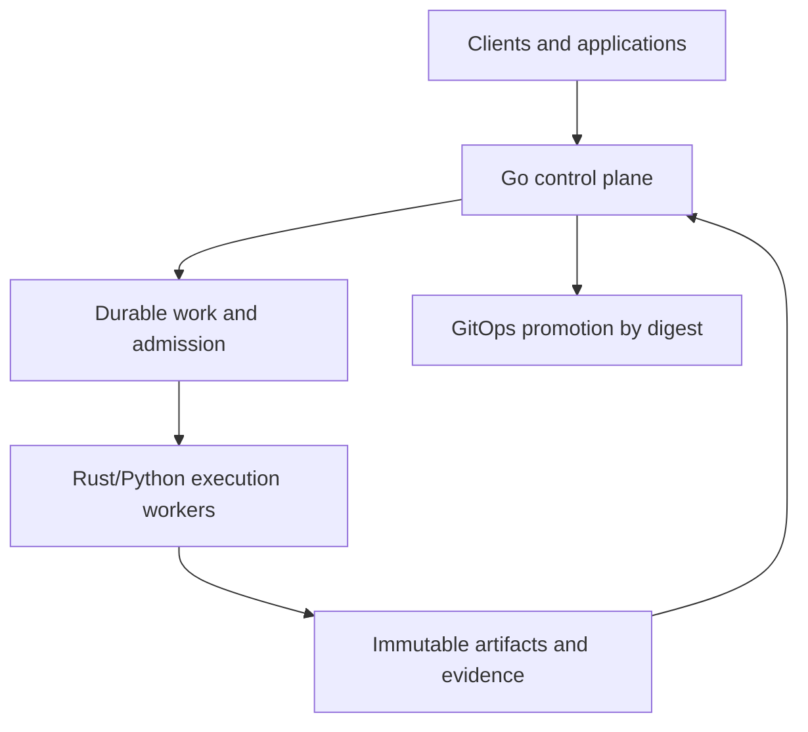

## 3. Architecture overview

### 3.1 Planes and process boundaries

| Plane | Owns | Does not own | Primary processes |
|---|---|---|---|
| Experience | user interaction, SDK ergonomics, documentation | authorization decisions, durable truth | TypeScript apps; Python/TypeScript SDKs |
| Control | identity resolution, policy, durable lifecycles, quotas, reconciliation, outbox | scientific algorithms, GPU math | Go control-plane and runtime-gateway processes |
| Execution | parsing, feature work, training, evaluation, inference, agent step execution | business success transitions | Rust/Python workers and GPU processes |
| Evidence | immutable objects, manifests, catalog, signatures, retention state | workflow orchestration | object store, relational metadata, release tooling |
| Environment | cluster/cloud desired state and promotion | building or reinterpreting artifacts | separate foundation and GitOps repositories |

The control plane is synchronous at request validation and transaction boundaries, then asynchronous for durable work. A synchronous API may create and return an `Operation`; it MUST NOT hold an HTTP/RPC connection open for training, batch inference, data publication, or agent workflows. Online inference is the exception: it may use a synchronous or streaming data path through the runtime gateway, while any durable output artifact is published asynchronously and referenced in the response.

### 3.2 Language and trust boundaries

| Boundary | Permitted mechanism | Prohibited mechanism |
|---|---|---|
| Go service ↔ Rust/Python worker | Protobuf command/event plus immutable artifact reference | shared service database writes; language FFI for business workflow |
| Python ↔ Rust in-process hot path | narrow PyO3/ABI binding owned under `bio/bindings/` or `runtime/extensions/`, with parity and memory-safety tests | arbitrary cross-domain native extension |
| Service ↔ client | versioned external HTTP/OpenAPI façade and SDK | database schema, internal event, or internal Protobuf leakage |
| Worker ↔ object store | workload identity, scoped signed reference, digest verification | ambient user credential or mutable public URL |
| Agent ↔ tool | registered tool contract, delegated capability token, sandbox, receipt | shell/network access inherited from agent process |
| Monorepo ↔ environment repo | signed image/chart/schema digest and promotion evidence | copying source, rebuilding, or carrying long-lived cloud credentials |

### 3.3 Canonical authorities

| Question | Source of truth |
|---|---|
| Biological entity and reusable semantic feature meaning | `bio/` schemas, `bio/featurization/` contracts/catalog, and conformance corpus |
| Source acquisition, curation, split, feature materialization/cache projection, and dataset release | `data/` manifests, derivation plans, and catalog transactions |
| Model mathematics, model-specific feature requirements/views, and logical parameter state | `models/` package and model manifest |
| Training objective, phase, update, and checkpoint semantics | `training/` contracts and checkpoint manifest |
| Evaluation metric and promotion gate meaning | `evaluation/` suite and signed report |
| Inference preprocessing, decoding, ranking, and output meaning | `inference/` pipeline contract |
| Agent workflow, tools, policies, and step meaning | `agents/` definition, workflow, tool, and policy contracts |
| Durable operation and resource lifecycle | Go control-plane relational state |
| Kernel operation semantics | reference operation in `kernels/` |
| Deployed version | live GitOps commit referencing signed digests |

### 3.4 Deployment units

Source packages do not imply processes. The initial production deployment contains:

- one replicated Go `control-plane` composition root;
- one replicated Go `runtime-gateway` for authenticated online and streaming execution admission;
- one Rust `artifact-proxy`/transfer process where high-throughput transfer justifies it;
- Rust ingestion and feature-worker images;
- Python training, evaluation, inference, and agent-worker images;
- managed relational database, object storage, queue/event transport, cache only where reconstructible, and observability collectors; and
- Kubernetes batch resources admitted through Kueue and materialized with JobSet or plain Jobs according to workload topology.

A package becomes a separate service only when it needs an independent failure domain, trust boundary, scaling curve, data authority, or release cadence and the split has an approved ADR and migration. Code organization alone is not evidence for a service.

### 3.5 Initial critical-path technology allowlist

The production critical path is deliberately narrow. A technology being discussed in an appendix or capability catalog does not make it an active dependency.

| Status | Technology/capability | Permitted use before activation |
|---|---|---|
| `ACTIVE` | native PyTorch | model, autograd, optimizer, single-process and distributed execution substrate |
| `ACTIVE` | DeviceMesh/DTensor and FSDP2 | native topology, placements, sharding, and data-parallel execution after their owning wave |
| `ACTIVE` | PyTorch Distributed Checkpoint | checkpoint storage/planning behind Mindclade checkpoint semantics |
| `ACTIVE` | NCCL | qualified CUDA collective transport; not a lifecycle owner |
| `ACTIVE` | Kueue and JobSet | batch quota/admission and coordinated Kubernetes workload materialization beginning in Wave 5 |
| `ACTIVE` | PyTorch reference kernels | required correctness path for every initial model operation |
| `INTAKE` | TorchTitan | implementation patterns and selectively adopted upstream components; no independent control plane |
| `DEFERRED` | Megatron Core, DeepSpeed, Transformer Engine, TorchAO, Lightning/Fabric, TorchForge, Monarch, TileLang, custom CUDA optimization | research/intake evaluation only; no production dependency, package, configuration surface, or compatibility commitment |

An intake capability activates only after profiling or a concrete workload proves a named gap; the owning wave defines a Mindclade contract, reference comparison, state/checkpoint/recovery mapping, security/license review, measurable benefit threshold, rollback, and removal path. Wave 6 is the earliest default activation point for optimized providers and kernels. Kueue/JobSet are the only listed technologies that activate earlier for a process boundary rather than measured numerical performance.
