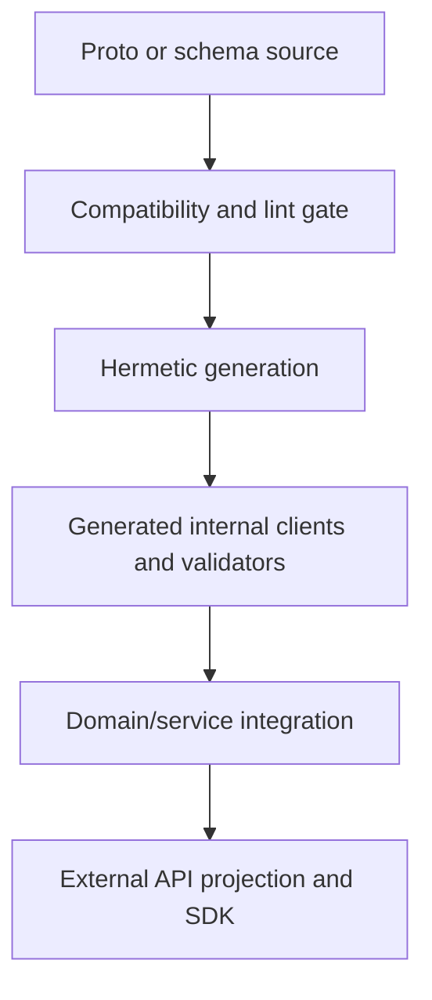

## 6. Contract and compatibility model

### 6.1 Contract authority

| Concern | Authority | Representation | Consumer rule |
|---|---|---|---|
| Internal RPC, commands, lifecycle resources, events | `protocols/proto/` and `protocols/events/` | Protobuf packages with major version in package name | use generated client; never copy message structs |
| Artifact, dataset, feature requirement/manifest/bundle, transform spec/graph/execution-plan/state/receipt/lineage, checkpoint, model, evaluation, plan, tool, workflow, agent, configuration | `protocols/schemas/` | JSON Schema 2020-12 with stable `$id` and `schema_version` | validate on every trust boundary; store schema ID with document |
| External product API | service-owned projection | OpenAPI generated from an explicitly curated façade | SDK wraps transport; internal messages do not leak |
| Service persistence | owning service migrations | relational DDL and constraints | private implementation; no shared database client across services |
| In-process scientific API | owning domain package | typed Python/Rust/Go interfaces | semantic owner controls compatibility |
| GPU operation | `kernels/api/` plus reference implementation | typed operation/signature/capability contract | optimized implementations register only after qualification |

JSON Schema is used for inspectable, durable, human-authored, or artifact-carried documents. Protobuf is used for bounded messages and service interaction. Large arrays, model weights, features, datasets, and reports are never embedded in either; they are immutable artifacts referenced by digest and media type.

### 6.2 Canonical identifiers and terminology

Identifiers are opaque, globally unique, lowercase string values with a type prefix in text form. Database keys may use UUIDv7 or equivalent sortable binary representation, but clients never infer time, tenant, or type from bytes. Artifact identity is a cryptographic digest, not a mutable database ID.

| Term | Definition and lifetime |
|---|---|
| `Operation` | client-visible long-running command record; created atomically with the requested resource or rejection; reaches one terminal result |
| `Job` | durable desired work and policy envelope owned by the control plane; may have multiple runs after explicit retry/resume |
| `Run` | one logical execution with frozen inputs, configuration, and plan; training and agent runs have specialized manifests |
| `Attempt` | one fenced lease/admission epoch for a run; duplicate or stale attempts cannot commit |
| `Workload` | scheduler-specific execution materialization such as a Kubernetes Job/JobSet; reconstructible from plan and attempt |
| `Phase` | named node in a versioned training or workflow phase graph; not a scheduler status |
| `ExecutablePlan` | immutable, validated mapping from semantic work to topology, providers, resources, and qualified capability digests |
| `Snapshot` | immutable view of an external source, dataset input set, evaluation input set, or logical state at a defined frontier |
| `Checkpoint` | atomically committed model/training logical state plus progress frontier and integrity manifest |
| `Artifact` | immutable bytes plus manifest addressed by digest; catalog metadata may add discovery without changing bytes |
| `Release` | immutable subject digest plus policy version, qualification evidence, approval, signature, and revocation state |

Required IDs include `TenantId`, `ProjectId`, `PrincipalId`, `RequestId`, `TraceId`, `OperationId`, `JobId`, `RunId`, `AttemptId`, `WorkloadId`, `PlanId`, `PhaseId`, `ArtifactDigest`, `FeatureRequirementSetDigest`, `FeatureKeyDigest`, `FeatureBundleDigest`, `ModelFeatureViewDigest`, `TransformSemanticKey`, `TransformExecutionPlanDigest`, `FitSemanticKey`, `TransformStateArtifactDigest`, `FitReceiptDigest`, `LineageMapArtifactDigest`, `DatasetVersionId`, `ModelReleaseId`, `CheckpointId`, `AgentDefinitionId`, `AgentVersion`, `AgentRunId`, `AgentStepId`, and `LeaseEpoch`. The same names and types MUST be used in Protobuf, schemas, SDKs, database mappings, events, logs, and examples.

### 6.3 Lifecycle contracts

Generic long-running resources use these states:

```text
Operation: PENDING -> RUNNING -> {SUCCEEDED | FAILED | CANCELLED}
Job:       ACCEPTED -> VALIDATING -> PLANNED -> QUEUED -> RUNNING
           -> {SUCCEEDED | FAILED | CANCELLED}
           with RUNNING -> RECOVERING -> QUEUED for a policy-approved resume
Run:       CREATED -> READY -> ADMITTED -> EXECUTING -> FINALIZING
           -> {COMPLETED | FAILED | CANCELLED}
Attempt:   LEASED -> STARTING -> ACTIVE -> DRAINING
           -> {COMPLETED | FAILED | PREEMPTED | FENCED | CANCELLED}
Release:   DRAFT -> QUALIFYING -> CANDIDATE -> APPROVED -> PUBLISHED
           -> {SUPERSEDED | REVOKED}
```

Transitions are allow-listed database operations with expected version and actor. Terminal states are immutable except release revocation/supersession, which creates a new audited transition without rewriting prior evidence. Retry creates a new attempt or run according to policy; it never rewinds a terminal record in place.

### 6.4 Representative common contract

```proto
message ResourceIdentity {
  string tenant_id = 1;
  string project_id = 2;
  string resource_id = 3;
  int64 resource_version = 4;
}

message CommandContext {
  string request_id = 1;
  string idempotency_key = 2;
  string principal_id = 3;
  string traceparent = 4;
  google.protobuf.Timestamp deadline = 5;
}

message EventEnvelope {
  string event_id = 1;
  string event_type = 2;
  uint32 event_version = 3;
  ResourceIdentity subject = 4;
  google.protobuf.Timestamp occurred_at = 5;
  string producer = 6;
  uint64 lease_epoch = 7;
  bytes payload = 8;
  string payload_digest = 9;
}
```

Events are immutable facts in past tense. Consumers deduplicate by `event_id`, verify subject tenant and schema, and update projections transactionally. Unknown event versions are quarantined, not partially interpreted. Queue delivery is at least once; handlers therefore MUST be idempotent.

### 6.5 Code generation flow



Protobuf outputs for Go, Python, Rust, and TypeScript are committed under `protocols/generated/` with generator headers because they are consumed across native workspaces and must be reviewable without running toolchains. CI regenerates them in a clean environment and fails on drift. Their public API is still the source `.proto`, never the generated layout.

JSON Schema validators, database bindings, OpenAPI bundles, documentation, and SDK transport layers are produced by Bazel into declared outputs. A released SDK may include generated transport source in its package, but hand-authored façade code lives under `sdk/<language>/src/` and is tested against the service compatibility matrix. Build outputs are not committed unless an ecosystem requires source distribution and the exception is documented. Generated files are never edited manually.

### 6.6 Compatibility policy

- Protobuf package majors use `mindclade.<domain>.vN`. Within a major, additions MUST be backward compatible; field numbers and enum values are never reused; deletion follows reserve-and-deprecate. A breaking change creates `vN+1` and a dual-read/dual-write migration.
- Internal rolling deployments MUST support the currently deployed schema and the immediately preceding compatible schema. An event consumer supports all non-retired event versions present in the retention window.
- JSON Schema has immutable `$id`, explicit semantic `schema_version`, canonical serialization rules, and migration functions. Readers MUST accept the current and immediately preceding minor version; long-lived artifacts retain readers or an offline migration for every supported release.
- External APIs and Python/TypeScript SDKs use SemVer. A released SDK minor supports the current service API and the previous service minor. Breaking removals require deprecation for at least two SDK minor releases and 90 days unless an active security issue requires faster revocation.
- Model, dataset, checkpoint, kernel, agent, tool, workflow, policy, and kit releases are independently versioned and identified by digest. Compatibility is declared as machine-readable constraints, not inferred from names.
- Database migrations are expand/migrate/contract. A deployable remains compatible with the previous database schema during rollout and rollback.

### 6.7 Idempotency, consistency, and deadlines

A command transaction inserts or reads the idempotency record, validates canonical request hash, mutates the resource, writes audit, and inserts outbox rows atomically. Reuse of a key with a different hash returns a conflict. Idempotency records live at least as long as the maximum client retry and event-redelivery window and longer for irreversible publication commands.

All mutating resources use optimistic versioning. Worker commits additionally require matching `AttemptId` and `LeaseEpoch`. Deadlines are absolute UTC timestamps propagated across RPC, queue command, and worker context. Cancellation is a desired-state transition; dispatchers and workers acknowledge it, stop at safe points, commit valid partial evidence where allowed, and terminate within the workload-specific grace period.

### 6.8 Contract stabilization schedule

Wave 1 stabilizes only the cross-system contract kernel:

```text
identifiers and ResourceRef
CommandContext and EventEnvelope
Operation, Job, Run, and Attempt
ArtifactRef and EvidenceRef
idempotency, resource version, and LeaseEpoch
configuration resolution and redacted configuration digest
ReleaseManifest
```

The kernel defines extension-safe envelopes and references, not placeholder fields for future domains. Domain contracts stabilize just in time with their first real vertical: biological identity and dataset contracts in Wave 2S; inference request/result in Wave 2P; feature/transform/model/training/checkpoint/evaluation contracts at Wave 2S qualification and Wave 3 graduation; fitted-transform state contracts only with their first exercised fit/apply workload; bounded remote feature/transform command/event protocols in Wave 4; distributed topology/plan contracts in Wave 5; kernel/provider contracts in Wave 6; agent/tool/workflow contracts in Wave 7; kit and deployment contracts immediately before their first supported release.

Before stabilization, a domain schema remains experimental, cannot be consumed by a supported external SDK, and carries no long-term compatibility promise. After stabilization, Section 6.6 applies. No future schema directory or generated client is created merely to reserve a name.

Appendices A9, A10, A18, A19, A23, and A28 contain the detailed build, protocol, service, SDK, artifact, and database contracts.
