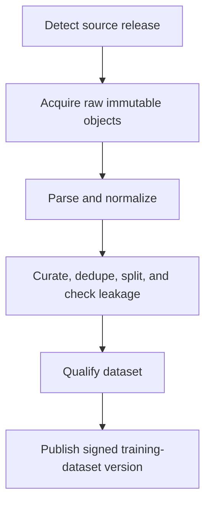
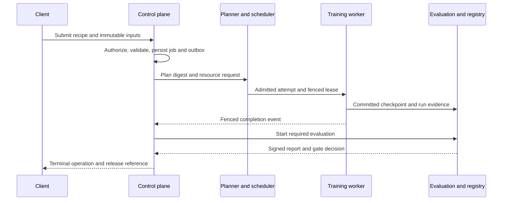
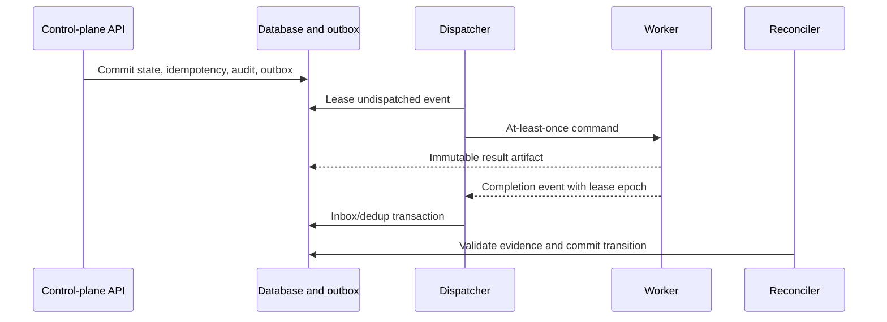
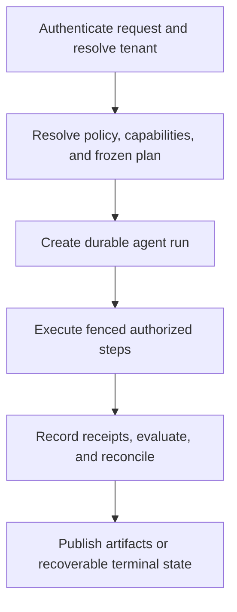
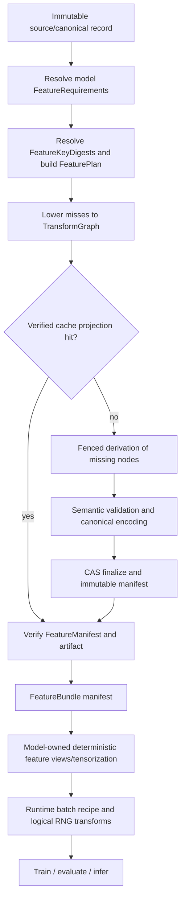

## 8. End-to-end execution flows

Each flow below identifies the boundary identifiers, durable truth, atomicity, retry owner, evidence, and recovery. Artifact references mean digest, media type, schema ID/version, size, tenant/classification, and authorization context.

### 8.1 Source data to released training dataset

| Boundary | IDs carried | Atomic/durable action | Retry owner and recovery | Evidence |
|---|---|---|---|---|
| discovery → acquisition | tenant/project, source, source release, snapshot, object | snapshot intent and outbox are one transaction | control plane retries discovery; connector cursor is durable | source metadata, license/use policy, discovery receipt |
| acquisition → parsing | snapshot, source object, raw digest | verified CAS finalize before completion event | Rust worker resumes chunks; mismatch quarantines | checksum, headers, byte receipt, worker/build identity |
| parsing → normalization | raw digest, parser/schema version | immutable parsed artifact | stage retry from raw; typed rejects retained | parser receipt, warnings, malformed corpus result |
| normalization → curation | entity IDs, normalized digest, policy | immutable normalized shards and lineage | deterministic partition retry | transform/code/schema digests |
| curation → qualification | curation/split/leakage policy, dataset candidate | candidate catalog row references complete objects | failed shards recompute; policy failure blocks | dedupe/leakage/split/quality reports |
| qualification → publication | dataset version, manifest digest, approval | release row, audit, and outbox commit atomically | publisher replays idempotently; no mutable overwrite | signed manifest, dataset card, policy and approver |

Raw, derived, and report objects are durable; worker scratch, caches, and scheduler objects are reconstructible. Trust rises from untrusted external bytes to parsed/quarantined to policy-qualified release. Revocation creates a new catalog state, finds dependent models/runs, and blocks new admission.

### 8.2 Model definition through promoted model

The model definition pins feature/output/logical-state contracts. A reference kernel path makes the model runnable before optimized dispatch. A training task binds objective semantics; a recipe and topology compile to an executable plan. The committed checkpoint becomes input to an immutable model bundle. Evaluation produces release evidence; promotion publishes the exact bundle digest.

| IDs crossing | Transaction boundaries | Retry and recovery | Trust/evidence |
|---|---|---|---|
| model family/version, feature requirement set/model feature-view/input-contract digests, operation versions, training task/recipe, plan, run/attempt, checkpoint, evaluation snapshot, model release | plan publication; checkpoint commit; evaluation report commit; release decision are separate atomic transactions joined by digests | compile may rerun deterministically; training resumes only from committed checkpoint; evaluation shards retry by digest; promotion is idempotent | reference parity, plan attestation, batch receipts, checkpoint integrity, evaluation report, safety/model card, SBOM/signature/provenance |

A new optimized kernel or provider cannot change an already frozen plan. A failed gate leaves a candidate immutable but unpublished. Rollback selects the prior qualified model digest and never converts weights during incident response.

### 8.3 Training submission to release evidence

The request carries tenant/project, idempotency key, model/dataset/recipe digests, requested policy, and deadline. The control-plane transaction creates `Operation`, `Job`, audit, and outbox. Validation freezes a `TrainingRunManifest`; planning freezes `ExecutablePlan`. Kueue admission and JobSet materialization are reconstructible observations keyed by `RunId`, `AttemptId`, `PlanId`, and `LeaseEpoch`.

The worker owns safe retries inside an attempt; the control plane owns new attempts and recovery. A rank failure invalidates its attempt's uncommitted progress. A committed checkpoint contains logical state, optimizer/scaler/RNG, sampler/input progress, phase/update counters, topology, plan, provider and kernel evidence. Cancellation drains at a safe point or kills after grace. Evaluation begins only after the control plane validates terminal training evidence. Promotion remains a separate authorized decision.

### 8.4 Inference request to ranked scientific artifacts

| Stage | Boundary/trust | State and atomicity | Failure/retry | Evidence |
|---|---|---|---|---|
| authorize | user → gateway | policy decision and quota reservation | deny/timeout fail closed | decision ID, policy digest |
| preprocess | gateway → inference worker | validated input artifact or bounded body; cache key includes tenant/policy/model/schema | invalid input terminal; cache corrupt evicts | validation and feature receipt |
| admit/batch | worker → GPU scheduler | request/stream state; batch is reconstructible | overload retry-after; deadline cancels | queue/batch/model deployment IDs |
| execute | batch → model/kernels | immutable model/plan/kernel digests | safe worker retry only before committed terminal output | hardware, implementation, numerical diagnostics |
| generate/rank | raw outputs → scientific results | candidate artifacts finalize before result manifest | partial artifacts orphan-swept; deterministic re-run when declared | confidence/ranker versions, candidate lineage |
| deliver | result → client/catalog | online terminal frame and/or batch result transaction | stream resume only with explicit token/artifact | durable result manifest, audit, cost |

Tenant-incompatible requests never share a batch or cache entry. Streaming frames are reconstructible from durable artifacts only if the API advertises resumability; otherwise disconnect cancels according to request policy. Ranked output is a scientific result with provenance, not a safety or experimental guarantee.

### 8.5 Control-plane transaction through worker reconciliation

The request transaction is the only atomic boundary spanning business state, idempotency, audit, and outbox. Queue publication is not atomic with it and need not be. Dispatcher and worker crashes cause redelivery. The worker never writes domain tables. The completion consumer atomically records inbox/dedup and observation; reconciliation commits business status only if expected state, resource version, `AttemptId`, `LeaseEpoch`, plan digest, and artifact integrity match. A stale event is retained and ignored for transition. Poisoned delivery is quarantined and operator-replayable.

### 8.6 Contract definition to application

Contract source changes first. Compatibility and data-classification review precede generation. Committed internal generated clients integrate into domain libraries and service handlers. The service maps private database/domain values into the curated external API; OpenAPI generation and diff gates produce transport clients; SDKs add stable operations, pagination, retries, artifact helpers, and agent sessions; applications import only supported SDK packages.

IDs remain identical through the chain, but internal event IDs/lease epochs are exposed externally only when part of the supported resource contract. Service/database transactions remain private. A generation failure blocks integration; SDK tests run against current and previous supported service versions; removal follows deprecation. Evidence is schema diff, generation attestation, cross-language golden tests, API conformance, SDK package provenance, and application E2E result.

### 8.7 Agent request to resumable completion

The request carries `AgentDefinitionId`/version or digest, requested goal artifact, tenant/project, idempotency key, deadline, and budget ceiling. Resolution freezes agent, workflow, tools, model capability, policy, evaluation, and sandbox digests. The create transaction writes operation, run, budget reservation, audit, and first outbox event. Every step carries run/step/attempt/lease, capability token, input digest, deadline, and remaining budget.

Tool/model execution produces immutable observation and invocation receipts before emitting completion. The control plane validates receipt, policy, schema, side-effect key, budget, approval, and epoch, then commits the step and next workflow edge. Memory contains governed references and derived indexes; it is not authoritative. A crash redelivers the step; side-effecting tools deduplicate or require compensation/manual resolution. Policy change may block new steps; critical revocation cancels. Replay uses frozen receipts and cannot silently reissue a side effect. Completion publishes an agent-run manifest, policy/evaluation report, artifact lineage, and terminal operation.

### 8.8 Git revision to deployment, rollback, or revocation

| Stage | Immutable subject | Gate |
|---|---|---|
| source | protected Git revision and lockfiles | review, affected tests, contract compatibility |
| build | image/package/schema/model/kernel/deploy digest | hermetic builder, reproducibility policy, SBOM, provenance |
| qualify | subject digest plus evidence bundle | risk-specific CPU/GPU/distributed/recovery/security/scientific gates |
| sign/publish | registry/object-store artifact | trusted CI identity, vulnerability/license policy, approvals |
| promote | GitOps commit referencing subject digest | environment policy, signatures, non-revocation, change approval |
| reconcile | live resource and observed digest | health/SLO/canary checks; no rebuild |
| rollback/revoke | prior digest or revocation record | authorized transaction, audit, dependency impact analysis |

Rollback is a desired-state change to a previously qualified digest. Revocation blocks new scheduling/download and may trigger rollback/quarantine of active deployments and dependent releases. Evidence and prior artifacts remain retained according to policy.

---

### 8.9 Canonical input to reusable feature bundle and model batch

| Boundary | Authoritative identity | Retry/reuse law | Evidence |
|---|---|---|---|
| canonical record → semantic feature | canonical record/artifact digest + `FeatureContract` + `FeatureKeyDigest` | exact semantic identity only; changed source, parameter, snapshot, implementation class, or contract creates a miss | feature derivation manifest and validators |
| derivation → publication | `FeatureKeyDigest`, `AttemptId`, `LeaseEpoch`, output `ArtifactDigest` | duplicate attempts may converge on the same digest; different digests for one deterministic key are quarantined | attempt/fencing receipt, output digest, determinism result |
| semantic features → `FeatureBundle` | sorted role → feature manifest/artifact references | bundles reference individual artifacts rather than copying them | bundle manifest and provenance closure |
| bundle → model input | model release/feature-view contract digest | model-specific deterministic views may be cached only under model-owned versioned contracts | model-input derivation receipt |
| model input → runtime batch | `BatchRecipe`, stable sample IDs, logical RNG derivations | stochastic transforms are replayed from receipts rather than treated as shared feature cache | `BatchReceipt`/evaluation or inference evidence |

The artifact catalog and feature manifests remain durable scientific evidence. A cache index, local SSD copy, memory cache, compiled tensor view, or object-store prefix is reconstructible and cannot become a source of truth. Cross-tenant CAS deduplication is permitted only behind authorization that does not disclose artifact existence or grant access across security domains.
