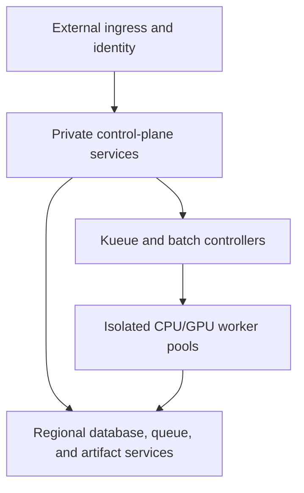

## 12. Deployment architecture

### 12.1 Repository estate and ownership

| Repository | Owns | Receives from this monorepo | MUST NOT own |
|---|---|---|---|
| Mindclade monorepo | source, contracts, service deployment packages, build/qualification/release evidence | external source/dependency inputs | live environment state or foundation credentials |
| organization `.github` | shared workflow/template implementation and community defaults | caller identity and CI evidence schema | repository settings, application source, release promotion |
| `github-config` | organization policy, teams, repository/ruleset/environment settings, Actions/OIDC policy | component/release/repository identities | workflow implementation, cloud or workload state |
| `bootstrap` | minimum durable state/trust/recovery roots and break-glass | identity and recovery requirements | normal application infrastructure or deployment |
| `infrastructure-live` | networks, projects/accounts, clusters, databases, delegated KMS, registries, workload identity | signed `EnvironmentPlan`/requirements and released modules | application rebuild, release selection, live Kubernetes overlays |
| `gitops` | desired image/package/config digests, environment approvals and rollout | signed release manifest, deployment bundle, infrastructure exports | source compilation, mutable tags, secrets in Git |

These are canonical logical repository names in the `mindclade` organization. The monorepo remote and Go module are `github.com/mindclade/mindclade`; operational remotes retain their corresponding lowercase repository names. Appendix A3 provides their exact target trees and operational contracts. Cross-repository handoff is always by immutable digest and verified schema. A live repository may reject an artifact for policy, but cannot reinterpret or patch it.

### 12.2 GCP/GKE reference topology

The governed environments are development, staging, and production. The initial production profile uses regional GKE in primary region `us-central1`, with isolated recovery in `us-east4`, private nodes, Workload Identity Federation, Gateway/ingress with managed TLS and WAF controls, and separate namespaces/service accounts/network policies for control, trusted scientific execution, and agent sandboxes. Control-plane services use regional anti-affinity and disruption budgets. Training and batch inference use Kueue resource flavors and quotas; JobSet describes multi-role/multi-node topology; cluster autoscaling provisions approved node pools. GPU inference uses dedicated latency pools; training uses batch pools with checkpoint-aware preemption policy. Region selection does not imply quota, capacity, protected apply, or recovery qualification.

Managed dependencies are Cloud SQL for PostgreSQL-compatible durable state, GCS for CAS artifacts, Artifact Registry for images/packages, Secret Manager and Cloud KMS, and Pub/Sub or an explicitly selected managed transport for event delivery. The outbox preserves correctness if transport is unavailable. Redis/Memorystore is permitted only for reconstructible caching/rate assistance, never locks or durable workflow truth. Telemetry exports through in-cluster OpenTelemetry collectors to approved backends.

### 12.3 Workload placement and scaling

| Workload | Placement | Scaling and isolation |
|---|---|---|
| Go API/reconcilers | general CPU pool | HPA on saturation/latency; stable shard ownership; DB connection budget |
| Rust ingestion/feature | CPU/memory/throughput pools | queue depth and bytes; egress and source-specific concurrency limits |
| Online inference | dedicated qualified GPU pools | model/profile-aware autoscaling, bounded batching, tenant fairness |
| Training/evaluation/batch inference | Kueue-admitted GPU pools | quota/fair sharing, gang admission, JobSet topology, checkpoint-aware drain |
| Agent coordination | trusted CPU pool | run/step queue and budget; no arbitrary tools in process |
| Agent tools | restricted sandbox pool | per-tool resource/egress profile, stronger runtime for untrusted code when activated |

Schedulers select only hardware profiles named in executable plans and qualification records. A substitution across accelerator, driver, compiler, kernel, or precision envelope requires re-planning and possibly requalification. Node termination signals are translated to checkpoint/drain deadlines; the control plane decides recovery.

### 12.4 Configuration and secrets

Configuration layers are: immutable code defaults, versioned schema, environment-class configuration artifact, tenant/project policy, and request/run configuration. Resolution is deterministic and emits a redacted config digest. Environment variables are process bootstrap only; they do not become a distributed configuration system. Dynamic safety/policy changes are versioned control-plane resources. Secrets are references resolved at the last responsible moment by workload identity and never embedded in plans, manifests, images, Git, logs, or caches.

### 12.5 On-premises and multicloud extension

An on-prem deployment must provide the standard ports and publish an `EnvironmentCapability` containing identity issuer/trust roots, scheduler classes, storage durability/consistency, database/queue semantics, accelerator/driver/kernel matrix, registry/import path, network/egress policy, secrets/KMS behavior, telemetry buffer/export, backup/restore objectives, and disconnected-operation limits. MCDK validates a plan against these capabilities before admission.

The minimum supported on-prem profile has Kubernetes, a PostgreSQL-compatible HA database, S3-compatible strongly read-after-write object storage or an approved consistency adapter, OCI registry, durable at-least-once queue, OIDC/workload identity bridge, secrets/KMS integration, and OpenTelemetry collection. A profile that cannot meet a required invariant is explicitly unsupported; the platform does not silently weaken fencing, tenant isolation, artifact integrity, or recovery.

### 12.6 Deployment qualification

Before an environment class is supported, it passes install-from-clean-foundation, workload identity and tenant isolation, contract migration, image/signature policy, artifact integrity, queue outage/outbox recovery, database failover/restore, Kueue fairness, GPU scheduling/preemption, checkpoint resume, inference load shedding, agent sandbox escape/egress tests, observability, cost attribution, rolling deploy/rollback, region/failure-domain recovery, and break-glass audit. Environment capability and results are immutable evidence referenced by releases.
